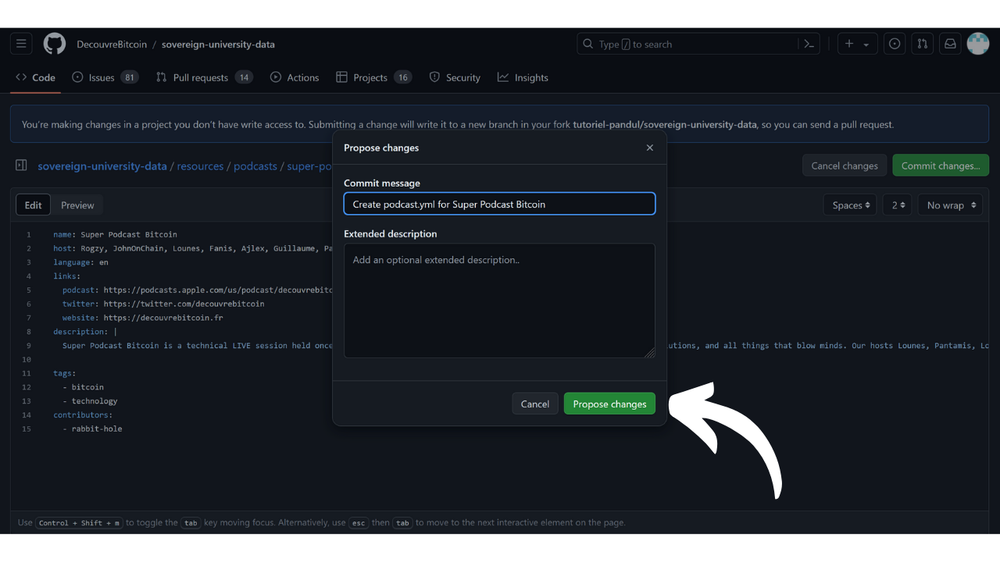
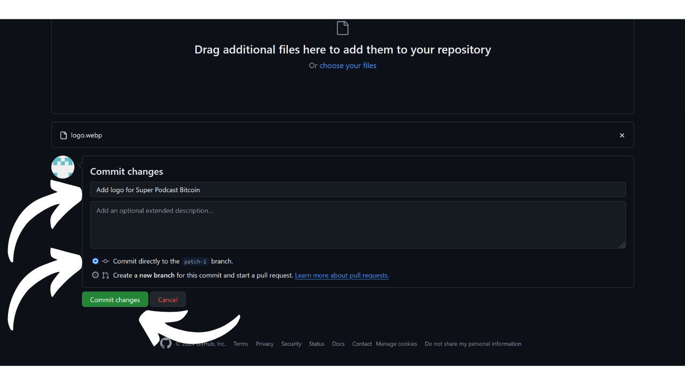

Миссия PlanB - предоставлять образовательные ресурсы высшего качества о Биткойне на максимально возможном количестве языков. Все контент, публикуемый на сайте, является открытым и размещается на GitHub, что позволяет любому желающему участвовать в обогащении платформы.

Вы хотите добавить подкаст о Биткойне на сайт сети PlanB и увеличить его видимость, но не знаете как? Этот учебник для вас!

- Во-первых, у вас должен быть аккаунт на GitHub. Если вы не знаете, как его создать, мы подготовили [подробный учебник, который поможет вам](https://planb.network/tutorials/others/create-github-account).
- Перейдите в [репозиторий GitHub PlanB, посвященный данным](https://github.com/DecouvreBitcoin/sovereign-university-data/tree/dev/resources/podcasts) в раздел `resources/podcasts/`:

- Нажмите в верхнем правом углу на кнопку `Add file`, затем на `Create new file`:

- Если вы никогда ранее не вносили вклад в контент сети PlanB, вам нужно будет создать свою копию оригинального репозитория. Создание форка репозитория означает создание копии этого репозитория на вашем собственном аккаунте GitHub, что позволяет работать над проектом, не влияя на оригинальный репозиторий. Нажмите на кнопку `Fork this repository`:

- Затем вы попадете на страницу редактирования GitHub:

- Создайте папку для вашего подкаста. Для этого в поле `Name your file...` напишите название вашего подкаста строчными буквами с дефисами вместо пробелов. Например, если ваше шоу называется "Super Podcast Bitcoin", вы должны написать `super-podcast-bitcoin`:

- Чтобы подтвердить создание папки, просто добавьте слэш после названия вашего подкаста в том же поле, например: `super-podcast-bitcoin/`. Добавление слэша автоматически создает папку, а не файл:

- В этой папке вы создадите первый YAML-файл с именем `podcast.yml`:

- Заполните этот файл информацией о вашем подкасте, используя этот шаблон:

```yaml
name: 
host: 
language: 
links:
  podcast: 
  twitter: 
  website: 
description: |
  
tags:
  - 
  - 
contributors:
  - 
```

Вот детали, которые нужно заполнить для каждого поля:

- **`name`**: Укажите название вашего подкаста.
- **`host`**: Перечислите имена или псевдонимы ведущих или хоста подкаста. Каждое имя должно быть разделено запятой.
- **`language`**: Укажите код языка, на котором говорят в вашем подкасте. Например, для английского, отметьте `en`, для итальянского `it`...

- **`links`**: Предоставьте ссылки на ваш контент. У вас есть два варианта:
	- `podcast`: ссылка на ваш подкаст,
	- `twitter`: ссылка на профиль в Twitter подкаста или организации, которая его производит,
	- `website`: ссылка на веб-сайт подкаста или организации, которая его производит.
- **`description`**: Добавьте короткий абзац, описывающий ваш подкаст. Описание должно быть на том же языке, что указан в поле `language:`.
- **`tags`**: Добавьте два тега, связанных с вашим подкастом. Примеры:
    - `биткоин`
    - `технологии`
    - `экономика`
    - `образование`...

- **`contributors`**: Укажите ваш ID участника, если у вас есть таковой.

Например, ваш YAML-файл может выглядеть так:

```yaml
name: Супер Подкаст Биткоин
host: Рогзи, ДжонОнЧейн, Лунес, Фанис, Аджлекс, Гийом, Пантамис, Состен, Лоик
language: ru
links:
  podcast: https://podcasts.apple.com/us/podcast/decouvrebitcoin-replay/id1693844092
  twitter: https://twitter.com/decouvrebitcoin
  website: https://decouvrebitcoin.fr
description: |
  Супер Подкаст Биткоин - это техническая прямая трансляция, проводимая раз в неделю в Twitter, чтобы глубоко погрузиться в протокол Биткоина, решения второго уровня и все то, что поражает воображение. Наши ведущие Лунес, Пантамис, Лоик и Состен ответят на ваши вопросы и предложат самое техническое шоу о Биткоине в мире.

tags:
  - биткоин
  - технологии
contributors:
  - кроличья-нора
```


- Как только вы закончите вносить изменения в этот файл, сохраните их, нажав кнопку `Commit changes...`:

- Добавьте заголовок для ваших изменений, а также короткое описание:

- Нажмите зеленую кнопку `Propose changes`:

- Затем вы попадете на страницу, которая суммирует все ваши изменения:

- Нажмите на изображение вашего профиля GitHub в верхнем правом углу, затем на `Your Repositories`:

- Выберите ваш форк репозитория PlanB Network:

- В верхней части окна вы должны увидеть уведомление с вашей новой веткой. Вероятно, она называется `patch-1`. Нажмите на нее:

- Теперь вы находитесь в своей рабочей ветке:

- Вернитесь в папку `resources/podcast/` и выберите папку подкаста, которую вы только что создали в предыдущем коммите: 
- В папке вашего подкаста нажмите кнопку `Add file`, затем `Create new file`:

- Назовите эту новую папку `assets` и подтвердите ее создание, добавив слэш `/` в конце:

- В этой папке `assets` создайте файл с именем `.gitkeep`:

- Нажмите кнопку `Commit changes...`:

- Оставьте заголовок коммита по умолчанию и убедитесь, что отмечен флажок `Commit directly to the patch-1 branch`, затем нажмите `Commit changes`:

- Вернитесь в папку `assets`:

- Нажмите кнопку `Add file`, затем `Upload files`:

- Откроется новая страница. Перетащите логотип вашего подкаста в указанную область. Это изображение будет отображаться на сайте сети PlanB: 
- Будьте внимательны, изображение должно быть квадратным, чтобы лучше подходить для нашего сайта: 
- После загрузки изображения убедитесь, что отмечен чекбокс `Commit directly to the patch-1 branch`, затем нажмите на `Commit changes`: 
- Будьте внимательны, ваше изображение должно быть названо `logo` и должно быть в формате `.webp`. Полное имя файла должно быть следующим: `logo.webp`: 
- Вернитесь в вашу папку `assets` и нажмите на промежуточный файл `.gitkeep`: 
- Находясь в файле, нажмите на три маленькие точки в верхнем правом углу, затем на `Delete file`: 
- Убедитесь, что вы все еще находитесь на той же рабочей ветке, затем нажмите на кнопку `Commit changes`: 
- Добавьте заголовок и описание к вашему коммиту, затем нажмите на `Commit changes`: 
- Вернитесь к корню вашего репозитория: 
- Вы должны увидеть сообщение о том, что ваша ветка претерпела изменения. Нажмите на кнопку `Compare & pull request`: 
- Добавьте четкий заголовок и описание к вашему PR: 
- Нажмите на кнопку `Create pull request`: 
Поздравляем! Ваш PR был успешно создан. Теперь администратор рассмотрит его и, если все в порядке, объединит с основным репозиторием сети PlanB. Вы увидите свой подкаст на сайте через несколько дней.

Пожалуйста, следите за ходом вашего PR. Администратор может оставить комментарий с просьбой предоставить дополнительную информацию. Пока ваш PR не будет подтвержден, вы можете просматривать его во вкладке `Pull requests` на GitHub-репозитории сети PlanB: 
Большое спасибо за ваш ценный вклад! :)