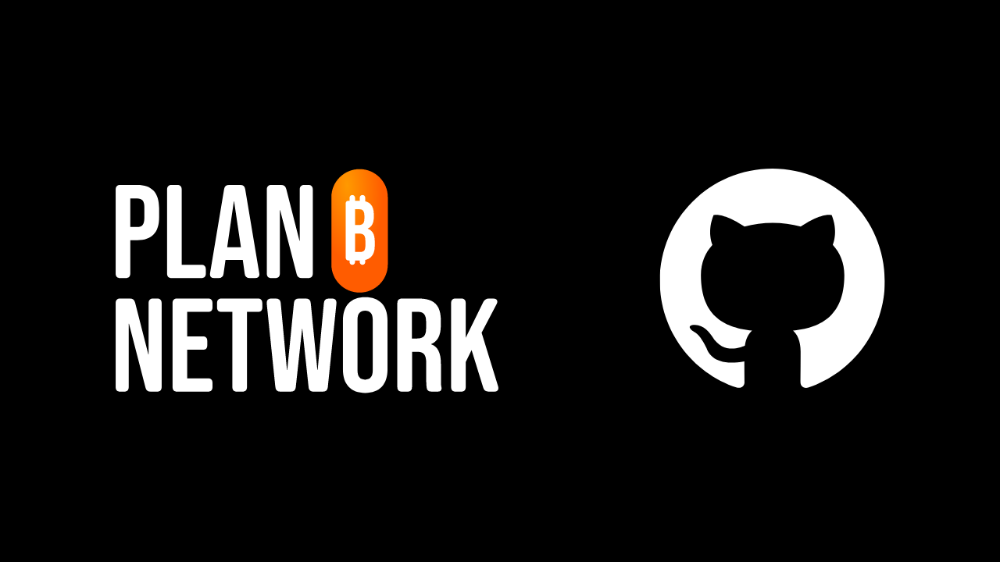
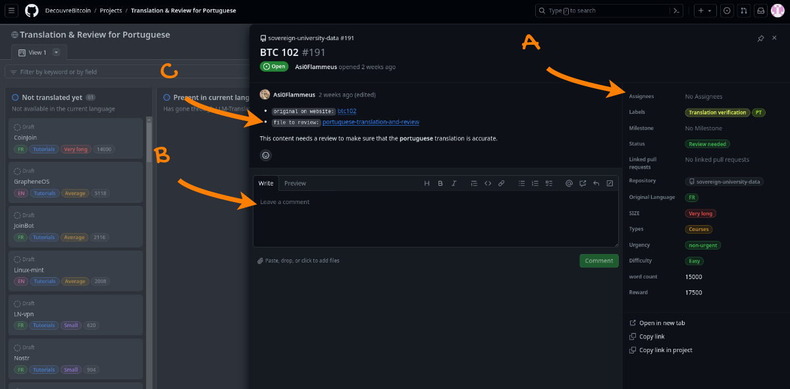

## TL;DR 
Si vous souhaitez réviser du contenu pour PlanB Network, rendez-vous sur la [page projet associée](https://github.com/PlanB-Network/bitcoin-educational-content/projects?query=is%3Aopen) à votre langue. Sélectionnez le contenu que vous souhaitez réviser, commentez pour nous informer que vous prenez en charge la tâche, et publiez une PR une fois terminée sur la branche associée à la langue. 

Si vous n'avez pas compris la partie ci-dessus, ne vous inquiétez pas, ce tutoriel est fait pour vous !

---

## Qu'est-ce que PlanB Network ?

Planb.network est une toute nouvelle plateforme pour apprendre sur Bitcoin via de nombreux cours et tutoriels pour tous. Actuellement, tout notre contenu est open-source, hébergé sur un repo GitHub, et ouvert aux contributions pour la révision et la création de contenu.

PlanB.network vise à devenir la place publique du cyberespace Bitcoin, en reliant et en encourageant les communautés Bitcoin à travers le monde.

## Pourquoi Contribuer ?

PlanB.network est fondamentalement multilingue, car notre objectif est de rendre les ressources sur Bitcoin accessibles à tous dans le monde. Nous croyons que la langue ne devrait pas être une barrière à la monnaie souveraine.

Nous utilisons donc une approche Humain x AI pour atteindre cet objectif. Grâce à notre [programme simple](https://github.com/Asi0Flammeus/LLM-Translator), nous pouvons automatiquement traduire notre contenu dans de nombreuses langues. Cependant, avant de le publier, nous avons besoin qu'une personne qui parle couramment la langue le révise pour s'assurer que le contenu est intelligible et exempt de termes inappropriés.

Si vous souhaitez nous rejoindre pour construire ce projet éducatif afin de promouvoir l'éducation sur Bitcoin dans votre communauté, vous pouvez commencer par réviser un cours ou un tutoriel.

De plus, comme Découvre Bitcoin (DB) est en charge d'évaluer les contributions et que nous (DB) chérissons le modèle *Value4Value*, nous récompenserons les contributions de révision. La récompense sera basée sur la longueur du contenu, l'exactitude linguistique de notre auto-traduction et la difficulté du contenu.

## Dois-je savoir comment fonctionne GitHub ?

Vous n'avez pas besoin d'être un expert de GitHub pour faire une révision de contenu.
Bien qu'il soit toujours mieux de comprendre ce que vous faites (et pourquoi), vous pouvez simplement suivre les instructions ci-dessous pour contribuer.

Toutefois, si vous ne connaissez pas du tout le fonctionnement de Git et de GitHub et que vous souhaitez en savoir plus, vous pouvez découvrir [notre article d'introduction sur ces outils](https://planb.network/tutorials/others/basics-of-github). 

## 1. Créer un compte
* Créez un compte sur GitHub pour commencer à contribuer. Si vous souhaitez être guidé dans la manière de créer votre compte sur GitHub, nous avons également [un tutoriel détaillé](https://planb.network/tutorials/others/create-github-account).

## **2. Aller sur la page projet de votre langue**
* La [page projet](https://github.com/PlanB-Network/bitcoin-educational-content/projects?query=is%3Aopen) contient du contenu dans votre langue affiché sur un tableau Kanban.
* Recherchez des cartes dans la colonne "Review Needed" (cf. **A**). Ce sont des issues que vous pouvez réviser.
* Chaque carte détaille (cf. **B**) :
	- **Type de Contenu** : Cours, tutoriel ou site web
	- **Difficulté du Contenu**
	- **Urgence**
	- **Nombre de Mots**
	- **Récompense Associée** : Basée sur les propriétés du contenu et la précision de la traduction (cf. [section Récompense](https://github.com/PlanB-Network/bitcoin-educational-content?tab=readme-ov-file#sat-reward))

## **3. Trouver du contenu à réviser**
* Dans la colonne "Review Needed", cliquez sur une carte.
* La carte comprend une description avec des liens vers le contenu original et le fichier à réviser (cf. **A**).
* Si vous souhaitez le réviser, laissez un commentaire pour nous dire que vous allez travailler dessus (cf. **B**).
* Cliquez sur le lien à côté du `Fichier à Réviser` (cf. **C**)

## **4. Réviser et modifier le contenu via l'interface GitHub**
* Vous pouvez maintenant voir l'interface GitHub du fichier à réviser.
* Le panneau de gauche vous permet de naviguer à travers votre branche (cf **A**) et les fichiers (cf **B**).
* Cliquez sur l'icône du stylo pour commencer la révision (cf **C**).

* Si c'est votre première fois, GitHub vous demandera de forker le dépôt.

* Ensuite, vous arriverez sur l'interface de l'Éditeur (cf. **A**), où vous pouvez voir le chemin du fichier et la branche correspondante (cf. **B**), et vous pouvez basculer entre le mode édition et le mode aperçu (cf. **C**).

NB. La révision est mieux faite dans la fenêtre de code avec le contenu original dans une fenêtre séparée à côté.

## **5. Commit les modifications**

* Lorsque vous souhaitez arrêter votre session de révision, vous pouvez commit vos modifications, même si la révision n'est pas terminée – c'est un peu comme si vous "sauvegardiez vos modifications sur GitHub".
* Cliquez sur le bouton "Commit Changes" (cf. **A**).

* Ajoutez un message descriptif sur votre changement (cf. **B**).
* Ajoutez plus de contexte dans la description si nécessaire (cf. **C**).
* Cliquez sur le bouton "Propose Changes" (cf. **D**).

* Cela ouvre une page de proposition de PR (Pull Request).

## **6. Créer une PR avec la branche dédiée**

* Vous pouvez vérifier que cette PR demande de fusionner votre branche dans la branche dédiée de la langue correspondante (cf. **A**).
* Donnez à la PR un nom descriptif (cf. **B**).
* Ajoutez du contexte dans la description (cf. **C**).
* Si non terminé, cliquez sur la flèche vers le bas à côté de "Create Pull Request" et sélectionnez "Draft PR" (cf. **D**).
* Cliquez sur "Draft Pull Request."
* Félicitations pour votre première PR !

## **7. Continuer la révision plus tard**
* Si vous n'avez pas terminé votre révision et que vous souhaitez continuer votre travail, allez sur votre fork du dépôt de contenu sovereign-university via votre profil GitHub.
* Sélectionnez la branche correspondante.
* Renommez la branche si nécessaire.
* Trouvez votre fichier de contenu et cliquez sur le bouton du stylo pour reprendre la révision.

## **8. Commit directement sur votre propre branche**
* Faites des commits pour valider les modifications directement sur votre branche à mesure que vous progressez.

## **9. Terminer et définir la PR comme prête pour révision**
* Allez dans l'onglet "Pull Requests".
* Sélectionnez votre PR.
* Cliquez sur "Ready for Review".

## 10. Attendre la révision
* Après approbation, Découvre Bitcoin vous contactera pour envoyer votre récompense via LN.
* Si vous souhaitez recommencer, retournez à l'étape 2 pour continuer à contribuer sur d'autres contenus.
* Si vous avez des remarques, questions ou commentaires sur ce projet, vous pouvez envoyer un DM sur Telegram à @asi0_flammeus.
