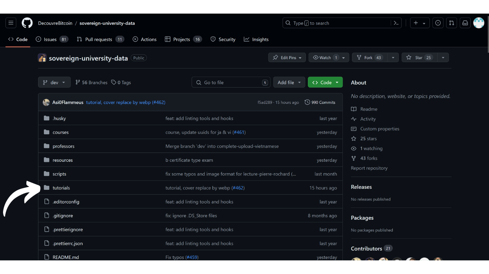
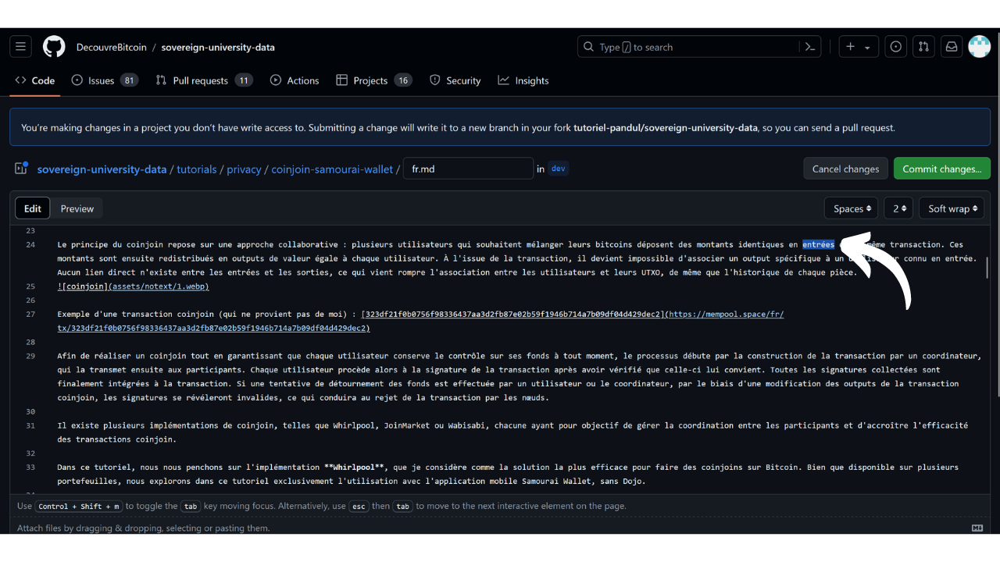
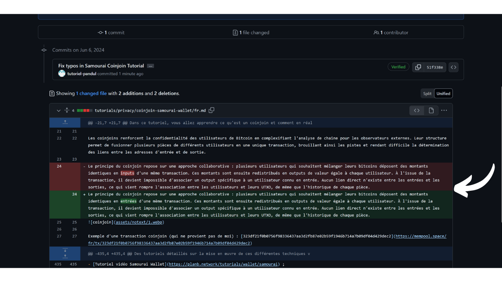

Die Mission von PlanB ist es, führende Bildungsressourcen über Bitcoin in möglichst vielen Sprachen bereitzustellen. Alle auf der Website veröffentlichten Inhalte sind Open-Source und werden auf GitHub gehostet, was es jedem ermöglicht, an der Bereicherung der Plattform teilzunehmen. Beiträge können verschiedene Formen annehmen: Korrekturlesen und Korrigieren bestehender Texte, Übersetzen in andere Sprachen, Aktualisieren von Informationen oder Erstellen neuer Tutorials, die auf unserer Website noch nicht verfügbar sind.

Wenn Sie beim Konsultieren eines unserer Bildungsinhalte (Tutorials, Schulungen, Ressourcen...) einen Fehler feststellen, sei es ein Rechtschreibfehler, Grammatik, ein kleiner Übersetzungsfehler in Ihrer Muttersprache oder sogar ein Tippfehler, wären wir sehr dankbar, wenn Sie selbst einen schnellen Korrekturvorschlag machen könnten.

Dieses Tutorial führt Sie Schritt für Schritt durch den Prozess der Korrektur dieser kleinen Fehler. Es ist ein Tutorial für Anfänger gedacht, die sich nicht in die Komplexitäten von Git wagen möchten. Wenn Sie jedoch mit Git vertraut sind, hier eine kurze Zusammenfassung: Sie müssen lediglich [das Datenrepository des PlanB Netzwerks](https://github.com/PlanB-Network/bitcoin-educational-content) forken, Änderungen in einem dedizierten Branch vornehmen und einen Pull Request gegen den `dev` Branch des Quell-Repositorys einreichen.

Bitte beachten Sie, dass, wenn Sie eine vollständige Überprüfung und Revision eines Dokuments planen, insbesondere für Inhaltsübersetzungen, ich Sie einlade, [dieses andere, detailliertere Tutorial](https://planb.network/tutorials/others/content-review-tutorial) zu konsultieren. Hier konzentrieren wir uns nur darauf, wie man eine schnelle Korrektur für einen kleinen Fehler vornimmt.

- Zuerst müssen Sie ein Konto auf GitHub haben. Wenn Sie nicht wissen, wie Sie ein Konto erstellen, haben wir [ein detailliertes Tutorial erstellt, um Sie zu führen](https://planb.network/tutorials/others/create-github-account).
- Gehen Sie zu [dem GitHub-Repository von PlanB, das den Daten gewidmet ist](https://github.com/PlanB-Network/bitcoin-educational-content):

- Hier finden Sie alle unsere Inhalte nach Teilbereichen organisiert.
- Wenn Sie ein Tutorial ändern möchten, gehen Sie zum Beispiel in den Ordner `tutorials`:

- Dort finden Sie dann die verschiedenen Kategorien von Tutorials auf unserer Website. Wenn Sie zum Beispiel ein Tutorial in der Kategorie `Privacy` ändern möchten, klicken Sie auf den entsprechenden Ordner:

- Wählen Sie dann den Ordner aus, der dem Inhalt entspricht, den Sie korrigieren möchten:

- In jedem Inhaltsordner finden Sie die Daten in verschiedenen Sprachen. Zum Beispiel entspricht die Datei `en.md` der englischen Version des Tutorials, während die Datei `fr.md` die französische Version darstellt. Wählen Sie die Datei aus, die der Sprache entspricht, die Sie ändern möchten: 
- Sie gelangen dann auf die GitHub-Seite des Inhalts. Stellen Sie sicher, dass Sie sich auf dem Dokument befinden, das Sie ändern möchten: 
- Klicken Sie auf das kleine Stiftsymbol oben links: 
- Wenn Sie noch nie zuvor Inhalte des PlanB Netzwerks beigetragen haben, müssen Sie Ihren Fork des Original-Repositorys erstellen. Ein Repository zu forken bedeutet, eine Kopie dieses Repositorys auf Ihrem eigenen GitHub-Konto zu erstellen, was es Ihnen ermöglicht, am Projekt zu arbeiten, ohne das Original-Repository zu beeinflussen. Klicken Sie auf den Button `Fork this repository`: 
- Sie gelangen dann auf die GitHub-Bearbeitungsseite:  - Nehmen Sie Ihre Textänderungen vor, um die Fehler zu korrigieren, die Sie entdeckt haben. Haben Sie keine Angst, Sie befinden sich derzeit auf Ihrem eigenen Fork, sodass dies vorerst keine Änderungen auf der PlanB Network-Website bewirken wird. Stellen wir uns zum Beispiel vor, ich habe das Wort "entrées" geändert, weil es einen Rechtschreibfehler hatte: 
- Sobald Ihre Korrekturen an diesem Dokument abgeschlossen sind, können Sie auf den grünen `Commit Changes...` Button klicken. Ein Commit ist wie eine Momentaufnahme Ihrer Arbeit zu einem bestimmten Zeitpunkt, die es ermöglicht, eine Historie der Änderungen zu bewahren: 
- Fügen Sie einen Titel für Ihre Änderungen hinzu, sowie eine kurze Beschreibung: 
- Klicken Sie auf den grünen `Propose changes` Button: 
- Sie gelangen dann auf eine Seite, die alle Ihre Änderungen zusammenfasst: 
- Wenn Sie nach unten scrollen, können Sie die spezifischen Änderungen sehen, die Sie vorgenommen haben: 
- Wenn alles für Sie passt und Sie Ihre Änderungen abgeschlossen haben, können Sie auf den grünen `Create Pull Request` Button klicken: 
- Sie gelangen auf die PR-Seite. Ein Pull Request ist eine Anfrage, die von einem Beitragenden gesendet wird, um anzugeben, dass sie Änderungen auf einem Branch in einem entfernten Repository vorgenommen haben und dass sie wünschen, dass diese Änderungen überprüft und möglicherweise in den Hauptbranch des Repositories zusammengeführt werden: 
- Sie können einen Titel und eine kurze Beschreibung für Ihren PR hinzufügen: 
- Wenn alles gut aussieht für Sie, können Sie auf den grünen `Create Pull Request` Button klicken: 
- Herzlichen Glückwunsch, Ihr PR wurde gesendet! Sie können dessen Fortschritt im `Pull requests` Tab auf [dem PlanB Network GitHub Repository](https://github.com/PlanB-Network/bitcoin-educational-content/pulls) verfolgen: 
Vielen Dank für Ihren Beitrag! Wenn Sie andere Arten von Beiträgen zum PlanB Network leisten möchten, wie das Schreiben von Inhalten oder Übersetzungen, fühlen Sie sich frei, [unsere anderen Tutorials im Abschnitt "Contribution" zu überprüfen](https://planb.network/tutorials/others).