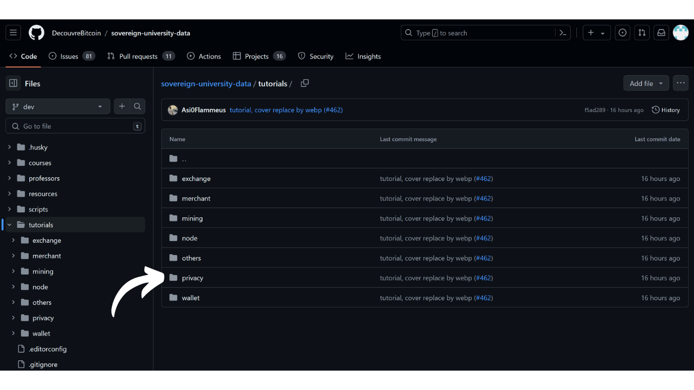
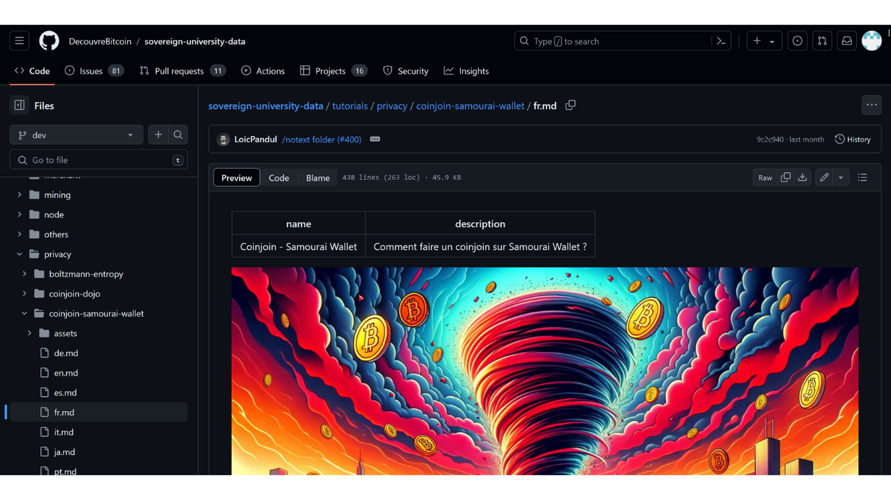
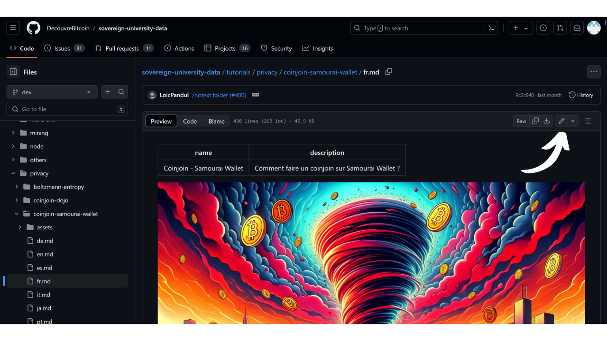
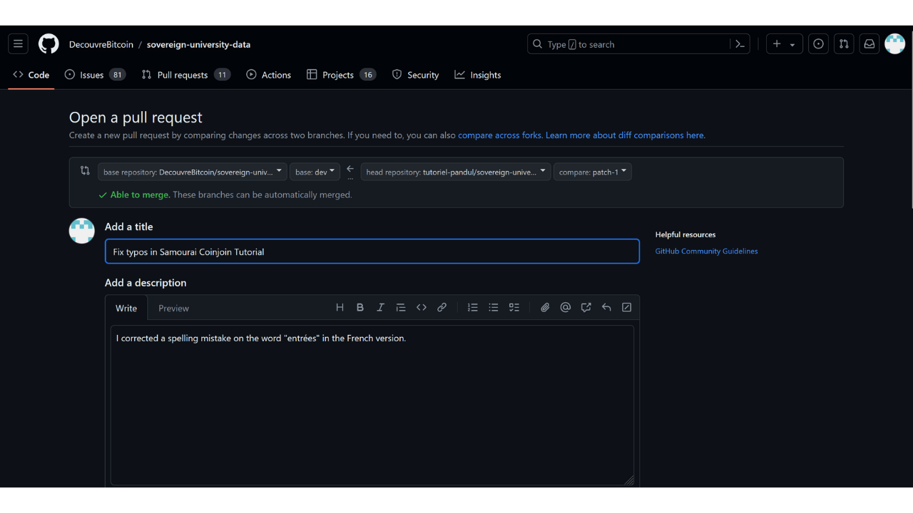

La mission de PlanB est de mettre à disposition des ressources éducatives de premier plan sur Bitcoin, et ce, dans un maximum de langues. L'intégralité des contenus publiés sur le site est open-source et est hébergée sur GitHub, ce qui offre la possibilité à quiconque de participer à l'enrichissement de la plateforme. Les contributions peuvent prendre diverses formes : correction et relecture des textes existants, traduction dans d'autres langues, mise à jour des informations ou encore création de nouveaux tutoriels encore absents de notre site.

Si, en consultant l'un de nos contenus éducatifs (tutoriels, formations, ressources...), vous identifiez une erreur, qu'il s'agisse d'une faute d'orthographe, de grammaire, d'une légère erreur de traduction dans votre langue natale, ou même d'une coquille, nous vous serions très reconnaissants de proposer vous-même une correction rapide.

Ce tutoriel vous guide étape par étape dans la correction de ces petites erreurs. C'est un tutoriel destiné aux débutants qui ne souhaitent pas s'aventurer dans les méandres de Git. Cependant, si vous êtes à l'aise avec Git, voici un résumé rapide : il vous suffit de fork [le dépôt data de PlanB Network](https://github.com/DecouvreBitcoin/sovereign-university-data), d'apporter les modifications sur une branche dédiée, et de soumettre une Pull Request face à la branche `dev` du dépôt source.

Veuillez noter que si vous envisagez de réaliser une relecture et une révision complètes d'un document, en particulier pour des traductions de contenus, je vous invite à consulter [cet autre tutoriel plus détaillé](https://planb.network/tutorials/others/content-review-tutorial). Ici, nous nous concentrons uniquement sur la manière d'effectuer une correction rapide pour une petite erreur.

- Tout d'abord, il vous faut avoir un compte sur GitHub. Si vous ne savez pas comment créer un compte, nous avons fait [un tutoriel détaillé pour vous accompagner](https://planb.network/tutorials/others/create-github-account).
- Rendez-vous sur [le dépôt GitHub de PlanB dédié à la data](https://github.com/DecouvreBitcoin/sovereign-university-data) :

- Ici, vous trouverez tous nos contenus rangés par partie.
- Si vous souhaitez modifier un tutoriel, par exemple, rendez-vous dans le dossier `tutorials` :

- Vous trouverez ensuite les différentes catégories de tutoriels de notre site web. Par exemple, si vous souhaitez modifier un tutoriel de la catégorie `Privacy`, cliquez sur le dossier correspondant :

- Sélectionnez ensuite le dossier correspondant au contenu que vous souhaitez corriger :

- Dans chaque dossier de contenu, vous trouverez les données disponibles dans différentes langues. Par exemple, le fichier `en.md` correspond à la version anglaise du tutoriel, tandis que le fichier `fr.md` représente la version française. Sélectionnez le fichier correspondant à la langue que vous souhaitez modifier :

- Vous arrivez ensuite sur la page GitHub du contenu. Vérifiez que vous êtes bien sur le document que vous cherchez à modifier :

- Cliquez sur la petite icône de crayon en haut à gauche :

- Si vous n'avez encore jamais contribué sur les contenus de PlanB Network, vous allez devoir créer votre fork du dépôt original. Faire un fork d'un dépôt consiste à créer une copie de ce dépôt sur votre propre compte GitHub, ce qui vous permet de travailler sur le projet sans affecter le dépôt original. Cliquez sur le bouton `Fork this repository` :

- Vous arrivez ensuite sur la page d'édition de GitHub :

- Faites vos modifications du texte pour corriger les erreurs que vous aviez repérées. N'ayez pas peur, vous êtes actuellement sur votre propre fork, donc cela ne va rien changer au site de PlanB Network pour le moment. Par exemple, ici, imaginons que j'ai modifié le mot "entrées" car il avait une faute d'orthographe :

- Une fois vos corrections sur ce document terminées, vous pouvez cliquer sur le bouton vert `Commit Changes...`. Un commit est comme une photo instantanée de votre travail à un moment donné, qui permet de garder un historique des changements :

- Ajoutez un titre pour vos modifications, ainsi qu'une courte description :

- Cliquez sur le bouton vert `Propose changes` :

- Vous arrivez ensuite sur une page qui résume tous vos changements :

- En descendant, vous pouvez voir les modifications précises que vous avez effectuées :

- Si tout vous convient et que vous avez terminé vos modifications, vous pouvez cliquer sur le bouton vert `Create Pull Request` :

- Vous arriverez sur la page de la PR. Une Pull Request est une demande envoyée par un contributeur pour indiquer qu'il a poussé des modifications sur une branche dans un dépôt distant et qu'il souhaite que ces modifications soient examinées et potentiellement intégrées (merge) dans la branche principale du dépôt :

- Vous pouvez ajouter un titre et une courte description pour votre PR :

- Si tout vous semble bon, vous pouvez cliquer sur le bouton vert `Create Pull Request` :

- Félicitations, votre PR a été envoyée ! Vous pouvez suivre son avancement dans l'onglet `Pull requests` sur [le dépôt GitHub de PlanB Network](https://github.com/DecouvreBitcoin/sovereign-university-data/pulls) :

Merci beaucoup pour votre contribution ! Si vous souhaitez faire d'autres types de contributions pour PlanB Network comme de la rédaction de contenus ou de la traduction, n'hésitez pas à [aller consulter nos autres tutoriels dans la partie "Contribution"](https://planb.network/tutorials/others).