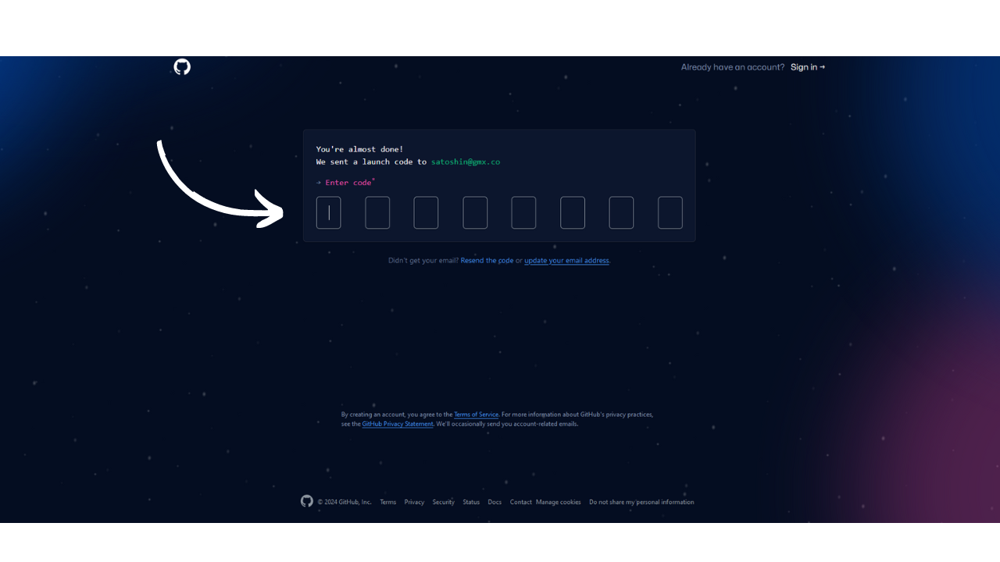

Die Mission von PlanB ist es, erstklassige Bildungsressourcen über Bitcoin bereitzustellen, die in so vielen Sprachen wie möglich verfügbar sind. Alle Inhalte, die auf der Website veröffentlicht werden, sind Open-Source und werden auf GitHub gehostet, was es jedem ermöglicht, an der Bereicherung der Plattform teilzunehmen. Beiträge können verschiedene Formen annehmen: Korrigieren und Korrekturlesen bestehender Texte, Übersetzen in andere Sprachen, Aktualisieren von Informationen oder Erstellen neuer Tutorials, die auf unserer Website noch nicht verfügbar sind.

Wenn Sie zum PlanB-Netzwerk beitragen möchten, benötigen Sie ein GitHub-Konto. In diesem Tutorial führen wir Sie Schritt für Schritt durch den Prozess, wie Sie Ihr eigenes Konto erstellen, einrichten und ordnungsgemäß absichern können.

- Gehen Sie zu [https://github.com/signup](https://github.com/signup).
- Geben Sie Ihre E-Mail-Adresse ein, dann klicken Sie auf den grünen `Continue`-Button:

- Wählen Sie ein starkes Passwort, dann klicken Sie auf den grünen `Continue`-Button:

- Wählen Sie als Nächstes Ihren Benutzernamen. Sie können Ihre echte Identität offenbaren oder ein Pseudonym verwenden. Dann klicken Sie auf den grünen `Continue`-Button:

- Vervollständigen Sie das Captcha:

- Eine E-Mail mit einem Bestätigungscode wird Ihnen zugesandt; Sie müssen diesen eingeben, um die Erstellung Ihres Kontos abzuschließen:

- Beantworten Sie die Fragen, wenn Sie möchten, dass GitHub Sie zu bestimmten Tools führt, oder klicken Sie auf `skip personalization`, um dies zu überspringen:

- Wählen Sie den kostenlosen Tarif, indem Sie auf den `Continue for free`-Button klicken:

- Sie werden dann zu Ihrem Dashboard weitergeleitet.
- Wenn Sie möchten, können Sie Ihr Konto anpassen, indem Sie auf Ihr Profilbild oben rechts auf dem Bildschirm klicken und dann das Menü `Settings` aufrufen:

- In diesem Abschnitt haben Sie die Möglichkeit, ein neues Profilbild hinzuzufügen, einen Namen auszuwählen, Ihre Biografie anzupassen oder einen Link zu Ihrer persönlichen Website hinzuzufügen:

- Ich empfehle auch, das Menü `Password and authentication` zu besuchen, um mindestens eine Zwei-Faktor-Authentifizierung einzurichten:
