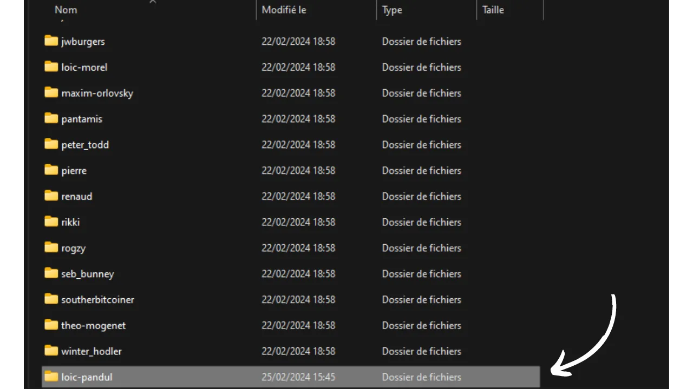
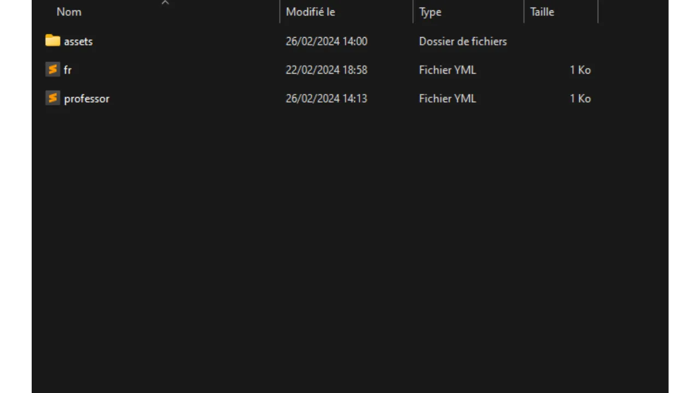
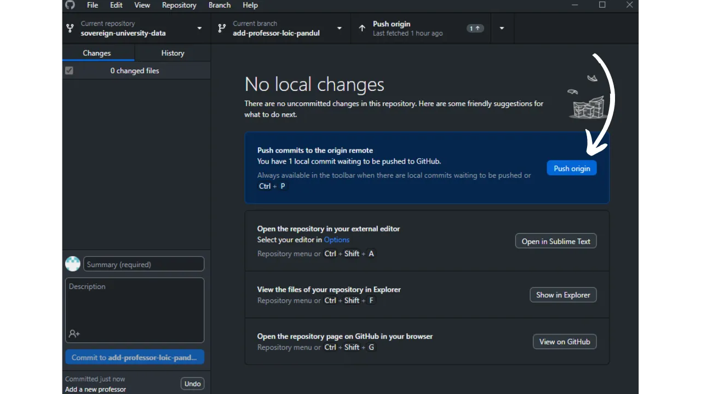

Mise PlanB spočívá v poskytování špičkových vzdělávacích zdrojů o Bitcoinu v co nejvíce jazycích. Veškerý obsah publikovaný na webu je open-source a hostovaný na GitHubu, což umožňuje každému podílet se na obohacování platformy. Příspěvky mohou mít různé formy: oprava a korektura stávajících textů, tvorba vzdělávacích kurzů, překlady do jiných jazyků, aktualizace informací nebo vytváření nových tutoriálů, které ještě nejsou na našem webu dostupné.

Pokud si přejete přidat nový kompletní tutoriál nebo kurz na síť PlanB, budete muset vytvořit svůj profesorský profil. To vám umožní být řádně uznán za obsah, který na webu vytváříte.

Pokud jste již předtím přispívali do sítě PlanB, pravděpodobně již máte ID přispěvatele. Najdete ho ve vaší složce profesora přístupné [přes tuto stránku](https://github.com/PlanB-Network/bitcoin-educational-content/tree/dev/professors). Pokud tomu tak je, můžete tento tutoriál přeskočit a začít přímo přispívat.


Pojďme společně objevit, jak přidat nového profesora v tomto tutoriálu!

## Předpoklady

**Software potřebný pro sledování mého tutoriálu:**
- [GitHub Desktop](https://desktop.github.com/)
- Editor kódu ([VSC](https://code.visualstudio.com/) nebo [Sublime Text](https://www.sublimetext.com/))

**Předpoklady před zahájením tutoriálu:**
- Mít [účet na GitHubu](https://github.com/signup).
- Mít fork [zdrojového repozitáře sítě PlanB](https://github.com/PlanB-Network/bitcoin-educational-content).

**Pokud potřebujete pomoc s získáním těchto předpokladů, mé další tutoriály vás provedou:**
- **[Porozumění Gitu a GitHubu](https://planb.network/tutorials/others/basics-of-github)**
- **[Vytvoření účtu na GitHubu](https://planb.network/tutorials/others/create-github-account)**
- **[Nastavení pracovního prostředí](https://planb.network/tutorials/others/github-desktop-work-environment)**

## Jak vytvořit nový profesorský profil?

- Otevřete svůj prohlížeč a přejděte na stránku vašeho forku repozitáře PlanB. URL vašeho forku by měla vypadat takto: `https://github.com/[username]/sovereign-university-data`

- Ujistěte se, že jste na hlavní větvi `dev`, poté klikněte na tlačítko `Sync fork`. Pokud váš fork není aktuální, GitHub nabídne aktualizaci vaší větve. Proveďte tuto synchronizaci.

- Pokud je naopak vaše větev již aktuální, GitHub vás o tom informuje:
- Otevřete GitHub Desktop a ujistěte se, že váš fork je správně vybrán v levém horním rohu okna:

- Klikněte na tlačítko `Fetch origin`.

- Pokud je vaše lokální repozitář již aktuální, GitHub Desktop nenavrhuje žádnou další akci. V opačném případě se objeví možnost `Pull origin`. Klikněte na toto tlačítko a aktualizujte svůj lokální repozitář:

- Ujistěte se, že jste na hlavní větvi `dev`:

- Klikněte na tuto větev, poté klikněte na tlačítko `New Branch`:

- Ujistěte se, že nová větev je založena na zdrojovém repozitáři, konkrétně `DecouvreBitcoin/sovereign-university-data`.
- Pojmenujte svou větev tak, aby název jasně vypovídal o jejím účelu, použijte pomlčky k oddělení jednotlivých slov. Jelikož je tato větev určena pro přidání profilu profesora, příklad názvu by mohl být: `add-professor-[vaše-jméno]`. Po zadání názvu klikněte na `Create branch` pro potvrzení jejího vytvoření:

- Nyní klikněte na tlačítko `Publish branch` pro uložení vaší nové pracovní větve do vašeho online forku na GitHubu:

- V tomto okamžiku byste na GitHub Desktop měli být ve vaší nové větvi. To znamená, že všechny úpravy provedené lokálně na vašem počítači budou zaznamenány výhradně na této konkrétní větvi. Také, dokud zůstane tato větev vybraná na GitHub Desktop, soubory viditelné lokálně na vašem stroji odpovídají těmto ve větvi (`add-professor-vaše-jméno`), a ne těm ve hlavní větvi (`dev`):

- Pro přidání vašeho profilu profesora otevřete průzkumníka souborů a navigujte do vašeho lokálního repozitáře, do složky `professors`. Najdete ji pod cestou: `\GitHub\sovereign-university-data\professors`.

- V této složce vytvořte novou složku pojmenovanou vaším jménem nebo pseudonymem. Ujistěte se, že název složky neobsahuje mezery. Takže pokud je vaše jméno "Loic Pandul" a žádný jiný profesor toto jméno nemá, složka, kterou vytvoříte, bude pojmenována `loic-pandul`:

- Pro zjednodušení můžete již nyní zkopírovat a vložit všechny dokumenty od jiného profesora do vaší vlastní složky. Poté budeme postupovat k úpravě těchto dokumentů tak, aby byly přizpůsobeny podle vašeho profilu:

- Začněte navigací do složky `assets`. Smažte profilový obrázek profesora, který jste dříve zkopírovali, a nahraďte jej vlastním profilovým obrázkem. Je nezbytné, aby tento obrázek byl ve formátu `.webp` a aby byl pojmenován `profile`, čímž dostanete kompletní název souboru `profile.webp`. Buďte si vědomi, že tento obrázek bude zveřejněn na internetu a přístupný všem: 
- Dále otevřete soubor `professor.yml` ve vašem editoru kódu (VSC nebo Sublime Text, například). Dostanete se k souboru zkopírovanému od existujícího profesora:

- Poté musíte aktualizovat stávající informace o vašich vlastních:
	- **name:** napište své jméno nebo pseudonym;
	- **links:** uveďte své účty na sociálních sítích jako Twitter a Nostr, stejně jako URL vašeho osobního webu (volitelné);
	- **affiliation:** zmíněte název společnosti, která vás zaměstnává (volitelné);
	- **tags:** specifikujte vaše oblasti specializace z následujícího seznamu, s vědomím, že můžete přidat vlastní témata. Avšak, ujistěte se, že počet tagů je omezen na maximálně 4, aby bylo zajištěno dobré UI:
	    - privacy,
	    - cryptography,
	    - bitcoin,
	    - mining,
	    - lightning-network,
	    - economy,
	    - history,
	    - merchants,
	    - security,
	    - ...
	- **tips:** poskytněte svou Lightning adresu pro dary, aby čtenáři vašich budoucích tutoriálů mohli posílat nějaké sats (volitelné);
	- **company:** pokud vlastníte jednu, uveďte název vaší společnosti (volitelné). Poté musíte aktualizovat stávající informace o vašich vlastních:
- Musíte také upravit `contributor-id`. Tento identifikátor slouží k vašemu rozpoznání na webu, ale není veřejně zveřejněn mimo GitHub. Můžete si vybrat libovolnou kombinaci dvou slov podle [anglického seznamu 2048 slov z BIP39](https://github.com/bitcoin/bips/blob/master/bip-0039/english.txt). Nezapomeňte mezi vybraná slova vložit pomlčku. Například zde jsem si vybral `crazy-cactus`:

- Jakmile dokončíte úpravy dokumentu `professor.yml`, klikněte na `Soubor > Uložit` pro uložení souboru. Poté můžete zavřít váš kódový editor:

- Ve vaší složce profesora můžete smazat dokumenty napsané v jazycích, které se vás netýkají, a které byly původně zkopírovány od jiného profesora. Ponechte pouze soubor odpovídající vašemu mateřskému jazyku. Například v mém případě jsem ponechal pouze soubor `fr.yml`, protože mým jazykem je francouzština: 
- Dvojklikem na tento soubor jej otevřete ve vašem kódovém editoru.

- V tomto souboru máte možnost napsat vaši kompletní biografii v sekci `bio` a shrnutí nebo stručný titulek v sekci `short_bio`:

- Po uložení vašeho dokumentu `fr.yml` je potřeba vytvořit kopii tohoto souboru pro každý z následujících osmi jazyků:
    - Německy (DE);
    - Anglicky (EN);
    - Francouzsky (FR);
    - Španělsky (ES);
    - Italsky (IT);
    - Portugalsky (PT);
    - Japonsky (JA);
    - Vietnamština (VI).

- Pokračujte kopírováním a vkládáním vašeho původního souboru, poté přeložte každý dokument do příslušného jazyka. Pokud jste v daném jazyce zběhlí, můžete překlad provést ručně. V opačném případě klidně využijte nástroj pro automatický překlad nebo chatbota:

- Pokud preferujete, je také možné ponechat biografii pouze ve vašem mateřském jazyce; překlad pak zajistíme my po odeslání vašeho Pull Requestu.

- Vaše složka profesora by tedy měla vypadat takto:

```plaintext
first-name-last-name/
├── fr.yml
├── it.yml
├── es.yml
├── en.yml
├── de.yml
├── pt.yml
├── ja.yml
├── vi.yml
├── professor.yml
└── assets/
    └── profile.webp
```
- Nyní se vraťte do GitHub Desktop.
- Na levé straně vašeho okna byste měli vidět všechny změny provedené v dokumentech, specifické pro vaši větev. Ujistěte se, že tyto změny jsou správné:

- Pokud se vám změny zdají správné, zadejte název pro váš commit. Commit je uložení změn provedených ve větvi, doprovázené popisnou zprávou, která umožňuje sledovat vývoj projektu v čase.
- Po zadání názvu stiskněte modré tlačítko `Commit to [your branch]` pro potvrzení těchto změn:

- Poté klikněte na tlačítko `Push origin`. To odešle váš commit do vašeho forku:

- Pokud jste dokončili vaše úpravy pro tuto větev, klikněte nyní na tlačítko `Preview Pull Request`:

- Můžete si ještě jednou zkontrolovat, že vaše úpravy jsou správné, a poté kliknout na tlačítko `Create pull request`:  - Automaticky budete přesměrováni ve vašem prohlížeči na GitHub na stránku přípravy Pull Requestu. Pull Request je žádost o začlenění změn z vaší větve do hlavní větve repozitáře sítě PlanB, což umožňuje přezkoumání a diskusi o změnách před jejich sloučením: 
- Na této přípravné stránce uveďte název, který stručně shrnuje úpravy, které chcete sloučit se zdrojovým repozitářem.
- Přidejte stručný komentář popisující tyto změny.
- Po dokončení těchto kroků klikněte na zelené tlačítko `Create pull request` a potvrďte žádost o sloučení: 
- Váš PR bude poté viditelný na záložce `Pull Request` hlavního repozitáře sítě PlanB. Nyní už jen stačí počkat, až vás administrátor kontaktuje s potvrzením sloučení vašeho příspěvku nebo s žádostí o jakékoli další úpravy: 
- Po sloučení vašeho PR s hlavní větví se doporučuje smazat vaši pracovní větev (`add-professor-your-name`), aby se udržela čistá historie na vašem forku. GitHub vám tuto možnost automaticky nabídne na stránce vašeho PR: 
- V softwaru GitHub Desktop můžete přepnout zpět na hlavní větev vašeho forku (`dev`): 
- Pokud si přejete provést úpravy vašeho profilu po již odeslaném PR, postup závisí na aktuálním stavu vašeho PR:
	- Pokud je váš PR stále otevřený a ještě nebyl sloučen, proveďte úpravy lokálně při zůstání na stejné větvi. Jakmile budou úpravy dokončeny, použijte tlačítko `Push origin` k přidání nového commitu k vašemu stále otevřenému PR;
	- V případě, že váš PR již byl sloučen s hlavní větví, budete muset začít proces znovu vytvořením nové větve a poté odesláním nového PR. Před pokračováním se ujistěte, že váš lokální repozitář je synchronizován se zdrojovým repozitářem sítě PlanB.