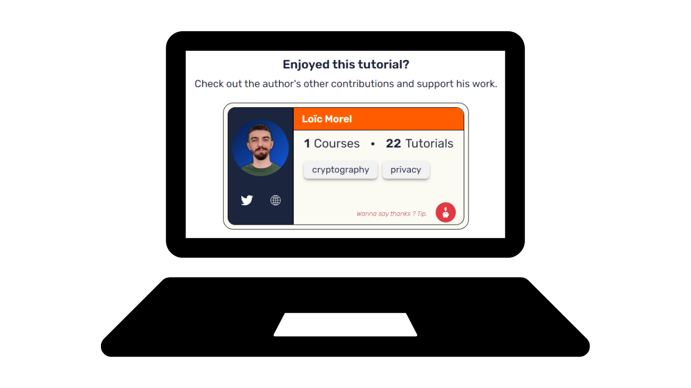
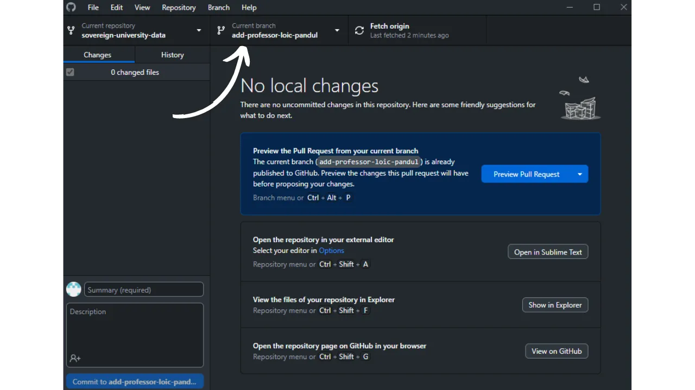
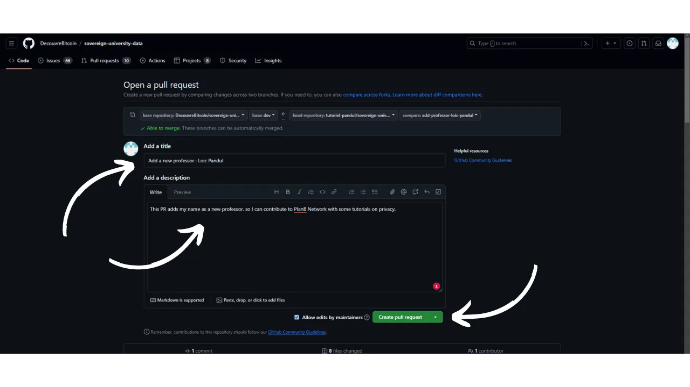

The mission of PlanB is to provide top-tier educational resources on Bitcoin, in as many languages as possible. All content published on the site is open-source and hosted on GitHub, which allows anyone to participate in enriching the platform. Contributions can take various forms: correcting and proofreading existing texts, producing training courses, translating into other languages, updating information, or creating new tutorials not yet available on our site.

If you wish to add a new complete tutorial or a course on PlanB Network, you will need to create your professor profile. This will allow you to be properly credited for the content you produce on the website.

If you have previously contributed to PlanB Network, you likely already have a contributor ID. You can find it in your professor folder accessible [via this page](https://github.com/DecouvreBitcoin/sovereign-university-data/tree/dev/professors). If this is the case, you can skip this tutorial and start contributing directly.


Let's discover together how to add a new professor in this tutorial!

## Prerequisites

**Software required to follow my tutorial:**
- [GitHub Desktop](https://desktop.github.com/)
- A code editor ([VSC](https://code.visualstudio.com/) or [Sublime Text](https://www.sublimetext.com/))

**Prerequisites before starting the tutorial:**
- Having a [GitHub account](https://github.com/signup).
- Having a fork of the [PlanB Network source repository](https://github.com/DecouvreBitcoin/sovereign-university-data).

**If you need help obtaining these prerequisites, my other tutorials will guide you:**
- **[Understanding Git and GitHub](https://planb.network/tutorials/others/basics-of-github)**
- **[Creating a GitHub Account](https://planb.network/tutorials/others/create-github-account)**
- **[Setting Up Your Work Environment](https://planb.network/tutorials/others/github-desktop-work-environment)**

## How to create a new professor profile?

- Open your browser and navigate to the page of your fork of the PlanB repository. The URL of your fork should look like: `https://github.com/[username]/sovereign-university-data`

- Make sure you are on the main branch `dev` then click on the `Sync fork` button. If your fork is not up to date, GitHub will offer to update your branch. Proceed with this synchronization.

- If, on the other hand, your branch is already up to date, GitHub will inform you:
- Open GitHub Desktop and make sure your fork is correctly selected in the top left corner of the window:

- Click on the `Fetch origin` button.

- If your local repository is already up to date, GitHub Desktop will not suggest any further action. Otherwise, the `Pull origin` option will appear. Click on this button to update your local repository:

- Ensure you are on the main branch `dev`:

- Click on this branch, then click on the `New Branch` button:

- Make sure the new branch is based on the source repository, namely `DecouvreBitcoin/sovereign-university-data`.

- Name your branch in a way that the title is clear about its purpose, using dashes to separate each word. Since this branch is intended for adding a professor profile, an example name could be: `add-professor-[your-name]`. After entering the name, click on `Create branch` to confirm its creation:

- Now click on the `Publish branch` button to save your new working branch to your online fork on GitHub:

- At this point, on GitHub Desktop, you should be on your new branch. This means that all modifications made locally on your computer will be exclusively recorded on this specific branch. Also, as long as this branch remains selected on GitHub Desktop, the files visible locally on your machine correspond to those of this branch (`add-professor-your-name`), and not to those of the main branch (`dev`):

- To add your professor profile, open your file explorer and navigate to your local repository, in the `professors` folder. You will find it under the path: `\GitHub\sovereign-university-data\professors`.

- Within this folder, create a new folder named with your name or pseudonym. Make sure there are no spaces in the folder name. Thus, if your name is "Loic Pandul" and no other professor has this name, the folder to create will be named `loic-pandul`:

- To make things easier, you can already copy and paste all the documents from another professor into your own folder. We will then proceed to modify these documents to customize them according to your profile:

- Start by navigating to the `assets` folder. Delete the profile picture of the professor that you previously copied, and replace it with your own profile image. It is imperative that this image is in the `.webp` format and that it is named `profile`, thus giving the complete file name `profile.webp`. Be aware, this image will be published on the Internet and accessible to everyone: 
- Next, open the `professor.yml` file with your code editor (VSC or Sublime Text, for example). You will arrive at the file copied from an existing professor:

- You must then update the existing information with your own:
	- **name:** write your name or pseudonym;
	- **links:** indicate your accounts on social networks such as Twitter and Nostr, as well as the URL of your personal website (optional);
	- **affiliation:** mention the name of the company that employs you (optional);
	- **tags:** specify your areas of specialization from the following list, knowing that you can add your own themes. However, be sure to limit the number of tags to 4 at most to ensure a good UI:
	    - privacy,
	    - cryptography,
	    - bitcoin,
	    - mining,
	    - lightning-network,
	    - economy,
	    - history,
	    - merchants,
	    - security,
	    - ...
	- **tips:** provide your Lightning address for donations to allow readers of your future tutorials to send you some sats (optional);
	- **company:** if you own one, indicate the name of your company (optional). You must then update the existing information with your own:

- You must also modify the `contributor-id`. This identifier is used to recognize you on the website, but is not made public outside of GitHub. You are free to choose any combination of two words, referring to [the English list of 2048 words from BIP39](https://github.com/bitcoin/bips/blob/master/bip-0039/english.txt). Do not forget to insert a dash between the two chosen words. For example, here, I chose `crazy-cactus`:

- Once you have finished modifying the `professor.yml` document, click on `File > Save` to save your file. You can then exit your code editor:

- Within your professor folder, you can delete documents written in languages that do not concern you, which were initially copied from another professor. Keep only the file corresponding to your native language. For example, in my case, I only kept the `fr.yml` file, since my language is French: 
- Double-click on this file to open it with your code editor.

- In this file, you have the opportunity to write your complete biography under the `bio` section and a summary or a succinct title under `short_bio`:

- After saving your `fr.yml` document, you need to create a copy of this file for each of the following eight languages:
    - German (DE);
    - English (EN);
    - French (FR);
    - Spanish (ES);
    - Italian (IT);
    - Portuguese (PT);
    - Japanese (JA);
    - Vietnamese (VI).

- Proceed to copy and paste your original file, then translate each document into the corresponding language. If you are proficient in the language, you may perform the translation manually. Otherwise, feel free to use an automatic translation tool or a chatbot:

- If you prefer, it is also possible to only keep the biography in your native language; we will then handle the translation after the submission of your Pull Request.

- Your professor folder should thus look like this:

```plaintext
first-name-last-name/
├── fr.yml
├── it.yml
├── es.yml
├── en.yml
├── de.yml
├── pt.yml
├── ja.yml
├── vi.yml
├── professor.yml
└── assets/
    └── profile.webp
```
- Now return to GitHub Desktop.
- On the left side of your window, you should observe all the modifications made to the documents, specific to your branch. Make sure these modifications are correct:

- If the modifications seem correct to you, add a title for your commit. A commit is a save of the modifications made to the branch, accompanied by a descriptive message, allowing to follow the evolution of a project over time.
- Once the title is entered, press the blue `Commit to [your branch]` button to validate these modifications:

- Then click on the `Push origin` button. This will send your commit to your fork:

- If you have finished your modifications for this branch, click now on the `Preview Pull Request` button:

- You can check one last time that your modifications are correct, then click on the `Create pull request` button: 
- You will be automatically redirected to your browser on GitHub to the Pull Request preparation page. A Pull Request is a request made to integrate the changes from your branch to the main branch of the PlanB Network repository, which allows for the review and discussion of the changes before their merger: 
- On this preparation page, indicate a title that briefly summarizes the modifications you wish to merge with the source repository.
- Add a brief comment describing these changes.
- After completing these steps, click on the green `Create pull request` button to confirm the merge request: 
- Your PR will then be visible in the `Pull Request` tab of the main repository of PlanB Network. All you have to do now is wait until an administrator contacts you to confirm the merger of your contribution or to request any additional modifications: 
- After the merger of your PR with the main branch, it is recommended to delete your working branch (`add-professor-your-name`) to maintain a clean history on your fork. GitHub will automatically offer you this option on your PR page: 
- On the GitHub Desktop software, you can switch back to the main branch of your fork (`dev`): 
- If you wish to make modifications to your profile after having already submitted your PR, the procedure depends on the current state of your PR:
	- If your PR is still open and has not yet been merged, make the modifications locally while staying on the same branch. Once the modifications are finalized, use the `Push origin` button to add a new commit to your still-open PR;
	- In the case where your PR has already been merged with the main branch, you will need to start the process over by creating a new branch, then submitting a new PR. Ensure that your local repository is synchronized with the PlanB Network source repository before proceeding.