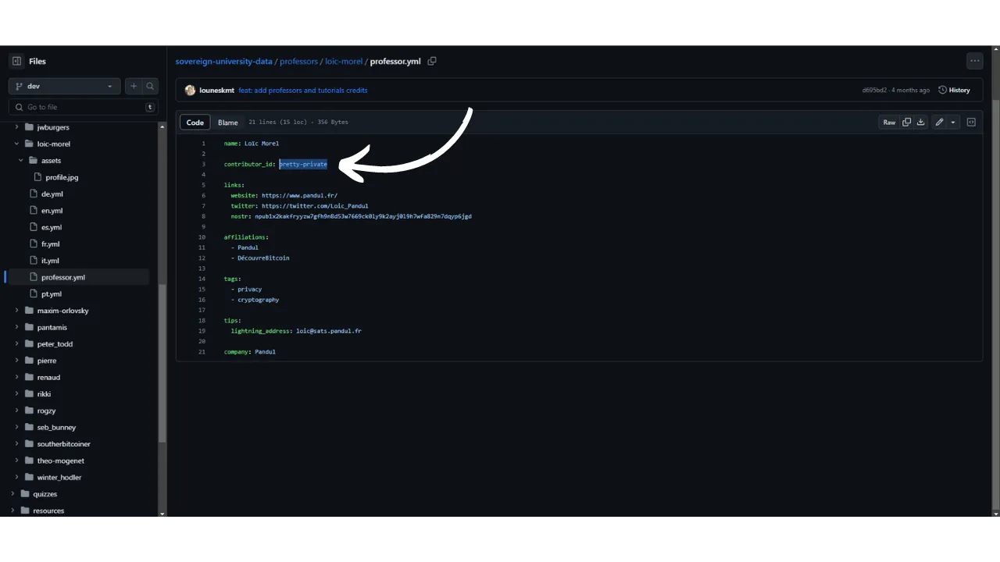
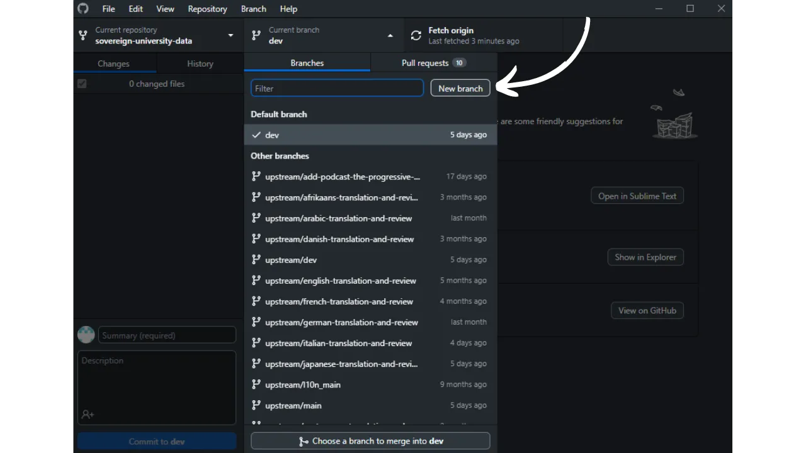
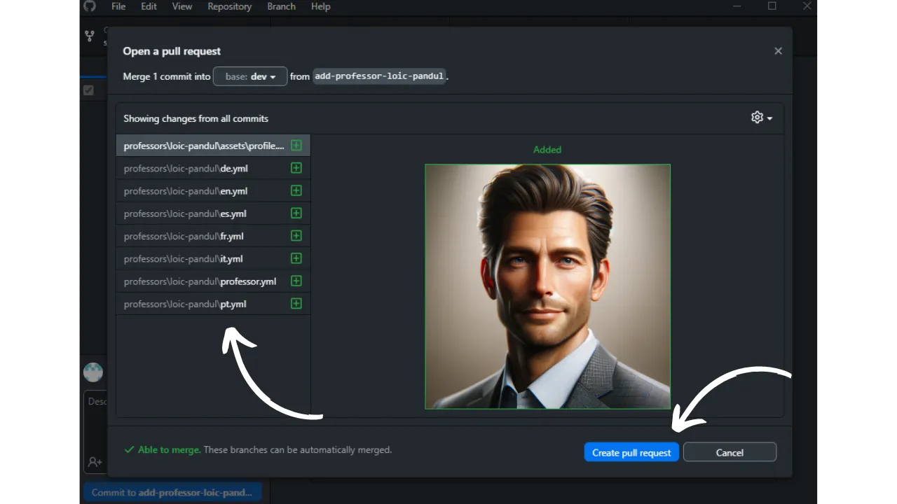

La missione di PlanB è fornire risorse educative di primo livello su Bitcoin, nel maggior numero di lingue possibile. Tutti i contenuti pubblicati sul sito sono open-source e ospitati su GitHub, il che consente a chiunque di partecipare all'arricchimento della piattaforma. I contributi possono assumere varie forme: correzione e revisione dei testi esistenti, produzione di corsi di formazione, traduzione in altre lingue, aggiornamento delle informazioni o creazione di nuovi tutorial non ancora disponibili sul nostro sito.

Se desideri aggiungere un nuovo tutorial completo o un corso sulla Rete PlanB, dovrai creare il tuo profilo professore. Questo ti permetterà di essere correttamente accreditato per i contenuti che produci sul sito web.

Se hai già contribuito alla Rete PlanB, probabilmente hai già un ID contributore. Puoi trovarlo nella tua cartella professore accessibile [tramite questa pagina](https://github.com/DecouvreBitcoin/sovereign-university-data/tree/dev/professors). Se questo è il caso, puoi saltare questo tutorial e iniziare a contribuire direttamente.


Scopriamo insieme come aggiungere un nuovo professore in questo tutorial!

## Prerequisiti

**Software necessario per seguire il mio tutorial:**
- [GitHub Desktop](https://desktop.github.com/)
- Un editor di codice ([VSC](https://code.visualstudio.com/) o [Sublime Text](https://www.sublimetext.com/))

**Prerequisiti prima di iniziare il tutorial:**
- Avere un [account GitHub](https://github.com/signup).
- Avere un fork del [repository sorgente della Rete PlanB](https://github.com/DecouvreBitcoin/sovereign-university-data).

**Se hai bisogno di aiuto per ottenere questi prerequisiti, i miei altri tutorial ti guideranno:**
- **[Comprendere Git e GitHub](https://planb.network/tutorials/others/basics-of-github)**
- **[Creare un Account GitHub](https://planb.network/tutorials/others/create-github-account)**
- **[Configurare il Tuo Ambiente di Lavoro](https://planb.network/tutorials/others/github-desktop-work-environment)**

## Come creare un nuovo profilo professore?

- Apri il tuo browser e naviga alla pagina del tuo fork del repository PlanB. L'URL del tuo fork dovrebbe apparire così: `https://github.com/[username]/sovereign-university-data`

- Assicurati di essere sul ramo principale `dev` poi clicca sul pulsante `Sync fork`. Se il tuo fork non è aggiornato, GitHub offrirà di aggiornare il tuo ramo. Procedi con questa sincronizzazione.

- Se, invece, il tuo ramo è già aggiornato, GitHub ti informerà:
- Apri GitHub Desktop e assicurati che il tuo fork sia correttamente selezionato nell'angolo in alto a sinistra della finestra:

- Clicca sul pulsante `Fetch origin`.

- Se il tuo repository locale è già aggiornato, GitHub Desktop non suggerirà ulteriori azioni. Altrimenti, apparirà l'opzione `Pull origin`. Clicca su questo pulsante per aggiornare il tuo repository locale:

- Assicurati di essere sul ramo principale `dev`:

- Clicca su questo ramo, poi clicca sul pulsante `New Branch`:

- Assicurati che il nuovo ramo sia basato sul repository sorgente, ovvero `DecouvreBitcoin/sovereign-university-data`.
- Nominare il tuo ramo in modo che il titolo sia chiaro riguardo al suo scopo, utilizzando trattini per separare ogni parola. Poiché questo ramo è destinato all'aggiunta di un profilo professore, un esempio di nome potrebbe essere: `add-professor-[tuo-nome]`. Dopo aver inserito il nome, clicca su `Create branch` per confermare la sua creazione:

- Ora clicca sul pulsante `Publish branch` per salvare il tuo nuovo ramo di lavoro sul tuo fork online su GitHub:

- A questo punto, su GitHub Desktop, dovresti essere sul tuo nuovo ramo. Questo significa che tutte le modifiche fatte localmente sul tuo computer verranno registrate esclusivamente su questo ramo specifico. Inoltre, finché questo ramo rimane selezionato su GitHub Desktop, i file visibili localmente sulla tua macchina corrispondono a quelli di questo ramo (`add-professor-tuo-nome`), e non a quelli del ramo principale (`dev`):

- Per aggiungere il tuo profilo professore, apri l'esplora file e naviga verso il tuo repository locale, nella cartella `professors`. La troverai sotto il percorso: `\GitHub\sovereign-university-data\professors`.

- All'interno di questa cartella, crea una nuova cartella nominata con il tuo nome o pseudonimo. Assicurati che non ci siano spazi nel nome della cartella. Quindi, se il tuo nome è "Loic Pandul" e nessun altro professore ha questo nome, la cartella da creare sarà nominata `loic-pandul`:

- Per semplificare le cose, puoi già copiare e incollare tutti i documenti da un altro professore nella tua cartella. Procederemo poi a modificare questi documenti per personalizzarli secondo il tuo profilo:

- Inizia navigando nella cartella `assets`. Elimina l'immagine del profilo del professore che hai precedentemente copiato e sostituiscila con la tua immagine del profilo. È imperativo che questa immagine sia nel formato `.webp` e che sia nominata `profile`, fornendo così il nome completo del file `profile.webp`. Sii consapevole, questa immagine verrà pubblicata su Internet e accessibile a tutti: 
- Successivamente, apri il file `professor.yml` con il tuo editor di codice (VSC o Sublime Text, per esempio). Arriverai al file copiato da un professore esistente:

- Devi poi aggiornare le informazioni esistenti con le tue:
	- **name:** scrivi il tuo nome o pseudonimo;
	- **links:** indica i tuoi account sui social network come Twitter e Nostr, così come l'URL del tuo sito personale (opzionale);
	- **affiliation:** menziona il nome dell'azienda che ti impiega (opzionale);
	- **tags:** specifica le tue aree di specializzazione dalla seguente lista, sapendo che puoi aggiungere i tuoi temi. Tuttavia, assicurati di limitare il numero di tag a 4 al massimo per garantire una buona UI:
	    - privacy,
	    - crittografia,
	    - bitcoin,
	    - mining,
	    - lightning-network,
	    - economia,
	    - storia,
	    - commercianti,
	    - sicurezza,
	    - ...
	- **tips:** fornisce il tuo indirizzo Lightning per donazioni per permettere ai lettori dei tuoi futuri tutorial di inviarti alcuni sats (opzionale);
	- **company:** se ne possiedi una, indica il nome della tua azienda (opzionale). Devi poi aggiornare le informazioni esistenti con le tue:
- Dovrai anche modificare il `contributor-id`. Questo identificativo è utilizzato per riconoscerti sul sito web, ma non viene reso pubblico al di fuori di GitHub. Sei libero di scegliere qualsiasi combinazione di due parole, facendo riferimento [alla lista inglese delle 2048 parole di BIP39](https://github.com/bitcoin/bips/blob/master/bip-0039/english.txt). Non dimenticare di inserire un trattino tra le due parole scelte. Per esempio, qui, ho scelto `crazy-cactus`:
- Una volta che hai finito di modificare il documento `professor.yml`, clicca su `File > Salva` per salvare il tuo file. Puoi poi uscire dal tuo editor di codice:
- All'interno della tua cartella professor, puoi eliminare i documenti scritti in lingue che non ti riguardano, che inizialmente erano stati copiati da un altro professore. Conserva solo il file corrispondente alla tua lingua madre. Per esempio, nel mio caso, ho conservato solo il file `fr.yml`, dato che la mia lingua è il francese:
- Fai doppio clic su questo file per aprirlo con il tuo editor di codice.

- In questo file, hai l'opportunità di scrivere la tua biografia completa nella sezione `bio` e un riassunto o un titolo succinto sotto `short_bio`:
- Dopo aver salvato il tuo documento `fr.yml`, devi creare una copia di questo file per ciascuna delle seguenti otto lingue:
    - Tedesco (DE);
    - Inglese (EN);
    - Francese (FR);
    - Spagnolo (ES);
    - Italiano (IT);
    - Portoghese (PT);
    - Giapponese (JA);
    - Vietnamita (VI).

- Procedi a copiare e incollare il tuo file originale, poi traduci ogni documento nella lingua corrispondente. Se sei competente nella lingua, puoi eseguire la traduzione manualmente. Altrimenti, sentiti libero di utilizzare uno strumento di traduzione automatica o un chatbot:
- Se preferisci, è anche possibile mantenere la biografia solo nella tua linga madre; ci occuperemo noi della traduzione dopo la presentazione della tua Pull Request.

- La tua cartella professor dovrebbe quindi apparire così:
```bash
nome-cognome/
├── fr.yml
├── it.yml
├── es.yml
├── en.yml
├── de.yml
├── pt.yml
├── ja.yml
├── vi.yml
├── professor.yml
└── assets/
    └── profile.webp
```
- Ora torna su GitHub Desktop.
- Sul lato sinistro della tua finestra, dovresti osservare tutte le modifiche apportate ai documenti, specifiche per il tuo ramo. Assicurati che queste modifiche siano corrette:
- Se le modifiche ti sembrano corrette, aggiungi un titolo per il tuo commit. Un commit è un salvataggio delle modifiche apportate al ramo, accompagnato da un messaggio descrittivo, che consente di seguire l'evoluzione di un progetto nel tempo.
- Una volta inserito il titolo, premi il pulsante blu `Commit to [your branch]` per convalidare queste modifiche:
- Poi clicca sul pulsante `Push origin`. Questo invierà il tuo commit al tuo fork:
- Se hai terminato le tue modifiche per questo ramo, clicca ora sul pulsante `Preview Pull Request`:
- Puoi controllare un'ultima volta che le tue modifiche siano corrette, quindi cliccare sul pulsante `Create pull request`:  - Sarai automaticamente reindirizzato sul tuo browser su GitHub alla pagina di preparazione della Pull Request. Una Pull Request è una richiesta fatta per integrare le modifiche dal tuo ramo al ramo principale del repository di PlanB Network, che consente la revisione e la discussione delle modifiche prima della loro fusione: 
- Su questa pagina di preparazione, indica un titolo che riassuma brevemente le modifiche che desideri unire al repository sorgente.
- Aggiungi un breve commento che descriva queste modifiche.
- Dopo aver completato questi passaggi, clicca sul pulsante verde `Create pull request` per confermare la richiesta di fusione: 
- La tua PR sarà quindi visibile nella scheda `Pull Request` del repository principale di PlanB Network. Tutto ciò che devi fare ora è attendere che un amministratore ti contatti per confermare la fusione del tuo contributo o per richiedere eventuali modifiche aggiuntive: 
- Dopo la fusione della tua PR con il ramo principale, si raccomanda di eliminare il tuo ramo di lavoro (`add-professor-your-name`) per mantenere uno storico pulito sul tuo fork. GitHub ti offrirà automaticamente questa opzione sulla tua pagina PR: 
- Sul software GitHub Desktop, puoi tornare al ramo principale del tuo fork (`dev`): 
- Se desideri apportare modifiche al tuo profilo dopo aver già inviato la tua PR, la procedura dipende dallo stato attuale della tua PR:
	- Se la tua PR è ancora aperta e non è ancora stata unita, effettua le modifiche localmente rimanendo sullo stesso ramo. Una volta finalizzate le modifiche, usa il pulsante `Push origin` per aggiungere un nuovo commit alla tua PR ancora aperta;
	- Nel caso in cui la tua PR sia già stata unita al ramo principale, dovrai iniziare il processo da capo creando un nuovo ramo, quindi inviando una nuova PR. Assicurati che il tuo repository locale sia sincronizzato con il repository sorgente di PlanB Network prima di procedere.