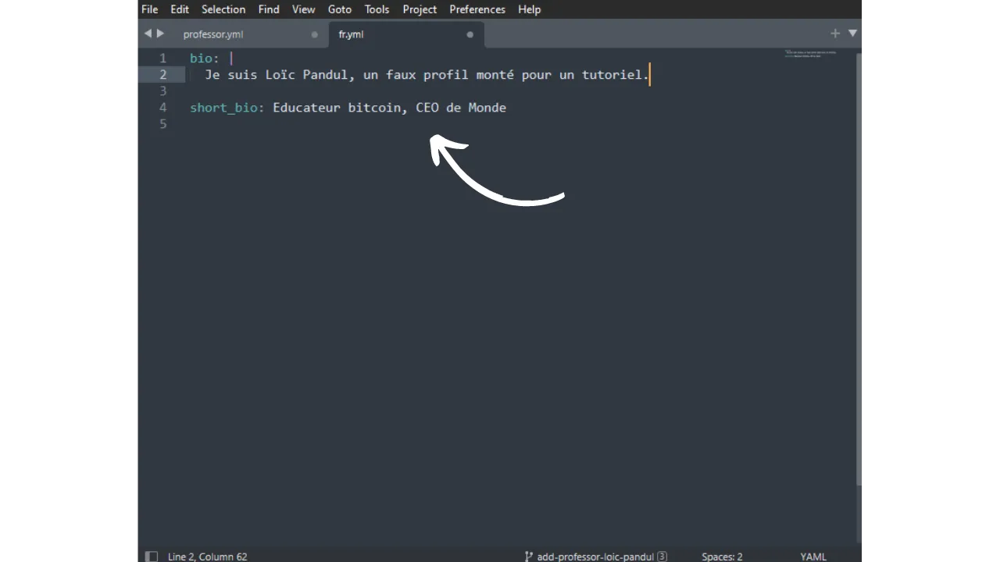

PlanB のミッションは、できるだけ多くの言語で Bitcoin に関する最高水準の教育リソースを提供することです。サイトに公開されているすべてのコンテンツはオープンソースであり、GitHub にホストされているため、誰でもプラットフォームを豊かにするために参加することができます。貢献は様々な形を取ることができます：既存のテキストの修正や校正、トレーニングコースの制作、他の言語への翻訳、情報の更新、またはまだ当サイトにない新しいチュートリアルの作成などです。

PlanB ネットワークに新しい完全なチュートリアルやコースを追加したい場合は、教授プロファイルを作成する必要があります。これにより、ウェブサイト上で制作したコンテンツに対して適切にクレジットされることになります。

以前に PlanB ネットワークに貢献したことがある場合は、既にコントリビューター ID を持っている可能性があります。[このページ](https://github.com/PlanB-Network/bitcoin-educational-content/tree/dev/professors)からアクセス可能な教授フォルダーでそれを見つけることができます。その場合は、このチュートリアルをスキップして、直接貢献を開始することができます。


このチュートリアルで、新しい教授を追加する方法を一緒に見ていきましょう！

## 前提条件

**このチュートリアルをフォローするために必要なソフトウェア：**
- [GitHub Desktop](https://desktop.github.com/)
- コードエディター（[VSC](https://code.visualstudio.com/) または [Sublime Text](https://www.sublimetext.com/)）

**チュートリアルを始める前の前提条件：**
- [GitHub アカウント](https://github.com/signup)を持っていること。
- [PlanB Network ソースリポジトリ](https://github.com/PlanB-Network/bitcoin-educational-content)のフォークを持っていること。

**これらの前提条件を得るための助けが必要な場合は、私の他のチュートリアルがガイドします：**
- **[Git と GitHub の理解](https://planb.network/tutorials/others/basics-of-github)**
- **[GitHub アカウントの作成](https://planb.network/tutorials/others/create-github-account)**
- **[作業環境の設定](https://planb.network/tutorials/others/github-desktop-work-environment)**

## 新しい教授プロファイルを作成する方法は？

- ブラウザを開き、PlanB リポジトリのフォークのページに移動します。フォークの URL は次のようになります：`https://github.com/[username]/sovereign-university-data`

- メインブランチ `dev` にいることを確認し、`Sync fork` ボタンをクリックします。フォークが最新でない場合、GitHub はブランチの更新を提案します。この同期を進めてください。

- 一方、ブランチが既に最新の場合、GitHub はその旨を通知します：
- GitHub Desktop を開き、フォークがウィンドウの左上隅で正しく選択されていることを確認します：

- `Fetch origin` ボタンをクリックします。

- ローカルリポジトリが既に最新の場合、GitHub Desktop はこれ以上のアクションを提案しません。そうでない場合は、`Pull origin` オプションが表示されます。このボタンをクリックして、ローカルリポジトリを更新します：

- メインブランチ `dev` にいることを確認します：

- このブランチをクリックし、次に `New Branch` ボタンをクリックします：

- 新しいブランチがソースリポジトリ、すなわち `DecouvreBitcoin/sovereign-university-data` を基にしていることを確認してください。
- ブランチの名前はその目的が明確になるようにし、各単語をダッシュで区切ってください。このブランチが教授のプロファイルを追加することを目的としている場合、例えば `add-professor-[あなたの名前]` のように名付けることができます。名前を入力した後、`Create branch` をクリックしてその作成を確認してください：

- 今度は `Publish branch` ボタンをクリックして、新しい作業ブランチをGitHub上のオンラインフォークに保存してください：

- この時点で、GitHub Desktop上では新しいブランチになっているはずです。これは、コンピュータ上でローカルに行われたすべての変更がこの特定のブランチにのみ記録されることを意味します。また、このブランチがGitHub Desktop上で選択されている限り、マシン上でローカルに表示されるファイルはこのブランチ（`add-professor-your-name`）のものであり、メインブランチ（`dev`）のものではありません：

- 教授のプロファイルを追加するには、ファイルエクスプローラーを開いてローカルリポジトリの `professors` フォルダに移動します。パスは `\GitHub\sovereign-university-data\professors` の下にあります。

- このフォルダ内で、あなたの名前または偽名で新しいフォルダを作成してください。フォルダ名にスペースがないことを確認してください。したがって、あなたの名前が "Loic Pandul" で他の教授にこの名前がない場合、作成するフォルダは `loic-pandul` と名付けられます：

- 物事を簡単にするために、他の教授のすべてのドキュメントをあなた自身のフォルダにコピーして貼り付けることができます。その後、これらのドキュメントをあなたのプロファイルに合わせてカスタマイズするために進めます：

- `assets` フォルダに移動して始めてください。以前にコピーした教授のプロファイル画像を削除し、あなた自身のプロファイル画像に置き換えてください。この画像は `.webp` 形式であり、完全なファイル名が `profile.webp` であることが必須です。この画像はインターネット上に公開され、誰でもアクセスできることに注意してください： 
- 次に、コードエディタ（例：VSCやSublime Textなど）で `professor.yml` ファイルを開きます。既存の教授からコピーされたファイルに到達します：

- 次に、既存の情報をあなた自身のものに更新する必要があります：
	- **name:** あなたの名前または偽名を記入してください；
	- **links:** TwitterやNostrなどのソーシャルネットワークのアカウント、およびあなたの個人ウェブサイトのURL（任意）を示してください；
	- **affiliation:** あなたを雇用している会社の名前を記載してください（任意）；
	- **tags:** プライバシー、暗号技術、ビットコイン、マイニング、ライトニングネットワーク、経済、歴史、商人、セキュリティなど、以下のリストから専門分野を指定してください。ただし、良いUIを確保するためにタグの数を最大4つまでに制限することを確認してください：
	    - privacy,
	    - cryptography,
	    - bitcoin,
	    - mining,
	    - lightning-network,
	    - economy,
	    - history,
	    - merchants,
	    - security,
	    - ...
	- **tips:** あなたの将来のチュートリアルの読者があなたにいくつかのsatsを送ることができるように、あなたのLightningアドレスを寄付用に提供してください（任意）；
	- **company:** もし所有している場合は、あなたの会社の名前を示してください（任意）。次に、既存の情報をあなた自身のものに更新する必要があります：
- `contributor-id`を変更する必要があります。この識別子はウェブサイト上であなたを認識するために使用されますが、GitHubの外部に公開されることはありません。[BIP39の英語の2048語のリスト](https://github.com/bitcoin/bips/blob/master/bip-0039/english.txt)を参照して、任意の2つの単語の組み合わせを自由に選択してください。選んだ2つの単語の間にダッシュを挿入することを忘れないでください。例えば、ここでは`crazy-cactus`を選びました：

- `professor.yml`ドキュメントの修正が完了したら、`File > Save`をクリックしてファイルを保存します。その後、コードエディターを終了できます：

- 教授フォルダ内で、あなたに関係ない言語で書かれたドキュメントを削除できます。これらは最初に別の教授からコピーされたものです。あなたの母国語に対応するファイルのみを保持してください。例えば、私の場合はフランス語が私の言語なので、`fr.yml`ファイルのみを保持しました：

- このファイルをダブルクリックして、コードエディターで開きます。

- このファイルでは、`bio`セクションの下に完全な伝記を書く機会があり、`short_bio`の下に要約または簡潔なタイトルを書くことができます：

- `fr.yml`ドキュメントを保存した後、以下の8つの言語のそれぞれについてこのファイルのコピーを作成する必要があります：
    - ドイツ語 (DE);
    - 英語 (EN);
    - フランス語 (FR);
    - スペイン語 (ES);
    - イタリア語 (IT);
    - ポルトガル語 (PT);
    - 日本語 (JA);
    - ベトナム語 (VI).

- 元のファイルをコピーして貼り付け、各ドキュメントを対応する言語に翻訳してください。その言語に堪能であれば、手動で翻訳を行うことができます。そうでない場合は、自動翻訳ツールやチャットボットを自由に使用してください：

- 好みに応じて、母国語の伝記のみを保持することも可能です。その場合、プルリクエストの提出後に翻訳を行います。

- あなたの教授フォルダは、このように見えるはずです：

```plaintext
first-name-last-name/
├── fr.yml
├── it.yml
├── es.yml
├── en.yml
├── de.yml
├── pt.yml
├── ja.yml
├── vi.yml
├── professor.yml
└── assets/
    └── profile.webp
```
- 今度はGitHub Desktopに戻ります。
- ウィンドウの左側で、ブランチに特有のドキュメントの変更をすべて確認できます。これらの変更が正しいことを確認してください：

- 変更が正しいと思われる場合は、コミットのタイトルを入力してください。コミットは、ブランチに行われた変更の保存であり、プロジェクトの経過を追跡するための説明的なメッセージが付随します。
- タイトルを入力したら、青色の`Commit to [your branch]`ボタンを押してこれらの変更を確定します：

- 次に、`Push origin`ボタンをクリックします。これにより、コミットがフォークに送信されます：

- このブランチの変更が完了したら、`Preview Pull Request`ボタンを今すぐクリックしてください：

- 最終確認をして、修正が正しいことを確認したら、`Create pull request`ボタンをクリックしてください：  - GitHub上のブラウザで自動的にPull Requestの準備ページにリダイレクトされます。Pull Requestは、PlanB Networkリポジトリのメインブランチに対して、あなたのブランチからの変更を統合するためのリクエストであり、変更のレビューと議論を行う前に、その統合を許可します： 
- この準備ページで、ソースリポジトリとマージしたい修正を簡潔に要約したタイトルを指定してください。
- これらの変更を簡潔に説明するコメントを追加してください。
- これらのステップを完了したら、緑色の`Create pull request`ボタンをクリックして、マージリクエストを確認してください： 
- あなたのPRはその後、PlanB Networkのメインリポジトリの`Pull Request`タブに表示されます。あとは、管理者があなたに連絡して、あなたの貢献のマージを確認するか、追加の修正を要求するまで待つだけです： 
- メインブランチとのPRのマージ後、フォーク上の履歴をクリーンに保つために、作業ブランチ（`add-professor-your-name`）を削除することをお勧めします。GitHubは、あなたのPRページで自動的にこのオプションを提供します： 
- GitHub Desktopソフトウェアでは、フォークのメインブランチ（`dev`）に戻ることができます： 
- 既にPRを提出した後にプロファイルを修正したい場合、手続きはPRの現在の状態によって異なります：
	- PRがまだオープンであり、まだマージされていない場合は、同じブランチにとどまりながらローカルで修正を行います。修正が完了したら、`Push origin`ボタンを使用して、まだオープンなPRに新しいコミットを追加します。
	- PRが既にメインブランチとマージされている場合は、新しいブランチを作成し、新しいPRを提出するプロセスを最初からやり直す必要があります。手続きを進める前に、ローカルリポジトリがPlanB Networkソースリポジトリと同期していることを確認してください。