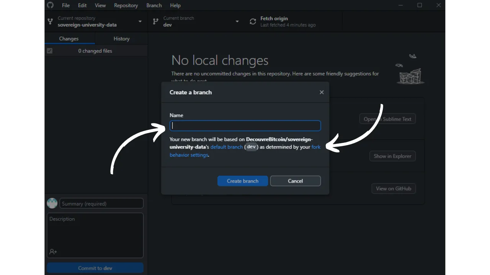
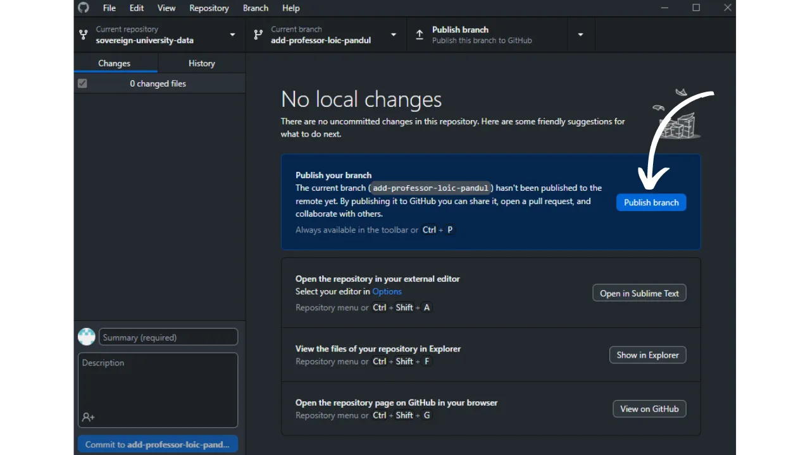
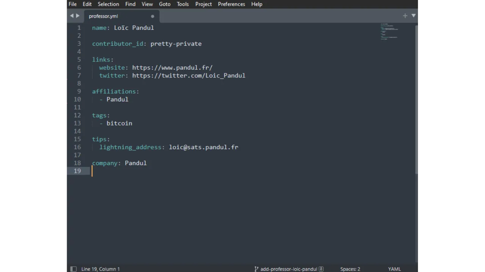
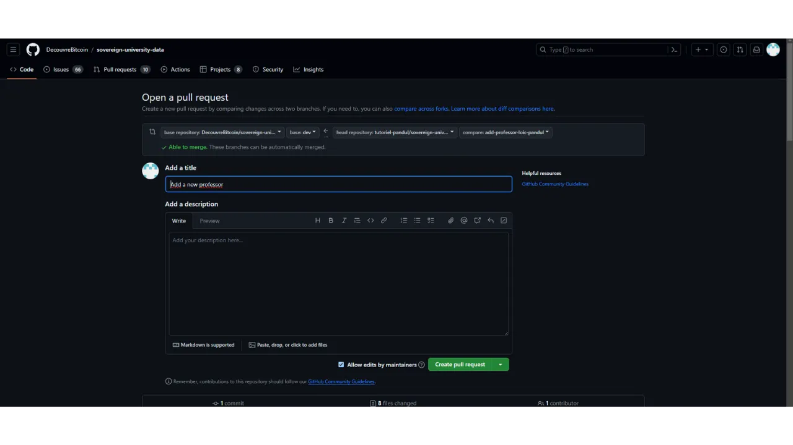
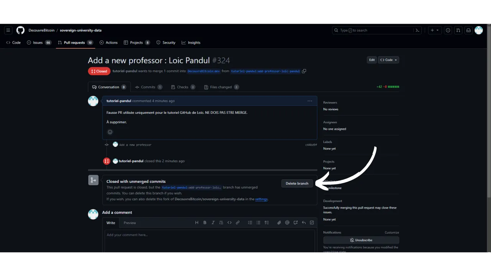

A missão do PlanB é fornecer recursos educacionais de primeira linha sobre Bitcoin, em tantos idiomas quanto possível. Todo o conteúdo publicado no site é de código aberto e hospedado no GitHub, o que permite que qualquer pessoa participe do enriquecimento da plataforma. As contribuições podem assumir várias formas: corrigir e revisar textos existentes, produzir cursos de treinamento, traduzir para outros idiomas, atualizar informações ou criar novos tutoriais ainda não disponíveis em nosso site.

Se você deseja adicionar um novo tutorial completo ou um curso na Rede PlanB, precisará criar seu perfil de professor. Isso permitirá que você seja devidamente creditado pelo conteúdo que produzir no site.

Se você já contribuiu anteriormente para a Rede PlanB, provavelmente já possui um ID de contribuidor. Você pode encontrá-lo na sua pasta de professor acessível [por esta página](https://github.com/DecouvreBitcoin/sovereign-university-data/tree/dev/professors). Se este for o caso, você pode pular este tutorial e começar a contribuir diretamente.


Vamos descobrir juntos como adicionar um novo professor neste tutorial!

## Pré-requisitos

**Software necessário para seguir meu tutorial:**
- [GitHub Desktop](https://desktop.github.com/)
- Um editor de código ([VSC](https://code.visualstudio.com/) ou [Sublime Text](https://www.sublimetext.com/))

**Pré-requisitos antes de iniciar o tutorial:**
- Ter uma [conta no GitHub](https://github.com/signup).
- Ter um fork do [repositório fonte da Rede PlanB](https://github.com/DecouvreBitcoin/sovereign-university-data).

**Se você precisar de ajuda para obter esses pré-requisitos, meus outros tutoriais irão guiá-lo:**
- **[Entendendo Git e GitHub](https://planb.network/tutorials/others/basics-of-github)**
- **[Criando uma Conta no GitHub](https://planb.network/tutorials/others/create-github-account)**
- **[Configurando Seu Ambiente de Trabalho](https://planb.network/tutorials/others/github-desktop-work-environment)**

## Como criar um novo perfil de professor?

- Abra seu navegador e navegue até a página do seu fork do repositório PlanB. A URL do seu fork deve parecer com: `https://github.com/[username]/sovereign-university-data`

- Certifique-se de que você está na branch principal `dev` e clique no botão `Sync fork`. Se o seu fork não estiver atualizado, o GitHub oferecerá atualizar sua branch. Prossiga com esta sincronização.

- Se, por outro lado, sua branch já estiver atualizada, o GitHub informará:
- Abra o GitHub Desktop e certifique-se de que seu fork está corretamente selecionado no canto superior esquerdo da janela:

- Clique no botão `Fetch origin`.

- Se o seu repositório local já estiver atualizado, o GitHub Desktop não sugerirá nenhuma ação adicional. Caso contrário, a opção `Pull origin` aparecerá. Clique neste botão para atualizar seu repositório local:

- Certifique-se de que você está na branch principal `dev`:

- Clique nesta branch, depois clique no botão `New Branch`:

- Certifique-se de que a nova branch esteja baseada no repositório fonte, nomeadamente `DecouvreBitcoin/sovereign-university-data`.
- Nomeie sua branch de uma forma que o título seja claro sobre seu propósito, usando hífens para separar cada palavra. Uma vez que esta branch é destinada para adicionar um perfil de professor, um exemplo de nome poderia ser: `add-professor-[seu-nome]`. Após inserir o nome, clique em `Create branch` para confirmar sua criação:

- Agora clique no botão `Publish branch` para salvar sua nova branch de trabalho no seu fork online no GitHub:

- Neste ponto, no GitHub Desktop, você deve estar na sua nova branch. Isso significa que todas as modificações feitas localmente no seu computador serão exclusivamente registradas nesta branch específica. Além disso, enquanto esta branch permanecer selecionada no GitHub Desktop, os arquivos visíveis localmente na sua máquina correspondem aos desta branch (`add-professor-seu-nome`), e não aos da branch principal (`dev`):

- Para adicionar seu perfil de professor, abra seu explorador de arquivos e navegue até o seu repositório local, na pasta `professors`. Você a encontrará sob o caminho: `\GitHub\sovereign-university-data\professors`.

- Dentro desta pasta, crie uma nova pasta nomeada com seu nome ou pseudônimo. Certifique-se de que não haja espaços no nome da pasta. Assim, se seu nome é "Loic Pandul" e nenhum outro professor tem esse nome, a pasta a ser criada será nomeada `loic-pandul`:

- Para facilitar, você já pode copiar e colar todos os documentos de outro professor para dentro da sua própria pasta. Em seguida, procederemos para modificar esses documentos para personalizá-los de acordo com seu perfil:

- Comece navegando até a pasta `assets`. Delete a imagem de perfil do professor que você copiou anteriormente e substitua-a pela sua própria imagem de perfil. É imperativo que esta imagem esteja no formato `.webp` e que seja nomeada `profile`, fornecendo assim o nome completo do arquivo `profile.webp`. Esteja ciente, esta imagem será publicada na Internet e acessível a todos: 
- Em seguida, abra o arquivo `professor.yml` com seu editor de código (VSC ou Sublime Text, por exemplo). Você chegará ao arquivo copiado de um professor existente:

- Você deve então atualizar as informações existentes com as suas próprias:
	- **name:** escreva seu nome ou pseudônimo;
	- **links:** indique suas contas em redes sociais como Twitter e Nostr, bem como a URL do seu site pessoal (opcional);
	- **affiliation:** mencione o nome da empresa que o emprega (opcional);
	- **tags:** especifique suas áreas de especialização a partir da seguinte lista, sabendo que você pode adicionar seus próprios temas. No entanto, certifique-se de limitar o número de tags a no máximo 4 para garantir uma boa UI:
	    - privacy,
	    - cryptography,
	    - bitcoin,
	    - mining,
	    - lightning-network,
	    - economy,
	    - history,
	    - merchants,
	    - security,
	    - ...
	- **tips:** forneça seu endereço Lightning para doações para permitir que os leitores dos seus futuros tutoriais lhe enviem alguns sats (opcional);
	- **company:** se você possui uma, indique o nome da sua empresa (opcional). Você deve então atualizar as informações existentes com as suas próprias:
- Você também deve modificar o `contributor-id`. Esse identificador é usado para reconhecê-lo no site, mas não é tornado público fora do GitHub. Você é livre para escolher qualquer combinação de duas palavras, referindo-se à [lista em inglês de 2048 palavras do BIP39](https://github.com/bitcoin/bips/blob/master/bip-0039/english.txt). Não esqueça de inserir um traço entre as duas palavras escolhidas. Por exemplo, aqui, eu escolhi `crazy-cactus`:

- Uma vez que você tenha terminado de modificar o documento `professor.yml`, clique em `File > Save` para salvar seu arquivo. Você pode então sair do seu editor de código:

- Dentro da sua pasta professor, você pode deletar documentos escritos em idiomas que não lhe dizem respeito, os quais foram inicialmente copiados de outro professor. Mantenha apenas o arquivo correspondente ao seu idioma nativo. Por exemplo, no meu caso, eu mantive apenas o arquivo `fr.yml`, já que meu idioma é o francês: 
- Dê um duplo clique neste arquivo para abri-lo com seu editor de código.

- Neste arquivo, você tem a oportunidade de escrever sua biografia completa na seção `bio` e um resumo ou um título sucinto sob `short_bio`:

- Após salvar seu documento `fr.yml`, você precisa criar uma cópia deste arquivo para cada um dos seguintes oito idiomas:
    - Alemão (DE);
    - Inglês (EN);
    - Francês (FR);
    - Espanhol (ES);
    - Italiano (IT);
    - Português (PT);
    - Japonês (JA);
    - Vietnamita (VI).

- Prossiga copiando e colando seu arquivo original, e então traduza cada documento para o idioma correspondente. Se você for proficiente no idioma, pode realizar a tradução manualmente. Caso contrário, sinta-se livre para usar uma ferramenta de tradução automática ou um chatbot:

- Se preferir, também é possível manter apenas a biografia no seu idioma nativo; nós então cuidaremos da tradução após a submissão do seu Pull Request.

- Sua pasta professor deve ficar assim:

```bash
primeiro-nome-ultimo-nome/
├── fr.yml
├── it.yml
├── es.yml
├── en.yml
├── de.yml
├── pt.yml
├── ja.yml
├── vi.yml
├── professor.yml
└── assets/
    └── profile.webp
```
- Agora retorne ao GitHub Desktop.
- No lado esquerdo da sua janela, você deve observar todas as modificações feitas nos documentos, específicas para sua branch. Certifique-se de que estas modificações estão corretas:

- Se as modificações parecerem corretas para você, adicione um título para o seu commit. Um commit é um salvamento das modificações feitas na branch, acompanhado por uma mensagem descritiva, permitindo acompanhar a evolução de um projeto ao longo do tempo.
- Uma vez que o título seja inserido, pressione o botão azul `Commit to [your branch]` para validar estas modificações:

- Então clique no botão `Push origin`. Isso enviará seu commit para o seu fork:

- Se você terminou suas modificações para esta branch, clique agora no botão `Preview Pull Request`:

- Você pode verificar uma última vez se suas modificações estão corretas e, em seguida, clicar no botão `Create pull request`:  - Você será automaticamente redirecionado para o seu navegador no GitHub para a página de preparação do Pull Request. Um Pull Request é uma solicitação feita para integrar as alterações da sua branch para a branch principal do repositório da PlanB Network, o que permite a revisão e discussão das alterações antes da sua fusão: 
- Nesta página de preparação, indique um título que resuma brevemente as modificações que você deseja mesclar com o repositório fonte.
- Adicione um breve comentário descrevendo essas alterações.
- Após completar esses passos, clique no botão verde `Create pull request` para confirmar a solicitação de fusão: 
- Seu PR então será visível na aba `Pull Request` do repositório principal da PlanB Network. Agora tudo o que você precisa fazer é esperar até que um administrador entre em contato com você para confirmar a fusão da sua contribuição ou para solicitar quaisquer modificações adicionais: 
- Após a fusão do seu PR com a branch principal, é recomendado deletar sua branch de trabalho (`add-professor-your-name`) para manter um histórico limpo no seu fork. O GitHub oferecerá automaticamente esta opção na sua página de PR: 
- No software GitHub Desktop, você pode voltar para a branch principal do seu fork (`dev`): 
- Se você deseja fazer modificações no seu perfil após já ter enviado seu PR, o procedimento depende do estado atual do seu PR:
	- Se seu PR ainda está aberto e ainda não foi mesclado, faça as modificações localmente enquanto permanece na mesma branch. Uma vez que as modificações estejam finalizadas, use o botão `Push origin` para adicionar um novo commit ao seu PR ainda aberto;
	- No caso de seu PR já ter sido mesclado com a branch principal, você precisará iniciar o processo novamente criando uma nova branch e, em seguida, submetendo um novo PR. Certifique-se de que seu repositório local esteja sincronizado com o repositório fonte da PlanB Network antes de prosseguir.