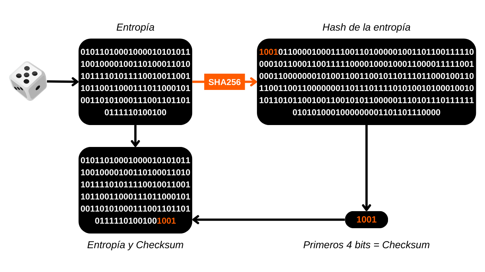
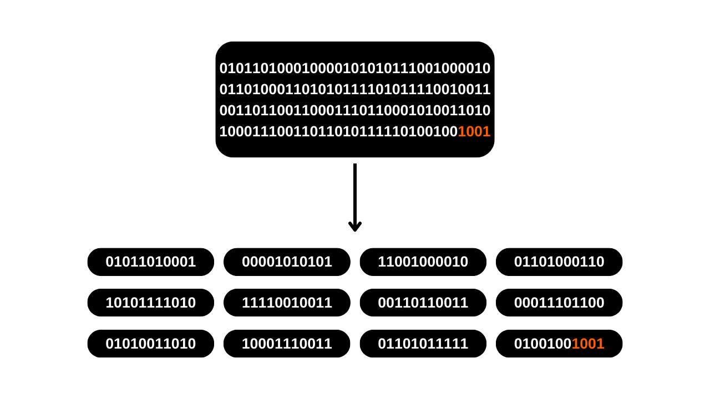
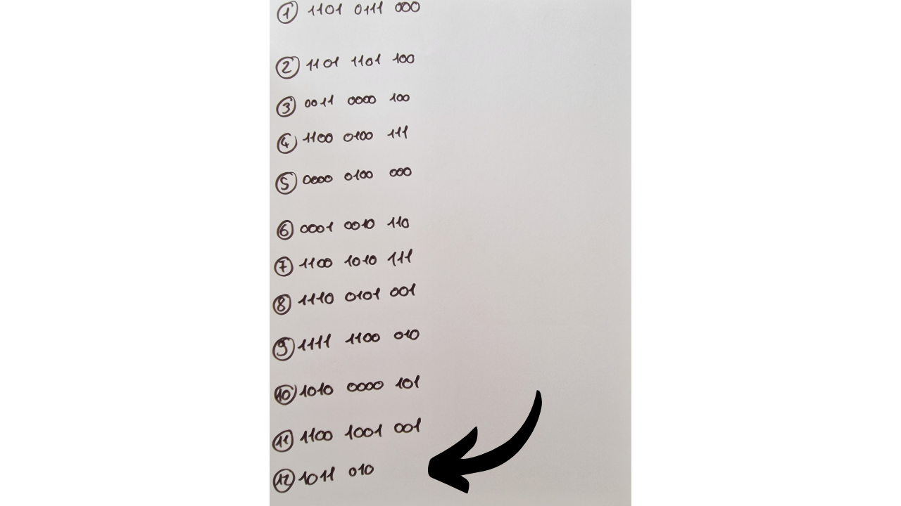
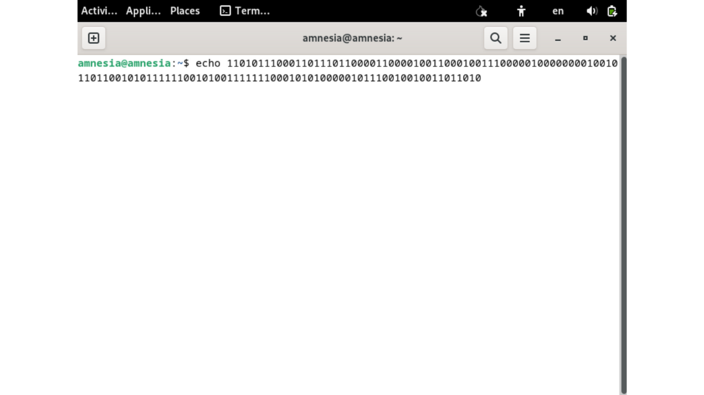
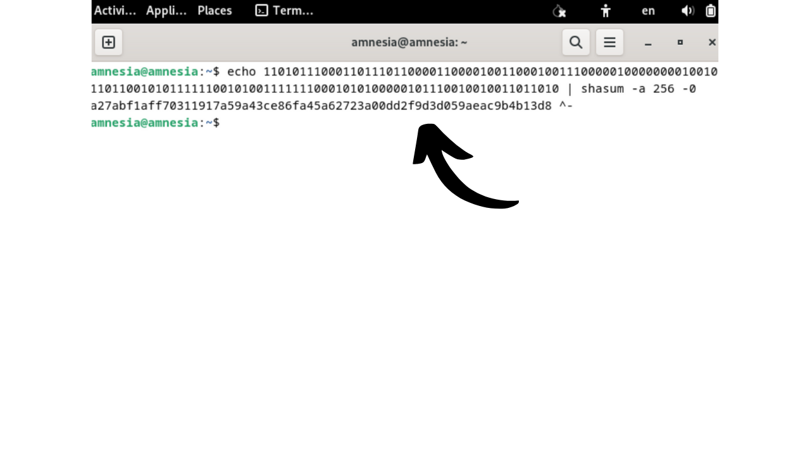

En este tutorial, aprenderás cómo construir manualmente una frase de recuperación para una cartera de Bitcoin usando lanzamientos de dados.

**ADVERTENCIA:** Generar una frase mnemotécnica de manera segura requiere no dejar rastro digital durante su creación, lo cual es casi imposible. De lo contrario, la cartera presentaría una superficie de ataque demasiado grande, aumentando significativamente el riesgo de que tus bitcoins sean robados. **Por lo tanto, se desaconseja fuertemente transferir fondos a una cartera que dependa de una frase de recuperación que hayas generado tú mismo.** Incluso si sigues este tutorial al pie de la letra, existe un riesgo de que la frase de recuperación pueda ser comprometida. **Por lo tanto, este tutorial no debe aplicarse a la creación de una cartera real.** Usar una cartera de hardware para esta tarea es mucho menos arriesgado, ya que genera la frase sin conexión, y verdaderos criptógrafos han considerado el uso de fuentes de entropía cualitativas.

Este tutorial solo puede seguirse con fines experimentales para la creación de una cartera ficticia, sin la intención de usarla con bitcoins reales. Sin embargo, la experiencia ofrece dos beneficios:
- Primero, te permite entender mejor los mecanismos en la base de tu cartera de Bitcoin;
- En segundo lugar, te permite saber cómo hacerlo. ¡No estoy diciendo que será útil algún día, pero podría serlo!

## ¿Qué es una frase mnemotécnica?
Una frase de recuperación, también a veces llamada "mnemónica", "frase semilla" o "frase secreta", es una secuencia usualmente compuesta de 12 o 24 palabras, que se genera de manera pseudoaleatoria a partir de una fuente de entropía. La secuencia pseudoaleatoria siempre se completa con un checksum.

La frase mnemotécnica, junto con una frase de paso opcional, se utiliza para derivar de manera determinista todas las claves asociadas con una cartera HD (Determinista Jerárquica). Esto significa que a partir de esta frase, es posible generar y recrear de manera determinista todas las claves privadas y públicas de la cartera de Bitcoin, y consecuentemente, acceder a los fondos asociados con ella.

El propósito de esta frase es proporcionar un medio fácil de usar para la copia de seguridad y recuperación de bitcoins. Es imperativo mantener la frase mnemotécnica en un lugar seguro y protegido, ya que cualquier persona en posesión de esta frase tendría acceso a los fondos de la cartera correspondiente. Si se usa en el contexto de una cartera tradicional, y sin una frase de paso opcional, a menudo constituye un SPOF (Punto Único de Fallo).
Usualmente, esta frase se te da directamente al crear tu cartera, por el software o cartera de hardware utilizado. Sin embargo, también es posible generar esta frase por ti mismo, y luego introducirla en el soporte elegido para derivar las claves de la cartera. Esto es lo que aprenderemos a hacer en este tutorial.

## Preparación de los materiales necesarios
Para la creación de tu frase de recuperación a mano, necesitarás:
- Una hoja de papel;
- Un bolígrafo o lápiz, idealmente de diferentes colores para facilitar la organización;
- Varios dados, para minimizar los riesgos de sesgo relacionados con un dado desequilibrado;
- [La lista de 2048 palabras BIP39](https://github.com/DecouvreBitcoin/sovereign-university-data/tree/dev/tutorials/others/generate-mnemonic-phrase/assets/BIP39-WORDLIST.pdf) impresa.

Posteriormente, el uso de un ordenador con terminal se hará necesario para el cálculo del checksum. Es precisamente por esta razón que desaconsejo la generación manual de la frase mnemotécnica. En mi opinión, la intervención de un ordenador, incluso bajo las precauciones mencionadas en este tutorial, aumenta significativamente la vulnerabilidad de una cartera.
Para un enfoque experimental relacionado con una "billetera ficticia", es posible usar tu computadora habitual y su terminal. Sin embargo, para un enfoque más riguroso destinado a limitar los riesgos de comprometer tu frase, lo ideal sería usar una PC desconectada de internet (preferiblemente sin un componente wifi o conexión cableada RJ45), equipada con el mínimo de periféricos (todos los cuales deberían estar conectados por cable, para evitar Bluetooth), y sobre todo, funcionando en una distribución Linux amnésica como [Tails](https://tails.boum.org/index.fr.html), iniciada desde un medio extraíble.


En un contexto real, sería crucial asegurar la confidencialidad de tu espacio de trabajo eligiendo una ubicación lejos de miradas indiscretas, sin tráfico de personas y libre de cámaras (webcams, teléfonos...).
Se recomienda usar un alto número de dados para mitigar el impacto de un dado potencialmente desequilibrado en la entropía. Antes de su uso, se recomienda revisar los dados: esto se puede lograr probándolos en un tazón de agua saturada con sal, permitiendo que los dados floten. Luego procede a lanzar cada dado unas veinte veces en el agua salada, observando los resultados. Si una o dos caras aparecen desproporcionadamente en comparación con las otras, extiende la prueba con más lanzamientos. Resultados distribuidos uniformemente indican que el dado es confiable. Sin embargo, si una o dos caras dominan regularmente, estos dados deberían ser apartados, ya que podrían comprometer la entropía de tu frase mnemónica y, consecuentemente, la seguridad de tu billetera.
En condiciones reales, después de realizar estas comprobaciones, estarías listo para generar la entropía necesaria. Para una billetera ficticia experimental creada como parte de este tutorial, naturalmente podrías saltarte estas preparaciones.

## Unos Recordatorios sobre la Frase de Recuperación
Para comenzar, revisaremos los fundamentos de la creación de una frase mnemónica según BIP39. Como se explicó anteriormente, la frase se deriva de información pseudoaleatoria de cierto tamaño, a la cual se le añade un checksum para asegurar su integridad.

El tamaño de esta información inicial, a menudo referida como "entropía", está determinado por el número de palabras que deseas obtener en la frase de recuperación. Los formatos más comunes son frases de 12 y 24 palabras, derivadas respectivamente de una entropía de 128 bits y 256 bits. Aquí hay una tabla que muestra los diferentes tamaños de entropía según BIP39:

| Frase (palabras) | Entropía (bits) | Checksum (bits) | Entropía + Checksum (bits) |
| ---------------- | --------------- | --------------- | -------------------------- |
| 12               | 128             | 4               | 132                        |
| 15               | 160             | 5               | 165                        |
| 18               | 192             | 6               | 198                        |
| 21               | 224             | 7               | 231                        |
| 24               | 256             | 8               | 264                        |

La entropía es, por lo tanto, un número aleatorio entre 128 y 256 bits. En este tutorial, tomaremos el ejemplo de una frase de 12 palabras, en la cual la entropía es de 128 bits, lo que significa que generaremos una secuencia aleatoria de 128 `0`s o `1`s. Esto representa un número compuesto por 128 dígitos en base 2 (binario).
Basado en esta entropía, se generará un checksum. Un checksum es un valor calculado a partir de un conjunto de datos, utilizado para verificar la integridad y validez de esos datos durante su transmisión o almacenamiento. Los algoritmos de checksum están diseñados para detectar errores accidentales o alteraciones en los datos.
En el caso de nuestra frase mnemotécnica, la función del checksum es detectar cualquier error de entrada al introducir la frase en el software de la billetera. Un checksum inválido señala la presencia de un error en la frase. Por el contrario, un checksum válido indica que la frase es muy probablemente correcta.
Para obtener este checksum, la entropía se pasa a través de la función hash SHA256. Esta operación produce una secuencia de 256 bits como salida, de los cuales solo se retendrán los primeros `N` bits, dependiendo `N` de la longitud deseada de la frase de recuperación (ver la tabla arriba). Así, para una frase de 12 palabras, se conservarán los primeros 4 bits del hash.

Estos primeros 4 bits, formando el checksum, se añadirán entonces a la entropía original. En esta etapa, la frase de recuperación está prácticamente constituida, pero aún está en forma binaria. Para convertir esta secuencia binaria en palabras de acuerdo con el estándar BIP39, primero dividiremos la secuencia en segmentos de 11 bits.

Cada uno de estos paquetes representa un número en binario que luego se convertirá en un número decimal (base 10). Añadiremos `1` a cada número, porque en informática, el conteo comienza desde `0`, pero la lista BIP39 está numerada comenzando desde `1`.


Finalmente, el número en decimal nos indica la posición de la palabra correspondiente en [la lista de 2048 palabras BIP39](https://github.com/DecouvreBitcoin/sovereign-university-data/tree/dev/tutorials/others/generate-mnemonic-phrase/assets/BIP39-WORDLIST.pdf). Solo queda seleccionar estas palabras para componer la frase de recuperación para nuestra billetera.


Ahora, ¡pasemos a la práctica! Generaremos una frase de recuperación de 12 palabras. Sin embargo, esta operación permanece idéntica en el caso de una frase de 24 palabras, excepto que requeriría 256 bits de entropía y un checksum de 8 bits, como se indica en la tabla de equivalencia ubicada al principio de esta sección.

## Paso 1: Generando la Entropía
Prepara tu hoja de papel, tu bolígrafo y tus dados. Para comenzar, necesitaremos generar 128 bits aleatoriamente, es decir, una secuencia de 128 `0`s y `1`s seguidos. Para hacer esto, usaremos dados.


Los dados tienen 6 caras, todas con una probabilidad idéntica de ser lanzadas. Sin embargo, nuestro objetivo es producir un resultado binario, es decir, dos posibles resultados. Por lo tanto, asignaremos el valor `0` a cada lanzamiento que caiga en un número par, y `1` para cada número impar. Como resultado, realizaremos 128 lanzamientos para crear nuestra entropía de 128 bits. Si el dado muestra `2`, `4`, o `6`, anotaremos `0`; para `1`, `3`, o `5`, será `1`. Cada resultado se anotará secuencialmente, de izquierda a derecha y de arriba abajo.

Para facilitar los siguientes pasos, agruparemos los bits en paquetes de cuatro y tres, como se muestra en la imagen a continuación. Cada línea debe tener 11 bits: 2 paquetes de 4 bits y un paquete de 3 bits.


Como puedes ver en mi ejemplo, la duodécima palabra está actualmente compuesta solo por 7 bits. Estos se completarán con los 4 bits del checksum en el siguiente paso para formar los 11 bits.


## Paso 2: Calculando el checksum
Este paso es el más crítico en la generación manual de una frase mnemotécnica, ya que requiere el uso de una computadora. Como se mencionó anteriormente, el checksum corresponde al inicio del hash SHA256 generado a partir de la entropía. Aunque teóricamente es posible calcular un SHA256 a mano para una entrada de 128 o 256 bits, esta tarea podría llevar una semana entera. Además, cualquier error en los cálculos manuales solo se identificaría al final del proceso, obligándote a empezar de nuevo desde el principio. Por lo tanto, es inimaginable hacer este paso con solo una hoja de papel y un bolígrafo. Una computadora es casi obligatoria. Si aún quieres aprender cómo hacer un SHA256 a mano, explicamos cómo hacerlo en [el curso CRYPTO301](https://planb.network/en/courses/crypto301).

Por esta razón, aconsejo fuertemente en contra de crear una frase manual para una cartera real. En mi opinión, usar una computadora en esta etapa, incluso con todas las precauciones necesarias, aumenta de manera irrazonable la superficie de ataque de la cartera.
Para calcular el checksum dejando la menor cantidad de rastros posible, usaremos una distribución Linux amnésica desde una unidad extraíble llamada **Tails**. Este sistema operativo se inicia desde una memoria USB y opera enteramente en la RAM del computador, sin interactuar con el disco duro. Así, en teoría, no deja rastro en el computador después de que se apaga. Ten en cuenta que Tails solo es compatible con procesadores tipo x86_64, y no con procesadores tipo ARM.
Para comenzar, desde tu computadora habitual, [descarga la imagen de Tails desde su sitio web oficial](https://tails.net/install/index.fr.html). Asegura la autenticidad de tu descarga utilizando la firma del desarrollador o la herramienta de verificación ofrecida por el sitio.

Primero, procede a formatear tu memoria USB, luego instala Tails usando una herramienta como [Balena Etcher](https://etcher.balena.io/).

Después de confirmar que el flasheo fue exitoso, apaga tu computadora. Luego procede a desconectar la fuente de alimentación y quitar el disco duro de la placa base de tu PC. En el caso de que esté presente una tarjeta WiFi, debería ser desconectada. De manera similar, quita cualquier cable Ethernet RJ45. Para minimizar el riesgo de fuga de datos, se recomienda desenchufar tu caja de internet y apagar tu teléfono móvil. Además, asegúrate de desconectar cualquier periférico superfluo de tu computadora, como el micrófono, la cámara web, los altavoces o el auricular, y verifica que otros periféricos solo estén conectados por cable. Todos estos pasos de preparación de la PC no son esenciales, pero simplemente ayudan a reducir la superficie de ataque tanto como sea posible en un contexto real.

Verifica si tu BIOS está configurada para permitir el arranque desde un dispositivo externo. Si no, cambia esta configuración, luego reinicia tu máquina. Una vez que hayas asegurado el entorno informático, reinicia la computadora desde la memoria USB con Tails OS.

En la pantalla de bienvenida de Tails, selecciona el idioma de tu elección, luego lanza el sistema haciendo clic en `Start Tails`.


Desde el escritorio, haz clic en la pestaña `Applications`.


Navega al menú `Utilities`.


Y finalmente, haz clic en la aplicación `Terminal`.


Llegarás a un nuevo terminal de comandos en blanco.


Escribe el comando `echo`, seguido de tu entropía generada previamente, asegurándote de insertar un espacio entre `echo` y tu secuencia de dígitos binarios.


Añade un espacio adicional, luego introduce el siguiente comando, utilizando un *pipe* (`|`):
```plaintext
| shasum -a 256 -0
```


En el ejemplo con mi entropía, el comando total es el siguiente:
```plaintext
echo 11010111000110111011000011000010011000100111000001000000001001011011001010111111001010011111110001010100000101110010010011011010 | shasum -a 256 -0
```

En este comando:
- `echo` se utiliza para enviar la secuencia de bits;
- `|`, el *pipe*, se usa para dirigir la salida del comando `echo` a la entrada del siguiente comando;
- `shasum` inicia una función de hashing perteneciente a la familia SHA (*Secure Hash Algorithm*);
- `-a` especifica la elección de un algoritmo de hashing específico;
- `256` indica que se utiliza el algoritmo SHA256;
- `-0` permite que la entrada sea interpretada como un número binario.

Después de verificar cuidadosamente que tu secuencia binaria no contenga errores de tipeo, presiona la tecla `Enter` para ejecutar el comando. El terminal mostrará entonces el hash SHA256 de tu entropía.



Por ahora, el hash se expresa en formato hexadecimal (base 16). Por ejemplo, el mío es:
```plaintext
a27abf1aff70311917a59a43ce86fa45a62723a00dd2f9d3d059aeac9b4b13d8
```

Para finalizar nuestra frase mnemotécnica, solo necesitamos los primeros 4 bits del hash, que constituyen el checksum. En formato hexadecimal, cada carácter representa 4 bits. Por lo tanto, solo retendremos el primer carácter del hash. Para una frase de 24 palabras, sería necesario tener en cuenta los dos primeros caracteres. En mi ejemplo, esto corresponde a la letra: `a`. Anota cuidadosamente este carácter en algún lugar de tu hoja, luego apaga tu computadora.

El siguiente paso es convertir este carácter hexadecimal (base 16) en un valor binario (base 2), ya que nuestra frase está construida en este formato. Para hacerlo, puedes usar la siguiente tabla de conversión:

| Decimal (base 10) | Hexadecimal (base 16) | Binario (base 2) |
| ----------------- | --------------------- | ---------------- |
| 0                 | 0                     | 0000             |
| 1                 | 1                     | 0001             |
| 2                 | 2                     | 0010             |
| 3                 | 3                     | 0011             |
| 4                 | 4                     | 0100             |
| 5                 | 5                     | 0101             |
| 6                 | 6                     | 0110             |
| 7                 | 7                     | 0111             |
| 8                 | 8                     | 1000             |
| 9                 | 9                     | 1001             |
| 10                | a                     | 1010             |
| 11                | b                     | 1011             |
| 12                | c                     | 1100             |
| 13                | d                     | 1101             |
| 14                | e                     | 1110             |
| 15                | f                     | 1111             |

En mi ejemplo, la letra `a` corresponde al número binario `1010`. Estos 4 bits forman el checksum de nuestra frase de recuperación. Ahora puedes añadirlos a la entropía ya anotada en tu hoja de papel, colocándolos al final de la última palabra.


Tu frase mnemotécnica está ahora completa, pero está en formato binario. El siguiente paso será convertirla al sistema decimal para que luego puedas asociar cada número con una palabra correspondiente en la lista BIP39.

## Paso 3: Convirtiendo Palabras en Decimal
Para convertir cada línea binaria en un número decimal, utilizaremos un método que facilita el cálculo manual. Actualmente, tienes doce líneas en tu papel, cada una compuesta por 11 dígitos binarios `0` o `1`. Para proceder con una conversión a decimal, asigna a cada primer dígito el valor `1024` si es `1`, de lo contrario `0`. Para el segundo dígito, el valor `512` será asignado si es `1`, de lo contrario `0`, y así sucesivamente hasta el undécimo dígito. Las correspondencias son las siguientes:
- 1er bit: `1024`;
- 2do bit: `512`;
- 3er bit: `256`;
- 4to bit: `128`;
- 5to bit: `64`;
- 6to bit: `32`;
- 7mo bit: `16`;
- 8vo bit: `8`;
- 9no bit: `4`;
- 10mo bit: `2`;
- 11vo bit: `1`.

Para cada línea, sumaremos los valores correspondientes a los dígitos `1` para obtener el número decimal equivalente del número binario. Tomemos el ejemplo de una línea binaria igual a:
```plaintext
1010 1101 101
```

La conversión sería la siguiente:

El resultado sería entonces:
```plaintext
1389
```

Para cada bit igual a `1`, reporta el número asociado abajo. Para cada bit igual a `0`, no reportes nada.


Luego, simplemente suma todos los números validados por los `1`s para obtener el número decimal que representa cada línea binaria. Por ejemplo, así es como se ve para mi hoja:


## Paso 4: Buscando las Palabras de la Frase Mnemotécnica
Con los números decimales obtenidos, ahora podemos localizar las palabras correspondientes en la lista para componer la frase mnemotécnica. Sin embargo, la numeración de las 2048 palabras en la lista BIP39 varía de `1` a `2048`. Pero, nuestros resultados binarios calculados varían de `0` a `2047`. Por lo tanto, hay un desplazamiento de una unidad que necesita ser corregido. Para corregir este desplazamiento, simplemente añade `1` a los doce números decimales previamente calculados.


Después de este ajuste, tienes el rango de cada palabra dentro de la lista. Todo lo que queda es identificar cada palabra por su número. Obviamente, como con todos los otros pasos, no debes usar tu computadora para realizar esta conversión. Por lo tanto, asegúrate de haber impreso la lista de antemano.
[**-> Imprime la lista BIP39 en formato A4.**](https://github.com/DecouvreBitcoin/sovereign-university-data/tree/dev/tutorials/others/generate-mnemonic-phrase/assets/BIP39-WORDLIST.pdf)

Por ejemplo, si el número derivado de la primera línea es 1721, la palabra correspondiente será la 1721 en la lista:
```plaintext
1721. strike
```

De esta manera, procedemos sucesivamente con las 12 palabras para construir nuestra frase mnemónica.


## Paso 5: Creando la Cartera de Bitcoin
En este punto, todo lo que queda es importar nuestra frase mnemónica en un software de cartera de Bitcoin. Dependiendo de nuestras preferencias, esto se puede hacer en un software de escritorio para obtener una cartera caliente, o en una cartera de hardware para una cartera fría.


Solo durante la importación puedes verificar la validez de tu suma de comprobación. Si el software muestra un mensaje como `Checksum Inválido`, significa que un error se ha colado en tu proceso de creación. Generalmente, este error proviene ya sea de un error de cálculo durante las conversiones y adiciones manuales, o de un error tipográfico al ingresar tu entropía en el terminal en Tails. Será necesario reiniciar el proceso desde el principio para corregir estos errores.


Después de crear tu cartera, no olvides respaldar tu frase de recuperación en un medio físico, como papel o metal, y destruir la hoja de cálculo utilizada durante su generación para evitar cualquier fuga de información.

## Caso Específico de la Opción de Lanzamiento de Dados en Coldcards
Las carteras de hardware de la familia Coldcard ofrecen [una característica llamada *Lanzamiento de Dados*](https://youtu.be/Rc29d9m92xg?si=OeFW2iCGRvxexhK7), para generar la frase de recuperación de tu cartera con dados. Este método es excelente porque te da control directo sobre la creación de entropía, sin requerir el uso de un dispositivo externo para calcular la suma de comprobación como en nuestro tutorial.

Sin embargo, recientemente se han reportado incidentes de robo de bitcoins debido al uso inadecuado de esta característica. De hecho, un número demasiado limitado de lanzamientos de dados puede llevar a una entropía insuficiente, teóricamente haciendo posible forzar bruscamente la frase mnemónica y robar los bitcoins asociados. Para evitar este riesgo, se aconseja realizar al menos 99 lanzamientos de dados en el Coldcard, lo que asegura suficiente entropía.

El método de interpretar los resultados propuesto por Coldcard difiere del presentado en este tutorial. Mientras recomendamos 128 lanzamientos para alcanzar 128 bits de seguridad en el tutorial, Coldcard sugiere 99 lanzamientos para alcanzar 256 bits de seguridad. De hecho, en nuestro enfoque, solo dos resultados son posibles para cada lanzamiento de dados: par (`0`) o impar (`1`). Por lo tanto, la entropía generada por cada lanzamiento es igual a `log2(2)`. En el caso de Coldcard, que toma en cuenta las seis posibles caras de los dados (de `1` a `6`), la entropía por lanzamiento es igual a `log2(6)`. Es por esto que en nuestro tutorial, necesitamos realizar más lanzamientos para alcanzar el mismo nivel de entropía.

```plaintext
Entropía = número de lanzamientos * log2(número de posibles resultados en los dados)
Coldcard:

Entropía = 99 * log2(6)
Entropía = 255.91

Nuestro tutorial:

Entropía = 128 * log2(2)
Entropía = 128