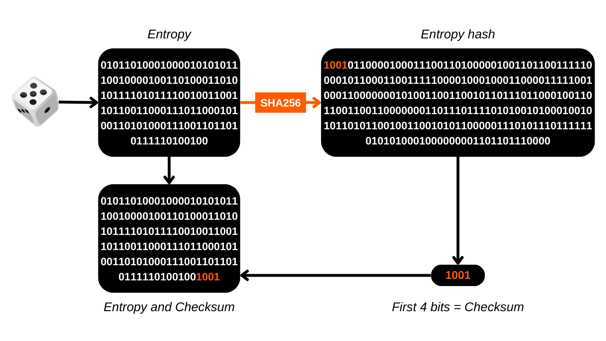

このチュートリアルでは、サイコロのロールを使用してビットコインウォレットのリカバリーフレーズを手動で構築する方法を学びます。

**警告:** 助記フレーズを安全に生成するには、その作成中にデジタルトレースを残さないことが求められますが、これはほぼ不可能です。そうでなければ、ウォレットはあまりにも大きな攻撃対象となり、ビットコインが盗まれるリスクが大幅に高まります。**そのため、自分で生成したリカバリーフレーズに依存するウォレットに資金を移すことは強く勧められません。**このチュートリアルに完全に従ったとしても、リカバリーフレーズが侵害されるリスクがあります。**したがって、このチュートリアルは実際のウォレットの作成には適用すべきではありません。**このタスクには、フレーズをオフラインで生成し、実際の暗号学者が質の高いエントロピー源の使用を検討しているハードウェアウォレットの使用がはるかにリスクが低いです。

このチュートリアルは、実際のビットコインを使用する意図なしに、架空のウォレットの作成のためにのみ実験目的でフォローすることができます。しかし、この経験は二つの利点を提供します：
- まず、ビットコインウォレットの基礎となるメカニズムをよりよく理解することができます；
- 第二に、それをどのように行うかを知ることができます。いつか役立つとは言いませんが、可能性はあります！

## 助記フレーズとは何か？
リカバリーフレーズ、または時には「助記」「シードフレーズ」「秘密フレーズ」とも呼ばれるものは、通常、エントロピーの源から擬似ランダムに生成される12または24の単語のシーケンスで構成されます。擬似ランダムシーケンスは常にチェックサムで完了します。

助記フレーズは、オプションのパスフレーズとともに、HD（階層的決定性）ウォレットに関連するすべてのキーを決定論的に導出するために使用されます。これは、このフレーズから、ビットコインウォレットのすべてのプライベートキーとパブリックキーを決定論的に生成し、再作成し、その結果、それに関連する資金にアクセスすることが可能であることを意味します。

この文の目的は、ビットコインのバックアップと回復のための使いやすい手段を提供することです。助記フレーズを安全で安心な場所に保管することが不可欠です。なぜなら、このフレーズを所持している人は誰でも対応するウォレットの資金にアクセスできるからです。オプショナルなパスフレーズなしで従来のウォレットの文脈で使用される場合、しばしばSPOF（シングルポイントオブフェイル）を構成します。
通常、このフレーズはウォレットを作成する際に、使用されるソフトウェアやハードウェアウォレットによって直接提供されます。しかし、自分でこのフレーズを生成し、選択したサポートに入力してウォレットキーを導出することも可能です。これが、このチュートリアルで学ぶことになります。

## 必要な材料の準備
手作業でリカバリーフレーズを作成するためには、以下が必要です：
- 紙のシート；
- ペンまたは鉛筆、できれば組織化を容易にするために異なる色が理想的；
- 偏りのあるサイコロに関連するリスクを最小限に抑えるために、複数のサイコロ；
- 印刷された[2048 BIP39単語のリスト](https://github.com/DecouvreBitcoin/sovereign-university-data/tree/dev/tutorials/others/generate-mnemonic-phrase/assets/BIP39-WORDLIST.pdf)。

その後、チェックサムの計算にはコンピューターとターミナルの使用が必要になります。この理由から、私は助記フレーズの手動生成を勧めません。私の意見では、このチュートリアルで述べられた予防措置の下でも、コンピューターの介入はウォレットの脆弱性を大幅に高めます。
「架空のウォレット」に関する実験的なアプローチでは、通常使用しているコンピュータとそのターミナルを使用することができます。しかし、フレーズの危険性を限定することを目指したより厳格なアプローチでは、インターネットから切断されたPC（できればWiFiコンポーネントやRJ45有線接続がないもの）を使用し、最小限の周辺機器（すべてケーブルで接続されるべき）を装備し、何よりも、取り外し可能なメディアから起動される[Tails](https://tails.boum.org/index.fr.html)のような記憶喪失型Linuxディストリビューションで動作することが理想的です。


実際の状況では、覗き見られることのない場所を選び、人通りがなく、カメラ（ウェブカメラ、携帯電話など）がないことを確認することで、作業スペースの機密性を保つことが重要です。
エントロピーにおける潜在的にアンバランスなダイスの影響を軽減するために、多くのダイスを使用することが推奨されます。使用前にダイスをチェックすることが推奨されます：これは、飽和塩水のボウルでテストすることによって達成できます。ダイスを浮かべ、塩水の中で各ダイスを約20回転がせ、結果を観察します。もし一つか二つの面が他の面に比べて不釣り合いに現れる場合は、より多くのロールでテストを延長します。均一に分布した結果は、ダイスが信頼できることを示します。しかし、一つか二つの面が定期的に支配する場合、これらのダイスは脇に置くべきです。なぜなら、それらはあなたのニーモニックフレーズのエントロピーと、その結果としてあなたのウォレットのセキュリティを損なう可能性があるからです。
実際の条件下では、これらのチェックを行った後、必要なエントロピーを生成する準備が整います。このチュートリアルの一環として作成された実験的な架空のウォレットについては、これらの準備を自然にスキップすることができます。

## リカバリーフレーズに関するいくつかのリマインダー
まず、BIP39に従ってニーモニックフレーズを作成する基本を見直しましょう。以前説明したように、フレーズは特定のサイズの擬似ランダム情報から派生し、その完全性を保証するためにチェックサムが追加されます。

この初期情報のサイズ、通常「エントロピー」と呼ばれるものは、リカバリーフレーズで得たい単語の数によって決まります。最も一般的な形式は、それぞれ128ビットと256ビットのエントロピーから派生する12語と24語のフレーズです。ここにBIP39によるエントロピーの異なるサイズを示す表があります：

| フレーズ（単語） | エントロピー（ビット） | チェックサム（ビット） | エントロピー + チェックサム（ビット） |
| --------------- | --------------- | --------------- | -------------------------- |
| 12              | 128             | 4               | 132                        |
| 15              | 160             | 5               | 165                        |
| 18              | 192             | 6               | 198                        |
| 21              | 224             | 7               | 231                        |
| 24              | 256             | 8               | 264                        |

エントロピーは、128ビットから256ビットの間のランダムな数です。このチュートリアルでは、エントロピーが128ビットである12語のフレーズの例を取り上げます。これは、128の`0`または`1`のランダムなシーケンスを生成することを意味します。これは、2進数（バイナリ）で128桁の数を表します。
このエントロピーに基づいて、チェックサムが生成されます。チェックサムは、データセットから計算される値で、そのデータの送信または保存中の完全性と有効性を検証するために使用されます。チェックサムアルゴリズムは、データの偶発的なエラーや変更を検出するように設計されています。
私たちのニーモニックフレーズの場合、チェックサムの機能は、ウォレットソフトウェアにフレーズを入力する際の入力エラーを検出することです。無効なチェックサムは、フレーズ内にエラーが存在することを示します。逆に、有効なチェックサムは、フレーズが最も確実に正しいことを示します。
このチェックサムを取得するために、エントロピーはSHA256ハッシュ関数を通過します。この操作は、出力として256ビットのシーケンスを生成しますが、そのうち最初の`N`ビットのみが保持されます。`N`は、回復フレーズの望ましい長さに応じて変わります（上記の表を参照）。したがって、12語のフレーズの場合、ハッシュの最初の4ビットが保持されます。

これら最初の4ビット、つまりチェックサムは、元のエントロピーに追加されます。この段階で、回復フレーズは実質的に構成されますが、まだバイナリ形式です。このバイナリシーケンスをBIP39標準に従って単語に変換するために、まずシーケンスを11ビットのセグメントに分割します。

これらの各パケットは、バイナリでの数を表し、その後、10進数（基数10）に変換されます。コンピューティングではカウントが`0`から始まるため、各数に`1`を加えますが、BIP39リストは`1`から始まる番号付けです。


最終的に、10進数での数は、[2048語のBIP39単語リスト](https://github.com/DecouvreBitcoin/sovereign-university-data/tree/dev/tutorials/others/generate-mnemonic-phrase/assets/BIP39-WORDLIST.pdf)の中で対応する単語の位置を教えてくれます。あとは、これらの単語を選択して、私たちのウォレットのための回復フレーズを構成するだけです。


さあ、実践に移りましょう！12語の回復フレーズを生成します。ただし、この操作は24語のフレーズの場合でも同様ですが、256ビットのエントロピーと、このセクションの始めに位置する等価表に示されているように、8ビットのチェックサムが必要になります。

## ステップ1: エントロピーの生成
紙とペン、そしてサイコロを準備してください。始めるにあたり、ランダムに128ビット、つまり128の`0`と`1`の連続したシーケンスを生成する必要があります。これを行うために、サイコロを使用します。


サイコロには6面があり、すべてが同じ確率で転がります。しかし、私たちの目標はバイナリ結果、つまり2つの可能な結果を生み出すことです。したがって、偶数が出た各ロールには`0`の値を割り当て、奇数の場合は`1`を割り当てます。その結果、128ビットのエントロピーを作成するために128回のロールを実行します。サイコロが`2`、`4`、または`6`を示した場合は`0`を、`1`、`3`、または`5`を示した場合は`1`を書き留めます。各結果は、左から右へ、上から下へと順番に記録されます。

次のステップを容易にするために、下の画像に示されているように、ビットを4つと3つのパケットにグループ化します。各行は11ビットでなければならず、4ビットのパケット2つと3ビットのパケット1つで構成されます。


以下は、技術コンテンツを日本語に翻訳したものです。

私の例で見ていただけるように、現在12番目の単語は7ビットで構成されています。これらは次のステップでチェックサムの4ビットによって補完され、11ビットを形成します。


## ステップ2: チェックサムの計算
このステップは、ニーモニックフレーズを手動で生成する際に最も重要であり、コンピュータの使用を要求します。前述のように、チェックサムはエントロピーから生成されたSHA256ハッシュの始まりに対応します。理論的には、128ビットまたは256ビットの入力に対してSHA256を手計算で行うことは可能ですが、この作業には1週間かかる可能性があります。さらに、手計算でのエラーはプロセスの最後にのみ特定され、最初からやり直さなければならないため、紙とペンだけでこのステップを行うことは考えられません。コンピュータはほぼ必須です。それでも手計算でSHA256を行いたい場合は、[CRYPTO301コース](https://planb.network/en/courses/crypto301)でその方法を説明しています。

この理由から、実際のウォレットに手動フレーズを作成することは強くお勧めしません。私の意見としては、この段階でコンピュータを使用することは、必要な予防策を講じたとしても、不合理にウォレットの攻撃面を増加させます。
可能な限り少ない痕跡を残してチェックサムを計算するために、**Tails**というリムーバブルドライブから起動するアムネジックLinuxディストリビューションを使用します。このオペレーティングシステムはUSBスティックから起動し、コンピュータのRAM上で完全に動作し、ハードドライブとは一切交信しません。理論的には、コンピュータをオフにした後、コンピュータ上に痕跡を残さないとされています。Tailsはx86_64タイプのプロセッサにのみ対応しており、ARMタイプのプロセッサには対応していないことに注意してください。
まず、通常使用しているコンピュータから[Tailsの公式ウェブサイトからTailsイメージをダウンロード](https://tails.net/install/index.fr.html)してください。開発者の署名またはサイトが提供する検証ツールを使用してダウンロードの真正性を確認してください。

最初に、USBスティックをフォーマットし、[Balena Etcher](https://etcher.balena.io/)のようなツールを使用してTailsをインストールしてください。

フラッシングが成功したことを確認したら、コンピュータをオフにします。次に、電源を切断し、PCのマザーボードからハードドライブを取り外してください。WiFiカードが存在する場合は、それも切断する必要があります。同様に、RJ45イーサネットケーブルも取り外してください。データ漏洩のリスクを最小限に抑えるために、インターネットボックスをアンプラグし、携帯電話をオフにすることをお勧めします。さらに、マイク、ウェブカメラ、スピーカー、ヘッドセットなどの余分な周辺機器をコンピュータから切断し、他の周辺機器が有線経由でのみ接続されていることを確認してください。これらのPC準備ステップは必須ではありませんが、実際のコンテキストでできるだけ攻撃面を減らすために単に役立ちます。

BIOSが外部デバイスからのブートを許可するように設定されているか確認してください。そうでない場合は、この設定を変更し、マシンを再起動してください。コンピュータ環境を確保したら、Tails OSのUSBスティックからコンピュータを再起動してください。

Tailsのウェルカム画面で、希望の言語を選択し、`Start Tails`をクリックしてシステムを起動してください。


デスクトップから`Applications`タブをクリックしてください。


`Utilities`メニューに移動してください。


最後に、`Terminal` アプリケーションをクリックしてください。


新しい空白のコマンドターミナルが表示されます。


`echo` コマンドを入力し、その後に以前生成したエントロピーを続けて入力してください。`echo` と二進数のシーケンスの間にはスペースを挿入してください。


追加のスペースを入れた後、次のコマンドを *パイプ* (`|`) を使用して入力します：
```plaintext
| shasum -a 256 -0
```


私のエントロピーを例にすると、全体のコマンドは以下の通りです：
```plaintext
echo 11010111000110111011000011000010011000100111000001000000001001011011001010111111001010011111110001010100000101110010010011011010 | shasum -a 256 -0
```

このコマンドでは：
- `echo` はビットシーケンスを送信するために使用されます；
- `|`、*パイプ* は、`echo` コマンドの出力を次のコマンドの入力に向けるために使用されます；
- `shasum` は SHA (*Secure Hash Algorithm*、セキュアハッシュアルゴリズム) ファミリーに属するハッシュ関数を開始します；
- `-a` は特定のハッシュアルゴリズムの選択を指定します；
- `256` は SHA256 アルゴリズムが使用されていることを示します；
- `-0` は入力を二進数として解釈することを許可します。

二進数のシーケンスに入力ミスがないことを慎重に確認した後、`Enter` キーを押してコマンドを実行します。すると、ターミナルにはエントロピーの SHA256 ハッシュが表示されます。


現時点では、ハッシュは16進数形式（基数16）で表されています。例えば、私のものは以下の通りです：
```plaintext
a27abf1aff70311917a59a43ce86fa45a62723a00dd2f9d3d059aeac9b4b13d8
```

ニーモニックフレーズを完成させるためには、ハッシュの最初の4ビットだけが必要です。これはチェックサムを構成します。16進数形式では、各文字が4ビットを表します。したがって、ハッシュの最初の文字だけを保持します。24語のフレーズの場合は、最初の2文字を考慮する必要があります。私の例では、これは文字：`a` に相当します。この文字を慎重にどこかにメモしてから、コンピューターをオフにしてください。

次のステップは、この16進数の文字（基数16）を二進数の値（基数2）に変換することです。フレーズはこの形式で構築されています。これを行うには、以下の変換表を使用できます：

| Decimal (base 10) | Hexadecimal (base 16) | Binary (base 2) |
| ----------------- | --------------------- | ---------------- |
| 0                 | 0                     | 0000             |
| 1                 | 1                     | 0001             |
| 2                 | 2                     | 0010             |
| 3                 | 3                     | 0011             |
| 4                 | 4                     | 0100             |
| 5                 | 5                     | 0101             |
| 6                 | 6                     | 0110             |
| 7                 | 7                     | 0111             |
| 8                 | 8                     | 1000             |
| 9                 | 9                     | 1001             |
| 10                | a                     | 1010             |
| 11                | b                     | 1011             |
| 12                | c                     | 1100             |
| 13                | d                     | 1101             |
| 14                | e                     | 1110             |
| 15                | f                     | 1111             |

この例では、文字 `a` は二進数 `1010` に対応しています。これら4ビットは、復旧フレーズのチェックサムを形成します。これらを紙に既にメモしたエントロピーに追加し、最後の単語の末尾に配置することができます。


これでニーモニックフレーズは完成ですが、二進数形式になっています。次のステップは、これを十進数に変換し、それぞれの数値をBIP39リストの対応する単語と関連付けることになります。

## ステップ 3: 単語を十進数に変換
各二進数ラインを十進数に変換するために、手計算を容易にする方法を使用します。現在、紙には `0` または `1` の11ビットから成る12行があります。十進数への変換を進めるために、最初のビットには `1` であれば `1024` の値を、そうでなければ `0` を割り当てます。2番目のビットには `1` であれば `512` の値を、そうでなければ `0` を、というように11番目のビットまで続けます。対応関係は以下の通りです：
- 1ビット目: `1024`;
- 2ビット目: `512`;
- 3ビット目: `256`;
- 4ビット目: `128`;
- 5ビット目: `64`;
- 6ビット目: `32`;
- 7ビット目: `16`;
- 8ビット目: `8`;
- 9ビット目: `4`;
- 10ビット目: `2`;
- 11ビット目: `1`。

各ラインについて、`1` に対応する値を合計して、二進数の十進数相当の数値を得ます。例えば、二進数ラインが以下のようであった場合：
```plaintext
1010 1101 101
```

変換は以下のようになります：

その結果は以下のようになります：
```plaintext
1389
```

`1` に等しい各ビットについて、下に関連する数値を報告します。`0` に等しい各ビットについては、何も報告しません。


その後、`1` によって確認されたすべての数値を単純に合計して、各二進数ラインを表す十進数を得ます。例えば、私のシートでの見た目は以下のようになります：


## ステップ 4: ニーモニックフレーズの単語を探す
得られた十進数を使用して、ニーモニックフレーズを構成する対応する単語をBIP39リストで見つけることができます。しかし、2048単語のBIP39リストの番号付けは `1` から `2048` までですが、計算された二進数の結果は `0` から `2047` までです。したがって、修正が必要な1単位のシフトがあります。このシフトを修正するには、以前に計算した十進数12個に単純に `1` を加えます。


この調整の後、リスト内の各単語のランクが得られます。残る作業は、各単語をその番号で識別することです。明らかに、他のすべてのステップと同様に、この変換を行うためにコンピュータを使用してはいけません。したがって、事前にリストを印刷しておくことを確認してください。
[**-> BIP39リストをA4フォーマットで印刷する。**](https://github.com/DecouvreBitcoin/sovereign-university-data/tree/dev/tutorials/others/generate-mnemonic-phrase/assets/BIP39-WORDLIST.pdf)

例えば、最初の行から導き出された番号が1721である場合、対応する単語はリストの1721番目になります：
```plaintext
1721. strike
```

この方法で、12の単語を順次進めて、私たちのニーモニックフレーズを構築します。


## ステップ5: ビットコインウォレットの作成
この時点で、私たちのニーモニックフレーズをビットコインウォレットソフトウェアにインポートする作業のみが残っています。私たちの好みに応じて、デスクトップソフトウェアでホットウォレットを取得するか、ハードウェアウォレットでコールドウォレットを取得することができます。


インポート時にのみ、チェックサムの有効性を検証できます。ソフトウェアが`Invalid Checksum`というメッセージを表示した場合、作成プロセスに何らかのエラーが紛れ込んでいることを意味します。一般的に、このエラーは手動での変換や加算の際の計算ミス、またはTails上のターミナルでエントロピーを入力する際のタイプミスから生じます。これらのエラーを修正するためには、プロセスを最初からやり直す必要があります。


ウォレットを作成した後、回復フレーズを紙や金属などの物理的な媒体にバックアップし、生成中に使用したスプレッドシートを破棄して、情報漏洩を防ぐことを忘れないでください。

## Coldcardsのダイスロールオプションの特別なケース
Coldcardファミリーのハードウェアウォレットは、ダイスを使用してウォレットの回復フレーズを生成する[*Dice Roll*という機能](https://youtu.be/Rc29d9m92xg?si=OeFW2iCGRvxexhK7)を提供しています。この方法は、チェックサムを計算するための外部デバイスを使用せずに、エントロピーの作成を直接コントロールできるため、優れています。

しかし、この機能の不適切な使用により、最近ビットコインの盗難が報告されています。ダイスロールの回数が限られていると、エントロピーが不十分になり、理論的にはニーモニックフレーズをブルートフォース攻撃で解読し、関連するビットコインを盗むことが可能になります。このリスクを避けるために、Coldcardで少なくとも99回のダイスロールを実行することが推奨されます。これにより、十分なエントロピーが確保されます。

Coldcardが提案する結果の解釈方法は、このチュートリアルで提示された方法とは異なります。チュートリアルでは128ビットのセキュリティを達成するために128回のロールを推奨していますが、Coldcardは256ビットのセキュリティを達成するために99回のロールを提案しています。実際、私たちのアプローチでは、各ダイスロールに対して2つの結果（偶数（`0`）または奇数（`1`））のみが可能です。したがって、各ロールによって生成されるエントロピーは`log2(2)`に等しいです。Coldcardの場合、ダイスの6つの可能な面（`1`から`6`まで）を考慮に入れるため、ロールごとのエントロピーは`log2(6)`に等しくなります。これが、私たちのチュートリアルで同じレベルのエントロピーを達成するためにより多くのロールを実行する必要がある理由です。

```plaintext
エントロピー = ロールの数 * log2(サイコロの可能な結果の数)

Coldcard:

エントロピー = 99 * log2(6)
エントロピー = 255.91

私たちのチュートリアル:

エントロピー = 128 * log2(2)
エントロピー = 128