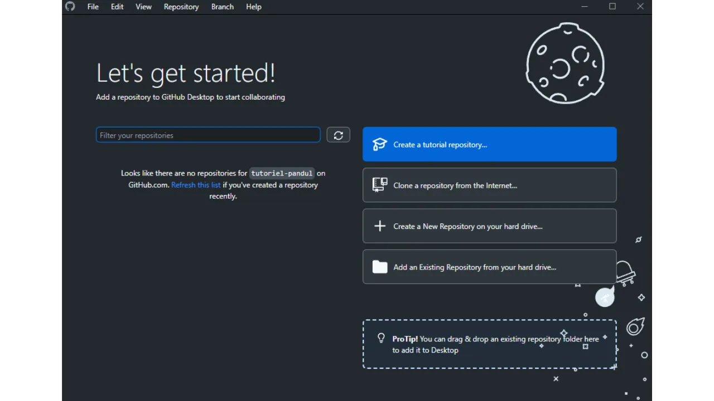

La mission de PlanB est de mettre à disposition des ressources éducatives de premier plan sur Bitcoin, et ce, dans un maximum de langues. L'intégralité des contenus publiés sur le site est open-source et est hébergée sur GitHub, ce qui offre la possibilité à quiconque de participer à l'enrichissement de la plateforme. Les contributions peuvent prendre diverses formes : correction et relecture des textes existants, traduction dans d'autres langues, mise à jour des informations ou encore création de nouveaux tutoriels encore absents de notre site.

Si vous désirez apporter votre pierre à l'édifice PlanB Network, vous allez avoir besoin d'utiliser GitHub afin de proposer des modifications. Pour ce faire, vous avez deux choix : 
- Contribuer directement depuis l'interface web de GitHub ;
- Contribuer en local et utiliser Git pour synchroniser vos modifications.

- **Contribuer directement via l'interface web de GitHub** : C'est la méthode la plus simple. Si vous êtes débutant ou si vous prévoyez de faire seulement quelques contributions mineures, cette option est sûrement la meilleure pour vous ;
- **Contribuer en local en utilisant Git** : Cette méthode est plus adaptée si vous envisagez de faire des contributions régulières ou importantes pour PlanB Network. Bien que l'installation de votre environnement Git en local sur votre ordinateur puisse sembler complexe au début, cette approche est plus efficace sur le long terme. Elle permet une gestion plus flexible des modifications. Si vous êtes novice en la matière, ne vous inquiétez pas, **nous vous expliquons tout le processus de mise en place de votre environnement dans ce tutoriel** (promis, vous n'aurez pas besoin de taper des lignes de commande).

Si vous ne savez pas du tout ce qu'est GitHub, ou si vous souhaitez en apprendre davantage sur les termes techniques liés à Git et GitHub, je vous recommande de consulter notre article d'introduction pour vous familiariser avec ces concepts.

- Pour commencer, vous allez évidemment avoir besoin d'un compte GitHub. Si vous en avez déjà un, vous pouvez vous y connecter, sinon, vous pouvez vous aider de [notre tutoriel pour en créer un nouveau](https://planb.network/tutorials/others/create-github-account).

## Étape 1 : Installer GitHub Desktop

- Rendez-vous sur https://desktop.github.com/ pour télécharger le logiciel GitHub Desktop. Ce logiciel vous permet d'interagir facilement avec GitHub, sans avoir à utiliser un terminal :

- Lors du premier lancement du logiciel, il vous sera demandé de connecter votre compte GitHub. Pour ce faire, cliquez sur `Sign in to GitHub.com` :

- Une page d'authentification s'ouvre sur votre navigateur. Entrez votre adresse email et votre mot de passe choisis lors de la création de votre compte, puis cliquez sur le bouton `Sign in` :

- Cliquez sur `Authorize desktop` pour confirmer la connexion entre votre compte et le logiciel :

- Vous serez automatiquement redirigé sur le logiciel GitHub Desktop. Cliquez sur `Finish` :

- Si vous venez de créer votre compte GitHub, vous serez redirigé vers une page indiquant que vous n'avez encore créé aucun dépôt. À ce stade, mettez de côté le logiciel GitHub Desktop ; nous y reviendrons ultérieurement :

## Étape 2 : Installer Obsidian 

Passons à l'installation du logiciel de rédaction. Ici, vous disposez de plusieurs options. Vous allez avoir besoin d'un logiciel qui prenne en charge la modification de fichiers Markdown, car PlanB Network utilise ce format pour les fichiers textes sur son dépôt. 

Il existe une multitude de logiciels spécialisés dans l'édition de fichiers Markdown, tels que Typora, conçus spécifiquement pour la rédaction. Bien que cela ne soit pas idéal, il est aussi possible de choisir un éditeur de code, comme Visual Studio Code (VSC) ou Sublime Text. Cependant, en tant que rédacteur, je préfère utiliser le logiciel Obsidian. Voyons ensemble comment l'installer et le prendre en main.

- Rendez-vous sur https://obsidian.md/download et téléchargez le logiciel :

- Installez Obsidian, lancez le logiciel, choisissez votre langue, puis cliquez sur `Quick Start` :

- Vous arriverez sur le logiciel Obsidian. Pour le moment, vous n'avez aucun fichier ouvert :

## Étape 3 : Fork le dépôt de PlanB Network

- Rendez-vous sur le dépôt des données de PlanB Network à l'adresse suivante : [https://github.com/DecouvreBitcoin/sovereign-university-data](https://github.com/DecouvreBitcoin/sovereign-university-data) :

- Depuis cette page, cliquez sur le bouton `Fork` en haut à droite de la fenêtre :

- Dans le menu de création, vous pouvez laisser les paramètres par défaut. Vérifiez que la case `Copy the dev branch only` soit bien cochée, puis cliquez sur le bouton `Create fork` :

- Vous arriverez ensuite sur votre propre fork du dépôt de PlanB Network :

Ce fork constitue un dépôt distinct de l'original, bien qu'il contienne pour le moment les mêmes données. C'est sur ce nouveau dépôt que vous allez désormais travailler.

On vient donc en quelques sorte de faire une copie du dépôt source de PlanB Network. Votre fork (la copie) et le dépôt original vont désormais évoluer indépendamment l'un de l'autre. Sur le dépôt original, d'autres contributeurs pourront ajouter de nouvelles données, tandis que vous, sur votre fork, procéderez à vos propres modifications.

Pour maintenir une cohérence entre ces deux dépôts, il sera nécessaire de les synchroniser périodiquement afin qu'ils récupèrent les mêmes informations. Pour envoyer vos modifications au dépôt source, vous utiliserez ce qu'on appelle une **Pull Request**. Et pour intégrer les modifications du dépôt source à votre fork, vous utiliserez la commande **Sync fork** disponible sur l'interface web de GitHub.

