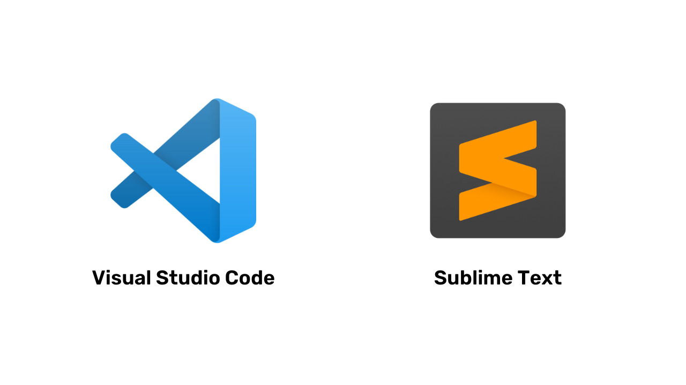

PlanBのミッションは、できるだけ多くの言語でBitcoinに関する最高級の教育リソースを提供することです。サイトに公開されているすべてのコンテンツはオープンソースであり、GitHubにホストされているため、誰でもプラットフォームを豊かにするために参加することができます。貢献はさまざまな形を取ることができます：既存のテキストの修正や校正、他の言語への翻訳、情報の更新、または当サイトにまだない新しいチュートリアルの作成などです。

PlanBネットワークに貢献したい場合は、変更を提案するためにGitHubを使用する必要があります。これを行うには、次の2つのオプションがあります：
- **GitHubのWebインターフェースを直接使用して貢献する**：これは最も簡単な方法です。初心者である場合や、少数の小さな貢献をする予定の場合、このオプションが最適でしょう。
- **Gitを使用してローカルで貢献する**：この方法は、PlanBネットワークに定期的または重要な貢献をする予定の場合に適しています。最初はローカルのGit環境をコンピューターに設定することが複雑に思えるかもしれませんが、このアプローチは長期的にはより効率的です。変更の管理をより柔軟に行うことができます。これが初めての場合でも心配しないでください、**このチュートリアルでは環境の設定プロセス全体を説明します**（約束します、コマンドラインをタイプする必要はありません^^）。

GitHubが何であるか、またはGitとGitHubに関連する技術用語についてもっと学びたい場合は、[これらの概念に慣れるための導入記事を読むことをお勧めします](https://planb.network/tutorials/others/basics-of-github)。

- まず、GitHubアカウントが必要になります。すでにアカウントをお持ちの場合はログインできますし、そうでない場合は[新しいアカウントを作成するためのチュートリアルを使用できます](https://planb.network/tutorials/others/create-github-account)。

## ステップ 1: GitHub Desktopのインストール

- https://desktop.github.com/ にアクセスして、GitHub Desktopソフトウェアをダウンロードします。このソフトウェアを使用すると、ターミナルを使用せずにGitHubと簡単にやり取りできます：

- ソフトウェアを初めて起動すると、GitHubアカウントに接続するよう求められます。これを行うには、`Sign in to GitHub.com`をクリックします：

- ブラウザで認証ページが開きます。アカウント作成時に選択したメールアドレスとパスワードを入力し、`Sign in`ボタンをクリックします：

- アカウントとソフトウェアの間の接続を確認するために、`Authorize desktop`をクリックします：

- GitHub Desktopソフトウェアに自動的にリダイレクトされます。`Finish`をクリックします： 
- GitHubアカウントを作成したばかりの場合、まだリポジトリを作成していないことを示すページにリダイレクトされます。この時点で、GitHub Desktopソフトウェアは一旦脇に置いて、後ほど戻ります： 

## ステップ 2: Obsidianのインストール

次に、執筆ソフトウェアのインストールに移ります。ここではいくつかのオプションがあります。PlanBネットワークがリポジトリ内のテキストファイルにこの形式を使用しているため、Markdownファイルの編集をサポートするソフトウェアが必要になります。
Markdownファイルを編集するために特化したソフトウェアは多数あります。その中でも、Typoraは特に執筆用に設計されています。理想的ではありませんが、Visual Studio Code (VSC) や Sublime Text のようなコードエディタを選択することも可能です。しかし、私としては、Obsidianソフトウェアの使用を好みます。一緒に、そのインストール方法と使い始め方を見ていきましょう。
- https://obsidian.md/download にアクセスし、ソフトウェアをダウンロードしてください: 
- Obsidianをインストールし、ソフトウェアを起動し、言語を選択した後、`Quick Start`をクリックしてください: 
- これでObsidianソフトウェアに到着します。現時点では、開いているファイルはありません: 

## ステップ 3: PlanB Networkリポジトリをフォークする

- 次のアドレスにあるPlanB Networkデータリポジトリにアクセスしてください: [https://github.com/DecouvreBitcoin/sovereign-university-data](https://github.com/DecouvreBitcoin/sovereign-university-data): 
- このページから、ウィンドウの右上にある`Fork`ボタンをクリックしてください: 
- 作成メニューでは、デフォルト設定のままにしておいて大丈夫です。`Copy the dev branch only`ボックスがチェックされていることを確認し、`Create fork`ボタンをクリックしてください: 
- すると、PlanB Networkリポジトリの自分のフォークに到着します: 
このフォークは、元のリポジトリからは独立したリポジトリですが、現在は同じデータを含んでいます。これから、この新しいリポジトリで作業を進めます。

ある意味で、PlanB Networkソースリポジトリのコピーを作成しました。あなたのフォーク（コピー）と元のリポジトリは、これから互いに独立して進化します。元のリポジトリでは、他の貢献者が新しいデータを追加するかもしれませんが、あなたは自分のフォークで自分自身の変更を進めます。
これら二つのリポジトリ間の一貫性を維持するためには、定期的に同期して、同じ情報を取得する必要があります。ソースリポジトリに変更を送るためには、**Pull Request**と呼ばれるものを使用します。そして、ソースリポジトリからの変更を自分のフォークに統合するためには、GitHubウェブインターフェースで利用可能な**Sync fork**コマンドを使用します。

## ステップ 4: フォークをクローンする

- GitHub Desktopソフトウェアに戻ります。今のところ、あなたのフォークは`Your repositories`セクションに表示されるはずです。すぐに表示されない場合は、二重矢印ボタンを使用してリストを更新してください。フォークが表示されたら、それをクリックして選択します:

- 次に、青いボタン`Clone [username]/sovereign-university-data`をクリックします:

- デフォルトパスを保持します。確認するために、青い`Clone`ボタンをクリックしてください:

- GitHub Desktopがローカルにフォークをクローンするのを待ちます:

リポジトリをクローンした後、ソフトウェアは2つのオプションを提供します。最初のオプション「To contribute to the parent project」を選択する必要があります。この選択により、将来の作業を親プロジェクト（`DecouvreBitcoin/sovereign-university-data`）への貢献として、個人のフォーク（`[username]/sovereign-university-data`）の修正としてではなく、提示することができます。オプションを選択したら、`Continue`をクリックしてください：
- これで、GitHub Desktopは正しく設定されました。これからは、ソフトウェアをバックグラウンドで開いたままにして、私たちが行う変更を追跡できます。

この段階で達成したことは、GitHub上にホストされているリポジトリのローカルコピーの作成です。念のために言いますが、このリポジトリはPlanB Networkのソースリポジトリのフォークです。このローカルコピーに対して、チュートリアルの追加、翻訳、修正などの変更を加えることができます。これらの変更が行われたら、**Push origin** コマンドを使用して、ローカルの変更をGitHubにホストされているフォークに送信します。

また、例えばPlanB Networkリポジトリとの同期中に、フォークからの変更を取得することもできます。これには、**Fetch origin** コマンドを使用して変更をローカルコピー（クローン）にダウンロードし、その後 **Pull origin** コマンドを使用してそれらを作業とマージします。これにより、プロジェクトの最新の開発状況に常に追いつきながら、効果的に貢献することができます。

## ステップ 5: 新しいObsidianの保管庫を作成する

- Obsidianソフトウェアを開き、ウィンドウの左下にある小さな保管庫アイコンをクリックします：

- `Open` ボタンをクリックして、既存のフォルダを保管庫として開きます：
- ファイルエクスプローラーが開きます。「Documents」ディレクトリの中にある「GitHub」というタイトルのフォルダを探して選択する必要があります。このパスはステップ4で設定したものに対応しています。フォルダを選択した後、その選択を確認します。ソフトウェアの新しいページでObsidian上の保管庫の作成が開始されます：

-> **注意**、Obsidianで新しい保管庫を作成する際には、`sovereign-university-data` フォルダを選択しないでください。代わりに、親フォルダである `GitHub` を選択してください。`sovereign-university-data` フォルダを選択すると、ローカルのObsidian設定を含む設定フォルダ `.obsidian` がリポジトリに自動的に統合されます。これは、Obsidianの設定をPlanB Networkリポジトリに転送する必要がないため、避けたいことです。代替案として `.obsidian` フォルダを `.gitignore` ファイルに追加する方法もありますが、これもソースリポジトリの `.gitignore` ファイルを変更することになり、望ましくありません。

- ウィンドウの左側には、ローカルにクローンされた異なるGitHubリポジトリのファイルツリーが表示されます。
- フォルダ名の隣にある矢印をクリックすると、リポジトリのサブフォルダとそのドキュメントにアクセスするためにそれらを展開できます：

- Obsidianをダークモードに設定することを忘れないでください："Light attracts bugs" ;)

## ステップ 6: コードエディタをインストールする
ほとんどの修正はMarkdown形式（`.md`）のファイルで行われます。これらのドキュメントを編集するには、以前話したソフトウェアであるObsidianを使用できます。しかし、PlanB Networkでは他のファイル形式も使用しており、それらの一部を変更する必要があります。
例えば、新しいチュートリアルを作成する際には、チュートリアルのタグ、タイトル、および教師IDを入力するためにYAML（`.yml`）ファイルを作成する必要があります。Obsidianではこのタイプのファイルを変更する機能は提供されていないため、コードエディタが必要になります。

このために、いくつかのオプションがあります。コンピュータの標準ノートパッドをこれらの変更に使用することもできますが、この解決策はきれいな作業には理想的ではありません。この目的のために特別に設計されたソフトウェア、例えば[VS Code](https://code.visualstudio.com/download)や[Sublime Text](https://www.sublimetext.com/download)を選択することをお勧めします。Sublime Textは特に軽量であるため、私たちのニーズには十分すぎるほどです。
- これらのソフトウェアプログラムのいずれかをインストールし、将来の修正のためにそれを取っておいてください。 
おめでとうございます！あなたの作業環境は、PlanB Networkへの貢献のために設定されました。これで、各種の貢献（翻訳、校正、執筆など）に対する[私たちの他の特定のチュートリアル](https://planb.network/tutorials/others)を探索することができます。