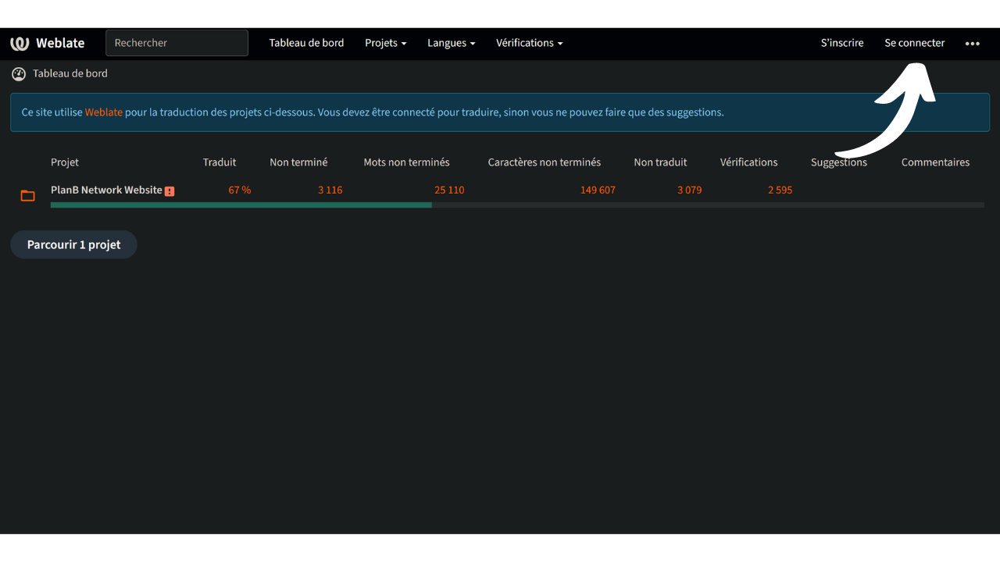
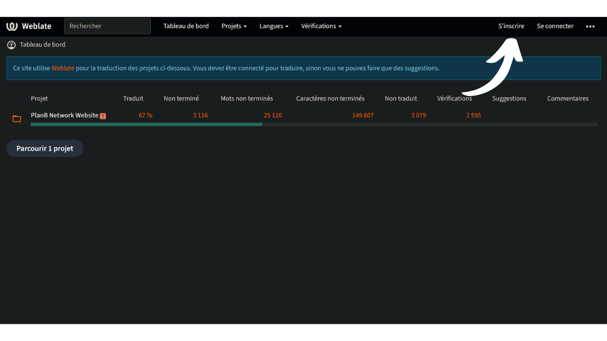
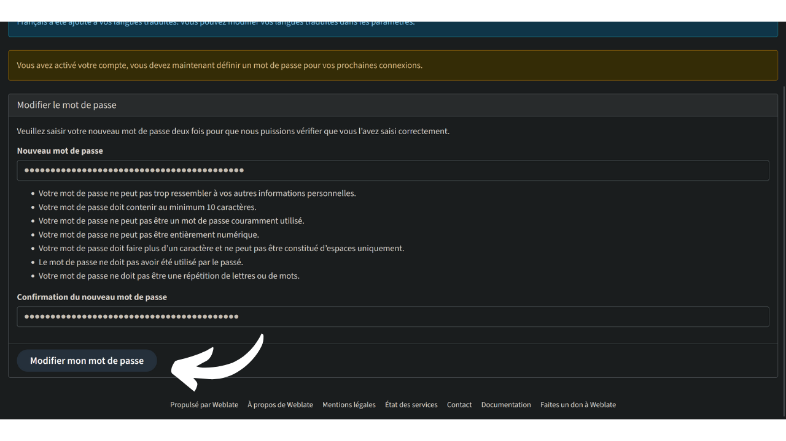

La misión de PlanB es proporcionar recursos educativos de primer nivel sobre Bitcoin, en tantos idiomas como sea posible. Todo el contenido publicado en el sitio es de código abierto y alojado en GitHub, lo que permite a cualquier persona participar en enriquecer la plataforma. Las contribuciones pueden tomar varias formas: corregir y revisar textos existentes, traducir a otros idiomas, actualizar información o crear nuevos tutoriales aún no disponibles en nuestro sitio.

En este tutorial, te mostraré cómo contribuir fácilmente a la traducción de nuestro sitio. Los datos en nuestro sitio se dividen en dos categorías principales:
- los datos del frontend (páginas, botones, etc.);
- y el contenido educativo (tutoriales, cursos, recursos...).

Para la traducción del contenido educativo, utilizamos [un enfoque que combina el trabajo humano y las traducciones con inteligencias artificiales](https://github.com/Asi0Flammeus/LLM-Translator). Si detectas errores en estos contenidos y deseas corregirlos, te invito a consultar nuestro tutorial dedicado a corregir contenido educativo.

Sin embargo, si estás interesado en traducir otras secciones del sitio, excluyendo el contenido educativo, ¡estás en el lugar correcto! Para traducir efectivamente el frontend, utilizamos la herramienta Weblate, que facilita la colaboración y organiza las traducciones. Es una herramienta muy simple de empezar a usar. Vamos a pasar, paso a paso, cómo usar Weblate.

Si deseas agregar un idioma completamente nuevo a la Red PlanB que aún no está disponible en Weblate, primero necesitarás enviar una solicitud de adición. Para esto, [sigue este tutorial específico](https://planb.network/tutorials/others/add-new-language-weblate).

## Registrarse en Weblate

- Ve a [el Weblate autoalojado de la Red PlanB](https://weblate.planb.network/):

- Si ya tienes una cuenta de Weblate, haz clic en `Iniciar sesión`:

- Si aún no tienes una cuenta, haz clic en `Registrarse`:

- Ingresa tu dirección de correo electrónico, así como un nombre de usuario y nombre completo (puedes usar un pseudónimo), luego haz clic en el botón `Registrarse`:

- Luego ve a tu bandeja de entrada de correo electrónico. Deberías haber recibido un mensaje de confirmación de Weblate. Haz clic en el enlace para confirmar tu registro:

- Elige una contraseña fuerte, luego haz clic en `Cambiar mi contraseña`:
- Luego llegarás al tablero de Weblate para la Red PlanB: 

## Iniciar una Sesión de Traducción

- Haz clic en el proyecto `Elemento del Frontend del Sitio Web`:

- Luego llegarás a una interfaz con todos los idiomas para los cuales se ha iniciado la traducción del sitio:

- Elige tu idioma. Por ejemplo, yo tomaré francés:

- Para empezar a traducir, simplemente haz clic en el botón `Traducir`:

- Luego llegarás a la interfaz de trabajo:

- Weblate sugerirá automáticamente frases, párrafos o incluso botones para traducir en el cuadro de `English`: 
- Tu tarea entonces consiste en proponer una traducción para el texto indicado. Debes ingresar tu traducción en el cuadro correspondiente al idioma que has elegido. Por ejemplo, si estás trabajando en la versión en francés, escribe tu traducción en el cuadro de `French`:

- Haz clic en la pestaña de `Automatic suggestion`:

- Aquí, Weblate te ofrece una traducción para cada párrafo realizada con inteligencia artificial:

- Si la traducción sugerida te parece relevante, puedes hacer clic en el botón de `Clone to translation`:

- La sugerencia ahora está colocada en tu cuadro de trabajo:

- Luego puedes modificar manualmente la sugerencia:

- Una vez que la traducción te parezca satisfactoria, haz clic en el botón de `Save and Continue`:

- ¡Y listo! Tu traducción ha sido guardada exitosamente. Weblate te redirigirá automáticamente al siguiente ítem para traducir:

- Al regresar al tablero correspondiente a tu idioma, puedes ver que hay diferentes estados para los ítems a traducir. Al hacer clic en `Translate`, puedes trabajar directamente en los ítems de un estado específico:

¡Gracias de antemano por tu contribución a la traducción de PlanB Network! Si tienes alguna pregunta específica o comentarios para nosotros, por favor no dudes en contactar al equipo de PlanB Network.