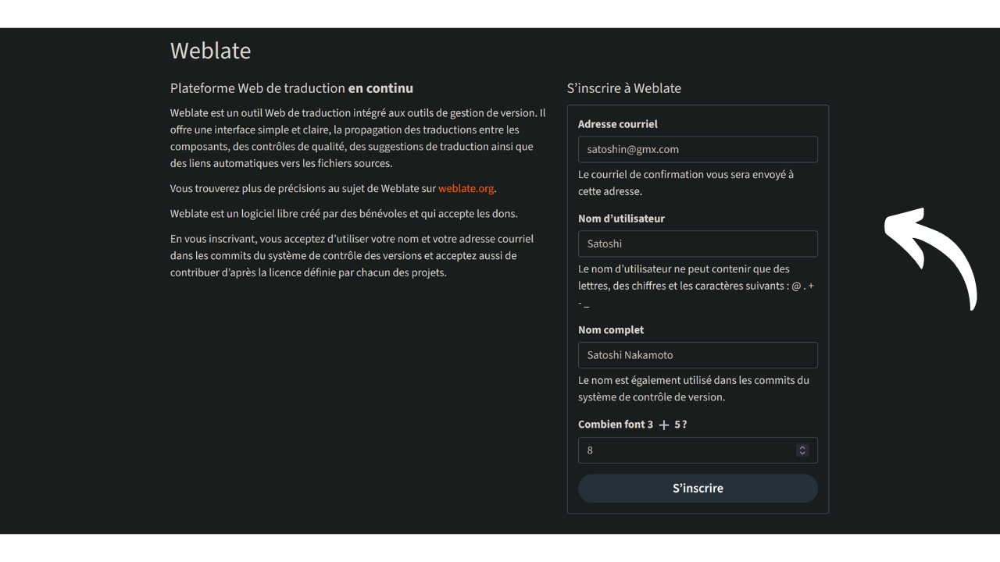
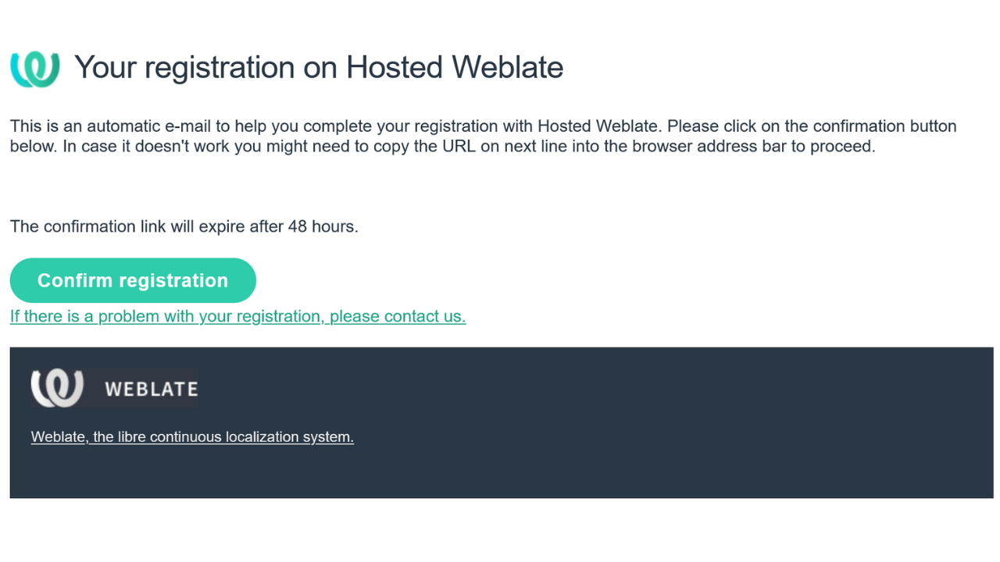
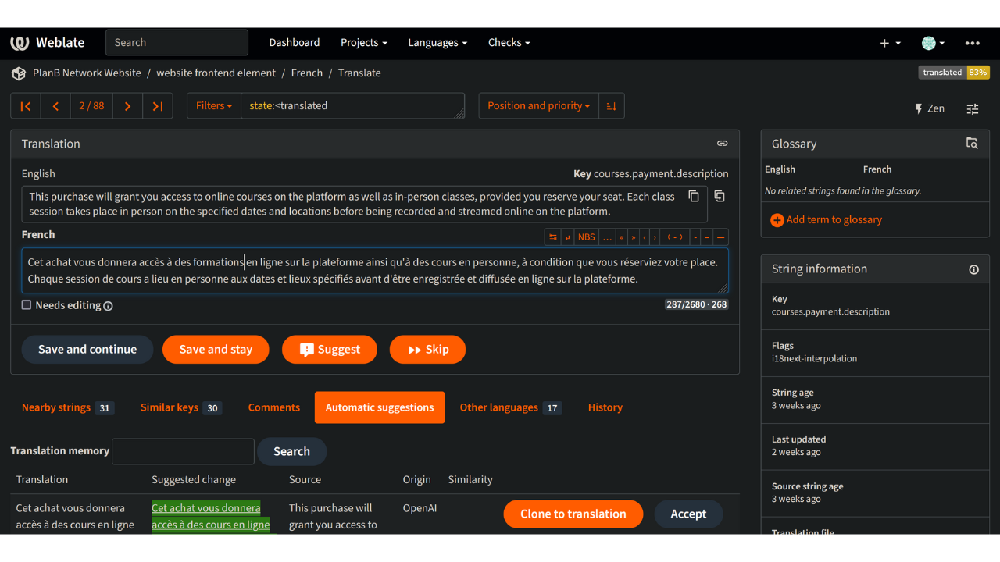
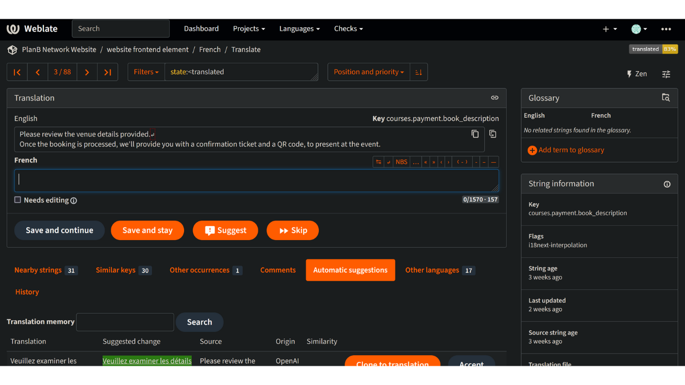
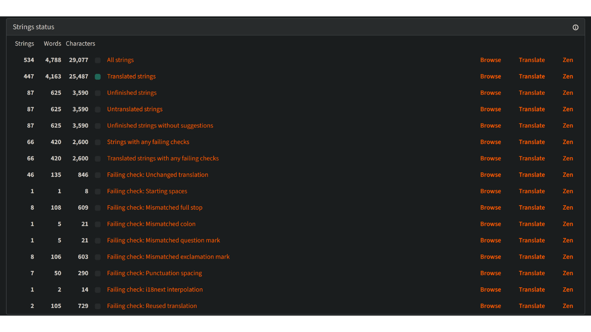

Sứ mệnh của PlanB là cung cấp nguồn tài nguyên giáo dục hàng đầu về Bitcoin, bằng càng nhiều ngôn ngữ càng tốt. Tất cả nội dung được công bố trên trang web là mã nguồn mở và được lưu trữ trên GitHub, điều này cho phép bất kỳ ai cũng có thể tham gia làm giàu cho nền tảng. Đóng góp có thể có nhiều hình thức: sửa chữa và đọc lại các văn bản hiện có, dịch sang ngôn ngữ khác, cập nhật thông tin, hoặc tạo mới các hướng dẫn chưa có trên trang web của chúng tôi.

Trong hướng dẫn này, tôi sẽ chỉ cho bạn cách dễ dàng đóng góp vào việc dịch trang web của chúng tôi. Dữ liệu trên trang web của chúng tôi được chia thành hai danh mục chính:
- dữ liệu giao diện người dùng (trang, nút, v.v.);
- và nội dung giáo dục (hướng dẫn, khóa học, tài nguyên...).

Đối với việc dịch nội dung giáo dục, chúng tôi sử dụng [một phương pháp kết hợp công việc của con người và dịch thuật với trí tuệ nhân tạo](https://github.com/Asi0Flammeus/LLM-Translator). Nếu bạn phát hiện lỗi trong những nội dung này và muốn sửa chúng, tôi mời bạn tham khảo hướng dẫn của chúng tôi dành riêng cho việc sửa chữa nội dung giáo dục.

Tuy nhiên, nếu bạn quan tâm đến việc dịch các phần khác của trang web, không bao gồm nội dung giáo dục, bạn đã đến đúng nơi! Để dịch giao diện hiệu quả, chúng tôi sử dụng công cụ Weblate, giúp tạo điều kiện cho sự hợp tác và tổ chức bản dịch. Đây là một công cụ rất dễ bắt đầu. Hãy cùng đi qua từng bước cách sử dụng Weblate.

Nếu bạn muốn thêm một ngôn ngữ hoàn toàn mới vào Mạng lưới PlanB mà chưa có sẵn trên Weblate, bạn sẽ cần phải đầu tiên gửi yêu cầu thêm vào. Để làm điều này, [theo dõi hướng dẫn cụ thể này](https://planb.network/tutorials/others/add-new-language-weblate).

## Đăng ký trên Weblate

- Truy cập [Weblate tự chủ của Mạng lưới PlanB](https://weblate.planb.network/):

- Nếu bạn đã có tài khoản Weblate, nhấn vào `Đăng nhập`:

- Nếu bạn chưa có tài khoản, nhấn vào `Đăng ký`:

- Nhập địa chỉ email của bạn, cũng như tên người dùng và tên đầy đủ (bạn có thể sử dụng bí danh), sau đó nhấn vào nút `Đăng ký`:

- Sau đó, kiểm tra hộp thư đến của bạn. Bạn nên đã nhận được một tin nhắn xác nhận từ Weblate. Nhấn vào liên kết để xác nhận đăng ký của bạn:

- Chọn một mật khẩu mạnh, sau đó nhấn vào `Thay đổi mật khẩu của tôi`:
- Bạn sẽ đến bảng điều khiển Weblate cho Mạng lưới PlanB: 

## Bắt đầu một Phiên Dịch

- Nhấn vào dự án `Website Frontend Element`:

- Bạn sẽ đến giao diện với tất cả các ngôn ngữ mà việc dịch trang web đã được bắt đầu:

- Chọn ngôn ngữ của bạn. Ví dụ, tôi sẽ chọn tiếng Pháp:

- Để bắt đầu dịch, chỉ cần nhấn vào nút `Dịch`:

- Bạn sẽ đến giao diện làm việc:

- Weblate sẽ tự động đề xuất các câu, đoạn văn, hoặc thậm chí là các nút để dịch vào hộp `English`:

- Nhiệm vụ của bạn bao gồm đề xuất bản dịch cho văn bản được chỉ định. Bạn phải nhập bản dịch của mình vào hộp tương ứng với ngôn ngữ bạn đã chọn. Ví dụ, nếu bạn đang làm việc trên phiên bản tiếng Pháp, hãy viết bản dịch của bạn vào hộp `French`:

- Nhấp vào tab `Automatic suggestion`:

- Tại đây, Weblate cung cấp cho bạn một bản dịch cho mỗi đoạn văn được tạo ra bằng trí tuệ nhân tạo:

- Nếu bản dịch đề xuất có vẻ phù hợp với bạn, bạn có thể nhấp vào nút `Clone to translation`:

- Lời đề xuất giờ đây được đặt trong hộp làm việc của bạn:

- Bạn có thể sau đó chỉnh sửa thủ công đề xuất:

- Một khi bản dịch có vẻ hài lòng với bạn, nhấp vào nút `Save and Continue`:

- Và đó là xong! Bản dịch của bạn đã được lưu thành công. Weblate sẽ tự động chuyển hướng bạn đến mục tiếp theo để dịch:

- Bằng cách quay trở lại bảng điều khiển tương ứng với ngôn ngữ của bạn, bạn có thể thấy rằng có các trạng thái khác nhau cho các mục cần dịch. Bằng cách nhấp vào `Translate`, bạn có thể trực tiếp làm việc trên các mục của một trạng thái cụ thể:

Cảm ơn bạn trước về sự đóng góp của bạn cho việc dịch PlanB Network! Nếu bạn có bất kỳ câu hỏi cụ thể nào hoặc nhận xét cho chúng tôi, xin đừng ngần ngại liên hệ với đội ngũ PlanB Network.