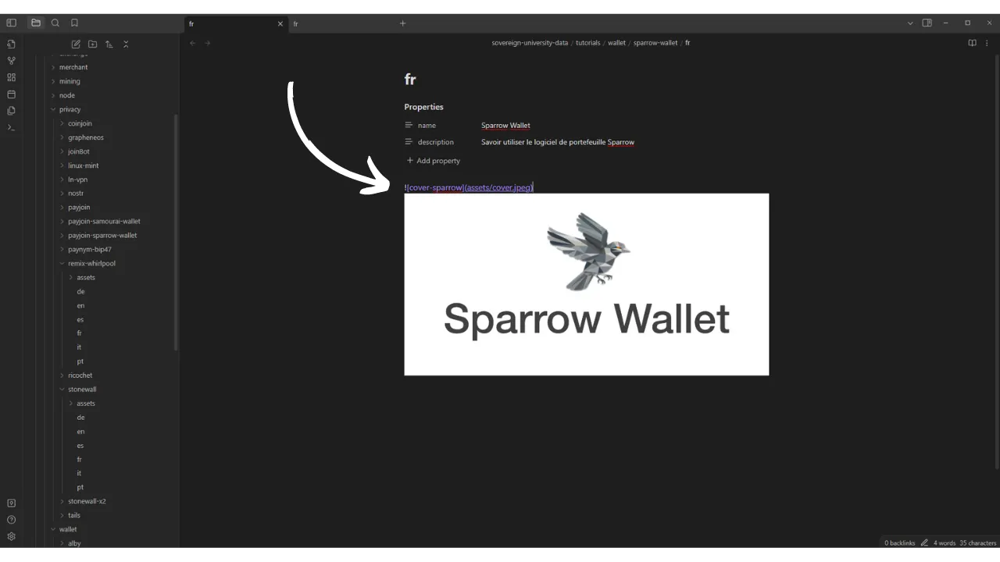
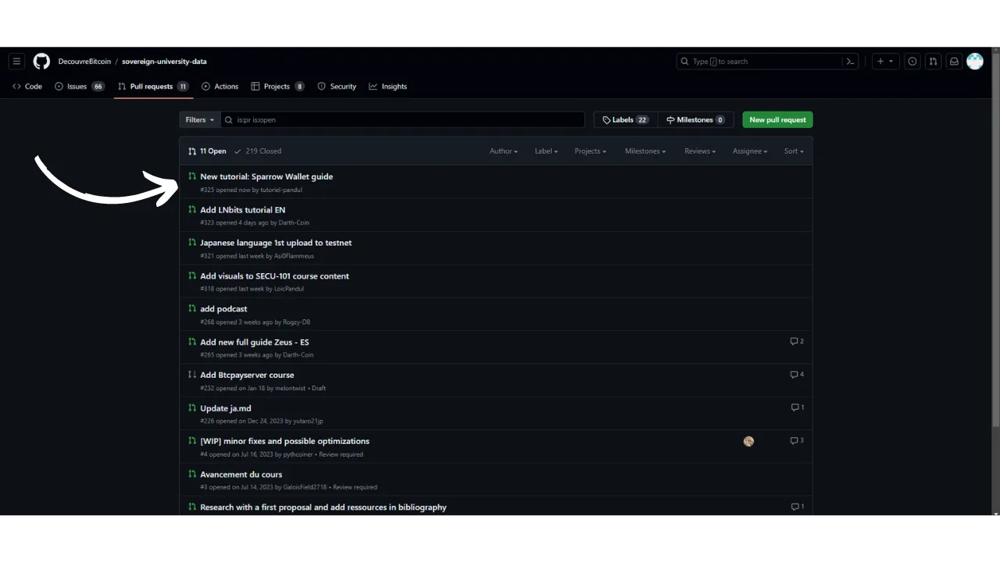
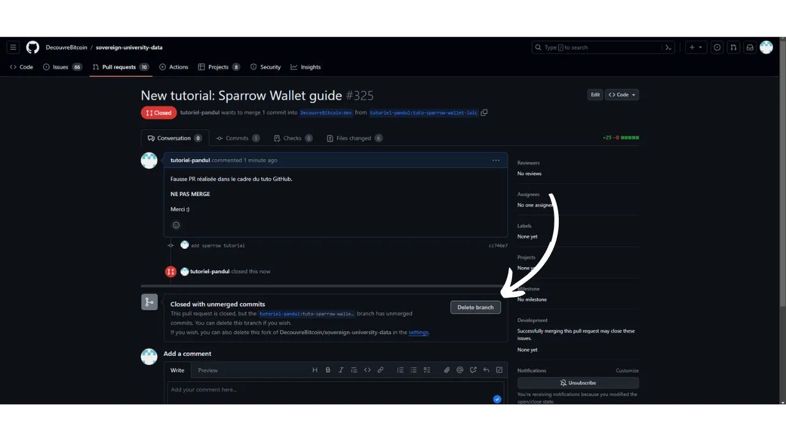

La misión de PlanB es proporcionar recursos educativos de primer nivel sobre Bitcoin, en tantos idiomas como sea posible. Todo el contenido publicado en el sitio es de código abierto y alojado en GitHub, lo que ofrece la oportunidad para que cualquiera participe en enriquecer la plataforma. Las contribuciones pueden tomar varias formas: corregir y revisar textos existentes, traducir a otros idiomas, actualizar información o crear nuevos tutoriales aún no disponibles en nuestro sitio.

En este tutorial, explicaré cómo modificar la sección de "Tutoriales" de la PlanB Network. Si deseas agregar un nuevo tutorial o mejorar uno existente, ¡este artículo es para ti! Veremos en detalle cómo contribuir a la PlanB Network a través de GitHub, mientras usamos Obsidian, una herramienta de escritura.

## Prerrequisitos

Para contribuir a la PlanB Network, tienes 3 opciones dependiendo de tu nivel de experiencia con GitHub:
1. **Usuarios experimentados**: Continúa con tus métodos habituales y consulta este tutorial para familiarizarte con la estructura del repositorio de PlanB, los requisitos específicos y el flujo de trabajo.
2. **Principiantes listos para aprender**: Recomiendo configurar tu propio entorno de trabajo. Sigue este tutorial así como nuestros otros artículos listados a continuación para guiarte paso a paso.
3. **Principiantes para contribuciones menores**: Para tareas que requieren menos modificación, como correcciones o revisiones, usa directamente la interfaz web de GitHub sin configurar un entorno local completo.

**Software requerido para seguir mi tutorial:**
- [GitHub Desktop](https://desktop.github.com/)
- [Obsidian](https://obsidian.md/)
- Un editor de código ([VSC](https://code.visualstudio.com/) o [Sublime Text](https://www.sublimetext.com/))

**Prerrequisitos antes de comenzar el tutorial:**
- Tener una [cuenta de GitHub](https://github.com/signup).
- Tener un fork del [repositorio fuente de PlanB Network](https://github.com/PlanB-Network/bitcoin-educational-content).
- Tener [un perfil de profesor en PlanB Network](https://planb.network/professors) (solo si estás proponiendo un tutorial completo).

**Si necesitas ayuda para obtener estos prerrequisitos, mis otros tutoriales te guiarán:**
- **[Entendiendo Git y GitHub](https://planb.network/tutorials/others/basics-of-github)**
- **[Creando una cuenta de GitHub](https://planb.network/tutorials/others/create-github-account)**
- **[Configurando tu entorno de trabajo](https://planb.network/tutorials/others/github-desktop-work-environment)**
- **[Creando un perfil de profesor](https://planb.network/tutorials/others/create-teacher-profile)**
## ¿Qué tipo de contenido escribir en PlanB Network?
Estamos buscando principalmente tutoriales sobre herramientas relacionadas con Bitcoin o su ecosistema. Estos contenidos pueden organizarse en torno a seis categorías principales:
- Cartera;
- Nodo;
- Minería;
- Comerciante;
- Intercambio;
- Privacidad.

Más allá de estos temas específicamente relacionados con Bitcoin, PlanB también busca contribuciones sobre temas que resalten la soberanía individual, tales como:
- Herramientas de código abierto;
- Computación;
- Criptografía;
- Energía;
- Matemáticas;
- Economía;
- Hazlo tú mismo (DIYs);
- LifeHacking...
Por ejemplo, actualmente tenemos tutoriales sobre Tails, Nostr o GrapheneOS. Estas herramientas no están directamente relacionadas con Bitcoin, pero son sistemas que pueden interesarnos en un proceso de soberanía en el mundo digital. Estos contenidos pueden integrarse en una subcategoría de la sección "Otros".

Tienes la opción de diseñar un tutorial desde cero o tomar un tutorial previamente publicado en tu sitio web (siempre y cuando seas el titular de los derechos de autor) para compartirlo también en la Red PlanB, añadiendo un enlace al artículo original.

Independientemente de tu elección, ten en cuenta que todo el contenido publicado en la Red PlanB está bajo la licencia libre [CC-BY-SA](https://creativecommons.org/licenses/by-sa/4.0/). Esta licencia permite a cualquiera copiar y, potencialmente, modificar tu contenido, siempre que se cite debidamente la fuente original.

## ¿Cómo proponer un tutorial en la Red PlanB?

Una vez que todo esté en su lugar, y tu entorno local esté bien configurado con tu propio fork de la Red PlanB, puedes comenzar a añadir el tutorial.

### Crear una nueva rama

- Abre tu navegador y dirígete a la página de tu fork del repositorio PlanB. Este es el fork que has establecido en GitHub. La URL de tu fork debería verse así: `https://github.com/[tu-usuario]/sovereign-university-data`:

- Asegúrate de estar en la rama principal `dev` y luego haz clic en el botón `Sync fork`. Si tu fork no está actualizado, GitHub ofrecerá actualizar tu rama. Procede con esta actualización. Si, por el contrario, tu rama ya está actualizada, GitHub te informará:

- Abre el software GitHub Desktop y asegúrate de que tu fork esté correctamente seleccionado en la esquina superior izquierda de la ventana:

- Haz clic en el botón `Fetch origin`. Si tu repositorio local ya está actualizado, GitHub Desktop no sugerirá ninguna acción adicional. De lo contrario, aparecerá la opción `Pull origin`. Haz clic en este botón para actualizar tu repositorio local: 
- Asegúrate de estar en la rama principal `dev`:

- Haz clic en esta rama, luego haz clic en el botón `New Branch`:

- Asegúrate de que la nueva rama esté basada en el repositorio fuente, es decir, `DecouvreBitcoin/sovereign-university-data`.
- Nombra tu rama de manera que el título sea claro sobre su propósito, usando guiones para separar cada palabra. Por ejemplo, digamos que nuestro objetivo es escribir un tutorial sobre el uso del software Sparrow Wallet. En este caso, la rama de trabajo dedicada a escribir este tutorial podría llamarse: `tuto-sparrow-wallet-loic`. Una vez ingresado el nombre apropiado, haz clic en `Create branch` para confirmar la creación de la rama:

- Ahora haz clic en el botón `Publish branch` para guardar tu nueva rama de trabajo en tu fork en línea en GitHub:

Ahora, en GitHub Desktop, deberías estar en tu nueva rama. Esto significa que todos los cambios realizados localmente en tu computadora se registrarán exclusivamente en esta rama específica. Además, mientras esta rama permanezca seleccionada en GitHub Desktop, los archivos localmente visibles en tu máquina corresponden a los de esta rama (`tuto-sparrow-wallet-loic`), y no a los de la rama principal (`dev`).

Para cada nuevo artículo que desees publicar, necesitarás crear una nueva rama desde `dev`. Una rama en Git es una versión paralela del proyecto, lo que te permite hacer cambios sin afectar la rama principal, hasta que el trabajo esté listo para ser fusionado.
### Agregando el tutorial

Ahora que la rama de trabajo está creada, es momento de integrar tu nuevo tutorial.
- Abre tu gestor de archivos y navega hasta la carpeta `sovereign-university-data`, que representa el clon local de tu repositorio. Normalmente deberías encontrarla bajo `Documents\GitHub\sovereign-university-data`. Dentro de este directorio, será necesario localizar la subcarpeta apropiada para colocar tu tutorial. La organización de las carpetas refleja las diferentes secciones del sitio web de PlanB Network. En nuestro ejemplo, dado que deseamos agregar un tutorial sobre Sparrow Wallet, es apropiado ir al siguiente camino: `sovereign-university-data\tutorials\wallet` que corresponde a la sección `WALLET` en el sitio web: 
- Dentro de la carpeta `wallet`, necesitas crear un nuevo directorio específicamente dedicado a tu tutorial. El nombre de esta carpeta debe evocar el software cubierto en el tutorial, asegurando conectar las palabras con guiones. Para mi ejemplo, la carpeta se titulará `sparrow-wallet`:

- En esta nueva subcarpeta dedicada a tu tutorial, varios elementos necesitan ser agregados:
	- Crea una carpeta `assets`, destinada a recibir todas las ilustraciones necesarias para tu tutorial;
    - Dentro de esta carpeta `assets`, necesitas crear 8 subcarpetas nombradas `fr`, `de`, `en`, `it`, `es`, `ja`, `vi`, y `pt`, con el fin de clasificar los visuales según los idiomas correspondientes. También debes agregar una subcarpeta `notext` para visuales que no necesitan traducción, como capturas de pantalla, por ejemplo;
	- Un archivo `tutorial.yml` debe ser creado para registrar los detalles relacionados con tu tutorial;
	- Un archivo en formato markdown debe ser creado para escribir el contenido real de tu tutorial. Este archivo debe ser titulado según el código de idioma de la escritura. Por ejemplo, para un tutorial escrito en francés, el archivo debería llamarse `fr.md`.

- Para resumir, aquí está la jerarquía de archivos a crear:
```plaintext
sovereign-university-data/
└── tutorials/
    └── wallet/ (a modificar con la categoría correcta)
        └── sparrow-wallet/ (a modificar con el nombre del tutorial)
            ├── assets/
            │   ├── fr/
            │   ├── de/
            │   ├── en/
            │   ├── it/
            │   ├── es/
            │   ├── pt/
            |   ├── ja/
            |   ├── vi/
            │   └── notext/
            ├── tutorial.yml
            └── fr.md (a modificar según el código de idioma apropiado)
```

- Para comenzar, abre tu archivo `tutorial.yml` usando tu editor de código.
- Rellena cada campo con la información especificada a continuación:
- **builder**: Ingresa el nombre de la empresa que produce el software para el cual estás creando un tutorial;
- **tags**: Determina una serie de palabras clave estrechamente relacionadas con el tema de tu artículo, para facilitar su búsqueda e indexación;
- **categoría**: Selecciona una subcategoría apropiada entre las disponibles en el sitio de PlanB, basándote en el contenido de tu tutorial. Por ejemplo, para un tutorial en la sección `WALLET`, las opciones disponibles son `Desktop`, `Hardware` y `Mobile`;
- **nivel**: Indica el nivel de dificultad de tu tutorial eligiendo una de las siguientes cuatro categorías:
    - Principiante (`beginner`),
    - Intermedio (`intermediary`),
    - Avanzado (`advanced`),
    - Experto (`expert`).
- **profesor**: Proporciona tu ID de colaborador tal como aparece en tu perfil de profesor. Para más detalles, consulta [el tutorial correspondiente](https://planb.network/fr/tutorials/others/create-teacher-profile);
- **enlace** (opcional): En caso de que desees dar crédito a un sitio web fuente para el tutorial que estás desarrollando, como tu propio sitio personal, aquí es donde puedes agregar el enlace concerniente.

- Una vez que hayas terminado de modificar tu archivo `tutorial.yml`, guarda tu documento haciendo clic en `Archivo > Guardar`:

- Ahora puedes cerrar tu editor de código.
- En la carpeta `assets`, debes agregar un archivo llamado `logo.webp`, que servirá como miniatura para tu artículo. Esta imagen debe estar en formato `.webp` y debe respetar una dimensión cuadrada para armonizar con la interfaz de usuario. Tienes la libertad de elegir el logo del software cubierto en el tutorial o cualquier otra imagen relevante, siempre que esté libre de derechos. Además, también agrega una imagen titulada `cover.webp` en la misma ubicación. Esta imagen se mostrará en la parte superior de tu tutorial. Asegúrate de que esta imagen, al igual que el logo, respete los derechos de uso y sea adecuada para el contexto de tu tutorial:

- Ahora, puedes abrir tu archivo que albergará tu tutorial, nombrado con el código de tu idioma, como `es.md`. Ve a Obsidian, en el lado izquierdo de la ventana, desplázate por el árbol de carpetas hasta la carpeta de tu tutorial y al archivo buscado:

- Haz clic en el archivo para abrirlo:

- Comenzaremos llenando la sección `Propiedades` en la parte superior del documento. Si esta sección falta en tu archivo (si el documento está completamente en blanco), puedes reproducirla copiándola de otro tutorial existente: 
- También puedes agregarla manualmente de esta manera usando tu editor de código:
```markdown
---
name: [Título]
description: [Descripción]
---
```

- Rellena el nombre de tu tutorial y una breve descripción del mismo:

- Luego agrega tu imagen de portada al inicio de tu tutorial. Para hacer esto, escribe:
```markdown

```
- Esta sintaxis será útil siempre que agregar una imagen a tu tutorial sea necesario. El punto de exclamación indica que es una imagen, con el texto alternativo (alt) especificado entre los corchetes. El camino hacia la imagen se indica entre los paréntesis:

- Continúa escribiendo tu tutorial redactando tu contenido. Cuando quieras integrar un subtítulo, aplica el formato markdown adecuado prefijando el texto con `##`:


### ¿Cómo agregar diagramas al tutorial?
Las subcarpetas de idioma en la carpeta `assets` están destinadas a organizar los diagramas y visuales que acompañarán tu tutorial. Si tus imágenes incluyen texto, asegúrate de traducirlos para cada idioma concerniente para hacer tu contenido accesible a una audiencia internacional. Para diagramas sin texto que traducir o capturas de pantalla, colócalos directamente en la subcarpeta `notext`. 
Para nombrar tus imágenes, simplemente coloca números en el orden de aparición en el tutorial. Por ejemplo, nombra tu primera imagen `1.webp`, tu segunda `2.webp`, y así sucesivamente.

Si el mismo diagrama se traduce a múltiples idiomas, conserva el mismo nombre de archivo para las diferentes traducciones en las subcarpetas de idioma, como `en/1.webp`, `fr/1.webp`, `pt/1.webp`, etc.

Tienes la opción de usar diferentes formatos de imagen como `jpeg`, `png`, o `webp`. Se recomienda optar por el formato `webp` para que las imágenes sean menos pesadas.

Para insertar un diagrama en tu documento, usa el siguiente comando en Markdown, asegurándote de especificar el texto alternativo apropiado y la ruta correcta de la imagen:
```markdown

```
El punto de exclamación al principio indica que es una imagen. El texto alternativo, que ayuda en la accesibilidad y SEO, se coloca entre los corchetes. Finalmente, la ruta hacia la imagen se indica entre los paréntesis: 
Si deseas crear tus propios diagramas, asegúrate de adherirte a la carta gráfica de PlanB Network para asegurar la consistencia visual:
- **Fuente**: Usa [Rubik](https://fonts.google.com/specimen/Rubik);
- **Colores**:
	- Naranja: #FF5C00
	- Negro: #000000
	- Blanco: #FFFFFF

**Es imperativo que todos los visuales integrados en tus tutoriales sean libres de derechos o cumplan con la licencia del archivo fuente**. Además, todos los diagramas publicados en PlanB Network están disponibles bajo la licencia CC-BY-SA, de la misma manera que el texto.

**-> Consejo:** Al compartir archivos públicamente, como imágenes, es importante eliminar cualquier metadato superfluo. Esto puede contener información sensible, como datos de ubicación, fechas de creación o detalles sobre el autor. Para proteger tu privacidad, es aconsejable eliminar este metadato. Para simplificar esta operación, puedes usar herramientas especializadas como [Exif Cleaner](https://exifcleaner.com/), que ofrece la capacidad de limpiar los metadatos de un documento con un simple arrastrar y soltar.

### ¿Cómo guardar y enviar el tutorial?

Una vez que hayas terminado de escribir tu tutorial en el idioma de tu elección, el siguiente paso es enviar un **Pull Request**. El administrador luego añadirá las traducciones faltantes de tu tutorial, gracias a nuestro método de traducción automatizado.

- Para proceder con el Pull Request, abre el software GitHub Desktop.
- El software debería detectar automáticamente los cambios que has realizado localmente en comparación con el repositorio original. Antes de continuar, verifica cuidadosamente en el lado izquierdo de la interfaz que estos cambios correspondan exactamente a lo que esperabas: 
- Agrega un título para tu commit, luego haz clic en el botón azul `Commit to [tu rama]` para validar estos cambios: 
Un commit es un guardado de los cambios realizados en la rama, acompañado por un mensaje descriptivo, permitiendo seguir la evolución de un proyecto a lo largo del tiempo. Es, por lo tanto, una especie de punto de control intermedio.
- Luego haz clic en el botón `Push origin`. Esto enviará tu commit a tu fork:  - Si no has terminado tu tutorial, puedes volver a él más tarde y hacer nuevos commits.
- Si has terminado tus ediciones para esta rama, ahora haz clic en el botón `Preview Pull Request`: 
- Puedes verificar una última vez que tus modificaciones son correctas, luego haz clic en el botón `Create pull request`:

Un Pull Request es una solicitud para integrar los cambios de tu rama a la rama principal del repositorio de PlanB Network, lo que permite la revisión y discusión de los cambios antes de su fusión.

- Serás redirigido automáticamente en tu navegador a GitHub en la página de preparación de tu Pull Request:

- Proporciona un título que resuma brevemente las modificaciones que deseas fusionar con el repositorio fuente.
- Agrega un breve comentario describiendo estos cambios.
- Haz clic en el botón verde `Create pull request` para confirmar la solicitud de fusión:

Tu PR será entonces visible en la pestaña `Pull Request` del repositorio principal de PlanB Network. Todo lo que tienes que hacer ahora es esperar hasta que un administrador te contacte para confirmar la fusión de tu contribución o para solicitar cualquier modificación adicional.

Después de la fusión de tu PR con la rama principal, se recomienda eliminar tu rama de trabajo (`tuto-sparrow-wallet`) para mantener un historial limpio en tu fork. GitHub te ofrecerá automáticamente esta opción en la página de tu PR:

En el software GitHub Desktop, puedes volver a la rama principal de tu fork (`dev`).

Si deseas hacer modificaciones a tu contribución después de haber ya enviado tu PR, el procedimiento a seguir depende del estado actual de tu PR:
- Si tu PR todavía está abierto y no ha sido fusionado, realiza las modificaciones localmente mientras permaneces en la misma rama. Una vez finalizadas las modificaciones, usa el botón `Push origin` para añadir un nuevo commit a tu PR aún abierto;
- En el caso de que tu PR ya haya sido fusionado con la rama principal, necesitarás repetir el proceso desde el principio creando una nueva rama, y luego enviando un nuevo PR. Asegúrate de que tu repositorio local esté sincronizado con el repositorio fuente de PlanB Network antes de proceder.