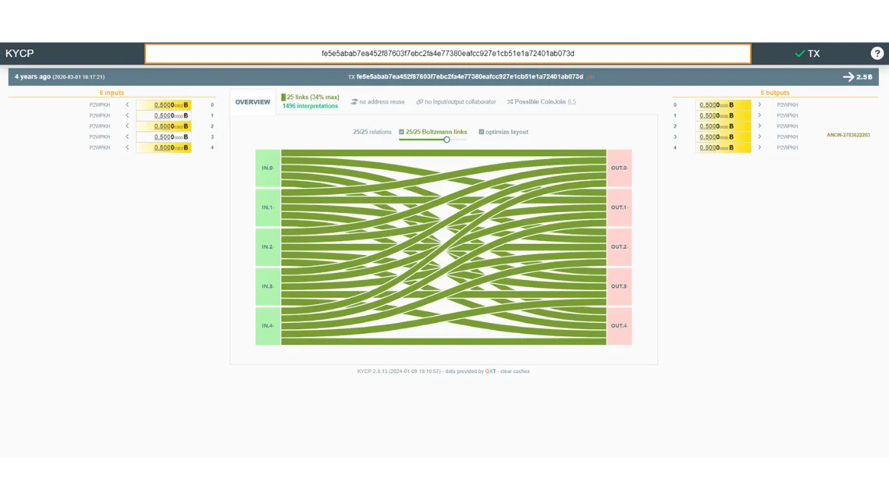
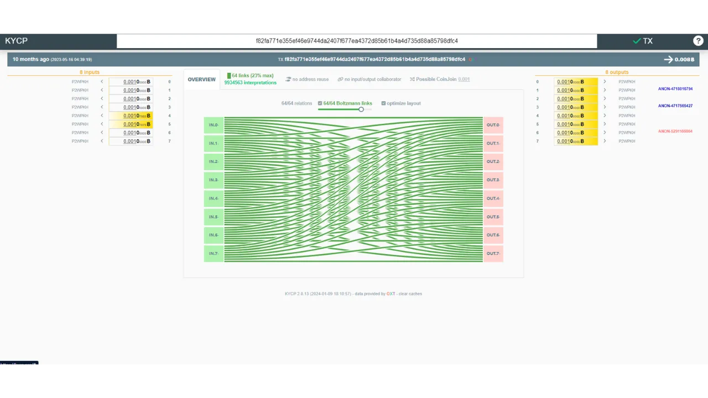
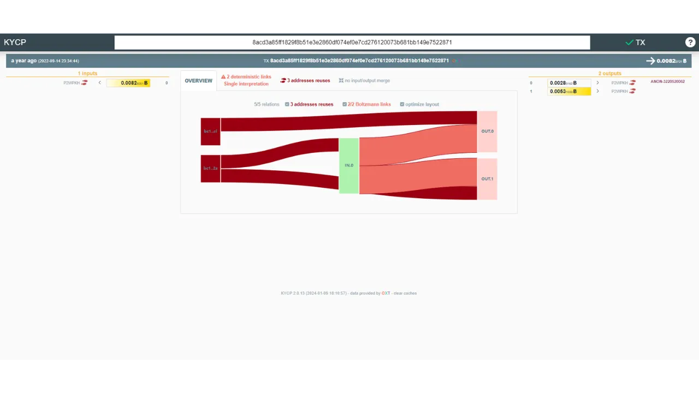

***ВНИМАНИЕ:** После ареста основателей кошелька Samourai и изъятия их серверов 24 апреля, сайт KYCP.org в настоящее время недоступен. Gitlab, на котором размещался код калькулятора Больцмана на Python, также был изъят. На данный момент скачать этот инструмент больше невозможно. Однако возможно, что код будет переопубликован другими лицами в ближайшие недели. Тем временем вы все еще можете извлечь пользу из этого учебника, чтобы понять принципы работы калькулятора Больцмана. Индикаторы, предоставляемые этим инструментом, применимы к любой транзакции Bitcoin и также могут быть рассчитаны вручную. Я предоставлю все необходимые расчеты в этом учебнике. Если вы уже скачали Python-инструмент на свое устройство или используете RoninDojo, вы можете продолжать использовать инструмент и следовать этому учебнику как обычно, он все еще работает.*

_Мы тщательно следим за развитием этого дела, а также за развитием связанных с ним инструментов. Будьте уверены, что мы обновим этот учебник, как только появится новая информация._

_Этот учебник предоставляется только для образовательных и информационных целей. Мы не поддерживаем и не поощряем использование этих инструментов в преступных целях. Каждый пользователь несет ответственность за соблюдение законов в своей юрисдикции._

---

Калькулятор Больцмана - это инструмент для анализа транзакции Bitcoin путем измерения ее уровня энтропии вместе с другими продвинутыми метриками. Он предоставляет информацию о связях между входами и выходами транзакции. Эти индикаторы предлагают количественную оценку конфиденциальности транзакции и помогают идентифицировать потенциальные ошибки.

Этот инструмент на Python был разработан командами Samourai Wallet и OXT, но его можно использовать для любой транзакции Bitcoin.

## Как использовать калькулятор Больцмана?
Для использования калькулятора Больцмана у вас есть два варианта. Первый - установить инструмент Python непосредственно на ваше устройство. В качестве альтернативы, вы можете выбрать сайт KYCP.org (_Know Your Coin Privacy_, знайте конфиденциальность вашей монеты), который предлагает упрощенную платформу использования. Для пользователей [RoninDojo](https://planb.network/tutorials/node/ronin-dojo-v2) отметим, что этот инструмент уже интегрирован в ваш узел.

Использование сайта KYCP довольно просто: просто введите идентификатор транзакции (TXID), который вы хотите проанализировать, в строку поиска и нажмите `ENTER`.

Затем вы найдете различную информацию о транзакции, включая связи между входами и выходами. Нажмите на `детерминированные связи`.

Вы попадете на страницу, посвященную индикаторам калькулятора Больцмана.

Для тех, кто предпочитает использовать инструмент непосредственно с их узла RoninDojo, он доступен через `RoninCLI > Samourai Toolkit > Boltzmann Calculator`.

Как и на сайте KYCP.org, после установки инструмента Python вам просто нужно будет вставить TXID транзакции, которую вы хотите проанализировать.


Затем нажмите клавишу `ENTER`, чтобы получить результаты.


## Какие индикаторы предоставляет калькулятор Больцмана?
### Комбинации / Интерпретации:
Первый индикатор, который рассчитывает программное обеспечение, - это общее количество возможных комбинаций, указанное под `nb combinations` или `interpretations` в инструменте.
Учитывая значения UTXO, участвующих в транзакции, этот индикатор рассчитывает количество способов, которыми входы могут быть связаны с выходами. Другими словами, он определяет количество правдоподобных интерпретаций, которые транзакция может вызвать с точки зрения внешнего наблюдателя, анализирующего её. Например, coinjoin, структурированный в соответствии с моделью Whirlpool 5x5, представляет `1,496` возможных комбинаций: 
Coinjoin Whirlpool Surge Cycle 8x8, с другой стороны, представляет `9,934,563` возможных интерпретаций: 
В отличие от этого, более традиционная транзакция с 1 входом и 2 выходами будет иметь только одну интерпретацию: 

### Энтропия:
Второй рассчитываемый индикатор - это энтропия транзакции, обозначаемая как `Entropy`.

В общем контексте криптографии и информации, энтропия - это количественная мера неопределенности или непредсказуемости, связанной с источником данных или случайным процессом. Другими словами, энтропия - это способ измерения сложности предсказания или угадывания информации.

В конкретном контексте анализа блокчейна, энтропия также является названием индикатора, производного от энтропии Шеннона и [изобретенного LaurentMT](https://gist.github.com/LaurentMT/e758767ca4038ac40aaf), который рассчитывается с помощью инструмента Boltzmann.

Когда транзакция представляет большое количество возможных комбинаций, часто более релевантно ссылаться на её энтропию. Этот индикатор позволяет измерить недостаток знаний аналитиков о точной конфигурации транзакции. Другими словами, чем выше энтропия, тем сложнее задача идентификации движений биткоинов между входами и выходами для аналитиков.

На практике энтропия показывает, представляет ли транзакция, с точки зрения внешнего наблюдателя, множество возможных интерпретаций, основываясь исключительно на суммах входов и выходов, не учитывая другие внешние или внутренние паттерны и эвристики. Высокая энтропия тогда является синонимом лучшей конфиденциальности для транзакции.

Энтропия определяется как двоичный логарифм числа возможных комбинаций. Вот используемая формула:
```plaintext
E: энтропия транзакции
C: количество возможных комбинаций для транзакции

E = log2(C)
```

В математике двоичный логарифм (логарифм по основанию 2) соответствует обратной операции возведения в степень 2. Другими словами, двоичный логарифм `x` - это показатель степени, до которой необходимо возвести `2`, чтобы получить `x`. Таким образом, этот индикатор выражается в битах.

Давайте рассмотрим пример расчета энтропии для транзакции coinjoin, структурированной в соответствии с моделью Whirlpool 5x5, которая, как упоминалось ранее, предлагает количество возможных комбинаций `1,496`:
```plaintext
C = 1,496
E = log2(1,496)
E = 10.5469 бит
```
Таким образом, эта транзакция coinjoin демонстрирует энтропию `10.5469 бит`, что считается очень удовлетворительным. Чем выше это значение, тем больше различных интерпретаций допускает транзакция, тем самым укрепляя её уровень приватности.
Для транзакции coinjoin 8x8, представляющей `9,934,563` интерпретаций, энтропия будет:
```plaintext
C = 9,934,563
E = log2(9,934,563)
E = 23.244 бита
```
Давайте рассмотрим еще один пример с более традиционной транзакцией, которая включает один вход и два выхода: [1b1b0c3f0883a99f1161c64da19471841ed12a1f78e77fab128c69a5f578ccce](https://mempool.space/tx/1b1b0c3f0883a99f1161c64da19471841ed12a1f78e77fab128c69a5f578ccce) В случае этой транзакции единственно возможная интерпретация: `(In.0) > (Out.0 ; Out.1)`. Следовательно, ее энтропия установлена на `0`:
```plaintext
C = 1
E = log2(1)
E = 0 бит
```

### Эффективность:
Третий показатель, предоставляемый Калькулятором Больцмана, называется `Эффективность кошелька`. Этот показатель оценивает эффективность транзакции, сравнивая ее с оптимальной транзакцией, возможной в идентичной конфигурации.

Это приводит нас к обсуждению концепции максимальной энтропии, которая соответствует наивысшей энтропии, которую конкретная структура транзакции могла бы теоретически достичь. Затем эффективность транзакции рассчитывается путем сравнения этой максимальной энтропии с фактической энтропией анализируемой транзакции.

Используемая формула следующая:
```plaintext
ER: фактическая энтропия транзакции, выраженная в битах
EM: максимально возможная энтропия для данной структуры транзакции, выраженная в битах
Ef: эффективность транзакции в битах

Ef = ER - EM
```

Например, для структуры монетного соединения типа Whirlpool 5x5 максимальная энтропия установлена на `10.5469`:
```plaintext
ER = 10.5469
EM = 10.5469
Ef = 10.5469 - 10.5469 = 0 бит
```

Этот показатель также выражается в процентах, его формула тогда:
```plaintext
CR: фактическое количество возможных комбинаций
CM: максимальное количество возможных комбинаций при той же структуре
Ef: эффективность, выраженная в процентах

Ef = CR / CM
Ef = 1,496 / 1,496
Ef = 100%
```

Таким образом, эффективность в `100%` указывает на то, что транзакция максимизирует свой потенциал для конфиденциальности в соответствии со своей структурой.

### Плотность энтропии:
Четвертый показатель - это плотность энтропии, отмеченная в инструменте как `Плотность энтропии`. Он предоставляет перспективу относительно энтропии для каждого входа или выхода транзакции. Этот показатель полезен для оценки и сравнения эффективности транзакций разного размера. Для его расчета просто разделите общую энтропию транзакции на общее количество входов и выходов, участвующих в транзакции:
```plaintext
ED: плотность энтропии, выраженная в битах
E: энтропия транзакции, выраженная в битах
T: общее количество входов и выходов в транзакции

ED = E / T
```

Давайте рассмотрим пример монетного соединения Whirlpool 5x5:
```plaintext
T = 5 + 5 = 10
E = 10.5469
ED = 10.5469 / 10 = 1.054 бита
```

Также рассчитаем плотность энтропии для монетного соединения Whirlpool 8x8:
```plaintext
T = 8 + 8 = 16
E = 23.244
ED = 23.244 / 16 = 1.453 бита
```

### Оценка Больцмана:
Пятая часть информации, предоставляемая Калькулятором Больцмана, - это таблица вероятностей соответствия между входами и выходами. Эта таблица указывает, через оценку Больцмана, условную вероятность того, что определенный вход связан с данным выходом.
Таким образом, это количественная мера условной вероятности ассоциации между входом и выходом в транзакции, основанная на соотношении числа благоприятных случаев этого события к общему числу возможных случаев в наборе интерпретаций.

Возьмем, к примеру, снова Whirlpool coinjoin, таблица условных вероятностей будет выделять шансы связи между каждым входом и выходом, предоставляя количественную меру неоднозначности ассоциаций в транзакции:

| %       | Выход 0 | Выход 1 | Выход 2 | Выход 3 | Выход 4 |
| ------- | -------- | -------- | -------- | -------- | -------- |
| Вход 0 | 34%      | 34%      | 34%      | 34%      | 34%      |
| Вход 1 | 34%      | 34%      | 34%      | 34%      | 34%      |
| Вход 2 | 34%      | 34%      | 34%      | 34%      | 34%      |
| Вход 3 | 34%      | 34%      | 34%      | 34%      | 34%      |
| Вход 4 | 34%      | 34%      | 34%      | 34%      | 34%      |

Здесь мы можем ясно видеть, что каждый вход имеет равные шансы быть связанным с любым выходом, что повышает конфиденциальность транзакции.
Расчет оценки Больцмана включает деление числа интерпретаций, в которых происходит определенное событие, на общее число доступных интерпретаций. Таким образом, для определения оценки, связывающей вход №0 с выходом №3 (`512` интерпретаций), используется следующая процедура:
```plaintext
Интерпретации (ВХ.0 > ВЫХ.3) = 512
Всего интерпретаций = 1496
Оценка = 512 / 1496 = 34%
```

Возьмем, к примеру, Whirlpool 8x8 coinjoin (цикл увеличения), таблица Больцмана будет выглядеть так:

|       | ВЫХ.0 | ВЫХ.1 | ВЫХ.2 | ВЫХ.3 | ВЫХ.4 | ВЫХ.5 | ВЫХ.6 | ВЫХ.7 |
|-------|-------|-------|-------|-------|-------|-------|-------|-------|
| ВХ.0  | 23%   | 23%   | 23%   | 23%   | 23%   | 23%   | 23%   | 23%   |
| ВХ.1  | 23%   | 23%   | 23%   | 23%   | 23%   | 23%   | 23%   | 23%   |
| ВХ.2  | 23%   | 23%   | 23%   | 23%   | 23%   | 23%   | 23%   | 23%   |
| ВХ.3  | 23%   | 23%   | 23%   | 23%   | 23%   | 23%   | 23%   | 23%   |
| IN.4  | 23%   | 23%   | 23%   | 23%   | 23%   | 23%   | 23%   | 23%   || IN.5  | 23%   | 23%   | 23%   | 23%   | 23%   | 23%   | 23%   | 23%   |
| IN.6  | 23%   | 23%   | 23%   | 23%   | 23%   | 23%   | 23%   | 23%   |
| IN.7  | 23%   | 23%   | 23%   | 23%   | 23%   | 23%   | 23%   | 23%   |

Однако в случае простой транзакции с одним входом и двумя выходами ситуация отличается:

| %       | Выход 0 | Выход 1 |
|---------|----------|----------|
| Вход 0  | 100%     | 100%     |

Здесь наблюдается, что вероятность происхождения каждого выхода от входа № 0 составляет `100%`. Таким образом, более низкая вероятность переводится в большую конфиденциальность за счет размывания прямых связей между входами и выходами.

### Детерминированные связи:
Шестой предоставленный кусок информации - это количество детерминированных связей, дополненное соотношением этих связей. Этот показатель раскрывает, сколько связей между входами и выходами в анализируемой транзакции являются неоспоримыми, с вероятностью `100%`. Соотношение, с другой стороны, предлагает перспективу на вес этих детерминированных связей в общем наборе связей транзакции.
Например, транзакция типа Whirlpool-coinjoin не имеет детерминированных связей, и, следовательно, показывает индикатор и соотношение `0%`. В отличие от этого, в нашей второй рассмотренной простой транзакции (с одним входом и двумя выходами) индикатор установлен на `2`, а соотношение достигает `100%`. Таким образом, нулевой индикатор сигнализирует об отличной конфиденциальности за счет отсутствия прямых и неоспоримых связей между входами и выходами.

**Внешние ресурсы:**

- Код Boltzmann на Samourai
- [Транзакции Bitcoin и конфиденциальность (Часть I) от Laurent MT](https://gist.github.com/LaurentMT/e758767ca4038ac40aaf)
- [Транзакции Bitcoin и конфиденциальность (Часть II) от Laurent MT](https://gist.github.com/LaurentMT/d361bca6dc52868573a2)
- [Транзакции Bitcoin и конфиденциальность (Часть III) от Laurent MT](https://gist.github.com/LaurentMT/e8644d5bc903f02613c6)
- Веб-сайт KYCP
- [Статья на Medium об введении в скрипт Boltzmann от Laurent MT](https://medium.com/@laurentmt/introducing-boltzmann-85930984a159)