***ACHTUNG:** Nach der Verhaftung der Gründer von Samourai Wallet und der Beschlagnahme ihrer Server am 24. April funktioniert das Whirlpool-Tool nicht mehr, selbst für Personen, die über ihr eigenes Dojo verfügen oder Sparrow Wallet nutzen. Es bleibt jedoch möglich, dass dieses Tool in den kommenden Wochen wieder in Betrieb genommen oder auf eine andere Weise neu gestartet wird. Darüber hinaus bleibt der theoretische Teil dieses Artikels relevant, um die Prinzipien und Ziele von Coinjoins im Allgemeinen (nicht nur Whirlpool) zu verstehen sowie die Wirksamkeit des Whirlpool-Modells zu begreifen.*

_Wir verfolgen die Entwicklungen in diesem Fall sowie die Entwicklungen bezüglich der zugehörigen Tools genau. Seien Sie versichert, dass wir dieses Tutorial aktualisieren werden, sobald neue Informationen verfügbar sind._

_Dieses Tutorial wird nur zu Bildungs- und Informationszwecken bereitgestellt. Wir befürworten oder ermutigen die Verwendung dieser Tools zu kriminellen Zwecken nicht. Es liegt in der Verantwortung jedes Benutzers, die Gesetze in seiner Gerichtsbarkeit zu beachten._

---

In diesem Tutorial erfahren Sie, was ein Coinjoin ist und wie Sie einen mit der Samourai Wallet Software und der Whirlpool-Implementierung durchführen können, unter Verwendung Ihres eigenen Dojo. Meiner Meinung nach ist diese Methode derzeit die beste, um Ihre Bitcoins zu mischen.

## Was ist ein Coinjoin bei Bitcoin?
**Ein Coinjoin ist eine Technik, die die Nachverfolgbarkeit von Bitcoins in der Blockchain bricht**. Sie basiert auf einer kollaborativen Transaktion mit einer spezifischen Struktur gleichen Namens: der Coinjoin-Transaktion.

Coinjoins verbessern die Privatsphäre von Bitcoin-Nutzern, indem sie die Kettenanalyse für externe Beobachter erschweren. Ihre Struktur ermöglicht es, mehrere Münzen von verschiedenen Nutzern in einer einzigen Transaktion zu verschmelzen, wodurch die Spuren verwischt und es schwierig wird, die Verbindungen zwischen Eingabe- und Ausgabeadressen zu bestimmen.

Das Prinzip des Coinjoin basiert auf einem kollaborativen Ansatz: Mehrere Nutzer, die ihre Bitcoins mischen möchten, hinterlegen identische Beträge als Eingaben derselben Transaktion. Diese Beträge werden dann als Ausgaben gleichen Werts an jeden Nutzer umverteilt. Am Ende der Transaktion wird es unmöglich, eine spezifische Ausgabe einem bekannten Nutzer am Eingang zuzuordnen. Es besteht keine direkte Verbindung zwischen den Eingaben und Ausgaben, was die Zuordnung zwischen den Nutzern und ihren UTXO sowie die Geschichte jeder Münze bricht.

Beispiel einer Coinjoin-Transaktion (nicht von mir): [323df21f0b0756f98336437aa3d2fb87e02b59f1946b714a7b09df04d429dec2](https://mempool.space/de/tx/323df21f0b0756f98336437aa3d2fb87e02b59f1946b714a7b09df04d429dec2)

Um einen Coinjoin durchzuführen, während sichergestellt wird, dass jeder Nutzer jederzeit die Kontrolle über seine Mittel behält, beginnt der Prozess damit, dass die Transaktion von einem Koordinator konstruiert wird, der sie dann an die Teilnehmer übermittelt. Jeder Nutzer signiert dann die Transaktion, nachdem er überprüft hat, dass sie ihm zusagt. Alle gesammelten Signaturen werden schließlich in die Transaktion integriert. Wenn ein Versuch zur Umleitung von Mitteln durch einen Nutzer oder den Koordinator gemacht wird, durch eine Änderung der Ausgaben der Coinjoin-Transaktion, werden die Signaturen ungültig, was zur Ablehnung der Transaktion durch die Knoten führt.

Es gibt mehrere Implementierungen von Coinjoin, wie Whirlpool, JoinMarket oder Wabisabi, die jeweils darauf abzielen, die Koordination unter den Teilnehmern zu verwalten und die Effizienz von Coinjoin-Transaktionen zu erhöhen.
In diesem Tutorial werden wir uns mit der Implementierung von **Whirlpool** befassen, die ich für die effizienteste Lösung halte, um Coinjoins auf Bitcoin durchzuführen. Obwohl sie auf mehreren Wallets verfügbar ist, werden wir in diesem Tutorial ausschließlich ihre Verwendung mit der Samourai Wallet Mobile-App, ohne Dojo, erkunden.

## Warum Coinjoins auf Bitcoin durchführen?
Eines der anfänglichen Probleme mit jedem Peer-to-Peer-Zahlungssystem ist das doppelte Ausgeben: Wie kann man verhindern, dass bösartige Individuen dieselben monetären Einheiten mehrmals ausgeben, ohne auf eine zentrale Autorität zur Schlichtung zurückgreifen zu müssen?

Satoshi Nakamoto bot eine Lösung für dieses Dilemma durch das Bitcoin-Protokoll, ein Peer-to-Peer-Elektronisches Zahlungssystem, das unabhängig von jeder zentralen Autorität funktioniert. In seinem Whitepaper betont er, dass der einzige Weg, das Fehlen von doppeltem Ausgeben zu zertifizieren, darin besteht, die Sichtbarkeit aller Transaktionen innerhalb des Zahlungssystems zu gewährleisten.
Um sicherzustellen, dass jeder Teilnehmer über die Transaktionen informiert ist, müssen diese öffentlich offengelegt werden. Daher basiert der Betrieb von Bitcoin auf einer transparenten und verteilten Infrastruktur, die es jedem Knotenbetreiber ermöglicht, die Gesamtheit der elektronischen Signaturketten und die Geschichte jeder Münze, von ihrer Erstellung durch einen Miner, zu verifizieren.

Die transparente und verteilte Natur der Bitcoin-Blockchain bedeutet, dass jeder Nutzer des Netzwerks den Transaktionen aller anderen Teilnehmer folgen und analysieren kann. Infolgedessen ist Anonymität auf der Transaktionsebene unmöglich. Die Anonymität wird jedoch auf der Ebene der individuellen Identifikation bewahrt. Im Gegensatz zum traditionellen Bankensystem, bei dem jedes Konto mit einer persönlichen Identität verknüpft ist, sind bei Bitcoin die Mittel mit Paaren von kryptografischen Schlüsseln verbunden, was den Benutzern eine Form von Pseudonymität hinter kryptografischen Identifikatoren bietet.

Somit ist die Vertraulichkeit bei Bitcoin gefährdet, wenn externe Beobachter es schaffen, spezifische UTXOs mit identifizierten Benutzern zu verknüpfen. Sobald diese Verknüpfung hergestellt ist, wird es möglich, ihre Transaktionen nachzuverfolgen und die Geschichte ihrer Bitcoins zu analysieren. Coinjoin ist genau eine Technik, die entwickelt wurde, um die Nachverfolgbarkeit von UTXOs zu unterbrechen und somit den Bitcoin-Benutzern eine gewisse Ebene der Vertraulichkeit auf der Transaktionsebene zu bieten.

## Wie funktioniert Whirlpool?
Whirlpool unterscheidet sich von anderen Coinjoin-Methoden durch die Verwendung von "_ZeroLink_" Transaktionen, die sicherstellen, dass technisch keinerlei Verbindung zwischen allen Eingängen und allen Ausgängen möglich ist. Diese perfekte Mischung wird durch eine Struktur erreicht, bei der jeder Teilnehmer einen identischen Betrag als Eingabe (außer den Mining-Gebühren) beiträgt, wodurch Ausgaben von perfekt gleichen Beträgen erzeugt werden.
Dieser restriktive Ansatz bei den Eingängen verleiht den Whirlpool-Coinjoin-Transaktionen eine einzigartige Eigenschaft: die vollständige Abwesenheit von deterministischen Verbindungen zwischen den Eingängen und Ausgängen. Mit anderen Worten, jede Ausgabe hat die gleiche Wahrscheinlichkeit, jedem Teilnehmer zugeschrieben zu werden, verglichen mit allen anderen Ausgaben in der Transaktion.
Ursprünglich war die Anzahl der Teilnehmer bei jedem Whirlpool-Coinjoin auf 5 begrenzt, mit 2 neuen Einsteigern und 3 Remixern (wir werden diese Konzepte weiter unten erklären). Jedoch hat die Zunahme der On-Chain-Transaktionsgebühren im Jahr 2023 das Samourai-Team dazu veranlasst, ihr Modell zu überdenken, um die Privatsphäre zu verbessern und gleichzeitig die Kosten zu reduzieren. Somit können unter Berücksichtigung der Marktsituation der Gebühren und der Anzahl der Teilnehmer nun Coinjoins mit 6, 7 oder 8 Teilnehmern organisiert werden. Diese erweiterten Sitzungen werden als "_Surge Cycles_" bezeichnet. Es ist wichtig zu beachten, dass unabhängig von der Konfiguration immer nur 2 neue Einsteiger in den Whirlpool-Coinjoins sind.

Somit sind Whirlpool-Transaktionen durch eine identische Anzahl von Eingängen und Ausgängen gekennzeichnet, die sein können:
- 5 Eingänge und 5 Ausgänge;

- 6 Eingänge und 6 Ausgänge;

- 7 Eingänge und 7 Ausgänge;

- 8 Eingänge und 8 Ausgänge.

Das von Whirlpool vorgeschlagene Modell basiert somit auf kleinen Coinjoin-Transaktionen. Im Gegensatz zu Wasabi und JoinMarket, wo die Robustheit der Anonsets auf dem Volumen der Teilnehmer in einem einzigen Zyklus beruht, setzt Whirlpool auf die Verkettung mehrerer kleiner Zyklen.

In diesem Modell zahlen die Benutzer Gebühren nur bei ihrem ersten Eintritt in einen Pool, was es ihnen ermöglicht, an einer Vielzahl von Remixes ohne zusätzliche Gebühren teilzunehmen. Die neuen Einsteiger decken die Mining-Gebühren für die Remixer.
Mit jedem zusätzlichen Coinjoin, an dem eine Münze teilnimmt, zusammen mit ihren bisherigen Peers, werden die Anonsets exponentiell wachsen. Das Ziel ist es also, diese kostenlosen Remixe zu nutzen, die bei jedem Vorkommen dazu beitragen, die Dichte der Anonsets, die mit jeder gemischten Münze verbunden sind, zu erhöhen.
Whirlpool wurde unter Berücksichtigung zweier wichtiger Anforderungen entwickelt:
- Die Zugänglichkeit der Implementierung auf mobilen Geräten, da Samourai Wallet hauptsächlich eine Smartphone-Anwendung ist;
- Die Geschwindigkeit der Remixing-Zyklen, um einen signifikanten Anstieg der Anonsets zu fördern.
Diese Imperative leiteten die Entscheidungen der Entwickler von Samourai Wallet bei der Gestaltung von Whirlpool, was sie dazu brachte, die Anzahl der Teilnehmer pro Zyklus zu begrenzen. Zu wenige Teilnehmer hätten die Effizienz des Coinjoins beeinträchtigt, was die in jedem Zyklus generierten Anonsets drastisch reduziert hätte, während zu viele Teilnehmer Managementprobleme bei mobilen Anwendungen verursacht hätten und den Fluss der Zyklen behindert hätten.
**Letztendlich ist es nicht notwendig, eine hohe Anzahl von Teilnehmern pro Coinjoin bei Whirlpool zu haben, da die Anonsets durch die Ansammlung mehrerer Coinjoin-Zyklen erreicht werden.**

[-> Erfahren Sie mehr über Whirlpool Anonsets.](https://planb.network/tutorials/privacy/wst-anonsets)

### Die Pools und Coinjoin-Gebühren
Damit diese mehrfachen Zyklen die Anonsets der gemischten Münzen effektiv erhöhen können, muss ein bestimmter Rahmen festgelegt werden, um die Beträge der verwendeten UTXO zu beschränken. Whirlpool definiert daher verschiedene Pools.

Ein Pool stellt eine Gruppe von Benutzern dar, die zusammen mischen möchten und sich auf den Betrag der zu verwendenden UTXO einigen, um den Coinjoin-Prozess zu optimieren. Jeder Pool gibt einen festen Betrag für das UTXO an, an den sich der Benutzer halten muss, um teilnehmen zu können. Um also Coinjoins mit Whirlpool durchzuführen, müssen Sie einen Pool auswählen. Die derzeit verfügbaren Pools sind wie folgt:
- 0,5 Bitcoins;
- 0,05 Bitcoin;
- 0,01 Bitcoin;
- 0,001 Bitcoin (= 100.000 Sats).

Indem Sie einem Pool mit Ihren Bitcoins beitreten, werden diese geteilt, um UTXOs zu generieren, die perfekt homogen mit denen der anderen Teilnehmer im Pool sind. Jeder Pool hat ein Maximumlimit; somit werden Sie für Beträge, die dieses Limit überschreiten, gezwungen sein, entweder zwei separate Einträge innerhalb desselben Pools zu machen oder zu einem anderen Pool mit einem höheren Betrag zu wechseln:

| Pool (Bitcoin) | Maximalbetrag pro Eintrag (Bitcoin) |
|----------------|-------------------------------------|
| 0,5            | 35                                  |
| 0,05           | 3,5                                 |
| 0,01           | 0,7                                 |
| 0,001          | 0,025                               |

Wie zuvor erwähnt, wird ein UTXO als zu einem Pool gehörend betrachtet, wenn es bereit ist, in einen Coinjoin integriert zu werden. Dies bedeutet jedoch nicht, dass der Benutzer den Besitz darüber verliert. **Durch die verschiedenen Mischzyklen behalten Sie die volle Kontrolle über Ihre Schlüssel und somit über Ihre Bitcoins.** Dies ist es, was die Coinjoin-Technik von anderen zentralisierten Mischtechniken unterscheidet.

Um in einen Coinjoin-Pool einzutreten, müssen Dienstleistungsgebühren sowie Mining-Gebühren bezahlt werden. Die Dienstleistungsgebühren sind für jeden Pool festgelegt und sollen die Teams entschädigen, die für die Entwicklung und Wartung von Whirlpool verantwortlich sind.
Die Dienstleistungsgebühren für die Nutzung von Whirlpool sind nur einmal beim Eintritt in den Pool zu zahlen. Nach diesem Schritt haben Sie die Möglichkeit, an einer unbegrenzten Anzahl von Remixes ohne zusätzliche Gebühren teilzunehmen. Hier sind die aktuellen festen Gebühren für jeden Pool:

| Pool (bitcoin) | Eintrittsgebühr (Bitcoin) |
| -------------- | ------------------------- |
| 0,5            | 0,0175                    |
| 0,05           | 0,00175                   |
| 0,01           | 0,0005 (50 000 sats)      |
| 0,001          | 0,00005 (5 000 sats)      |

Diese Gebühren fungieren im Wesentlichen als Eintrittskarte für den gewählten Pool, unabhängig von der Menge, die Sie in CoinJoin einbringen. Ob Sie also dem 0,01-Pool mit genau 0,01 BTC beitreten oder ihn mit 0,5 BTC betreten, die Gebühren bleiben im absoluten Wert gleich.

Bevor man zu CoinJoins übergeht, hat der Benutzer daher die Wahl zwischen 2 Strategien:
- Sich für einen kleineren Pool entscheiden, um die Servicegebühren zu minimieren, wissend, dass sie mehrere kleine UTXOs zurückbekommen;
- Oder einen größeren Pool bevorzugen, höhere Gebühren zu zahlen einwilligen, um am Ende eine reduzierte Anzahl von UTXOs mit höherem Wert zu erhalten.

Es wird im Allgemeinen davon abgeraten, mehrere gemischte UTXOs nach den CoinJoin-Zyklen zusammenzuführen, da dies die erworbene Vertraulichkeit gefährden könnte, insbesondere aufgrund der Common-Input-Ownership Heuristic (CIOH). Daher könnte es klug sein, einen größeren Pool zu wählen, auch wenn dies bedeutet, mehr zu zahlen, um nicht zu viele UTXOs mit kleinem Wert am Ausgang zu haben. Der Benutzer muss diese Kompromisse abwägen, um den Pool zu wählen, den er bevorzugt.

Neben den Servicegebühren müssen auch die Mining-Gebühren, die jeder Bitcoin-Transaktion inhärent sind, berücksichtigt werden. Als Whirlpool-Benutzer müssen Sie die Mining-Gebühren für die Vorbereitungstransaktion (`Tx0`) sowie die für den ersten CoinJoin zahlen. Alle nachfolgenden Remixes sind kostenlos, dank des Whirlpool-Modells, das auf der Zahlung neuer Teilnehmer basiert.

Tatsächlich sind bei jedem Whirlpool-CoinJoin zwei Benutzer unter den Eingaben neue Teilnehmer. Die anderen Eingaben stammen von Remixern. Als Ergebnis werden die Mining-Gebühren für alle Teilnehmer an der Transaktion von diesen zwei neuen Teilnehmern gedeckt, die dann auch von kostenlosen Remixes profitieren werden:

Dank dieses Gebührensystems unterscheidet sich Whirlpool wirklich von anderen CoinJoin-Diensten, da die Anonsets der UTXOs nicht proportional zum vom Benutzer gezahlten Preis sind. So ist es möglich, erheblich hohe Anonymitätsniveaus zu erreichen, indem man nur die Eintrittsgebühr des Pools und die Mining-Gebühren für zwei Transaktionen (die `Tx0` und den anfänglichen Mix) zahlt.
Es ist wichtig zu beachten, dass der Benutzer auch die Mining-Gebühren für die Abhebung ihrer UTXOs aus dem Pool nach Abschluss ihrer mehrfachen CoinJoins decken muss, es sei denn, sie haben die Option `mix to` gewählt, die wir im folgenden Tutorial besprechen werden.

### Die von Whirlpool verwendeten HD-Wallet-Konten
Um einen CoinJoin über Whirlpool durchzuführen, muss das Wallet mehrere unterschiedliche Konten generieren. Ein Konto, im Kontext eines HD (*Hierarchical Deterministic*) Wallets, stellt einen Abschnitt dar, der vollständig von den anderen isoliert ist, diese Trennung erfolgt auf der dritten Tiefenebene der Wallet-Hierarchie, das heißt, auf der Ebene des `xpub`.

Ein HD-Wallet kann theoretisch bis zu `2^(32/2)` verschiedene Konten ableiten. Das anfängliche Konto, das standardmäßig bei allen Bitcoin-Wallets verwendet wird, entspricht dem Index `0'`.

Für an Whirlpool angepasste Wallets, wie Samourai oder Sparrow, werden 4 Konten verwendet, um den Bedürfnissen des CoinJoin-Prozesses gerecht zu werden:
- Das **Einzahlungs**konto, identifiziert durch den Index `0'`;
- Das **Bad Bank**-Konto (oder "doxxic change"-Konto), identifiziert durch den Index `2 147 483 644`;
- Das **Premix**-Konto, identifiziert durch den Index `2 147 483 645`;
- Das **Postmix**-Konto, identifiziert durch den Index `2 147 483 646`.

Jedes dieser Konten erfüllt eine spezifische Funktion innerhalb des Coinjoin.

Alle diese Konten sind mit einem einzigen Seed verbunden, der es dem Benutzer ermöglicht, Zugang zu all seinen Bitcoins wiederherzustellen, indem er seine Wiederherstellungsphrase und, falls notwendig, sein Passwort verwendet. Es ist jedoch notwendig, der Software während dieser Wiederherstellungsoperation die verschiedenen verwendeten Kontenindizes anzugeben.

Lassen Sie uns nun die verschiedenen Stufen eines Whirlpool-Coinjoins innerhalb dieser Konten betrachten.

### Die verschiedenen Stufen von Coinjoins auf Whirlpool
**Stufe 1: Die Tx0**
Der Ausgangspunkt jedes Whirlpool-Coinjoins ist das **Deposit**-Konto. Dieses Konto ist dasjenige, das Sie automatisch verwenden, wenn Sie eine neue Bitcoin-Wallet erstellen. Dieses Konto muss mit den Bitcoins aufgeladen werden, die man mischen möchte.
Die `Tx0` repräsentiert den ersten Schritt im Whirlpool-Mischprozess. Ihr Ziel ist es, die UTXO vorzubereiten und zu vereinheitlichen für den Coinjoin, indem sie in Einheiten aufgeteilt werden, die dem Betrag des ausgewählten Pools entsprechen, um die Homogenität des Mischens zu gewährleisten. Die vereinheitlichten UTXO werden dann an das **Premix**-Konto gesendet. Was den Überschuss betrifft, der nicht in den Pool eintreten kann, wird er in ein spezifisches Konto abgetrennt: die **Bad Bank** (oder "doxxic change").
Diese anfängliche Transaktion `Tx0` dient auch dazu, die Dienstleistungsgebühren an den Mix-Koordinator zu begleichen. Im Gegensatz zu den folgenden Schritten ist diese Transaktion nicht kollaborativ; der Benutzer muss daher alle Mining-Gebühren tragen:
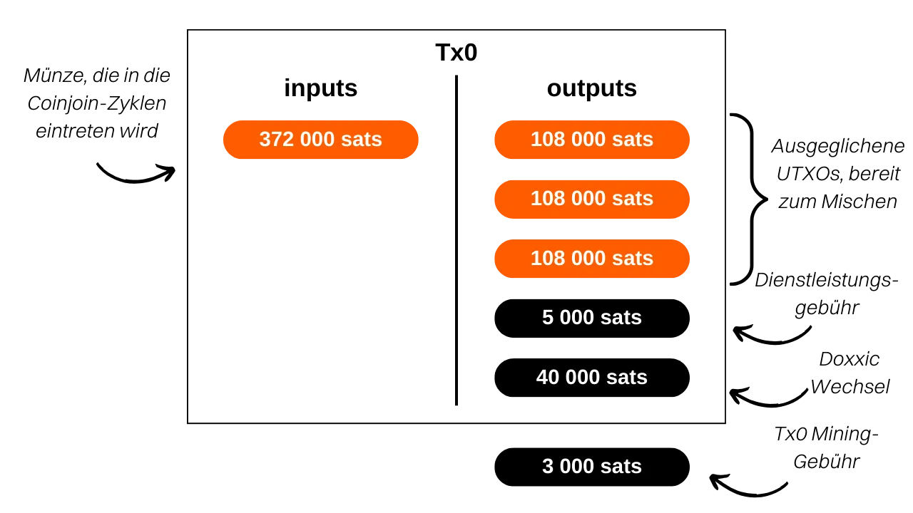

In diesem Beispiel einer `Tx0`-Transaktion wird ein Input von `372,000 sats` aus unserem **Deposit**-Konto in mehrere Output-UTXO aufgeteilt, die wie folgt verteilt sind:
- Ein Betrag von `5,000 sats` für den Koordinator für Dienstleistungsgebühren, entsprechend dem Eintritt in den Pool von `100,000 sats`;
- Drei UTXO, die für das Mischen vorbereitet sind, umgeleitet an unser **Premix**-Konto und beim Koordinator registriert. Diese UTXO werden auf `108,000 sats` je gleichgemacht, um die Mining-Gebühren für ihren zukünftigen ersten Mix zu decken;
- Der Überschuss, der nicht in den Pool eintreten kann, da er zu klein ist, wird als toxisches Wechselgeld betrachtet. Es wird auf sein spezifisches Konto gesendet. Hier beläuft sich dieses Wechselgeld auf `40,000 sats`;
- Schließlich gibt es `3,000 sats`, die keinen Output darstellen, sondern die Mining-Gebühren sind, die notwendig sind, um die `Tx0` zu bestätigen.

Zum Beispiel, hier ist eine echte Whirlpool Tx0 (nicht von mir): [edef60744f539483d868caff49d4848e5cc6e805d6cdc8d0f9bdbbaedcb5fc46](https://mempool.space/de/tx/edef60744f539483d868caff49d4848e5cc6e805d6cdc8d0f9bdbbaedcb5fc46)

**Schritt 2: Das doxxic change**
Der Überschuss, der nicht in den Pool integriert werden konnte, hier gleichbedeutend mit `40.000 sats`, wird auf das **Bad Bank**-Konto umgeleitet, auch als "doxxic change" bezeichnet, um eine strikte Trennung von den anderen UTXO im Wallet zu gewährleisten.
Dieses UTXO ist gefährlich für die Privatsphäre des Benutzers, denn es ist nicht nur noch mit seiner Vergangenheit verbunden und daher möglicherweise mit der Identität seines Besitzers, sondern es wird auch als zu einem Benutzer gehörend vermerkt, der einen Coinjoin durchgeführt hat.
Wenn dieses UTXO mit gemischten Ausgaben zusammengeführt wird, verlieren sie alle Vertraulichkeit, die während der Coinjoin-Zyklen gewonnen wurde, insbesondere wegen der Common-Input-Ownership-Heuristic (CIOH). Wird es mit anderen doxxic changes zusammengeführt, riskiert der Benutzer den Verlust der Vertraulichkeit, da dies die verschiedenen Eingaben der Coinjoin-Zyklen verknüpfen würde. Daher muss es mit Vorsicht behandelt werden. Die Art und Weise, wie dieses toxische UTXO gehandhabt wird, wird im letzten Teil dieses Artikels detailliert beschrieben, und zukünftige Tutorials werden diese Methoden auf dem PlanB-Netzwerk noch gründlicher behandeln.

**Schritt 3: Der Erste Mix**
Nachdem die `Tx0` abgeschlossen ist, werden die ausgeglichenen UTXOs auf das **Premix**-Konto unseres Wallets gesendet, bereit, in ihren ersten Coinjoin-Zyklus eingeführt zu werden, auch als "initialer Mix" bezeichnet. Wenn, wie in unserem Beispiel, die `Tx0` mehrere UTXOs für das Mischen erzeugt, wird jedes von ihnen in einen separaten initialen Coinjoin integriert.

Am Ende dieser ersten Mixe wird das **Premix**-Konto leer sein, während unsere Münzen, nachdem sie die Mining-Gebühren für diesen ersten Coinjoin bezahlt haben, genau auf den Betrag angepasst werden, der durch den gewählten Pool definiert ist. In unserem Beispiel werden unsere anfänglichen UTXOs von `108.000 sats` genau auf `100.000 sats` reduziert.

**Schritt 4: Die Remixe**
Nach dem initialen Mix werden die UTXOs auf das **Postmix**-Konto übertragen. Dieses Konto sammelt die bereits gemischten UTXOs und diejenigen, die auf ein Remixing warten. Wenn der Whirlpool-Client aktiv ist, sind die UTXOs im **Postmix**-Konto automatisch für ein Remixing verfügbar und werden zufällig ausgewählt, um an diesen neuen Zyklen teilzunehmen.

Zur Erinnerung, die Remixe sind dann zu 100% kostenlos: Es fallen keine zusätzlichen Servicegebühren oder Mining-Gebühren an. Die UTXOs im **Postmix**-Konto zu behalten, erhält somit ihren Wert intakt und verbessert gleichzeitig ihre Anonsets. Deshalb ist es wichtig, diese Münzen an mehreren Coinjoin-Zyklen teilnehmen zu lassen. Es kostet Sie absolut nichts, und es erhöht ihre Anonymitätsstufen.

Wenn Sie entscheiden, gemischte UTXOs auszugeben, können Sie dies direkt von diesem **Postmix**-Konto aus tun. Es wird empfohlen, die gemischten UTXOs in diesem Konto zu behalten, um von kostenlosen Remixen zu profitieren und zu vermeiden, dass sie den Whirlpool-Kreislauf verlassen, was ihre Vertraulichkeit verringern könnte.

Wie wir im folgenden Tutorial sehen werden, gibt es auch die Option `mix to`, die die Möglichkeit bietet, Ihre gemischten Münzen automatisch nach einer definierten Anzahl von Coinjoins an ein anderes Wallet, wie z.B. ein Cold Wallet, zu senden.
Nachdem wir die Theorie behandelt haben, tauchen wir mit einem Tutorial zur Nutzung von Whirlpool durch die Samourai Wallet Android-Anwendung, synchronisiert mit Whirlpool CLI und GUI auf Ihrem eigenen Dojo, in die Praxis ein!
## Tutorial: Coinjoin Whirlpool mit Ihrem eigenen Dojo
Es gibt viele Möglichkeiten, Whirlpool zu nutzen. Die Option, die ich hier vorstellen möchte, ist die Samourai Wallet-Option, eine Open-Source-Bitcoin-Wallet-Management-Anwendung auf Android, aber dieses Mal **mit Ihrem eigenen Dojo**.

Coinjoins über Samourai Wallet mit Ihrem eigenen Dojo durchzuführen, ist meiner Meinung nach die effektivste Strategie, um Coinjoins auf Bitcoin durchzuführen. Dieser Ansatz erfordert eine anfängliche Investition in Bezug auf die Einrichtung, bietet aber einmal eingerichtet die Möglichkeit, Ihre Bitcoins kontinuierlich zu mischen und neu zu mischen, 24 Stunden am Tag, 7 Tage die Woche, ohne dass Sie Ihre Samourai-Anwendung ständig aktiv halten müssen. Tatsächlich können Sie dank Whirlpool CLI, das auf einem Bitcoin-Knoten läuft, jederzeit an Coinjoins teilnehmen. Die Samourai-Anwendung gibt Ihnen dann die Möglichkeit, Ihre gemischten Gelder jederzeit und überall direkt von Ihrem Smartphone aus auszugeben. Darüber hinaus hat diese Methode den Vorteil, dass Sie nie mit Servern verbunden werden, die von den Samourai-Teams verwaltet werden, und bewahrt so Ihr `xpub` vor jeglicher externer Exposition.

Diese Technik ist daher ideal für diejenigen, die maximale Privatsphäre und die hochwertigsten Coinjoin-Zyklen suchen. Sie erfordert jedoch einen Bitcoin-Knoten zur Verfügung zu haben und, wie wir später sehen werden, einige Einrichtungen. Sie ist daher eher für fortgeschrittene Benutzer geeignet. Für Anfänger empfehle ich, sich mit Coinjoin durch diese beiden anderen Tutorials vertraut zu machen, die zeigen, wie es mit Sparrow Wallet oder Samourai Wallet (ohne Dojo) gemacht wird:
- **[Sparrow Wallet Coinjoin-Tutorial](https://planb.network/de/tutorials/privacy/coinjoin-sparrow-wallet)**;
- **[Samourai Wallet Coinjoin-Tutorial (ohne Dojo)](https://planb.network/de/tutorials/privacy/coinjoin-samourai-wallet)**.

### Das Setup verstehen
Zu Beginn benötigen Sie ein Dojo! Dojo ist eine Bitcoin-Knoten-Implementierung, die auf Bitcoin Core basiert und von den Samourai-Teams entwickelt wurde.

Um Ihr eigenes Dojo zu betreiben, haben Sie die Möglichkeit, entweder einen Dojo-Knoten autonom zu installieren, oder von Dojo auf einem anderen „Node-in-Box“-Bitcoin-Knoten zu profitieren. Derzeit sind die verfügbaren Optionen:
- [RoninDojo](https://ronindojo.io/), das ein Dojo mit zusätzlichen Tools ist, einschließlich eines Installationsassistenten und eines Verwaltungsassistenten. Ich erkläre das Verfahren zur Einrichtung und Nutzung von RoninDojo in diesem anderen Tutorial: [RONINDOJO V2](https://planb.network/de/tutorials/node/ronin-dojo-v2);
- [Umbrel](https://umbrel.com/) mit der Anwendung "Samourai Server";
- [MyNode](https://mynodebtc.com/) mit der Anwendung "Dojo";
- [Nodl](https://www.nodl.eu/) mit der Anwendung "Dojo";
- [Citadel](https://runcitadel.space/) mit der Anwendung "Samourai".
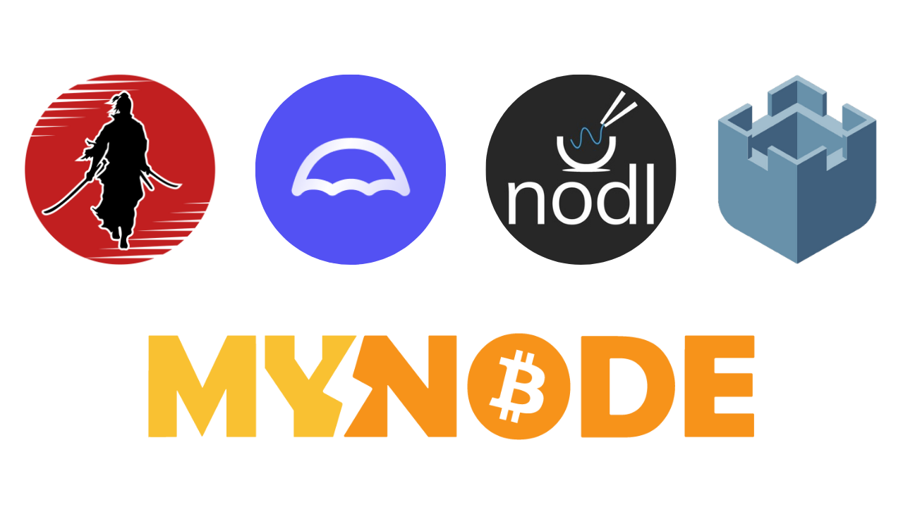
In unserem Setup werden wir mit drei verschiedenen Schnittstellen interagieren:
- **Samourai Wallet**, das unsere Bitcoin-Wallet, die für Coinjoins gewidmet ist, beherbergen wird. Verfügbar kostenlos auf Android, ermöglicht diese FOSS-Anwendung, Ihre Misch-Wallet zu kontrollieren, insbesondere um Ihre Postmix-Gelder von Ihrem Smartphone aus auszugeben;
- **Whirlpool CLI** (_Command Line Interface_), das auf dem Knoten betrieben wird, der das Dojo hostet. Diese Software hat Zugriff auf die Schlüssel Ihrer Samourai-Wallet. Sie ist verantwortlich für die Kommunikation mit dem Koordinator und die kontinuierliche Verwaltung der CoinJoins. Es fungiert als eine Kopie Ihrer Samourai-Wallet auf Ihrem Knoten, bereit jederzeit an CoinJoins teilzunehmen;
- **Whirlpool GUI** (_Graphical User Interface_), die grafische Benutzeroberfläche, die wir verwenden werden, um die Aktivität von Whirlpool CLI zu überwachen und das Mischen aus der Ferne zu initiieren. Whirlpool GUI bietet eine visuelle Darstellung der von Whirlpool CLI durchgeführten Operationen. Diese Software muss auf einem Computer installiert werden, der sich von dem Dojo unterscheidet. Für Benutzer von Umbrel, MyNode, Nodl und Citadel ist Whirlpool GUI obligatorisch. Bei RoninDojo ist die Whirlpool GUI-Schnittstelle jedoch bereits in die Web-Oberfläche Ihres Knotens über die `Whirlpool`-Anwendung integriert. Daher müssen Sie sie nicht auf einem separaten PC installieren.

Meiner Meinung nach stellt die Verwendung von RoninDojo die beste Lösung dar, um CoinJoins mit einem Dojo durchzuführen. Da diese Node-in-Box-Software in direkter Partnerschaft mit den Samourai-Teams steht, ist RoninDojo viel besser für diese Aufgabe optimiert. Darüber hinaus vereinfacht die Integration von Whirlpool GUI in die Web-Oberfläche den Einrichtungsprozess erheblich. In diesem Tutorial werde ich dennoch erklären, wie man es mit den anderen Lösungen, die Dojo integrieren (Umbrel, Nodl, MyNode und Citadel), durchführt.

### Vorbereitung Ihres Dojo
Zunächst müssen Sie Dojo installieren und den QR-Code oder den Link erhalten, der es Ihnen ermöglicht, sich aus der Ferne damit zu verbinden. Dieser Link ist eine Tor-Adresse, die auf `.onion` endet. Wenn Sie RoninDojo verwenden, navigieren Sie einfach zum `Pairing`-Menü, um auf diese Informationen zuzugreifen.

Unter `Samourai Dojo` klicken Sie auf den `Pair now`-Button.

Ihr Verbindungs-QR-Code und der entsprechende Link werden angezeigt.

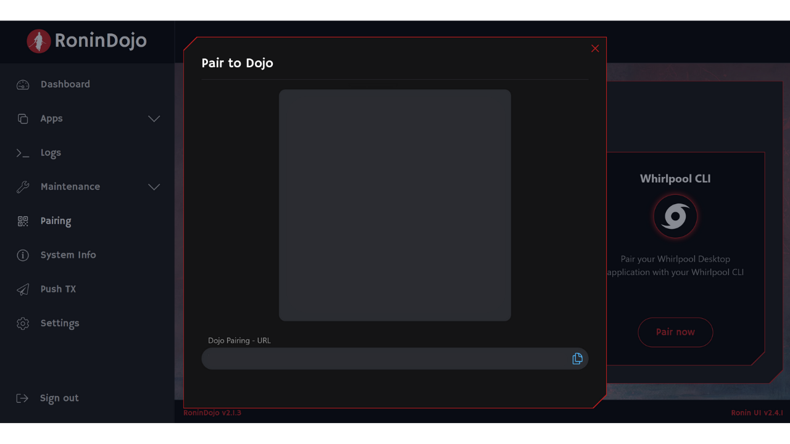

Wenn Sie Umbrel verwenden, gehen Sie zum App Store und suchen Sie nach der `Samourai Server`-Anwendung. Sie befindet sich im `Bitcoin`-Tab.

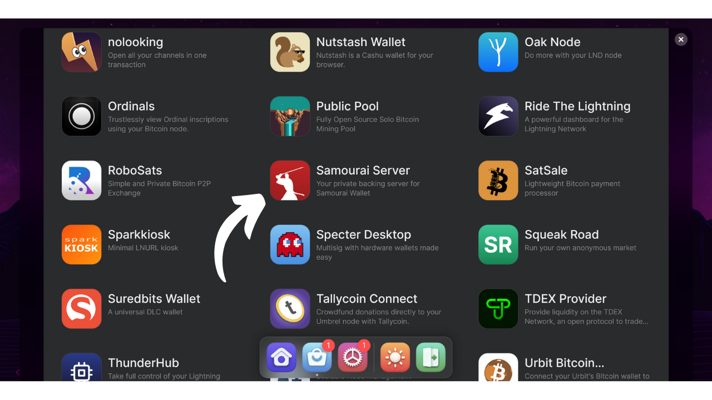

Installieren Sie die Anwendung.

Beim Öffnen der Anwendung haben Sie dann Zugriff auf den QR-Code, um sich mit Ihrem Dojo zu verbinden.

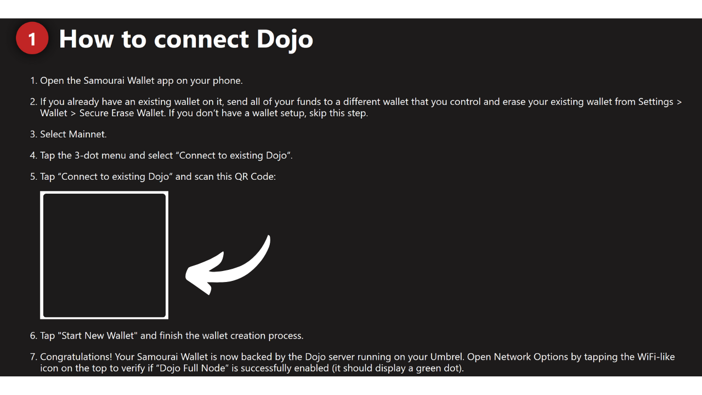

Wenn Sie eine andere Node-in-Box-Software wie MyNode, Citadel oder Nodl verwenden, ist der Prozess ähnlich wie bei Umbrel. Sie müssen die Samourai- oder Dojo-Anwendung installieren, um die notwendigen Informationen zu erhalten, um sich mit Ihrem Dojo zu verbinden.

### Vorbereitung Ihrer Samourai-Wallet
Nachdem Sie die Verbindungsinformationen zu Ihrem Dojo abgerufen haben, ist es nun an der Zeit, Ihre Wallet für CoinJoins einzurichten. Es gibt zwei Szenarien: Wenn Sie noch keine Samourai-Wallet auf Ihrem Smartphone haben, ist der Prozess einfach, erstellen Sie einfach eine neue.
Andererseits, wenn Sie bereits eine Samourai Wallet besitzen, müssen Sie die Anwendung neu installieren, um sie mit einem neuen Dojo zu verknüpfen. Dieser Schritt ist notwendig, weil die Verbindung zu einem Dojo nur beim ersten Start der Anwendung hergestellt werden kann. Dank der automatisch generierten verschlüsselten Backup-Datei von Samourai auf Ihrem Telefon ist dieses Verfahren jedoch einfach und schnell.
*Wenn Sie Samourai noch nie verwendet haben, können Sie diese vorläufigen Schritte überspringen und direkt mit der Installation der Anwendung fortfahren.*

Zuallererst stellen Sie sicher, dass Ihre Samourai Wallet Anwendung auf dem neuesten Stand ist. Um dies zu tun, überprüfen Sie den Google Play Store oder vergleichen Sie die Version Ihrer Anwendung in `Einstellungen > Sonstiges` mit der auf der Samourai-Website verfügbaren.

Stellen Sie sicher, dass Sie Ihre Samourai Wallet Wiederherstellungsphrase haben und dass sie lesbar ist. Führen Sie dann einen Test Ihrer BIP39-Passphrase durch, indem Sie zu `Einstellungen > Fehlerbehebung > Passphrase/Backup-Test` navigieren, um deren Genauigkeit zu bestätigen.

Geben Sie Ihre Passphrase ein, dann überprüfen Sie, ob Samourai deren Gültigkeit bestätigt.

Wenn Ihre Passphrase ungültig ist oder wenn Sie Ihre Wiederherstellungsphrase nicht haben, ist es zwingend erforderlich, das Verfahren sofort zu stoppen! **Sie riskieren, Ihre Bitcoins während dieser Operation zu verlieren.** In diesem Fall wird empfohlen, Ihre Mittel auf eine andere Wallet zu übertragen und mit einer neuen leeren Samourai Wallet zu beginnen. Die folgenden Schritte sollten nur befolgt werden, wenn Sie sicher sind, dass Sie alle notwendigen Backup-Informationen haben und dass Ihre Passphrase gültig ist.

Fahren Sie dann fort, ein verschlüsseltes Backup Ihrer Wallet zu erstellen und kopieren Sie es in Ihre Zwischenablage. Um diese Operation auszuführen, klicken Sie auf die drei kleinen Punkte oben rechts auf dem Bildschirm und wählen Sie `Wallet-Backup exportieren`.

**Ab diesem Schritt kopieren Sie nichts anderes in Ihre Zwischenablage!** Es ist absolut wesentlich, dass Sie Ihr kopiertes Backup behalten.

Wenn Sie die vorherigen Schritte korrekt ausgeführt haben, können Sie jetzt Ihre Samourai Wallet sicher löschen. Gehen Sie dazu zu: `Einstellungen > Wallet > Sicheres Löschen der Wallet`.

*Wenn Sie Samourai noch nie verwendet haben und die Anwendung von Grund auf neu installieren, können Sie das Tutorial ab diesem Schritt fortsetzen.*

Ihre Samourai-Anwendung ist jetzt zurückgesetzt. Öffnen Sie die Anwendung und fahren Sie mit den Einrichtungsschritten fort, als würden Sie sie zum ersten Mal verwenden.

Im nächsten Schritt gelangen Sie auf die Seite, die der Konfiguration Ihres Dojo gewidmet ist. Wählen Sie die Option `Dojo` und geben Sie dann Ihre Dojo-Anmeldeinformationen ein. Dazu haben Sie die Möglichkeit, die Informationen durch Drücken von `QR scannen` zu scannen.

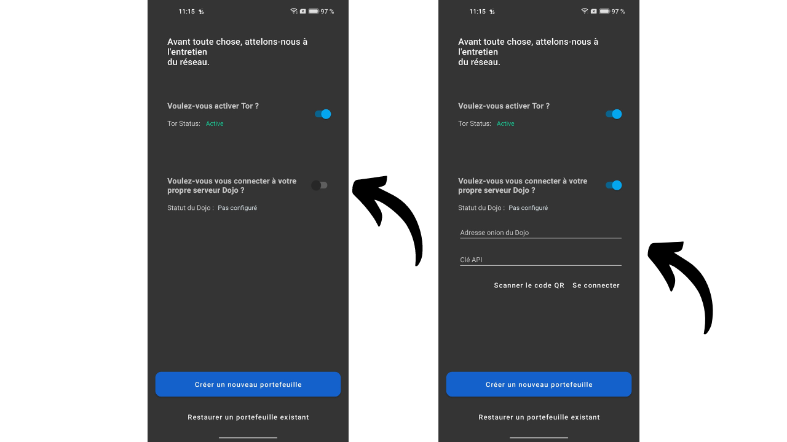

*Für neue Benutzer von Samourai wird es dann notwendig sein, eine Wallet von Grund auf neu zu erstellen. Wenn Sie Hilfe benötigen, können Sie die Anweisungen zur Einrichtung einer neuen Samourai Wallet [in diesem Tutorial, speziell im Abschnitt "Erstellen einer Software-Wallet"](https://planb.network/tutorials/privacy/coinjoin-samourai-wallet) konsultieren.*

Wenn Sie mit der Wiederherstellung einer bereits existierenden Samourai Wallet fortfahren, wählen Sie `Bestehende Wallet wiederherstellen`, dann wählen Sie `Ich habe eine Samourai Backup-Datei`.
Normalerweise sollten Sie immer Ihre Wiederherstellungsdatei in Ihrer Zwischenablage haben. Klicken Sie dann auf `EINFÜGEN`, um Ihre Datei an der vorgesehenen Stelle einzufügen. Um sie zu entschlüsseln, müssen Sie auch die BIP39-Passphrase Ihres Wallets in das entsprechende Feld eingeben, das sich direkt darunter befindet. Zum Abschluss klicken Sie auf `FERTIGSTELLEN`. 

Sie werden dann zu Ihrem Samourai Wallet weitergeleitet, das diesmal mit Ihrem eigenen Dojo verbunden sein wird.

### Whirlpool GUI installieren
Es ist jetzt an der Zeit, Whirlpool GUI zu installieren, die grafische Benutzeroberfläche, die es Ihnen ermöglicht, Ihre CoinJoin-Zyklen von Ihrem üblichen PC aus zu verwalten. Für RoninDojo-Benutzer ist dieser Schritt nicht notwendig, da die Verwaltung von CoinJoins direkt über die Web-Oberfläche in `Apps > Whirlpool` erfolgen kann. Wenn Sie jedoch eine andere Bitcoin "Node-in-Box"-Lösung verwenden, ist es zwingend erforderlich, diese Installation durchzuführen.

Gehen Sie zu Ihrem persönlichen Computer und laden Sie die Whirlpool-Software von der offiziellen Samourai Wallet-Website herunter, indem Sie die Version auswählen, die Ihrem Betriebssystem entspricht.

Bevor Sie Whirlpool GUI starten, ist es notwendig, JAVA 8 oder eine höhere Version auf Ihrem Gerät zu installieren. Dafür können Sie [OpenJDK installieren](https://adoptium.net/).

Es ist auch notwendig, Tor Daemon oder Tor Browser im Hintergrund auf Ihrem Computer betriebsbereit zu haben. Stellen Sie sicher, dass Sie Tor vor jeder Nutzungssitzung von Whirlpool GUI starten. Wenn Tor noch nicht auf Ihrem Gerät installiert ist, [können Sie es von der offiziellen Projektwebsite herunterladen und installieren](https://www.torproject.org/download/), und dann sicherstellen, dass es im Hintergrund gestartet wird.

Sobald JDK auf Ihrem System installiert ist und Tor im Hintergrund läuft, können Sie Whirlpool GUI starten.

Von Whirlpool GUI aus klicken Sie auf `Erweitert: Remote CLI`, um Ihre Whirlpool CLI zu verbinden, die sich auf Ihrem Dojo befindet. Sie benötigen die Tor-Adresse Ihrer Whirlpool CLI.

Um Ihre Tor-Adresse auf Umbrel und anderen "Node-in-Box"-Lösungen zu finden, starten Sie einfach die Samourai Server- oder Dojo-Anwendung (der Name kann je nach verwendeter Software variieren). Die Tor-Adresse wird direkt auf der Seite der Anwendung sichtbar sein.

Geben Sie in Whirlpool GUI die Tor-Adresse, die Sie zuvor erhalten haben, in das Feld `CLI-Adresse` ein. Behalten Sie das Präfix `http://` bei, fügen Sie aber nicht den Port `:8899` am Ende hinzu. Fügen Sie nur die Adresse so ein, wie sie Ihnen zur Verfügung gestellt wurde.

Im Feld Tor Proxy geben Sie `socks5://127.0.0.1:9050` ein, wenn Sie Tor Daemon verwenden, oder `socks5://127.0.0.1:9150`, wenn es der Tor Browser ist. Wenn Sie sich das erste Mal über Whirlpool GUI mit Whirlpool CLI verbinden, ist es möglich, das Feld für den API-Schlüssel leer zu lassen. Wenn dies nicht Ihre erste Verbindung ist, geben Sie bitte Ihren API-Schlüssel im dafür vorgesehenen Raum ein. Dieser Schlüssel kann auf derselben Seite wie Ihre Tor-Adresse gefunden werden.
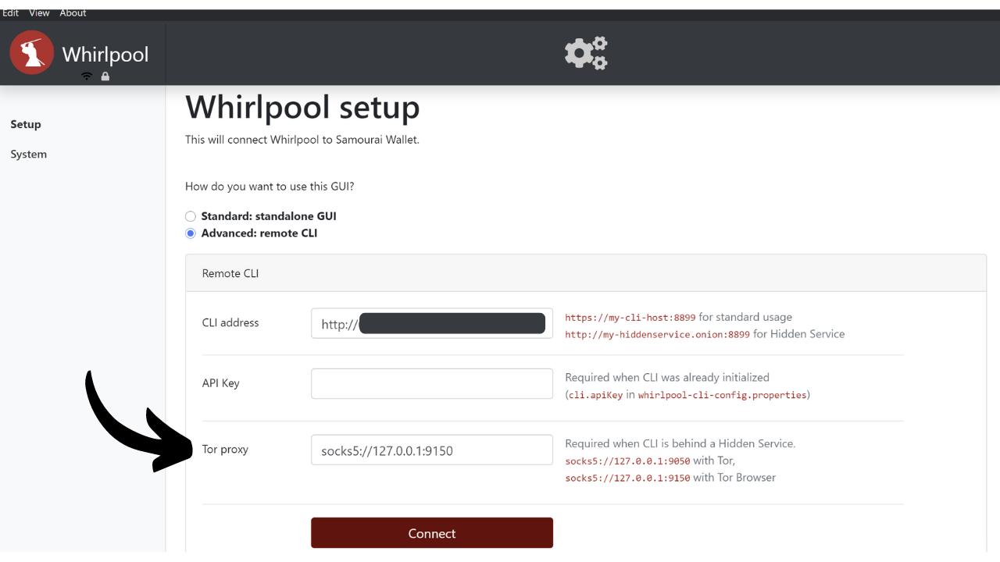
Sobald Sie alles ausgefüllt haben, klicken Sie auf den `Connect`-Button. Bitte warten Sie, die Verbindung kann einige Minuten dauern.

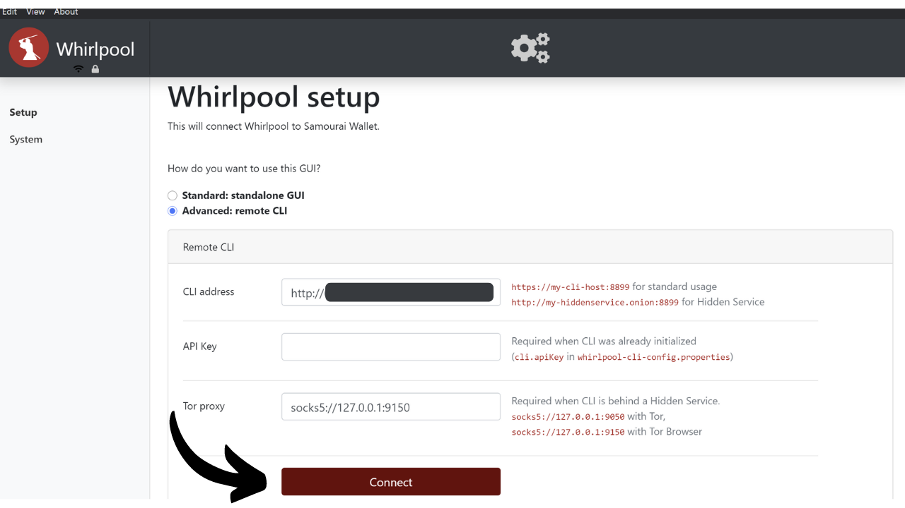

### Ihr Samourai Wallet mit Whirlpool GUI koppeln
*Für RoninDojo-Nutzer, können Sie das Tutorial hier fortsetzen.*

Wir werden nun das zuvor konfigurierte Samourai Wallet mit der Whirlpool GUI-Software oder direkt mit RoninDojo für diejenigen, die diese Software verwenden, koppeln. Unabhängig davon, ob Sie Whirlpool GUI oder RoninDojo verwenden, werden Sie aufgefordert, die Kopplungsinformationen Ihres Samourai Wallets einzufügen oder zu scannen.

Um diese Informationen zu finden, gehen Sie zu den Einstellungen Ihres Wallets.

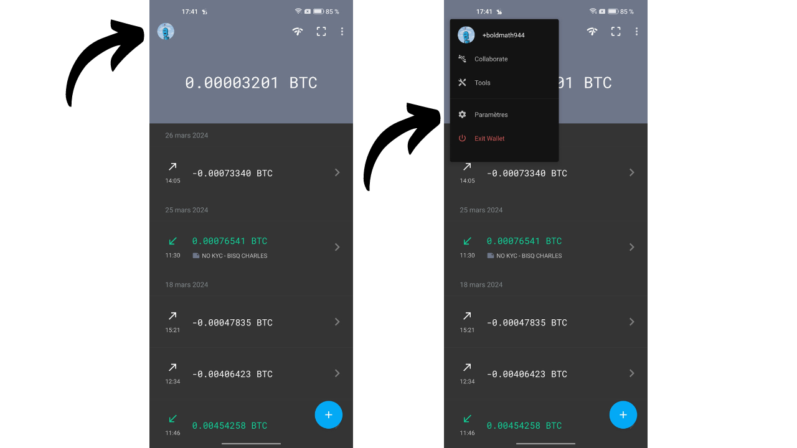

Klicken Sie auf `Transaktionen`, dann auf `Mit Whirlpool GUI koppeln`.

Samourai wird Ihnen dann die notwendigen Informationen zur Herstellung der Verbindung bereitstellen. Seien Sie vorsichtig, diese Daten sind sensibel! Sie können sie auf Ihren PC übertragen, indem Sie sie direkt kopieren oder den angezeigten QR-Code scannen, indem Sie nach dem Klicken auf das QR-Code-Symbol die Webcam Ihres Computers verwenden.

Nachdem Sie diesen Vorgang durchgeführt haben, wählen Sie in Whirlpool GUI `Initialize GUI`. Bitte warten Sie, da dieser Schritt einen Moment dauern kann.

Unabhängig davon, ob Sie Whirlpool GUI oder RoninDojo verwenden, werden Sie aufgefordert, die Passphrase Ihres Samourai Wallets einzugeben. Geben Sie sie in das dafür vorgesehene Feld ein und drücken Sie dann den `Login`-Button, um fortzufahren.

Dann gelangen Sie zur Startseite von Whirlpool CLI

### Coinjoins über Whirlpool GUI initiieren
*Für RoninDojo-Nutzer ist der Prozess identisch. Die in RoninDojo integrierte Whirlpool-App-Oberfläche bietet dieselben Optionen und Funktionalitäten wie die Whirlpool GUI-Software auf dem Desktop. Daher können Sie diese Anweisungen auf die gleiche Weise befolgen.*
Jetzt, wo alles eingerichtet ist, sind Sie bereit, Ihre Bitcoins zu mixen. Um dies zu tun, übertragen Sie die Bitcoins, die Sie mixen möchten, auf das **Deposit**-Konto Ihres Samourai Wallets. Diese Operation kann entweder direkt über die Samourai Wallet-App oder über Whirlpool GUI durchgeführt werden. Klicken Sie auf der Hauptseite auf den `+ Deposit`-Button oben links.

Whirlpool GUI wird eine Empfangsadresse generieren. Es wird auch der Mindestbetrag angezeigt, der benötigt wird, um an jedem Coinjoin-Pool teilzunehmen. Dieser Betrag variiert je nach Gebührenmarkt. Es wird empfohlen, einen Betrag einzuzahlen, der leicht über dem Mindestbetrag liegt, da, falls die Mining-Gebühren nicht sinken, Ihr UTXO möglicherweise nicht im gewünschten Pool akzeptiert wird. Senden Sie daher Ihre Bitcoins an die bereitgestellte Adresse. Um eine neue Adresse zu erhalten, klicken Sie einfach auf den `Renew address`-Button.

Sobald die Einzahlung bestätigt ist, werden Sie sie im **Deposit**-Konto auf Whirlpool GUI sehen können.

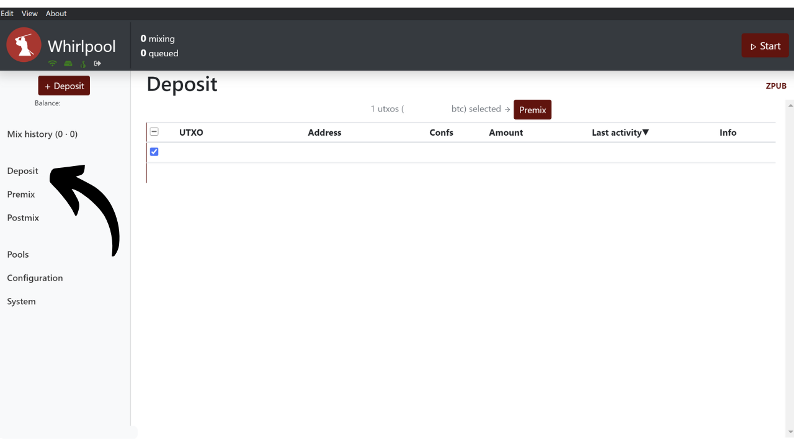
Um die CoinJoin-Zyklen zu starten, wählen Sie die UTXOs aus, die Sie mischen möchten, und drücken Sie den `Premix`-Knopf. Seien Sie vorsichtig: Wenn Sie gleichzeitig mehrere verschiedene UTXOs auswählen, werden diese während der `TX0`-Vorbereitungstransaktion kombiniert. Diese Zusammenführung kann zu einem Rückgang der Privatsphäre führen, insbesondere wenn die UTXOs aus verschiedenen Quellen stammen, aufgrund der Common Input Ownership Heuristic (CIOH).
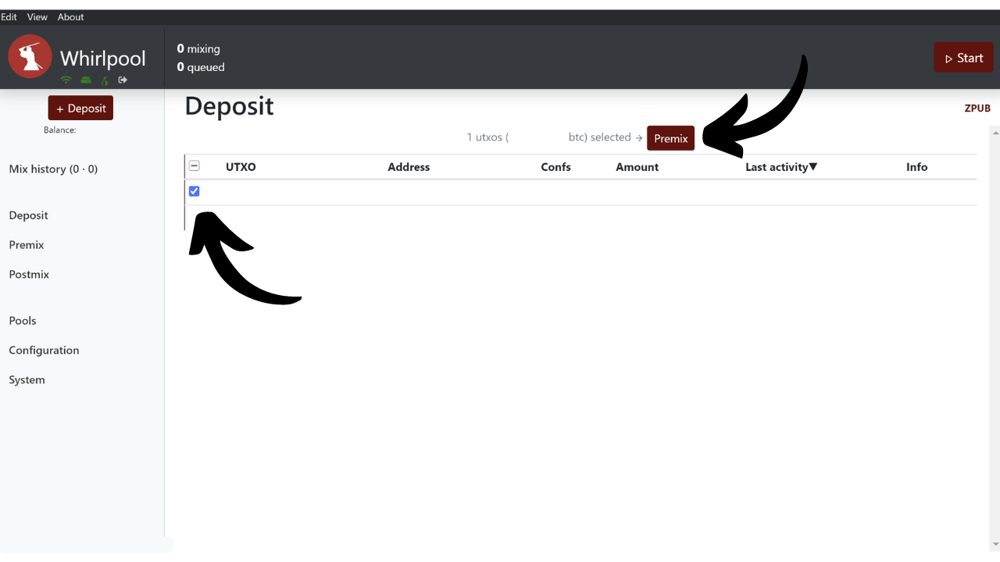

Die Konfigurationsseite von Whirlpool öffnet sich. Sie können den Pool auswählen, in den Sie eintreten möchten. Wählen Sie auch die Mining-Gebühren für die `TX0` und die ersten CoinJoins aus. Am unteren Rand dieser Seite wird eine Zusammenfassung angezeigt, die Ihnen die Menge des doxxischen Wechsels sowie die Menge und Anzahl der UTXOs, die angeglichen und in die CoinJoin-Zyklen einbezogen werden, präsentiert. Wenn Sie mit dieser Konfiguration zufrieden sind, drücken Sie den `Premix`-Knopf, um die CoinJoin-Zyklen zu starten.

Sobald die `TX0` erstellt ist, können Sie Ihre angeglichenen UTXOs im **Premix**-Konto sehen, wartend auf Bestätigung. Um Ihre Münzen automatisch 24 Stunden am Tag, 7 Tage die Woche neu zu mischen, empfehle ich, die Option `Automatically mix premix & postmix` zu aktivieren. Diese Funktion finden Sie im `Configuration`-Tab, links in Ihrem Whirlpool GUI-Fenster.

Nachdem Sie die CoinJoins gestartet haben, können Sie Whirlpool GUI sowie Samourai Wallet verlassen. Nur Ihr Knoten muss verbunden bleiben, um an kontinuierlichen CoinJoins teilnehmen zu können. Es ist jedoch ratsam, den Fortschritt Ihrer CoinJoin-Zyklen regelmäßig zu überprüfen. Wenn Sie bemerken, dass Ihre UTXOs längere Zeit nicht mehr für einen CoinJoin ausgewählt werden, könnte dies auf einen Fehler hinweisen. In diesem Fall gehen Sie zu Whirlpool CLI und wählen `Start`, um Ihre Verfügbarkeit für CoinJoins neu zu starten.

Ihre gemischten UTXOs sind vom **Postmix**-Konto auf Whirlpool GUI aus sichtbar. Zusätzlich haben Sie die Möglichkeit, sie direkt über die Whirlpool-Schnittstelle auf Ihrem Samourai Wallet anzusehen und auszugeben. Um auf dieses Menü zuzugreifen, klicken Sie auf das blaue `+` am unteren Rand Ihres Bildschirms und wählen dann `Whirlpool`.

Whirlpool-Konten sind in Samourai Wallet durch ihre blaue Farbe leicht zu identifizieren. Dies ermöglicht es Ihnen, Ihre gemischten UTXOs jederzeit und überall direkt von Ihrem Smartphone aus auszugeben.

Um den Überblick über Ihre automatischen CoinJoins zu behalten, empfehle ich auch, ein Watch-Only-Wallet über die Sentinel-App einzurichten. Fügen Sie das ZPUB Ihres **Postmix**-Kontos hinzu und überwachen Sie den Fortschritt Ihrer CoinJoin-Zyklen in Echtzeit. Wenn Sie verstehen möchten, wie man Sentinel verwendet, empfehle ich, dieses andere Tutorial im PlanB Network zu konsultieren: [**SENTINEL WATCH-ONLY**](https://planb.network/tutorials/wallet/sentinel).