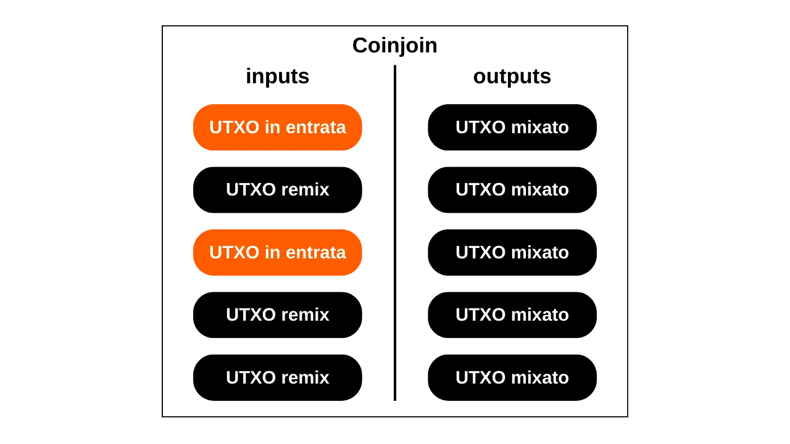
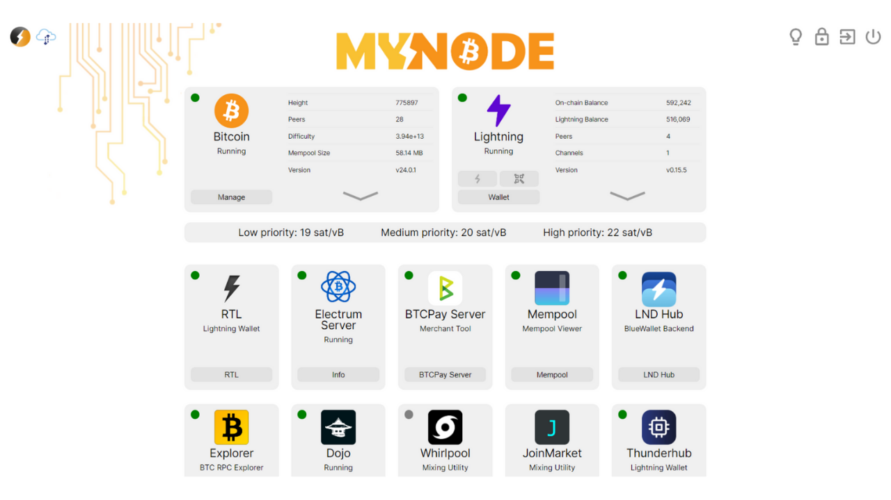
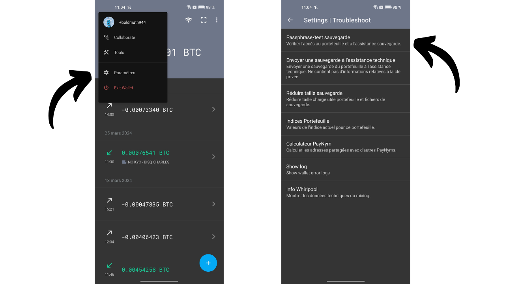
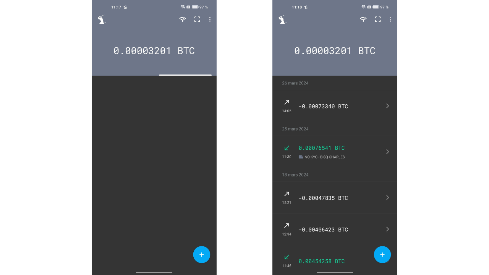
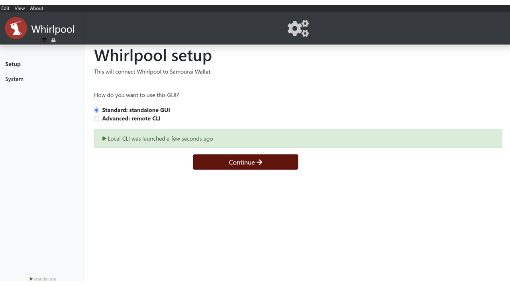
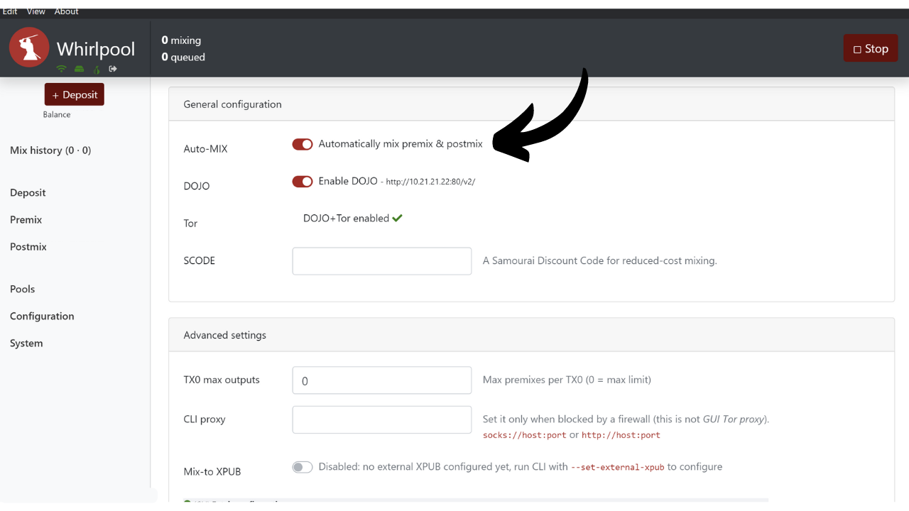
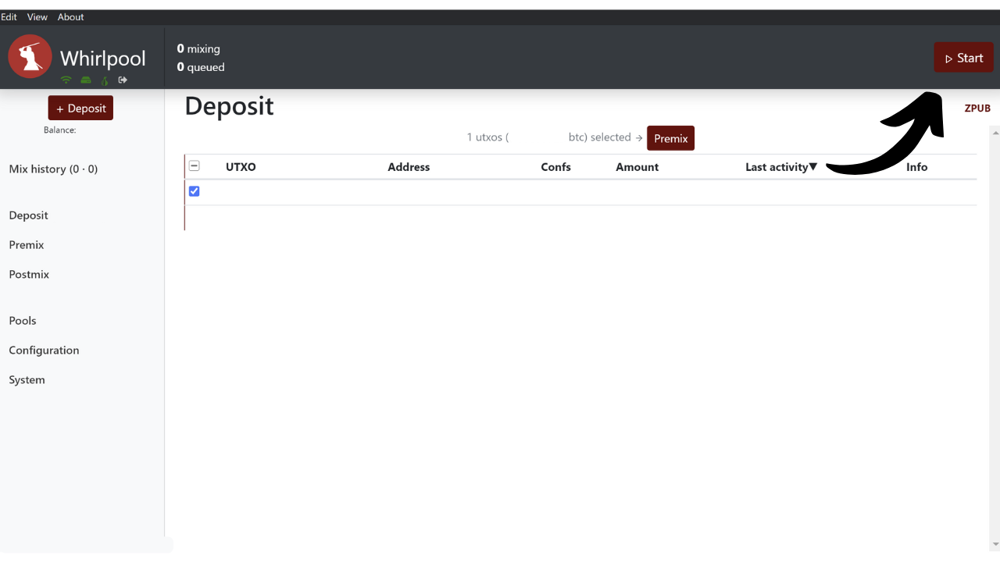

***ATTENZIONE:** In seguito all'arresto dei fondatori di Samourai Wallet e al sequestro dei loro server il 24 aprile, lo strumento Whirlpool non funziona più, anche per coloro che dispongono del proprio Dojo o utilizzano Sparrow Wallet. Tuttavia, rimane possibile che questo strumento possa essere rimesso in servizio nelle prossime settimane o rilanciato in modo diverso. Inoltre, la parte teorica di questo articolo rimane pertinente per comprendere i principi e gli obiettivi dei coinjoins in generale (non solo Whirlpool), oltre a comprendere l'efficacia del modello Whirlpool.*

_Stiamo seguendo da vicino l'evoluzione di questo caso così come gli sviluppi relativi agli strumenti associati. Siate certi che aggiorneremo questo tutorial non appena saranno disponibili nuove informazioni._

_Questo tutorial è fornito solo a scopo educativo e informativo. Non approviamo né incoraggiamo l'uso di questi strumenti per scopi criminali. È responsabilità di ogni utente rispettare le leggi vigenti nella propria giurisdizione._

---

In questo tutorial, imparerai cos'è un coinjoin e come eseguirne uno utilizzando il software Samourai Wallet e l'implementazione Whirlpool, utilizzando il tuo Dojo. A mio parere, questo metodo è attualmente il migliore per mescolare i tuoi bitcoin.

## Cos'è un coinjoin su Bitcoin?
**Un coinjoin è una tecnica che interrompe la tracciabilità dei bitcoin sulla blockchain**. Si basa su una transazione collaborativa con una struttura specifica dello stesso nome: la transazione coinjoin.

I coinjoin migliorano la privacy degli utenti Bitcoin complicando l'analisi della catena per gli osservatori esterni. La loro struttura consente di unire più monete da diversi utenti in una singola transazione, offuscando così le tracce e rendendo difficile determinare i collegamenti tra gli indirizzi di input e output.

Il principio del coinjoin si basa su un approccio collaborativo: diversi utenti che desiderano mescolare i loro bitcoin depositano importi identici come input della stessa transazione. Questi importi vengono poi ridistribuiti come output di pari valore a ciascun utente. Al termine della transazione, diventa impossibile associare un output specifico a un utente conosciuto in input. Non esiste un collegamento diretto tra gli input e gli output, il che rompe l'associazione tra gli utenti e i loro UTXO, così come la storia di ogni moneta.

Esempio di una transazione coinjoin (non mia): [323df21f0b0756f98336437aa3d2fb87e02b59f1946b714a7b09df04d429dec2](https://mempool.space/it/tx/323df21f0b0756f98336437aa3d2fb87e02b59f1946b714a7b09df04d429dec2)

Per eseguire un coinjoin garantendo che ogni utente mantenga il controllo sui propri fondi in ogni momento, il processo inizia con la costruzione della transazione da parte di un coordinatore, che poi la trasmette ai partecipanti. Ogni utente firma quindi la transazione dopo aver verificato che sia di suo gradimento. Tutte le firme raccolte vengono infine integrate nella transazione. Se un utente o il coordinatore tenta di dirottare fondi, modificando gli output della transazione coinjoin, le firme risulteranno invalide, portando al rifiuto della transazione da parte dei nodi.

Esistono diverse implementazioni di coinjoin, come Whirlpool, JoinMarket o Wabisabi, ognuna con l'obiettivo di gestire il coordinamento tra i partecipanti e aumentare l'efficienza delle transazioni coinjoin.
In questo tutorial, ci addentreremo nell'implementazione di **Whirlpool**, che considero essere la soluzione più efficiente per eseguire coinjoin su Bitcoin. Sebbene disponibile su diversi portafogli, in questo tutorial, esploreremo esclusivamente il suo utilizzo con l'applicazione mobile Samourai Wallet, senza Dojo.

## Perché eseguire coinjoin su Bitcoin?
Uno dei problemi iniziali con qualsiasi sistema di pagamento peer-to-peer è il doppio pagamento: come impedire a individui malintenzionati di spendere le stesse unità monetarie più volte senza ricorrere a un'autorità centrale per arbitrare?

Satoshi Nakamoto ha fornito una soluzione a questo dilemma attraverso il protocollo Bitcoin, un sistema di pagamento elettronico peer-to-peer che opera indipendentemente da qualsiasi autorità centrale. Nel suo white paper, sottolinea che l'unico modo per certificare l'assenza di doppio pagamento è garantire la visibilità di tutte le transazioni all'interno del sistema di pagamento.
Per garantire che ogni partecipante sia a conoscenza delle transazioni, queste devono essere divulgate pubblicamente. Pertanto, il funzionamento di Bitcoin si basa su un'infrastruttura trasparente e distribuita, che consente a qualsiasi operatore di nodo di verificare l'intera catena delle firme elettroniche e la storia di ogni moneta, dalla sua creazione da parte di un miner.

La natura trasparente e distribuita della blockchain di Bitcoin significa che qualsiasi utente della rete può seguire e analizzare le transazioni di tutti gli altri partecipanti. Di conseguenza, l'anonimato a livello di transazione è impossibile. Tuttavia, l'anonimato è preservato a livello di identificazione individuale. A differenza del sistema bancario tradizionale dove ogni conto è collegato a un'identità personale, su Bitcoin i fondi sono associati a coppie di chiavi crittografiche, offrendo così agli utenti una forma di pseudonimato dietro identificatori crittografici.

Pertanto, la riservatezza su Bitcoin è compromessa quando osservatori esterni riescono ad associare specifici UTXO a utenti identificati. Una volta stabilita questa associazione, diventa possibile tracciare le loro transazioni e analizzare la storia dei loro bitcoin. Coinjoin è precisamente una tecnica sviluppata per rompere la tracciabilità degli UTXO, offrendo così un certo livello di riservatezza agli utenti di Bitcoin a livello di transazione.

## Come funziona Whirlpool?
Whirlpool si distingue dagli altri metodi coinjoin utilizzando transazioni "_ZeroLink_", che garantiscono che non ci sia tecnicamente alcun collegamento possibile tra tutti gli input e tutti gli output. Questo perfetto mescolamento è ottenuto attraverso una struttura in cui ogni partecipante contribuisce con un importo identico in input (ad eccezione delle commissioni di mining), generando così output di importi perfettamente uguali.
Questo approccio restrittivo agli input conferisce alle transazioni coinjoin di Whirlpool una caratteristica unica: l'assenza completa di collegamenti deterministici tra gli input e gli output. In altre parole, ogni output ha una probabilità uguale di essere attribuito a qualsiasi partecipante, rispetto a tutti gli altri output nella transazione.
Inizialmente, il numero di partecipanti in ogni coinjoin Whirlpool era limitato a 5, con 2 nuovi entranti e 3 remixers (spiegheremo questi concetti più avanti). Tuttavia, l'aumento delle commissioni per le transazioni on-chain osservato nel 2023 ha spinto i team di Samourai a ripensare il loro modello per migliorare la privacy riducendo i costi. Pertanto, tenendo conto della situazione del mercato delle commissioni e del numero di partecipanti, il coordinatore può ora organizzare coinjoin che includono 6, 7 o 8 partecipanti. Queste sessioni potenziate sono denominate "_Cicli di Surge_". È importante notare che, indipendentemente dalla configurazione, ci sono sempre solo 2 nuovi entranti nei coinjoin di Whirlpool.

Pertanto, le transazioni Whirlpool sono caratterizzate da un numero identico di input e output, che possono essere:
- 5 input e 5 output;

- 6 input e 6 output;

- 7 input e 7 output;

- 8 input e 8 output.

Il modello proposto da Whirlpool si basa quindi su piccole transazioni coinjoin. A differenza di Wasabi e JoinMarket, dove la robustezza degli anonset si basa sul volume dei partecipanti in un singolo ciclo, Whirlpool scommette sulla catena di più cicli di piccole dimensioni.

In questo modello, l'utente paga le commissioni solo al suo ingresso iniziale in un pool, consentendogli di partecipare a una moltitudine di remix senza commissioni aggiuntive. Sono i nuovi entranti a coprire le commissioni di mining per i remixers.
Con ogni coinjoin aggiuntivo a cui una moneta partecipa, insieme ai suoi peer incontrati in passato, gli anonset cresceranno esponenzialmente. L'obiettivo è quindi sfruttare questi remix gratuiti che, ad ogni occorrenza, contribuiscono ad aumentare la densità degli anonset associati a ciascuna moneta miscelata.
Whirlpool è stato progettato tenendo conto di due requisiti importanti:
- L'accessibilità dell'implementazione su dispositivi mobili, dato che Samourai Wallet è principalmente un'applicazione per smartphone;
- La velocità dei cicli di remixing per promuovere un significativo aumento degli anonset.
Questi imperativi hanno guidato le scelte degli sviluppatori di Samourai Wallet nella progettazione di Whirlpool, portandoli a limitare il numero di partecipanti per ciclo. Troppo pochi partecipanti avrebbero compromesso l'efficienza del coinjoin, riducendo drasticamente gli anonset generati ogni ciclo, mentre troppi partecipanti avrebbero posto problemi di gestione sulle applicazioni mobili e avrebbero ostacolato il flusso dei cicli.
**In definitiva, non è necessario avere un alto numero di partecipanti per coinjoin su Whirlpool poiché gli anonset si ottengono attraverso l'accumulo di diversi cicli di coinjoin.**

[-> Scopri di più sugli anonset di Whirlpool.](https://planb.network/tutorials/privacy/wst-anonsets)

### Le piscine e le commissioni per coinjoin
Affinché questi multipli cicli aumentino efficacemente gli anonset delle monete miscelate, deve essere stabilito un certo quadro per limitare le quantità di UTXO utilizzate. Whirlpool definisce quindi diverse piscine.

Una piscina rappresenta un gruppo di utenti che desiderano miscelarsi insieme, che concordano sulla quantità di UTXO da utilizzare per ottimizzare il processo di coinjoin. Ogni piscina specifica un importo fisso per l'UTXO, a cui l'utente deve attenersi per partecipare. Quindi, per eseguire coinjoin con Whirlpool, è necessario selezionare una piscina. Le piscine attualmente disponibili sono le seguenti:
- 0,5 bitcoin;
- 0,05 bitcoin;
- 0,01 bitcoin;
- 0,001 bitcoin (= 100.000 sats).

Unendoti a una piscina con i tuoi bitcoin, questi verranno divisi per generare UTXO che sono perfettamente omogenei con quelli degli altri partecipanti nella piscina. Ogni piscina ha un limite massimo; quindi, per importi che superano questo limite, sarai costretto o a fare due ingressi separati all'interno della stessa piscina o a passare a un'altra piscina con un importo maggiore:

| Piscina (bitcoin) | Importo massimo per ingresso (bitcoin) |
|-------------------|----------------------------------------|
| 0,5               | 35                                     |
| 0,05              | 3,5                                    |
| 0,01              | 0,7                                    |
| 0,001             | 0,025                                  |

Come accennato in precedenza, un UTXO è considerato appartenente a una piscina quando è pronto per essere integrato in un coinjoin. Tuttavia, ciò non significa che l'utente perda il possesso di esso. **Attraverso i diversi cicli di miscelazione, mantieni il pieno controllo delle tue chiavi e, di conseguenza, dei tuoi bitcoin.** Questo è ciò che differenzia la tecnica del coinjoin da altre tecniche di miscelazione centralizzate.

Per entrare in una piscina di coinjoin, devono essere pagate le commissioni di servizio così come le commissioni di mining. Le commissioni di servizio sono fisse per ogni piscina e sono destinate a compensare i team responsabili dello sviluppo e della manutenzione di Whirlpool.
Le commissioni di servizio per l'utilizzo di Whirlpool devono essere pagate solo una volta all'ingresso nella piscina. Dopo questo passaggio, hai l'opportunità di partecipare a un numero illimitato di remix senza alcuna commissione aggiuntiva. Ecco le attuali commissioni fisse per ogni piscina:
| Piscina (bitcoin) | Commissione di ingresso (bitcoin) |
|-------------------|-----------------------------------|
Queste commissioni funzionano essenzialmente come un biglietto d'ingresso per il pool scelto, indipendentemente dall'importo che inserisci in coinjoin. Pertanto, sia che tu partecipi al pool da 0,01 con esattamente 0,01 BTC o vi entri con 0,5 BTC, le commissioni rimarranno le stesse in valore assoluto.

Prima di procedere ai coinjoin, l'utente ha quindi la scelta tra 2 strategie:
- Optare per un pool più piccolo per minimizzare le commissioni di servizio, sapendo che riceveranno in cambio diversi piccoli UTXO;
- O preferire un pool più grande, accettando di pagare commissioni più elevate per finire con un numero ridotto di UTXO di valore maggiore.

Generalmente si sconsiglia di unire diversi UTXO mixati dopo i cicli di coinjoin, poiché ciò potrebbe compromettere la riservatezza acquisita, soprattutto a causa dell'Euristica di Proprietà Comune dell'Input (CIOH). Pertanto, potrebbe essere saggio scegliere un pool più grande, anche se ciò significa pagare di più, per evitare di avere troppi UTXO di piccolo valore in uscita. L'utente deve valutare questi compromessi per scegliere il pool che preferisce.

Oltre alle commissioni di servizio, devono essere considerate anche le commissioni di mining inerenti a qualsiasi transazione Bitcoin. Come utente di Whirlpool, sarai tenuto a pagare le commissioni di mining per la transazione di preparazione (`Tx0`) così come quelle per il primo coinjoin. Tutti i remix successivi saranno gratuiti, grazie al modello di Whirlpool che si basa sul pagamento dei nuovi partecipanti.

Infatti, in ogni coinjoin di Whirlpool, due utenti tra gli input sono nuovi partecipanti. Gli altri input provengono dai remixer. Di conseguenza, le commissioni di mining per tutti i partecipanti alla transazione sono coperte da questi due nuovi partecipanti, che beneficeranno poi anche di remix gratuiti:

Grazie a questo sistema di commissioni, Whirlpool si differenzia veramente da altri servizi di coinjoin poiché gli anonset degli UTXO non sono proporzionali al prezzo pagato dall'utente. Così, è possibile raggiungere livelli di anonimato considerevolmente alti pagando solo la commissione di ingresso del pool e le commissioni di mining per due transazioni (la `Tx0` e il mix iniziale).
È importante notare che l'utente dovrà anche coprire le commissioni di mining per prelevare i loro UTXO dal pool dopo aver completato i loro multipli coinjoin, a meno che non abbiano selezionato l'opzione `mix to`, di cui parleremo nel tutorial qui sotto.

### Gli account del portafoglio HD utilizzati da Whirlpool
Per eseguire un coinjoin tramite Whirlpool, il portafoglio deve generare diversi account distinti. Un account, nel contesto di un portafoglio HD (*Hierarchical Deterministic*), costituisce una sezione completamente isolata dalle altre, questa separazione avviene al terzo livello di profondità della gerarchia del portafoglio, ovvero a livello dell'`xpub`.

Un portafoglio HD può teoricamente derivare fino a `2^(32/2)` account diversi. L'account iniziale, utilizzato di default su tutti i portafogli Bitcoin, corrisponde all'indice `0'`.

Per i portafogli adattati a Whirlpool, come Samourai o Sparrow, vengono utilizzati 4 account per soddisfare le esigenze del processo di coinjoin:
- L'account **deposito**, identificato dall'indice `0'`;
- L'account **bad bank** (o cambio tossico), identificato dall'indice `2 147 483 644`;
- L'account **premix**, identificato dall'indice `2 147 483 645`;
- L'account **postmix**, identificato dall'indice `2 147 483 646`.

Ciascuno di questi account svolge una funzione specifica all'interno del coinjoin.

Tutti questi account sono collegati a un unico seed, che consente all'utente di recuperare l'accesso a tutti i loro bitcoin utilizzando la loro frase di recupero e, se necessario, la loro passphrase. Tuttavia, è necessario specificare al software, durante questa operazione di recupero, i diversi indici degli account che sono stati utilizzati.

Ora esaminiamo le diverse fasi di un coinjoin Whirlpool all'interno di questi account.

### Le diverse fasi dei coinjoin su Whirlpool
**Fase 1: Il Tx0**
Il punto di partenza di qualsiasi coinjoin Whirlpool è l'account **deposito**. Questo account è quello che utilizzi automaticamente quando crei un nuovo portafoglio Bitcoin. Questo account deve essere accreditato con i bitcoin che si desidera mixare.
Il `Tx0` rappresenta il primo passo nel processo di mixing di Whirlpool. Ha lo scopo di preparare e omogeneizzare l'UTXO per il coinjoin, dividendo questi ultimi in unità corrispondenti all'importo della pool selezionata, per garantire l'omogeneità del mixing. Gli UTXO omogeneizzati vengono quindi inviati all'account **premix**. Per quanto riguarda la differenza che non può entrare nella pool, viene separata in un account specifico: la **bad bank** (o "cambio tossico").
Questa transazione iniziale `Tx0` serve anche a regolare le commissioni di servizio dovute al coordinatore del mix. A differenza dei passaggi successivi, questa transazione non è collaborativa; l'utente deve quindi sostenere tutte le commissioni di mining:

In questo esempio di transazione `Tx0`, un input di `372,000 sats` dal nostro account **deposito** viene diviso in diversi UTXO di output, che sono distribuiti come segue:
- Un importo di `5,000 sats` destinato al coordinatore per le commissioni di servizio, corrispondente all'ingresso nella pool di `100,000 sats`;
- Tre UTXO preparati per il mixing, reindirizzati al nostro account **premix** e registrati presso il coordinatore. Questi UTXO sono omogeneizzati a `108,000 sats` ciascuno, per coprire le commissioni di mining per il loro futuro mix iniziale;
- L'eccedenza che non può entrare nella pool, essendo troppo piccola, è considerata cambio tossico. Viene inviata al suo account specifico. Qui, questo cambio ammonta a `40,000 sats`;
- Infine, ci sono `3,000 sats` che non costituiscono un output, ma sono le commissioni di mining necessarie per confermare il `Tx0`.

Ad esempio, ecco un vero Whirlpool Tx0 (non mio): [edef60744f539483d868caff49d4848e5cc6e805d6cdc8d0f9bdbbaedcb5fc46](https://mempool.space/it/tx/edef60744f539483d868caff49d4848e5cc6e805d6cdc8d0f9bdbbaedcb5fc46)

**Fase 2: Il cambio tossico**
L'eccedenza che non può essere integrata nel pool, qui equivalente a `40.000 sats`, viene reindirizzata al conto della **bad bank**, anche definito "cambio tossico", per garantire una stretta separazione dagli altri UTXO nel portafoglio.
Questo UTXO è pericoloso per la privacy dell'utente perché non solo è ancora legato al suo passato, e quindi possibilmente all'identità del suo proprietario, ma inoltre, è notato come appartenente a un utente che ha eseguito un coinjoin.
Se questo UTXO viene unito con output mescolati, perderanno tutta la riservatezza ottenuta durante i cicli di coinjoin, in particolare a causa della Common-Input-Ownership-Heuristic (CIOH). Se viene unito con altri cambi tossici, l'utente rischia di perdere la riservatezza poiché ciò collegherà i diversi input dei cicli di coinjoin. Pertanto, deve essere gestito con cautela. Il modo di gestire questo UTXO tossico sarà dettagliato nell'ultima parte di questo articolo, e futuri tutorial copriranno questi metodi più approfonditamente su PlanB Network.

**Passo 3: Il Mix Iniziale**
Dopo che il `Tx0` è completato, gli UTXO equalizzati vengono inviati al conto **premix** del nostro portafoglio, pronti per essere introdotti nel loro primo ciclo di coinjoin, chiamato anche "mix iniziale". Se, come nel nostro esempio, il `Tx0` genera diversi UTXO destinati al mixing, ognuno di essi sarà integrato in un coinjoin iniziale separato.

Al termine di questi primi mix, il conto **premix** sarà vuoto, mentre le nostre monete, avendo pagato le commissioni di mining per questo primo coinjoin, saranno regolate esattamente all'importo definito dal pool scelto. Nel nostro esempio, i nostri UTXO iniziali di `108.000 sats` saranno stati ridotti esattamente a `100.000 sats`.

**Passo 4: I Remix**
Dopo il mix iniziale, gli UTXO vengono trasferiti al conto **postmix**. Questo conto raccoglie gli UTXO già mescolati e quelli in attesa di remix. Quando il client Whirlpool è attivo, gli UTXO situati nel conto **postmix** sono automaticamente disponibili per il remix e verranno scelti casualmente per partecipare a questi nuovi cicli.

Come promemoria, i remix sono poi al 100% gratuiti: non sono richieste commissioni di servizio aggiuntive o commissioni di mining. Mantenere gli UTXO nel conto **postmix** mantiene quindi intatto il loro valore e migliora simultaneamente i loro anonset. Ecco perché è importante consentire a queste monete di partecipare a più cicli di coinjoin. Non ti costa assolutamente nulla e aumenta i loro livelli di anonimato.

Quando decidi di spendere UTXO mescolati, puoi farlo direttamente da questo conto **postmix**. È consigliabile mantenere gli UTXO mescolati in questo conto per beneficiare dei remix gratuiti e per evitare che lascino il circuito Whirlpool, il che potrebbe diminuire la loro riservatezza.

Come vedremo nel tutorial seguente, c'è anche l'opzione `mix to` che offre la possibilità di inviare automaticamente le tue monete mescolate a un altro portafoglio, come un cold wallet, dopo un numero definito di coinjoin.
Dopo aver coperto la teoria, immergiamoci nella pratica con un tutorial sull'uso di Whirlpool tramite l'applicazione Android Samourai Wallet, sincronizzata con Whirlpool CLI e GUI sul tuo Dojo personale!
## Tutorial: Coinjoin Whirlpool con il Tuo Dojo
Ci sono molte opzioni per utilizzare Whirlpool. Quella che voglio presentare qui è l'opzione Samourai Wallet, un'applicazione open-source per la gestione di portafogli Bitcoin su Android, ma questa volta **con il proprio Dojo**.

Eseguire coinjoins tramite Samourai Wallet utilizzando il proprio Dojo è, a mio avviso, la strategia più efficace per condurre coinjoins su Bitcoin fino ad oggi. Questo approccio richiede un investimento iniziale in termini di configurazione, ma una volta messo a punto, offre la possibilità di mescolare e rimischiare i propri bitcoin continuamente, 24 ore su 24, 7 giorni su 7, senza la necessità di tenere attiva l'applicazione Samourai in ogni momento. Infatti, grazie a Whirlpool CLI che opera su un nodo Bitcoin, sei sempre pronto a partecipare ai coinjoins. L'applicazione Samourai offre quindi l'opportunità di spendere i tuoi fondi mescolati in qualsiasi momento, ovunque tu sia, direttamente dal tuo smartphone. Inoltre, questo metodo ha il vantaggio di non connetterti mai a server gestiti dai team di Samourai, preservando così il tuo `xpub` da qualsiasi esposizione esterna.

Questa tecnica è quindi ideale per coloro che cercano la massima privacy e i cicli di coinjoin di più alta qualità. Tuttavia, richiede di avere a disposizione un nodo Bitcoin e, come vedremo più avanti, richiede una certa configurazione. È quindi più adatta agli utenti intermedi o avanzati. Per i principianti, consiglio di familiarizzare con i coinjoin attraverso questi altri due tutorial, che mostrano come farlo da Sparrow Wallet o Samourai Wallet (senza Dojo):
- **[Tutorial coinjoin di Sparrow Wallet](https://planb.network/it/tutorials/privacy/coinjoin-sparrow-wallet)**;
- **[Tutorial coinjoin di Samourai Wallet (senza Dojo)](https://planb.network/it/tutorials/privacy/coinjoin-samourai-wallet)**.

### Comprendere la Configurazione
Per iniziare, avrai bisogno di un Dojo! Dojo è un'implementazione di nodo Bitcoin basata su Bitcoin Core, sviluppata dai team di Samourai.

Per eseguire il proprio Dojo, hai l'opzione di installare autonomamente un nodo Dojo, o di sfruttare Dojo su un'altra soluzione di nodo Bitcoin "node-in-box". Attualmente, le opzioni disponibili sono:
- [RoninDojo](https://ronindojo.io/), che è un Dojo arricchito con strumenti aggiuntivi, inclusi un assistente di installazione e un assistente di amministrazione. Dettaglio la procedura per configurare e utilizzare RoninDojo in questo altro tutorial: [RONINDOJO V2](https://planb.network/it/tutorials/node/ronin-dojo-v2);
- [Umbrel](https://umbrel.com/) con l'applicazione "Samourai Server";
- [MyNode](https://mynodebtc.com/) con l'applicazione "Dojo";
- [Nodl](https://www.nodl.eu/) con l'applicazione "Dojo";
- [Citadel](https://runcitadel.space/) con l'applicazione "Samourai".

Nella nostra configurazione, interagiremo con tre interfacce distinte:
- **Samourai Wallet**, che ospiterà il nostro portafoglio Bitcoin dedicato ai coinjoins. Disponibile gratuitamente su Android, questa applicazione FOSS ti consente di controllare il tuo portafoglio di mixing, specialmente per spendere i tuoi postmix dal tuo smartphone;
- **Whirlpool CLI** (_Interfaccia a Linea di Comando_), che opererà sul nodo che ospita il Dojo. Questo software avrà accesso alle chiavi del tuo portafoglio Samourai. È responsabile della comunicazione con il coordinatore e della gestione continua dei coinjoin. Agisce come una copia del tuo portafoglio Samourai sul tuo nodo, pronto a partecipare ai coinjoin in qualsiasi momento;
- **Whirlpool GUI** (_Interfaccia Grafica Utente_), l'interfaccia grafica che useremo per monitorare l'attività di Whirlpool CLI e avviare il mixing da remoto. Whirlpool GUI fornisce una rappresentazione visiva delle operazioni condotte da Whirlpool CLI. Questo software deve essere installato su un computer separato dal Dojo. Per gli utenti di Umbrel, MyNode, Nodl e Citadel, Whirlpool GUI è obbligatorio. Tuttavia, con RoninDojo, l'interfaccia Whirlpool GUI è già integrata nell'interfaccia web del tuo nodo tramite l'applicazione `Whirlpool`. Pertanto, non sarà necessario installarla su un PC separato.

A mio parere, utilizzare RoninDojo rappresenta la soluzione migliore per eseguire coinjoin con un Dojo. Poiché questo software nodo-in-box è in partnership diretta con i team di Samourai, RoninDojo è molto più ottimizzato per fare ciò. Inoltre, l'integrazione di Whirlpool GUI nell'interfaccia web semplifica notevolmente il processo di configurazione. In questo tutorial, spiegherò comunque come farlo con le altre soluzioni che integrano Dojo (Umbrel, Nodl, MyNode e Citadel).

### Preparare il Tuo Dojo
Per iniziare, dovrai installare Dojo e ottenere il codice QR o il link che ti permetterà di connetterti ad esso da remoto. Questo link è un indirizzo Tor che termina in `.onion`. Se stai utilizzando RoninDojo, semplicemente naviga nel menu `Pairing` per accedere a queste informazioni.

Sotto `Samourai Dojo`, clicca sul pulsante `Pair now`.

Il tuo codice QR di connessione e il link corrispondente verranno visualizzati.

Se sei su Umbrel, vai all'App Store e cerca l'applicazione `Samourai Server`. Si trova nella scheda `Bitcoin`.

Installa l'applicazione.

All'apertura dell'applicazione, avrai quindi accesso al codice QR per connetterti al tuo Dojo.

Se stai utilizzando un altro software nodo-in-box come MyNode, Citadel o Nodl, il processo è simile a quello di Umbrel. Devi installare l'applicazione Samourai o Dojo per ottenere le informazioni necessarie per connetterti al tuo Dojo.

### Preparare il Tuo Portafoglio Samourai
Dopo aver recuperato le informazioni di connessione al tuo Dojo, è ora il momento di configurare il tuo portafoglio per i coinjoin. Ci sono due scenari: se non hai ancora un Portafoglio Samourai sul tuo smartphone, il processo è semplice, basta crearne uno nuovo.
D'altra parte, se possiedi già un Samourai Wallet, dovrai reinstallare l'applicazione per associarla a un nuovo Dojo. Questo passaggio è necessario perché la connessione a un Dojo può essere stabilita solo al primo avvio dell'applicazione. Tuttavia, grazie al file di backup crittografato generato automaticamente da Samourai sul tuo telefono, questa procedura è semplice e veloce.
*Se non hai mai usato Samourai, puoi saltare questi passaggi preliminari e procedere direttamente all'installazione dell'applicazione.*

Prima di tutto, assicurati che la tua applicazione Samourai Wallet sia aggiornata. Per fare ciò, controlla il Google Play Store o confronta la versione della tua applicazione in `Impostazioni > Altro` con quella disponibile sul sito web di Samourai.

Assicurati di avere la tua frase di recupero del portafoglio Samourai e che sia leggibile. Quindi, esegui un test della tua passphrase BIP39 navigando in `Impostazioni > Risoluzione dei problemi > Test passphrase/backup` per confermarne l'accuratezza.

Inserisci la tua passphrase, poi verifica che Samourai ne confermi la validità.

Se la tua passphrase è invalida, o se non hai la tua frase di recupero, è imperativo interrompere immediatamente la procedura! **Rischi di perdere i tuoi bitcoin durante questa operazione.** In questo caso, si consiglia di trasferire i tuoi fondi in un altro portafoglio e iniziare con un nuovo Samourai wallet vuoto. I passaggi seguenti dovrebbero essere seguiti solo se sei certo di avere tutte le informazioni di backup necessarie e che la tua passphrase sia valida.

Procedi quindi con la creazione di un backup crittografato del tuo portafoglio e copialo negli appunti. Per eseguire questa operazione, clicca sui tre piccoli punti situati in alto a destra dello schermo, poi seleziona `Esporta backup del portafoglio`.

**Da questo passaggio in poi, non copiare altro negli appunti!** È assolutamente essenziale che tu mantenga il tuo backup copiato.

Se hai eseguito correttamente i passaggi precedenti, ora sei in grado di eliminare in sicurezza il tuo Samourai wallet. Per fare ciò, vai su: `Impostazioni > Portafoglio > Cancellazione sicura del portafoglio`.

*Se non hai mai usato Samourai e stai installando l'applicazione da zero, puoi riprendere il tutorial da questo passaggio.*

La tua applicazione Samourai è ora resettata. Apri l'applicazione e procedi con i passaggi di configurazione come se la stessi usando per la prima volta.

Nel passaggio successivo, accederai alla pagina dedicata alla configurazione del tuo Dojo. Seleziona l'opzione `Dojo`, poi inserisci le informazioni di accesso del tuo Dojo. Per fare ciò, hai l'opzione di scansionare le informazioni premendo `Scansiona QR`.

*Per i nuovi utenti di Samourai, sarà quindi necessario creare un portafoglio da zero. Se hai bisogno di assistenza, puoi consultare le istruzioni per configurare un nuovo portafoglio Samourai [in questo tutorial, specificamente nella sezione "Creazione di un portafoglio software"](https://planb.network/tutorials/privacy/coinjoin-samourai-wallet).*

Se stai procedendo con il ripristino di un portafoglio Samourai già esistente, seleziona `Ripristina portafoglio esistente`, poi scegli `Ho un file di backup di Samourai`.
Normalmente, dovresti sempre avere il tuo file di recupero negli appunti. Quindi clicca su `PASTE` per inserire il tuo file nella posizione designata. Per decifrarlo, sarà inoltre necessario inserire la passphrase BIP39 del tuo portafoglio nel campo corrispondente, situato appena sotto. Per finire, clicca su `FINISH`. 

Verrai quindi reindirizzato al tuo Samourai Wallet che, questa volta, sarà connesso al tuo Dojo personale.

### Installazione di Whirlpool GUI
È ora il momento di installare Whirlpool GUI, l'interfaccia grafica che ti permetterà di gestire i tuoi cicli di coinjoin dal tuo PC abituale. Per gli utenti di RoninDojo, questo passaggio non è necessario poiché la gestione dei coinjoin può essere effettuata direttamente tramite l'interfaccia web in `Apps > Whirlpool`. Tuttavia, se stai utilizzando un'altra soluzione "node-in-box" per Bitcoin, è imperativo procedere con questa installazione.

Vai sul tuo computer personale e scarica il software Whirlpool dal sito ufficiale di Samourai Wallet, selezionando la versione che corrisponde al tuo sistema operativo.

Prima di avviare Whirlpool GUI, è necessario installare JAVA 8 o una versione superiore sulla tua macchina. Per questo, [puoi installare OpenJDK](https://adoptium.net/).

È inoltre necessario avere Tor Daemon o Tor Browser operativo in background sul tuo computer. Assicurati di avviare Tor prima di ogni sessione di utilizzo di Whirlpool GUI. Se Tor non è ancora installato sulla tua macchina, [puoi scaricarlo e installarlo dal sito ufficiale del progetto](https://www.torproject.org/download/), poi assicurati di avviarlo in background.

Una volta che JDK è installato sul tuo sistema e Tor è avviato in background, puoi avviare Whirlpool GUI.

Da Whirlpool GUI, clicca su `Advanced: Remote CLI` per connettere il tuo Whirlpool CLI che si trova sul tuo Dojo. Avrai bisogno dell'indirizzo Tor del tuo Whirlpool CLI.

Per localizzare il tuo indirizzo Tor su Umbrel e altre soluzioni "node-in-box", basta avviare l'applicazione Samourai Server o Dojo (il nome può variare a seconda del software utilizzato). L'indirizzo Tor sarà direttamente visibile sulla pagina dell'applicazione.

In Whirlpool GUI, inserisci l'indirizzo Tor che hai ottenuto in precedenza nel campo `CLI address`. Mantieni il prefisso `http://`, ma non aggiungere la porta `:8899` alla fine. Incolla solo l'indirizzo così come ti è stato fornito.

Nel campo Tor Proxy, inserisci `socks5://127.0.0.1:9050` se stai utilizzando Tor Daemon, o `socks5://127.0.0.1:9150` se si tratta di Tor Browser. Quando ti connetti per la prima volta a Whirlpool CLI tramite Whirlpool GUI, è possibile lasciare vuoto il campo della chiave API. Se questa non è la tua prima connessione, inserisci la tua chiave API nello spazio dedicato. Questa chiave può essere localizzata sulla stessa pagina del tuo indirizzo Tor.
Una volta compilato tutto, clicca sul pulsante `Connect`. Si prega di attendere, la connessione potrebbe richiedere alcuni minuti.

### Associare il tuo Samourai Wallet con Whirlpool GUI
*Per gli utenti RoninDojo, potete riprendere il tutorial da qui.*

Ora assoceremo il portafoglio Samourai che abbiamo configurato in precedenza con il software Whirlpool GUI, o direttamente con RoninDojo per coloro che utilizzano questo software. Che tu stia usando Whirlpool GUI o RoninDojo, ti verrà chiesto di incollare o scansionare le informazioni di associazione del tuo portafoglio Samourai.

Per trovare queste informazioni, vai nelle impostazioni del tuo portafoglio.

Clicca su `Transazioni`, poi su `Associa a Whirlpool GUI`.

Samourai ti fornirà quindi le informazioni necessarie per stabilire la connessione. Attenzione, questi dati sono sensibili! Puoi trasferirli al tuo PC copiandoli direttamente o scansionando il codice QR visualizzato, utilizzando la webcam del tuo computer dopo aver cliccato sull'icona del codice QR.

Dopo aver eseguito questa operazione, in Whirlpool GUI, seleziona `Inizializza GUI`. Si prega di attendere, poiché questo passaggio potrebbe richiedere un momento.

Che tu stia usando Whirlpool GUI o RoninDojo, ti verrà chiesto di inserire la passphrase del tuo portafoglio Samourai. Inseriscila nel campo dedicato, poi premi il pulsante `Login` per continuare.

Arriverai quindi alla homepage di Whirlpool CLI

### Avviare coinjoin da Whirlpool GUI
*Per gli utenti RoninDojo, il processo da seguire è identico. L'interfaccia dell'app Whirlpool integrata in RoninDojo offre le stesse opzioni e funzionalità del software Whirlpool GUI su desktop. Pertanto, puoi seguire queste istruzioni allo stesso modo.*
Ora che tutto è configurato, sei pronto per iniziare a mescolare i tuoi bitcoin. Per fare ciò, trasferisci i bitcoin che desideri mescolare nel conto **Deposito** del tuo Samourai Wallet. Questa operazione può essere effettuata direttamente tramite l'app Samourai Wallet o su Whirlpool GUI. Dalla pagina principale, clicca sul pulsante `+ Deposito` situato in alto a sinistra.

Whirlpool GUI genererà un indirizzo di ricezione. Mostrerà anche l'importo minimo necessario per partecipare a ciascun pool di coinjoin. Questo importo varia a seconda del mercato delle commissioni. È consigliabile depositare un importo leggermente superiore al minimo richiesto, poiché se le commissioni di mining non diminuiscono, il tuo UTXO potrebbe non essere accettato nel pool desiderato. Pertanto, invia i tuoi bitcoin all'indirizzo fornito. Per ottenere un nuovo indirizzo, basta cliccare sul pulsante `Rinnova indirizzo`.

Una volta confermato il deposito, potrai vederlo apparire nel conto **Deposito** su Whirlpool GUI.
Per avviare i cicli di coinjoin, seleziona gli UTXO che desideri mescolare e premi il pulsante `Premix`. Fai attenzione: se selezioni diversi UTXO contemporaneamente, verranno combinati durante la transazione di preparazione `TX0`. Questa fusione può portare a una diminuzione della privacy, specialmente se gli UTXO provengono da fonti diverse, a causa dell'Euristica di Proprietà Comune dell'Input (CIOH).

Si apre la pagina di configurazione di Whirlpool. Puoi scegliere la pool in cui desideri entrare. Seleziona anche le commissioni di mining dedicate al `TX0` e ai primi coinjoin. In fondo a questa pagina, un riassunto ti presenterà l'importo del cambio doxxic così come l'importo e il numero di UTXO che verranno equalizzati e inclusi nei cicli di coinjoin. Se sei soddisfatto di questa configurazione, premi il pulsante `Premix` per avviare i cicli di coinjoin.

Una volta creato il `TX0`, potrai vedere i tuoi UTXO equalizzati nell'account **Premix**, in attesa di conferma. Per permettere ai tuoi coin di essere remixati automaticamente 24 ore su 24, 7 giorni su 7, ti consiglio di attivare l'opzione `Automatically mix premix & postmix`. Troverai questa funzionalità nella scheda `Configuration`, situata a sinistra della tua finestra GUI di Whirlpool.

Dopo aver avviato i coinjoin, puoi uscire da Whirlpool GUI così come da Samourai Wallet. Solo il tuo nodo deve rimanere connesso per poter partecipare ai coinjoin continui. Tuttavia, è consigliabile controllare periodicamente il progresso dei tuoi cicli di coinjoin. Se noti che i tuoi UTXO non vengono più selezionati per un coinjoin da un po' di tempo, ciò potrebbe indicare un bug. In questo caso, vai su Whirlpool CLI e seleziona `Start` per riavviare la tua disponibilità per i coinjoin.

I tuoi UTXO mixati sono visibili dall'account **Postmix** su Whirlpool GUI. Inoltre, hai l'opzione di visualizzarli e spenderli direttamente tramite l'interfaccia Whirlpool sul tuo Samourai Wallet. Per accedere a questo menu, clicca sul `+` blu in fondo al tuo schermo, poi seleziona `Whirlpool`.

Gli account Whirlpool sono facilmente identificabili su Samourai Wallet dal loro colore blu. Questo ti permette di spendere i tuoi UTXO mixati da qualsiasi luogo e in qualsiasi momento, direttamente dal tuo smartphone.

Per tenere traccia dei tuoi coinjoin automatici, ti consiglio anche di configurare un portafoglio solo visualizzazione tramite l'app Sentinel. Aggiungi lo ZPUB del tuo account **Postmix** e monitora il progresso dei tuoi cicli di coinjoin in tempo reale. Se vuoi capire come usare Sentinel, ti consiglio di consultare questo altro tutorial su PlanB Network: [**SENTINEL WATCH-ONLY**](https://planb.network/tutorials/wallet/sentinel).