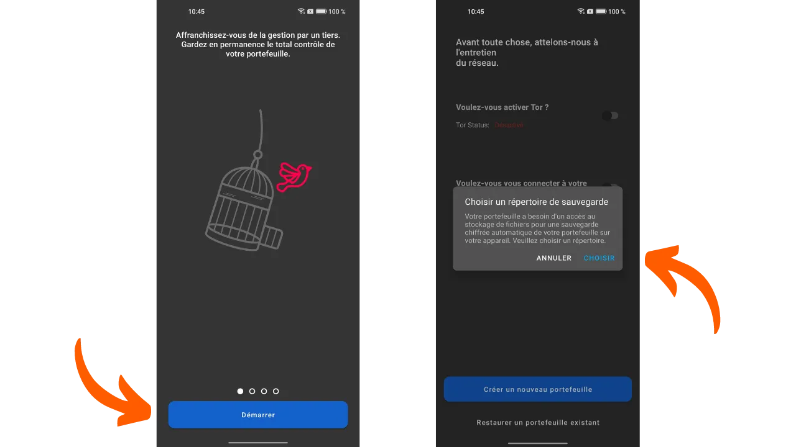
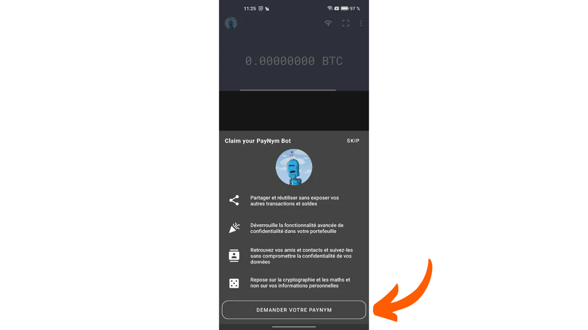
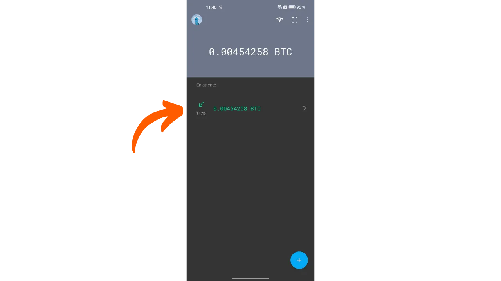
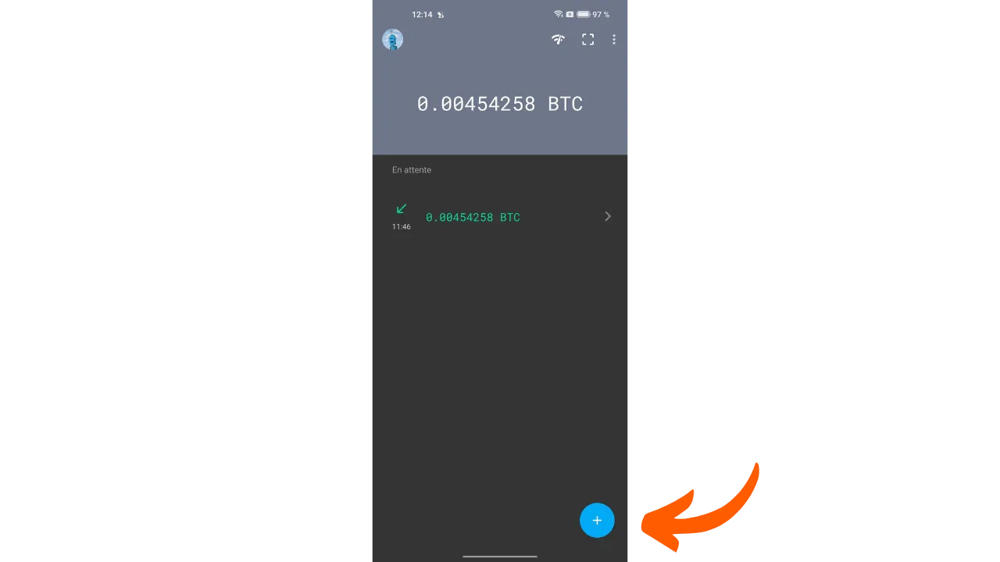
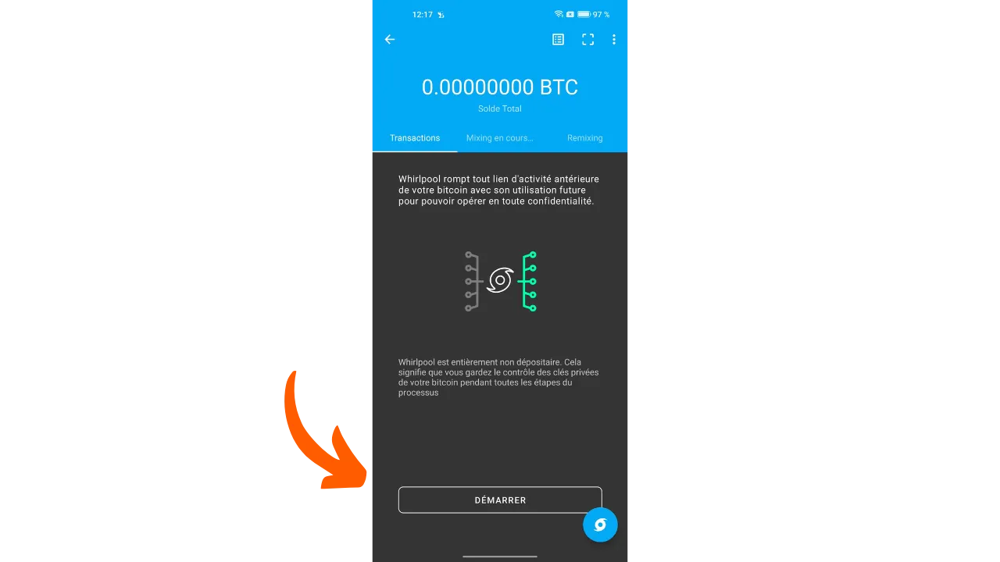
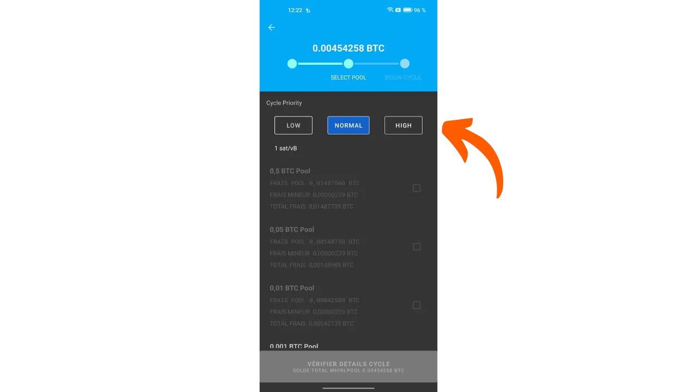
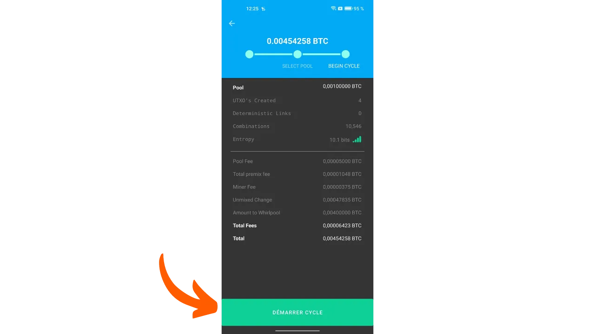
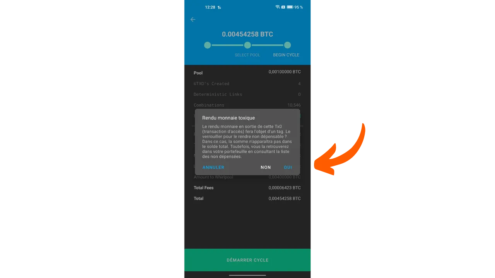
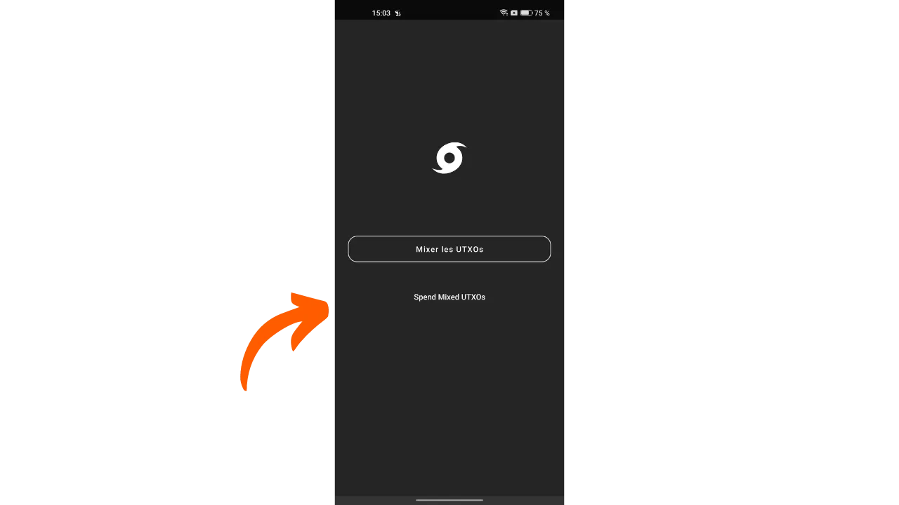

***ACHTUNG:** Nach der Verhaftung der Gründer von Samourai Wallet und der Beschlagnahme ihrer Server am 24. April funktioniert das Whirlpool-Tool nicht mehr, selbst für Personen, die über ihr eigenes Dojo verfügen oder Sparrow Wallet nutzen. Es bleibt jedoch möglich, dass dieses Tool in den kommenden Wochen wieder in Betrieb genommen oder auf eine andere Weise neu gestartet wird. Darüber hinaus bleibt der theoretische Teil dieses Artikels relevant, um die Prinzipien und Ziele von Coinjoins im Allgemeinen (nicht nur Whirlpool) zu verstehen sowie die Wirksamkeit des Whirlpool-Modells zu begreifen.*

_Wir verfolgen die Entwicklungen in diesem Fall sowie die Entwicklungen bezüglich der zugehörigen Tools genau. Seien Sie versichert, dass wir dieses Tutorial aktualisieren werden, sobald neue Informationen verfügbar sind._

_Dieses Tutorial wird nur zu Bildungs- und Informationszwecken bereitgestellt. Wir befürworten oder ermutigen die Verwendung dieser Tools zu kriminellen Zwecken nicht. Es liegt in der Verantwortung jedes Benutzers, die Gesetze in seiner Gerichtsbarkeit zu beachten._

---

"*ein Bitcoin-Wallet für die Straße*"

In diesem Tutorial erfahren Sie, was ein Coinjoin ist und wie Sie einen solchen mit der Software Samourai Wallet und der Whirlpool-Implementierung durchführen.

## Was ist ein Coinjoin bei Bitcoin?
**Coinjoin ist eine Technik, die die Nachverfolgbarkeit von Bitcoins in der Blockchain bricht**. Sie basiert auf einer kollaborativen Transaktion mit einer spezifischen Struktur gleichen Namens: der Coinjoin-Transaktion.

Coinjoins verbessern die Privatsphäre von Bitcoin-Nutzern, indem sie die Kettenanalyse für externe Beobachter erschweren. Ihre Struktur ermöglicht es, mehrere Münzen von verschiedenen Benutzern in einer einzigen Transaktion zusammenzuführen, wodurch die Spuren verwischt und es schwierig wird, die Verbindungen zwischen Eingabe- und Ausgabeadressen zu bestimmen.

Das Prinzip von Coinjoin basiert auf einem kollaborativen Ansatz: Mehrere Benutzer, die ihre Bitcoins mischen möchten, hinterlegen identische Beträge als Eingaben derselben Transaktion. Diese Beträge werden dann als Ausgaben gleichen Werts an jeden Benutzer umverteilt. Am Ende der Transaktion wird es unmöglich, eine bestimmte Ausgabe einem bekannten Benutzer in Eingabe zuzuordnen. Es besteht keine direkte Verbindung zwischen den Eingaben und Ausgaben, wodurch die Zuordnung zwischen Benutzern und ihren UTXO sowie die Geschichte jeder Münze gebrochen wird.


Beispiel für eine Coinjoin-Transaktion (nicht von mir): [323df21f0b0756f98336437aa3d2fb87e02b59f1946b714a7b09df04d429dec2](https://mempool.space/de/tx/323df21f0b0756f98336437aa3d2fb87e02b59f1946b714a7b09df04d429dec2)

Um einen Coinjoin durchzuführen, während sichergestellt wird, dass jeder Benutzer jederzeit die Kontrolle über seine Mittel behält, beginnt der Prozess mit dem Aufbau der Transaktion durch einen Koordinator, der sie dann an die Teilnehmer übermittelt. Jeder Benutzer signiert die Transaktion dann, nachdem er überprüft hat, dass sie ihm zusagt. Alle gesammelten Signaturen werden schließlich in die Transaktion integriert. Wenn ein Versuch zur Umleitung von Mitteln durch einen Benutzer oder den Koordinator gemacht wird, indem die Ausgaben der Coinjoin-Transaktion geändert werden, werden die Signaturen ungültig, was zur Ablehnung der Transaktion durch die Knoten führt.

Es gibt mehrere Implementierungen von Coinjoin, wie Whirlpool, JoinMarket oder Wabisabi, die jeweils darauf abzielen, die Koordination unter den Teilnehmern zu verwalten und die Effizienz von Coinjoin-Transaktionen zu erhöhen.
In diesem Tutorial werden wir uns mit der Implementierung von **Whirlpool** befassen, die ich für die effizienteste Lösung halte, um Coinjoins bei Bitcoin durchzuführen. Obwohl sie auf mehreren Wallets verfügbar ist, werden wir in diesem Tutorial ausschließlich ihre Verwendung mit der mobilen Anwendung Samourai Wallet, ohne Dojo, erkunden.

## Warum Coinjoins bei Bitcoin durchführen?
Eines der anfänglichen Probleme mit jedem Peer-to-Peer-Zahlungssystem ist das doppelte Ausgeben: Wie kann man verhindern, dass bösartige Individuen dieselben monetären Einheiten mehrmals ausgeben, ohne auf eine zentrale Autorität zur Schlichtung zurückgreifen zu müssen?

Satoshi Nakamoto bot eine Lösung für dieses Dilemma durch das Bitcoin-Protokoll, ein Peer-to-Peer-Elektronisches Zahlungssystem, das unabhängig von jeder zentralen Autorität funktioniert. In seinem Whitepaper hebt er hervor, dass der einzige Weg, das Fehlen von doppeltem Ausgeben zu zertifizieren, darin besteht, die Sichtbarkeit aller Transaktionen innerhalb des Zahlungssystems zu gewährleisten.
Um sicherzustellen, dass jeder Teilnehmer über die Transaktionen informiert ist, müssen diese öffentlich offengelegt werden. Daher basiert der Betrieb von Bitcoin auf einer transparenten und verteilten Infrastruktur, die es jedem Knotenbetreiber ermöglicht, die Gesamtheit der elektronischen Signaturketten und die Geschichte jeder Münze, von ihrer Erstellung durch einen Miner, zu überprüfen.

Die transparente und verteilte Natur der Bitcoin-Blockchain bedeutet, dass jeder Netzwerknutzer den Transaktionen aller anderen Teilnehmer folgen und analysieren kann. Infolgedessen ist Anonymität auf der Transaktionsebene unmöglich. Die Anonymität wird jedoch auf der Ebene der individuellen Identifikation bewahrt. Im Gegensatz zum traditionellen Bankensystem, bei dem jedes Konto mit einer persönlichen Identität verknüpft ist, sind bei Bitcoin die Mittel mit Paaren von kryptografischen Schlüsseln verbunden, was den Benutzern eine Form von Pseudonymität hinter kryptografischen Identifikatoren bietet.

Somit ist die Vertraulichkeit bei Bitcoin gefährdet, wenn externe Beobachter es schaffen, spezifische UTXOs mit identifizierten Benutzern zu verknüpfen. Sobald diese Verknüpfung hergestellt ist, wird es möglich, ihre Transaktionen nachzuverfolgen und die Geschichte ihrer Bitcoins zu analysieren. Coinjoin ist genau eine Technik, die entwickelt wurde, um die Nachverfolgbarkeit von UTXOs zu unterbrechen und so den Bitcoin-Benutzern eine gewisse Ebene der Vertraulichkeit auf der Transaktionsebene zu bieten.

## Wie funktioniert Whirlpool?
Whirlpool unterscheidet sich von anderen Coinjoin-Methoden durch die Verwendung von "_ZeroLink_" Transaktionen, die sicherstellen, dass technisch kein direkter Zusammenhang zwischen allen Eingängen und allen Ausgängen möglich ist. Diese perfekte Mischung wird durch eine Struktur erreicht, in der jeder Teilnehmer einen identischen Betrag als Eingabe beiträgt (außer den Mining-Gebühren), wodurch Ausgaben von perfekt gleichen Beträgen erzeugt werden.
Dieser restriktive Ansatz für Eingaben verleiht Whirlpool-Coinjoin-Transaktionen eine einzigartige Eigenschaft: die totale Abwesenheit von deterministischen Verbindungen zwischen Eingängen und Ausgängen. Mit anderen Worten, jede Ausgabe hat die gleiche Wahrscheinlichkeit, jedem Teilnehmer zugeschrieben zu werden, verglichen mit allen anderen Ausgaben in der Transaktion.
Ursprünglich war die Anzahl der Teilnehmer in jedem Whirlpool-Coinjoin auf 5 begrenzt, mit 2 neuen Einsteigern und 3 Remixern (wir werden diese Konzepte weiter unten erklären). Jedoch hat die Zunahme der On-Chain-Transaktionsgebühren im Jahr 2023 das Samourai-Team dazu veranlasst, ihr Modell zu überdenken, um die Privatsphäre zu verbessern und gleichzeitig die Kosten zu reduzieren. Somit kann der Koordinator unter Berücksichtigung der Marktsituation der Gebühren und der Anzahl der Teilnehmer nun Coinjoins mit 6, 7 oder 8 Teilnehmern organisieren. Diese erweiterten Sitzungen werden als "_Surge Cycles_" bezeichnet. Es ist wichtig zu beachten, dass unabhängig von der Konfiguration immer nur 2 neue Einsteiger in Whirlpool-Coinjoins sind.

Somit sind Whirlpool-Transaktionen durch eine identische Anzahl von Eingängen und Ausgängen gekennzeichnet, die sein können:
- 5 Eingänge und 5 Ausgänge;

- 6 Eingänge und 6 Ausgänge;

- 7 Eingänge und 7 Ausgänge;

- 8 Eingänge und 8 Ausgänge.

Das von Whirlpool vorgeschlagene Modell basiert somit auf kleinen Coinjoin-Transaktionen. Im Gegensatz zu Wasabi und JoinMarket, wo die Robustheit der Anonsets auf dem Volumen der Teilnehmer in einem einzigen Zyklus beruht, setzt Whirlpool auf die Verkettung mehrerer kleiner Zyklen.

In diesem Modell zahlen die Benutzer die Gebühren nur bei ihrem ersten Eintritt in einen Pool, was es ihnen ermöglicht, an einer Vielzahl von Remixes ohne zusätzliche Gebühren teilzunehmen. Es sind die neuen Einsteiger, die die Mining-Gebühren für die Remixer übernehmen.
Mit jedem zusätzlichen Coinjoin, an dem eine Münze teilnimmt, zusammen mit ihren in der Vergangenheit getroffenen Peers, werden die Anonsets exponentiell wachsen. Das Ziel ist daher, diese kostenlosen Remixe zu nutzen, die bei jedem Vorkommen dazu beitragen, die Dichte der Anonsets, die mit jeder gemischten Münze verbunden sind, zu stärken.
Whirlpool wurde unter Berücksichtigung zweier wichtiger Anforderungen entwickelt:
- Die Zugänglichkeit der Implementierung auf mobilen Geräten, da Samourai Wallet hauptsächlich eine Smartphone-Anwendung ist;
- Die Geschwindigkeit der Remix-Zyklen, um einen signifikanten Anstieg der Anonsets zu fördern.
Diese Imperative leiteten die Entwickler von Samourai Wallet bei der Gestaltung von Whirlpool an, was sie dazu veranlasste, die Anzahl der Teilnehmer pro Zyklus zu begrenzen. Zu wenige Teilnehmer hätten die Effizienz des Coinjoins beeinträchtigt, indem sie die pro Zyklus generierten Anonsets drastisch reduziert hätten, während zu viele Teilnehmer Managementprobleme auf mobilen Anwendungen verursacht hätten und den Fluss der Zyklen behindert hätten.
**Letztendlich ist es nicht notwendig, eine hohe Anzahl von Teilnehmern pro Coinjoin bei Whirlpool zu haben, da die Anonsets durch die Akkumulation mehrerer Coinjoin-Zyklen erreicht werden.**

[-> Erfahren Sie mehr über Whirlpool Anonsets.](https://planb.network/tutorials/privacy/wst-anonsets)

### Die Pools und Coinjoin-Gebühren
Damit diese mehrfachen Zyklen die Anonsets der gemischten Münzen effektiv erhöhen können, muss ein bestimmter Rahmen festgelegt werden, um die Beträge von UTXO zu beschränken. Whirlpool definiert daher verschiedene Pools.

Ein Pool stellt eine Gruppe von Benutzern dar, die zusammen mischen möchten und sich auf den Betrag von UTXO einigen, um den Coinjoin-Prozess zu optimieren. Jeder Pool gibt einen festen Betrag für das UTXO an, an den sich der Benutzer halten muss, um teilnehmen zu können. Um also Coinjoins mit Whirlpool durchzuführen, müssen Sie einen Pool auswählen. Die derzeit verfügbaren Pools sind wie folgt:
- 0,5 Bitcoins;
- 0,05 Bitcoin;
- 0,01 Bitcoin;
- 0,001 Bitcoin (= 100.000 Sats).

Indem Sie einem Pool mit Ihren Bitcoins beitreten, werden diese geteilt, um UTXOs zu generieren, die perfekt homogen mit denen der anderen Teilnehmer im Pool sind. Jeder Pool hat eine maximale Grenze; somit werden Sie für Beträge, die diese Grenze überschreiten, gezwungen entweder zwei separate Einträge innerhalb desselben Pools zu machen oder sich auf einen anderen Pool mit einem höheren Betrag zu orientieren:

| Pool (Bitcoin) | Maximalbetrag pro Eintrag (Bitcoin) |
|----------------|-------------------------------------|
| 0,5            | 35                                  |
| 0,05           | 3,5                                 |
| 0,01           | 0,7                                 |
| 0,001          | 0,025                               |

Wie zuvor erwähnt, wird ein UTXO als zu einem Pool gehörend betrachtet, wenn es bereit ist, in einen Coinjoin integriert zu werden. Dies bedeutet jedoch nicht, dass der Benutzer den Besitz davon verliert. **Durch die verschiedenen Mischzyklen behalten Sie die volle Kontrolle über Ihre Schlüssel und folglich Ihre Bitcoins.** Das unterscheidet die Coinjoin-Technik von anderen zentralisierten Mischtechniken.

Um in einen Coinjoin-Pool einzutreten, müssen Servicegebühren sowie Mining-Gebühren bezahlt werden. Die Servicegebühren sind für jeden Pool festgelegt und sollen die Teams entschädigen, die für die Entwicklung und Wartung von Whirlpool verantwortlich sind.
Servicegebühren für die Nutzung von Whirlpool sind nur einmal beim Eintritt in den Pool zu zahlen. Nach diesem Schritt haben Sie die Möglichkeit, an einer unbegrenzten Anzahl von Remixes ohne zusätzliche Gebühren teilzunehmen. Hier sind die aktuellen festen Gebühren für jeden Pool:

| Pool (bitcoin) | Eintrittsgebühr (Bitcoin) |
| -------------- | ------------------------- |
| 0,5            | 0,0175                    |
| 0,05           | 0,00175                   |
| 0,01           | 0,0005 (50 000 sats)      |
| 0,001          | 0,00005 (5 000 sats)      |


Diese Gebühren fungieren im Wesentlichen als Eintrittskarte für den gewählten Pool, unabhängig von der Menge, die Sie in Coinjoin einbringen. Ob Sie also dem 0,01 Pool mit genau 0,01 BTC beitreten oder ihn mit 0,5 BTC betreten, die Gebühren bleiben im absoluten Wert gleich.

Bevor man zu Coinjoins übergeht, hat der Benutzer somit die Wahl zwischen 2 Strategien:
- Sich für einen kleineren Pool entscheiden, um die Servicegebühren zu minimieren, wissend, dass sie mehrere kleine UTXOs als Rückgabe erhalten werden;
- Oder einen größeren Pool bevorzugen, wobei höhere Gebühren akzeptiert werden, um mit einer reduzierten Anzahl von UTXOs mit höherem Wert zu enden.

Es wird im Allgemeinen davon abgeraten, mehrere gemischte UTXOs nach den Coinjoin-Zyklen zusammenzuführen, da dies die erworbene Vertraulichkeit gefährden könnte, insbesondere aufgrund der Common-Input-Ownership Heuristic (CIOH). Daher könnte es klug sein, einen größeren Pool zu wählen, auch wenn dies bedeutet, mehr zu bezahlen, um nicht zu viele UTXOs mit kleinem Wert als Ausgabe zu haben. Der Benutzer muss diese Kompromisse abwägen, um den Pool zu wählen, den er bevorzugt.

Neben den Servicegebühren müssen auch die Mining-Gebühren, die jeder Bitcoin-Transaktion inhärent sind, berücksichtigt werden. Als Whirlpool-Benutzer müssen Sie die Mining-Gebühren für die Vorbereitungstransaktion (`Tx0`) sowie die für den ersten Coinjoin bezahlen. Alle nachfolgenden Remixes sind kostenlos, dank des Whirlpool-Modells, das auf den Zahlungen neuer Teilnehmer basiert.

Tatsächlich sind bei jedem Whirlpool-Coinjoin zwei Benutzer unter den Inputs Neuzugänge. Die anderen Inputs stammen von Remixern. Als Ergebnis werden die Mining-Gebühren für alle Teilnehmer an der Transaktion von diesen zwei neuen Teilnehmern gedeckt, die dann auch von kostenlosen Remixes profitieren werden:

Dank dieses Gebührensystems unterscheidet sich Whirlpool wirklich von anderen Coinjoin-Diensten, da die Anonsets der UTXOs nicht proportional zum vom Benutzer gezahlten Preis sind. Somit ist es möglich, erheblich hohe Anonymitätsniveaus zu erreichen, indem nur die Eintrittsgebühr des Pools und die Mining-Gebühren für zwei Transaktionen (die `Tx0` und der anfängliche Mix) bezahlt werden.
Es ist wichtig zu beachten, dass der Benutzer auch die Mining-Gebühren für die Abhebung ihrer UTXOs aus dem Pool nach Abschluss ihrer mehrfachen Coinjoins decken muss, es sei denn, sie haben die Option `mix to` gewählt, die wir im folgenden Tutorial besprechen werden.

### Die von Whirlpool verwendeten HD-Wallet-Konten
Um einen Coinjoin über Whirlpool durchzuführen, muss das Wallet mehrere unterschiedliche Konten generieren. Ein Konto, im Kontext eines HD (*Hierarchical Deterministic*) Wallets, stellt einen Abschnitt dar, der vollständig von den anderen isoliert ist, diese Trennung erfolgt auf der dritten Tiefenebene der Wallet-Hierarchie, das heißt, auf der Ebene des `xpub`.

Ein HD-Wallet kann theoretisch bis zu `2^(32/2)` verschiedene Konten ableiten. Das anfängliche Konto, das standardmäßig bei allen Bitcoin-Wallets verwendet wird, entspricht dem Index `0'`.

Für an Whirlpool angepasste Wallets, wie Samourai oder Sparrow, werden 4 Konten verwendet, um den Bedürfnissen des Coinjoin-Prozesses gerecht zu werden:
- Das **Einzahlungs**konto, identifiziert durch den Index `0'`;
- Das **Bad Bank**-Konto (oder "doxxic change"-Konto), identifiziert durch den Index `2 147 483 644`;
- Das **Premix**-Konto, identifiziert durch den Index `2 147 483 645`;
- Das **Postmix**-Konto, identifiziert durch den Index `2 147 483 646`.

Jedes dieser Konten erfüllt eine spezifische Funktion innerhalb des Coinjoin-Prozesses.

Alle diese Konten sind mit einem einzigen Seed verbunden, der es dem Benutzer ermöglicht, mit ihrer Wiederherstellungsphrase und, falls zutreffend, ihrer Passphrase, Zugang zu all ihren Bitcoins wiederherzustellen. Es ist jedoch notwendig, der Software während dieser Wiederherstellungsoperation die verschiedenen verwendeten Kontenindizes anzugeben.

Lassen Sie uns nun die verschiedenen Stufen eines Whirlpool-Coinjoins innerhalb dieser Konten betrachten.

### Die verschiedenen Stufen von Coinjoins auf Whirlpool
**Stufe 1: Die Tx0**
Der Ausgangspunkt eines jeden Whirlpool-Coinjoins ist das **Deposit**-Konto. Dieses Konto ist dasjenige, das Sie automatisch verwenden, wenn Sie eine neue Bitcoin-Wallet erstellen. Dieses Konto muss mit den Bitcoins aufgeladen werden, die man mischen möchte.
Die `Tx0` repräsentiert den ersten Schritt im Whirlpool-Mixing-Prozess. Ihr Ziel ist es, die UTXO vorzubereiten und zu vereinheitlichen für den Coinjoin, indem sie in Einheiten aufgeteilt werden, die dem Betrag des ausgewählten Pools entsprechen, um die Homogenität des Mixes zu gewährleisten. Die vereinheitlichten UTXO werden dann an das **Premix**-Konto gesendet. Was den Überschuss betrifft, der nicht in den Pool eingehen kann, wird er in ein spezifisches Konto abgetrennt: die **Bad Bank** (oder "doxxic change").
Diese anfängliche Transaktion `Tx0` dient auch dazu, die Servicegebühren an den Mix-Koordinator zu begleichen. Im Gegensatz zu den folgenden Schritten ist diese Transaktion nicht kollaborativ; der Benutzer muss daher alle Mining-Gebühren übernehmen:


In diesem Beispiel einer `Tx0`-Transaktion wird ein Input von `372,000 sats` aus unserem **Deposit**-Konto in mehrere Output-UTXO aufgeteilt, die wie folgt verteilt sind:
- Ein Betrag von `5,000 sats` für den Koordinator für Servicegebühren, entsprechend dem Eintritt in den Pool von `100,000 sats`;
- Drei UTXO, die für das Mischen vorbereitet sind, umgeleitet zu unserem **Premix**-Konto und beim Koordinator registriert. Diese UTXO werden auf `108,000 sats` je gleichgemacht, um die Mining-Gebühren für ihren zukünftigen ersten Mix zu decken;
- Der Überschuss, der nicht in den Pool eingehen kann, da er zu klein ist, wird als toxisches Wechselgeld betrachtet. Es wird auf sein spezifisches Konto gesendet. Hier beläuft sich dieses Wechselgeld auf `40,000 sats`;
- Schließlich gibt es `3,000 sats`, die keinen Output darstellen, sondern die Mining-Gebühren sind, die notwendig sind, um die `Tx0` zu bestätigen.

Zum Beispiel, hier ist eine echte Whirlpool Tx0 (nicht von mir): [edef60744f539483d868caff49d4848e5cc6e805d6cdc8d0f9bdbbaedcb5fc46](https://mempool.space/de/tx/edef60744f539483d868caff49d4848e5cc6e805d6cdc8d0f9bdbbaedcb5fc46)

**Stufe 2: Das doxxic change**
Das Überschussguthaben, das nicht in den Pool integriert werden konnte, hier gleichbedeutend mit `40,000 sats`, wird auf das **Bad Bank**-Konto umgeleitet, auch als "doxxic change" bezeichnet, um eine strikte Trennung von den anderen UTXO im Wallet zu gewährleisten.
Dieses UTXO ist gefährlich für die Privatsphäre des Benutzers, da es nicht nur noch an seine Vergangenheit gebunden ist und somit möglicherweise an die Identität seines Besitzers, sondern zusätzlich als zu einem Benutzer gehörend gekennzeichnet ist, der einen Coinjoin durchgeführt hat.
Wenn dieses UTXO mit gemischten Ausgaben zusammengeführt wird, verlieren sie alle Vertraulichkeit, die während der Coinjoin-Zyklen gewonnen wurde, insbesondere aufgrund der Common-Input-Ownership-Heuristic (CIOH). Wird es mit anderen doxxic changes zusammengeführt, riskiert der Benutzer den Verlust der Vertraulichkeit, da dies die verschiedenen Eingaben der Coinjoin-Zyklen verbinden wird. Daher muss es mit Vorsicht behandelt werden. Die Art und Weise, wie dieses toxische UTXO verwaltet wird, wird im letzten Teil dieses Artikels detailliert beschrieben, und zukünftige Tutorials werden diese Methoden auf dem PlanB Network noch ausführlicher behandeln.

**Schritt 3: Der Erste Mix**
Nachdem die `Tx0` abgeschlossen ist, werden die ausgeglichenen UTXOs auf das **Premix**-Konto unseres Wallets gesendet, bereit, in ihren ersten Coinjoin-Zyklus eingeführt zu werden, auch "initialer Mix" genannt. Wenn, wie in unserem Beispiel, die `Tx0` mehrere UTXOs zum Mischen erzeugt, wird jedes von ihnen in einen separaten initialen Coinjoin integriert.

Am Ende dieser ersten Mixe wird das **Premix**-Konto leer sein, während unsere Münzen, nachdem sie die Mining-Gebühren für diesen ersten Coinjoin bezahlt haben, genau auf den Betrag angepasst werden, der durch den gewählten Pool definiert ist. In unserem Beispiel werden unsere ursprünglichen UTXOs von `108 000 sats` genau auf `100 000 sats` reduziert sein.

**Schritt 4: Die Remixe**
Nach dem initialen Mix werden die UTXOs auf das **Postmix**-Konto übertragen. Dieses Konto sammelt die bereits gemischten UTXOs und diejenigen, die auf das Remixing warten. Wenn der Whirlpool-Client aktiv ist, sind die UTXOs im **Postmix**-Konto automatisch für das Remixing verfügbar und werden zufällig ausgewählt, um an diesen neuen Zyklen teilzunehmen.

Zur Erinnerung, die Remixe sind dann 100% kostenlos: Es fallen keine zusätzlichen Servicegebühren oder Mining-Gebühren an. Die UTXOs im **Postmix**-Konto zu behalten, erhält somit ihren Wert intakt und verbessert gleichzeitig ihre Anonsets. Deshalb ist es wichtig, diese Münzen an mehreren Coinjoin-Zyklen teilnehmen zu lassen. Es kostet Sie absolut nichts, und es erhöht ihre Anonymitätsstufen.

Wenn Sie entscheiden, gemischte UTXOs auszugeben, können Sie dies direkt von diesem **Postmix**-Konto aus tun. Es wird empfohlen, die gemischten UTXOs in diesem Konto zu behalten, um von kostenlosen Remixen zu profitieren und zu vermeiden, dass sie den Whirlpool-Kreislauf verlassen, was ihre Vertraulichkeit verringern könnte.

Wie wir im folgenden Tutorial sehen werden, gibt es auch die Option `mix to`, die die Möglichkeit bietet, Ihre gemischten Münzen automatisch nach einer definierten Anzahl von Coinjoins an ein anderes Wallet, wie z.B. ein Cold Wallet, zu senden.
Nachdem wir die Theorie abgedeckt haben, tauchen wir mit einem Tutorial zur Nutzung von Whirlpool über die Samourai Wallet Android-App in die Praxis ein!
## Tutorial: Coinjoin Whirlpool auf Samourai Wallet
Es gibt zahlreiche Optionen für die Nutzung von Whirlpool. Diejenige, die ich hier vorstellen möchte, ist die Option Samourai Wallet (ohne Dojo), eine Open-Source-Bitcoin-Wallet-Management-Anwendung auf Android.
Das Mischen auf Samourai ohne Dojo hat den Vorteil, dass es ziemlich einfach zu handhaben, schnell einzurichten ist und kein anderes Gerät als ein Android-Telefon und eine Internetverbindung benötigt wird. 
Allerdings hat diese Methode zwei bemerkenswerte Nachteile:
- Coinjoins finden nur statt, wenn Samourai im Hintergrund läuft und verbunden ist. Das bedeutet, dass Sie, wenn Sie Ihre Bitcoins 24/7 mischen und remixen möchten, Samourai ständig eingeschaltet halten müssen;
- Wenn Sie Whirlpool mit Samourai Wallet verwenden, ohne darauf zu achten, Ihr eigenes Dojo zu verbinden, dann muss Ihre Anwendung sich mit dem Server verbinden, der von den Samourai-Teams gewartet wird, und Sie werden den `xpub` Ihres Wallets an sie offenlegen. Diese anonymen Informationen sind notwendig, damit Ihre Anwendung Ihre Transaktionen finden kann.

Die ideale Lösung, um diese Einschränkungen zu überwinden, besteht darin, Ihr eigenes Dojo in Verbindung mit einer Whirlpool CLI-Instanz auf Ihrem persönlichen Bitcoin-Node zu betreiben. Auf diese Weise vermeiden Sie jeglichen Informationsverlust und erreichen vollständige Unabhängigkeit. Obwohl das unten präsentierte Tutorial für bestimmte Ziele oder für Anfänger nützlich ist, wird zur wahren Optimierung Ihrer Coinjoin-Sitzung die Verwendung Ihres eigenen Dojo empfohlen. Ein detaillierter Leitfaden zur Einrichtung dieser Konfiguration wird bald im PlanB Network verfügbar sein.

### Samourai Wallet installieren
Zu Beginn benötigen Sie natürlich die Samourai Wallet-App. Sie können sie direkt über die offizielle Website mit der APK, über ihr GitLab oder im Google Play Store herunterladen.

### Ein Software-Wallet erstellen
Nach der Installation der Software müssen Sie mit der Erstellung eines Bitcoin-Wallets auf Samourai fortfahren. Wenn Sie bereits eines haben, können Sie direkt zum nächsten Schritt übergehen.

Beim Öffnen der Anwendung drücken Sie den blauen `Start`-Knopf. Dann werden Sie aufgefordert, einen Speicherort in den Dateien Ihres Telefons auszuwählen, wo das verschlüsselte Backup Ihres neuen Wallets gespeichert wird.


Aktivieren Sie Tor, indem Sie auf den entsprechenden Schalter klicken. In diesem Stadium haben Sie auch die Möglichkeit, ein spezifisches Dojo auszuwählen. In diesem Tutorial werden wir jedoch mit dem Standard-Dojo fortfahren; Sie können die Option also deaktiviert lassen. Wenn Tor verbunden ist, drücken Sie den `Create a new wallet`-Knopf.


Samourai Wallet fordert Sie dann auf, eine BIP39-Passphrase festzulegen. Dieses zusätzliche Passwort ist sehr wichtig, da es direkt in die Ableitung Ihrer privaten Schlüssel einfließt. Ein potenzieller Verlust dieser Passphrase würde dazu führen, dass Sie keinen Zugang zu Ihren Bitcoins haben, was dazu führt, dass sie unwiederbringlich verloren gehen. Um Ihr Samourai-Wallet wiederherzustellen, ist es unerlässlich, sowohl Ihre 12-Wort-Wiederherstellungsphrase als auch die Passphrase zu haben.

Es ist daher wesentlich, eine robuste Passphrase zu wählen und eine oder mehrere physische Kopien, auf Papier oder auf einem metallischen Medium, anzufertigen, um die Sicherheit Ihrer Bitcoins zu gewährleisten. Nachdem Sie diese Aufgaben abgeschlossen haben, markieren Sie das Kästchen `I am aware that in case of loss...`, dann drücken Sie den `NEXT`-Knopf.


Danach müssen Sie einen PIN-Code festlegen, der aus 5 bis 8 Ziffern besteht. Dieser Code wird den Zugang zu Ihrem Wallet auf Ihrem Telefon sichern. Er wird jedes Mal angefordert, wenn Sie die Samourai-Anwendung öffnen möchten. Wählen Sie einen robusten PIN-Code und stellen Sie sicher, dass Sie eine Sicherungskopie anfertigen. Danach können Sie den `NEXT`-Knopf drücken.
Samourai wird Sie bitten, Ihren PIN-Code zur Bestätigung erneut einzugeben. Geben Sie ihn ein und drücken Sie `FINALIZE`.


Dann erhalten Sie Zugang zu Ihrer Wiederherstellungsphrase, die aus 12 Wörtern besteht. Diese Phrase ermöglicht es Ihnen, Ihr Wallet mit dem zuvor eingegebenen Passwort wiederherzustellen. Es wird dringend empfohlen, eine oder mehrere Kopien dieser Phrase auf physischen Medien, wie Papier oder einem metallischen Material, anzufertigen, um die Sicherheit Ihrer Bitcoins im Falle eines Problems zu gewährleisten.

Nachdem Sie diese Backups erstellt haben, werden Sie zur Oberfläche Ihres neuen Samourai-Wallets weitergeleitet.


Es wird Ihnen angeboten, Ihren PayNym Bot zu erhalten. Sie können ihn anfordern, wenn Sie möchten, obwohl er für unser Tutorial nicht wesentlich ist.


Bevor Sie fortfahren, um Bitcoins auf dieses neue Wallet zu erhalten, wird dringend empfohlen, die Gültigkeit Ihrer Wallet-Backups (das Passwort und die Wiederherstellungsphrase) erneut zu überprüfen. Um das Passwort zu überprüfen, können Sie das Symbol Ihres PayNym Bots oben links auf dem Bildschirm auswählen und dann folgenden Pfad verfolgen:
```bash
Einstellungen > Fehlerbehebung > Passwort/Backup-Test
```

Geben Sie Ihr Passwort ein, um die Überprüfung durchzuführen.


Samourai wird bestätigen, ob es gültig ist.


Um Ihr Backup der Wiederherstellungsphrase zu überprüfen, greifen Sie auf das Symbol Ihres PayNym Bots zu, das sich oben links auf dem Bildschirm befindet, und folgen Sie diesem Pfad:
```bash
Einstellungen > Wallet > 12-Wörter-Wiederherstellungsphrase anzeigen
```

Samourai wird ein Fenster mit Ihrer Wiederherstellungsphrase anzeigen. Stellen Sie sicher, dass sie genau mit Ihrem physischen Backup übereinstimmt.

Um weiterzugehen und einen vollständigen Wiederherstellungstest durchzuführen, notieren Sie sich ein Zeugenelement Ihres Wallets, wie eines der `xpubs`, und fahren Sie dann fort, Ihr Wallet zu löschen (vorausgesetzt, es ist noch leer). Das Ziel ist es, zu versuchen, dieses leere Wallet nur mit Ihren physischen Backups wiederherzustellen. Wenn die Wiederherstellung erfolgreich ist, zeigt dies an, dass Ihre Backups gültig und zuverlässig sind.

### Bitcoins empfangen
Nachdem Sie Ihr Wallet erstellt haben, beginnen Sie mit einem einzigen Konto, das mit dem Index `0'` identifiziert wird. Dies ist das **Einlagenkonto**, über das wir in den vorherigen Teilen gesprochen haben. Auf dieses Konto müssen Sie die Bitcoins übertragen, die für CoinJoins bestimmt sind.

Dazu klicken Sie auf das blaue `+`-Symbol unten rechts auf dem Bildschirm.


Klicken Sie dann auf den grünen `Empfangen`-Button.


Samourai wird automatisch eine neue leere Adresse generieren, um Bitcoins zu empfangen.


Dorthin können Sie die zu mischenden Bitcoins senden.



### Die Tx0 durchführen
Wenn die Transaktion bestätigt ist, können wir mit dem CoinJoins-Prozess beginnen. Dazu klicken Sie auf das blaue `+`-Symbol unten rechts auf dem Bildschirm.



Klicken Sie dann auf `Whirlpool` in Blau.


Warten Sie, während Whirlpool initialisiert wird und Samourai die notwendigen Konten erstellt.


Dann gelangen Sie zur Startseite von Whirlpool. Klicken Sie auf `Start`.

Wählen Sie das UTXO aus dem **Einzahlungs**konto aus, das Sie in Coinjoin-Zyklen senden möchten, und klicken Sie dann auf `Weiter`.


Im nächsten Schritt müssen Sie das Gebührenniveau für das `Tx0` sowie für Ihren ersten Mix festlegen. Diese Einstellung bestimmt die Geschwindigkeit, mit der Ihr `Tx0` und Ihr erster Coinjoin (oder die ersten Coinjoins) bestätigt werden. Beachten Sie, dass die Mining-Gebühren für das `Tx0` und den ersten Mix Ihre Verantwortung sind, aber Sie müssen keine Mining-Gebühren für die nachfolgenden Remixes zahlen. Sie haben die Wahl zwischen den Optionen `Niedrig`, `Normal` oder `Hoch`.



Im selben Fenster haben Sie die Möglichkeit, den Pool auszuwählen, in den Sie eintreten werden. Da ich ursprünglich ein UTXO von `454,258 sats` ausgewählt habe, ist meine einzige mögliche Wahl der `100,000 sats` Pool. Diese Seite präsentiert Ihnen auch die Servicegebühren des Pools, zusätzlich zu den Mining-Gebühren, was Ihnen erlaubt, die Gesamtkosten für diesen Coinjoin-Zyklus zu kennen. Wenn alles für Sie passt, wählen Sie den entsprechenden Pool aus und fahren Sie fort, indem Sie auf den blauen `ZYKLUSDETAILS ÜBERPRÜFEN`-Button klicken.


Dann können Sie alle Details Ihres Coinjoin-Zyklus sehen:
- die Anzahl der UTXOs, die in den Pool eintreten werden;
- die verschiedenen anfallenden Gebühren;
- die Menge des doxxischen Wechsels...

Überprüfen Sie die Informationen und klicken Sie dann auf den grünen `ZYKLUS STARTEN`-Button.



Ein Fenster wird erscheinen, um Ihnen anzubieten, den toxischen Wechsel, der aus Ihrem Eintritt in den Coinjoin-Zyklus resultiert, als "nicht ausgabefähig" zu markieren. Indem Sie `JA` auswählen, wird dieses UTXO in Ihrer Wallet nicht sichtbar sein und kann nicht für zukünftige Transaktionen ausgewählt werden. Es bleibt jedoch in der Liste der UTXOs in Ihrer Wallet zugänglich, wo Sie seinen Status manuell ändern können. Es wird empfohlen, diese Option zu wählen, um spätere Bedienungsfehler zu vermeiden, die Ihre Privatsphäre gefährden könnten. Wenn Sie `NEIN` wählen, bleibt der toxische Wechsel in Ihrer Wallet für die Verwendung verfügbar. Wenn Sie mehr über die Verwaltung und Verwendung dieses toxischen Wechsels erfahren möchten, rate ich Ihnen, den letzten Teil dieses Tutorials zu lesen.



Samourai wird dann Ihr Tx0 übertragen.


### Die Coinjoins durchführen
Sobald das Tx0 übertragen wurde, finden Sie es im `Transaktionen`-Tab des Whirlpool-Menüs.


Ihre UTXOs, die gemischt werden sollen, befinden sich im `Mixing in progress...`-Tab, der dem **Premix**-Konto entspricht.


Sobald das `Tx0` bestätigt ist, werden Ihre UTXOs automatisch beim Koordinator registriert, und die ersten Mixes beginnen automatisch nacheinander.


Indem Sie den Tab `Remixing` überprüfen, der dem **Postmix**-Konto entspricht, werden Sie die UTXOs beobachten können, die aus den anfänglichen Mixvorgängen resultieren. Diese Münzen bleiben bereit für nachfolgendes Remixing, was keine zusätzlichen Gebühren verursacht. Ich empfehle, diesen anderen Artikel zu konsultieren, um mehr über den Remixing-Prozess und die Effizienz eines Coinjoin-Zyklus zu erfahren: [REMIX - WHIRLPOOL](https://planb.network/tutorials/privacy/remix-whirlpool).


Es ist möglich, das Remixing eines UTXO vorübergehend zu unterbrechen, indem man den Pausenknopf rechts davon drückt. Um es wieder für das Remixing berechtigt zu machen, klicken Sie einfach ein zweites Mal auf denselben Knopf. Es ist wichtig zu beachten, dass pro Benutzer und pro Pool gleichzeitig nur ein Coinjoin durchgeführt werden kann. Wenn Sie also 6 UTXOs von `100 000 sats` bereit für den Coinjoin haben, kann nur einer davon gemischt werden. Nachdem ein UTXO gemischt wurde, wählt Samourai Wallet zufällig ein neues UTXO aus Ihrer Verfügbarkeit aus, um das Remixing jeder Münze zu diversifizieren und auszugleichen.


Um die kontinuierliche Verfügbarkeit Ihrer UTXOs für das Remixing zu gewährleisten, ist es notwendig, die Samourai-Anwendung im Hintergrund aktiv zu halten. Sie sollten eine Benachrichtigung auf Ihrem Telefon sehen, die bestätigt, dass Whirlpool läuft. Das Schließen der Anwendung oder das Ausschalten Ihres Telefons wird die Coinjoins pausieren.

### Die Coinjoins abschließen
Um Ihre gemischten Bitcoins auszugeben, gehen Sie zum **Postmix**-Konto, notiert als `Remixing` in den Whirlpool-Menü-Tabs.


Klicken Sie auf das blaue Whirlpool-Logo unten rechts.


Dann klicken Sie auf `Spend Mixed UTXOs`.



Sie können dann die Adresse des Empfängers und den zu sendenden Betrag eingeben, genauso wie bei jeder anderen Transaktion, die mit Samourai Wallet durchgeführt wird. Der blaue Hintergrund zeigt an, dass die Mittel von einem Whirlpool-Konto und nicht vom **Einlage**-Konto ausgegeben werden.


Durch Klicken auf die 3 kleinen Punkte oben rechts haben Sie die Möglichkeit, spezifische UTXOs auszuwählen.

Durch Klicken auf das weiße Quadrat oben rechts im Fenster können Sie den QR-Code der Empfangsadresse mit Ihrer Kamera scannen.


Geben Sie die notwendigen Informationen für Ihre Ausgabentransaktion ein, dann klicken Sie auf den blauen `TRANSAKTION VERIFIZIEREN`-Knopf.


Im nächsten Schritt haben Sie die Möglichkeit, die Gebührenrate, die mit Ihrer Transaktion verbunden ist, zu ändern. Sie können auch die Stonewall-Option aktivieren, indem Sie das entsprechende Kästchen ankreuzen. Wenn die Stonewall-Option nicht auswählbar ist, bedeutet dies, dass Ihr **Postmix**-Konto kein UTXO von ausreichender Größe enthält, um diese spezielle Transaktionsstruktur zu unterstützen.

[-> Mehr über Stonewall-Transaktionen erfahren.](https://planb.network/tutorials/privacy/stonewall)

Wenn alles zu Ihrer Zufriedenheit ist, klicken Sie auf den grünen `SENDEN ... BTC`-Knopf.


Samourai wird dann fortfahren, Ihre Transaktion zu signieren, bevor sie im Netzwerk übertragen wird. Sie müssen nur warten, bis sie von einem Miner zu einem Block hinzugefügt wird.
### Nutzung eines SCODE
Manchmal bieten die Teams von Samourai Wallet "SCODEs" an. Ein SCODE ist ein Werbecode, der einen Rabatt auf die Servicegebühren des Pools bietet. Samourai Wallet bietet solche Codes gelegentlich seinen Nutzern während besonderer Veranstaltungen an. Ich rate Ihnen, [Samourai Wallet in den sozialen Medien zu folgen](https://twitter.com/SamouraiWallet), um zukünftige SCODEs nicht zu verpassen.

Um einen SCODE bei Samourai anzuwenden, gehen Sie vor dem Start eines neuen Coinjoin-Zyklus zum Whirlpool-Menü und wählen die drei kleinen Punkte oben rechts auf dem Bildschirm.

Klicken Sie auf `SCODE (Promo-Code) Whirlpool`.

Geben Sie den SCODE in das sich öffnende Fenster ein und bestätigen Sie mit einem Klick auf `OK`.

Whirlpool wird automatisch geschlossen. Warten Sie, bis Samourai fertig geladen hat, und öffnen Sie dann erneut das Whirlpool-Menü.

Stellen Sie sicher, dass Ihr SCODE korrekt registriert wurde, indem Sie erneut auf die drei kleinen Punkte klicken und dann `SCODE (Promo-Code) Whirlpool` auswählen. Wenn alles in Ordnung ist, sind Sie bereit, einen neuen Whirlpool-Zyklus mit einem Rabatt auf die Servicegebühren zu starten. Es ist wichtig zu beachten, dass diese SCODEs zeitlich begrenzt sind: Sie bleiben einige Tage gültig, bevor sie veraltet sind.

## Wie kann man die Qualität unserer Coinjoin-Zyklen erkennen?
Damit ein Coinjoin wirklich effektiv ist, ist es wesentlich, dass er eine gute Uniformität zwischen den Beträgen von Eingängen und Ausgängen aufweist. Diese Uniformität verstärkt die Anzahl möglicher Interpretationen in den Augen eines externen Beobachters und erhöht damit die Unsicherheit, die die Transaktion umgibt. Um diese durch einen Coinjoin erzeugte Unsicherheit zu quantifizieren, kann man die Entropie der Transaktion berechnen. Für eine vertiefende Erkundung dieser Indikatoren verweise ich Sie auf das Tutorial: [BOLTZMANN CALCULATOR](https://planb.network/de/tutorials/privacy/boltzmann-entropy). Das Whirlpool-Modell wird als dasjenige anerkannt, das die meiste Homogenität zu Coinjoins beiträgt.

Als Nächstes wird die Leistung mehrerer Coinjoin-Zyklen basierend auf dem Umfang der Gruppen bewertet, in denen eine Münze versteckt ist. Die Größe dieser Gruppen definiert das, was man Anonsets nennt. Es gibt zwei Arten von Anonsets: Die erste bewertet die gegen eine retrospektive Analyse (von der Gegenwart in die Vergangenheit) erhaltene Privatsphäre und die zweite, gegen eine prospektive Analyse (von der Vergangenheit in die Gegenwart). Für eine detaillierte Erklärung dieser beiden Indikatoren lade ich Sie ein, das Tutorial zu konsultieren: [WHIRLPOOL STATS TOOLS - ANONSETS](https://planb.network/tutorials/privacy/wst-anonsets).

## Wie man Postmix verwaltet?
Nachdem Coinjoin-Zyklen durchgeführt wurden, ist die beste Strategie, Ihre UTXOs auf dem **Postmix**-Konto zu halten, in Erwartung ihrer zukünftigen Verwendung. Es ist sogar ratsam, sie unendlich remixen zu lassen, bis Sie sie ausgeben müssen.

Einige Benutzer könnten in Erwägung ziehen, ihre gemischten Bitcoins auf eine Wallet zu übertragen, die durch ein Hardware-Wallet gesichert ist. Dies ist möglich, aber es ist wichtig, den Empfehlungen von Samourai Wallet sorgfältig zu folgen, um die erworbene Vertraulichkeit nicht zu kompromittieren.
Das Zusammenführen von UTXOs stellt den am häufigsten gemachten Fehler dar. Es ist notwendig, gemischte UTXOs nicht mit ungemischten UTXOs in derselben Transaktion zu kombinieren, um die CIOH (*Common-Input-Ownership-Heuristic*) zu vermeiden. Dies erfordert eine sorgfältige Verwaltung Ihrer UTXOs in Ihrer Wallet, insbesondere in Bezug auf die Beschriftung. Abgesehen von Coinjoin ist das Zusammenführen von UTXOs im Allgemeinen eine schlechte Praxis, die oft zu einem Verlust der Vertraulichkeit führt, wenn sie nicht richtig gehandhabt wird. Sie sollten auch wachsam bei der Konsolidierung von gemischten UTXOs untereinander sein. Moderate Konsolidierungen sind möglich, wenn Ihre gemischten UTXOs signifikante Anonsets haben, aber dies wird unweigerlich die Privatsphäre Ihrer Coins verringern. Stellen Sie sicher, dass Konsolidierungen weder zu groß sind noch nach einer unzureichenden Anzahl von Remixes durchgeführt werden, da dies deduzierbare Verbindungen zwischen Ihren UTXOs vor und nach den Coinjoin-Zyklen herstellen könnte. Im Zweifelsfall über diese Operationen ist die beste Praxis, postmix UTXOs nicht zu konsolidieren und sie einzeln auf Ihr Hardware-Wallet zu übertragen, wobei jedes Mal eine neue leere Adresse generiert wird. Denken Sie erneut daran, jedes empfangene UTXO ordnungsgemäß zu beschriften.

Es wird auch davon abgeraten, Ihre postmix UTXOs an eine Wallet zu übertragen, die ungewöhnliche Skripte verwendet. Wenn Sie beispielsweise mit einem Multisig-Wallet, das `P2WSH`-Skripte verwendet, in Whirlpool eintreten, besteht kaum eine Chance, dass Sie mit anderen Benutzern gemischt werden, die ursprünglich denselben Wallet-Typ hatten. Wenn Sie Ihren Postmix zu diesemselben Multisig-Wallet verlassen, wird das Datenschutzniveau Ihrer gemischten Bitcoins stark verringert. Über Skripte hinaus gibt es viele andere Wallet-Fingerabdrücke, die Sie täuschen können.

Wie bei jeder Bitcoin-Transaktion ist es auch angebracht, Empfangsadressen nicht wiederzuverwenden. Jede neue Transaktion muss auf einer neuen leeren Adresse empfangen werden.

Die einfachste und sicherste Lösung besteht darin, Ihre gemischten UTXOs in ihrem **Postmix**-Konto ruhen zu lassen, sie remixen zu lassen und sie nur zum Ausgeben anzufassen. Samourai- und Sparrow-Wallets bieten zusätzlichen Schutz gegen all diese Risiken im Zusammenhang mit der Kettenanalyse. Diese Schutzmaßnahmen helfen Ihnen, Fehler zu vermeiden.

## Wie verwaltet man toxisches Wechselgeld?
Als Nächstes müssen Sie vorsichtig sein bei der Verwaltung von toxischem Wechselgeld, dem Wechselgeld, das nicht in den Coinjoin-Pool eintreten konnte. Diese toxischen UTXOs, die aus der Verwendung von Whirlpool resultieren, stellen ein Risiko für Ihre Privatsphäre dar, da sie eine Verbindung zwischen Ihnen und der Verwendung von Coinjoin herstellen. Es ist daher unerlässlich, sie mit Vorsicht zu behandeln und nicht mit anderen UTXOs, insbesondere gemischten UTXOs, zu kombinieren. Hier sind verschiedene Strategien für deren Verwendung zu berücksichtigen:
- **Mischen Sie sie in kleineren Pools:** Wenn Ihr toxisches UTXO groß genug ist, um allein in einen kleineren Pool einzutreten, erwägen Sie, es zu mischen. Dies ist oft die beste Option. Es ist jedoch entscheidend, mehrere toxische UTXOs nicht zu verschmelzen, um Zugang zu einem Pool zu erhalten, da dies Ihre verschiedenen Eingaben verknüpfen könnte.
- **Markieren Sie sie als "nicht ausgabefähig":** Ein anderer Ansatz besteht darin, sie nicht zu verwenden, sie in ihrem dedizierten Konto als "nicht ausgabefähig" zu markieren und einfach zu Hodln. Dies stellt sicher, dass Sie sie nicht versehentlich ausgeben. Wenn der Wert von Bitcoin steigt, könnten neue Pools, die besser zu Ihren toxischen UTXOs passen, entstehen;
- **Machen Sie Spenden:** Erwägen Sie, Spenden zu machen, auch bescheidene, an Entwickler, die an Bitcoin und seiner zugehörigen Software arbeiten. Sie können auch an Organisationen spenden, die BTC akzeptieren. Wenn die Verwaltung Ihrer toxischen UTXOs zu kompliziert erscheint, können Sie sie einfach loswerden, indem Sie eine Spende machen;
- **Geschenkkarten kaufen:** Plattformen wie [Bitrefill](https://www.bitrefill.com/) ermöglichen es Ihnen, Bitcoins gegen Geschenkkarten einzutauschen, die bei verschiedenen Händlern verwendet werden können. Dies kann eine Möglichkeit sein, Ihre toxischen UTXOs loszuwerden, ohne den damit verbundenen Wert zu verlieren;
- **Konsolidierung auf Monero:** Samourai Wallet bietet jetzt einen Atomic Swap-Service zwischen BTC und XMR an. Dies ist ideal, um toxische UTXOs durch Konsolidierung auf Monero zu verwalten, ohne Ihre Privatsphäre über KYC zu kompromittieren, bevor Sie sie zurück zu Bitcoin senden. Diese Option kann jedoch aufgrund von Mining-Gebühren und der Prämie aufgrund von Liquiditätsbeschränkungen kostspielig sein;
- **Senden an das Lightning-Netzwerk:** Diese UTXOs ins Lightning-Netzwerk zu übertragen, um von reduzierten Transaktionsgebühren zu profitieren, ist eine Option, die interessant sein kann. Diese Methode kann jedoch je nach Ihrer Nutzung von Lightning bestimmte Informationen offenlegen und sollte daher mit Vorsicht praktiziert werden.

Detaillierte Tutorials zur Implementierung dieser verschiedenen Techniken werden bald im PlanB Network angeboten.

**Zusätzliche Ressourcen:**
- [Samourai Wallet Video-Tutorial](https://planb.network/tutorials/wallet/samourai);
- [Samourai Wallet Dokumentation - Whirlpool](https://docs.samourai.io/whirlpool/basic-concepts);
- [Twitter-Thread über CoinJoins](https://twitter.com/SamouraiWallet/status/1489220847336308739);
- [Blogbeitrag über CoinJoins](https://www.pandul.fr/post/comprendre-et-utiliser-le-coinjoin-sur-bitcoin).
