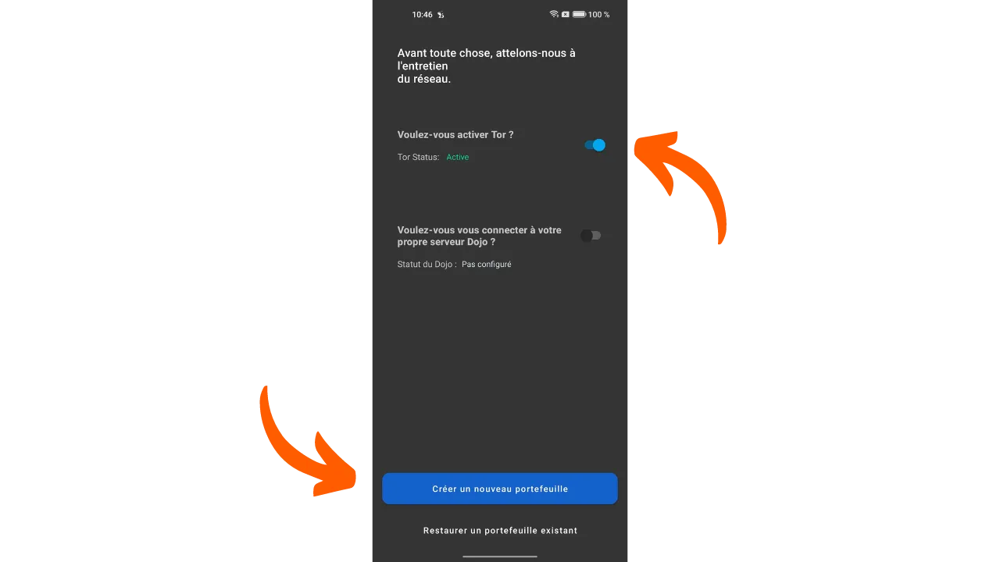
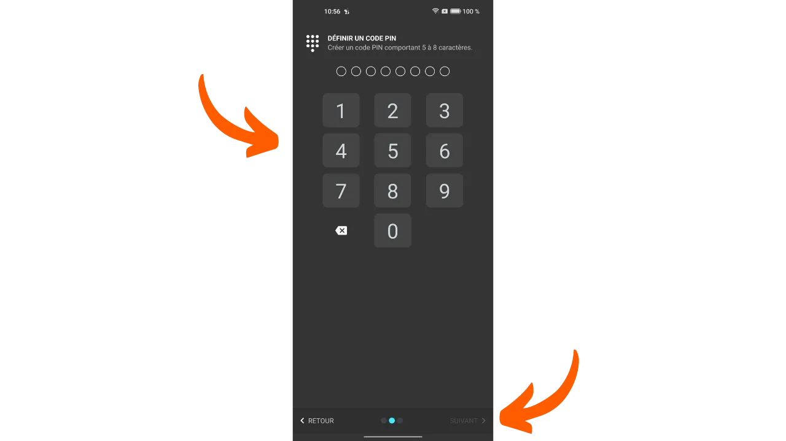
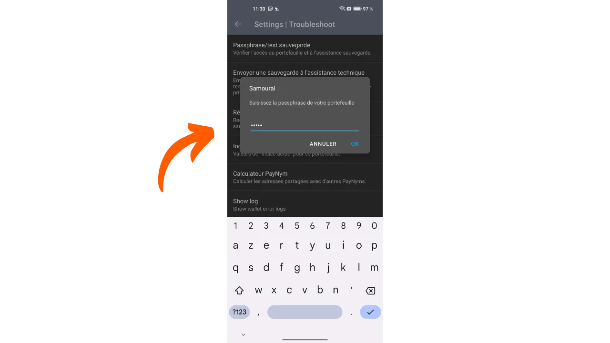
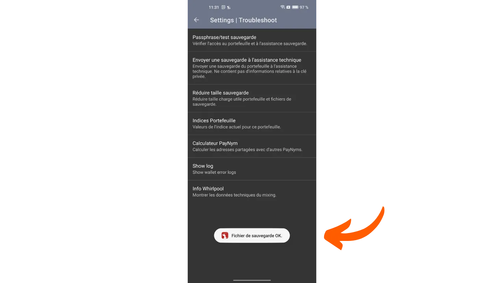
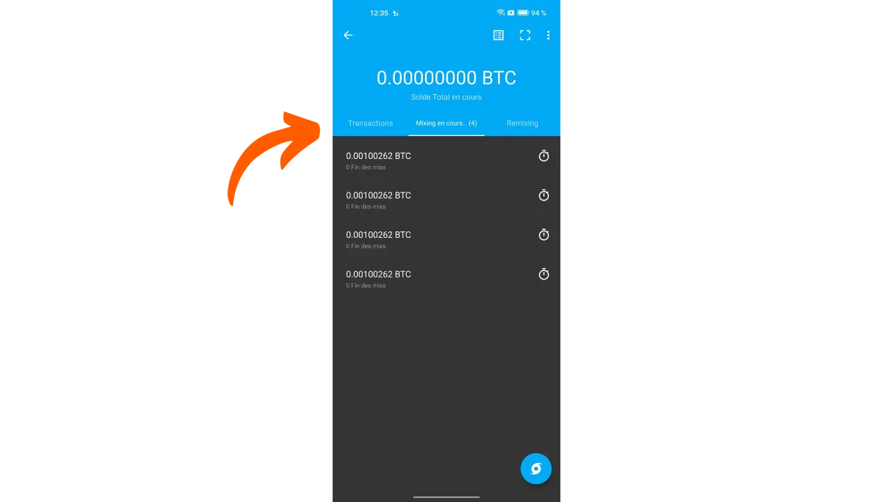
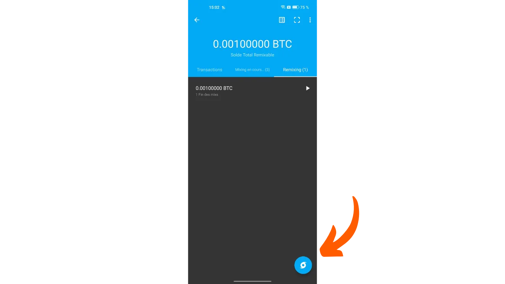
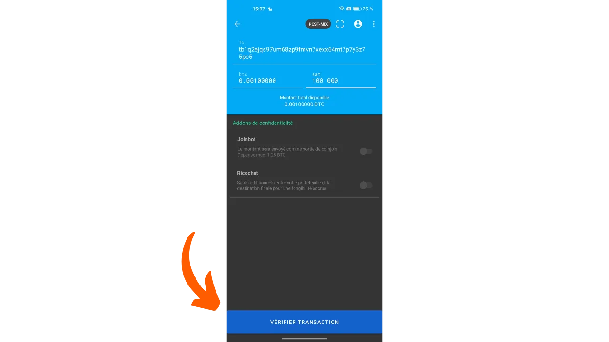
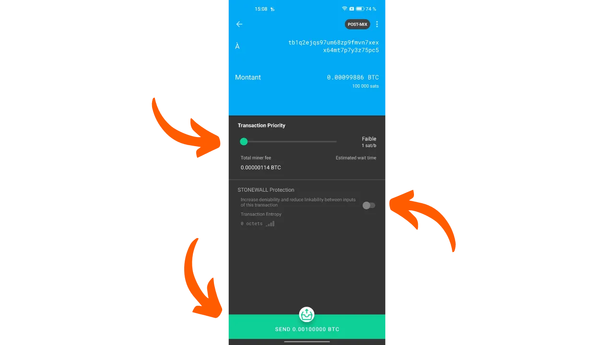
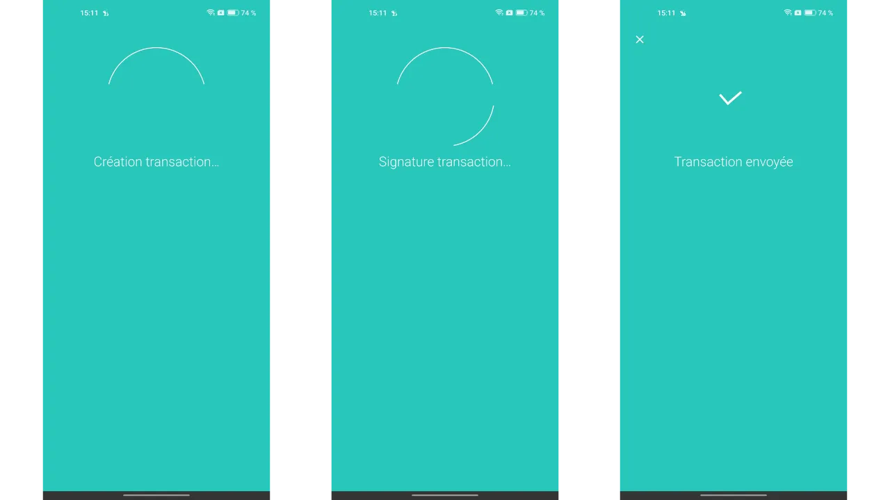
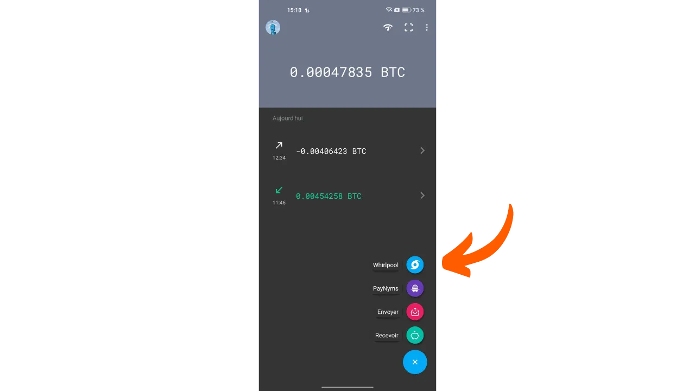

***ATTENTION :** Suite à l'arrestation des fondateurs de Samourai Wallet et à la saisie de leurs serveurs le 24 avril dernier, l'outil Whirlpool ne fonctionne plus, même pour les personnes qui disposent de leur propre Dojo ou qui sont sur Sparrow Wallet. Il reste cependant possible que cet outil soit remis en service dans les semaines à venir ou relancé d'une manière différente. Par ailleurs, la partie théorique de cet article reste pertinente pour appréhender les principes et les objectifs des coinjoins en général (pas seulement Whirlpool), ainsi que pour comprendre l'efficacité du modèle de Whirlpool.

_Nous suivons de près l'évolution de cette affaire ainsi que les développements concernant les outils associés. Soyez assuré que nous mettrons ce tutoriel à jour au fur et à mesure que de nouvelles informations seront disponibles._

_Ce tutoriel est fourni à des fins éducatives et informatives uniquement. Nous ne cautionnons ni n'encourageons l'utilisation de ces outils à des fins criminelles. Il est de la responsabilité de chaque utilisateur de respecter les lois en vigueur dans sa juridiction._

---

"*a bitcoin wallet for the streets*"

Dans ce tutoriel, vous allez apprendre ce qu'est un coinjoin et comment en réaliser avec le logiciel Samourai Wallet et l'implémentation Whirlpool.

## Qu'est-ce qu'un coinjoin sur Bitcoin ?
**Le coinjoin est une technique qui permet de casser le traçage des bitcoins sur la blockchain**. Il repose sur une transaction collaborative à la structure spécifique de même nom : la transaction coinjoin.

Les coinjoins renforcent la confidentialité des utilisateurs de Bitcoin en complexifiant l'analyse de chaîne pour les observateurs externes. Leur structure permet de fusionner plusieurs pièces de différents utilisateurs en une unique transaction, brouillant ainsi les pistes et rendant difficile la détermination des liens entre les adresses d'entrée et de sortie.

Le principe du coinjoin repose sur une approche collaborative : plusieurs utilisateurs qui souhaitent mélanger leurs bitcoins déposent des montants identiques en inputs d'une même transaction. Ces montants sont ensuite redistribués en outputs de valeur égale à chaque utilisateur. À l'issue de la transaction, il devient impossible d'associer un output spécifique à un utilisateur connu en entrée. Aucun lien direct n'existe entre les entrées et les sorties, ce qui vient rompre l'association entre les utilisateurs et leurs UTXO, de même que l'historique de chaque pièce.


Exemple d'une transaction coinjoin (qui ne provient pas de moi) : [323df21f0b0756f98336437aa3d2fb87e02b59f1946b714a7b09df04d429dec2](https://mempool.space/fr/tx/323df21f0b0756f98336437aa3d2fb87e02b59f1946b714a7b09df04d429dec2)

Afin de réaliser un coinjoin tout en garantissant que chaque utilisateur conserve le contrôle sur ses fonds à tout moment, le processus débute par la construction de la transaction par un coordinateur, qui la transmet ensuite aux participants. Chaque utilisateur procède alors à la signature de la transaction après avoir vérifié que celle-ci lui convient. Toutes les signatures collectées sont finalement intégrées à la transaction. Si une tentative de détournement des fonds est effectuée par un utilisateur ou le coordinateur, par le biais d'une modification des outputs de la transaction coinjoin, les signatures se révéleront invalides, ce qui conduira au rejet de la transaction par les nœuds.

Il existe plusieurs implémentations de coinjoin, telles que Whirlpool, JoinMarket ou Wabisabi, chacune ayant pour objectif de gérer la coordination entre les participants et d'accroître l'efficacité des transactions coinjoin.

Dans ce tutoriel, nous nous penchons sur l'implémentation **Whirlpool**, que je considère comme la solution la plus efficace pour faire des coinjoins sur Bitcoin. Bien que disponible sur plusieurs portefeuilles, nous explorons dans ce tutoriel exclusivement l'utilisation avec l'application mobile Samourai Wallet, sans Dojo.

## Pourquoi faire des coinjoins sur Bitcoin ?
Un des problèmes initiaux à tout système de paiement pair-à-pair est la double dépense : comment empêcher des individus mal intentionnés de dépenser à plusieurs reprises les mêmes unités monétaires sans faire appel à une autorité centrale pour arbitrer ?

Satoshi Nakamoto a apporté une solution à ce dilemme au travers du protocole Bitcoin, un système de paiement électronique pair-à-pair qui fonctionne indépendamment de toute autorité centrale. Dans son livre blanc, il souligne que la seule manière de certifier l'absence de double dépense est d'assurer la visibilité de toutes les transactions au sein du système de paiement.

Afin de garantir que chaque participant soit au courant des transactions, ces dernières doivent être publiquement divulguées. Le fonctionnement de Bitcoin repose donc sur une infrastructure transparente et distribuée, permettant à tout opérateur de nœud de vérifier l'intégralité des chaînes de signatures électroniques et l'historique de chaque pièce, depuis sa création par un mineur.

La nature transparente et distribuée de la blockchain de Bitcoin signifie que tout utilisateur du réseau peut suivre et analyser les transactions de tous les autres participants. En conséquence, l'anonymat au niveau des transactions est impossible. Cependant, l'anonymat est préservé au niveau de l'identification des individus. Contrairement au système bancaire classique où chaque compte est lié à une identité personnelle, sur Bitcoin, les fonds sont associés à des paires de clés cryptographiques, offrant ainsi aux utilisateurs une forme de pseudonymat derrière des identifiants cryptographiques.

Ainsi, la confidentialité sur Bitcoin est mise à mal lorsque des observateurs extérieurs parviennent à associer des UTXO spécifiques à des utilisateurs identifiés. Une fois cette association établie, il devient possible de tracer leurs transactions et d'analyser l'historique de leurs bitcoins. Le coinjoin est justement une technique développée pour casser la traçabilité des UTXO, offrant ainsi une certaine couche de confidentialité aux utilisateurs de Bitcoin au niveau des transactions.

## Comment fonctionne Whirlpool ?
Whirlpool se distingue des autres méthodes de coinjoin par l'utilisation de transactions "_ZeroLink_", qui assurent qu'il n'y a strictement aucun lien technique possible entre tous les inputs et tous les outputs. Ce mixage parfait est obtenu grâce à une structure où chaque participant contribue avec un montant identique en input (à l'exception des frais de minage), générant ainsi des outputs de montants parfaitement égaux.

Cette approche restrictive sur les inputs confère aux transactions coinjoin de Whirlpool une caractéristique unique : l'absence totale de liens déterministes entre les inputs et les outputs. Autrement dit, chaque output possède une probabilité égale d'être attribué à n'importe quel participant, par rapport à tous les autres outputs de la transaction.

Initialement, le nombre de participants à chaque coinjoin Whirlpool était limité à 5, avec 2 nouveaux entrants et 3 remixeurs (nous expliquerons ces concepts plus loin). Toutefois, l'augmentation des frais de transaction on-chain observée en 2023 a incité les équipes de Samourai à repenser leur modèle pour améliorer la confidentialité tout en réduisant les coûts. Ainsi, en tenant compte de la situation du marché des frais et du nombre de participants, le coordinateur peut désormais organiser des coinjoins incluant 6, 7 ou 8 participants. Ces sessions améliorées sont désignées sous le nom de "_Surge Cycles_". Il est important de noter que, quelle que soit la configuration, il y a toujours uniquement 2 nouveaux entrants dans les coinjoins Whirlpool.

Ainsi, les transactions Whirlpool se caractérisent par un nombre identique d'inputs et d'outputs, pouvant être de :
- 5 inputs et 5 outputs ;

- 6 inputs et 6 outputs ;

- 7 inputs et 7 outputs ;

- 8 inputs et 8 outputs.

Le modèle proposé par Whirlpool est ainsi basé sur de petites transactions coinjoin. À la différence de Wasabi et JoinMarket, où la robustesse des anonsets repose sur le volume de participants sur un cycle unique, Whirlpool mise sur l'enchaînement de plusieurs cycles de petite taille.

Dans ce modèle, l'utilisateur s'acquitte des frais uniquement lors de son entrée initiale dans une pool, lui permettant ensuite de participer à une multitude de remixages sans frais supplémentaires. Ce sont les nouveaux entrants qui prennent en charge les frais de minage pour les remixeurs.

À chaque coinjoin supplémentaire auquel participe une pièce, ainsi que ses pairs rencontrés par le passé, les anonsets vont croître exponentiellement. L'objectif est donc de profiter de ces remixages gratuits qui, à chaque occurrence, contribuent à renforcer la densité des anonsets associés à chaque pièce mixée.

Whirlpool a été conçu en prenant en compte deux exigences importantes :
- L'accessibilité de l'implémentation sur appareils mobiles, étant donné que Samourai Wallet est avant tout une application de smartphone ;
- La rapidité des cycles de remixage pour favoriser une augmentation significative des anonsets.

Ces impératifs ont guidé les choix des développeurs de Samourai Wallet dans la conception de Whirlpool, les amenant à restreindre les participants à un nombre limité par cycle. Un nombre trop restreint aurait compromis l'efficacité du coinjoin, réduisant drastiquement les anonsets générés à chaque cycle, tandis qu'un nombre trop important aurait posé des problèmes de gestion sur les applications mobiles et aurait entravé le flux de cycles.

**Finalement, nul besoin d'avoir un nombre élevé de participants par coinjoin sur Whirlpool puisque les anonsets se font sur l'accumulation de plusieurs cycles de coinjoins.**

[-> En savoir plus sur les anonsets Whirlpool.](https://planb.network/tutorials/privacy/wst-anonsets)

### Les pools et les frais de coinjoin
Pour que ces multiples cycles permettent bien de faire augmenter les anonsets des pièces mixées, il faut mettre un certain cadre afin de restreindre les montants des UTXO utilisés. Whirlpool définit ainsi différentes pools.

Une pool représente un ensemble d'utilisateurs souhaitant mixer ensemble, qui s'accorde sur le montant des UTXO à utiliser pour optimiser le processus de coinjoin. Chaque pool spécifie un montant fixe pour l'UTXO, auquel l'utilisateur doit se conformer pour y participer. Ainsi, pour faire des coinjoins avec Whirlpool, il vous faut sélectionner une pool. Les pools disponibles à l'heure actuelle sont les suivantes :
- 0,5 bitcoins ;
- 0,05 bitcoin ;
- 0,01 bitcoin ;
- 0,001 bitcoin (= 100 000 sats).

En intégrant une pool avec vos bitcoins, ceux-ci seront divisés afin de générer des UTXO parfaitement homogènes avec ceux des autres participants de la pool. Chaque pool possède une limite maximale ; ainsi, pour des montants excédant cette limite, vous serez contraint soit d'effectuer deux entrées distinctes au sein de la même pool, soit de vous orienter vers une autre pool de montant supérieur :

| Pool (bitcoin) | Montant maximum par entrée (bitcoin) |
|----------------|--------------------------------------|
| 0,5            | 35                                   |
| 0,05           | 3,5                                  |
| 0,01           | 0,7                                  |
| 0,001          | 0,025                                |

Comme mentionné précédemment, un UTXO est considéré comme appartenant à une pool lorsqu'il est prêt à être intégré dans un coinjoin. Cela ne signifie toutefois pas que l'utilisateur en perd la possession. **À travers les différents cycles de mixage, vous conservez intégralement le contrôle de vos clés et, par conséquent, de vos bitcoins.** C'est d'ailleurs ce qui différencie la technique du coinjoin des autres techniques de mixages centralisés.

Pour entrer dans une pool de coinjoin, il faut régler des frais de service ainsi que des frais de minage. Les frais de service sont fixes pour chaque pool et sont destinés à rémunérer les équipes en charge du développement et de la maintenance de Whirlpool. 

Les frais de service pour l'utilisation de Whirlpool sont à régler une unique fois à l'entrée dans la pool. Une fois cette étape franchie, vous avez la possibilité de participer à un nombre illimité de remixages sans frais supplémentaires. Voici les frais fixes actuellement appliqués pour chaque pool :

| Pool (bitcoin) | Frais d'entrée (bitcoin)        |
|----------------|---------------------------------|
| 0,5            | 0,0175                          |
| 0,05           | 0,00175                         |
| 0,01           | 0,0005 (50 000 sats)            |
| 0,001          | 0,00005 (5 000 sats)            |

Ces frais fonctionnent essentiellement comme un billet d'entrée pour la pool choisie, indépendamment de la somme que vous mettez en coinjoin. Ainsi, que vous intégriez la pool 0,01 avec exactement 0,01 BTC ou que vous y entriez avec 0,5 BTC, les frais demeureront identiques en valeur absolue.

Avant de procéder au coinjoins, l'utilisateur a donc le choix entre 2 stratégies : 
- Opter pour une pool plus petite afin de minimiser les frais de service, sachant qu'il obtiendra en retour plusieurs petits UTXO ;
- Ou bien privilégier une pool de plus grande taille, acceptant de régler des frais plus élevés pour finalement se retrouver avec un nombre réduit d'UTXO de plus grande valeur. 

Il est généralement déconseillé de fusionner plusieurs UTXO mixés après les cycles de coinjoins, car cela pourrait compromettre la confidentialité acquise, en particulier en raison de l'heuristique de possession commune des entrées (CIOH : *Common-Input-Ownership-Heuristic*). Par conséquent, il peut être judicieux de choisir une pool plus importante, même si cela implique de payer davantage, pour éviter d'avoir trop d'UTXO de petites valeurs en sortie. L'utilisateur doit évaluer ces compromis pour choisir la pool qu'il préfère.

Outre les frais de service, les frais de minage propres à toute transaction Bitcoin doivent également être pris en compte. En tant qu'utilisateur de Whirlpool, vous serez tenu de payer les frais de minage de la transaction de préparation (`Tx0`) ainsi que ceux du premier coinjoin. Tous les remixages ultérieurs seront gratuits, grâce au modèle de Whirlpool qui repose sur le paiement de nouveaux entrants.

En effet, dans chaque coinjoin Whirlpool, deux utilisateurs parmi les inputs sont des nouveaux entrants. Les autres inputs proviennent de remixeurs. De ce fait, les frais de minage pour l'ensemble des participants de la transaction sont pris en charge par ces deux nouveaux participants, qui pourront ensuite bénéficier eux aussi de remixages gratuits :

Grâce à ce système de frais, Whirlpool se différencie réellement des autres services de coinjoin puisque les anonsets des UTXO ne sont pas proportionnels au prix payé par l'utilisateur. Ainsi, il est possible d'atteindre des niveaux d'anonymat considérablement élevés en ne s'acquittant que des frais d'entrée de la pool et des frais de minage pour deux transactions (la `Tx0` et le mix initial).

Il est important de noter que l'utilisateur devra également prendre en charge les frais de minage pour retirer ses UTXO de la pool après avoir réalisé ses multiples coinjoins, sauf s'il a sélectionné l'option `mix to`, dont nous parlerons dans le tutoriel ci-dessous.

### Les comptes du portefeuille HD utilisés par Whirlpool
Pour réaliser un coinjoin via Whirlpool, le portefeuille doit générer plusieurs comptes distincts. Un compte, dans le contexte d'un portefeuille HD (*Hierarchical Deterministic*), constitue une section entièrement isolée des autres, cette séparation intervenant au niveau de la troisième profondeur de hiérarchie du portefeuille, c'est-à-dire au niveau des `xpub`.

Un portefeuille HD peut théoriquement dériver jusqu'à `2^(32/2)` comptes différents. Le compte initial, utilisé par défaut sur tous les portefeuilles Bitcoin, correspond à l'index `0'`.

Pour les portefeuilles adaptés à Whirlpool, tels que Samourai ou Sparrow, 4 comptes sont utilisés pour répondre aux besoins du processus de coinjoin :
- Le compte **dépôt**, identifié par l'index `0'` ;
- Le compte **bad bank** (ou doxxic change), identifié par l'index `2 147 483 644'` ;
- Le compte **premix**, identifié par l'index `2 147 483 645'` ;
- Le compte **postmix**, identifié par l'index `2 147 483 646'`.

Chacun de ces comptes remplit une fonction particulière dans le cadre du coinjoin.

Tous ces comptes sont liés à une unique graine (seed), ce qui permet à l'utilisateur de récupérer l'accès à l'ensemble de ses bitcoins en utilisant sa phrase de récupération et, le cas échéant, sa passphrase. Il est cependant nécessaire de préciser au logiciel, lors de cette opération de récupération, les différents index de comptes qui ont été utilisés.

Voyons maintenant les différentes étapes d'un coinjoin Whirlpool au sein de ces comptes.

### Les différentes étapes des coinjoins sur Whirlpool
**Étape 1 : La Tx0**
Le point de départ de tout coinjoin Whirlpool est le compte **dépôt**. Ce compte est celui que vous utilisez automatiquement lorsque vous créez un nouveau portefeuille Bitcoin. Ce compte devra être crédité des bitcoins que l'on souhaite mixer.

La `Tx0` représente la première étape du processus de mixage de Whirlpool. Elle vise à préparer et à égaliser les UTXO pour le coinjoin, en les divisant en unités correspondant au montant de la pool sélectionnée, afin d'assurer l'homogénéité du mixage. Les UTXO ainsi égalisés sont ensuite envoyés vers le compte **premix**. Quant à la différence ne pouvant pas entrer dans la pool, elle est séparée sur un compte spécifique : le **bad bank** (ou "doxxic change").

Cette transaction initiale `Tx0` sert aussi à régler les frais de service dus au coordinateur du mix. Contrairement aux étapes suivantes, cette transaction n'est pas collaborative ; l'utilisateur doit donc assumer l'intégralité des frais de minage :


Dans cet exemple d'une transaction `Tx0`, un input de `372 000 sats` issu de notre compte **dépôt** est divisé en plusieurs UTXO en sortie, qui se répartissent comme suit :
- Un montant de `5 000 sats` destiné au coordinateur pour les frais de service, correspondant à l'entrée dans la pool de `100 000 sats` ;
- Trois UTXO préparés pour le mixage, redirigés vers notre compte **premix** et enregistrés auprès du coordinateur. Ces UTXO sont égalisés à `108 000 sats` chacun, afin de couvrir les frais de minage pour leur futur mix initial ;
- Le surplus ne pouvant pas entrer dans la pool, car trop petit, est considéré comme change toxique. Il est envoyé vers son compte spécifique. Ici, ce change s'élève à `40 000 sats` ;
- Enfin, il reste `3 000 sats` qui ne constituent pas un output, mais qui sont les frais de minage nécessaires pour confirmer la `Tx0`.

Par exemple, voici une vraie Tx0 Whirlpool (qui ne provient pas de moi) : [edef60744f539483d868caff49d4848e5cc6e805d6cdc8d0f9bdbbaedcb5fc46](https://mempool.space/fr/tx/edef60744f539483d868caff49d4848e5cc6e805d6cdc8d0f9bdbbaedcb5fc46)

**Étape 2 : Le doxxic change**
Le surplus n'ayant pas pu intégrer la pool, ici équivalent à `40 000 sats`, est redirigé vers le compte **bad bank**, également désigné sous le terme de "doxxic change", pour en assurer une séparation stricte avec les autres UTXO du portefeuille.

Cet UTXO est dangereux pour la confidentialité de l'utilisateur, car non seulement il est toujours attaché à son passé, et donc éventuellement à l'identité de son propriétaire, mais en plus, il est noté comme appartenant à un utilisateur qui a fait un coinjoin.

Si cet UTXO est fusionné avec des outputs mixés, ces derniers perdront toute la confidentialité gagnée durant les cycles de coinjoins, notamment à cause de la CIOH (*Common-Input-Ownership-Heuristic*). S'il est fusionné avec d'autres doxxic changes, l'utilisateur risque de perdre en confidentialité puisque cela viendra faire un lien entre les différentes entrées des cycles de coinjoins. Il faut donc le traiter avec prudence. La manière de gérer cet UTXO toxique sera détaillée dans la dernière partie de cet article, et de futurs tutoriels aborderont ces méthodes plus en profondeur sur PlanB Network.

**Étape 3 : Le mix initial**
Après la réalisation de la `Tx0`, les UTXO égalisés sont envoyés sur le compte **premix** de notre portefeuille, prêts à être introduits dans leur premier cycle de coinjoin, également appelé "mix initial". Si, comme dans notre exemple, la `Tx0` génère plusieurs UTXO destinés au mixage, chacun d'entre eux sera intégré dans un coinjoin initial distinct.

Au terme de ces premiers mixes, le compte **premix** sera vide, tandis que nos pièces, ayant acquitté les frais de minage pour ce premier coinjoin, seront ajustées exactement au montant défini par la pool choisie. Dans notre exemple, nos UTXO initiaux de `108 000 sats` auront été réduits à exactement `100 000 sats`.

**Étape 4 : Les remix**
Après avoir fait le mix initial, les UTXO sont transférés dans le compte **postmix**. Ce compte rassemble les UTXO déjà mixés et ceux en attente de remixage. Lorsque le client Whirlpool est actif, les UTXO situés dans le compte **postmix** sont automatiquement disponibles pour des remixages et seront choisis de manière aléatoire pour participer à ces nouveaux cycles.

Pour rappel, les remixages sont ensuite à 100 % gratuits : aucuns frais de service additionnels ou frais de minage ne sont requis. Conserver les UTXO dans le compte **postmix** maintient donc leur valeur intacte, et améliore en même temps leurs anonsets. Voilà pourquoi il est important de permettre à ces pièces de participer à plusieurs cycles de coinjoins. Cela ne vous coûte strictement rien, et cela permet d'augmenter leurs niveaux d'anonymat.

Lorsque vous décidez de dépenser des UTXO mixés, vous pouvez le faire directement depuis ce compte **postmix**. Il est conseillé de garder les UTXO mixés dans ce compte pour bénéficier de remixages gratuits et pour éviter qu'ils ne quittent le circuit de Whirlpool, ce qui pourrait diminuer leur confidentialité.

Comme nous le verrons dans le tutoriel suivant, il y a également l'option `mix to` qui offre la possibilité d'envoyer automatiquement vos pièces mixées vers un autre portefeuille, tel qu'un cold wallet, après un nombre défini de coinjoins.

Après avoir abordé la théorie, plongeons dans la pratique avec un tutoriel sur l'utilisation de Whirlpool via l'application Android Samourai Wallet !

## Tutoriel : Coinjoin Whirlpool sur Samourai Wallet
Il existe de nombreuses options pour utiliser Whirlpool. Celle que je souhaite vous présenter ici est l'option Samourai Wallet (sans Dojo), une application open-source de gestion de portefeuille Bitcoin sur Android.

Mixer sur Samourai sans Dojo a pour avantage d'être assez facile à prendre en main, d'être rapide à mettre en place et de ne nécessiter aucun dispositif autre qu'un téléphone Android et une connexion internet. 

En revanche, cette méthode dispose de deux inconvénients notables : 
- Les coinjoins ne se feront que lorsque Samourai est lancé en arrière-plan et connecté. Ce qui veut dire que si vous souhaitez mixer et remixer vos bitcoins 24h/24, vous devrez constamment laisser Samourai allumé ;
- Si vous utilisez Whirlpool avec Samourai Wallet sans prendre soin de connecter votre propre Dojo, alors votre application va être obligée de se connecter au serveur maintenu par les équipes de Samourai, et vous leur révélerez les `xpub` de votre portefeuille. Ces informations anonymes sont nécessaires pour que votre application puisse trouver vos transactions.

La solution idéale pour pallier ces limitations consiste à opérer votre propre Dojo associé à une instance Whirlpool CLI sur votre nœud Bitcoin personnel. Ainsi, vous éviterez toute fuite d'information et atteindrez une indépendance complète. Bien que le tutoriel présenté ci-après soit utile pour certains objectifs ou pour les débutants, pour optimiser véritablement votre session de coinjoins, l'utilisation de votre propre Dojo est recommandée. Un guide détaillé sur la mise en place de cette configuration sera bientôt disponible sur PlanB Network.

### Installer Samourai Wallet
Pour commencer, vous allez évidemment avoir besoin de l'application Samourai Wallet. Vous pouvez la télécharger directement sur le site officiel avec l'APK, sur leur GitLab, ou bien sur le Google Play Store.

### Créer un portefeuille logiciel
Après l'installation du logiciel, vous devrez procéder à la création d'un portefeuille Bitcoin sur Samourai. Si vous en possédez déjà un, vous pouvez passer directement à l'étape suivante.

À l'ouverture de l'application, appuyez sur le bouton bleu `Démarrer`. Il vous sera ensuite demandé de sélectionner un emplacement dans les fichiers de votre téléphone où sera stockée la sauvegarde chiffrée de votre nouveau portefeuille.


Activez Tor en cliquant sur l'encoche correspondante. À cette étape, vous avez aussi l'option de sélectionner un Dojo spécifique. Cependant, dans ce tutoriel, nous allons continuer avec le Dojo par défaut ; vous pouvez donc laisser l'option désactivée. Lorsque Tor est connecté, appuyez sur le bouton `Créer un nouveau portefeuille`.



Samourai Wallet vous invite ensuite à définir une passphrase BIP39. Ce mot de passe additionnel est très important puisqu'il agit directement dans la dérivation de vos clés privées. Une éventuelle perte de cette passphrase entraînerait l'impossibilité d'accéder à vos bitcoins, les rendant irrémédiablement perdus. Pour restaurer votre portefeuille Samourai, il est impératif de disposer à la fois de votre phrase de récupération de 12 mots et de la passphrase.

Il est donc essentiel de choisir une passphrase robuste et d'en réaliser une ou plusieurs copies physiques, sur papier ou sur un support métallique, afin d'assurer la sécurité de vos bitcoins. Après avoir accompli ces tâches, cochez la case `Je suis conscient qu'en cas de perte...`, puis appuyez sur le bouton `SUIVANT`.


Vous devez ensuite définir un code PIN composé de 5 à 8 chiffres. Ce code servira à sécuriser l'accès à votre portefeuille sur votre téléphone. Il vous sera demandé chaque fois que vous voudrez ouvrir l'application Samourai. Optez pour un code PIN robuste et assurez-vous d'en garder une copie sauvegardée. Après cela, vous pouvez appuyer sur le bouton `SUIVANT`.



Samourai vous invitera à saisir de nouveau votre code PIN pour confirmation. Entrez-le, puis appuyez sur `FINALISER`.


Vous accéderez par la suite à votre phrase de récupération composée de 12 mots. Cette phrase permet de récupérer votre portefeuille avec la passphrase précédemment renseignée. Il est fortement recommandé de réaliser une ou plusieurs copies de cette phrase sur des supports physiques, tels que du papier ou un matériau métallique, afin d'assurer la sécurité de vos bitcoins en cas de problème.

Après avoir effectué ces sauvegardes, vous serez dirigé vers l'interface de votre nouveau portefeuille Samourai.


Il vous est proposé d'obtenir votre PayNym Bot. Vous pouvez le demander si vous le souhaitez, bien que cela ne soit pas essentiel pour notre tutoriel.


Avant de procéder à la réception de bitcoins sur ce nouveau portefeuille, il est fortement recommandé de vérifier de nouveau la validité des sauvegardes de votre portefeuille (la passphrase et la phrase de récupération). Pour vérifier la passphrase, vous pouvez sélectionner l'icône de votre PayNym Bot située en haut à gauche de l'écran, puis en suivre le chemin :
```plaintext
Paramètres > Dépannage > Passphrase/test sauvegarde 
```

Saisissez votre passphrase pour effectuer la vérification.



Samourai vous confirmera si celle-ci est valide.



Pour vérifier votre sauvegarde de la phrase de récupération, accédez à l'icône de votre PayNym Bot, située en haut à gauche de l'écran, et suivez ce chemin :
```plaintext
Paramètres > Portefeuille > Afficher la phrase de récupération de 12 mots
```

Samourai vous affichera une fenêtre avec votre phrase de récupération. Assurez-vous qu'elle coïncide précisément avec votre sauvegarde physique.

Pour aller plus loin et réaliser un test de récupération complet, notez un élément témoin de votre portefeuille, tel qu'une des `xpub`, puis procédez à la suppression de votre portefeuille (à condition qu'il soit encore vide). L'objectif est de tenter de restaurer ce portefeuille vide en utilisant uniquement vos sauvegardes physiques. Si la restauration est réussie, cela indique que vos sauvegardes sont valides et fiables.

### Recevoir des bitcoins
Après avoir créé votre portefeuille, vous commencerez avec un seul compte, identifié par l'index `0'`. Il s'agit du compte de **dépôt** dont nous avons parlé dans les parties précédentes. C’est vers ce compte que vous devrez transférer les bitcoins destinés aux coinjoins.

Pour ce faire, cliquez sur le symbole `+` bleu situé en bas à droite de l'écran.


Cliquez ensuite sur le bouton vert `Recevoir`.


Samourai générera automatiquement une nouvelle adresse vierge pour recevoir des bitcoins. 


Vous pouvez y envoyer les bitcoins à mixer.


### Faire la Tx0
Lorsque la transaction est confirmée, nous allons pouvoir lancer le processus de coinjoins. Pour ce faire, cliquez sur le bouton bleu `+` en bas à droite de l'écran.


Puis cliquez sur `Whirlpool` en bleu.


Patientez le temps que Whirlpool s'initialise et que Samourai crée les différents comptes nécessaires.


Vous arriverez ensuite sur la page d'accueil de Whirlpool. Cliquez sur `Démarrer`.


Choisissez les UTXO du compte **dépôt** que vous souhaitez envoyer en cycles de coinjoins, puis cliquez sur `Suivant`.


À l'étape suivante, il vous faudra choisir le niveau de frais à allouer à la `Tx0` ainsi qu'à votre premier mix. Ce paramètre déterminera la vitesse à laquelle votre `Tx0` et votre coinjoin initial (ou vos coinjoins initiaux) seront confirmés. Gardez à l'esprit que les frais de minage pour la `Tx0` et le mix initial sont à votre charge, mais que vous n'aurez pas à payer de frais de minage pour les remixages suivants. Vous avez le choix entre les options `Low`, `Normal` ou `High`.


Sur cette même fenêtre, vous avez la possibilité de choisir la pool dans laquelle vous allez entrer. Étant donné que j'ai initialement sélectionné un UTXO de `454 258 sats`, mon seul choix possible est la pool de `100 000 sats`. Cette page vous présente également les frais de service de la pool, en plus des frais de minage, ce qui vous permet de connaître le coût total pour ce cycle de coinjoins. Si tout vous convient, sélectionnez la pool appropriée et continuez en cliquant sur le bouton bleu `VÉRIFIER DÉTAILS CYCLE`.


Vous pouvez ensuite voir tous les détails de votre cycle de coinjoins : 
- le nombre d'UTXOs qui vont entrer dans la pool ;
- les différents frais engagés ;
- le montant du doxxic change...

Vérifiez les informations, puis cliquez sur le bouton vert `DÉMARRER CYCLE`.


Une fenêtre apparaîtra pour vous proposer de marquer le change toxique issu de votre entrée dans le cycle de coinjoin comme « non dépensable ». En sélectionnant `OUI`, cet UTXO ne sera pas visible dans votre portefeuille et ne pourra pas être sélectionné pour des transactions futures. Cependant, il restera accessible dans la liste des UTXO de votre portefeuille, où vous pourrez changer manuellement son statut. Il est recommandé d'opter pour cette option afin d'éviter toute erreur de manipulation qui pourrait compromettre votre confidentialité par la suite. Si vous choisissez `NON`, le change toxique demeurera disponible pour une utilisation dans votre portefeuille. Si vous souhaitez en savoir plus sur la gestion et l'utilisation de ce change toxique, je vous conseille de lire la dernière partie de ce tutoriel.


Samourai va ensuite diffuser votre Tx0.


### Faire les coinjoins
Une fois la Tx0 diffusée, vous pourrez la retrouver dans l'onglet `Transactions` du menu de Whirlpool.


Vos UTXO prêts à être mixés sont dans l'onglet `Mixing en cours...`, ce qui correspond au compte **Premix**.



Une fois la `Tx0` confirmée, vos UTXO seront automatiquement inscrits auprès du coordinateur et les mix initiaux débuteront successivement de manière automatique.


En consultant l'onglet `Remixing`, qui correspond au compte **Postmix**, vous observerez les UTXO résultant des mix initiaux. Ces pièces resteront prêtes pour des remixages ultérieurs, lesquels ne vous occasionneront aucuns frais supplémentaires. Je vous recommande de consulter cet autre article pour en savoir plus sur le processus de remixage et l'efficacité d'un cycle de coinjoins : [REMIX - WHIRLPOOL](https://planb.network/tutorials/privacy/remix-whirlpool). 


Il est possible de suspendre temporairement le remixage d'un UTXO en appuyant sur le bouton pause situé à sa droite. Pour le rendre de nouveau éligible aux remixages, il suffit de cliquer une seconde fois sur ce même bouton. Il est important de noter que seul un coinjoin peut être effectué par utilisateur et par pool simultanément. Ainsi, si vous avez 6 UTXO de `100 000 sats` prêts pour le coinjoin, seulement l'un d'entre eux pourra être mixé. Après le mixage d'un UTXO, Samourai Wallet procède à une sélection aléatoire d'un nouvel UTXO parmi vos disponibilités, afin de diversifier et d'équilibrer les remixages de chaque pièce.


Pour garantir une disponibilité continue de vos UTXO aux fins de remixage, il est nécessaire de maintenir l'application Samourai active en tâche de fond. Vous devriez voir une notification sur votre téléphone qui vous confirme que Whirlpool est en cours d'exécution. Fermer l'application ou éteindre votre téléphone mettra les coinjoins en pause. 

### Terminer les coinjoins
Pour dépenser vos bitcoins mixés, placez-vous sur le compte **Postmix** noté `Remixing` dans les onglets du menu Whirlpool.


Cliquez sur le logo bleu de Whirlpool situé en bas à droite.



Puis cliquez sur `Spend Mixed UTXOs`.


Vous pouvez ensuite entrer l'adresse du destinataire ainsi que le montant à envoyer, de la même manière que pour toute autre transaction réalisée avec Samourai Wallet. Le fond d'écran bleu vous signale que les fonds sont dépensés à partir d'un compte Whirlpool, et non du compte de **dépôt**.


En cliquant sur les 3 petits points en haut à droite, vous avez la possibilité de sélectionner des UTXO spécifiques.


En cliquant sur le carré blanc en haut à droite de la fenêtre, vous pouvez scanner le code QR de l'adresse de réception avec votre appareil photo.


Entrez les informations nécessaires pour votre transaction de dépense, puis cliquez sur le bouton bleu `VÉRIFIER TRANSACTION`.



À l'étape suivante, vous avez la possibilité de modifier le taux de frais associé à votre transaction. Vous pouvez aussi activer l'option Stonewall en cochant la case correspondante. Si l'option Stonewall n'est pas sélectionnable, cela signifie que votre compte **Postmix** ne contient pas d'UTXO de taille suffisante pour supporter cette structure particulière de transaction.

[-> En savoir plus sur les transactions Stonewall.](https://planb.network/tutorials/privacy/stonewall)

Si tout vous convient, cliquez sur le bouton vert `SEND ... BTC`.



Samourai procédera alors à la signature de votre transaction avant de la diffuser sur le réseau. Il vous suffit de patienter jusqu'à ce qu'elle soit ajoutée dans un bloc par un mineur.



### Utiliser un SCODE
Parfois, les équipes de Samourai Wallet proposent des "SCODE". Un SCODE est un code promotionnel permettant de bénéficier d'une réduction sur les frais de service de la pool. Samourai Wallet offre occasionnellement de tels codes à ses utilisateurs lors d'événements spéciaux. Je vous conseille [de suivre Samourai Wallet](https://twitter.com/SamouraiWallet) sur les réseaux sociaux pour ne pas passer à côté des futurs SCODES.

Pour appliquer un SCODE sur Samourai, avant de lancer un nouveau cycle de coinjoin, rendez-vous dans le menu Whirlpool et sélectionnez les trois petits points situés en haut à droite de l'écran.


Cliquez sur `SCODE (code promo) Whirlpool`.


Entrez le SCODE dans la fenêtre qui s'est ouverte, puis validez en cliquant sur `OK`.


Whirlpool va se fermer automatiquement. Attendez que Samourai finisse de charger, puis ouvrez de nouveau le menu de Whirlpool.



Assurez-vous que votre SCODE a été correctement enregistré en cliquant une fois de plus sur les trois petits points, puis en sélectionnant `SCODE (code promo) Whirlpool`. Si tout est en ordre, vous êtes prêt à entamer un nouveau cycle Whirlpool en bénéficiant d'une réduction sur les frais de service. Il est important de noter que ces SCODE sont temporaires : ils restent valides pendant quelques jours avant de devenir obsolètes.

## Comment connaître la qualité de nos cycles de coinjoin ?
Pour qu'un coinjoin soit véritablement efficace, il est essentiel qu'il présente une bonne homogénéité entre les montants des inputs et des outputs. Cette uniformité amplifie le nombre d'interprétations possibles aux yeux d'un observateur externe, augmentant ainsi l'incertitude autour de la transaction. Pour quantifier cette incertitude générée par un coinjoin, on peut recourir au calcul de l'entropie de la transaction. Pour une exploration approfondie de ces indicateurs, je vous renvoie vers le tutoriel : [BOLTZMANN CALCULATOR](https://planb.network/fr/tutorials/privacy/boltzmann-entropy). Le modèle de Whirlpool est reconnu comme celui qui apporte le plus d'homogénéité dans les coinjoins.

Ensuite, la performance de plusieurs cycles de coinjoin est évaluée selon l'ampleur des groupes dans lesquels une pièce est dissimulée. La dimension de ces groupes définit ce qu'on nomme les anonsets. Il existe deux types d'anonsets : le premier évalue la confidentialité obtenue contre une analyse rétrospective (du présent vers le passé) et le second, contre une analyse prospective (du passé vers le présent). Pour une explication détaillée de ces deux indicateurs, je vous invite à consulter le tutoriel : [WHIRLPOOL STATS TOOLS - ANONSETS](https://planb.network/tutorials/privacy/wst-anonsets).

## Comment gérer le postmix ?
Après avoir effectué des cycles de coinjoins, la meilleure stratégie consiste à garder vos UTXO dans le compte **postmix**, en attente de leur utilisation future. Il est même conseillé de les laisser se remixer indéfiniment jusqu'à ce que vous ayez besoin de les dépenser.

Certains utilisateurs pourraient envisager de transférer leurs bitcoins mixés vers un portefeuille sécurisé par un hardware wallet. Cela est possible, mais il est important de suivre scrupuleusement les recommandations de Samourai Wallet pour ne pas compromettre la confidentialité acquise.

La fusion d'UTXO constitue l'erreur la plus fréquemment commise. Il faut éviter de combiner dans une même transaction des UTXO mixés avec des UTXO non mixés, afin d'éviter la CIOH (*Common-Input-Ownership-Heuristic*). Cela nécessite une gestion minutieuse de vos UTXO au sein de votre portefeuille, notamment au niveau de l'étiquetage. Au-delà du coinjoin, la fusion d'UTXO est une mauvaise pratique en général qui mène souvent à une perte de confidentialité lorsqu'elle n'est pas maîtrisée.

Il faut également être vigilant sur la consolidation d'UTXO mixés entre eux. Des consolidations modérées sont envisageables si vos UTXO mixés disposent d'anonsets significatifs, mais cela viendra forcément diminuer la confidentialité de vos pièces. Veillez à ce que les consolidations ne soient ni trop importantes, ni réalisées après un nombre insuffisant de remixages, au risque d'établir des liens déductibles entre vos UTXO avant et après les cycles de coinjoins. En cas de doute sur ces manipulations, la meilleure pratique est de ne pas consolider les UTXO postmix, et de les transférer un à un vers votre hardware wallet, en générant à chaque fois une nouvelle adresse vierge. Encore une fois, pensez à bien étiqueter chaque UTXO reçu.

Il est également déconseillé de transférer vos UTXO postmix vers un portefeuille utilisant des scripts peu répandus. Par exemple, si vous entrez sur Whirlpool depuis un portefeuille multisig utilisant des scripts `P2WSH`, il y a peu de chance que vous soyez mélangés avec d'autres utilisateurs ayant le même type de portefeuille à l'origine. Si vous ressortez vos postmix vers ce même portefeuille multisig, le niveau de confidentialité de vos bitcoins mixés sera fortement diminué. Au-delà des scripts, il existe de nombreuses autres empreintes de portefeuille qui peuvent vous jouer des tours.

Comme pour toute transaction Bitcoin, il convient également de ne pas réutiliser les adresses de réception. Chaque nouvelle transaction doit être reçue sur une nouvelle adresse vierge.

La solution la plus simple et la plus sûre consiste à laisser vos UTXO mixés au repos dans leur compte **postmix**, en les laissant se remixer et en ne les touchant que pour les dépenser. Les portefeuilles Samourai et Sparrow disposent de protections supplémentaires contre tous ces risques liés à l'analyse de chaîne. Ces protections vous permettent d'éviter de faire des erreurs.

## Comment gérer le doxxic change ?
Ensuite, il faudra être prudent sur sa gestion du doxxic change, le change qui n'a pas pu entrer dans la pool de coinjoin. Ces UTXO toxiques, issus de l'utilisation de Whirlpool, constituent un risque pour votre vie privée puisqu'ils établissent un lien entre vous et l'utilisation du coinjoin. Il est donc impératif de les gérer avec prudence et de ne pas les combiner avec d'autres UTXO, surtout des UTXO mixés. Voici différentes stratégies à envisager pour les utiliser :
- **Mixez-les dans des pools plus petites :** Si votre UTXO toxique est suffisamment important pour entrer seul dans une pool de taille inférieure, envisagez de le mixer. C'est souvent la meilleure option. Cependant, il est crucial de ne pas fusionner plusieurs UTXO toxiques pour accéder à une pool, car cela pourrait relier vos différentes entrées ;
- **Marquez-les comme "non dépensables" :** Une autre approche consiste à ne plus les utiliser, à les marquer comme "non dépensables" dans leur compte dédié, et à juste Hodl. Cela vous assure ainsi de ne pas les dépenser accidentellement. Si la valeur du bitcoin augmente, de nouvelles pools plus adaptées à vos UTXO toxiques pourraient voir le jour ;
- **Faites des donations :** Pensez à faire des dons, même modestes, aux développeurs œuvrant sur Bitcoin et ses logiciels associés. Vous pouvez aussi donner à des associations acceptant le BTC. Si la gestion de vos UTXO toxiques vous semble trop compliquée, vous pouvez simplement vous en débarrasser en profitant pour en faire une donation ;
- **Achetez des cartes-cadeaux :** Des plateformes telles que [Bitrefill](https://www.bitrefill.com/) vous permettent d'échanger des bitcoins contre des cartes cadeaux utilisables chez divers commerçants. Cela peut être une manière de vous séparer de vos UTXO toxiques sans perdre la valeur associée ;
- **Consolidez-les sur Monero :** Samourai Wallet offre désormais un service de swap atomique entre BTC et XMR. C'est idéal pour gérer les UTXO toxiques en les consolidant sur Monero, sans compromettre votre confidentialité via la CIOH, avant de les renvoyer sur Bitcoin. Cette option peut toutefois s'avérer coûteuse en termes de frais de minage et de premium dû aux contraintes de liquidité ;
- **Envoyez-les sur le Lightning Network :** Transférer ces UTXO sur le Lightning Network pour bénéficier de frais de transaction réduits est une option qui peut être intéressante. Cependant, cette méthode peut révéler certaines informations selon votre utilisation de Lightning et doit donc être pratiquée avec prudence.

Des tutoriels détaillés sur la mise en œuvre de ces différentes techniques vous seront proposés prochainement sur PlanB Network.

**Ressources supplémentaires :** 
- [Tutoriel vidéo Samourai Wallet](https://planb.network/tutorials/wallet/samourai) ;
- [Documentation Samourai Wallet - Whirlpool](https://docs.samourai.io/whirlpool/basic-concepts) ;
- [Thread Twitter sur les coinjoins](https://twitter.com/SamouraiWallet/status/1489220847336308739) ;
- [Article de blog sur les coinjoins](https://www.pandul.fr/post/comprendre-et-utiliser-le-coinjoin-sur-bitcoin).