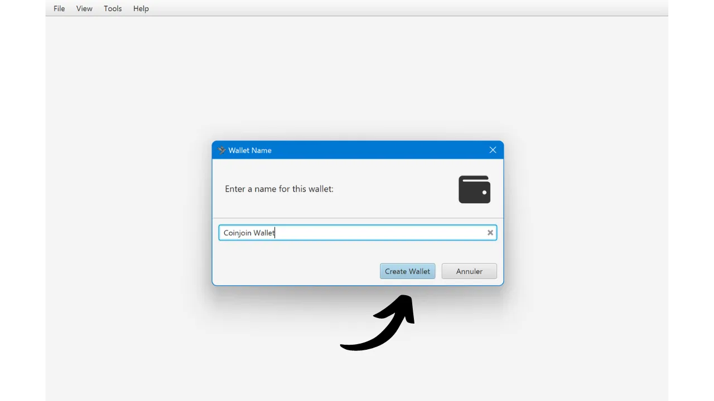
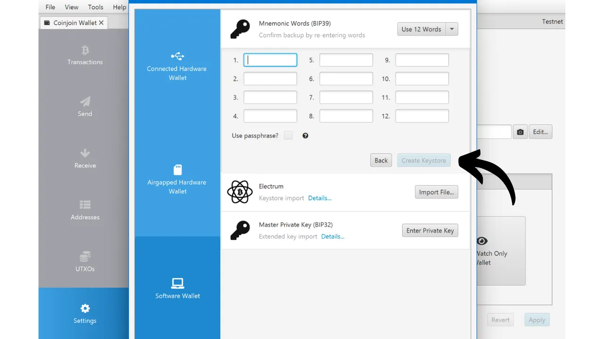
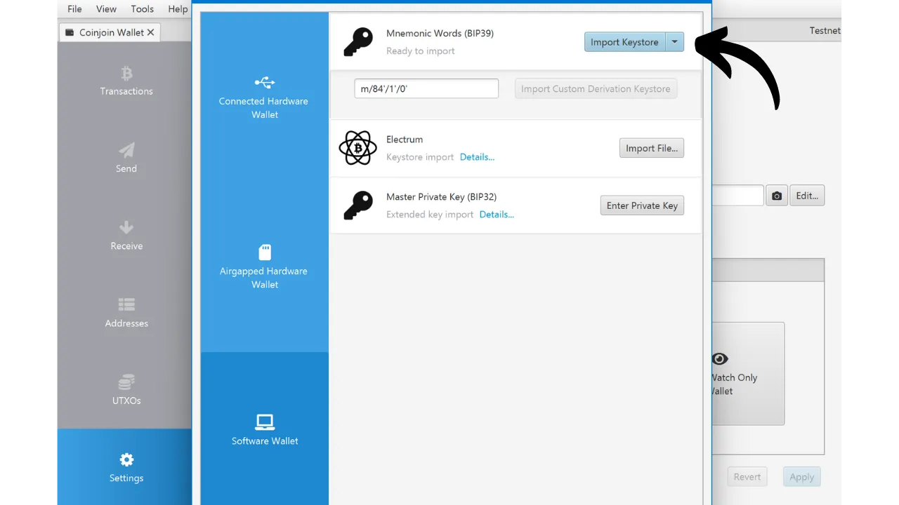
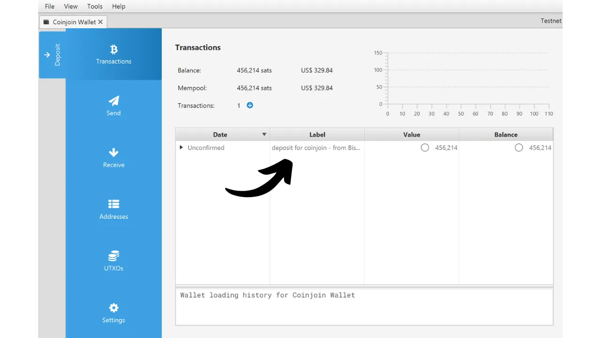
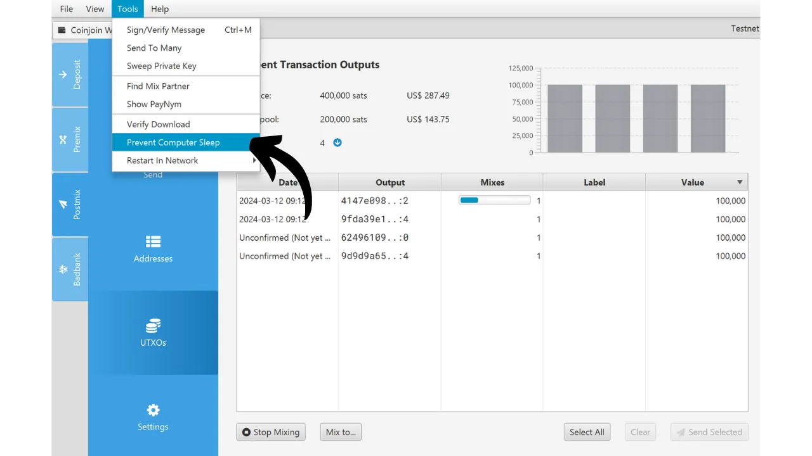
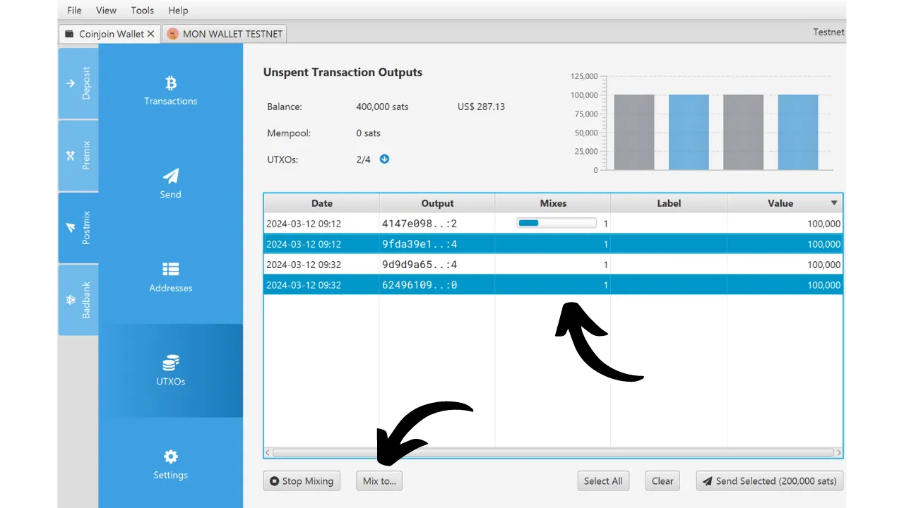
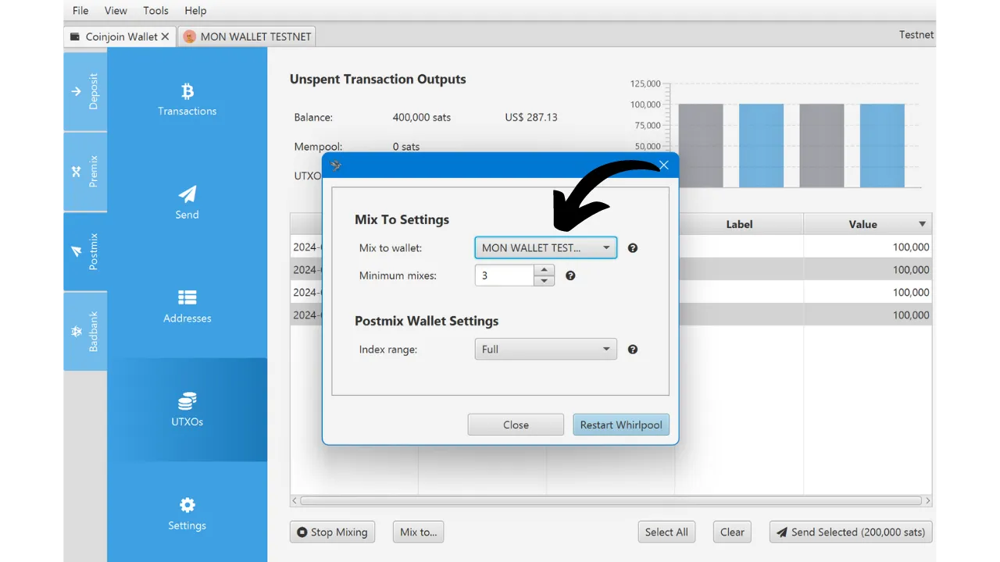

***ACHTUNG:** Nach der Verhaftung der Gründer von Samourai Wallet und der Beschlagnahme ihrer Server am 24. April funktioniert das Whirlpool-Tool nicht mehr, selbst für Personen, die über ihr eigenes Dojo verfügen oder Sparrow Wallet nutzen. Es bleibt jedoch möglich, dass dieses Tool in den kommenden Wochen wieder in Betrieb genommen oder auf eine andere Weise neu gestartet wird. Darüber hinaus bleibt der theoretische Teil dieses Artikels relevant, um die Prinzipien und Ziele von Coinjoins im Allgemeinen (nicht nur Whirlpool) zu verstehen sowie die Wirksamkeit des Whirlpool-Modells zu begreifen.*

_Wir verfolgen die Entwicklungen in diesem Fall sowie die Entwicklungen bezüglich der zugehörigen Tools genau. Seien Sie versichert, dass wir dieses Tutorial aktualisieren werden, sobald neue Informationen verfügbar sind._

_Dieses Tutorial wird nur zu Bildungs- und Informationszwecken bereitgestellt. Wir befürworten oder ermutigen die Verwendung dieser Tools zu kriminellen Zwecken nicht. Es liegt in der Verantwortung jedes Benutzers, die Gesetze in seiner Gerichtsbarkeit zu beachten._

---

In diesem Tutorial erfahren Sie, was ein Coinjoin ist und wie Sie einen solchen mit der Sparrow Wallet Software und der Whirlpool-Implementierung durchführen.

## Was ist ein Coinjoin bei Bitcoin?
**Ein Coinjoin ist eine Technik, die die Nachverfolgbarkeit von Bitcoins in der Blockchain bricht**. Sie basiert auf einer kollaborativen Transaktion mit einer spezifischen Struktur gleichen Namens: der Coinjoin-Transaktion.

Coinjoins verbessern die Privatsphäre von Bitcoin-Nutzern, indem sie die Kettenanalyse für externe Beobachter erschweren. Ihre Struktur ermöglicht es, mehrere Münzen von verschiedenen Nutzern in einer einzigen Transaktion zusammenzuführen, wodurch die Spuren verwischt und es schwierig wird, die Verbindungen zwischen Eingabe- und Ausgabeadressen zu bestimmen.

Das Prinzip des Coinjoin basiert auf einem kollaborativen Ansatz: Mehrere Nutzer, die ihre Bitcoins mischen möchten, hinterlegen identische Beträge als Eingaben derselben Transaktion. Diese Beträge werden dann als Ausgaben von gleichem Wert an jeden Nutzer umverteilt. Am Ende der Transaktion wird es unmöglich, eine spezifische Ausgabe einem bekannten Nutzer am Eingang zuzuordnen. Es besteht keine direkte Verbindung zwischen den Eingaben und Ausgaben, was die Zuordnung zwischen den Nutzern und ihren UTXO sowie die Geschichte jeder Münze bricht.


Beispiel einer Coinjoin-Transaktion (nicht von mir): [323df21f0b0756f98336437aa3d2fb87e02b59f1946b714a7b09df04d429dec2](https://mempool.space/de/tx/323df21f0b0756f98336437aa3d2fb87e02b59f1946b714a7b09df04d429dec2)

Um einen Coinjoin durchzuführen, während sichergestellt wird, dass jeder Nutzer jederzeit die Kontrolle über seine Mittel behält, beginnt der Prozess mit der Konstruktion der Transaktion durch einen Koordinator, der sie dann an jeden Teilnehmer übermittelt. Jeder Nutzer signiert die Transaktion dann, nachdem er überprüft hat, dass sie ihm zusagt. Alle gesammelten Signaturen werden schließlich in die Transaktion integriert. Wird ein Versuch unternommen, Mittel durch eine Änderung der Ausgaben der Coinjoin-Transaktion durch einen Nutzer oder den Koordinator abzuzweigen, werden die Signaturen ungültig, was zur Ablehnung der Transaktion durch die Knoten führt.

Es gibt mehrere Implementierungen von Coinjoin, wie Whirlpool, JoinMarket oder Wabisabi, die jeweils darauf abzielen, die Koordination unter den Teilnehmern zu verwalten und die Effizienz von Coinjoin-Transaktionen zu erhöhen.

In diesem Tutorial konzentrieren wir uns auf die **Whirlpool**-Implementierung, die ich für die effektivste Lösung halte, um Coinjoins bei Bitcoin durchzuführen. Obwohl sie auf mehreren Wallets verfügbar ist, erkundet dieses Tutorial ausschließlich ihre Verwendung mit der Sparrow Wallet Desktop-Software.
## Warum CoinJoins bei Bitcoin durchführen?

Eines der anfänglichen Probleme mit jedem Peer-to-Peer-Zahlungssystem ist das Double-Spending: Wie kann man verhindern, dass bösartige Individuen dieselben monetären Einheiten mehrmals ausgeben, ohne auf eine zentrale Autorität zur Schlichtung zurückgreifen zu müssen?

Satoshi Nakamoto bot eine Lösung für dieses Dilemma durch das Bitcoin-Protokoll, ein Peer-to-Peer-Elektronisches Zahlungssystem, das unabhängig von jeder zentralen Autorität funktioniert. In seinem Whitepaper betont er, dass der einzige Weg, das Fehlen von Double-Spending zu zertifizieren, darin besteht, die Sichtbarkeit aller Transaktionen innerhalb des Zahlungssystems sicherzustellen.

Um sicherzustellen, dass jeder Teilnehmer über die Transaktionen informiert ist, müssen diese öffentlich bekannt gegeben werden. Somit basiert der Betrieb von Bitcoin auf einer transparenten und verteilten Infrastruktur, die es jedem Knotenbetreiber ermöglicht, die Gesamtheit der elektronischen Signaturketten und die Geschichte jeder Münze, von ihrer Erstellung durch einen Miner, zu überprüfen.
Die transparente und verteilte Natur der Bitcoin-Blockchain bedeutet, dass jeder Netzwerknutzer den Transaktionen aller anderen Teilnehmer folgen und diese analysieren kann. Folglich ist Anonymität auf der Transaktionsebene unmöglich. Die Anonymität wird jedoch auf der Ebene der individuellen Identifikation bewahrt. Im Gegensatz zum traditionellen Bankensystem, bei dem jedes Konto mit einer persönlichen Identität verknüpft ist, sind bei Bitcoin die Mittel mit Paaren kryptografischer Schlüssel verbunden, was den Nutzern eine Form von Pseudonymität hinter kryptografischen Identifikatoren bietet.
Daher wird die Vertraulichkeit bei Bitcoin kompromittiert, wenn externe Beobachter es schaffen, spezifische UTXOs mit identifizierten Nutzern zu verknüpfen. Sobald diese Verknüpfung hergestellt ist, wird es möglich, ihre Transaktionen nachzuverfolgen und die Geschichte ihrer Bitcoins zu analysieren. Coinjoin ist genau eine Technik, die entwickelt wurde, um die Nachverfolgbarkeit von UTXOs zu unterbrechen und somit den Bitcoin-Nutzern auf der Transaktionsebene eine gewisse Schicht der Vertraulichkeit zu bieten.

## Wie funktioniert Whirlpool?

Whirlpool unterscheidet sich von anderen Coinjoin-Methoden durch die Verwendung von "_ZeroLink_"-Transaktionen, die sicherstellen, dass technisch keinerlei Verbindung zwischen allen Eingängen und allen Ausgängen möglich ist. Diese perfekte Vermischung wird durch eine Struktur erreicht, in der jeder Teilnehmer einen identischen Betrag als Eingabe (außer den Mining-Gebühren) beiträgt, wodurch Ausgaben in perfekt gleichen Beträgen erzeugt werden.

Dieser restriktive Ansatz bei den Eingängen verleiht den Whirlpool-Coinjoin-Transaktionen eine einzigartige Eigenschaft: die totale Abwesenheit von deterministischen Verbindungen zwischen den Eingängen und den Ausgängen. Mit anderen Worten, jede Ausgabe hat die gleiche Wahrscheinlichkeit, einem beliebigen Teilnehmer zugeschrieben zu werden, verglichen mit allen anderen Ausgaben der Transaktion.
Ursprünglich war die Anzahl der Teilnehmer bei jedem Whirlpool-Coinjoin auf 5 begrenzt, mit 2 neuen Einsteigern und 3 Remixern (wir werden diese Konzepte weiter unten erklären). Jedoch hat die Erhöhung der On-Chain-Transaktionsgebühren, die im Jahr 2023 beobachtet wurde, die Samourai-Teams dazu veranlasst, ihr Modell zu überdenken, um die Privatsphäre zu verbessern und gleichzeitig die Kosten zu reduzieren. Somit können unter Berücksichtigung der Marktsituation der Gebühren und der Anzahl der Teilnehmer nun Coinjoins mit 6, 7 oder 8 Teilnehmern organisiert werden. Diese erweiterten Sitzungen werden als "_Surge Cycles_" bezeichnet. Es ist wichtig zu beachten, dass unabhängig von der Konfiguration immer nur 2 neue Einsteiger in den Whirlpool-Coinjoins sind.

Daher sind Whirlpool-Transaktionen durch eine identische Anzahl von Eingängen und Ausgängen gekennzeichnet, die sein können:
- 5 Eingänge und 5 Ausgänge;

- 6 Eingänge und 6 Ausgänge;

- 7 Eingänge und 7 Ausgänge;

- 8 Eingänge und 8 Ausgänge.

Das von Whirlpool vorgeschlagene Modell basiert somit auf kleinen Coinjoin-Transaktionen. Im Gegensatz zu Wasabi und JoinMarket, wo die Robustheit der Anonsets auf dem Volumen der Teilnehmer in einem einzigen Zyklus beruht, setzt Whirlpool auf die Verkettung mehrerer kleiner Zyklen.

In diesem Modell fallen für den Benutzer Gebühren nur bei seinem ersten Eintritt in einen Pool an, was es ihm ermöglicht, an einer Vielzahl von Remixes ohne zusätzliche Gebühren teilzunehmen. Es sind die neuen Einsteiger, die die Mining-Gebühren für die Remixer tragen.

Mit jedem zusätzlichen Coinjoin, an dem eine Münze teilnimmt, zusammen mit ihren bisherigen Begegnungen, wachsen die Anonsets exponentiell. Das Ziel ist es also, von diesen kostenlosen Remixes zu profitieren, die bei jedem Vorkommen dazu beitragen, die Dichte der Anonsets, die mit jeder gemischten Münze verbunden sind, zu stärken.

Whirlpool wurde unter Berücksichtigung von zwei wichtigen Anforderungen entwickelt:
- Die Zugänglichkeit der Implementierung auf mobilen Geräten, da Samourai Wallet hauptsächlich eine Smartphone-Anwendung ist;
- Die Geschwindigkeit der Remix-Zyklen, um eine signifikante Erhöhung der Anonsets zu fördern.
Diese Imperative leiteten die Entscheidungen der Entwickler von Samourai Wallet bei der Gestaltung von Whirlpool, was sie dazu veranlasste, die Anzahl der Teilnehmer pro Zyklus zu begrenzen. Zu wenige Teilnehmer hätten die Wirksamkeit des Coinjoin beeinträchtigt, indem sie die mit jedem Zyklus generierten Anonsets drastisch reduziert hätten, während zu viele Teilnehmer Managementprobleme bei mobilen Anwendungen verursacht hätten und den Fluss der Zyklen behindert hätten.

**Letztendlich ist es nicht notwendig, eine hohe Anzahl von Teilnehmern pro Coinjoin bei Whirlpool zu haben, da die Anonsets über die Ansammlung mehrerer Coinjoin-Zyklen gebildet werden.**
[-> Erfahren Sie mehr über Whirlpool Anonsets.](https://planb.network/tutorials/privacy/wst-anonsets)
### Coinjoin-Pools und Gebühren
Um sicherzustellen, dass mehrere Zyklen die Anonsets der gemischten Coins effektiv erhöhen, muss ein bestimmter Rahmen festgelegt werden, um die Mengen der verwendeten UTXOs zu beschränken. Whirlpool definiert dafür verschiedene Pools.

Ein Pool stellt eine Gruppe von Benutzern dar, die zusammen mischen möchten und sich auf die Menge der zu verwendenden UTXOs einigen, um den Coinjoin-Prozess zu optimieren. Jeder Pool gibt eine feste Menge für das UTXO an, an die sich der Benutzer halten muss, um teilnehmen zu können. Um Coinjoins mit Whirlpool durchzuführen, müssen Sie einen Pool auswählen. Die derzeit verfügbaren Pools sind wie folgt:
- 0,5 Bitcoins;
- 0,05 Bitcoin;
- 0,01 Bitcoin;
- 0,001 Bitcoin (= 100.000 Sats).

Indem Sie einem Pool mit Ihren Bitcoins beitreten, werden diese geteilt, um UTXOs zu generieren, die perfekt homogen mit denen der anderen Teilnehmer im Pool sind. Jeder Pool hat ein Maximumlimit; somit werden Sie für Beträge, die dieses Limit überschreiten, gezwungen, entweder zwei separate Einträge innerhalb desselben Pools zu machen oder zu einem anderen Pool mit einem höheren Betrag zu wechseln:

| Pool (Bitcoin) | Maximalbetrag pro Eintrag (Bitcoin) |
|----------------|-------------------------------------|
| 0,5            | 35                                  |
| 0,05           | 3,5                                 |
| 0,01           | 0,7                                 |
| 0,001          | 0,025                               |

Wie zuvor erwähnt, wird ein UTXO als zu einem Pool gehörend betrachtet, wenn es bereit ist, in einen Coinjoin integriert zu werden. Dies bedeutet jedoch nicht, dass der Benutzer den Besitz darüber verliert. **Durch die verschiedenen Mischzyklen behalten Sie die volle Kontrolle über Ihre Schlüssel und folglich über Ihre Bitcoins.** Das unterscheidet die Coinjoin-Technik von anderen zentralisierten Mischtechniken.

Um in einen Coinjoin-Pool einzutreten, müssen Servicegebühren sowie Mining-Gebühren bezahlt werden. Die Servicegebühren sind für jeden Pool festgelegt und sollen die Teams entschädigen, die für die Entwicklung und Wartung von Whirlpool verantwortlich sind. Für Sparrow Wallet-Benutzer werden diese Gebühren von den Samourai-Teams an die Entwickler von Sparrow weitergegeben.

Die Servicegebühren für die Nutzung von Whirlpool sind einmalig beim Eintritt in den Pool zu entrichten. Ist dieser Schritt abgeschlossen, haben Sie die Möglichkeit, an einer unbegrenzten Anzahl von Remixes ohne zusätzliche Gebühren teilzunehmen. Hier sind die aktuellen festen Gebühren für jeden Pool:

| Pool (bitcoin) | Eintrittsgebühr (Bitcoin) |
| -------------- | ------------------------- |
| 0,5            | 0,0175                    |
| 0,05           | 0,00175                   |
| 0,01           | 0,0005 (50 000 sats)      |
| 0,001          | 0,00005 (5 000 sats)      |


Diese Gebühren fungieren im Wesentlichen als Eintrittskarte für den gewählten Pool, unabhängig von der Menge, die Sie in CoinJoin einbringen. Also, egal ob Sie dem 0,01 Pool mit genau 0,01 BTC beitreten oder mit 0,5 BTC eintreten, die Gebühren bleiben im absoluten Wert gleich.
Bevor man mit CoinJoins fortfährt, hat der Benutzer daher die Wahl zwischen 2 Strategien:
- Sich für einen kleineren Pool entscheiden, um die Servicegebühren zu minimieren, wissend, dass sie mehrere kleine UTXOs zurückbekommen;
- Oder einen größeren Pool bevorzugen, wobei höhere Gebühren akzeptiert werden, um am Ende eine reduzierte Anzahl von UTXOs mit höherem Wert zu erhalten.

Es wird im Allgemeinen davon abgeraten, mehrere gemischte UTXOs nach den CoinJoin-Zyklen zusammenzuführen, da dies die erworbene Vertraulichkeit gefährden könnte, insbesondere aufgrund der Common-Input-Ownership Heuristik (CIOH). Daher könnte es klug sein, einen größeren Pool zu wählen, auch wenn dies bedeutet, mehr zu bezahlen, um zu vermeiden, dass man zu viele UTXOs mit geringem Wert als Ausgabe hat. Der Benutzer muss diese Kompromisse abwägen, um den Pool zu wählen, den er bevorzugt.

Zusätzlich zu den Servicegebühren müssen auch die Mining-Gebühren berücksichtigt werden, die bei jeder Bitcoin-Transaktion anfallen. Als Whirlpool-Benutzer müssen Sie die Mining-Gebühren für die Vorbereitungstransaktion (`Tx0`) sowie die für den ersten CoinJoin bezahlen. Alle nachfolgenden Remixes sind kostenlos, dank des Whirlpool-Modells, das auf den Zahlungen neuer Teilnehmer basiert.

Tatsächlich sind bei jedem Whirlpool-CoinJoin zwei Benutzer unter den Eingaben neue Teilnehmer. Die anderen Eingaben stammen von Remixern. Als Ergebnis werden die Mining-Gebühren für alle Teilnehmer an der Transaktion von diesen zwei neuen Teilnehmern gedeckt, die dann auch von kostenlosen Remixes profitieren:

Dank dieses Gebührensystems unterscheidet sich Whirlpool wirklich von anderen CoinJoin-Diensten, da die Anonsets der UTXOs nicht proportional zum vom Benutzer gezahlten Preis sind. So ist es möglich, erheblich hohe Anonymitätsniveaus zu erreichen, indem nur die Eintrittsgebühren des Pools und die Mining-Gebühren für zwei Transaktionen (die `Tx0` und den anfänglichen Mix) bezahlt werden.

Es ist wichtig zu beachten, dass der Benutzer auch die Mining-Gebühren für die Abhebung seiner UTXOs aus dem Pool nach Abschluss seiner mehrfachen CoinJoins decken muss, es sei denn, er hat die Option `mix to` gewählt, die wir im folgenden Tutorial besprechen werden.

### Die von Whirlpool verwendeten HD-Wallet-Konten
Um einen CoinJoin über Whirlpool durchzuführen, muss das Wallet mehrere unterschiedliche Konten generieren. Ein Konto, im Kontext eines HD (Hierarchical Deterministic) Wallets, stellt einen Abschnitt dar, der vollständig von den anderen isoliert ist, diese Trennung erfolgt auf der dritten Tiefenebene der Wallet-Hierarchie, das heißt, auf der Ebene des `xpub`.
Ein HD-Wallet kann theoretisch bis zu `2^(32/2)` verschiedene Konten ableiten. Das anfängliche Konto, das standardmäßig bei allen Bitcoin-Wallets verwendet wird, entspricht dem Index `0'`.

Für an Whirlpool angepasste Wallets, wie Samourai oder Sparrow, werden 4 Konten verwendet, um den Bedürfnissen des CoinJoin-Prozesses gerecht zu werden:
- Das **Deposit**-Konto, identifiziert durch den Index `0'`;
- Das **Bad Bank**- (oder doxxic change) Konto, identifiziert durch den Index `2 147 483 644'`;
- Das **Premix**-Konto, identifiziert durch den Index `2 147 483 645'`;
- Das **Postmix**-Konto, identifiziert durch den Index `2 147 483 646'`.

Jedes dieser Konten erfüllt eine spezifische Funktion innerhalb des CoinJoin.
Alle diese Konten sind mit einem einzigen Seed verbunden, der es dem Benutzer ermöglicht, Zugang zu all seinen Bitcoins wiederherzustellen, indem er seinen Wiederherstellungsphrase und, falls zutreffend, seinen Passphrase verwendet. Es ist jedoch notwendig, der Software während dieser Wiederherstellungsoperation die verschiedenen verwendeten Kontenindizes anzugeben.
Lassen Sie uns nun die verschiedenen Stufen eines Whirlpool-Coinjoins innerhalb dieser Konten betrachten.

### Die verschiedenen Stufen von Coinjoins bei Whirlpool
**Stufe 1: Der Tx0**
Der Ausgangspunkt eines jeden Whirlpool-Coinjoins ist das **Einzahlungs**konto. Dieses Konto ist dasjenige, das Sie automatisch verwenden, wenn Sie eine neue Bitcoin-Wallet erstellen. Dieses Konto muss mit den Bitcoins, die Sie mischen möchten, aufgeladen werden.

Der `Tx0` repräsentiert die erste Stufe des Whirlpool-Mischprozesses. Ziel ist es, die UTXOs vorzubereiten und zu vereinheitlichen, indem sie in Einheiten aufgeteilt werden, die dem Betrag des ausgewählten Pools entsprechen, um die Homogenität des Mischens zu gewährleisten. Die vereinheitlichten UTXOs werden dann an das **Vormix**konto gesendet. Was den Überschuss betrifft, der nicht in den Pool eingehen kann, wird er in ein spezifisches Konto getrennt: das **Bad Bank** (oder "doxxic change").

Diese anfängliche Transaktion `Tx0` dient auch dazu, die Dienstleistungsgebühren an den Mix-Koordinator zu begleichen. Im Gegensatz zu den folgenden Stufen ist diese Transaktion nicht kollaborativ; der Benutzer muss daher die vollen Mining-Gebühren übernehmen:

In diesem Beispiel einer Transaktion `Tx0` wird ein Eingang von `372.000 Sats` aus unserem **Einzahlungs**konto in mehrere ausgehende UTXOs aufgeteilt, die wie folgt verteilt sind:
- Ein Betrag von `5.000 Sats` für den Koordinator für Dienstleistungsgebühren, entsprechend dem Eintritt in den Pool von `100.000 Sats`;
- Drei UTXOs, die für das Mischen vorbereitet sind, umgeleitet zu unserem **Vormix**konto und beim Koordinator registriert. Diese UTXOs werden auf `108.000 Sats` jeder gleichgemacht, um die Mining-Gebühren für ihren zukünftigen ersten Mix zu decken;
- Der Überschuss, der nicht in den Pool eingehen kann, weil er zu klein ist, wird als toxisches Wechselgeld betrachtet. Es wird auf sein spezifisches Konto gesendet. Hier beläuft sich dieses Wechselgeld auf `40.000 Sats`;
- Schließlich gibt es `3.000 Sats`, die keinen Ausgang darstellen, sondern die Mining-Gebühren sind, die notwendig sind, um den `Tx0` zu bestätigen.

Zum Beispiel, hier ist ein echter Tx0 Whirlpool (der nicht von mir stammt): [edef60744f539483d868caff49d4848e5cc6e805d6cdc8d0f9bdbbaedcb5fc46](https://mempool.space/de/tx/edef60744f539483d868caff49d4848e5cc6e805d6cdc8d0f9bdbbaedcb5fc46)

**Stufe 2: Das toxische Wechselgeld**
Der Überschuss, der nicht in den Pool integriert werden konnte, hier äquivalent zu `40.000 Sats`, wird auf das **Bad Bank**-Konto umgeleitet, auch als "toxisches Wechselgeld" bezeichnet, um eine strikte Trennung von den anderen UTXOs im Wallet zu gewährleisten.

Dieses UTXO ist gefährlich für die Privatsphäre des Benutzers, weil es nicht nur immer an seine Vergangenheit und daher möglicherweise an die Identität seines Besitzers gebunden ist, sondern zusätzlich als zu einem Benutzer gehörend vermerkt wird, der einen Coinjoin durchgeführt hat.
Wenn dieses UTXO mit gemischten Ausgängen zusammengeführt wird, verlieren letztere jegliche Privatsphäre, die während der Coinjoin-Zyklen gewonnen wurde, insbesondere aufgrund der CIOH (*Common-Input-Ownership-Heuristic*). Wird es mit anderen toxischen Änderungen zusammengeführt, riskiert der Benutzer den Verlust der Privatsphäre, da dies die verschiedenen Einträge der Coinjoin-Zyklen verknüpft. Es muss daher mit Vorsicht behandelt werden. Wie dieses toxische UTXO verwaltet wird, wird im letzten Teil dieses Artikels detailliert beschrieben, und zukünftige Tutorials werden diese Methoden im PlanB-Netzwerk näher erläutern.
**Schritt 3: Der Erste Mix**
Nach Abschluss des `Tx0` werden die gleichgemachten UTXOs auf das **Premix**-Konto unserer Wallet gesendet, bereit, in ihren ersten Coinjoin-Zyklus eingeführt zu werden, auch "erster Mix" genannt. Wenn, wie in unserem Beispiel, der `Tx0` mehrere zum Mischen bestimmte UTXOs erzeugt, wird jeder von ihnen in einen separaten ersten Coinjoin integriert.
Am Ende dieser ersten Mixe wird das **Premix**-Konto leer sein, während unsere Coins, nachdem sie die Mining-Gebühren für diesen ersten Coinjoin bezahlt haben, genau auf den Betrag angepasst werden, der durch den gewählten Pool definiert ist. In unserem Beispiel werden unsere ursprünglichen UTXOs von `108 000 Sats` genau auf `100 000 Sats` reduziert.

**Schritt 4: Die Remixe**
Nach dem ersten Mix werden die UTXOs auf das **Postmix**-Konto übertragen. Dieses Konto sammelt die bereits gemischten UTXOs und jene, die auf das Remixen warten. Wenn der Whirlpool-Client aktiv ist, sind die UTXOs im **Postmix**-Konto automatisch für das Remixen verfügbar und werden zufällig ausgewählt, um an diesen neuen Zyklen teilzunehmen.

Zur Erinnerung: Remixe sind dann zu 100% kostenlos: Es fallen keine zusätzlichen Servicegebühren oder Mining-Gebühren an. Die UTXOs im **Postmix**-Konto zu behalten, erhält somit ihren Wert unverändert und verbessert gleichzeitig ihre Anonsets. Deshalb ist es wichtig, diese Coins an mehreren Coinjoin-Zyklen teilnehmen zu lassen. Es kostet Sie absolut nichts und erhöht ihre Anonymitätsstufen.

Wenn Sie entscheiden, gemischte UTXOs auszugeben, können Sie dies direkt vom **Postmix**-Konto aus tun. Es wird empfohlen, die gemischten UTXOs in diesem Konto zu behalten, um von kostenlosen Remixen zu profitieren und zu verhindern, dass sie den Whirlpool-Kreislauf verlassen, was ihre Privatsphäre verringern könnte.

Wie wir im folgenden Tutorial sehen werden, gibt es auch die Option `mix to`, die die Möglichkeit bietet, Ihre gemischten Coins automatisch nach einer definierten Anzahl von Coinjoins an eine andere Wallet, wie z.B. eine Cold Wallet, zu senden.

Nachdem wir die Theorie besprochen haben, tauchen wir mit einem Tutorial zur Nutzung von Whirlpool über die Sparrow Wallet Desktop-Software in die Praxis ein!

## Tutorial: Coinjoin Whirlpool auf Sparrow Wallet
Es gibt zahlreiche Optionen für die Nutzung von Whirlpool. Die erste, die ich Ihnen vorstellen möchte, ist die Sparrow Wallet-Option, eine Open-Source-Bitcoin-Wallet-Management-Software für den PC.
Die Nutzung von Sparrow hat den Vorteil, dass sie recht einfach zu beginnen ist, schnell eingerichtet werden kann und keine andere Ausrüstung als einen Computer und eine Internetverbindung erfordert. Es gibt jedoch einen bemerkenswerten Nachteil: Coinjoins finden nur statt, wenn Sparrow gestartet und verbunden ist. Das bedeutet, wenn Sie Ihre Bitcoins 24/7 mischen und remixen möchten, müssen Sie Ihren Computer ständig eingeschaltet halten.

### Sparrow Wallet installieren
Um zu beginnen, benötigen Sie offensichtlich die Sparrow Wallet Software. Sie können diese direkt von [der offiziellen Webseite](https://sparrowwallet.com/download/) oder auf [ihrem GitHub](https://github.com/sparrowwallet/sparrow/releases) herunterladen.
Bevor Sie die Software installieren, ist es wichtig, die Signatur und Integrität der gerade heruntergeladenen ausführbaren Datei zu überprüfen. Wenn Sie mehr Details zum Installationsprozess und zur Überprüfung der Sparrow-Software wünschen, rate ich Ihnen, dieses andere Tutorial zu lesen: *[Die Sparrow Wallet Anleitungen](https://planb.network/tutorials/wallet/sparrow)*.

### Erstellen eines Software-Wallets
Nach der Installation der Software müssen Sie mit der Erstellung eines Bitcoin-Wallets fortfahren. Es ist wichtig zu beachten, dass für die Teilnahme an Coinjoins die Verwendung eines Software-Wallets (auch "Hot Wallet" genannt) unerlässlich ist. Daher **wird es nicht möglich sein, Coinjoins mit einem durch ein Hardware-Wallet gesicherten Wallet durchzuführen**.

Obwohl es nicht zwingend erforderlich ist, wird im Falle, dass Sie beabsichtigen, signifikante Beträge zu mischen, dringend empfohlen, für dieses Wallet die Verwendung einer starken BIP39-Passphrase zu wählen.

Um ein neues Wallet zu erstellen, öffnen Sie Sparrow, klicken Sie dann auf den `Datei`-Tab und `Neues Wallet`.


Wählen Sie einen Namen für dieses Wallet, zum Beispiel: "Coinjoin Wallet". Klicken Sie auf den `Wallet erstellen`-Button.



Lassen Sie die Standardeinstellungen, und klicken Sie dann auf den `Neues oder importiertes Software-Wallet`-Button.


Wenn Sie das Fenster zur Wallet-Erstellung öffnen, empfehle ich, eine 12-Wort-Sequenz zu wählen, da diese völlig ausreichend ist. Wählen Sie `Neu generieren`, um eine neue Wiederherstellungsphrase zu generieren, und klicken Sie auf `Passphrase verwenden`, wenn Sie eine BIP39-Passphrase hinzufügen möchten. Es ist wichtig, eine physische Sicherung Ihrer Wiederherstellungsinformationen vorzunehmen, sei es auf Papier oder auf einem Metallträger, um die Sicherheit Ihrer Bitcoins zu gewährleisten.


Stellen Sie die Gültigkeit Ihrer Sicherungskopie der Wiederherstellungsphrase sicher, bevor Sie auf `Sicherung bestätigen...` klicken. Sparrow wird Sie dann bitten, Ihre Phrase erneut einzugeben, um zu überprüfen, dass Sie diese notiert haben. Sobald dieser Schritt abgeschlossen ist, fahren Sie fort, indem Sie auf `Keystore erstellen` klicken.


Lassen Sie den vorgeschlagenen Ableitungspfad als Standard und drücken Sie `Keystore importieren`. In meinem Beispiel weicht der Ableitungspfad leicht ab, da ich das Testnet für dieses Tutorial verwende. Der Ableitungspfad, der für Sie erscheinen sollte, ist wie folgt:
```bash
m/84'/0'/0'
```



Danach wird Sparrow die Ableitungsdetails Ihres neuen Wallets anzeigen. Falls Sie eine Passphrase festgelegt haben, wird dringend empfohlen, Ihren `Master-Fingerabdruck` zu notieren. Obwohl dieser Master-Key-Fingerabdruck keine sensiblen Daten sind, wird er Ihnen später nützlich sein, um zu überprüfen, dass Sie tatsächlich auf das richtige Wallet zugreifen und um die Abwesenheit von Fehlern bei der Eingabe Ihrer Passphrase zu bestätigen.

Klicken Sie auf den `Anwenden`-Button.


Sparrow lädt Sie ein, ein Passwort für Ihr Wallet zu erstellen. Dieses Passwort wird benötigt, um darauf über die Sparrow Wallet Software zuzugreifen. Wählen Sie ein starkes Passwort, machen Sie eine Sicherung davon und klicken Sie dann auf `Passwort festlegen`.


### Bitcoins empfangen
Nachdem Sie Ihre Wallet erstellt haben, werden Sie zunächst ein einzelnes Konto haben, mit dem Index `0'`. Dies ist das **Einzahlungs**konto, über das wir in den vorherigen Teilen gesprochen haben. Dies ist das Konto, an das Sie die Bitcoins senden müssen, um sie zu mischen.
Um dies zu tun, wählen Sie den `Receive`-Tab auf der linken Seite des Fensters. Sparrow wird automatisch eine neue leere Adresse generieren, um Bitcoins zu empfangen.


Sie können dieser Adresse ein Label geben und dann die zu mischenden Bitcoins dorthin senden.



### Die Tx0 erstellen
Sobald Ihre Transaktion bestätigt wurde, können Sie zum `UTXOs`-Tab gehen.


Wählen Sie als Nächstes die UTXO(s), die Sie den Coinjoin-Zyklen unterziehen möchten. Um mehrere UTXOs gleichzeitig auszuwählen, halten Sie die `Strg`-Taste gedrückt, während Sie auf die UTXOs Ihrer Wahl klicken.


Klicken Sie dann auf den `Mix Selected`-Button am unteren Rand des Fensters. Wenn dieser Button in Ihrer Oberfläche nicht erscheint, liegt das daran, dass Sie eine Wallet verwenden, die mit einem Hardware-Wallet gesichert ist. Sie müssen eine Software-Wallet verwenden, um Coinjoins mit Sparrow durchzuführen.

Ein Fenster öffnet sich, um zu erklären, wie Whirlpool funktioniert. Dies ist eine Vereinfachung dessen, was ich in den vorherigen Teilen erklärt habe. Klicken Sie auf `Next`, um fortzufahren.


Auf der nächsten Seite können Sie einen "SCODE" eingeben, falls Sie einen haben. Ein SCODE ist ein Werbecode, der einen Rabatt auf die Servicegebühren des Pools bietet. Samourai Wallet bietet solche Codes gelegentlich seinen Nutzern während besonderer Veranstaltungen an. Ich rate Ihnen, [Samourai Wallet auf den sozialen Medien zu folgen](https://twitter.com/SamouraiWallet), damit Sie zukünftige SCODES nicht verpassen.

Auf derselben Seite müssen Sie auch die Gebührenrate für die `Tx0` und Ihren ersten Mix festlegen. Diese Wahl wird die Bestätigungsgeschwindigkeit für Ihre vorbereitende Transaktion und Ihren ersten Coinjoin beeinflussen. Denken Sie daran, dass Sie für die Mining-Gebühren der `Tx0` und des ersten Mixes verantwortlich sind, aber Sie werden keine Mining-Gebühren für nachfolgende Remixes schulden. Passen Sie den `Premix Priority`-Regler nach Ihren Vorlieben an, dann klicken Sie auf `Next`.


In diesem neuen Fenster haben Sie die Möglichkeit, den Pool auszuwählen, in den Sie eintreten möchten, indem Sie die Dropdown-Liste verwenden. In meinem Fall, da ich ursprünglich ein UTXO von `456 214 Sats` ausgewählt habe, ist meine einzige mögliche Wahl der Pool von `100 000 Sats`. Diese Schnittstelle informiert Sie auch über die zu zahlenden Servicegebühren sowie die Anzahl der UTXOs, die in den Pool integriert werden. Wenn die Bedingungen für Sie zufriedenstellend erscheinen, fahren Sie fort, indem Sie auf `Preview Premix` klicken.


Nach diesem Schritt wird Sparrow Sie auffordern, das Passwort für Ihre Wallet einzugeben, das Sie bei der Erstellung in der Software festgelegt haben. Sobald das Passwort eingegeben wurde, erhalten Sie eine Vorschau Ihrer `Tx0`. Auf der linken Seite Ihres Fensters sehen Sie, dass Sparrow die verschiedenen für die Nutzung von Whirlpool erforderlichen Konten generiert hat (`Deposit`, `Premix`, `Postmix` und `Badbank`). Sie haben auch die Möglichkeit, die Struktur Ihrer `Tx0` zu betrachten, mit den verschiedenen Ausgängen:
- Die Servicegebühren;
- Die ausgeglichenen UTXOs, die beabsichtigen, in den Pool einzutreten; - Der toxische Wechsel (Doxxic Change).


Wenn die Transaktion Ihren Vorstellungen entspricht, klicken Sie auf `Broadcast Transaction`, um Ihre `Tx0` zu übertragen. Andernfalls haben Sie die Möglichkeit, die Parameter dieser `Tx0` anzupassen, indem Sie `Clear` auswählen, um die eingegebenen Daten zu löschen und den Erstellungsprozess von vorne zu beginnen.

### Coinjoins durchführen
Sobald die Tx0 übertragen wurde, finden Sie Ihre UTXOs bereit zum Mischen im `Premix`-Konto.


Sobald die `Tx0` bestätigt ist, werden Ihre UTXOs beim Koordinator registriert, und die ersten Mischvorgänge starten automatisch nacheinander.


Wenn Sie das `Postmix`-Konto überprüfen, werden Sie die UTXOs beobachten, die aus den ersten Mischungen resultieren. Diese Münzen bleiben bereit für nachfolgende Remixe, die keine zusätzlichen Gebühren verursachen werden.


In der Spalte `Mixes` ist es möglich, die Anzahl der von jeder Ihrer Münzen durchgeführten Coinjoins zu sehen. Wie wir in den folgenden Abschnitten sehen werden, ist nicht so sehr die Anzahl der Remixe an sich von Bedeutung, sondern eher die damit verbundenen Anonsets, obwohl diese beiden Indikatoren teilweise zusammenhängen.


Um die Coinjoins vorübergehend zu stoppen, klicken Sie einfach auf `Stop Mixing`. Sie haben jederzeit die Möglichkeit, den Betrieb durch Auswahl von `Start Mixing` wieder aufzunehmen.


Um eine kontinuierliche Verfügbarkeit Ihrer UTXOs für das Remixen zu gewährleisten, ist es notwendig, die Sparrow-Software aktiv zu halten. Das Schließen der Software oder das Ausschalten Ihres Computers wird die Coinjoins pausieren. Eine Lösung, um dieses Problem zu umgehen, besteht darin, die Schlaffunktionen über die Einstellungen Ihres Betriebssystems zu deaktivieren. Zusätzlich bietet Sparrow eine Option, um zu verhindern, dass Ihr Computer automatisch in den Schlafmodus geht, die Sie unter dem Reiter `Tools` mit dem Titel `Prevent Computer Sleep` finden können.



### Die Coinjoins abschließen
Um Ihre gemischten Bitcoins auszugeben, haben Sie mehrere Optionen. Die direkteste Methode ist der Zugriff auf das `Postmix`-Konto und die Auswahl des Reiters `Send`.


In diesem Abschnitt haben Sie die Möglichkeit, die Zieladresse, den zu sendenden Betrag und die Transaktionsgebühren einzugeben, genauso wie bei jeder anderen Transaktion, die mit Sparrow Wallet durchgeführt wird. Wenn Sie möchten, können Sie auch von erweiterten Datenschutzfunktionen wie Stonewall profitieren, indem Sie auf den Button `Privacy` klicken.


[-> Erfahren Sie mehr über Stonewall-Transaktionen.](https://planb.network/tutorials/privacy/stonewall)

Wenn Sie eine präzisere Auswahl Ihrer Münzen zum Ausgeben treffen möchten, gehen Sie zum Reiter `UTXOs`. Wählen Sie die UTXOs aus, die Sie speziell verbrauchen möchten, und drücken Sie dann den Button `Send Selected`, um die Transaktion zu initiieren.


Schließlich ermöglicht die Option `Mix to...`, die bei Sparrow verfügbar ist, das automatische Entfernen eines ausgewählten UTXO aus Coinjoin-Zyklen, ohne zusätzliche Gebühren zu verursachen. Diese Funktion ermöglicht die Festlegung einer Anzahl von Remixes, nach denen der UTXO nicht wieder in Ihr `Postmix`-Konto reintegriert wird, sondern stattdessen direkt in eine andere Wallet übertragen wird. Diese Option wird oft verwendet, um gemischte Bitcoins automatisch an eine Cold Wallet zu senden. Um diese Option zu nutzen, beginnen Sie damit, die Empfänger-Wallet neben Ihrer Coinjoin-Wallet innerhalb der Sparrow-Software zu öffnen.


Gehen Sie dann zum Tab `UTXOs` und wählen Sie die Münzen aus, die Sie interessieren, und klicken Sie dann auf den Button `Mix to...` am unteren Rand des Fensters.



Ein Fenster öffnet sich, beginnen Sie damit, die Ziel-Wallet aus der Dropdown-Liste auszuwählen.



Wählen Sie die Coinjoin-Schwelle, jenseits derer die Auszahlung automatisch erfolgen wird. Ich kann Ihnen keine genaue Anzahl von Remixes geben, die durchgeführt werden sollen, da dies je nach Ihrer persönlichen Situation und Ihren Datenschutzzielen variiert, aber vermeiden Sie es, eine zu niedrige Schwelle zu wählen. Ich empfehle, diesen anderen Artikel zu konsultieren, um mehr über den Remixing-Prozess zu erfahren: [REMIX - WHIRLPOOL](https://planb.network/tutorials/privacy/remix-whirlpool).

Sie können die Option `Index range` auf ihrem Standardwert `Full` belassen. Diese Funktion ermöglicht das Mischen gleichzeitig von verschiedenen Clients, aber das ist nicht, was wir in diesem Tutorial tun wollen. Um die Option `Mix to...` zu finalisieren und zu aktivieren, drücken Sie `Restart Whirlpool`.


Seien Sie jedoch vorsichtig bei der Verwendung der Option `Mix to`, da das Entfernen gemischter Münzen aus Ihrem `Postmix`-Konto das Risiko, Ihre Privatsphäre zu kompromittieren, erheblich erhöhen kann. Die Gründe für dieses Potenzial werden in den folgenden Abschnitten detailliert beschrieben.

## Wie kann man die Qualität unserer Coinjoin-Zyklen erkennen?
Damit ein Coinjoin wirklich effektiv ist, ist es wesentlich, dass er eine gute Homogenität zwischen den Beträgen von Inputs und Outputs aufweist. Diese Uniformität verstärkt die Anzahl der möglichen Interpretationen in den Augen eines externen Beobachters und erhöht damit die Unsicherheit rund um die Transaktion. Um diese durch einen Coinjoin erzeugte Unsicherheit zu quantifizieren, kann man auf die Berechnung der Entropie der Transaktion zurückgreifen. Für eine vertiefende Erkundung dieser Indikatoren verweise ich Sie auf das Tutorial: [BOLTZMANN CALCULATOR](https://planb.network/de/tutorials/privacy/boltzmann-entropy). Das Whirlpool-Modell wird als dasjenige anerkannt, das die meiste Homogenität in Coinjoins bringt.
Als Nächstes wird die Leistung mehrerer Coinjoin-Zyklen basierend auf der Größe der Gruppen bewertet, in denen eine Münze versteckt ist. Die Größe dieser Gruppen definiert das, was als Anonsets bezeichnet wird. Es gibt zwei Arten von Anonsets: Die erste bewertet den Datenschutzgewinn gegen retrospektive Analyse (von der Gegenwart in die Vergangenheit) und die zweite, gegen prospektive Analyse (von der Vergangenheit in die Gegenwart). Für eine detaillierte Erklärung dieser beiden Indikatoren lade ich Sie ein, das Tutorial zu konsultieren: [WHIRLPOOL STATS TOOLS - ANONSETS](https://planb.network/tutorials/privacy/wst-anonsets).

## Wie verwaltet man Postmix?
Nachdem Coinjoin-Zyklen durchgeführt wurden, ist die beste Strategie, Ihre UTXOs im **Postmix**-Konto zu behalten, in Erwartung ihrer zukünftigen Verwendung. Es ist sogar ratsam, sie unendlich remixen zu lassen, bis Sie sie ausgeben müssen.
Einige Nutzer könnten in Erwägung ziehen, ihre gemischten Bitcoins in ein Wallet zu übertragen, das durch ein Hardware-Wallet gesichert ist. Dies ist möglich, aber es ist wichtig, den Empfehlungen von Samourai Wallet akribisch zu folgen, um die erworbene Vertraulichkeit nicht zu gefährden.
Das Zusammenführen von UTXOs ist der am häufigsten gemachte Fehler. Es ist notwendig, gemischte UTXOs nicht mit ungemischten UTXOs in derselben Transaktion zu kombinieren, um die CIOH (*Common-Input-Ownership-Heuristic*) zu vermeiden. Dies erfordert eine sorgfältige Verwaltung Ihrer UTXOs innerhalb Ihres Wallets, insbesondere in Bezug auf die Beschriftung. Über Coinjoin hinaus ist das Zusammenführen von UTXOs im Allgemeinen eine schlechte Praxis, die oft zu einem Verlust der Privatsphäre führt, wenn sie nicht richtig verwaltet wird.

Es ist auch wichtig, vorsichtig zu sein, wenn man gemischte UTXOs miteinander konsolidiert. Moderate Konsolidierungen sind denkbar, wenn Ihre gemischten UTXOs signifikante Anonsets haben, aber dies wird unweigerlich die Vertraulichkeit Ihrer Münzen verringern. Stellen Sie sicher, dass Konsolidierungen weder zu groß sind noch nach einer unzureichenden Anzahl von Remixes durchgeführt werden, da dies deduzierbare Verbindungen zwischen Ihren UTXOs vor und nach den Coinjoin-Zyklen herstellt. Im Zweifelsfall über diese Manipulationen ist die beste Praxis, die Postmix-UTXOs nicht zu konsolidieren und sie einzeln auf Ihr Hardware-Wallet zu übertragen, jedes Mal eine neue leere Adresse generierend. Denken Sie auch daran, jedes empfangene UTXO ordnungsgemäß zu beschriften.
Es wird auch davon abgeraten, Ihre Postmix-UTXOs in ein Wallet zu übertragen, das ungewöhnliche Skripte verwendet. Wenn Sie beispielsweise Whirlpool von einem Multisig-Wallet mit `P2WSH`-Skripten betreten, besteht wenig Chance, dass Sie mit anderen Nutzern gemischt werden, die ursprünglich denselben Wallet-Typ haben. Wenn Sie Ihre Postmix auf dasselbe Multisig-Wallet abheben, wird das Datenschutzniveau Ihrer gemischten Bitcoins stark verringert. Über Skripte hinaus gibt es viele andere Wallet-Fingerabdrücke, die Sie täuschen können.
Wie bei jeder Bitcoin-Transaktion ist es auch wichtig, Empfangsadressen nicht wiederzuverwenden. Jede neue Transaktion sollte auf einer neuen, leeren Adresse empfangen werden.

Die einfachste und sicherste Lösung ist, Ihre gemischten UTXOs in ihrem **Postmix**-Konto ruhen zu lassen, sie remixen zu lassen und sie nur zum Ausgeben anzurühren. Samourai- und Sparrow-Wallets bieten zusätzlichen Schutz gegen all diese Risiken, die mit der Kettenanalyse zusammenhängen. Diese Schutzmaßnahmen helfen Ihnen, Fehler zu vermeiden.

## Wie verwaltet man toxisches Wechselgeld?
Als Nächstes müssen Sie vorsichtig sein, wenn Sie toxisches Wechselgeld verwalten, das Wechselgeld, das nicht in den Coinjoin-Pool eintreten konnte. Diese toxischen UTXOs, die aus der Nutzung von Whirlpool resultieren, stellen ein Risiko für Ihre Privatsphäre dar, da sie eine Verbindung zwischen Ihnen und der Nutzung von Coinjoin herstellen. Daher ist es zwingend erforderlich, sie mit Sorgfalt zu behandeln und nicht mit anderen UTXOs, insbesondere gemischten UTXOs, zu kombinieren. Hier sind verschiedene Strategien zu berücksichtigen, um sie zu verwenden:
- **Mischen Sie sie in kleineren Pools:** Wenn Ihr toxisches UTXO groß genug ist, um allein in einen kleineren Pool einzutreten, erwägen Sie, es zu mischen. Dies ist oft die beste Option. Es ist jedoch entscheidend, mehrere toxische UTXOs nicht zu verschmelzen, um Zugang zu einem Pool zu erhalten, da dies Ihre verschiedenen Einträge verbinden könnte;
- **Markieren Sie sie als "nicht ausgabefähig":** Ein anderer Ansatz ist, sie nicht mehr zu verwenden, sie in ihrem dedizierten Konto als "nicht ausgabefähig" zu markieren und einfach zu Hodln. Dies stellt sicher, dass Sie sie nicht versehentlich ausgeben. Wenn der Wert von Bitcoin steigt, könnten neue Pools, die besser zu Ihren toxischen UTXOs passen, entstehen.
- **Spenden tätigen:** Erwägen Sie, Spenden zu leisten, selbst bescheidene, an Entwickler, die an Bitcoin und der zugehörigen Software arbeiten. Sie können auch an Organisationen spenden, die BTC akzeptieren. Wenn Ihnen das Management Ihrer toxischen UTXOs zu kompliziert erscheint, können Sie diese einfach loswerden, indem Sie eine Spende tätigen;
- **Geschenkkarten kaufen:** Plattformen wie [Bitrefill](https://www.bitrefill.com/) ermöglichen es Ihnen, Bitcoins gegen Geschenkkarten einzutauschen, die bei verschiedenen Händlern verwendet werden können. Dies kann eine Möglichkeit sein, Ihre toxischen UTXOs loszuwerden, ohne den damit verbundenen Wert zu verlieren.
- **Auf Monero konsolidieren:** Samourai Wallet bietet nun einen Atomic Swap-Service zwischen BTC und XMR an. Dies ist ideal, um toxische UTXOs auf Monero zu konsolidieren, ohne Ihre Privatsphäre über das CIOH zu kompromittieren, bevor Sie sie zurück zu Bitcoin senden. Diese Option kann jedoch aufgrund von Mining-Gebühren und der Prämie aufgrund von Liquiditätsbeschränkungen kostspielig sein.
- **An das Lightning-Netzwerk senden:** Diese UTXOs an das Lightning-Netzwerk zu übertragen, um von reduzierten Transaktionsgebühren zu profitieren, könnte eine interessante Option sein. Diese Methode könnte jedoch bestimmte Informationen offenlegen, abhängig von Ihrer Nutzung von Lightning, und sollte daher mit Vorsicht praktiziert werden.

Detaillierte Tutorials zur Implementierung dieser verschiedenen Techniken werden bald im PlanB Network angeboten.

**Zusätzliche Ressourcen:**
- [Sparrow Wallet Video-Tutorial](https://planb.network/tutorials/wallet/sparrow);
- [Samourai Wallet Video-Tutorial](https://planb.network/tutorials/wallet/samourai);
- [Samourai Wallet Dokumentation - Whirlpool](https://docs.samourai.io/whirlpool/basic-concepts);
- [Twitter-Thread über CoinJoins](https://twitter.com/SamouraiWallet/status/1489220847336308739);
- [Blogbeitrag über CoinJoins](https://www.pandul.fr/post/comprendre-et-utiliser-le-coinjoin-sur-bitcoin).