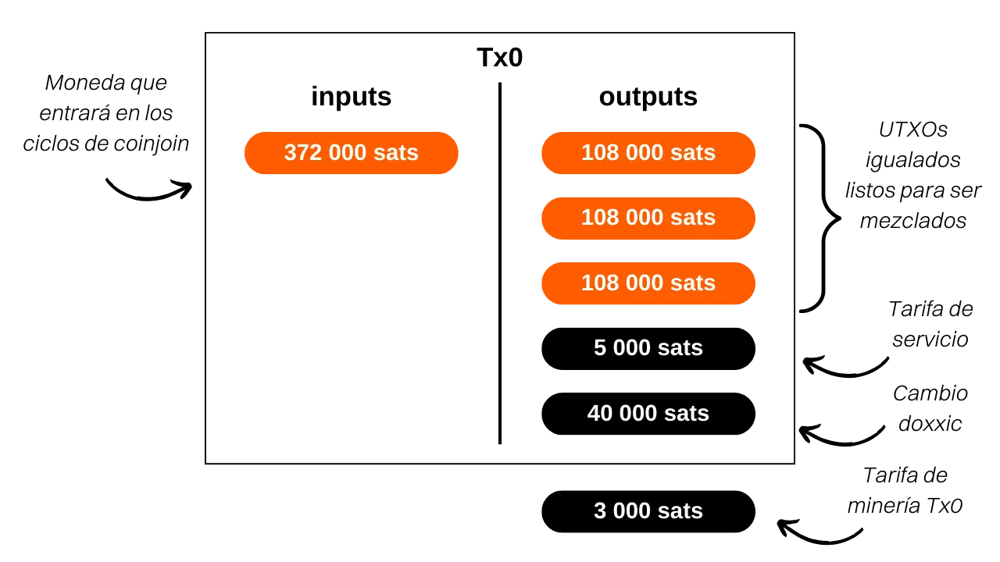
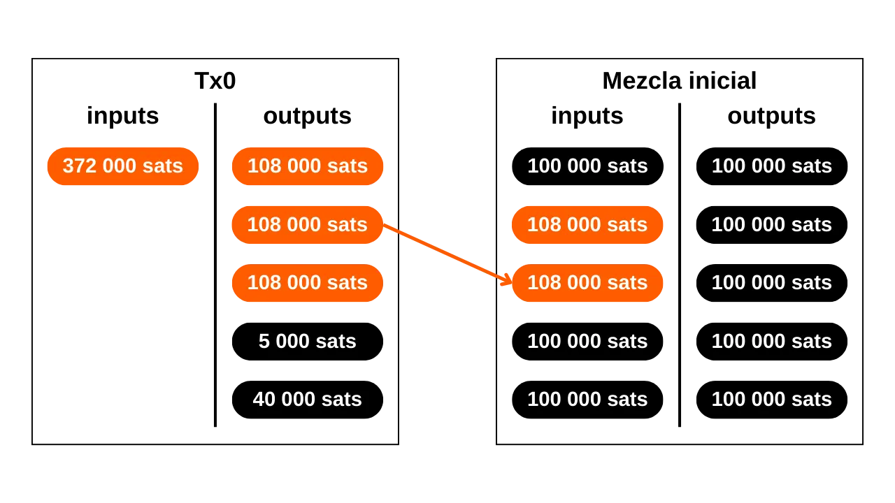
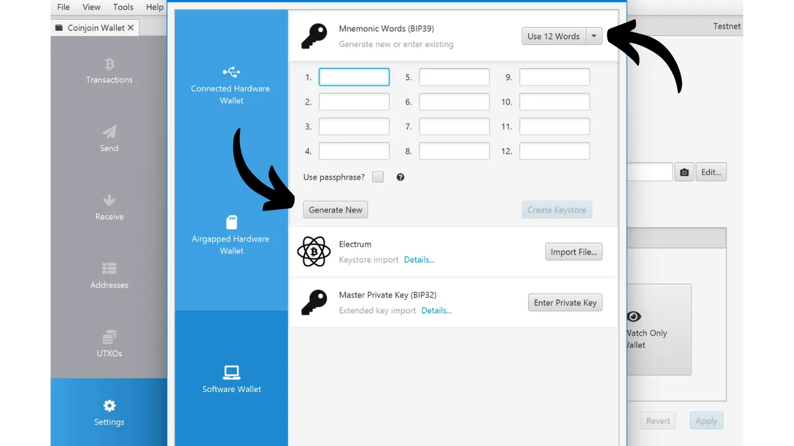
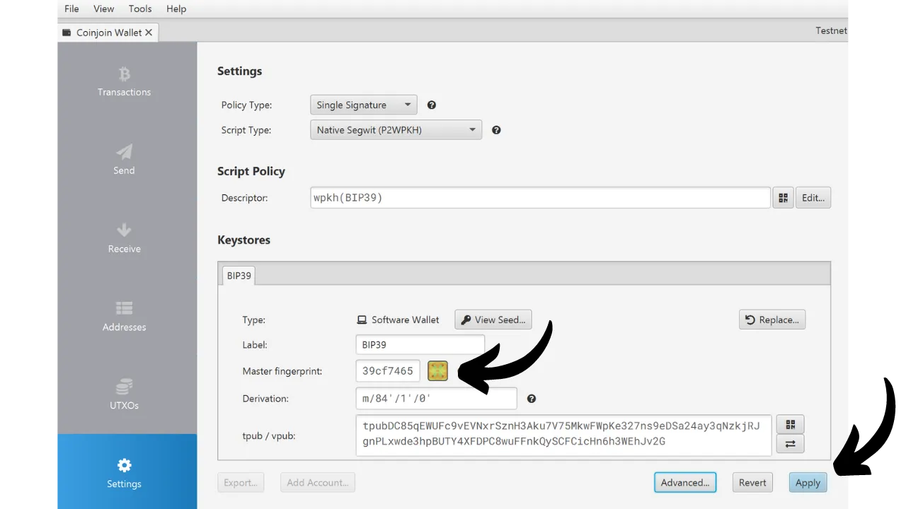
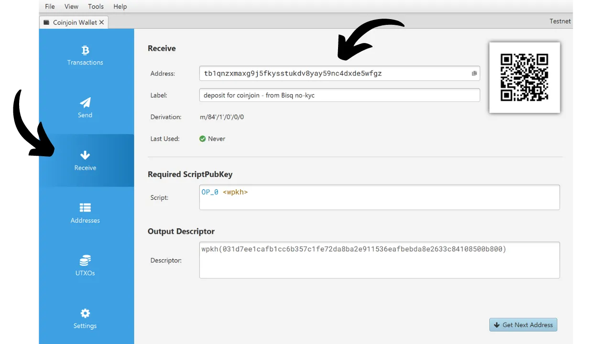
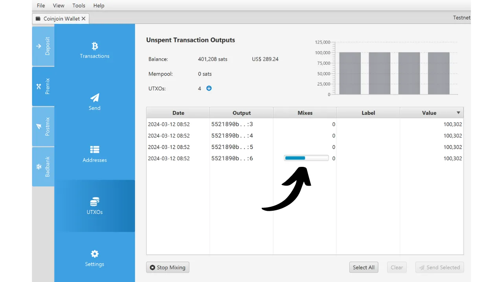
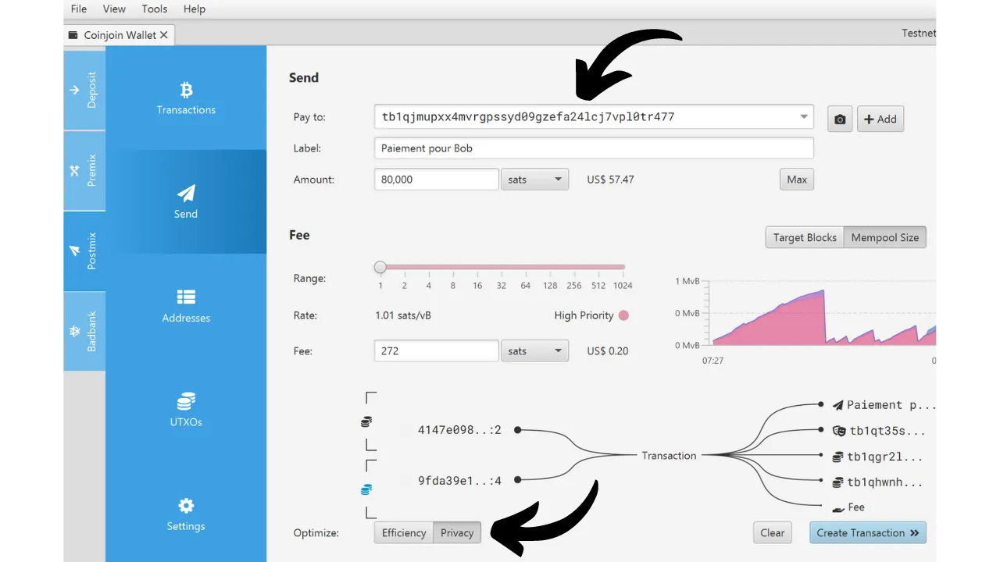
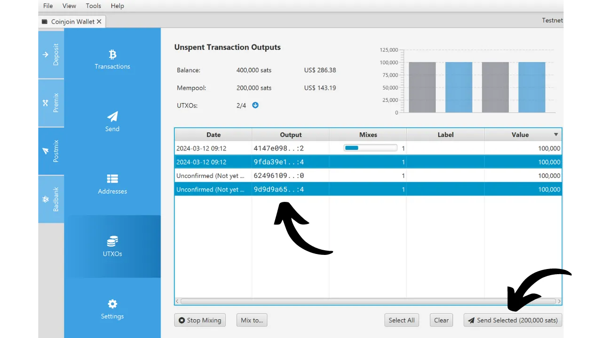
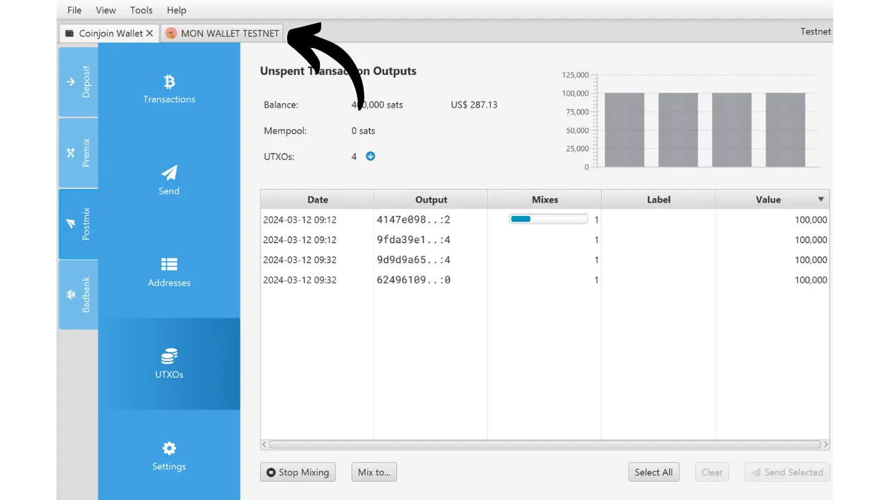
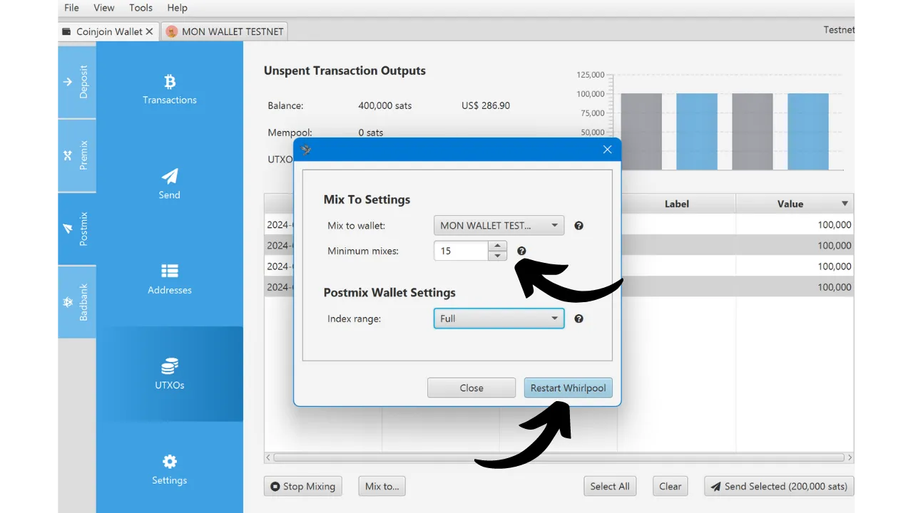

***ADVERTENCIA:** Tras la detención de los fundadores de Samourai Wallet y la incautación de sus servidores el 24 de abril, la herramienta Whirlpool ha dejado de funcionar, incluso para las personas que disponen de su propio Dojo o utilizan Sparrow Wallet. Sin embargo, sigue siendo posible que esta herramienta se reactive en las próximas semanas o se relance de una manera diferente. Además, la parte teórica de este artículo sigue siendo relevante para comprender los principios y objetivos de los coinjoins en general (no solo Whirlpool), así como la eficacia del modelo Whirlpool.*

_Estamos siguiendo de cerca la evolución de este caso así como los desarrollos relacionados con las herramientas asociadas. Ten la seguridad de que actualizaremos este tutorial a medida que estén disponibles nuevas informaciones._

_Este tutorial se proporciona únicamente con fines educativos e informativos. No respaldamos ni alentamos el uso de estas herramientas para fines criminales. Es responsabilidad de cada usuario cumplir con las leyes en su jurisdicción._

---

En este tutorial, aprenderás qué es un coinjoin y cómo realizar uno usando el software Sparrow Wallet y la implementación Whirlpool.

## ¿Qué es un coinjoin en Bitcoin?
**Un coinjoin es una técnica que rompe la trazabilidad de los bitcoins en la blockchain**. Se basa en una transacción colaborativa con una estructura específica del mismo nombre: la transacción coinjoin.

Los coinjoins mejoran la privacidad de los usuarios de Bitcoin complicando el análisis de la cadena para observadores externos. Su estructura permite fusionar múltiples monedas de diferentes usuarios en una única transacción, difuminando así los rastros y dificultando determinar los vínculos entre direcciones de entrada y salida.

El principio del coinjoin se basa en un enfoque colaborativo: varios usuarios que desean mezclar sus bitcoins depositan cantidades idénticas como entradas de la misma transacción. Estas cantidades se redistribuyen luego como salidas de igual valor a cada usuario. Al final de la transacción, se vuelve imposible asociar una salida específica con un usuario conocido en la entrada. No existe un vínculo directo entre las entradas y salidas, lo que rompe la asociación entre los usuarios y sus UTXO, así como la historia de cada moneda.


Ejemplo de una transacción coinjoin (no mía): [323df21f0b0756f98336437aa3d2fb87e02b59f1946b714a7b09df04d429dec2](https://mempool.space/es/tx/323df21f0b0756f98336437aa3d2fb87e02b59f1946b714a7b09df04d429dec2)

Para realizar un coinjoin asegurando que cada usuario retenga el control sobre sus fondos en todo momento, el proceso comienza con la construcción de la transacción por un coordinador, quien luego la transmite a cada participante. Cada usuario firma entonces la transacción después de verificar que les conviene. Todas las firmas recopiladas se integran finalmente en la transacción. Si un usuario o el coordinador intentan desviar fondos, mediante una modificación de las salidas de la transacción coinjoin, las firmas se volverán inválidas, llevando al rechazo de la transacción por los nodos.

Existen varias implementaciones de coinjoin, como Whirlpool, JoinMarket o Wabisabi, cada una con el objetivo de gestionar la coordinación entre participantes y aumentar la eficiencia de las transacciones coinjoin.

En este tutorial, nos centramos en la implementación **Whirlpool**, que considero la solución más efectiva para realizar coinjoins en Bitcoin. Aunque está disponible en varias carteras, este tutorial explora exclusivamente su uso con el software de escritorio Sparrow Wallet.
## ¿Por qué realizar CoinJoins en Bitcoin?

Uno de los problemas iniciales con cualquier sistema de pago de igual a igual es el doble gasto: ¿cómo prevenir que individuos malintencionados gasten las mismas unidades monetarias múltiples veces sin recurrir a una autoridad central para arbitraje?

Satoshi Nakamoto proporcionó una solución a este dilema a través del protocolo Bitcoin, un sistema de pago electrónico de igual a igual que opera independientemente de cualquier autoridad central. En su documento técnico, enfatiza que la única forma de certificar la ausencia de doble gasto es asegurar la visibilidad de todas las transacciones dentro del sistema de pago.

Para asegurar que cada participante esté al tanto de las transacciones, estas deben ser divulgadas públicamente. Así, el funcionamiento de Bitcoin se basa en una infraestructura transparente y distribuida, permitiendo a cualquier operador de nodo verificar la totalidad de las cadenas de firma electrónica y la historia de cada moneda, desde su creación por un minero.
La naturaleza transparente y distribuida de la blockchain de Bitcoin significa que cualquier usuario de la red puede seguir y analizar las transacciones de todos los demás participantes. En consecuencia, la anonimidad a nivel de transacción es imposible. Sin embargo, la anonimidad se preserva a nivel de identificación individual. A diferencia del sistema bancario tradicional donde cada cuenta está vinculada a una identidad personal, en Bitcoin, los fondos están asociados con pares de claves criptográficas, ofreciendo así a los usuarios una forma de pseudonimato detrás de identificadores criptográficos.
Por lo tanto, la confidencialidad en Bitcoin se ve comprometida cuando observadores externos logran asociar UTXOs específicos con usuarios identificados. Una vez que esta asociación se establece, se hace posible rastrear sus transacciones y analizar el historial de sus bitcoins. Coinjoin es precisamente una técnica desarrollada para romper la rastreabilidad de los UTXOs, ofreciendo así una cierta capa de confidencialidad a los usuarios de Bitcoin a nivel de transacción.

## ¿Cómo Funciona Whirlpool?

Whirlpool se distingue de otros métodos de coinjoin al usar transacciones "_ZeroLink_", las cuales aseguran que estrictamente no es posible ningún enlace técnico entre todas las entradas y todas las salidas. Esta mezcla perfecta se logra a través de una estructura donde cada participante contribuye con una cantidad idéntica en entrada (excepto por las tarifas de minería), generando así salidas de cantidades perfectamente iguales.

Este enfoque restrictivo en las entradas otorga a las transacciones coinjoin de Whirlpool una característica única: la total ausencia de enlaces determinísticos entre las entradas y las salidas. En otras palabras, cada salida tiene la misma probabilidad de ser atribuida a cualquier participante, en comparación con todas las otras salidas de la transacción.
Inicialmente, el número de participantes en cada coinjoin de Whirlpool estaba limitado a 5, con 2 nuevos participantes y 3 remezcladores (explicaremos estos conceptos más adelante). Sin embargo, el aumento en las tarifas de transacción en cadena observado en 2023 impulsó a los equipos de Samourai a repensar su modelo para mejorar la privacidad mientras reducen costos. Así, teniendo en cuenta la situación del mercado de tarifas y el número de participantes, el coordinador ahora puede organizar coinjoins incluyendo 6, 7 u 8 participantes. Estas sesiones mejoradas se denominan "_Ciclos de Aumento_". Es importante notar que, independientemente de la configuración, siempre hay solo 2 nuevos participantes en los coinjoins de Whirlpool.

Por lo tanto, las transacciones de Whirlpool se caracterizan por un número idéntico de entradas y salidas, que pueden ser:
- 5 entradas y 5 salidas;

- 6 entradas y 6 salidas;

- 7 entradas y 7 salidas;

- 8 entradas y 8 salidas.

El modelo propuesto por Whirlpool se basa así en pequeñas transacciones coinjoin. A diferencia de Wasabi y JoinMarket, donde la robustez de los anonsets depende del volumen de participantes en un solo ciclo, Whirlpool apuesta por la cadena de varios ciclos de tamaño pequeño.

En este modelo, el usuario incurre en tarifas solo en su entrada inicial a un pool, permitiéndoles participar en una multitud de remezclas sin tarifas adicionales. Son los nuevos participantes quienes asumen las tarifas de minería para los remezcladores.

Con cada coinjoin adicional en el que participa una moneda, junto con sus compañeros previos, los anonsets crecerán exponencialmente. El objetivo es así aprovechar estas remezclas gratuitas que, con cada ocurrencia, contribuyen a fortalecer la densidad de los anonsets asociados con cada moneda mezclada.

Whirlpool fue diseñado teniendo en cuenta dos requisitos importantes:
- La accesibilidad de implementación en dispositivos móviles, dado que Samourai Wallet es principalmente una aplicación para smartphones.
- La velocidad de los ciclos de remezcla para promover un aumento significativo en los anonsets.
Estos imperativos guiaron las elecciones de los desarrolladores de Samourai Wallet en el diseño de Whirlpool, llevándolos a limitar el número de participantes por ciclo. Demasiados pocos participantes habrían comprometido la efectividad del coinjoin, reduciendo drásticamente los anonsets generados con cada ciclo, mientras que demasiados participantes habrían planteado problemas de gestión en aplicaciones móviles y habrían impedido el flujo de ciclos.

**En última instancia, no es necesario tener un alto número de participantes por coinjoin en Whirlpool ya que los anonsets se realizan sobre la acumulación de varios ciclos de coinjoin.**
[-> Aprende más sobre los anonsets de Whirlpool.](https://planb.network/tutorials/privacy/wst-anonsets)
### Piscinas de Coinjoin y tarifas
Para asegurar que múltiples ciclos aumenten efectivamente los anonsets de las monedas mezcladas, se debe establecer un cierto marco para restringir las cantidades de UTXOs utilizados. Whirlpool define diferentes piscinas para este propósito.

Una piscina representa un grupo de usuarios que desean mezclarse juntos, quienes acuerdan la cantidad de UTXOs a usar para optimizar el proceso de coinjoin. Cada piscina especifica una cantidad fija para el UTXO, a la cual el usuario debe adherirse para participar. Así, para realizar coinjoins con Whirlpool, necesitas seleccionar una piscina. Las piscinas actualmente disponibles son las siguientes:
- 0.5 bitcoins;
- 0.05 bitcoin;
- 0.01 bitcoin;
- 0.001 bitcoin (= 100,000 sats).

Al unirte a una piscina con tus bitcoins, estos serán divididos para generar UTXOs que son perfectamente homogéneos con los de los otros participantes en la piscina. Cada piscina tiene un límite máximo; así, para cantidades que excedan este límite, te verás obligado ya sea a hacer dos entradas separadas dentro de la misma piscina o a moverte a otra piscina con una cantidad mayor:

| Piscina (bitcoin) | Cantidad máxima por entrada (bitcoin) |
|-------------------|---------------------------------------|
| 0.5               | 35                                    |
| 0.05              | 3.5                                   |
| 0.01              | 0.7                                   |
| 0.001             | 0.025                                 |

Como se mencionó anteriormente, un UTXO se considera que pertenece a una piscina cuando está listo para ser integrado en un coinjoin. Sin embargo, esto no significa que el usuario pierda la posesión de este. **A través de los diversos ciclos de mezcla, retienes el control total de tus claves y, en consecuencia, de tus bitcoins.** Esto es lo que diferencia la técnica de coinjoin de otras técnicas de mezcla centralizadas.

Para entrar en una piscina de coinjoin, se deben pagar tarifas de servicio así como tarifas de minería. Las tarifas de servicio son fijas para cada piscina y están destinadas a compensar a los equipos responsables del desarrollo y mantenimiento de Whirlpool. Para los usuarios de Sparrow Wallet, estas tarifas son transferidas por los equipos de Samourai a los desarrolladores de Sparrow.

Las tarifas de servicio para usar Whirlpool se deben pagar una vez al entrar en la piscina. Una vez completado este paso, tienes la oportunidad de participar en un número ilimitado de remezclas sin tarifas adicionales. Aquí están las tarifas fijas actuales para cada piscina:

| Pool (bitcoin) | Tarifa de Entrada (bitcoin) |
| -------------- | --------------------------- |
| 0,5            | 0,0175                      |
| 0,05           | 0,00175                     |
| 0,01           | 0,0005 (50 000 sats)        |
| 0,001          | 0,00005 (5 000 sats)        |


Estas tarifas actúan esencialmente como un boleto de entrada a la piscina elegida, independientemente de la cantidad que pongas en coinjoin. Por lo tanto, ya sea que te unas a la piscina de 0.01 con exactamente 0.01 BTC o entres con 0.5 BTC, las tarifas permanecerán iguales en valor absoluto.
Antes de proceder con coinjoins, el usuario, por lo tanto, tiene una elección entre 2 estrategias:
- Optar por una piscina más pequeña para minimizar las tarifas de servicio, sabiendo que recibirán varios UTXOs pequeños a cambio;
- O preferir una piscina más grande, aceptando pagar tarifas más altas para terminar con un número reducido de UTXOs de mayor valor.

Generalmente se aconseja en contra de fusionar varios UTXOs mezclados después de los ciclos de coinjoin, ya que esto podría comprometer la confidencialidad adquirida, especialmente debido a la Heurística de Propiedad de Entrada Común (CIOH, por sus siglas en inglés). Por lo tanto, podría ser prudente elegir una piscina más grande, incluso si eso significa pagar más, para evitar tener demasiados UTXOs de pequeño valor como salida. El usuario debe sopesar estos compromisos para elegir la piscina que prefiera.

Además de las tarifas de servicio, también se deben considerar las tarifas de minería inherentes a cualquier transacción de Bitcoin. Como usuario de Whirlpool, se te requerirá pagar las tarifas de minería para la transacción de preparación (`Tx0`) así como las del primer coinjoin. Todos los remixes subsiguientes serán gratuitos, gracias al modelo de Whirlpool que se basa en el pago de los nuevos participantes.

De hecho, en cada coinjoin de Whirlpool, dos usuarios entre las entradas son nuevos participantes. Las otras entradas provienen de remezcladores. Como resultado, las tarifas de minería para todos los participantes en la transacción son cubiertas por estos dos nuevos participantes, quienes luego también se beneficiarán de remixes gratuitos:

Gracias a este sistema de tarifas, Whirlpool realmente se diferencia de otros servicios de coinjoin ya que los anonsets de los UTXOs no son proporcionales al precio pagado por el usuario. Así, es posible alcanzar niveles de anonimato considerablemente altos pagando solo las tarifas de entrada de la piscina y las tarifas de minería para dos transacciones (la `Tx0` y la mezcla inicial).

Es importante notar que el usuario también tendrá que cubrir las tarifas de minería para retirar sus UTXOs de la piscina después de completar sus múltiples coinjoins, a menos que hayan seleccionado la opción `mix to`, la cual discutiremos en el tutorial a continuación.

### Las cuentas de billetera HD utilizadas por Whirlpool
Para realizar un coinjoin a través de Whirlpool, la billetera debe generar varias cuentas distintas. Una cuenta, en el contexto de una billetera HD (Determinista Jerárquica), constituye una sección que está completamente aislada de las demás, esta separación ocurre en el tercer nivel de profundidad de la jerarquía de la billetera, es decir, en el nivel del `xpub`.
Una billetera HD teóricamente puede derivar hasta `2^(32/2)` cuentas diferentes. La cuenta inicial, utilizada por defecto en todas las billeteras de Bitcoin, corresponde al índice `0'`.

Para billeteras adaptadas a Whirlpool, como Samourai o Sparrow, se utilizan 4 cuentas para satisfacer las necesidades del proceso de coinjoin:
- La cuenta de **depósito**, identificada por el índice `0'`;
- La cuenta de **banco malo** (o cambio tóxico), identificada por el índice `2 147 483 644'`;
- La cuenta de **premix**, identificada por el índice `2 147 483 645'`;
- La cuenta de **postmix**, identificada por el índice `2 147 483 646'`.

Cada una de estas cuentas cumple una función específica dentro del coinjoin.
Todas estas cuentas están vinculadas a una semilla única, lo que permite al usuario recuperar el acceso a todos sus bitcoins utilizando su frase de recuperación y, si aplica, su contraseña. Sin embargo, es necesario especificar al software, durante esta operación de recuperación, los diferentes índices de cuenta que se utilizaron.
Ahora veamos las diferentes etapas de un coinjoin de Whirlpool dentro de estas cuentas.

### Las diferentes etapas de coinjoins en Whirlpool
**Etapa 1: El Tx0**
El punto de partida de cualquier coinjoin de Whirlpool es la cuenta de **depósito**. Esta cuenta es la que automáticamente usas cuando creas una nueva cartera de Bitcoin. Esta cuenta debe ser acreditada con los bitcoins que deseas mezclar.

El `Tx0` representa la primera etapa del proceso de mezcla de Whirlpool. Su objetivo es preparar e igualar los UTXOs para el coinjoin, dividiéndolos en unidades correspondientes a la cantidad del pool seleccionado, para asegurar la homogeneidad de la mezcla. Los UTXOs igualados son entonces enviados a la cuenta de **premezcla**. En cuanto a la diferencia que no puede entrar en el pool, se separa en una cuenta específica: el **banco malo** (o "cambio tóxico").

Esta transacción inicial `Tx0` también sirve para liquidar las tarifas de servicio debidas al coordinador de la mezcla. A diferencia de las etapas siguientes, esta transacción no es colaborativa; el usuario debe asumir por completo las tarifas de minería:

En este ejemplo de una transacción `Tx0`, una entrada de `372,000 sats` de nuestra cuenta de **depósito** se divide en varios UTXOs salientes, que se distribuyen de la siguiente manera:
- Una cantidad de `5,000 sats` destinada al coordinador por tarifas de servicio, correspondiente a la entrada en el pool de `100,000 sats`;
- Tres UTXOs preparados para la mezcla, redirigidos a nuestra cuenta de **premezcla** y registrados con el coordinador. Estos UTXOs se igualan en `108,000 sats` cada uno, para cubrir las tarifas de minería de su futura mezcla inicial;
- El excedente, que no puede entrar en el pool porque es demasiado pequeño, se considera cambio tóxico. Se envía a su cuenta específica. Aquí, este cambio asciende a `40,000 sats`;
- Finalmente, hay `3,000 sats` que no constituyen una salida, pero son las tarifas de minería necesarias para confirmar el `Tx0`.

Por ejemplo, aquí hay un Tx0 de Whirlpool real (que no proviene de mí): [edef60744f539483d868caff49d4848e5cc6e805d6cdc8d0f9bdbbaedcb5fc46](https://mempool.space/es/tx/edef60744f539483d868caff49d4848e5cc6e805d6cdc8d0f9bdbbaedcb5fc46)

**Etapa 2: El Cambio Tóxico**
El excedente, al no haber podido integrarse en el pool, aquí equivalente a `40,000 sats`, se redirige a la cuenta del **banco malo**, también referido como "cambio tóxico", para asegurar una separación estricta de los otros UTXOs en la cartera.

Este UTXO es peligroso para la privacidad del usuario porque no solo está siempre vinculado a su pasado, y por lo tanto posiblemente a la identidad de su propietario, sino que además, se señala como perteneciente a un usuario que ha realizado un coinjoin.
Si este UTXO se fusiona con salidas mezcladas, estas últimas perderán toda la privacidad ganada durante los ciclos de coinjoin, notablemente debido al CIOH (*Common-Input-Ownership-Heuristic*). Si se fusiona con otros cambios tóxicos, el usuario corre el riesgo de perder privacidad ya que esto vinculará las diferentes entradas de los ciclos de coinjoin. Por lo tanto, debe ser tratado con precaución. La manera de gestionar este UTXO tóxico se detallará en la última parte de este artículo, y futuros tutoriales profundizarán en estos métodos en la Red PlanB.
**Paso 3: La Mezcla Inicial**
Después de completar el `Tx0`, los UTXOs igualados se envían a la cuenta de **premix** de nuestra billetera, listos para ser introducidos en su primer ciclo de coinjoin, también llamado "mezcla inicial". Si, como en nuestro ejemplo, el `Tx0` genera múltiples UTXOs destinados a la mezcla, cada uno de ellos será integrado en un coinjoin inicial separado.
Al final de estas mezclas iniciales, la cuenta de **premix** estará vacía, mientras que nuestras monedas, habiendo pagado las tarifas de minería para este primer coinjoin, se ajustarán exactamente a la cantidad definida por el pool elegido. En nuestro ejemplo, nuestros UTXOs iniciales de `108 000 sats` se habrán reducido exactamente a `100 000 sats`.

**Paso 4: Los Remixes**
Después de la mezcla inicial, los UTXOs se transfieren a la cuenta de **postmix**. Esta cuenta reúne los UTXOs ya mezclados y aquellos que esperan ser remezclados. Cuando el cliente Whirlpool está activo, los UTXOs ubicados en la cuenta de **postmix** están automáticamente disponibles para ser remezclados y serán elegidos aleatoriamente para participar en estos nuevos ciclos.

Como recordatorio, los remixes son entonces 100% gratuitos: no se requieren tarifas de servicio adicionales ni tarifas de minería. Mantener los UTXOs en la cuenta de **postmix** mantiene así su valor intacto, y al mismo tiempo mejora sus anonsets. Por eso es importante permitir que estas monedas participen en múltiples ciclos de coinjoin. No te cuesta absolutamente nada, y aumenta sus niveles de anonimato.

Cuando decidas gastar UTXOs mezclados, puedes hacerlo directamente desde esta cuenta de **postmix**. Es aconsejable mantener los UTXOs mezclados en esta cuenta para beneficiarse de los remixes gratuitos y para evitar que salgan del circuito Whirlpool, lo que podría disminuir su privacidad.

Como veremos en el siguiente tutorial, también existe la opción de `mix to` que ofrece la posibilidad de enviar automáticamente tus monedas mezcladas a otra billetera, como una billetera fría, después de un número definido de coinjoins.

Después de discutir la teoría, ¡sumergámonos en la práctica con un tutorial sobre cómo usar Whirlpool a través del software de escritorio Sparrow Wallet!

## Tutorial: Coinjoin Whirlpool en Sparrow Wallet
Hay numerosas opciones para usar Whirlpool. La primera que quiero presentarte es la opción de Sparrow Wallet, un software de gestión de billeteras Bitcoin de código abierto para PC.
Usar Sparrow tiene la ventaja de ser bastante fácil de comenzar, rápido de configurar y no requiere más equipo que una computadora y una conexión a internet. Sin embargo, hay una desventaja notable: los coinjoins solo ocurrirán cuando Sparrow esté lanzado y conectado. Esto significa que si quieres mezclar y remezclar tus bitcoins 24/7, necesitarás mantener tu computadora encendida constantemente.

### Instalar Sparrow Wallet
Para comenzar, obviamente necesitarás el software Sparrow Wallet. Puedes descargarlo directamente desde [el sitio oficial](https://sparrowwallet.com/download/) o en [su GitHub](https://github.com/sparrowwallet/sparrow/releases).
Antes de instalar el software, será importante verificar la firma e integridad del ejecutable que acabas de descargar. Si deseas más detalles sobre el proceso de instalación y verificación del software Sparrow, te aconsejo leer este otro tutorial: *[Las Guías de Sparrow Wallet](https://planb.network/tutorials/wallet/sparrow)*.

### Crear una Cartera de Software
Después de instalar el software, necesitarás proceder con la creación de una cartera de Bitcoin. Es importante notar que para participar en coinjoins, el uso de una cartera de software (también llamada "cartera caliente") es esencial. Por lo tanto, **no será posible realizar coinjoins con una cartera asegurada por una cartera de hardware**.

Aunque no es imperativo, en caso de que planees mezclar cantidades significativas, se recomienda encarecidamente optar por el uso de una fuerte frase de paso BIP39 para esta cartera.

Para crear una nueva cartera, abre Sparrow, luego haz clic en la pestaña `File` y `New Wallet`.


Elige un nombre para esta cartera, por ejemplo: "Cartera Coinjoin". Haz clic en el botón `Create Wallet`.


Deja la configuración predeterminada, luego haz clic en el botón `New or Imported Software Wallet`.


Cuando accedas a la ventana de creación de cartera, recomiendo elegir una secuencia de 12 palabras, ya que es ampliamente suficiente. Selecciona `Generate New` para generar una nueva frase de recuperación, y haz clic en `Use Passphrase` si deseas agregar una frase de paso BIP39. Es importante hacer una copia de seguridad física de tu información de recuperación, ya sea en papel o en un soporte de metal, para asegurar la seguridad de tus bitcoins.


Asegura la validez de tu copia de seguridad de la frase de recuperación antes de hacer clic en `Confirm Backup...`. Sparrow te pedirá entonces que ingreses tu frase nuevamente para verificar que la has tomado nota. Una vez completado este paso, continúa haciendo clic en `Create Keystore`.


Deja la ruta de derivación sugerida como predeterminada y presiona `Import Keystore`. En mi ejemplo, la ruta de derivación difiere ligeramente ya que estoy usando el Testnet para este tutorial. La ruta de derivación que debería aparecer para ti es la siguiente:
```plaintext
m/84'/0'/0'
```


Después de eso, Sparrow mostrará los detalles de derivación de tu nueva cartera. En caso de que hayas establecido una frase de paso, se recomienda encarecidamente anotar tu `Master fingerprint`. Aunque esta huella digital de la clave maestra no es un dato sensible, te será útil para verificar más tarde que efectivamente estás accediendo a la cartera correcta y para confirmar la ausencia de errores al ingresar tu frase de paso.

Haz clic en el botón `Apply`.



Sparrow te invita a crear una contraseña para tu cartera. Esta contraseña será requerida para acceder a ella a través del software Sparrow Wallet. Elige una contraseña fuerte, haz una copia de seguridad de la misma y luego haz clic en `Set Password`.


### Recibiendo bitcoins
Después de crear tu billetera, inicialmente tendrás una sola cuenta, con el índice `0'`. Esta es la cuenta de **depósito** de la que hablamos en las partes anteriores. Esta es la cuenta a la que necesitarás enviar los bitcoins para mezclar.
Para hacer esto, selecciona la pestaña `Receive` en el lado izquierdo de la ventana. Sparrow generará automáticamente una nueva dirección en blanco para recibir bitcoins.



Puedes ingresar una etiqueta para esta dirección y luego enviar los bitcoins a ser mezclados a ella.


### Realizando la Tx0
Una vez que tu transacción esté confirmada, puedes ir a la pestaña `UTXOs`.


A continuación, elige el(los) UTXO(s) que deseas someter a los ciclos de coinjoin. Para seleccionar múltiples UTXOs simultáneamente, mantén presionada la tecla `Ctrl` mientras haces clic en los UTXOs de tu elección.


Luego haz clic en el botón `Mix Selected` en la parte inferior de la ventana. Si este botón no aparece en tu interfaz, es porque estás en una billetera asegurada con una billetera de hardware. Necesitas usar una billetera de software para realizar coinjoins con Sparrow.

Se abre una ventana para explicar cómo funciona Whirlpool. Esto es una simplificación de lo que expliqué en las partes anteriores. Haz clic en `Next` para continuar.


En la siguiente página, puedes ingresar un "SCODE" si tienes uno. Un SCODE es un código promocional que ofrece un descuento en las tarifas de servicio de la piscina. Samourai Wallet ocasionalmente proporciona tales códigos a sus usuarios durante eventos especiales. Te aconsejo que [sigas a Samourai Wallet](https://twitter.com/SamouraiWallet) en las redes sociales para que no te pierdas futuros SCODES.

En la misma página, también necesitarás establecer la tasa de tarifa para la `Tx0` y tu mezcla inicial. Esta elección influirá en la velocidad de confirmación de tu transacción preparatoria y tu primer coinjoin. Recuerda que eres responsable de las tarifas de minería para la `Tx0` y la mezcla inicial, pero no deberás tarifas de minería para las remezclas subsiguientes. Ajusta el deslizador de `Premix Priority` según tus preferencias, luego haz clic en `Next`.


En esta nueva ventana, tendrás la opción de seleccionar la piscina a la que deseas entrar usando la lista desplegable. En mi caso, habiendo seleccionado inicialmente un UTXO de `456 214 sats`, mi única opción posible es la piscina de `100 000 sats`. Esta interfaz también te informa sobre las tarifas de servicio a pagar, así como el número de UTXOs que se integrarán en la piscina. Si las condiciones te parecen satisfactorias, continúa haciendo clic en `Preview Premix`.


Después de este paso, Sparrow te pedirá que ingreses la contraseña de tu billetera, la que estableciste al crearla en el software. Una vez ingresada la contraseña, accederás a la vista previa de tu `Tx0`. En el lado izquierdo de tu ventana, verás que Sparrow ha generado las diferentes cuentas necesarias para usar Whirlpool (`Deposit`, `Premix`, `Postmix` y `Badbank`). También tendrás la oportunidad de ver la estructura de tu `Tx0`, con los diferentes outputs:
- Las tarifas de servicio;
- Los UTXOs ecualizados destinados a entrar en el pool; - El cambio tóxico (Doxxic Change).


Si la transacción es de tu agrado, haz clic en `Broadcast Transaction` para transmitir tu `Tx0`. De lo contrario, tienes la opción de ajustar los parámetros de este `Tx0` seleccionando `Clear` para borrar los datos ingresados y comenzar el proceso de creación desde el principio.

### Realizando Coinjoins
Una vez que el Tx0 se transmite, encontrarás tus UTXOs listos para ser mezclados en la cuenta `Premix`.


Una vez que el `Tx0` esté confirmado, tus UTXOs se registrarán con el coordinador, y las mezclas iniciales comenzarán automáticamente en sucesión.



Al revisar la cuenta `Postmix`, observarás los UTXOs resultantes de las mezclas iniciales. Estas monedas permanecerán listas para sucesivas remezclas, lo cual no incurrirá en tarifas adicionales.


En la columna `Mixes`, es posible ver el número de coinjoins realizados por cada una de tus monedas. Como veremos en las siguientes secciones, lo que verdaderamente importa no es tanto el número de remezclas per se, sino más bien los anonsets asociados, aunque estos dos indicadores están parcialmente relacionados.


Para detener temporalmente los coinjoins, simplemente haz clic en `Stop Mixing`. Tendrás la opción de reanudar las operaciones en cualquier momento seleccionando `Start Mixing`.


Para asegurar la disponibilidad continua de tus UTXOs para la remezcla, es necesario mantener activo el software Sparrow. Cerrar el software o apagar tu computadora pausará los coinjoins. Una solución para eludir este problema es desactivar las funciones de suspensión a través de la configuración de tu sistema operativo. Además, Sparrow ofrece una opción para evitar que tu computadora se suspenda automáticamente, la cual puedes encontrar bajo la pestaña `Tools` titulada `Prevent Computer Sleep`.


### Completando los coinjoins
Para gastar tus bitcoins mezclados, tienes varias opciones. El método más directo es acceder a la cuenta `Postmix` y seleccionar la pestaña `Send`.


En esta sección, tendrás la opción de ingresar la dirección de destino, la cantidad a enviar y las tarifas de transacción, de la misma manera que para cualquier otra transacción realizada con Sparrow Wallet. Si lo deseas, también puedes aprovechar características avanzadas de privacidad como Stonewall, haciendo clic en el botón `Privacy`.



[-> Aprende más sobre las transacciones Stonewall.](https://planb.network/tutorials/privacy/stonewall)

Si deseas hacer una selección más precisa de tus monedas para gastar, ve a la pestaña `UTXOs`. Selecciona los UTXOs que específicamente deseas consumir, luego presiona el botón `Send Selected` para iniciar la transacción.


Finalmente, la opción `Mix to...` disponible en Sparrow permite la eliminación automática de un UTXO seleccionado de los ciclos de coinjoin, sin incurrir en tarifas adicionales. Esta característica posibilita la determinación de un número de remezclas después del cual el UTXO no será reintegrado en tu cuenta de `Postmix`, sino que en su lugar será transferido directamente a otra cartera. Esta opción se utiliza a menudo para enviar automáticamente bitcoins mezclados a una cartera fría. Para usar esta opción, comienza por abrir la cartera receptora junto a tu cartera de coinjoin dentro del software Sparrow.



Luego, ve a la pestaña `UTXOs`, y selecciona las monedas que te interesan, luego haz clic en el botón `Mix to...` en la parte inferior de la ventana.


Se abre una ventana, comienza seleccionando la cartera de destino de la lista desplegable.


Elige el umbral de coinjoin más allá del cual el retiro se realizará automáticamente. No puedo darte un número exacto de remezclas a realizar, ya que esto varía según tu situación personal y tus objetivos de privacidad, pero evita elegir un umbral demasiado bajo. Recomiendo consultar este otro artículo para aprender más sobre el proceso de remezcla: [REMIX - WHIRLPOOL](https://planb.network/tutorials/privacy/remix-whirlpool).

Puedes dejar la opción de `Index range` en su valor predeterminado, `Full`. Esta función permite mezclar simultáneamente desde diferentes clientes, pero eso no es lo que queremos hacer en este tutorial. Para finalizar y activar la opción `Mix to...`, presiona `Restart Whirlpool`.



Sin embargo, ten cuidado al usar la opción `Mix to`, ya que retirar monedas mezcladas de tu cuenta `Postmix` puede aumentar significativamente el riesgo de comprometer tu privacidad. Las razones de este potencial se detallan en las siguientes secciones.

## ¿Cómo conocer la calidad de nuestros ciclos de coinjoin?
Para que un coinjoin sea verdaderamente efectivo, es esencial que presente una buena homogeneidad entre las cantidades de entradas y salidas. Esta uniformidad amplifica el número de posibles interpretaciones a los ojos de un observador externo, aumentando así la incertidumbre alrededor de la transacción. Para cuantificar esta incertidumbre generada por un coinjoin, se puede recurrir a calcular la entropía de la transacción. Para una exploración en profundidad de estos indicadores, te remito al tutorial: [BOLTZMANN CALCULATOR](https://planb.network/es/tutorials/privacy/boltzmann-entropy). El modelo Whirlpool es reconocido como el que aporta más homogeneidad en los coinjoins.
A continuación, el rendimiento de varios ciclos de coinjoin se evalúa en base al tamaño de los grupos en los que se oculta una moneda. El tamaño de estos grupos define lo que se llama los anonsets. Hay dos tipos de anonsets: el primero evalúa la privacidad ganada contra el análisis retrospectivo (del presente al pasado) y el segundo, contra el análisis prospectivo (del pasado al presente). Para una explicación detallada de estos dos indicadores, te invito a consultar el tutorial: [WHIRLPOOL STATS TOOLS - ANONSETS](https://planb.network/tutorials/privacy/wst-anonsets).

## ¿Cómo gestionar el postmix?
Después de realizar ciclos de coinjoin, la mejor estrategia es mantener tus UTXOs en la cuenta de **postmix**, esperando su uso futuro. Incluso es aconsejable dejarlos remezclar indefinidamente hasta que necesites gastarlos.
Algunos usuarios podrían considerar transferir sus bitcoins mezclados a una cartera asegurada por un monedero hardware. Esto es posible, pero es importante seguir meticulosamente las recomendaciones de Samourai Wallet para no comprometer la confidencialidad adquirida.
La fusión de UTXOs es el error más frecuentemente cometido. Es necesario evitar combinar UTXOs mezclados con UTXOs no mezclados en la misma transacción, para evitar el CIOH (*Common-Input-Ownership-Heuristic*). Esto requiere una gestión cuidadosa de tus UTXOs dentro de tu cartera, especialmente en términos de etiquetado. Más allá del coinjoin, fusionar UTXOs generalmente es una mala práctica que a menudo conduce a una pérdida de privacidad cuando no se gestiona adecuadamente.

También es importante ser cauteloso al consolidar UTXOs mezclados entre sí. Las consolidaciones moderadas son concebibles si tus UTXOs mezclados tienen anonsets significativos, pero esto inevitablemente disminuirá la confidencialidad de tus monedas. Asegúrate de que las consolidaciones no sean demasiado grandes ni se realicen después de un número insuficiente de remezclas, ya que esto arriesga establecer enlaces deducibles entre tus UTXOs antes y después de los ciclos de coinjoin. En caso de duda sobre estas manipulaciones, la mejor práctica es no consolidar los UTXOs postmezcla, y transferirlos uno por uno a tu monedero hardware, generando una nueva dirección en blanco cada vez. Nuevamente, recuerda etiquetar adecuadamente cada UTXO recibido.
También se aconseja contra la transferencia de tus UTXOs postmezcla a una cartera que use scripts poco comunes. Por ejemplo, si ingresas a Whirlpool desde una cartera multisig que usa scripts `P2WSH`, hay pocas posibilidades de que seas mezclado con otros usuarios que tengan originalmente el mismo tipo de cartera. Si retiras tu postmezcla a esta misma cartera multisig, el nivel de privacidad de tus bitcoins mezclados se reducirá considerablemente. Más allá de los scripts, hay muchas otras huellas de cartera que pueden engañarte.
Como con cualquier transacción de Bitcoin, también es importante no reutilizar las direcciones de recepción. Cada nueva transacción debe ser recibida en una nueva dirección en blanco.

La solución más simple y segura es dejar tus UTXOs mezclados descansar en su cuenta **postmix**, permitiéndoles remezclarse y solo tocarlos para gastar. Las carteras Samourai y Sparrow tienen protecciones adicionales contra todos estos riesgos relacionados con el análisis de cadena. Estas protecciones te ayudan a evitar cometer errores.

## ¿Cómo gestionar el cambio tóxico?
A continuación, necesitas ser cuidadoso al gestionar el cambio tóxico, el cambio que no pudo entrar en la piscina de coinjoin. Estos UTXOs tóxicos, resultantes del uso de Whirlpool, representan un riesgo para tu privacidad ya que establecen un enlace entre tú y el uso de coinjoin. Por lo tanto, es imperativo manejarlos con cuidado y no combinarlos con otros UTXOs, especialmente UTXOs mezclados. Aquí hay diferentes estrategias a considerar para usarlos:
- **Mezclarlos en piscinas más pequeñas:** Si tu UTXO tóxico es lo suficientemente significativo como para entrar solo en una piscina más pequeña, considera mezclarlo. Esta es a menudo la mejor opción. Sin embargo, es crucial no fusionar varios UTXOs tóxicos para acceder a una piscina, ya que esto podría vincular tus diferentes entradas;
- **Marcarlos como "no gastables":** Otro enfoque es dejar de usarlos, marcarlos como "no gastables" en su cuenta dedicada y simplemente Hodl. Esto asegura que no los gastes accidentalmente. Si el valor del bitcoin aumenta, podrían surgir nuevas piscinas más adecuadas para tus UTXOs tóxicos.
- **Hacer donaciones:** Considera hacer donaciones, incluso modestas, a los desarrolladores que trabajan en Bitcoin y su software asociado. También puedes donar a organizaciones que aceptan BTC. Si gestionar tus UTXOs tóxicos parece demasiado complicado, puedes simplemente deshacerte de ellos haciendo una donación.
- **Comprar Tarjetas de Regalo:** Plataformas como [Bitrefill](https://www.bitrefill.com/) te permiten intercambiar bitcoins por tarjetas de regalo que pueden ser utilizadas en varios comercios. Esto puede ser una manera de deshacerte de tus UTXOs tóxicos sin perder el valor asociado.
- **Consolidarlos en Monero:** Samourai Wallet ahora ofrece un servicio de intercambio atómico entre BTC y XMR. Esto es ideal para gestionar UTXOs tóxicos consolidándolos en Monero, sin comprometer tu privacidad a través del CIOH, antes de enviarlos de vuelta a Bitcoin. Sin embargo, esta opción puede ser costosa en términos de tarifas de minería y el premium debido a restricciones de liquidez.
- **Enviarlos a la Red Lightning:** Transferir estos UTXOs a la Red Lightning para beneficiarse de tarifas de transacción reducidas es una opción que podría ser interesante. Sin embargo, este método puede revelar cierta información dependiendo de tu uso de Lightning y, por lo tanto, debe practicarse con precaución.

Tutoriales detallados sobre la implementación de estas diferentes técnicas se ofrecerán pronto en PlanB Network.

**Recursos Adicionales:**
- [Tutorial en Video de Sparrow Wallet](https://planb.network/tutorials/wallet/sparrow);
- [Tutorial en Video de Samourai Wallet](https://planb.network/tutorials/wallet/samourai);
- [Documentación de Samourai Wallet - Whirlpool](https://docs.samourai.io/whirlpool/basic-concepts);
- [Hilo en Twitter sobre CoinJoins](https://twitter.com/SamouraiWallet/status/1489220847336308739);
- [Publicación en Blog sobre CoinJoins](https://www.pandul.fr/post/comprendre-et-utiliser-le-coinjoin-sur-bitcoin).