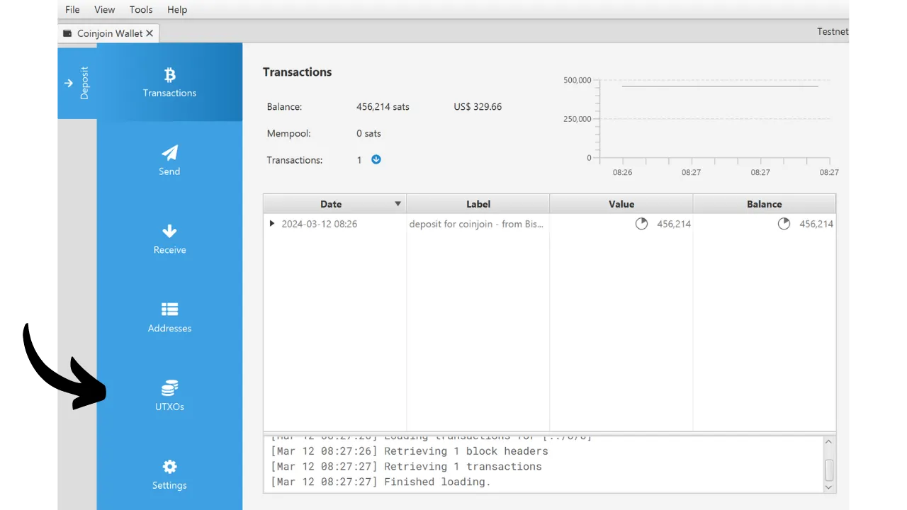
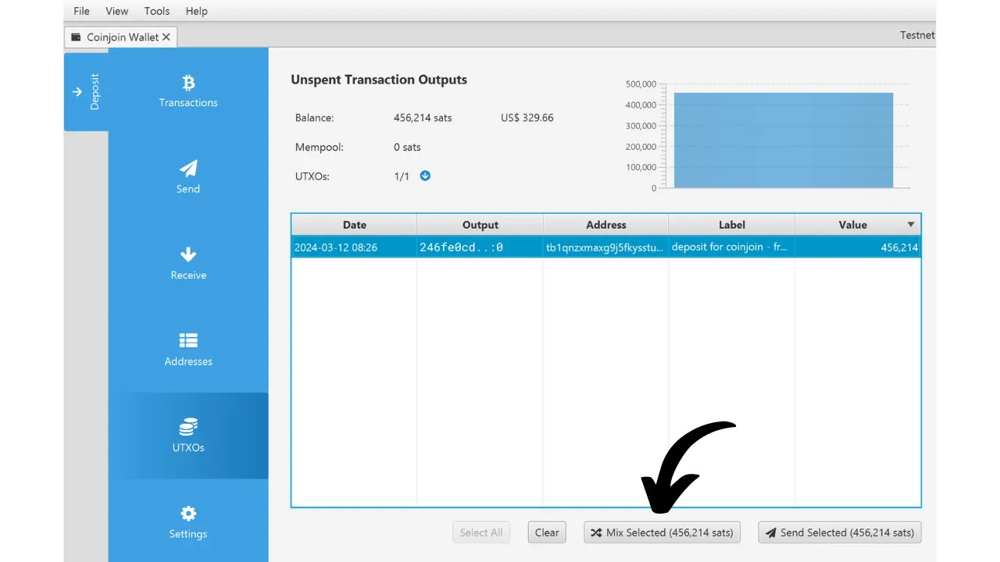
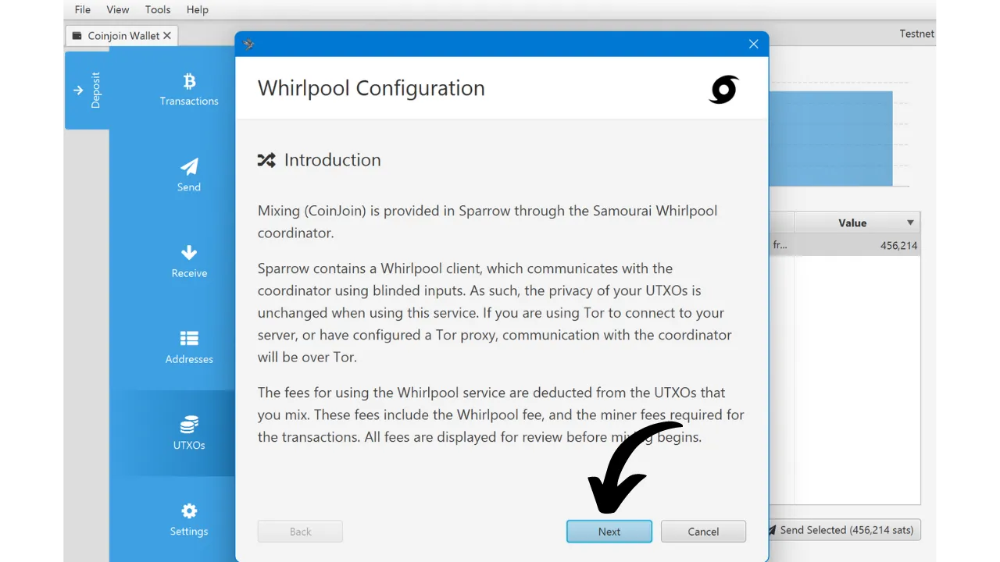
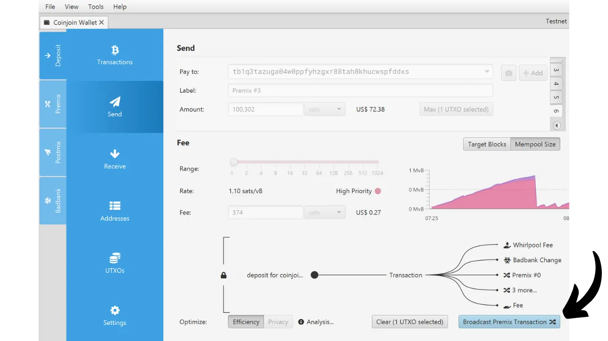
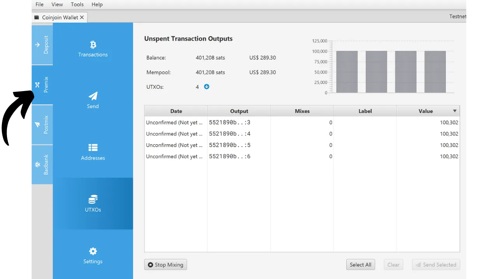

***VAROITUS:** Samourai Walletin perustajien pidätyksen ja heidän palvelimiensa takavarikoinnin jälkeen 24. huhtikuuta Whirlpool-työkalu ei enää toimi, edes niille käyttäjille, jotka omistavat oman Dojon tai käyttävät Sparrow Walletia. On kuitenkin mahdollista, että tämä työkalu voidaan palauttaa käyttöön tulevina viikkoina tai käynnistää uudelleen eri tavalla. Lisäksi tämän artikkelin teoreettinen osa pysyy relevanttina ymmärtämään yleisesti coinjoinien periaatteita ja tavoitteita (ei pelkästään Whirlpool), sekä ymmärtämään Whirlpool-mallin tehokkuutta.*

_Seuraamme tiiviisti tämän tapauksen kehitystä sekä siihen liittyvien työkalujen kehitystä. Voitte olla varmoja, että päivitämme tämän oppaan uuden tiedon saataville tullessa._

_Tämä opas on tarkoitettu vain koulutus- ja tiedotustarkoituksiin. Emme kannusta tai hyväksy näiden työkalujen käyttöä rikollisiin tarkoituksiin. Jokaisen käyttäjän on noudatettava oman lainkäyttöalueensa lakeja._

---

Tässä oppaassa opit, mikä coinjoin on ja miten suorittaa sellainen käyttäen Sparrow Wallet -ohjelmistoa ja Whirlpool-toteutusta.

## Mikä on coinjoin Bitcoinissa?
**Coinjoin on tekniikka, joka katkaisee bitcoinien jäljitettävyyden lohkoketjussa**. Se perustuu yhteistyöhön perustuvaan transaktioon, jolla on erityinen rakenne, joka tunnetaan samalla nimellä: coinjoin-transaktio.

Coinjoinit parantavat Bitcoin-käyttäjien yksityisyyttä vaikeuttamalla ketjuanalyysiä ulkopuolisille tarkkailijoille. Niiden rakenne mahdollistaa useiden eri käyttäjien kolikoiden yhdistämisen yhdeksi transaktioksi, mikä hämärtää jälkiä ja tekee vaikeaksi määrittää syötteiden ja tuotosten välisiä yhteyksiä.

Coinjoinin periaate perustuu yhteistyöhön: useat käyttäjät, jotka haluavat sekoittaa bitcoinejaan, tallettavat identtisiä määriä saman transaktion syötteiksi. Nämä määrät jaetaan sitten tuotoksina samanarvoisina jokaiselle käyttäjälle. Transaktion lopussa on mahdotonta yhdistää tiettyä tuotosta tunnettuun käyttäjään syötteessä. Syötteiden ja tuotosten välillä ei ole suoraa yhteyttä, mikä katkaisee yhteyden käyttäjien ja heidän UTXO:nsa välillä sekä jokaisen kolikon historian.


Esimerkki coinjoin-transaktiosta (ei minulta): [323df21f0b0756f98336437aa3d2fb87e02b59f1946b714a7b09df04d429dec2](https://mempool.space/en/tx/323df21f0b0756f98336437aa3d2fb87e02b59f1946b714a7b09df04d429dec2)

Jotta coinjoin voidaan suorittaa samalla kun varmistetaan, että jokainen käyttäjä säilyttää hallinnan varoistaan koko ajan, prosessi alkaa transaktion rakentamisella koordinaattorin toimesta, joka sitten lähettää sen jokaiselle osallistujalle. Jokainen käyttäjä allekirjoittaa transaktion sen jälkeen, kun on varmistanut, että se sopii heille. Kaikki kerätyt allekirjoitukset integroidaan lopulta transaktioon. Jos käyttäjä tai koordinaattori yrittää ohjata varoja pois muuttamalla coinjoin-transaktion tuotoksia, allekirjoitukset osoittautuvat mitättömiksi, mikä johtaa transaktion hylkäämiseen solmujen toimesta.

Coinjoinin toteutuksia on useita, kuten Whirlpool, JoinMarket tai Wabisabi, joiden tavoitteena on hallita osallistujien koordinointia ja lisätä coinjoin-transaktioiden tehokkuutta.
Tässä oppaassa keskitymme **Whirlpool**-toteutukseen, jonka pidän tehokkaimpana ratkaisuna coinjoinien suorittamiseen Bitcoinissa. Vaikka se on saatavilla useissa lompakoissa, tämä opas tutkii yksinomaan sen käyttöä Sparrow Wallet Desktop -ohjelmistossa.

## Miksi suorittaa CoinJoineja Bitcoinissa?

Yksi alkuperäisistä ongelmista minkä tahansa vertaisverkkomaksujärjestelmän kanssa on kaksinkertainen kulutus: miten estää pahantahtoisia henkilöitä kuluttamasta samoja rahayksiköitä useita kertoja ilman, että turvaudutaan keskusviranomaiseen välittäjänä?

Satoshi Nakamoto tarjosi ratkaisun tähän dilemmaan Bitcoin-protokollan kautta, vertaisverkkoon perustuvan elektronisen maksujärjestelmän, joka toimii riippumatta mistään keskusviranomaisesta. Hänen valkoisessa kirjassaan hän korostaa, että ainoa tapa todentaa kaksinkertaisen kulutuksen puuttuminen on varmistaa kaikkien maksujärjestelmän sisäisten transaktioiden näkyvyys.

Jotta jokainen osallistuja olisi tietoinen transaktioista, ne on julkaistava julkisesti. Näin ollen Bitcoinin toiminta perustuu läpinäkyvään ja hajautettuun infrastruktuuriin, joka mahdollistaa minkä tahansa solmutoimijan tarkistaa kaikkien elektronisten allekirjoitusten ketjut ja kunkin kolikon historian sen luomisesta kaivostyöntekijän toimesta.

Bitcoinin lohkoketjun läpinäkyvä ja hajautettu luonne tarkoittaa, että mikä tahansa verkon käyttäjä voi seurata ja analysoida kaikkien muiden osallistujien transaktioita. Tämän seurauksena anonymiteetti transaktiotasolla on mahdotonta. Anonymiteetti säilyy kuitenkin yksilöiden tunnistamisen tasolla. Toisin kuin perinteisessä pankkijärjestelmässä, jossa jokainen tili on linkitetty henkilöllisyyteen, Bitcoinissa varat liittyvät kryptografisten avainparien kanssa, tarjoten käyttäjille pseudonyymiyttä kryptografisten tunnisteiden takana.

Näin ollen Bitcoinin luottamuksellisuus vaarantuu, kun ulkopuoliset tarkkailijat onnistuvat yhdistämään tiettyjä UTXOja tunnistettuihin käyttäjiin. Kun tämä yhdistäminen on vahvistettu, on mahdollista jäljittää heidän transaktionsa ja analysoida heidän bitcoinien historiaa. Coinjoin on nimenomaan kehitetty tekniikka katkaisemaan UTXOjen jäljitettävyys, tarjoten näin Bitcoin-käyttäjille tietyn tason luottamuksellisuutta transaktiotasolla.

## Miten Whirlpool toimii?

Whirlpool erottuu muista coinjoin-menetelmistä käyttämällä "_ZeroLink_" -transaktioita, jotka varmistavat, että syötteiden ja tuotosten välillä ei ole teknisesti mahdollista olla mitään yhteyttä. Tämä täydellinen sekoitus saavutetaan rakenteella, jossa jokainen osallistuja panostaa identtisen summan syötteenä (lukuun ottamatta kaivosmaksuja), tuottaen näin täydellisen yhtä suuria määriä olevia tuotoksia.

Tämä rajoittava lähestymistapa syötteisiin antaa Whirlpool-coinjoin-transaktioille ainutlaatuisen ominaisuuden: täydellisen puuttuvan deterministisen yhteyden syötteiden ja tuotosten välillä. Toisin sanoen, jokaisella tuotoksella on yhtä suuri todennäköisyys olla kenen tahansa osallistujan, verrattuna kaikkiin muihin transaktion tuotoksiin.
Alun perin Whirlpool-coinjoinin osallistujien määrä oli rajoitettu viiteen, jossa oli 2 uutta tulokasta ja 3 uudelleensekoittajaa (selitämme nämä käsitteet myöhemmin). Kuitenkin, on-chain transaktiomaksujen nousu vuonna 2023 sai Samourai-tiimit miettimään malliaan uudelleen parantaakseen yksityisyyttä samalla kun kustannuksia vähennetään. Näin ollen ottaen huomioon maksujen markkinatilanteen ja osallistujien määrän, koordinaattori voi nyt järjestää coinjoineja, joihin sisältyy 6, 7 tai 8 osallistujaa. Näitä paranneltuja istuntoja kutsutaan "_Surge Cycles_" -nimellä. On tärkeää huomata, että riippumatta asetuksesta, Whirlpool-coinjoineissa on aina vain 2 uutta tulokasta.

Näin ollen Whirlpool-transaktiot ovat luonteeltaan saman määrän syötteitä ja tuotoksia, jotka voivat olla:
- 5 syötettä ja 5 tuotosta;

- 6 syötettä ja 6 tuotosta;

- 7 syötettä ja 7 tuotosta;

- 8 sisääntuloa ja 8 ulostuloa. 
Whirlpoolin ehdottama malli perustuu siis pieniin coinjoin-transaktioihin. Toisin kuin Wasabi ja JoinMarket, joissa anonsettien vahvuus perustuu osallistujien määrään yksittäisessä syklissä, Whirlpool luottaa useiden pienten syklien ketjuttamiseen.

Tässä mallissa käyttäjä maksaa kulut vain alkuperäisestä sisäänpääsystään altaaseen, mahdollistaen heidän osallistumisen lukuisiin uudelleensekoituksiin ilman lisäkuluja. Uudet tulokkaat kantavat kaivoskulut uudelleensekoittajien puolesta.

Jokaisen lisäcoinjoinin myötä, johon kolikko osallistuu yhdessä aiemmin kohdattujen vertaistensa kanssa, anonsetit kasvavat eksponentiaalisesti. Tavoitteena on siis hyödyntää näitä ilmaisia uudelleensekoituksia, jotka jokaisella kerralla vahvistavat kunkin sekoitetun kolikon anonsettien tiheyttä.

Whirlpool suunniteltiin ottaen huomioon kaksi tärkeää vaatimusta:
- Toteutuksen saavutettavuus mobiililaitteilla, ottaen huomioon, että Samourai Wallet on ensisijaisesti älypuhelinsovellus;
- Uudelleensekoitussyklien nopeus anonsettien merkittävän kasvun edistämiseksi.

Nämä imperatiivit ohjasivat Samourai Walletin kehittäjien valintoja Whirlpoolin suunnittelussa, johdattaen heidät rajoittamaan osallistujien määrää per sykli. Liian vähäinen osallistujamäärä olisi vaarantanut coinjoinin tehokkuuden, radikaalisti vähentäen jokaisella syklillä generoitujen anonsettien määrää, kun taas liian suuri osallistujamäärä olisi aiheuttanut hallinnollisia ongelmia mobiilisovelluksissa ja estänyt syklien sujuvuuden.

**Lopulta Whirlpoolissa ei tarvita suurta osallistujamäärää per coinjoin, koska anonsetit muodostuvat useiden coinjoin-syklien kumulatiivisesta vaikutuksesta.**
[-> Lue lisää Whirlpoolin anonseteista.](https://planb.network/tutorials/privacy/wst-anonsets)
### Coinjoin-altaat ja kulut
Jotta useat syklit voisivat tehokkaasti lisätä sekoitettujen kolikoiden anonsetteja, on välttämätöntä perustaa tietty kehys UTXOjen käytettävien määrien rajoittamiseksi. Whirlpool määrittelee tähän tarkoitukseen erilaisia altaita.

Allas edustaa käyttäjäryhmää, joka haluaa sekoittaa yhteen ja sopii UTXOjen käytettävästä määrästä coinjoin-prosessin optimoimiseksi. Jokainen allas määrittelee kiinteän määrän UTXOlle, jota käyttäjän on noudatettava osallistuakseen. Näin ollen Whirlpoolin kanssa coinjoineja suorittaaksesi sinun on valittava allas. Tällä hetkellä saatavilla olevat altaat ovat seuraavat:
- 0,5 bitcoineja;
- 0,05 bitcoinia;
- 0,01 bitcoinia;
- 0,001 bitcoinia (= 100 000 satsia).

Liittyessäsi altaaseen bitcoineillasi, ne jaetaan tuottamaan UTXOja, jotka ovat täysin homogeenisia altaan muiden osallistujien UTXOjen kanssa. Jokaisella altaalla on maksimiraja; näin ollen, mikäli määräsi ylittää tämän rajan, sinun on joko tehtävä kaksi erillistä sisääntuloa samassa altaassa tai siirryttävä toiseen altaaseen, jossa on suurempi määrä:

| Allas (bitcoin) | Maksimimäärä per sisääntulo (bitcoin) |
|----------------|------------------------------------|
| 0,5            | 35                                 |
| 0,05           | 3,5                                |
| 0,01           | 0,7                                |
| 0,001          | 0,025                              |
Kuten aiemmin mainittiin, UTXO katsotaan kuuluvaksi pooliin, kun se on valmis integroitavaksi coinjoiniin. Tämä ei kuitenkaan tarkoita, että käyttäjä menettäisi sen hallinnan. **Eri sekoituskiertojen aikana säilytät täyden kontrollin avaimiisi ja siten myös bitcoineihisi.** Tämä erottaa coinjoin-tekniikan muista keskitetyistä sekoitustekniikoista.
Coinjoin-pooliin liittyäkseen on maksettava palvelumaksut sekä louhintamaksut. Palvelumaksut ovat kiinteät jokaiselle poolille ja niiden tarkoituksena on korvata Whirlpoolin kehityksestä ja ylläpidosta vastaavat tiimit. Sparrow Walletin käyttäjille nämä maksut välittävät Samourai-tiimit Sparrowin kehittäjille.

Whirlpoolin käytöstä maksettavat palvelumaksut on suoritettava kerran pooliin liityttäessä. Tämän vaiheen suoritettuasi sinulla on mahdollisuus osallistua rajattomaan määrään uudelleensekoituksia ilman lisämaksuja. Tässä ovat nykyiset kiinteät maksut kullekin poolille:

| Pooli (bitcoin) | Sisäänpääsymaksu (bitcoin) |
|-----------------|----------------------------|
| 0.5             | 0.0175                     |
| 0.05            | 0.00175                    |
| 0.01            | 0.0005 (50,000 sats)       |
| 0.001           | 0.00005 (5,000 sats)       |


Nämä maksut toimivat käytännössä sisäänpääsylippuna valittuun pooliin riippumatta siitä, kuinka paljon laitat coinjoiniin. Joten, olitpa liittymässä 0.01 pooliin tasan 0.01 BTC:llä tai tulet mukaan 0.5 BTC:llä, maksut pysyvät samoina absoluuttisina arvoina.

Ennen coinjoineihin osallistumista käyttäjällä on siis valittavanaan kaksi strategiaa:
- Valita pienempi pooli palvelumaksujen minimoimiseksi, tietäen, että vastineeksi saa useita pieniä UTXOja;
- Tai valita suurempi pooli, suostuen maksamaan korkeampia maksuja saadakseen lopulta vähemmän, mutta suuremman arvon UTXOja.

Yleisesti ottaen useiden sekoitettujen UTXOjen yhdistämistä coinjoin-kiertojen jälkeen ei suositella, sillä se voi vaarantaa saavutetun luottamuksellisuuden, erityisesti Common-Input-Ownership Heuristic (CIOH) -heuristiikan vuoksi. Siksi suuremman poolin valitseminen, vaikka se tarkoittaisikin enemmän maksamista, voi olla järkevää, jotta vältetään liian monien pienten arvoisten UTXOjen saaminen tuloksena. Käyttäjän on punnittava näitä vaihtoehtoja valitakseen mieluisan poolin.

Palvelumaksujen lisäksi on otettava huomioon myös kaikkiin Bitcoin-siirtoihin liittyvät louhintamaksut. Whirlpoolin käyttäjänä sinun on maksettava louhintamaksut valmistelutapahtumasta (`Tx0`) sekä ensimmäisestä coinjoinista. Kaikki sitä seuraavat uudelleensekoitukset ovat ilmaisia, kiitos Whirlpoolin mallin, joka perustuu uusien osallistujien maksuihin.

Todellakin, jokaisessa Whirlpool coinjoinissa kaksi sisääntulijaa ovat uusia osallistujia. Muut sisääntulot tulevat uudelleensekoittajilta. Tämän seurauksena kaikkien tapahtumaan osallistuvien louhintamaksut kattavat nämä kaksi uutta osallistujaa, jotka hyötyvät sitten myös ilmaisista uudelleensekoituksista:

Tämän maksujärjestelmän ansiosta Whirlpool todella erottuu muista coinjoin-palveluista, koska UTXOjen anonimiteettisarjat eivät ole suhteessa käyttäjän maksamaan hintaan. Näin on mahdollista saavuttaa huomattavan korkeat anonymiteettitasot maksamalla vain poolin sisäänpääsymaksut ja kahden siirron (Tx0 ja alkuperäinen sekoitus) louhintamaksut.
On tärkeää huomata, että käyttäjän on myös katettava louhintamaksut, jotta hän voi nostaa UTXO:nsa poolista suoritettuaan useita coinjoineja, ellei hän ole valinnut `mix to` -vaihtoehtoa, josta keskustelemme alla olevassa oppaassa.
### Whirlpoolin käyttämät HD-lompakon tilit
Suorittaakseen coinjoinin Whirlpoolin kautta, lompakon on luotava useita erillisiä tilejä. Tilillä, HD (Hierarkkinen Deterministinen) lompakon kontekstissa, tarkoitetaan osiota, joka on täysin eristetty muista, tämä erottelu tapahtuu lompakon hierarkian kolmannella tasolla, eli `xpub`-tasolla.
HD-lompakko voi teoriassa johtaa jopa `2^(32/2)` eri tiliin. Alkuperäinen tili, jota oletuksena käytetään kaikissa Bitcoin-lompakoissa, vastaa indeksiä `0'`.

Whirlpooliin sopeutetuissa lompakoissa, kuten Samourai tai Sparrow, käytetään neljää tiliä vastaamaan coinjoin-prosessin tarpeita:
- **Talletus**-tili, joka on tunnistettu indeksillä `0'`;
- **Paha pankki** (tai doxxic change) -tili, joka on tunnistettu indeksillä `2 147 483 644'`;
- **Premix**-tili, joka on tunnistettu indeksillä `2 147 483 645'`;
- **Postmix**-tili, joka on tunnistettu indeksillä `2 147 483 646'`.

Jokainen näistä tileistä täyttää tietyn toiminnon coinjoinissa.

Kaikki nämä tilit on linkitetty yhteen siemeneen, mikä mahdollistaa käyttäjän pääsyn kaikkiin heidän bitcoineihinsa käyttämällä heidän palautusfraasiaan ja tarvittaessa heidän salasanaansa. On kuitenkin tarpeen määrittää ohjelmistolle, tämän palautustoiminnon aikana, käytetyt eri tilien indeksit.

Katsotaan nyt eri vaiheita Whirlpool-coinjoinissa näiden tilien kautta.

### Coinjoinien eri vaiheet Whirlpoolissa
**Vaihe 1: Tx0**
Mikä tahansa Whirlpool-coinjoinin lähtökohta on **talletus**-tili. Tätä tiliä käytät automaattisesti, kun luot uuden Bitcoin-lompakon. Tälle tilille on hyvitettävä bitcoinit, jotka haluat sekoittaa.

`Tx0` edustaa Whirlpoolin sekoitusprosessin ensimmäistä vaihetta. Sen tavoitteena on valmistella ja tasapainottaa UTXO:t coinjoinia varten, jakamalla ne yksiköihin, jotka vastaavat valitun poolin määrää, jotta sekoituksen homogeenisuus varmistetaan. Tasapainotetut UTXO:t lähetetään sitten **premix**-tilille. Ero, joka ei mahdu pooliin, erotetaan tiettyyn tiliin: **pahaan pankkiin** (tai "doxxic change").

Tämä alkuperäinen transaktio `Tx0` toimii myös sekoituskoordinaattorille maksettavien palvelumaksujen suorittamisena. Toisin kuin seuraavissa vaiheissa, tämä transaktio ei ole yhteistyöllinen; käyttäjän on siis kannettava kaikki louhintamaksut:

Tässä `Tx0`-transaktion esimerkissä **talletus**-tililtämme tuleva `372,000 sats`-sisääntulo jaetaan useisiin lähteviin UTXO:ihin, jotka jaetaan seuraavasti:
- `5,000 sats` määrä koordinaattorille palvelumaksuina, vastaten `100,000 sats` pooliin sisäänpääsyä;
- Kolme UTXO:a valmisteltu sekoitusta varten, ohjattu **premix**-tilillemme ja rekisteröity koordinaattorille. Nämä UTXO:t tasapainotetaan `108,000 sats` kuhunkin, kattaakseen tulevat louhintamaksut niiden ensimmäisestä sekoituksesta;
- Ylijäämä, joka ei voi liittyä altaaseen, koska se on liian pieni, katsotaan myrkylliseksi vaihdoksi. Se lähetetään sen erityiselle tilille. Tässä tapauksessa tämä vaihdos on `40 000 sats`;
- Lopulta on `3 000 sats`, jotka eivät muodosta ulostuloa, mutta ovat kaivostoiminnan maksuja, jotka ovat tarpeen `Tx0`:n vahvistamiseksi.

Esimerkiksi, tässä on todellinen Tx0 Whirlpool (joka ei ole minulta): [edef60744f539483d868caff49d4848e5cc6e805d6cdc8d0f9bdbbaedcb5fc46](https://mempool.space/en/tx/edef60744f539483d868caff49d4848e5cc6e805d6cdc8d0f9bdbbaedcb5fc46)

**Vaihe 2: Myrkyllinen Vaihdos**
Ylijäämä, joka ei ole pystynyt integroitumaan altaaseen, tässä tapauksessa vastaten `40 000 sats`, ohjataan **pahaan pankkiin** tilille, jota kutsutaan myös "myrkylliseksi vaihdokseksi", varmistaakseen tiukan eron lompakon muiden UTXOjen kanssa.

Tämä UTXO on vaarallinen käyttäjän yksityisyydelle, koska se ei ainoastaan ole aina kiinnitetty menneisyyteensä, ja siten mahdollisesti käyttäjän henkilöllisyyteen, mutta lisäksi, se merkitään kuuluvaksi käyttäjälle, joka on suorittanut coinjoinin.

Jos tämä UTXO yhdistetään sekoitettuihin ulostuloihin, jälkimmäiset menettävät kaiken yksityisyyden, jonka ne ovat saavuttaneet coinjoin-sykleissä, erityisesti CIOH:n (*Common-Input-Ownership-Heuristic*) vuoksi. Jos se yhdistetään muihin myrkyllisiin vaihdoksiin, käyttäjä riskeeraa menettävänsä yksityisyytensä, koska tämä yhdistää eri coinjoin-syklien merkinnät. Sitä tulee siis käsitellä varoen. Tämän myrkyllisen UTXO:n hallinnointitapa tullaan yksityiskohtaisesti esittelemään tämän artikkelin viimeisessä osassa, ja tulevat tutoriaalit syventyvät näihin menetelmiin PlanB-verkostossa.

**Vaihe 3: Alkuperäinen Sekoitus**
`Tx0`:n valmistuttua tasapainotetut UTXO:t lähetetään lompakkomme **esisekoitus**-tilille, valmiina esittelemään ensimmäiseen coinjoin-sykliinsä, jota kutsutaan myös "alkuperäiseksi sekoitukseksi". Jos, kuten esimerkissämme, `Tx0` tuottaa useita sekoitettavaksi tarkoitettuja UTXO:ja, kukin niistä integroidaan erilliseen alkuperäiseen coinjoiniin.
Näiden alkuperäisten sekoitusten lopussa **esisekoitus**-tili tyhjenee, kun taas kolikkomme, maksettuaan kaivostoiminnan maksut tästä ensimmäisestä coinjoinista, säädellään tarkalleen valitun altaan määrittelemään määrään. Esimerkissämme alkuperäiset UTXO:mme `108 000 sats` on vähennetty tarkalleen `100 000 sats`iin.

**Vaihe 4: Uudelleensekoitukset**
Alkuperäisen sekoituksen jälkeen UTXO:t siirretään **jälkisekoitus**-tilille. Tämä tili kokoaa jo sekoitetut UTXO:t ja ne, jotka odottavat uudelleensekoitusta. Kun Whirlpool-asiakasohjelma on aktiivinen, **jälkisekoitus**-tilin UTXO:t ovat automaattisesti saatavilla uudelleensekoitukseen ja ne valitaan satunnaisesti osallistumaan näihin uusiin sykleihin.

Muistutuksena, uudelleensekoitukset ovat sitten 100% ilmaisia: ei vaadita lisäpalvelumaksuja tai kaivostoiminnan maksuja. UTXO:jen pitäminen **jälkisekoitus**-tilillä säilyttää niiden arvon muuttumattomana ja samalla parantaa niiden anonimiteettisettejä. Siksi on tärkeää sallia näiden kolikoiden osallistuminen useisiin coinjoin-sykleihin. Se ei maksa sinulle mitään, ja se lisää niiden anonymiteetin tasoa.
Kun päätät käyttää sekoitettuja UTXOja, voit tehdä sen suoraan tästä **postmix**-tilistä. On suositeltavaa pitää sekoitetut UTXOt tässä tilissä hyötyäksesi ilmaisista uudelleensekoituksista ja estääksesi niitä poistumasta Whirlpool-kiertokulusta, mikä voisi vähentää niiden yksityisyyttä.
Kuten seuraavassa oppaassa näemme, on myös `mix to` -vaihtoehto, joka tarjoaa mahdollisuuden automaattisesti lähettää sekoitetut kolikkosi toiseen lompakkoon, kuten kylmälompakkoon, määritellyn määrän coinjoineja jälkeen.

Teorian käsittelyn jälkeen sukellamme käytäntöön oppaan avulla, joka käsittelee Whirlpoolin käyttöä Sparrow Wallet -työpöytäohjelmiston kautta!

## Opas: Coinjoin Whirlpool Sparrow Walletissa
Whirlpoolin käyttöön on lukuisia vaihtoehtoja. Ensimmäisenä haluan esitellä sinulle Sparrow Wallet -vaihtoehdon, avoimen lähdekoodin Bitcoin-lompakonhallintaohjelmiston PC:lle.
Sparrow'n käytön etuna on sen helppous aloittaa, nopea asennus ja tarve vain tietokoneelle ja internet-yhteydelle. Huomattava haittapuoli on kuitenkin se, että coinjoinit tapahtuvat vain, kun Sparrow on käynnistetty ja yhdistetty. Tämä tarkoittaa, että jos haluat sekoittaa ja uudelleensekoittaa bitcoinejasi 24/7, sinun on pidettävä tietokoneesi jatkuvasti päällä.

### Asenna Sparrow Wallet
Aloittaaksesi tarvitset tietenkin Sparrow Wallet -ohjelmiston. Voit ladata sen suoraan [virallisilta verkkosivuilta](https://sparrowwallet.com/download/) tai [heidän GitHubistaan](https://github.com/sparrowwallet/sparrow/releases).

Ennen ohjelmiston asentamista on tärkeää varmistaa ladatun suoritettavan tiedoston allekirjoitus ja eheys. Jos haluat lisätietoja Sparrow-ohjelmiston asennusprosessista ja varmennuksesta, suosittelen lukemaan tämän toisen oppaan: *[The Sparrow Wallet Guides](https://planb.network/tutorials/wallet/sparrow)*.

### Luo ohjelmistolompakko
Ohjelmiston asentamisen jälkeen sinun tulee jatkaa Bitcoin-lompakon luomisella. On tärkeää huomata, että coinjoineihin osallistuminen edellyttää ohjelmistolompakon (myös kutsuttu "kuumaksi lompakoksi") käyttöä. Siksi **coinjoineja ei ole mahdollista suorittaa lompakolla, joka on suojattu laitteistolompakolla**.

Vaikka se ei ole välttämätöntä, suositellaan vahvasti, että suunnittelet merkittävien määrien sekoittamista, valitsemasi lompakko käyttää vahvaa BIP39-salasanaa.

Uuden lompakon luomiseksi avaa Sparrow, klikkaa `File`-välilehteä ja `New Wallet`.


Valitse nimi tälle lompakolle, esimerkiksi: "Coinjoin Wallet". Klikkaa `Create Wallet` -painiketta.


Jätä oletusasetukset voimaan, sitten klikkaa `New or Imported Software Wallet` -painiketta.


Kun pääset lompakon luonti-ikkunaan, suosittelen valitsemaan 12 sanan sekvenssin, sillä se on täysin riittävä. Valitse `Generate New` luodaksesi uuden palautusfraasin, ja klikkaa `Use Passphrase`, jos haluat lisätä BIP39-salasanan. On tärkeää tehdä fyysinen varmuuskopio palautustiedoistasi, joko paperille tai metallitukeen, bitcoineidesi turvaamiseksi.


Varmista palautusfraasisi varmuuskopion pätevyys ennen kuin klikkaat `Confirm Backup...`. Sparrow pyytää sinua syöttämään fraasisi uudelleen varmistaakseen, että olet ottanut siitä muistiinpanot. Tämän vaiheen suoritettuasi jatka klikkaamalla `Create Keystore`.

Jätä ehdotettu johdannaispolku oletusarvoiseksi ja paina `Tuo avainvarasto`. Esimerkissäni johdannaispolku poikkeaa hieman, koska käytän Testnetiä tässä oppaassa. Johdannaispolku, joka sinulle pitäisi näkyä, on seuraava:
```bash
m/84'/0'/0'
```


Tämän jälkeen Sparrow näyttää uuden lompakkosi johdannaispolun tiedot. Jos olet asettanut salalauseen, on erittäin suositeltavaa merkitä ylös `Pääsormenjälkesi`. Vaikka tämä pääavaimen sormenjälki ei ole arkaluonteista tietoa, se on hyödyllinen myöhemmin varmistettaessa, että todella pääset käsiksi oikeaan lompakkoon ja vahvistettaessa, ettei salalauseen syöttämisessä ole virheitä.

Klikkaa `Käytä`-painiketta.


Sparrow pyytää sinua luomaan salasanan lompakollesi. Tämä salasana vaaditaan päästäksesi käsiksi siihen Sparrow Wallet -ohjelmiston kautta. Valitse vahva salasana, tee siitä varmuuskopio ja klikkaa sitten `Aseta salasana`.


### Bitcoinien vastaanottaminen
Lompakon luomisen jälkeen sinulla on aluksi yksi tili, indeksillä `0'`. Tämä on **talletus**tili, josta puhuimme aiemmissa osissa. Tämä on tili, johon sinun tulee lähettää bitcoinit sekoitettaviksi.

Tätä varten valitse vasemmalta puolelta `Vastaanota`-välilehti. Sparrow luo automaattisesti uuden tyhjän osoitteen bitcoinien vastaanottamiseksi.


Voit antaa tälle osoitteelle nimen, ja sen jälkeen lähettää sekoitettavat bitcoinit siihen.


### Tx0:n tekeminen
Kun transaktiosi on vahvistettu, voit siirtyä `UTXO:t`-välilehteen.



Valitse seuraavaksi UTXO(t), jotka haluat lähettää coinjoin-kiertoihin. Voit valita useita UTXO:ja samanaikaisesti pitämällä `Ctrl`-näppäintä alhaalla ja klikkaamalla valitsemiasi UTXO:ja.


Klikkaa sitten alareunassa olevaa `Sekoita valitut`-painiketta. Jos tätä painiketta ei näy käyttöliittymässäsi, se johtuu siitä, että käytät lompakkoa, joka on suojattu laitteistolompakolla. Sinun on käytettävä ohjelmistolompakkoa suorittaaksesi coinjoineja Sparrow'n kanssa.

Ikkuna avautuu selittämään, miten Whirlpool toimii. Tämä on yksinkertaistus siitä, mitä selitin aiemmissa osissa. Klikkaa `Seuraava` jatkaaksesi.



Seuraavalla sivulla voit syöttää "SCODE:n", jos sinulla on sellainen. SCODE on promokoodi, joka tarjoaa alennuksen altaan palvelumaksuista. Samourai Wallet tarjoaa tällaisia koodeja käyttäjilleen erikoistapahtumien aikana. Neuvon sinua [seuraamaan Samourai Walletia](https://twitter.com/SamouraiWallet) sosiaalisessa mediassa, jotta et jää paitsi tulevista SCODEISTA.
Samalla sivulla sinun tulee myös asettaa maksutaksa `Tx0`:lle ja ensimmäiselle sekoituksellesi. Tämä valinta vaikuttaa valmistelutapahtumasi ja ensimmäisen coinjoinisi vahvistumisnopeuteen. Muista, että olet vastuussa `Tx0`:n ja alkuperäisen sekoituksen louhintamaksuista, mutta et joudu maksamaan louhintamaksuja myöhemmistä uudelleensekoituksista. Säädä `Premix Priority` -liukusäädintä mieltymystesi mukaan, sitten klikkaa `Next`.


Tässä uudessa ikkunassa sinulla on mahdollisuus valita haluamasi allas pudotusvalikosta. Omassa tapauksessani, kun alun perin valitsin UTXO:n, joka oli `456 214 sats`, ainoa mahdollinen valintani on `100 000 sats` allas. Tämä käyttöliittymä myös informoi sinua maksettavista palvelumaksuista sekä UTXO:jen määrästä, jotka integroidaan altaaseen. Jos ehdot vaikuttavat sinusta tyydyttäviltä, jatka klikkaamalla `Preview Premix`.


Tämän vaiheen jälkeen Sparrow pyytää sinua syöttämään lompakkosi salasanan, sen, jonka asetit luodessasi sen ohjelmistossa. Kun salasana on syötetty, pääset esikatselemaan `Tx0`:aasi. Ikkunasi vasemmalla puolella näet, että Sparrow on luonut eri tilit, jotka ovat tarpeen Whirlpoolin käyttöön (`Deposit`, `Premix`, `Postmix` ja `Badbank`). Sinulla on myös mahdollisuus tarkastella `Tx0`:si rakennetta, eri lähtöjen kanssa:
- Palvelumaksut;
- Tasapainotetut UTXO:t, jotka on tarkoitettu siirtymään altaaseen;
- Myrkyllinen vaihtoraha (Doxxic Change).



Jos tapahtuma on mieleesi, klikkaa `Broadcast Transaction` lähettääksesi `Tx0`:si. Muussa tapauksessa voit säätää tämän `Tx0`:n parametreja valitsemalla `Clear` poistaaksesi syötetyn tiedon ja aloittaaksesi luomisprosessin alusta.

### Coinjoinsin suorittaminen
Kun Tx0 on lähetetty, löydät UTXO:si valmiina sekoitettavaksi `Premix`-tilillä.


Kun `Tx0` on vahvistettu, UTXO:si rekisteröidään koordinaattorin kanssa, ja alkuperäiset sekoitukset alkavat automaattisesti peräkkäin.


Tarkastamalla `Postmix`-tilin, huomaat alkuperäisistä sekoituksista saadut UTXO:t. Nämä kolikot pysyvät valmiina myöhempää uudelleensekoitusta varten, josta ei aiheudu lisämaksuja.


`Mixes`-sarakkeessa on mahdollista nähdä kunkin kolikkosi suorittamien coinjoinien määrä. Kuten seuraavissa osioissa näemme, todellinen merkitys ei niinkään ole uudelleensekoitusten määrässä itsessään, vaan pikemminkin niihin liittyvissä anonseteissä, vaikka nämä kaksi indikaattoria ovatkin osittain yhteydessä toisiinsa.


Coinjoinien tilapäiseksi lopettamiseksi klikkaa vain `Stop Mixing`. Voit milloin tahansa jatkaa toimintoja valitsemalla `Start Mixing`.


Jotta voit varmistaa UTXO:idesi jatkuvan saatavuuden uudelleensekoitusta varten, on välttämätöntä pitää Sparrow-ohjelmisto aktiivisena. Ohjelmiston sulkeminen tai tietokoneen sammuttaminen keskeyttää coinjoinit. Ratkaisuna tähän ongelmaan voit poistaa käytöstä lepotilatoiminnot käyttöjärjestelmäsi asetuksista. Lisäksi Sparrow tarjoaa vaihtoehdon, joka estää tietokoneesi menemästä automaattisesti lepotilaan, jonka löydät `Työkalut`-välilehdeltä nimellä `Estä Tietokoneen Lepotila`.

### Coinjoinien suorittaminen loppuun
Käyttääksesi sekoitettuja bitcoinejasi sinulla on useita vaihtoehtoja. Suorin menetelmä on siirtyä `Postmix`-tilille ja valita `Lähetä`-välilehti.

Tässä osiossa sinulla on mahdollisuus syöttää kohdeosoite, lähetettävä summa ja siirtomaksut samalla tavalla kuin minkä tahansa muun Sparrow Walletilla tehdyn siirron yhteydessä. Halutessasi voit hyödyntää myös edistyneitä yksityisyysominaisuuksia, kuten Stonewall, napsauttamalla `Yksityisyys`-painiketta.

[-> Lisätietoja Stonewall-siirroista.](https://planb.network/tutorials/privacy/stonewall)

Jos haluat tehdä tarkemman valinnan käytettävistä kolikoistasi, siirry `UTXO:t`-välilehdelle. Valitse erityisesti kuluttaa haluamasi UTXO:t, ja paina sitten `Lähetä Valitut`-painiketta aloittaaksesi siirron.

Lopuksi, Sparrow'n tarjoama `Sekoita...`-vaihtoehto mahdollistaa valitun UTXO:n automaattisen poistamisen coinjoin-kiertoista ilman lisämaksuja. Tämä ominaisuus mahdollistaa määrittämään uudelleensekoitusten määrän, jonka jälkeen UTXO:a ei enää integroida `Postmix`-tiliisi, vaan se siirretään suoraan toiseen lompakkoon. Tätä vaihtoehtoa käytetään usein sekoitettujen bitcoinien automaattiseen lähettämiseen kylmälompakkoon.
Käyttääksesi tätä vaihtoehtoa, aloita avaamalla vastaanottava lompakko coinjoin-lompakkosi rinnalla Sparrow-ohjelmistossa.

Sen jälkeen siirry `UTXO:t`-välilehdelle ja valitse kiinnostavat kolikot, sitten napsauta `Sekoita...`-painiketta ikkunan alareunassa.

Ikkuna avautuu, aloita valitsemalla kohdelompakko pudotusvalikosta.

Valitse coinjoin-kynnys, jonka ylittäessä nosto tehdään automaattisesti. En voi antaa sinulle tarkkaa uudelleensekoitusten määrää, sillä se vaihtelee henkilökohtaisen tilanteesi ja yksityisyystavoitteidesi mukaan, mutta vältä valitsemasta liian matalaa kynnystä. Suosittelen tutustumaan tähän toiseen artikkeliin oppiaksesi lisää uudelleensekoitusprosessista: [REMIX - WHIRLPOOL](https://planb.network/tutorials/privacy/remix-whirlpool).

Voit jättää `Indeksialue`-vaihtoehdon oletusarvoon, `Täysi`. Tämä toiminto mahdollistaa sekoittamisen samanaikaisesti eri asiakkailta, mutta se ei ole tavoitteemme tässä oppaassa. Aktivoidaksesi `Sekoita...`-vaihtoehdon lopullisesti, paina `Käynnistä Whirlpool uudelleen`.

Ole kuitenkin varovainen käyttäessäsi `Sekoita`-vaihtoehtoa, sillä sekoitettujen kolikoiden poistaminen `Postmix`-tilistäsi voi merkittävästi lisätä yksityisyytesi vaarantumisen riskiä. Tämän mahdollisuuden syyt käsitellään seuraavissa osioissa.

## Miten tunnistaa coinjoin-kiertojemme laatu?
Jotta coinjoin olisi todella tehokas, on olennaista, että se tarjoaa hyvän homogeenisuuden syötteiden ja tulosteiden määrien välillä. Tämä yhtenäisyys lisää mahdollisten tulkintojen määrää ulkopuolisen tarkkailijan silmissä, mikä puolestaan lisää epävarmuutta transaktion ympärillä. Coinjoinin luoman epävarmuuden määrän kvantifioimiseksi voidaan turvautua transaktion entropian laskemiseen. Näiden indikaattorien syvällisempään tutkimiseen viittaan teille tutoriaaliin: [BOLTZMANN CALCULATOR](https://planb.network/en/tutorials/privacy/boltzmann-entropy). Whirlpool-malli tunnustetaan malliksi, joka tuo eniten homogeenisuutta coinjoineihin. Seuraavaksi arvioidaan useiden coinjoin-syklien suorituskykyä ryhmien koon perusteella, joissa kolikko on piilotettu. Näiden ryhmien koko määrittelee niin kutsutut anonsetit. Anonsetteja on kahta tyyppiä: ensimmäinen arvioi saavutetun yksityisyyden retrospektiivisen analyysin (nykyhetkestä menneisyyteen) ja toinen, prospektiivisen analyysin (menneisyydestä nykyhetkeen) näkökulmasta. Näiden kahden indikaattorin yksityiskohtaisen selityksen löydätte tutoriaalista: [WHIRLPOOL STATS TOOLS - ANONSETS](https://planb.network/tutorials/privacy/wst-anonsets).

## Kuinka hallita postmixiä?
Coinjoin-syklien suorittamisen jälkeen paras strategia on pitää UTXO:si **postmix**-tilillä odottamassa niiden tulevaa käyttöä. On jopa suositeltavaa antaa niiden remixautua loputtomasti, kunnes tarvitset käyttää niitä.

Jotkut käyttäjät saattavat harkita sekoitettujen bitcoinien siirtämistä lompakkoon, joka on suojattu laitteistolompakolla. Tämä on mahdollista, mutta on tärkeää noudattaa tarkasti Samourai Walletin suosituksia, jotta hankittu luottamuksellisuus ei vaarannu.

UTXO:iden yhdistäminen on yleisin virhe. On välttämätöntä välttää sekoitettujen UTXO:iden yhdistämistä sekoittamattomien UTXO:iden kanssa samassa transaktiossa, jotta vältetään CIOH (*Common-Input-Ownership-Heuristic*). Tämä edellyttää huolellista UTXO:idesi hallintaa lompakossasi, erityisesti merkinnöissä. Coinjoinin ulkopuolella UTXO:iden yhdistäminen on yleensä huono käytäntö, joka usein johtaa yksityisyyden menetykseen, jos sitä ei hallita asianmukaisesti.

On myös tärkeää olla varovainen yhdistäessäsi sekoitettuja UTXO:ita keskenään. Kohtuulliset yhdistämiset ovat kuviteltavissa, jos sekoitetuilla UTXO:illasi on merkittäviä anonsetteja, mutta tämä vähentää väistämättä kolikoidesi luottamuksellisuutta. Varmista, että yhdistämiset eivät ole liian suuria eivätkä tapahdu riittämättömän määrän remixien jälkeen, sillä tämä riskeeraa dedusoitavien linkkien luomisen UTXO:idesi välille ennen ja jälkeen coinjoin-syklien. Epävarmuuden vallitessa näiden manipulaatioiden suhteen paras käytäntö on olla yhdistämättä postmix-UTXO:ita ja siirtää ne yksitellen laitteistolompakkoosi, luoden joka kerta uuden tyhjän osoitteen. Muista myös merkitä asianmukaisesti jokainen vastaanotettu UTXO.
On myös suositeltavaa välttää postmix-UTXO:idesi siirtämistä lompakkoon, joka käyttää epätavallisia skriptejä. Esimerkiksi, jos syötät Whirlpooliin multisig-lompakosta, joka käyttää `P2WSH`-skriptejä, on vähän mahdollisuuksia, että sinut sekoitetaan muiden käyttäjien kanssa, joilla on alun perin sama tyyppinen lompakko. Jos vedät postmixisi tähän samaan multisig-lompakkoon, sekoitettujen bitcoiniesi yksityisyystaso heikkenee huomattavasti. Skriptien lisäksi on monia muita lompakon jälkiä, jotka voivat johtaa harhaan.
Kuten minkä tahansa Bitcoin-transaktion yhteydessä, on myös tärkeää olla uudelleenkäyttämättä vastaanotto-osoitteita. Jokainen uusi transaktio tulisi vastaanottaa uudelle, tyhjälle osoitteelle.
Yksinkertaisin ja turvallisin ratkaisu on antaa sekoitetun UTXO:si levätä **postmix**-tililläsi, antaa niiden remixautua ja koskea niihin vain käyttötarkoituksessa. Samourai- ja Sparrow-lompakoissa on lisäsuojauksia kaikkia näitä ketjuanalyysiin liittyviä riskejä vastaan. Nämä suojaukset auttavat välttämään virheitä.

## Miten hallita doxxic-muutosta?
Seuraavaksi sinun tulee olla varovainen doxxic-muutoksen hallinnassa, muutoksen, joka ei päässyt coinjoin-altaaseen. Nämä myrkylliset UTXO:t, jotka syntyvät Whirlpoolin käytöstä, aiheuttavat riskin yksityisyydellesi, koska ne luovat linkin sinun ja coinjoinin käytön välille. Siksi on tärkeää käsitellä niitä varoen eikä yhdistää niitä muiden UTXO:jen kanssa, erityisesti sekoitettujen UTXO:jen kanssa. Tässä erilaisia strategioita niiden käyttämiseen:
- **Sekoita ne pienemmissä altaissa:** Jos myrkyllinen UTXO:si on tarpeeksi merkittävä päästäkseen yksin pienempään altaaseen, harkitse sen sekoittamista. Tämä on usein paras vaihtoehto. On kuitenkin ratkaisevan tärkeää olla yhdistämättä useita myrkyllisiä UTXO:ja päästäkseen altaaseen, sillä tämä voisi yhdistää eri merkintäsi;
- **Merkitse ne "ei-kulutettaviksi":** Toinen lähestymistapa on olla käyttämättä niitä, merkitä ne "ei-kulutettaviksi" niille omistetussa tilissä ja vain Hodl. Tämä varmistaa, ettet vahingossa kuluta niitä. Jos bitcoinin arvo nousee, uusia myrkyllisille UTXO:illesi sopivampia altaita saattaa ilmaantua;
- **Tee lahjoituksia:** Harkitse lahjoitusten tekemistä, vaikka vaatimattomia, kehittäjille, jotka työskentelevät Bitcoinin ja sen liittyvän ohjelmiston parissa. Voit myös lahjoittaa järjestöille, jotka hyväksyvät BTC:tä. Jos myrkyllisten UTXO:idesi hallinta tuntuu liian monimutkaiselta, voit yksinkertaisesti päästä eroon niistä tekemällä lahjoituksen;
- **Osta lahjakortteja:** Alustat, kuten [Bitrefill](https://www.bitrefill.com/), mahdollistavat bitcoinien vaihtamisen lahjakortteihin, joita voidaan käyttää eri kauppiailla. Tämä voi olla tapa päästä eroon myrkyllisistä UTXO:istasi menettämättä niihin liittyvää arvoa.
- **Konsolidoi ne Moneroon:** Samourai Wallet tarjoaa nyt atomivaihtopalvelun BTC:n ja XMR:n välillä. Tämä on ihanteellinen tapa hallita myrkyllisiä UTXO:ja konsolidoimalla ne Moneroon, vaarantamatta yksityisyyttäsi CIOH:n kautta, ennen niiden lähettämistä takaisin Bitcoiniin. Tämä vaihtoehto voi kuitenkin olla kallis louhintamaksujen ja likviditeettirajoitteiden vuoksi maksettavan preemion suhteen.
- **Lähetä ne Lightning Networkiin:** Näiden UTXO:jen siirtäminen Lightning Networkiin hyödyntääkseen pienempiä transaktiomaksuja on vaihtoehto, joka saattaa olla mielenkiintoinen. Tämä menetelmä voi kuitenkin paljastaa tiettyjä tietoja riippuen Lightningin käytöstäsi ja siksi sitä tulisi harjoittaa varoen.

Yksityiskohtaisia ohjeita näiden eri tekniikoiden toteuttamiseen tarjotaan pian PlanB Networkissa.

**Lisäresurssit:**
- [Sparrow Wallet Video-opas](https://planb.network/tutorials/wallet/sparrow);
- [Samourai Wallet Video-opas](https://planb.network/tutorials/wallet/samourai);
- [Samourai Wallet Dokumentaatio - Whirlpool](https://docs.samourai.io/whirlpool/basic-concepts);
- [Twitter-ketju CoinJoineista](https://twitter.com/SamouraiWallet/status/1489220847336308739);
- [Blogipostaus CoinJoineista](https://www.pandul.fr/post/comprendre-et-utiliser-le-coinjoin-sur-bitcoin).