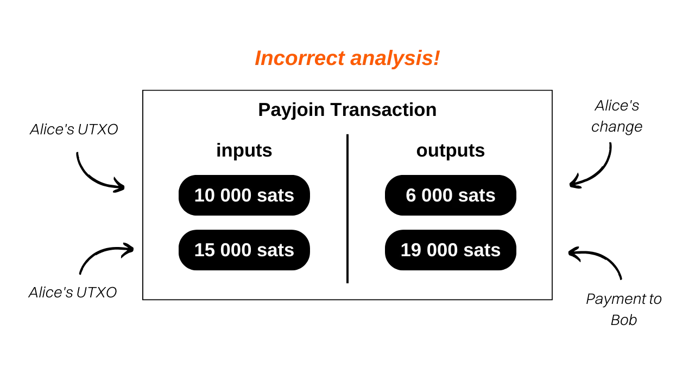

***VAROVÁNÍ:** Po zatčení zakladatelů peněženky Samourai Wallet a zabavení jejich serverů dne 24. dubna již Payjoiny nejsou provozovány na peněžence Sparrow Wallet a Stowaway na peněžence Samourai Wallet funguje pouze manuální výměnou PSBT mezi zúčastněnými stranami, za předpokladu, že oba uživatelé jsou připojeni ke svému vlastnímu Dojo. Je však možné, že tyto nástroje budou znovu spuštěny v nadcházejících týdnech. Mezitím si můžete tento článek přečíst, abyste pochopili teoretické fungování payjoinů.*

_Sledujeme vývoj této kauzy stejně jako vývoj s tím spojených nástrojů. Ujistěte se, že tento tutoriál aktualizujeme, jakmile budou k dispozici nové informace._

_Tento tutoriál je poskytován pouze pro vzdělávací a informační účely. Nepodporujeme ani nevyzýváme k používání těchto nástrojů pro kriminální účely. Je zodpovědností každého uživatele dodržovat zákony ve své jurisdikci._

---
## Porozumění transakcím Payjoin na Bitcoinu

Payjoin je specifická struktura Bitcoinové transakce, která zvyšuje soukromí uživatele během platby spoluprací s příjemcem platby.

V roce 2015 [LaurentMT](https://twitter.com/LaurentMT) poprvé zmínil tuto metodu jako "steganografické transakce" v dokumentu přístupném [zde](https://gist.githubusercontent.com/LaurentMT/e758767ca4038ac40aaf/raw/c8125f6a3c3d0e90246dc96d3b603690ab6f1dcc/gistfile1.txt). Tuto techniku později přijala peněženka Samourai Wallet, která se stala prvním klientem, který ji implementoval s nástrojem Stowaway v roce 2018. Koncept Payjoinu je také obsažen v [BIP79](https://github.com/bitcoin/bips/blob/master/bip-0079.mediawiki) a [BIP78](https://github.com/bitcoin/bips/blob/master/bip-0078.mediawiki). K označení Payjoinu se používá několik termínů:
- Payjoin
- Stowaway
- P2EP (Pay-to-End-Point)
- Steganografická transakce

Unikátnost Payjoinu spočívá v jeho schopnosti generovat transakci, která na první pohled vypadá obyčejně, ale ve skutečnosti se jedná o mini Coinjoin mezi dvěma stranami. K dosažení tohoto cíle zahrnuje struktura transakce vedle skutečného odesílatele také příjemce platby mezi vstupy. Příjemce zahrne platbu sobě samému uprostřed transakce, což jim umožní být zaplaceno.

Pojďme se podívat na konkrétní příklad: pokud kupujete bagetu za `4000 sats` pomocí UTXO `10,000 sats` a zvolíte Payjoin, váš pekař přidá UTXO `15,000 sats`, které patří jim, jako vstup, který obdrží v plné výši jako výstup, kromě vašich `4000 sats`:

V tomto příkladu pekař představuje `15,000 sats` jako vstup a vychází s `19,000 sats`, s rozdílem přesně `4000 sats`, což je cena bagety. Na vaší straně vstupujete s `10,000 sats` a končíte s `6,000 sats` jako výstup, což představuje bilanci `-4000 sats`, což je cena bagety. Pro zjednodušení příkladu jsem záměrně vynechal těžební poplatky v této transakci.
## Jaký je účel transakce Payjoin?
Transakce Payjoin slouží dvěma cílům, které uživatelům umožňují zvýšit soukromí jejich platby.
Především se Payjoin snaží zmást vnějšího pozorovatele tím, že vytvoří klamný dojem při analýze blockchainu. To je umožněno díky heuristice společného vlastnictví vstupů (Common Input Ownership Heuristic - CIOH). Obvykle, když transakce na blockchainu má více vstupů, předpokládá se, že všechny tyto vstupy pravděpodobně patří téže entitě nebo uživateli. Takže, když analytik zkoumá transakci Payjoin, je přiveden k přesvědčení, že všechny vstupy pocházejí od stejné osoby. Toto vnímání je však nesprávné, protože příjemce platby také přispívá vstupy vedle skutečného plátce. Analýza řetězce je tedy odvedena k interpretaci, která se ukáže být nepravdivá.

Dále Payjoin také umožňuje klamat vnějšího pozorovatele o skutečné výši provedené platby. Při zkoumání struktury transakce by analytik mohl věřit, že platba je ekvivalentní částce jednoho z výstupů. Ve skutečnosti však částka platby neodpovídá žádnému z výstupů. Je to ve skutečnosti rozdíl mezi výstupním UTXO příjemce a vstupním UTXO příjemce. V tomto smyslu spadá transakce Payjoin do oblasti steganografie. Umožňuje skrýt skutečnou částku transakce v rámci falešné transakce, která slouží jako klam.

> Steganografie je technika skrývání informací v rámci jiných dat nebo objektů takovým způsobem, že přítomnost skrytých informací není zjistitelná. Například tajná zpráva může být skryta uvnitř tečky v textu, který s ní nesouvisí, čímž je nedetekovatelná pouhým okem (jedná se o techniku mikropointu). Na rozdíl od šifrování, které informace činí nesrozumitelnými bez dešifrovacího klíče, steganografie informace nemění. Zůstávají zobrazeny na očích. Jejím cílem je spíše skrýt existenci tajné zprávy, zatímco šifrování jasně odhaluje přítomnost skrytých informací, ačkoliv jsou nedostupné bez klíče.

Vraťme se k našemu příkladu transakce Payjoin za zaplacení bagety.

Při pohledu na tuto transakci na blockchainu by vnější pozorovatel, který sleduje obvyklé heuristiky analýzy řetězce, interpretoval následovně: "*Alice sloučila 2 UTXO jako vstupy transakce k zaplacení `19,000 sats` Bobovi*."

Tato interpretace je samozřejmě nesprávná, protože, jak již víte, dva vstupní UTXO nepatří téže osobě. Navíc skutečná hodnota platby není `19,000 sats`, ale spíše `4,000 sats`. Analýza vnějšího pozorovatele je tedy směrována k nesprávnému závěru, čímž je zajištěno zachování důvěrnosti zúčastněných stran.
Pokud si přejete analyzovat skutečnou transakci Payjoin, zde je jedna, kterou jsem provedl na testnetu: [8dba6657ab9bb44824b3317c8cc3f333c2f465d3668c678691a091cdd6e5984c](https://mempool.space/fr/testnet/tx/8dba6657ab9bb44824b3317c8cc3f333c2f465d3668c678691a091cdd6e5984c)
[**-> Objevte náš tutoriál, jak provést Payjoin s peněženkou Samourai**](https://planb.network/tutorials/privacy/payjoin-samourai-wallet)  
[**-> Objevte náš tutoriál, jak provést Payjoin s peněženkou Sparrow**](https://planb.network/tutorials/privacy/payjoin-sparrow-wallet)

**Externí zdroje:**
- https://docs.samourai.io/en/spend-tools#stowaway;
- https://gist.githubusercontent.com/LaurentMT/e758767ca4038ac40aaf/raw/c8125f6a3c3d0e90246dc96d3b603690ab6f1dcc/gistfile1.txt;
- https://github.com/bitcoin/bips/blob/master/bip-0078.mediawiki.