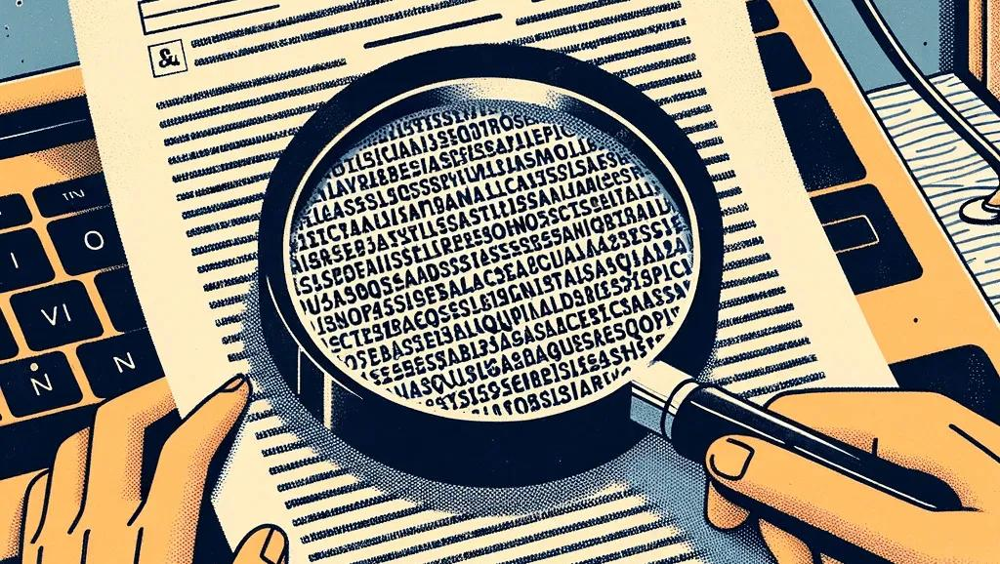

## Verständnis von Payjoin-Transaktionen auf Bitcoin

Payjoin ist eine spezifische Struktur einer Bitcoin-Transaktion, die die Privatsphäre des Benutzers während einer Zahlung verbessert, indem sie mit dem Zahlungsempfänger zusammenarbeitet.

Im Jahr 2015 erwähnte [LaurentMT](https://twitter.com/LaurentMT) diese Methode erstmals als "steganographische Transaktionen" in einem Dokument, das [hier](https://gist.githubusercontent.com/LaurentMT/e758767ca4038ac40aaf/raw/c8125f6a3c3d0e90246dc96d3b603690ab6f1dcc/gistfile1.txt) abrufbar ist. Diese Technik wurde später von der Samourai Wallet übernommen, die 2018 als erste Client-Software die Implementierung mit dem Stowaway-Tool durchführte. Das Konzept des Payjoin findet sich auch in [BIP79](https://github.com/bitcoin/bips/blob/master/bip-0079.mediawiki) und [BIP78](https://github.com/bitcoin/bips/blob/master/bip-0078.mediawiki). Es werden mehrere Begriffe verwendet, um auf Payjoin zu verweisen:
- Payjoin
- Stowaway
- P2EP (Pay-to-End-Point)
- Steganographische Transaktion

Die Einzigartigkeit von Payjoin liegt in seiner Fähigkeit, eine Transaktion zu generieren, die auf den ersten Blick gewöhnlich erscheint, aber tatsächlich ein Mini-Coinjoin zwischen zwei Parteien ist. Um dies zu erreichen, bezieht die Transaktionsstruktur den Zahlungsempfänger neben dem eigentlichen Sender in die Inputs ein. Der Empfänger fügt eine Zahlung an sich selbst in der Mitte der Transaktion ein, um bezahlt zu werden.

Nehmen wir ein konkretes Beispiel: Wenn Sie eine Baguette für `4000 Sats` kaufen und sich für einen Payjoin entscheiden, fügt Ihr Bäcker eine UTXO von `15.000 Sats` als Input hinzu, die ihm als Output in voller Höhe gehört, zusätzlich zu Ihren `4000 Sats`:

In diesem Beispiel bringt der Bäcker `15.000 Sats` als Input ein und erhält `19.000 Sats` als Output, mit einer Differenz von genau `4000 Sats`, dem Preis der Baguette. Auf Ihrer Seite geben Sie `10.000 Sats` ein und erhalten `6000 Sats` als Output, was einem Saldo von `-4000 Sats`, dem Preis der Baguette, entspricht. Um das Beispiel zu vereinfachen, habe ich in dieser Transaktion bewusst die Mining-Gebühren weggelassen.

## Was ist der Zweck einer Payjoin-Transaktion?

Eine Payjoin-Transaktion dient zwei Zielen, die es den Benutzern ermöglichen, die Privatsphäre ihrer Zahlung zu verbessern.
Zunächst einmal zielt Payjoin darauf ab, einen externen Beobachter durch die Erzeugung einer Ablenkung in der Kettenanalyse zu täuschen. Dies wird durch die Common Input Ownership Heuristic (CIOH) ermöglicht. Normalerweise wird angenommen, dass alle Inputs einer Transaktion auf der Blockchain wahrscheinlich derselben Entität oder demselben Benutzer gehören. Wenn ein Analyst also eine Payjoin-Transaktion untersucht, wird er dazu verleitet zu glauben, dass alle Inputs von derselben Person stammen. Diese Wahrnehmung ist jedoch falsch, da der Zahlungsempfänger neben dem eigentlichen Zahler ebenfalls Inputs beisteuert. Dadurch wird die Kettenanalyse in eine falsche Interpretation gelenkt.
Darüber hinaus ermöglicht Payjoin auch, einen externen Beobachter über den tatsächlichen Betrag der Zahlung zu täuschen, der geleistet wurde. Durch die Untersuchung der Transaktionsstruktur könnte der Analyst glauben, dass die Zahlung dem Betrag einer der Ausgaben entspricht. In Wirklichkeit entspricht der Zahlungsbetrag jedoch keiner der Ausgaben. Es handelt sich tatsächlich um die Differenz zwischen dem Output-UTXO des Empfängers und dem Input-UTXO des Empfängers. In diesem Sinne fällt die Payjoin-Transaktion in den Bereich der Steganographie. Sie ermöglicht es, den tatsächlichen Betrag einer Transaktion in einer gefälschten Transaktion zu verbergen, die als Ablenkung dient.

> Steganographie ist eine Technik, um Informationen in anderen Daten oder Objekten so zu verbergen, dass die Anwesenheit der versteckten Informationen nicht wahrnehmbar ist. Zum Beispiel kann eine geheime Nachricht in einem Punkt in einem Text versteckt werden, der nichts damit zu tun hat, so dass sie für das bloße Auge nicht erkennbar ist (dies ist die Technik des Mikropunkts). Im Gegensatz zur Verschlüsselung, bei der Informationen ohne den Entschlüsselungsschlüssel unverständlich gemacht werden, modifiziert die Steganographie die Informationen nicht. Sie bleiben offen sichtbar. Ihr Ziel ist es vielmehr, die Existenz der geheimen Nachricht zu verbergen, während die Verschlüsselung die Anwesenheit versteckter Informationen deutlich offenbart, jedoch ohne den Schlüssel unzugänglich.

Kehren wir zu unserem Beispiel einer Payjoin-Transaktion für die Bezahlung eines Baguettes zurück.

Ein externer Beobachter, der den üblichen Heuristiken der Kettenanalyse folgt, würde diese Transaktion auf der Blockchain wie folgt interpretieren: "*Alice hat 2 UTXOs als Eingabe der Transaktion zusammengeführt, um `19.000 Sats` an Bob zu zahlen*."

Diese Interpretation ist offensichtlich falsch, denn wie Sie bereits wissen, gehören die beiden Input-UTXOs nicht derselben Person. Darüber hinaus beträgt der tatsächliche Wert der Zahlung nicht `19.000 Sats`, sondern `4.000 Sats`. Die Analyse des externen Beobachters führt somit zu einer fehlerhaften Schlussfolgerung und gewährleistet die Wahrung der Vertraulichkeit der Beteiligten.
Wenn Sie eine echte Payjoin-Transaktion analysieren möchten, hier ist eine, die ich im Testnetz durchgeführt habe: [8dba6657ab9bb44824b3317c8cc3f333c2f465d3668c678691a091cdd6e5984c](https://mempool.space/fr/testnet/tx/8dba6657ab9bb44824b3317c8cc3f333c2f465d3668c678691a091cdd6e5984c)

**Externe Ressourcen:**
- https://docs.samourai.io/en/spend-tools#stowaway;
- https://samouraiwallet.com/stowaway;
- https://gist.githubusercontent.com/LaurentMT/e758767ca4038ac40aaf/raw/c8125f6a3c3d0e90246dc96d3b603690ab6f1dcc/gistfile1.txt;
- https://github.com/bitcoin/bips/blob/master/bip-0078.mediawiki.
