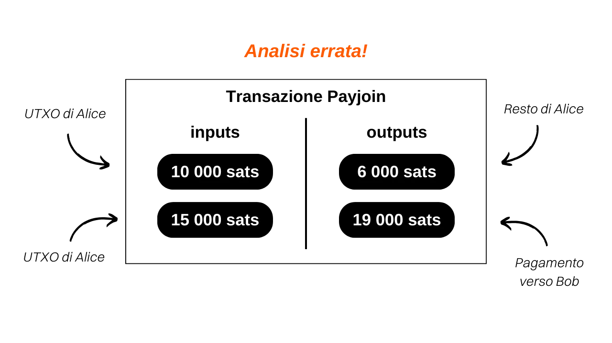

***ATTENZIONE:** A seguito dell'arresto dei fondatori di Samourai Wallet e del sequestro dei loro server il 24 aprile scorso, i Payjoins Stowaway su Samourai Wallet funzionano solo scambiando manualmente i PSBT tra le parti interessate, a condizione che entrambi gli utenti siano collegati al proprio Dojo. Per quanto riguarda Sparrow, i Payjoins tramite BIP78 funzionano ancora. Tuttavia, è possibile che questi strumenti vengano rilanciati nelle prossime settimane. Nel frattempo, puoi sempre consultare questo articolo per comprendere il funzionamento teorico dei payjoin.*

_Stiamo seguendo da vicino l'evoluzione di questo caso così come gli sviluppi relativi agli strumenti associati. Siate certi che aggiorneremo questo tutorial non appena saranno disponibili nuove informazioni._

_Questo tutorial è fornito solo a scopo educativo e informativo. Non approviamo né incoraggiamo l'uso di questi strumenti per scopi criminali. È responsabilità di ogni utente rispettare le leggi vigenti nella propria giurisdizione._

---
## Comprensione delle transazioni Payjoin su Bitcoin

Payjoin è una struttura specifica di transazione Bitcoin che migliora la privacy dell'utente durante un pagamento collaborando con il destinatario del pagamento.

Nel 2015, [LaurentMT](https://twitter.com/LaurentMT) ha menzionato per la prima volta questo metodo come "transazioni steganografiche" in un documento accessibile [qui](https://gist.githubusercontent.com/LaurentMT/e758767ca4038ac40aaf/raw/c8125f6a3c3d0e90246dc96d3b603690ab6f1dcc/gistfile1.txt). Questa tecnica è stata successivamente adottata da Samourai Wallet, che è diventato il primo client a implementarla con lo strumento Stowaway nel 2018. Il concetto di Payjoin si trova anche in [BIP79](https://github.com/bitcoin/bips/blob/master/bip-0079.mediawiki) e [BIP78](https://github.com/bitcoin/bips/blob/master/bip-0078.mediawiki). Diversi termini vengono utilizzati per riferirsi a Payjoin:
- Payjoin
- Stowaway
- P2EP (Pay-to-End-Point)
- Transazione steganografica

L'unicità di Payjoin risiede nella sua capacità di generare una transazione che appare ordinaria a prima vista, ma che in realtà è un mini Coinjoin tra due parti. Per raggiungere questo obiettivo, la struttura della transazione coinvolge il destinatario del pagamento insieme al mittente effettivo negli input. Il destinatario include un pagamento a se stesso nel mezzo della transazione, che gli consente di essere pagato.

Prendiamo un esempio concreto: se acquisti una baguette per `4000 sats` utilizzando un UTXO di `10.000 sats` e opti per un Payjoin, il tuo panettiere aggiungerà un UTXO di `15.000 sats` che gli appartiene come input, che riceverà interamente come output, oltre ai tuoi `4000 sats`:

In questo esempio, il panettiere introduce `15.000 sats` come input e ottiene `19.000 sats`, con una differenza di esattamente `4000 sats`, che è il prezzo della baguette. Dal tuo lato, entri con `10.000 sats` e finisci con `6.000 sats` come output, rappresentando un saldo di `-4000 sats`, che è il prezzo della baguette. Per semplificare l'esempio, ho deliberatamente omesso le commissioni di mining in questa transazione.

## Qual è lo scopo di una transazione Payjoin?

Una transazione Payjoin serve a due obiettivi che consentono agli utenti di migliorare la privacy del loro pagamento.
Innanzitutto, Payjoin mira a ingannare un osservatore esterno creando un diversivo nell'analisi della catena. Ciò è reso possibile attraverso l'euristica della proprietà comune dell'input (CIOH). Di solito, quando una transazione sulla blockchain ha più input, si presume che tutti questi input appartengano alla stessa entità o utente. Pertanto, quando un analista esamina una transazione Payjoin, viene portato a credere che tutti gli input provengano dalla stessa persona. Tuttavia, questa percezione è errata perché il destinatario del pagamento contribuisce anche agli input insieme al pagatore effettivo. Pertanto, l'analisi della catena viene deviata verso un'interpretazione che si rivela falsa.
Inoltre, Payjoin consente anche di ingannare un osservatore esterno riguardo all'effettivo importo del pagamento effettuato. Esaminando la struttura della transazione, l'analista potrebbe credere che il pagamento corrisponda all'importo di una delle uscite. Tuttavia, in realtà, l'importo del pagamento non corrisponde a nessuna delle uscite. È invece la differenza tra l'UTXO di output del destinatario e l'UTXO di input del destinatario. In questo senso, la transazione Payjoin rientra nel campo della steganografia. Consente di nascondere l'effettivo importo di una transazione all'interno di una transazione fittizia che funge da esca.

> La steganografia è una tecnica di occultamento delle informazioni all'interno di altri dati o oggetti in modo tale che la presenza delle informazioni nascoste non sia percettibile. Ad esempio, un messaggio segreto può essere nascosto all'interno di un punto in un testo che non ha nulla a che fare con esso, rendendolo indistinguibile ad occhio nudo (questa è la tecnica del micropunto). A differenza della crittografia, che rende le informazioni incomprensibili senza la chiave di decrittazione, la steganografia non modifica le informazioni. Rimangono visibili a tutti. Il suo obiettivo è piuttosto nascondere l'esistenza del messaggio segreto, mentre la crittografia rivela chiaramente la presenza di informazioni nascoste, sebbene inaccessibili senza la chiave.

Torniamo al nostro esempio di una transazione Payjoin per il pagamento di una baguette.

Vedendo questa transazione sulla blockchain, un osservatore esterno che segue le euristiche usuali dell'analisi delle catene la interpretarebbe come segue: "*Alice ha unito 2 UTXO come input della transazione per pagare `19.000 sats` a Bob*."

Questa interpretazione è ovviamente errata perché, come già sai, le due UTXO di input non appartengono alla stessa persona. Inoltre, il valore effettivo del pagamento non è di `19.000 sats`, ma di `4.000 sats`. L'analisi dell'osservatore esterno è quindi indirizzata verso una conclusione erronea, garantendo la preservazione della riservatezza degli interessati.
Se desideri analizzare una vera transazione Payjoin, ne ho eseguita una sul testnet: [8dba6657ab9bb44824b3317c8cc3f333c2f465d3668c678691a091cdd6e5984c](https://mempool.space/fr/testnet/tx/8dba6657ab9bb44824b3317c8cc3f333c2f465d3668c678691a091cdd6e5984c)

[**-> Scopri il nostro tutorial su come effettuare un Payjoin con Samourai Wallet**](https://planb.network/tutorials/privacy/payjoin-samourai-wallet)  

[**-> Scopri il nostro tutorial su come effettuare un Payjoin con Sparrow Wallet**](https://planb.network/tutorials/privacy/payjoin-sparrow-wallet)

**Risorse esterne:**
- https://docs.samourai.io/en/spend-tools#stowaway;
- https://gist.githubusercontent.com/LaurentMT/e758767ca4038ac40aaf/raw/c8125f6a3c3d0e90246dc96d3b603690ab6f1dcc/gistfile1.txt;
- https://github.com/bitcoin/bips/blob/master/bip-0078.mediawiki.
