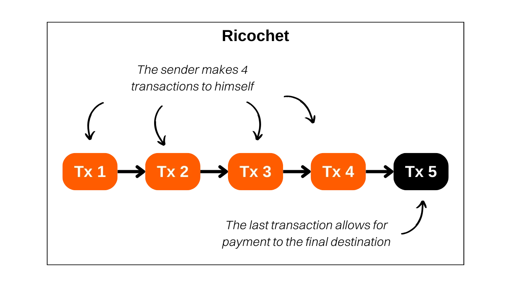

***VAROITUS:** Samourai Walletin perustajien pidätyksen ja heidän palvelimiensa takavarikoinnin jälkeen 24. huhtikuuta Ricochet-työkalu ei ole enää saatavilla. On kuitenkin mahdollista, että tämä työkalu palautetaan käyttöön tulevina viikkoina. Siihen asti voit suorittaa Ricochetin vain manuaalisesti. Tämän artikkelin teoreettinen osa pysyy kuitenkin relevanttina sen toiminnan ymmärtämiseksi ja manuaalisen suorittamisen opettelemiseksi.*

_Seuraamme tiiviisti tämän tapauksen kehitystä sekä siihen liittyvien työkalujen kehitystä. Voitte olla varmoja, että päivitämme tämän oppaan, kun uutta tietoa tulee saataville._

_Tämä opas on tarkoitettu vain koulutus- ja tiedotustarkoituksiin. Emme kannusta tai hyväksy näiden työkalujen käyttöä rikollisiin tarkoituksiin. Jokaisen käyttäjän on noudatettava oman lainkäyttöalueensa lakeja._

---

> *"Premium-työkalu, joka lisää ylimääräisiä siirtoja transaktioihisi. Hämmennä mustia listoja ja auta suojelemaan itseäsi epäoikeudenmukaisilta kolmansien osapuolien tilin sulkemisilta."*

## Mikä on Ricochet?
Ricochet on tekniikka, joka sisältää useiden fiktiivisten transaktioiden suorittamisen itselleen bitcoin-omistuksen siirron simuloimiseksi. Tämä työkalu eroaa muista Samourai-transaktioista, sillä se ei tarjoa ennakoivaa anonymiteettiä, vaan pikemminkin jälkikäteistä anonymiteettiä. Ricochet auttaa hämärtämään erityispiirteitä, jotka voisivat vaarantaa Bitcoin-kolikon vaihdettavuuden.

Esimerkiksi, jos suoritat coinjoinin, sekoituksen jälkeinen kolikkosi tunnistetaan sellaiseksi. Ketjuanalyysityökalut pystyvät tunnistamaan coinjoin-transaktioiden kaavat ja merkitsemään niistä tulleet kolikot. Todellisuudessa coinjoin pyrkii katkaisemaan kolikon historialliset linkit, mutta sen läpikäynti coinjoineissa on havaittavissa. Vertauksena, tämä ilmiö on samankaltainen kuin tekstin salaaminen: vaikka emme pääse käsiksi alkuperäiseen tekstimuotoon, on helposti tunnistettavissa, että salaus on suoritettu.

Juuri tämä "coinjoinin läpikäynyt kolikko" -leima voi vaikuttaa UTXO:n vaihdettavuuteen. Säännellyt toimijat, kuten vaihtoalustat, saattavat kieltäytyä hyväksymästä UTXO:a, joka on käynyt läpi coinjoinin, tai jopa vaatia selityksiä sen omistajalta, riskinä tilin jäädyttäminen tai varojen jäädyttäminen. Joissakin tapauksissa alusta saattaa jopa ilmoittaa käyttäytymisestäsi valtion viranomaisille.

Tässä kohtaa Ricochet-menetelmä astuu kuvaan. Jäljittämisen hämärtämiseksi coinjoinin jälkeen Ricochet suorittaa neljä peräkkäistä transaktiota, joissa käyttäjä siirtää varojaan itselleen eri osoitteisiin. Tämän transaktiosarjan jälkeen Ricochet-työkalu lopulta ohjaa bitcoinit niiden lopulliseen kohteeseen, kuten vaihtoalustalle. Tavoitteena on luoda etäisyyttä alkuperäisen coinjoin-transaktion ja lopullisen kulutustoiminnon välille. Näin ketjuanalyysityökalut ajattelevat, että omistajuus on todennäköisesti siirtynyt coinjoinin jälkeen, ja siksi lähettäjään kohdistuvat toimenpiteet ovat tarpeettomia.

Ricochet-menetelmän kohdalla voisi kuvitella, että ketjuanalyysiohjelmistot syventäisivät tutkimustaan yli neljän pomppun. Kuitenkin nämä alustat kohtaavat dilemman havaitsemiskynnyksen optimoinnissa. Niiden on asetettava raja hyppyjen määrälle, jonka jälkeen ne myöntävät, että omaisuuden vaihto on todennäköisesti tapahtunut ja että yhteys aiempaan coinjoiniin tulisi jättää huomiotta. Kuitenkin tämän kynnyksen määrittäminen on riskialtista: havaittujen hyppyjen määrän jokainen laajennus lisää eksponentiaalisesti vääräpositiivisten, eli virheellisesti coinjoiniin osallistujiksi merkittyjen henkilöiden, määrää, kun toimenpide oli todellisuudessa suoritettu jonkun toisen toimesta. Tämä skenaario aiheuttaa suuren riskin näille yrityksille, sillä vääräpositiiviset johtavat tyytymättömyyteen, mikä voi ajaa asiakkaat kilpailijoiden puoleen. Pitkällä aikavälillä liian kunnianhimoinen kynnys johtaa alustan asiakkaiden menettämiseen enemmän kuin kilpailijoilla, mikä voisi uhata sen elinkelpoisuutta. Näin ollen näiden alustojen on monimutkaista lisätä havaittujen pomppujen määrää, ja 4 on usein riittävä määrä vastaamaan heidän analyyseihinsä.
Näin ollen **Ricochetin yleisin käyttötarkoitus on, kun on tarpeen peittää aiempi osallistuminen coinjoiniin omistamassasi UTXO:ssa**. Ihanteellisesti on parasta välttää bitcoineja, jotka ovat käyneet läpi coinjoinin, siirtämistä säänneltyihin yksiköihin. Kuitenkin, jos muuta vaihtoehtoa ei ole, erityisesti kiireessä muuttaa bitcoineja fiat-valuutaksi, Ricochet tarjoaa tehokkaan ratkaisun.

## Miten Ricochet toimii Samourai Walletissa?
Ricochet on yksinkertaisesti menetelmä, jossa lähetetään bitcoineja itselleen. On siis täysin mahdollista manuaalisesti simuloida Ricochetia käyttämättä erikoistyökalua. Kuitenkin niille, jotka haluavat automatisoida prosessin samalla hyötyen hiotummasta tuloksesta, Ricochet-työkalu, joka on saatavilla Samourai Wallet -sovelluksen kautta, on hyvä ratkaisu.

Koska palvelu on maksullinen Samouraissa, Ricochet aiheuttaa `100,000 sats` palvelumaksun, lisäksi louhintamaksut. Näin ollen sen käyttöä suositellaan enemmän merkittävien summan siirtoihin.

Samourai-sovellus tarjoaa kaksi Ricochet-varianttia:
- Vahvistettu Ricochet eli "portaattainen toimitus" tarjoaa edun levittää Samourai-palvelumaksut viiden peräkkäisen siirron yli. Tämä vaihtoehto varmistaa myös, että jokainen siirto lähetetään eri aikaan ja kirjataan eri lohkoon, mikä jäljittelee tiiviisti omistajuuden muutoksen käyttäytymistä. Vaikka hitaampi, tämä menetelmä on suositeltava niille, jotka eivät ole kiireessä, sillä se maksimoi Ricochetin tehokkuuden parantamalla sen vastustuskykyä ketjuanalyysiin.
- Klassinen Ricochet, joka on suunniteltu suorittamaan toimenpide nopeasti lähettämällä kaikki siirrot lyhyen aikavälin sisällä. Tämä menetelmä tarjoaa siis vähemmän yksityisyyttä ja alhaisemman vastustuskyvyn analyysiin verrattuna vahvistettuun menetelmään. Sitä tulisi suosia vain kiireellisissä siirroissa.

## Miten suorittaa Ricochet Samourai Walletissa?
Suorittaaksesi Ricochet-siirron Samourai Wallet -sovelluksesta, seuraa videotutoriaaliamme:

Jos haluat tutkia tässä tutoriaalissa suoritettuja Ricochet-siirtoja, tässä ne ovat:
- Ensimmäinen Ricochet-siirto: [8deec9054dab10a35897b5efe0b3418e5012983888f8674835a9989a494921dc](https://mempool.space/fr/testnet/tx/8deec9054dab10a35897b5efe0b3418e5012983888f8674835a9989a494921dc)
- Viimeisin Ricochet-siirto: [27980ce507630882f2a1ef94b941a0a3e086b80b10faf7bd168f3ebb4c3e4777](https://mempool.space/fr/testnet/tx/27980ce507630882f2a1ef94b941a0a3e086b80b10faf7bd168f3ebb4c3e4777)
**Ulkopuoliset Lähteet:**
- https://docs.samourai.io/en/wallet/features/ricochet