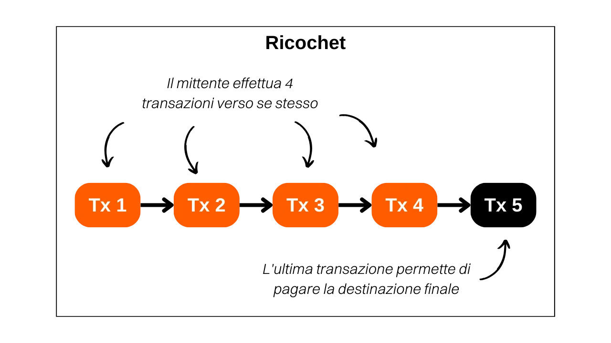

> *"Uno strumento premium che aggiunge ulteriori passaggi di storia alla tua transazione. Sfida le blacklist e aiuta a proteggerti dalla chiusura ingiusta di account di terze parti."*

## Cos'è Ricochet?
Ricochet è una tecnica che prevede di effettuare più transazioni fittizie a se stessi al fine di simulare un trasferimento di proprietà di bitcoin. Questo strumento è diverso dalle altre transazioni di Samourai in quanto non fornisce un'anonimato prospettico, ma piuttosto una forma di anonimato retrospettivo. Infatti, Ricochet aiuta a sfocare le specificità che potrebbero compromettere la fungibilità di una moneta Bitcoin.

Ad esempio, se esegui un coinjoin, l'output della tua moneta dal mix sarà identificato come tale. Gli strumenti di analisi delle catene sono in grado di rilevare modelli di transazioni coinjoin e etichettare le monete che ne derivano. Il coinjoin mira a interrompere i collegamenti storici di una moneta, ma il suo passaggio attraverso i coinjoin rimane rilevabile. Per fare un'analogia, questo fenomeno è simile a crittografare un testo: anche se non possiamo accedere al testo in chiaro originale, è facilmente identificabile che è stata applicata una crittografia.

Precisamente, questa etichetta di "moneta di output coinjoin" può influire sulla fungibilità di un UTXO. Entità regolamentate, come le piattaforme di scambio, possono rifiutare di accettare un UTXO che ha subito un coinjoin, o addirittura richiedere spiegazioni al suo proprietario, con il rischio di bloccare il proprio account o congelare i fondi. In alcuni casi, la piattaforma può persino segnalare il tuo comportamento alle autorità statali.

È qui che entra in gioco il metodo Ricochet. Per sfocare l'impronta lasciata da un coinjoin, Ricochet esegue quattro transazioni successive in cui l'utente trasferisce i propri fondi a se stesso su indirizzi diversi. Dopo questa sequenza di transazioni, lo strumento Ricochet indirizza infine i bitcoin verso la loro destinazione finale, come una piattaforma di scambio. L'obiettivo è creare una distanza tra la transazione originale del coinjoin e l'atto finale di spesa. In questo modo, gli strumenti di analisi delle catene penseranno che probabilmente ci sia stato un trasferimento di proprietà dopo il coinjoin, e quindi non è necessario prendere provvedimenti contro il mittente.

Di fronte al metodo Ricochet, si potrebbe immaginare che il software di analisi delle catene approfondisca la loro esame oltre i quattro rimbalzi. Tuttavia, queste piattaforme si trovano di fronte a un dilemma nell'ottimizzazione della soglia di rilevamento. Devono stabilire un limite sul numero di passaggi dopo il quale ammettono che è probabilmente avvenuto un cambio di proprietà e che il collegamento con un coinjoin precedente dovrebbe essere ignorato. Tuttavia, determinare questa soglia è rischioso: ogni estensione del numero osservato di rimbalzi aumenta in modo esponenziale il volume di falsi positivi, ovvero individui erroneamente contrassegnati come partecipanti a un coinjoin, quando l'operazione è stata effettivamente eseguita da qualcun altro. Questo scenario rappresenta un rischio importante per queste aziende, poiché i falsi positivi portano a insoddisfazione, il che può spingere i clienti interessati verso la concorrenza. A lungo termine, una soglia di rilevamento troppo ambiziosa fa sì che una piattaforma perda più clienti rispetto ai suoi concorrenti, mettendo a rischio la sua sostenibilità. È quindi una sfida per queste piattaforme aumentare il numero di rimbalzi osservati, e 4 è spesso un numero sufficiente per contrastare le loro analisi.

Quindi, **il caso d'uso più comune per Ricochet si verifica quando è necessario nascondere una partecipazione precedente a un coinjoin su un UTXO che ti appartiene**. Idealmente, è meglio evitare di trasferire bitcoin che hanno subito un coinjoin a entità regolamentate. Tuttavia, nel caso in cui non ci sia altra opzione, specialmente nell'urgenza di liquidare bitcoin in valuta fiat, Ricochet offre una soluzione efficace.

## Come funziona Ricochet su Samourai Wallet?
Ricochet è semplicemente un metodo in cui si inviano bitcoin a se stessi. È quindi del tutto possibile simulare manualmente un Ricochet senza utilizzare uno strumento specializzato. Tuttavia, per coloro che desiderano automatizzare il processo beneficiando di un risultato più accurato, lo strumento Ricochet disponibile tramite l'applicazione Samourai Wallet è una buona soluzione.
Poiché il servizio è a pagamento su Samourai, un Ricochet comporta un costo di `100.000 sats` come tariffa di servizio, oltre alle commissioni di mining. Pertanto, il suo utilizzo è più consigliato per trasferimenti di importi significativi.

L'applicazione Samourai offre due varianti di Ricochet:
- Il Ricochet rinforzato, o "consegna scalata", offre il vantaggio di distribuire le commissioni di servizio di Samourai su cinque transazioni consecutive. Questa opzione garantisce anche che ogni transazione venga trasmessa in un momento diverso e registrata in un blocco diverso, che imita da vicino il comportamento di un cambio di proprietà. Sebbene più lento, questo metodo è preferibile per coloro che non hanno fretta, in quanto massimizza l'efficienza di Ricochet rafforzandone la resistenza all'analisi della catena.
- Il Ricochet classico, che è progettato per eseguire l'operazione rapidamente trasmettendo tutte le transazioni entro un intervallo di tempo ridotto. Questo metodo offre quindi meno privacy e una minore resistenza all'analisi rispetto al metodo rinforzato. Dovrebbe essere preferito solo per trasferimenti urgenti.

## Come eseguire un Ricochet su Samourai Wallet?
Per eseguire una transazione Ricochet dall'applicazione Samourai Wallet, segui il nostro tutorial video:

Se desideri studiare le transazioni Ricochet eseguite in questo tutorial, eccole:
- La prima transazione Ricochet: [8deec9054dab10a35897b5efe0b3418e5012983888f8674835a9989a494921dc](https://mempool.space/fr/testnet/tx/8deec9054dab10a35897b5efe0b3418e5012983888f8674835a9989a494921dc)
- L'ultima transazione Ricochet: [27980ce507630882f2a1ef94b941a0a3e086b80b10faf7bd168f3ebb4c3e4777](https://mempool.space/fr/testnet/tx/27980ce507630882f2a1ef94b941a0a3e086b80b10faf7bd168f3ebb4c3e4777)

**Risorse esterne:**
- https://docs.samourai.io/en/wallet/features/ricochet
- https://samouraiwallet.com/ricochet
