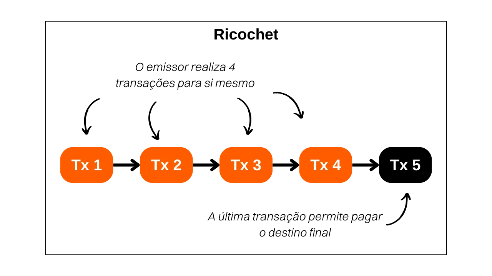

> *"Uma ferramenta premium que adiciona saltos extras de histórico à sua transação. Engane as listas negras e ajude a proteger contra o fechamento injusto de contas de terceiros."*

## O que é Ricochet?
Ricochet é uma técnica que envolve a realização de várias transações fictícias para si mesmo, a fim de simular uma transferência de propriedade de bitcoin. Essa ferramenta é diferente de outras transações Samourai, pois não oferece anonimato prospectivo, mas sim uma forma de anonimato retrospectivo. De fato, Ricochet ajuda a desfocar as especificidades que poderiam comprometer a fungibilidade de uma moeda Bitcoin.

Por exemplo, se você realizar um coinjoin, a saída da sua moeda da mistura será identificada como tal. Ferramentas de análise de cadeia são capazes de detectar padrões de transações coinjoin e rotular as moedas que saem delas. O coinjoin tem como objetivo quebrar os vínculos históricos de uma moeda, mas sua passagem por coinjoins permanece detectável. Para fazer uma analogia, esse fenômeno é semelhante à criptografia de um texto: mesmo que não possamos acessar o texto original, é facilmente identificável que a criptografia foi aplicada.

Precisamente, esse rótulo de "moeda de saída de coinjoin" pode afetar a fungibilidade de uma UTXO. Entidades regulamentadas, como plataformas de câmbio, podem se recusar a aceitar uma UTXO que tenha passado por um coinjoin, ou até mesmo exigir explicações de seu proprietário, com o risco de terem sua conta bloqueada ou fundos congelados. Em alguns casos, a plataforma pode até mesmo relatar seu comportamento às autoridades estaduais.

É aqui que entra o método Ricochet. Para desfocar a pegada deixada por um coinjoin, o Ricochet executa quatro transações sucessivas em que o usuário transfere seus fundos para si mesmo em endereços diferentes. Após essa sequência de transações, a ferramenta Ricochet finalmente encaminha os bitcoins para seu destino final, como uma plataforma de câmbio. O objetivo é criar distância entre a transação original do coinjoin e o ato final de gasto. Dessa forma, as ferramentas de análise de cadeia pensarão que provavelmente houve uma transferência de propriedade após o coinjoin e, portanto, não é necessário tomar medidas contra o remetente.

Diante do método Ricochet, pode-se imaginar que o software de análise de cadeia aprofundaria sua análise além de quatro saltos. No entanto, essas plataformas enfrentam um dilema na otimização do limite de detecção. Elas devem estabelecer um limite para o número de saltos após o qual admitem que uma mudança de propriedade provavelmente ocorreu e que o vínculo com um coinjoin anterior deve ser ignorado. No entanto, determinar esse limite é arriscado: cada extensão do número observado de saltos aumenta exponencialmente o volume de falsos positivos, ou seja, indivíduos erroneamente marcados como participantes de um coinjoin, quando a operação foi realizada por outra pessoa. Esse cenário representa um grande risco para essas empresas, pois falsos positivos levam à insatisfação, o que pode levar os clientes afetados para a concorrência. A longo prazo, um limite de detecção muito ambicioso faz com que uma plataforma perca mais clientes do que seus concorrentes, o que pode ameaçar sua viabilidade. Portanto, é desafiador para essas plataformas aumentar o número de saltos observados, e 4 é frequentemente um número suficiente para contrariar suas análises.

Assim, **o caso de uso mais comum para o Ricochet ocorre quando é necessário ocultar uma participação anterior em um coinjoin em uma UTXO que pertence a você**. Idealmente, é melhor evitar transferir bitcoins que passaram por um coinjoin para entidades regulamentadas. No entanto, no caso de não haver outra opção, especialmente na urgência de liquidar bitcoins em moeda fiduciária, o Ricochet oferece uma solução eficaz.

## Como o Ricochet funciona na carteira Samourai?
O Ricochet é simplesmente um método em que alguém envia bitcoins para si mesmo. Portanto, é totalmente possível simular manualmente um Ricochet sem usar uma ferramenta especializada. No entanto, para aqueles que desejam automatizar o processo e obter um resultado mais refinado, a ferramenta Ricochet disponível através do aplicativo Samourai Wallet é uma boa solução.

Como o serviço é pago no Samourai, um Ricochet incorre em um custo de `100.000 sats` como taxa de serviço, além das taxas de mineração. Assim, seu uso é mais recomendado para transferências de quantias significativas.

O aplicativo Samourai oferece duas variantes do Ricochet:
- O Ricochet Reforçado, ou "entrega escalonada", oferece a vantagem de espalhar as taxas de serviço do Samourai em cinco transações consecutivas. Essa opção também garante que cada transação seja transmitida em um momento distinto e registrada em um bloco diferente, o que imita de perto o comportamento de uma mudança de propriedade. Embora mais lento, esse método é preferível para aqueles que não têm pressa, pois maximiza a eficiência do Ricochet ao fortalecer sua resistência à análise da cadeia.
- O Ricochet Clássico, que é projetado para executar a operação rapidamente, transmitindo todas as transações dentro de um intervalo de tempo reduzido. Esse método, portanto, oferece menos privacidade e menor resistência à análise em comparação com o método reforçado. Deve ser preferido apenas para transferências urgentes.

## Como realizar um Ricochet no Samourai Wallet?
Para realizar uma transação Ricochet no aplicativo Samourai Wallet, siga nosso tutorial em vídeo:

Se você deseja estudar as transações Ricochet realizadas neste tutorial, aqui estão elas:
- A primeira transação Ricochet: [8deec9054dab10a35897b5efe0b3418e5012983888f8674835a9989a494921dc](https://mempool.space/fr/testnet/tx/8deec9054dab10a35897b5efe0b3418e5012983888f8674835a9989a494921dc)
- A última transação Ricochet: [27980ce507630882f2a1ef94b941a0a3e086b80b10faf7bd168f3ebb4c3e4777](https://mempool.space/fr/testnet/tx/27980ce507630882f2a1ef94b941a0a3e086b80b10faf7bd168f3ebb4c3e4777)

**Recursos Externos:**
- https://docs.samourai.io/en/wallet/features/ricochet
- https://samouraiwallet.com/ricochet
