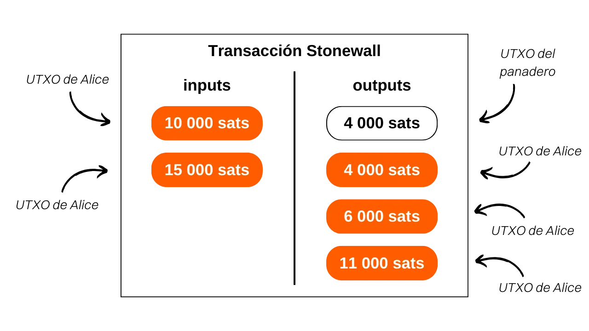
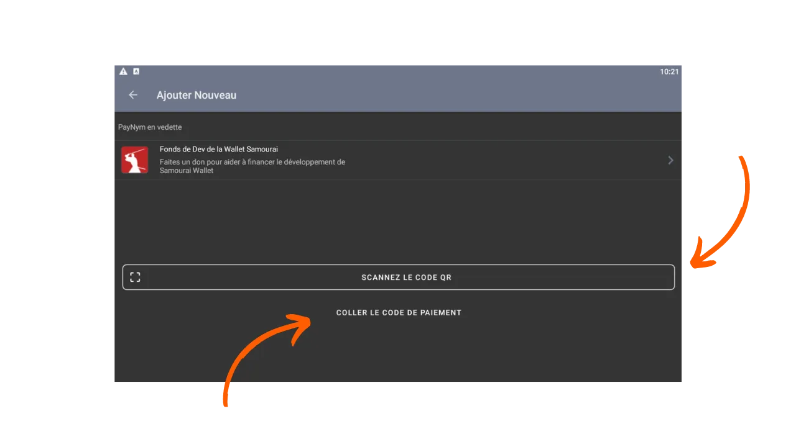
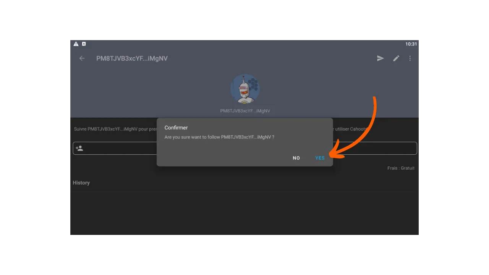

***ADVERTENCIA:** Tras la detención de los fundadores de Samourai Wallet y la incautación de sus servidores el 24 de abril, las transacciones Stonewallx2 solo funcionan intercambiando manualmente los PSBT entre las partes involucradas, siempre que ambos usuarios estén conectados a su propio Dojo. Sin embargo, es posible que estas herramientas sean relanzadas en las próximas semanas. Mientras tanto, puede consultar este artículo para entender el funcionamiento teórico de las Stonewallx2 y aprender a realizarlas manualmente.*

_Si planea realizar una Stonewallx2 manualmente, el procedimiento es muy similar al descrito en este tutorial. La principal diferencia radica en la elección del tipo de transacción Stonewallx2: en lugar de seleccionar `Online`, haga clic en `In Person / Manual`. Luego, necesitará intercambiar manualmente los PSBT para construir la transacción Stonewallx2. Si está físicamente cerca de su colaborador, puede escanear los códigos QR sucesivamente. Si está a distancia, los archivos JSON pueden intercambiarse a través de un canal de comunicación seguro. El resto del tutorial permanece sin cambios._

_Estamos siguiendo de cerca la evolución de este caso así como los desarrollos relacionados con las herramientas asociadas. Ten la seguridad de que actualizaremos este tutorial a medida que estén disponibles nuevas informaciones._

_Este tutorial se proporciona únicamente con fines educativos e informativos. No respaldamos ni alentamos el uso de estas herramientas para fines criminales. Es responsabilidad de cada usuario cumplir con las leyes en su jurisdicción._

---

> *Haz que cada gasto sea una coinjoin.*

## ¿Qué es una transacción Stonewall x2?

Stonewall x2 es una forma específica de transacción de Bitcoin que tiene como objetivo aumentar la privacidad del usuario durante un gasto, colaborando con un tercero que no está involucrado en el gasto. Este método simula una mini-coinjoin entre dos participantes, mientras se realiza un pago a un tercero. Las transacciones Stonewall x2 están disponibles tanto en la aplicación Samourai Wallet como en el software Sparrow Wallet. Ambos son interoperables.

Su funcionamiento es relativamente sencillo: utilizamos un UTXO en nuestra posesión para realizar el pago y buscamos la ayuda de un tercero que también contribuye con un UTXO propio. La transacción resulta en cuatro salidas: dos de ellas de igual cantidad, una destinada a la dirección del destinatario del pago y la otra a una dirección perteneciente al colaborador. Un tercer UTXO se devuelve a otra dirección del colaborador, lo que le permite recuperar la cantidad inicial (una acción neutral para ellos, módulo las tarifas de minería), y un último UTXO vuelve a una dirección que nos pertenece, lo que constituye el cambio del pago.

Así, se definen tres roles diferentes en las transacciones Stonewall x2:
- El remitente, quien realiza el pago real;
- El colaborador, quien proporciona bitcoins para mejorar el anonimato general de la transacción, mientras recupera completamente sus fondos al final (una acción neutral para ellos, módulo las tarifas de minería);
- El destinatario, quien puede desconocer la naturaleza específica de la transacción y simplemente espera un pago del remitente.

Tomemos un ejemplo para entenderlo mejor. Alice está en la panadería para comprar su baguette, que cuesta `4,000 sats`. Quiere pagar en bitcoins manteniendo cierto nivel de privacidad para su pago. Por lo tanto, llama a su amigo Bob, quien la ayudará en este proceso.

Al analizar esta transacción, podemos ver que el panadero efectivamente recibió `4,000 sats` como pago por la baguette. Alice utilizó `10,000 sats` como entrada y recibió `6,000 sats` como salida, lo que resulta en un saldo neto de `-4,000 sats`, que corresponde al precio de la baguette. En cuanto a Bob, proporcionó `15,000 sats` como entrada y recibió dos salidas: una de `4,000 sats` y otra de `11,000 sats`, lo que resulta en un saldo de `0`.
En este ejemplo, he descuidado intencionalmente las tarifas de minería para facilitar la comprensión. En realidad, las tarifas de transacción se comparten por igual entre el remitente del pago y el colaborador.

## ¿Cuál es la diferencia entre Stonewall y Stonewall x2?

Una transacción Stonewall x2 funciona exactamente como una transacción Stonewall, excepto que la primera es colaborativa mientras que la segunda no lo es. Como hemos visto, una transacción Stonewall x2 implica la participación de un tercero, que es externo al pago, y que proporcionará sus bitcoins para mejorar la privacidad de la transacción. En una transacción Stonewall típica, el papel del colaborador lo asume el remitente.

Revisemos nuestro ejemplo de Alice en la panadería. Si no hubiera encontrado a alguien como Bob para acompañarla en su gasto, podría haber realizado una transacción Stonewall sola. Así, los dos UTXOs de entrada habrían sido suyos, y habría recibido 3 en la salida.

Desde una perspectiva externa, el patrón de transacción habría permanecido igual.

Por lo tanto, la lógica debería ser la siguiente al usar una herramienta de gasto de Samourai:
- Si el comerciante no admite Payjoin Stowaway, se puede realizar una transacción colaborativa con otra persona externa al pago utilizando Stonewall x2.
- Si no se encuentra a nadie para hacer una transacción Stonewall x2, se puede hacer una transacción Stonewall sola, imitando el comportamiento de una transacción Stonewall x2.
- Finalmente, la última opción sería hacer una transacción con JoinBot, un servidor mantenido por Samourai, que puede actuar, a petición, como colaborador en una transacción Stonewall x2.

Si deseas encontrar un colaborador dispuesto a ayudarte en una transacción Stonewall X2, también puedes visitar este grupo de Telegram (no oficial) mantenido por usuarios de Samourai para conectar remitentes y colaboradores: [Make Every Spend a Coinjoin](https://t.me/EverySpendACoinjoin).

[**-> Descubre más sobre las transacciones Stonewall**](https://planb.network/tutorials/privacy/stonewall)

## ¿Cuál es el propósito de una transacción Stonewall x2?

La estructura Stonewall x2 agrega una cantidad significativa de entropía a la transacción y confunde el análisis de la cadena. Desde una perspectiva externa, dicha transacción puede interpretarse como una pequeña Coinjoin entre dos personas. Pero en realidad, es un pago. Este método genera incertidumbres en el análisis de la cadena e incluso puede llevar a pistas falsas.

Volviendo al ejemplo de Alice, Bob y el panadero. La transacción en la cadena se vería así:

Un observador externo que se basa en heurísticas comunes de análisis de cadena podría concluir erróneamente que "Alice y Bob realizaron una pequeña coinjoin, con una UTXO cada uno como entrada y dos UTXOs cada uno como salida".
Esta interpretación es incorrecta porque, como sabes, se envió una UTXO al panadero, Alice solo tiene una salida de cambio y Bob tiene dos.

Incluso si el observador externo logra identificar el patrón de la transacción Stonewall x2, no tendrá toda la información. No podrá determinar cuál de las dos UTXOs de los mismos montos corresponde al pago. Además, no podrá saber si es Alice o Bob quien realizó el pago. Finalmente, no podrá determinar si las dos UTXOs de entrada provienen de dos personas diferentes o si pertenecen a una sola persona que las fusionó. Este último punto se debe al hecho de que las transacciones Stonewall clásicas, que discutimos anteriormente, siguen exactamente el mismo patrón que las transacciones Stonewall x2. Desde el exterior y sin información adicional sobre el contexto, es imposible diferenciar una transacción Stonewall de una transacción Stonewall x2. Sin embargo, las primeras no son transacciones colaborativas, mientras que las segundas sí lo son. Esto agrega aún más dudas sobre este gasto.

## ¿Cómo establecer una conexión entre Paynyms para poder colaborar a través de Soroban?
Al igual que con otras transacciones colaborativas en Samourai (*Cahoots*), realizar un Stonewall x2 implica el intercambio de transacciones parcialmente firmadas entre el remitente y el colaborador. Este intercambio se puede hacer manualmente, en caso de que estés físicamente con tu colaborador, o automáticamente a través del protocolo de comunicación Soroban.
Si eliges la segunda opción, deberás establecer una conexión entre los Paynyms antes de poder realizar un Stonewall x2. Para hacer esto, tu Paynym debe "seguir" el Paynym de tu colaborador, y viceversa.

**Accediendo al Paynym del colaborador:**

Para empezar, es necesario obtener el código de pago del Paynym de tu colaborador. En la aplicación Samourai Wallet, tu colaborador debe tocar el icono de su Paynym (el pequeño robot) ubicado en la parte superior izquierda de la pantalla, y luego hacer clic en el apodo de su Paynym, que comienza con `+...`. Por ejemplo, el mío es `+namelessmode0aF`.

Si tu colaborador está usando Sparrow Wallet, debe hacer clic en la pestaña 'Tools', luego en 'Show PayNym'.
**Siguiendo el PayNym de tu colaborador desde Samourai Wallet:**

Si estás usando Samourai Wallet, abre tu aplicación y accede al menú 'PayNyms' de la misma manera. Si es la primera vez que usas tu PayNym, necesitarás obtener su identificador.

Luego haz clic en el símbolo `+` azul en la parte inferior derecha de la pantalla.

Luego puedes pegar el código de pago de tu colaborador seleccionando 'PASTE PAYMENT CODE', o abrir la cámara para escanear su código QR presionando 'SCAN QR CODE'.

Haz clic en el botón 'FOLLOW'.

Confirma haciendo clic en 'YES'.

El software te ofrecerá un botón 'CONNECT'. No es necesario hacer clic en este botón para nuestro tutorial. Este paso solo es necesario si planeas hacer pagos al otro PayNym como parte del [BIP47](https://planb.network/tutorials/privacy/paynym-bip47), que no está relacionado con nuestro tutorial.

Una vez que tu PayNym esté siguiendo el PayNym de tu colaborador, repite este proceso en la dirección opuesta para que tu colaborador también pueda seguirte. Luego podrás realizar una transacción Stonewall x2.

**Siguiendo el PayNym de tu colaborador desde Sparrow Wallet:**

Si estás usando Sparrow Wallet, abre tu billetera y accede al menú 'Show PayNym'. Si estás usando tu PayNym por primera vez, necesitarás obtener un identificador haciendo clic en 'Retrieve PayNym'.

Luego ingresa el identificador del PayNym de tu colaborador (ya sea su apodo '+...' o su código de pago 'PM...') en el cuadro 'Find Contact' y haz clic en el botón 'Add Contact'.

El software luego te ofrecerá un botón 'Enlazar contacto'. No es necesario hacer clic en este botón para nuestro tutorial. Este paso solo es necesario si planeas hacer pagos al PayNym indicado como parte del [BIP47](https://planb.network/tutorials/privacy/paynym-bip47), que no está relacionado con nuestro tutorial.
Una vez que tu PayNym esté siguiendo al PayNym de tu colaborador, repite este proceso en la dirección opuesta para que tu colaborador también pueda seguirte. Luego podrás realizar una transacción Stonewall x2.
## ¿Cómo hacer una transacción Stonewall x2 en Samourai Wallet?
Si has completado los pasos anteriores de conexión de Paynyms, ¡finalmente estás listo para hacer la transacción Stonewall x2! Para hacer esto, sigue nuestro tutorial en video sobre Samourai Wallet:

## ¿Cómo hacer una transacción Stonewall x2 en Sparrow Wallet?
Si has completado los pasos anteriores de conexión de Paynyms, ¡finalmente estás listo para hacer la transacción Stonewall x2! Para hacer esto, sigue nuestro tutorial en video sobre Sparrow Wallet:

**Recursos externos:**
- https://sparrowwallet.com/docs/spending-privately.html;
- https://docs.samourai.io/en/spend-tools#stonewallx2.
