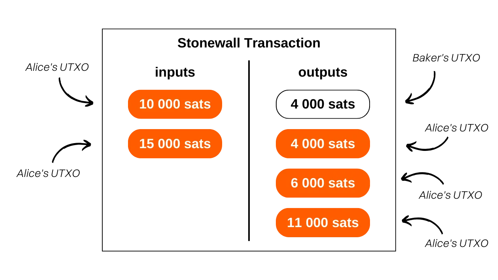
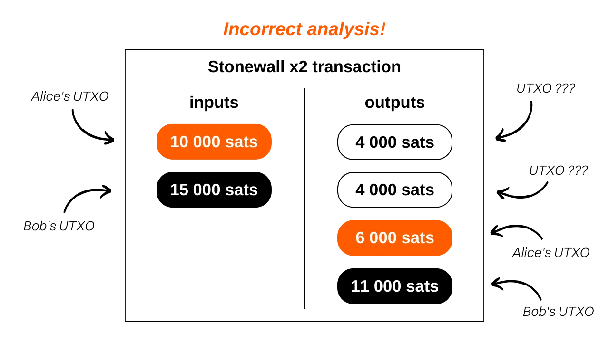

***ВНИМАНИЕ:** После ареста основателей кошелька Samourai и изъятия их серверов 24 апреля, транзакции Stonewallx2 функционируют только путем ручного обмена PSBT между заинтересованными сторонами, при условии, что оба пользователя подключены к своему собственному Dojo. Однако возможно, что эти инструменты могут быть перезапущены в ближайшие недели. Тем временем вы все еще можете ознакомиться с этой статьей, чтобы понять теоретические основы работы Stonewallx2 и научиться выполнять их вручную.*

_Если вы рассматриваете возможность выполнения Stonewallx2 вручную, процедура очень похожа на описанную в этом учебнике. Основное отличие заключается в выборе типа транзакции Stonewallx2: вместо выбора `Online`, нажмите на `In Person / Manual`. Затем вам нужно будет вручную обменяться PSBT для создания транзакции Stonewallx2. Если вы физически находитесь рядом с вашим партнером, вы можете последовательно сканировать QR-коды. Если вы находитесь на расстоянии, файлы JSON могут быть обменены через защищенный канал связи. Остальная часть учебника остается неизменной._

_Мы тщательно следим за развитием этого дела, а также за развитием связанных с ним инструментов. Будьте уверены, что мы обновим этот учебник, как только появится новая информация._

_Этот учебник предоставляется только для образовательных и информационных целей. Мы не поддерживаем и не поощряем использование этих инструментов в преступных целях. Каждый пользователь несет ответственность за соблюдение законов в своей юрисдикции._

---

> *Сделайте каждый расход совместным.*

## Что такое транзакция Stonewall x2?

Stonewall x2 - это специфическая форма биткойн-транзакции, направленная на увеличение конфиденциальности пользователя во время расхода, путем сотрудничества с третьей стороной, не участвующей в этом расходе. Этот метод имитирует мини-совместное использование между двумя участниками, в то время как осуществляется платеж третьей стороне. Транзакции Stonewall x2 доступны как в приложении Samourai Wallet, так и в программном обеспечении Sparrow Wallet. Оба совместимы друг с другом.

Ее работа относительно проста: мы используем UTXO в нашем владении для совершения платежа и просим о помощи третью сторону, которая также вносит свой UTXO. Транзакция приводит к четырем выходам: два из них равных сумм, один предназначен для адреса получателя платежа, другой - для адреса сотрудника. Третий UTXO возвращается на другой адрес сотрудника, позволяя ему извлечь первоначальную сумму (нейтральное действие для него, за вычетом комиссии за майнинг), и последний UTXO возвращается на адрес, принадлежащий нам, который составляет сдачу с платежа.

Таким образом, в транзакциях Stonewall x2 определяются три разные роли:
- Отправитель, который осуществляет фактический платеж;
- Сотрудник, который предоставляет биткойны для улучшения общей анонимности транзакции, при этом полностью восстанавливая свои средства в конце (нейтральное действие для него, за вычетом комиссии за майнинг);
- Получатель, который может быть не осведомлен о специфической природе транзакции и просто ожидает платеж от отправителя.

Давайте рассмотрим пример для лучшего понимания. Алиса находится в булочной, чтобы купить свою багет, который стоит `4,000 сатоши`. Она хочет заплатить биткойнами, сохраняя при этом определенный уровень конфиденциальности своего платежа. Поэтому она обращается за помощью к своему другу Бобу, который поможет ей в этом процессе.

Анализируя эту транзакцию, мы видим, что пекарь действительно получил `4,000 сатоши` в качестве оплаты за багет. Алиса использовала `10,000 сатоши` в качестве входа и получила `6,000 сатоши` на выходе, что привело к чистому балансу `-4,000 сатоши`, соответствующему цене багета. Что касается Боба, он предоставил `15,000 сатоши` на входе и получил два выхода: один из `4,000 сатоши` и другой из `11,000 сатоши`, что привело к балансу `0`. В этом примере я намеренно не учитывал комиссии за майнинг, чтобы облегчить понимание. На самом деле, комиссии за транзакцию делятся поровну между отправителем платежа и сотрудником.

## В чем разница между Stonewall и Stonewall x2?

Транзакция StonewallX2 работает точно так же, как транзакция Stonewall, за исключением того, что первая является совместной, в то время как последняя нет. Как мы видели, транзакция Stonewall x2 включает участие третьей стороны, которая не участвует в платеже, и которая предоставит свои биткоины для повышения конфиденциальности транзакции. В типичной транзакции Stonewall роль сотрудника выполняет отправитель.

Давайте вернемся к нашему примеру с Алисой в пекарне. Если бы она не смогла найти кого-то вроде Боба, чтобы сопровождать ее в ее расходах, она могла бы совершить транзакцию Stonewall в одиночку. Таким образом, оба входных UTXO были бы ее, и она получила бы 3 на выходе.

С внешней точки зрения, шаблон транзакции остался бы тем же.

Поэтому логика должна быть следующей при использовании инструмента расходов Samourai:
- Если торговец не поддерживает Payjoin Stowaway, совместная транзакция может быть совершена с другим лицом, внешним по отношению к платежу, используя Stonewall x2.
- Если никто не найден для совершения транзакции Stonewall x2, можно совершить транзакцию Stonewall в одиночку, имитируя поведение транзакции Stonewall x2.
- Наконец, последним вариантом будет совершение транзакции с JoinBot, сервером, поддерживаемым Samourai, который может по запросу выступать в качестве сотрудника в транзакции Stonewall x2.

Если вы хотите найти сотрудника, который готов помочь вам в транзакции Stonewall X2, вы также можете посетить эту группу в Telegram (неофициальную), поддерживаемую пользователями Samourai для соединения отправителей и сотрудников: [Make Every Spend a Coinjoin](https://t.me/EverySpendACoinjoin).

[**-> Узнать больше о транзакциях Stonewall**](https://planb.network/tutorials/privacy/stonewall)

## Какова цель транзакции Stonewall x2?

Структура Stonewall x2 добавляет значительное количество энтропии к транзакции и сбивает с толку анализ цепочек. С внешней стороны такая транзакция может быть интерпретирована как небольшой Coinjoin между двумя лицами. Но на самом деле это платеж. Этот метод генерирует неопределенности в анализе цепочек и даже приводит к ложным следам.

Давайте вернемся к примеру с Алисой, Бобом и пекарем. Транзакция в блокчейне выглядела бы так:

Внешний наблюдатель, опирающийся на общепринятые эвристики анализа блокчейна, может ошибочно сделать вывод, что "Алиса и Боб совершили небольшой coinjoin, где каждый использовал по одному UTXO в качестве входа и получил по два UTXO в качестве выхода." Этот вывод неверен, потому что, как вы знаете, один UTXO был отправлен Бейкеру, у Алисы только один выход сдачи, а у Боба два.

Даже если внешний наблюдатель сумеет идентифицировать шаблон транзакции Stonewall x2, у него не будет всей информации. Он не сможет определить, какому из двух UTXO одинаковых сумм соответствует платеж. Кроме того, он не сможет узнать, кто совершил платеж — Алиса или Боб. Наконец, он не сможет определить, пришли ли два входных UTXO от двух разных людей или они принадлежат одному человеку, который их объединил. Этот последний момент связан с тем, что классические транзакции Stonewall, о которых мы говорили выше, следуют точно такому же шаблону, как и транзакции Stonewall x2. Снаружи и без дополнительной информации о контексте невозможно отличить транзакцию Stonewall от транзакции Stonewall x2. Однако первые не являются совместными транзакциями, в то время как последние являются таковыми. Это добавляет еще больше сомнений относительно этого расхода.

## Как установить связь между Paynyms для совместной работы через Soroban?

Как и в случае с другими совместными транзакциями в Samourai (*Cahoots*), выполнение Stonewall x2 включает обмен частично подписанными транзакциями между отправителем и сотрудником. Этот обмен может быть выполнен вручную, если вы физически находитесь рядом со своим сотрудником, или автоматически через протокол связи Soroban.

Если вы выберете второй вариант, вам нужно будет установить связь между Paynyms, прежде чем вы сможете выполнить Stonewall x2. Для этого ваш Paynym должен "следовать" за Paynym вашего сотрудника, и наоборот.

**Доступ к Paynym сотрудника:**

Для начала необходимо получить платежный код Paynym вашего сотрудника. В приложении Samourai Wallet ваш сотрудник должен нажать на иконку своего Paynym (маленького робота), расположенную в верхнем левом углу экрана, затем кликнуть на свой никнейм Paynym, начинающийся с `+...`. Например, мой `+namelessmode0aF`.

Если ваш сотрудник использует Sparrow Wallet, ему следует нажать на вкладку 'Tools', затем на 'Show PayNym'.
**Следование за PayNym сотрудника из Samourai Wallet:**

Если вы используете Samourai Wallet, запустите приложение и таким же образом перейдите в меню 'PayNyms'. Если вы используете свой PayNym впервые, вам нужно будет получить его идентификатор.

Затем нажмите на синий '+' в нижнем правом углу экрана.

После этого вы можете вставить платежный код вашего сотрудника, выбрав 'PASTE PAYMENT CODE', или открыть камеру для сканирования их QR-кода, нажав 'SCAN QR CODE'.
Нажмите на кнопку "FOLLOW".

Подтвердите, нажав "YES".

Затем программа предложит вам кнопку "CONNECT". Нажимать на эту кнопку для нашего учебника не обязательно. Этот шаг требуется только если вы планируете совершать платежи другому PayNym в рамках [BIP47](https://planb.network/tutorials/privacy/paynym-bip47), что не относится к нашему учебнику.

Как только ваш PayNym начнет следовать за PayNym вашего сотрудника, повторите этот процесс в обратном направлении, чтобы ваш сотрудник также мог следовать за вами. Затем вы сможете выполнить транзакцию Stonewall x2.

**Следование за PayNym вашего сотрудника из Sparrow Wallet:**

Если вы используете Sparrow Wallet, откройте ваш кошелек и перейдите в меню "Show PayNym". Если вы используете ваш PayNym впервые, вам нужно будет получить идентификатор, нажав на "Retrieve PayNym".

Затем введите идентификатор PayNym вашего сотрудника (либо их никнейм '+...' либо их платежный код 'PM...') в поле "Find Contact" и нажмите кнопку "Add Contact".

Затем программа предложит вам кнопку "Link Contact". Нажимать на эту кнопку для нашего учебника не обязательно. Этот шаг требуется только если вы планируете совершать платежи указанному PayNym в рамках [BIP47](https://planb.network/tutorials/privacy/paynym-bip47), что не относится к нашему учебнику.

Как только ваш PayNym начнет следовать за PayNym вашего сотрудника, повторите этот процесс в обратном направлении, чтобы ваш сотрудник также мог следовать за вами. Затем вы сможете выполнить транзакцию Stonewall x2.
## Как совершить транзакцию Stonewall x2 в Samourai Wallet?

Если вы выполнили предыдущие шаги по подключению Paynyms, вы наконец готовы совершить транзакцию Stonewall x2! Для этого следуйте нашему видеоуроку по Samourai Wallet:

## Как совершить транзакцию Stonewall x2 в Sparrow Wallet?

Если вы выполнили предыдущие шаги по подключению Paynyms, вы наконец готовы совершить транзакцию Stonewall x2! Для этого следуйте нашему видеоуроку по Sparrow Wallet:

**Внешние ресурсы:**
- https://sparrowwallet.com/docs/spending-privately.html;
- https://docs.samourai.io/en/spend-tools#stonewallx2.