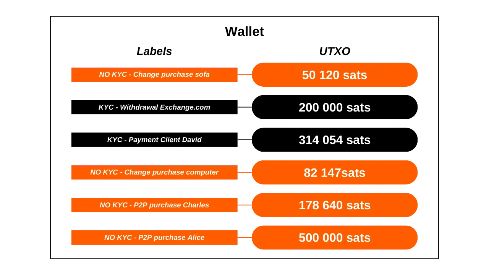
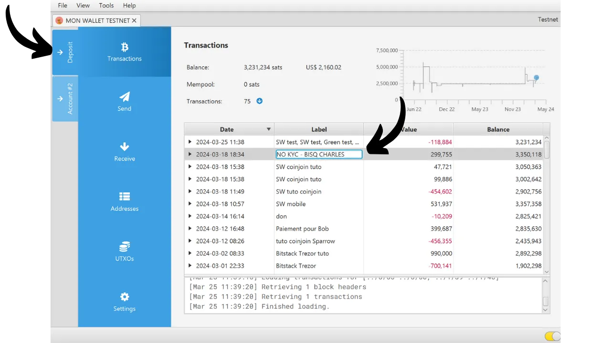
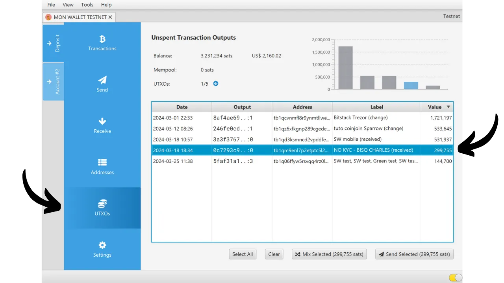

V tomto tutoriálu se dozvíte vše, co potřebujete vědět o označování UTXO ve vaší Bitcoin peněžence a o kontrole mincí. Začneme teoretickou částí, abychom plně pochopili tyto koncepty, než přejdeme k praktické části, kde prozkoumáme, jak konkrétně používat označení v hlavním softwaru Bitcoin peněženky.

## Co je označování UTXO?
"Označování" je technika, která zahrnuje spojení poznámky nebo štítku s konkrétním UTXO uvnitř Bitcoin peněženky. Tyto poznámky jsou ukládány lokálně softwarovou peněženkou a nikdy nejsou přenášeny přes Bitcoinovou síť. Označování je tedy nástrojem pro osobní správu.

Například, pokud obdržím UTXO z P2P transakce přes Bisq od Charlese, mohl bych mu přiřadit štítek `Bisq P2P nákup Charles`.

Označování umožňuje si pamatovat původ nebo zamýšlený cíl UTXO, což zjednodušuje správu prostředků a optimalizuje soukromí uživatele. Označování se stává ještě relevantnějším, když je kombinováno s funkcionalitou "kontroly mincí". Kontrola mincí je možnost dostupná v dobrých Bitcoin peněženkách, která uživateli umožňuje ručně vybrat, která konkrétní UTXO budou použita jako vstupy při vytváření transakce.

Používání peněženky s kontrolou mincí společně s označováním UTXO umožňuje uživatelům přesně rozlišovat a vybírat UTXO pro jejich transakce, čímž se vyhýbá spojování UTXO z různých zdrojů. Tato praxe snižuje rizika spojená s heuristikou společného vlastnictví vstupů (CIOH), která naznačuje společné vlastnictví vstupů transakce, což může ohrozit soukromí uživatele.

Vraťme se k příkladu mého no-KYC UTXO z Bisq; chci se vyhnout jeho kombinování s UTXO pocházejícím, řekněme, z regulované směnárenské platformy, která zná mou identitu. Umístěním odlišného štítku na mé no-KYC UTXO a na mé KYC UTXO budu schopen snadno identifikovat, které UTXO spotřebovat jako vstup pro uspokojení výdaje, použitím funkce kontroly mincí.

## Jak správně označit vaše UTXO?
Neexistuje univerzální metoda pro označování UTXO, která by vyhovovala každému. Je na vás, abyste definovali systém označování tak, abyste se ve vaší peněžence snadno orientovali.
Klíčovým kritériem při označování je zdroj UTXO. Měli byste jednoduše uvést, jak tato mince dorazila do vaší peněženky. Je to ze směnárenské platformy? Vyrovnání faktury od klienta? Peer-to-peer výměna? Nebo představuje drobné z nákupu? Takže byste mohli specifikovat:
- `Výběr Exchange.com`;
- `Platba klient David`;
- `P2P nákup Charles`;
- `Drobné z nákupu pohovky`.

Pro zjemnění vaší správy UTXO a dodržení vašich strategií segregace prostředků uvnitř vaší peněženky byste mohli obohatit vaše štítky o další ukazatel, který odráží tyto oddělení. Pokud vaše peněženka obsahuje dvě kategorie UTXO, které nechcete míchat, mohli byste do vašich štítků integrovat značku pro jasné rozlišení těchto skupin.

Tyto značky oddělení budou záviset na vašich vlastních kritériích, jako je rozlišení mezi KYC UTXO (znalost vaší identity) a no-KYC (anonymní), nebo mezi profesionálními a osobními prostředky. Vezmeme-li v úvahu dříve zmíněné příklady štítků, mohlo by to být přeloženo jako:
- `KYC - Výběr Exchange.com`;
- `KYC - Platba klient David`;
- `NO KYC - P2P nákup Charles`;
- `NO KYC - Drobné z nákupu pohovky`.
V každém případě mějte na paměti, že dobré označování je takové, které budete schopni pochopit, když to budete potřebovat. Pokud je vaše Bitcoinová peněženka primárně určena pro úspory, může se stát, že označení budou pro vás užitečná až za několik desetiletí. Proto se ujistěte, že jsou jasná, přesná a obsáhlá.

Je také doporučeno zachovávat označení mince během transakcí. Například při konsolidaci UTXO bez KYC se ujistěte, že výsledné UTXO označíte nejen jako `konsolidace`, ale konkrétně jako `konsolidace bez KYC`, abyste udrželi jasnou stopu původu mince.

Nakonec není nutné na označení dávat datum. Většina softwaru pro peněženky již zobrazuje datum transakce a vždy je možné tuto informaci získat na prohlížeči bloků pomocí jeho TXID.

## Tutoriál: Označování v Specter Desktop

Připojte se a otevřete svou peněženku v Specter Desktop, poté vyberte záložku `Adresy`.

Zde uvidíte seznam všech vašich adres, stejně jako jakékoli bitcoiny, které jsou na nich uzamčeny. Ve výchozím nastavení jsou adresy identifikovány podle jejich indexu v sloupci `Označení`. Pro změnu označení stačí na něj kliknout, zadat požadované označení a poté potvrdit kliknutím na modrou ikonu.

Vaše označení se poté objeví v seznamu vašich adres.

Označení můžete také přiřadit předem, když sdílíte svou přijímací adresu s odesílatelem. To uděláte tak, že v záložce `Přijmout` poznamenáte své označení do příslušného pole.

## Tutoriál: Označování v Electrum

V peněžence Electrum po přihlášení do vaší peněženky klikněte na transakci, které chcete přiřadit označení, z záložky `Historie`.

Otevře se nové okno. Klikněte na pole `Popis` a napište své označení.

Jakmile je označení zadáno, můžete toto okno zavřít.

Vaše označení bylo úspěšně uloženo. Najdete ho pod záložkou `Popis`.

V záložce `Mince`, ze které můžete provádět kontrolu mincí, najdete své označení ve sloupci `Označení`.

## Tutoriál: Označování v Green Wallet

V aplikaci Green Wallet přistupte k vaší peněžence a vyberte transakci, kterou chcete označit. Poté klikněte na malou ikonu tužky, abyste poznamenali své označení.

Napište své označení, poté klikněte na zelené tlačítko `Uložit`.

Své označení budete moci najít jak v detailech vaší transakce, tak na palubní desce vaší peněženky.

## Tutoriál: Označování v Samourai Wallet

V Samourai Wallet existují různé metody, které vám umožní přiřadit označení k transakci. Pro první z nich začněte otevřením vaší peněženky a vyberte transakci, ke které chcete přidat označení. Poté stiskněte tlačítko `Přidat`, které se nachází vedle pole `Poznámky`.

Napište svůj štítek a potvrďte kliknutím na modré tlačítko `Add`.

Svůj štítek najdete v detailech vaší transakce, ale také na přehledové stránce vaší peněženky.

Pro druhou metodu klikněte na tři malé tečky v pravém horním rohu obrazovky, poté na menu `Show Unspent Transaction Outputs`.

Zde najdete kompletní seznam všech UTXO ve vaší peněžence. Zobrazený seznam se vztahuje k mému účtu pro vklady, nicméně tuto operaci lze replikovat pro účty Whirlpool navigací z příslušného menu.

Poté klikněte na UTXO, které chcete označit, následované tlačítkem `Add`.

Napište svůj štítek a potvrďte kliknutím na modré tlačítko `Add`. Poté najdete svůj štítek jak v detailech vaší transakce, tak na přehledové stránce vaší peněženky.

## Tutoriál: Označování v Sparrow Wallet

S pomocí softwaru Sparrow Wallet je možné přiřazovat štítky několika způsoby. Nejjednodušší metodou je přidání štítku předem, při sdělování přijímací adresy odesílateli. K tomu v menu `Receive` klikněte na pole `Label` a zadejte štítek dle vašeho výběru. Tento bude zachován a přístupný v celém softwaru, jakmile jsou na adresu přijaty bitcoiny.

Pokud jste zapomněli označit vaši adresu při přijetí, je stále možné přidat štítek později prostřednictvím menu `Transactions`. Jednoduše klikněte na vaši transakci v sloupci `Label`, poté zadejte požadovaný štítek.

Máte také možnost přidávat nebo upravovat vaše štítky z menu `Addresses`.

Nakonec můžete své štítky zobrazit v menu `UTXOs`. Sparrow Wallet automaticky přidává za váš štítek v závorce povahu výstupu, což pomáhá rozlišit UTXO vzniklé jako změna od těch přímo přijatých.

