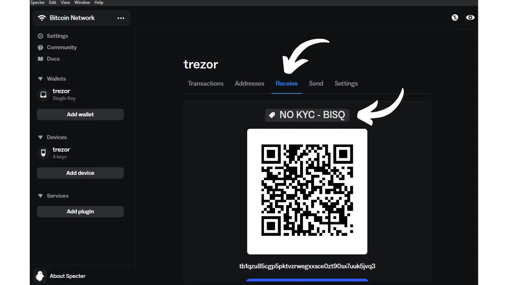
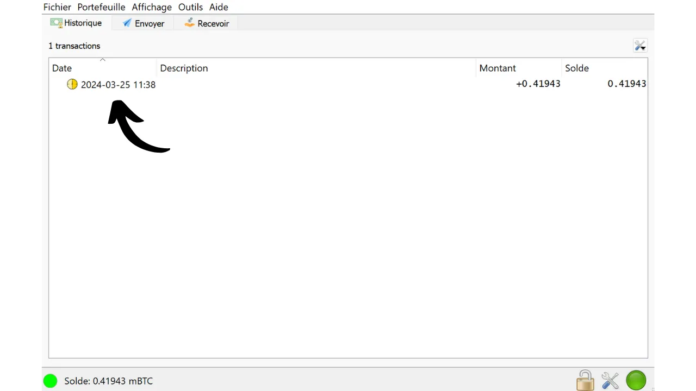
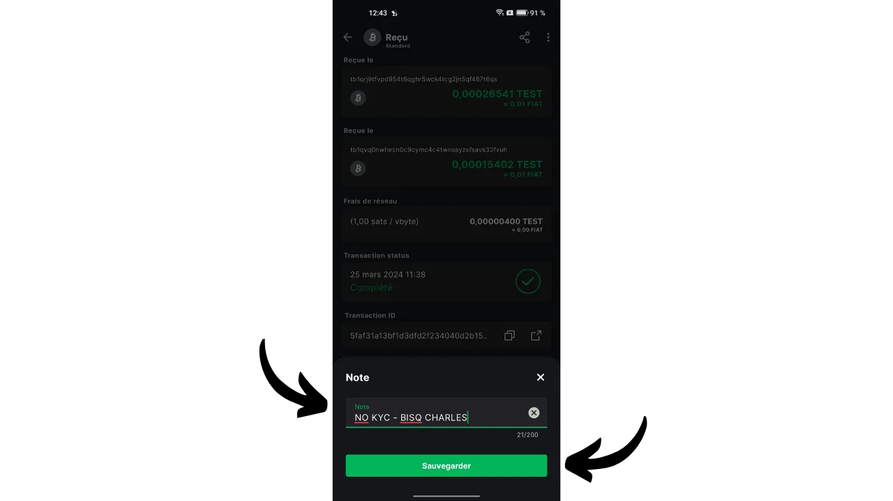

In diesem Tutorial erfahren Sie alles, was Sie über die Kennzeichnung von UTXOs in Ihrer Bitcoin-Wallet und über Coin Control wissen müssen. Wir beginnen mit einem theoretischen Abschnitt, um diese Konzepte vollständig zu verstehen, bevor wir zu einem praktischen Teil übergehen, in dem wir erkunden, wie man Kennzeichnungen konkret in der Haupt-Bitcoin-Wallet-Software verwendet.

## Was ist UTXO-Kennzeichnung?
"Kennzeichnung" ist eine Technik, die darin besteht, eine Anmerkung oder ein Label mit einem spezifischen UTXO innerhalb einer Bitcoin-Wallet zu verknüpfen. Diese Anmerkungen werden lokal von der Wallet-Software gespeichert und niemals über das Bitcoin-Netzwerk übertragen. Die Kennzeichnung ist somit ein Werkzeug für das persönliche Management.

Zum Beispiel, wenn ich ein UTXO aus einer P2P-Transaktion über Bisq von Charles erhalte, könnte ich ihm das Label `Bisq P2P-Kauf Charles` zuweisen.

Die Kennzeichnung ermöglicht es, sich an den Ursprung oder das beabsichtigte Ziel des UTXOs zu erinnern, was das Fondmanagement vereinfacht und die Privatsphäre des Benutzers optimiert. Die Kennzeichnung wird noch relevanter, wenn sie mit der "Coin-Control"-Funktionalität kombiniert wird. Coin Control ist eine Option, die in guten Bitcoin-Wallets verfügbar ist und dem Benutzer die Möglichkeit gibt, manuell zu wählen, welche spezifischen UTXOs als Eingaben verwendet werden, wenn eine Transaktion erstellt wird.

Die Verwendung einer Wallet mit Coin Control, gekoppelt mit UTXO-Kennzeichnung, ermöglicht es den Benutzern, UTXOs für ihre Transaktionen präzise zu unterscheiden und auszuwählen, und somit das Zusammenführen von UTXOs aus verschiedenen Quellen zu vermeiden. Diese Praxis verringert die Risiken, die mit der Common Input Ownership Heuristic (CIOH) verbunden sind, die eine gemeinsame Eigentümerschaft der Eingaben einer Transaktion nahelegt, was die Privatsphäre des Benutzers gefährden kann.

Kehren wir zurück zum Beispiel meines no-KYC UTXOs von Bisq; ich möchte vermeiden, es mit einem UTXO zu kombinieren, das beispielsweise von einer regulierten Austauschplattform stammt, die meine Identität kennt. Indem ich ein deutliches Label auf mein no-KYC UTXO und auf mein KYC UTXO setze, werde ich in der Lage sein, leicht zu identifizieren, welches UTXO als Eingabe für eine Ausgabe verwendet werden soll, unter Verwendung der Coin-Control-Funktionalität.

## Wie kennzeichnet man sein UTXO korrekt?
Es gibt keine universelle Methode zur Kennzeichnung von UTXOs, die für jeden passt. Es liegt an Ihnen, ein Kennzeichnungssystem zu definieren, damit Sie sich in Ihrer Wallet leicht zurechtfinden können.
Ein entscheidendes Kriterium bei der Kennzeichnung ist die Quelle des UTXOs. Sie sollten einfach angeben, wie diese Münze in Ihre Wallet gelangt ist. Stammt sie von einer Austauschplattform? Eine Rechnungsbegleichung durch einen Kunden? Ein Peer-to-Peer-Austausch? Oder stellt sie das Wechselgeld von einem Kauf dar? So könnten Sie spezifizieren:
- `Abhebung Exchange.com`;
- `Zahlung Kunde David`;
- `P2P-Kauf Charles`;
- `Wechselgeld vom Sofakauf`.

Um Ihr UTXO-Management zu verfeinern und Ihren Strategien zur Fondstrennung innerhalb Ihrer Wallet zu entsprechen, könnten Sie Ihre Labels mit einem zusätzlichen Indikator anreichern, der diese Trennungen widerspiegelt. Wenn Ihre Wallet zwei Kategorien von UTXOs enthält, die Sie nicht mischen möchten, könnten Sie einen Marker in Ihren Labels integrieren, um diese Gruppen klar zu unterscheiden.

Diese Trennmarker hängen von Ihren eigenen Kriterien ab, wie der Unterscheidung zwischen KYC UTXO (Ihre Identität kennend) und no-KYC (anonym) oder zwischen beruflichen und persönlichen Mitteln. Unter Berücksichtigung der zuvor genannten Beispiellabels könnte dies übersetzt werden als:
- `KYC - Abhebung Exchange.com`;
- `KYC - Zahlung Kunde David`;
- `NO KYC - P2P-Kauf Charles`;
- `NO KYC - Wechselgeld vom Sofakauf`.
 Beachten Sie in jedem Fall, dass eine gute Beschriftung eine ist, die Sie verstehen können, wenn Sie sie benötigen. Wenn Ihre Bitcoin-Wallet hauptsächlich zum Sparen gedacht ist, kann es sein, dass die Beschriftungen erst in mehreren Jahrzehnten für Sie nützlich sein werden. Stellen Sie daher sicher, dass sie klar, präzise und umfassend sind.

Es ist auch ratsam, die Beschriftung einer Münze durchgehend bei Transaktionen beizubehalten. Wenn Sie beispielsweise eine UTXO-Konsolidierung ohne KYC durchführen, stellen Sie sicher, dass das resultierende UTXO nicht nur als `Konsolidierung`, sondern spezifisch als `Konsolidierung ohne KYC` markiert wird, um eine klare Spur des Münzursprungs zu erhalten.

Schließlich ist es nicht zwingend erforderlich, ein Datum auf ein Etikett zu setzen. Die meisten Wallet-Software zeigt bereits das Transaktionsdatum an, und es ist immer möglich, diese Information in einem Block-Explorer mit dessen TXID abzurufen.

## Tutorial: Beschriftung in Specter Desktop

Verbinden und öffnen Sie Ihre Wallet in Specter Desktop und wählen Sie dann den Tab `Adressen`.

Hier sehen Sie die Liste aller Ihrer Adressen sowie alle darauf gesperrten Bitcoins. Standardmäßig werden Adressen unter der Spalte `Label` durch ihren Index identifiziert. Um ein Label zu ändern, klicken Sie einfach darauf, geben das gewünschte Label ein und bestätigen dann durch Klicken auf das blaue Symbol.

Ihr Label wird dann in der Liste Ihrer Adressen angezeigt.

Sie können auch im Voraus ein Label zuweisen, wenn Sie Ihre Empfangsadresse mit dem Absender teilen. Dazu notieren Sie Ihr Label im dafür vorgesehenen Feld, indem Sie auf den Tab `Empfangen` zugreifen.

## Tutorial: Beschriftung in Electrum

In der Electrum Wallet klicken Sie nach dem Einloggen in Ihre Wallet auf die Transaktion, der Sie ein Label zuweisen möchten, im Tab `Verlauf`.

Ein neues Fenster öffnet sich. Klicken Sie auf das Feld `Beschreibung` und geben Sie Ihr Label ein.

Sobald das Label eingegeben ist, können Sie dieses Fenster schließen.

Ihr Label wurde erfolgreich gespeichert. Sie finden es unter dem Tab `Beschreibung`.

Im Tab `Münzen`, von dem aus Sie die Münzkontrolle durchführen können, finden Sie Ihr Label in der Spalte `Label`.

## Tutorial: Beschriftung in Green Wallet

In der Green Wallet-App greifen Sie auf Ihre Wallet zu und wählen die Transaktion aus, die Sie beschriften möchten. Klicken Sie dann auf das kleine Stiftsymbol, um Ihr Label zu notieren.

Geben Sie Ihr Label ein und klicken Sie auf den grünen `Speichern`-Button.

Sie werden Ihr Label sowohl in den Details Ihrer Transaktion als auch auf dem Dashboard Ihrer Wallet finden können.

## Tutorial: Beschriftung in Samourai Wallet

In der Samourai Wallet gibt es verschiedene Methoden, um einer Transaktion ein Label zuzuweisen. Für die erste Methode öffnen Sie Ihre Wallet und wählen die Transaktion aus, der Sie ein Label hinzufügen möchten. Drücken Sie dann den `Hinzufügen`-Button, der sich neben dem Feld `Notizen` befindet.

Geben Sie Ihr Label ein und bestätigen Sie durch Klicken auf den blauen `Hinzufügen`-Button.

Ihr Label finden Sie in den Details Ihrer Transaktion, aber auch auf dem Dashboard Ihrer Wallet.

Für die zweite Methode klicken Sie auf die drei kleinen Punkte oben rechts auf dem Bildschirm und dann auf das Menü `Show Unspent Transaction Outputs`.

Hier finden Sie eine umfassende Liste aller UTXOs in Ihrer Wallet. Die angezeigte Liste bezieht sich auf mein Einzahlungskonto, jedoch kann diese Operation für Whirlpool-Konten durch Navigation aus dem dedizierten Menü repliziert werden.

Klicken Sie dann auf das UTXO, das Sie beschriften möchten, gefolgt vom `Add`-Button.

Geben Sie Ihr Label ein und bestätigen Sie durch Klicken auf den blauen `Add`-Button. Danach finden Sie Ihr Label sowohl in den Details Ihrer Transaktion als auch auf dem Dashboard Ihrer Wallet.

## Tutorial: Beschriftung im Sparrow Wallet

Mit der Sparrow Wallet-Software ist es möglich, Labels auf mehrere Arten zuzuweisen. Die einfachste Methode besteht darin, ein Label im Voraus hinzuzufügen, wenn man eine Empfangsadresse an den Sender kommuniziert. Dazu klicken Sie im Menü `Receive` auf das Feld `Label` und geben das gewünschte Label ein. Dies wird bewahrt und ist im gesamten Programm zugänglich, sobald Bitcoins auf der Adresse empfangen werden.

Wenn Sie vergessen haben, Ihre Adresse bei Erhalt zu beschriften, ist es immer noch möglich, später ein Label hinzuzufügen, über das Menü `Transactions`. Klicken Sie einfach auf Ihre Transaktion in der Spalte `Label` und geben Sie das gewünschte Label ein.

Sie haben auch die Möglichkeit, Ihre Labels über das Menü `Addresses` hinzuzufügen oder zu ändern.

Schließlich können Sie Ihre Labels im Menü `UTXOs` einsehen. Sparrow Wallet fügt automatisch in Klammern hinter Ihrem Label die Art des Outputs hinzu, was hilft, UTXOs, die aus Wechselgeld resultieren, von denen zu unterscheiden, die direkt empfangen wurden.

