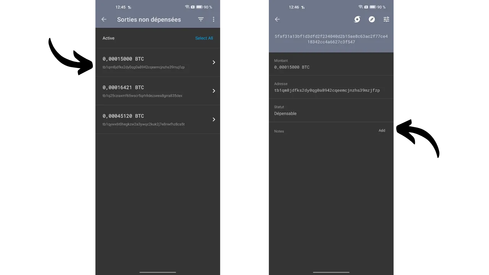

In this tutorial, you will discover everything you need to know about labeling UTXOs in your Bitcoin wallet and about coin control. We start with a theoretical section to fully understand these concepts, before moving on to a practical part where we explore how to concretely use labels in the main Bitcoin wallet software.

## What is UTXO labelling?
"Labelling" is a technique that involves associating an annotation or label with a specific UTXO within a Bitcoin wallet. These annotations are stored locally by the wallet software and are never transmitted over the Bitcoin network. Labelling is thus a tool for personal management.

For example, if I receive a UTXO from a P2P transaction via Bisq with Charles, I could assign it the label `Bisq P2P Purchase Charles`.

Labelling allows one to remember the origin or intended destination of the UTXO, which simplifies fund management and optimizes the user's privacy. Labelling becomes even more relevant when combined with the "coin control" functionality. Coin control is an option available in good Bitcoin wallets, which gives the user the ability to manually choose which specific UTXOs will be used as inputs when creating a transaction.

Using a wallet with coin control, coupled with UTXO labelling, allows users to precisely distinguish and select UTXOs for their transactions, thus avoiding merging UTXOs from different sources. This practice reduces the risks associated with the Common Input Ownership Heuristic (CIOH), which suggests common ownership of the inputs of a transaction, which can compromise the user's privacy.

Let's go back to the example of my no-KYC UTXO from Bisq; I want to avoid combining it with a UTXO coming, say, from a regulated exchange platform that knows my identity. By placing a distinct label on my no-KYC UTXO and on my KYC UTXO, I will be able to easily identify which UTXO to consume as input to satisfy a spending, using the coin control functionality.

## How to properly label your UTXO?
There is no universal method for labelling UTXOs that suits everyone. It's up to you to define a labelling system so that you can easily find your way around your wallet.
A crucial criterion in labeling is the source of the UTXO. You should simply indicate how this coin arrived in your wallet. Is it from an exchange platform? A bill settlement by a client? A peer-to-peer exchange? Or does it represent change from a purchase? Thus, you could specify:
- `Withdrawal Exchange.com`;
- `Payment Client David`;
- `P2P Purchase Charles`;
- `Change from sofa purchase`.

To refine your UTXO management and adhere to your fund segregation strategies within your wallet, you could enrich your labels with an additional indicator that reflects these separations. If your wallet contains two categories of UTXOs that you do not want to mix, you could integrate a marker in your labels to clearly distinguish these groups.

These separation markers will depend on your own criteria, such as the distinction between KYC UTXO (knowing your identity) and no-KYC (anonymous), or between professional and personal funds. Taking the previously mentioned label examples, this could be translated as:
- `KYC - Withdrawal Exchange.com`;
- `KYC - Payment Client David`;
- `NO KYC - P2P Purchase Charles`;
- `NO KYC - Change from sofa purchase`.

In any case, keep in mind that good labeling is labeling that you will be able to understand when you need it. If your Bitcoin wallet is primarily intended for savings, it may be that the labels will only be useful to you in several decades. Therefore, make sure they are clear, precise, and comprehensive.

It is also advisable to perpetuate the labeling of a coin throughout transactions. For example, during a no-KYC UTXO consolidation, make sure to mark the resulting UTXO not just as `consolidation`, but specifically as `no-KYC consolidation` to maintain a clear trace of the coin's origin.

Finally, it is not mandatory to put a date on a label. Most wallet software already displays the transaction date, and it is always possible to retrieve this information on a block explorer using its TXID.

## Tutorial: Labeling on Specter Desktop

Connect and open your wallet on Specter Desktop, then select the `Addresses` tab.

Here, you will see the list of all your addresses, as well as any bitcoins that are locked on them. By default, addresses are identified by their index under the `Label` column. To change a label, simply click on it, enter the desired label, and then confirm by clicking on the blue icon.

Your label will then appear in the list of your addresses.

You can also assign a label in advance, when you share your receiving address with the sender. To do this, by accessing the `Receive` tab, note your label in the dedicated field.

## Tutorial: Labeling on Electrum

On Electrum Wallet, after logging into your wallet, click on the transaction to which you want to assign a label from the `History` tab.

A new window opens. Click on the `Description` box and type your label.

Once the label is entered, you can close this window.

Your label has been successfully saved. You can find it under the `Description` tab.

In the `Coins` tab, from which you can perform coin control, your label is found in the `Label` column.

## Tutorial: Labeling on Green Wallet

In the Green Wallet app, access your wallet and select the transaction you want to label. Then, click on the small pencil icon to note your label.

Type your label, then click on the green `Save` button.

You will be able to find your label both in the details of your transaction and on the dashboard of your wallet.

## Tutorial: Labeling on Samourai Wallet

In Samourai Wallet, there are different methods that allow you to assign a label to a transaction. For the first one, start by opening your wallet and select the transaction to which you want to add a label. Then press the `Add` button, located next to the `Notes` box.

Type your label and confirm by clicking on the blue `Add` button.

You will find your label in the details of your transaction, but also on the dashboard of your wallet.

For the second method, click on the three small dots at the top right of the screen, then on the `Show Unspent Transaction Outputs` menu.

Here, you will find a comprehensive list of all the UTXOs present in your wallet. The displayed list pertains to my deposit account, however, this operation can be replicated for Whirlpool accounts by navigating from the dedicated menu.

Then click on the UTXO you wish to label, followed by the `Add` button.

Type your label and confirm by clicking on the blue `Add` button. You will then find your label both in the details of your transaction and on your wallet's dashboard.

## Tutorial: Labeling on Sparrow Wallet

With Sparrow Wallet software, it is possible to assign labels in multiple ways. The simplest method is to add a label upfront, when communicating a receiving address to the sender. To do this, in the `Receive` menu, click on the `Label` field and enter the label of your choice. This will be preserved and accessible throughout the software as soon as bitcoins are received on the address.

If you forgot to label your address upon receipt, it is still possible to add one later via the `Transactions` menu. Simply click on your transaction within the `Label` column, then enter the desired label.

You also have the option to add or modify your labels from the `Addresses` menu.

Finally, you can view your labels in the `UTXOs` menu. Sparrow Wallet automatically adds in parentheses behind your label the nature of the output, which helps to distinguish UTXOs resulting from change from those received directly.

