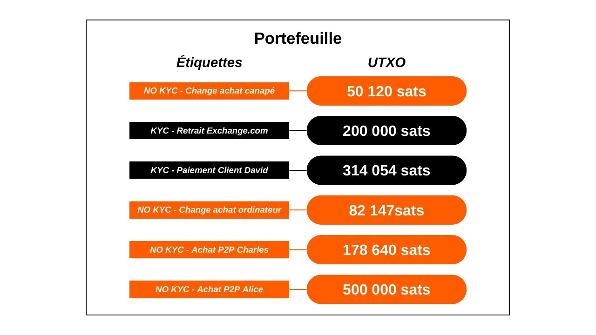

Dans ce tutoriel, vous allez découvrir tout ce qu'il faut savoir sur l'étiquetage des UTXO dans votre portefeuille Bitcoin et le coin control. Nous commençons par une section théorique pour bien comprendre ces concepts, avant de passer à une partie pratique où nous explorons comment utiliser concrètement des étiquettes dans les principaux logiciels de portefeuille Bitcoin.

## Qu'est-ce que le labelling d'UTXO ?
Le "labelling" est une technique consistant à associer une annotation ou une étiquette à un UTXO spécifique au sein d'un portefeuille Bitcoin. Ces annotations sont stockées localement par le logiciel de portefeuille et ne sont jamais transmises sur le réseau Bitcoin. Le labelling est ainsi un outil de gestion personnel.

Par exemple, si je reçois un UTXO d'une transaction P2P via Bisq avec Charles, je pourrais lui attribuer l'étiquette `Achat BISQ P2P Charles`.

Le labelling permet de se souvenir de l'origine ou de la destination envisagée de l'UTXO, ce qui simplifie la gestion des fonds et l'optimisation de la confidentialité de l'utilisateur. L'étiquetage devient encore plus pertinent lorsqu'il est combiné avec la fonctionnalité de "coin control". Le coin control est une option disponible dans les bons portefeuilles Bitcoin, qui offre à l'utilisateur la possibilité de choisir manuellement quels UTXO spécifiques seront utilisés comme entrées lors de la création d'une transaction.

L'utilisation d'un portefeuille avec du coin control, couplé à l'étiquetage des UTXO, permet aux utilisateurs de distinguer et de sélectionner avec précision les UTXO pour leurs transactions, évitant ainsi de fusionner des UTXO provenant de sources différentes. Cette pratique réduit les risques liés à l'heuristique d'analyse de chaîne CIOH (_Common Input Ownership Heuristic_), qui suggère une propriété commune des entrées d'une transaction, ce qui peut compromettre la confidentialité de l'utilisateur.

Reprenons l'exemple de mon UTXO no-KYC issu de Bisq ; je souhaite éviter de le combiner avec un UTXO provenant, disons, d'une plateforme d'échange réglementée connaissant mon identité. En apposant une étiquette distincte sur mon UTXO no-KYC et sur mon UTXO KYC, je pourrai aisément identifier quel UTXO consommer en input pour satisfaire une dépense, en me servant de la fonctionnalité de coin control.

## Comment bien étiqueter ses UTXO ?
Il n'y a pas de méthode universelle pour l'étiquetage des UTXO qui puisse convenir à tous. C'est à vous de définir un système d'étiquetage pour que vous puissiez facilement vous y retrouver sur votre portefeuille. 

Un critère primordial dans l'étiquetage est la source de l'UTXO. Vous devriez simplement indiquer la manière dont cette pièce est parvenue dans votre portefeuille. Est-elle issue d'une plateforme d'échange ? D'un règlement de facture par un client ? D'un échange pair-à-pair ? Ou bien représente-t-elle le change d'une dépense ? Ainsi, vous pourriez spécifier :
- `Retrait Exchange.com` ;
- `Paiement Client David` ;
- `Achat P2P Charles` ;
- `Change achat canapé`.

Pour affiner votre gestion des UTXO et respecter vos stratégies de ségrégation de fonds au sein de votre portefeuille, vous pourriez enrichir vos étiquetages d'un indicateur supplémentaire qui reflète ces séparations. Si votre portefeuille contient deux catégories d'UTXO que vous tenez à ne pas mélanger, vous pourriez intégrer un marqueur dans vos étiquettes pour distinguer clairement ces groupes. 

Ces marqueurs de séparation dépendront de vos propres critères, comme par exemple, la distinction entre UTXO KYC (connaissant votre identité) et no-KYC (anonymes), ou encore entre fonds professionnels et personnels. En reprenant les exemples d'étiquettes mentionnés précédemment, cela pourrait se traduire par :
- `KYC - Retrait Exchange.com` ;
- `KYC - Paiement Client David` ;
- `NO KYC - Achat P2P Charles` ;
- `NO KYC - Change achat canapé`.

Dans tous les cas, gardez à l'esprit qu'un bon étiquetage est un étiquetage que vous pourrez comprendre lorsque vous en aurez besoin. Si votre portefeuille Bitcoin est principalement destiné à l'épargne, il se peut que les étiquettes ne vous soient utiles que dans plusieurs décennies. Assurez-vous donc qu'elles soient claires, précises et exhaustives.

Il est également conseillé de perpétuer l'étiquetage d'une pièce au fil des transactions. Par exemple, lors d'une consolidation d'UTXO no-KYC, assurez-vous de marquer l'UTXO résultant non pas seulement comme `consolidation`, mais spécifiquement comme `consolidation no-KYC` pour conserver une trace claire de la provenance des pièces.

Enfin, il n'est pas obligatoire de mettre une date sur une étiquette. La plupart des logiciels de portefeuilles affichent déjà la date de transaction, et il est toujours possible de retrouver cette information sur un explorateur de blocs grâce à son TXID.

## Tutoriel : étiqueter sur Specter Desktop

Connectez et ouvrez votre portefeuille sur Specter Desktop, puis sélectionnez ensuite l'onglet `Addresses`.

Ici, vous verrez apparaitre la liste de toutes vos adresses, ainsi que les éventuels bitcoins bloqués sur celles-ci. Par défaut, les adresses sont identifiées par leur index sous la colonne `Label`. Pour changer une étiquette, il suffit de cliquer dessus, saisir le libellé souhaité, puis valider en cliquant sur l'icône bleue.

Votre étiquette apparaitra ensuite dans la liste de vos adresses.

Vous pouvez également attribuer une étiquette en amont, au moment où vous partagez votre adresse de réception à l'envoyeur. Pour cela, en accédant à l'onglet `Receive`, notez votre étiquette dans le champ dédié.

## Tutoriel : étiqueter sur Electrum

Sur Electrum Wallet, après vous être connecté à votre portefeuille, cliquez sur la transaction à laquelle vous désirez attribuer une étiquette depuis l'onglet `Historique`.

Une nouvelle fenêtre s'ouvre. Cliquez sur la case `Description` et tapez votre étiquette.

Une fois l'étiquette entrée, vous pouvez fermer cette fenêtre.

Votre étiquette a bien été enregistrée. Vous pouvez la retrouver sous l'onglet `Description`.

Dans l'onglet `Monnaie`, depuis lequel vous pouvez faire du coin control, votre étiquette se retrouve dans la colonne `Libellé`.

## Tutoriel : étiqueter sur Green Wallet

Dans l'application Green Wallet, accédez à votre portefeuille et sélectionnez la transaction que vous voulez étiqueter. Puis, cliquez sur la petite icône en forme de crayon pour noter votre étiquette.

Tapez votre étiquette, puis cliquez sur le bouton vert `Sauvegarder`.

Vous pourrez retrouver votre étiquette à la fois dans les détails de votre transaction et sur le tableau de bord de votre portefeuille.

## Tutoriel : étiqueter sur Samourai Wallet

Dans Samourai Wallet, il existe différentes méthodes qui permettent d'attribuer une étiquette à une transaction. Pour la première, commencez par ouvrir votre portefeuille et sélectionnez la transaction à laquelle vous voulez ajouter une étiquette. Appuyez ensuite sur le bouton `Add`, situé à côté de la case `Notes`.

Tapez votre étiquette et confirmez en cliquant sur le bouton bleu `Add`.

Vous retrouverez votre étiquette dans les détails de votre transaction, mais également sur le tableau de bord de votre portefeuille.

Pour la seconde méthode, cliquez sur les trois petits points en haut à droite de l'écran, puis sur le menu `Montrer les sorties de transactions non dépensées`.

Vous y trouverez une liste exhaustive de tous les UTXO présents dans votre portefeuille. La liste affichée concerne mon compte de dépôt, cependant, cette opération peut être répliquée pour les comptes Whirlpool en naviguant depuis le menu dédié.

Cliquez ensuite sur l'UTXO que vous souhaitez étiqueter, puis sur le bouton `Add`.

Tapez votre étiquette et confirmez en cliquant sur le bouton bleu `Add`. Vous retrouverez ensuite votre étiquette à la fois dans les détails de votre transaction et sur le tableau de bord de votre portefeuille.

## Tutoriel : étiqueter sur Sparrow Wallet

Avec le logiciel Sparrow Wallet, il est possible d'attribuer des étiquettes de multiples manières. La méthode la plus simple consiste à ajouter une étiquette en amont, lors de la communication d'une adresse de réception à l'expéditeur. Pour ce faire, dans le menu `Receive`, cliquez sur le champ `Label` et saisissez l'étiquette de votre choix. Celle-ci sera conservée et accessible dans l'ensemble du logiciel dès lors que des bitcoins seront reçus sur l'adresse.

Si vous avez oublié d'étiqueter votre adresse lors de la réception, il est toujours possible d'en ajouter une ultérieurement via le menu `Transactions`. Il suffit de cliquer sur votre transaction au sein de la colonne `Label`, puis de saisir l'étiquette désirée.

Vous avez également la possibilité d'ajouter ou de modifier vos étiquettes depuis le menu `Addresses`.

Enfin, vous pouvez consulter vos étiquettes dans le menu `UTXOs`. Sparrow Wallet ajoute automatiquement entre parenthèses derrière votre étiquette la nature de l'output, ce qui permet de distinguer les UTXO issus de change de ceux reçus directement.

