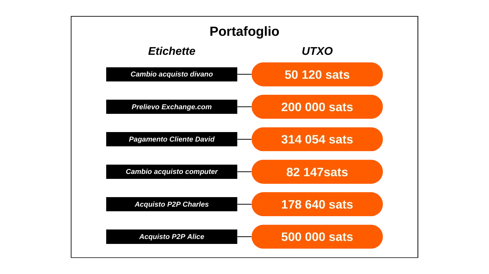

In questo tutorial, scoprirai tutto ciò che devi sapere sull'etichettatura degli UTXO nel tuo portafoglio Bitcoin e sul controllo delle monete. Iniziamo con una sezione teorica per comprendere appieno questi concetti, prima di passare a una parte pratica dove esploriamo come utilizzare concretamente le etichette nel principale software di portafoglio Bitcoin.

## Cos'è l'etichettatura UTXO?
"L'etichettatura" è una tecnica che comporta l'associazione di un'annotazione o etichetta con un UTXO specifico all'interno di un portafoglio Bitcoin. Queste annotazioni sono memorizzate localmente dal software del portafoglio e non vengono mai trasmesse sulla rete Bitcoin. L'etichettatura è quindi uno strumento per la gestione personale.

Ad esempio, se ricevo un UTXO da una transazione P2P tramite Bisq con Charles, potrei assegnargli l'etichetta `Bisq P2P Purchase Charles`.

L'etichettatura consente di ricordare l'origine o la destinazione prevista dell'UTXO, semplificando la gestione dei fondi e ottimizzando la privacy dell'utente. L'etichettatura diventa ancora più rilevante quando combinata con la funzionalità di "controllo delle monete". Il controllo delle monete è un'opzione disponibile nei buoni portafogli Bitcoin, che dà all'utente la possibilità di scegliere manualmente quali UTXO specifici verranno utilizzati come input quando si crea una transazione.

Utilizzare un portafoglio con controllo delle monete, abbinato all'etichettatura UTXO, consente agli utenti di distinguere e selezionare con precisione gli UTXO per le loro transazioni, evitando così di unire UTXO provenienti da fonti diverse. Questa pratica riduce i rischi associati all'Euristica di Proprietà Comune degli Input (CIOH), che suggerisce una proprietà comune degli input di una transazione, che può compromettere la privacy dell'utente.

Torniamo all'esempio del mio UTXO no-KYC da Bisq; voglio evitare di combinarlo con un UTXO proveniente, diciamo, da una piattaforma di scambio regolamentata che conosce la mia identità. Apponendo un'etichetta distinta sul mio UTXO no-KYC e sul mio UTXO KYC, sarò in grado di identificare facilmente quale UTXO consumare come input per soddisfare una spesa, utilizzando la funzionalità di controllo delle monete.

## Come etichettare correttamente il tuo UTXO?
Non esiste un metodo universale per etichettare gli UTXO che si adatti a tutti. Sta a te definire un sistema di etichettatura in modo da poterti orientare facilmente nel tuo portafoglio.
Un criterio cruciale nell'etichettatura è la fonte dell'UTXO. Dovresti semplicemente indicare come questa moneta è arrivata nel tuo portafoglio. Provviene da una piattaforma di scambio? Un pagamento di una fattura da parte di un cliente? Uno scambio peer-to-peer? O rappresenta il resto di un acquisto? Così, potresti specificare:
- `Prelievo Exchange.com`;
- `Pagamento Cliente David`;
- `Acquisto P2P Charles`;
- `Resto dall'acquisto del divano`.

Per affinare la gestione del tuo UTXO e aderire alle tue strategie di segregazione dei fondi all'interno del tuo portafoglio, potresti arricchire le tue etichette con un indicatore aggiuntivo che rifletta queste separazioni. Se il tuo portafoglio contiene due categorie di UTXO che non vuoi mescolare, potresti integrare un marcatore nelle tue etichette per distinguere chiaramente questi gruppi.

Questi marcatori di separazione dipenderanno dai tuoi criteri, come la distinzione tra UTXO KYC (che conosce la tua identità) e no-KYC (anonimo), o tra fondi professionali e personali. Prendendo gli esempi di etichette precedentemente menzionati, questo potrebbe essere tradotto come:
- `KYC - Prelievo Exchange.com`;
- `KYC - Pagamento Cliente David`;
- `NO KYC - Acquisto P2P Charles`;
- `NO KYC - Resto dall'acquisto del divano`.
In ogni caso, tenete presente che un'etichettatura valida è quella che sarete in grado di comprendere quando ne avrete bisogno. Se il vostro portafoglio Bitcoin è principalmente destinato al risparmio, potrebbe essere che le etichette saranno utili solo in diversi decenni. Pertanto, assicuratevi che siano chiare, precise e complete.

È inoltre consigliabile perpetuare l'etichettatura di una moneta attraverso le transazioni. Ad esempio, durante una consolidazione UTXO senza KYC, assicuratevi di contrassegnare l'UTXO risultante non solo come `consolidation`, ma specificamente come `no-KYC consolidation` per mantenere una traccia chiara dell'origine della moneta.

Infine, non è obbligatorio mettere una data su un'etichetta. La maggior parte dei software per portafogli mostra già la data della transazione, ed è sempre possibile recuperare queste informazioni su un block explorer utilizzando il suo TXID.

## Tutorial: Etichettatura su Specter Desktop

Connettiti e apri il tuo portafoglio su Specter Desktop, poi seleziona la scheda `Addresses`.

Qui, vedrai l'elenco di tutti i tuoi indirizzi, così come eventuali bitcoin che sono bloccati su di essi. Per impostazione predefinita, gli indirizzi sono identificati dal loro indice sotto la colonna `Label`. Per cambiare un'etichetta, basta cliccarci sopra, inserire l'etichetta desiderata e poi confermare cliccando sull'icona blu.

La tua etichetta apparirà quindi nell'elenco dei tuoi indirizzi.

Puoi anche assegnare un'etichetta in anticipo, quando condividi il tuo indirizzo di ricezione con il mittente. Per fare ciò, accedendo alla scheda `Receive`, annota la tua etichetta nel campo dedicato.

## Tutorial: Etichettatura su Electrum

Su Electrum Wallet, dopo aver effettuato l'accesso al tuo portafoglio, clicca sulla transazione a cui vuoi assegnare un'etichetta dalla scheda `History`.

Si apre una nuova finestra. Clicca sulla casella `Description` e digita la tua etichetta.

Una volta inserita l'etichetta, puoi chiudere questa finestra.

La tua etichetta è stata salvata con successo. Puoi trovarla sotto la scheda `Description`.

Nella scheda `Coins`, da cui puoi eseguire il controllo delle monete, la tua etichetta si trova nella colonna `Label`.

## Tutorial: Etichettatura su Green Wallet

Nell'app Green Wallet, accedi al tuo portafoglio e seleziona la transazione che vuoi etichettare. Poi, clicca sulla piccola icona della matita per annotare la tua etichetta.

Digita la tua etichetta, poi clicca sul pulsante verde `Save`.

Sarai in grado di trovare la tua etichetta sia nei dettagli della tua transazione che sulla dashboard del tuo portafoglio.

## Tutorial: Etichettatura su Samourai Wallet

In Samourai Wallet, ci sono diversi metodi che ti permettono di assegnare un'etichetta a una transazione. Per il primo, inizia aprendo il tuo portafoglio e seleziona la transazione a cui vuoi aggiungere un'etichetta. Poi premi il pulsante `Add`, situato accanto alla casella `Notes`.

Digita la tua etichetta e conferma cliccando sul pulsante blu `Add`.

Troverai la tua etichetta nei dettagli della tua transazione, ma anche sulla dashboard del tuo portafoglio.

Per il secondo metodo, clicca sui tre piccoli punti in alto a destra dello schermo, poi sul menu `Mostra Output di Transazione Non Spesi`.

Qui, troverai un elenco completo di tutti gli UTXO presenti nel tuo portafoglio. L'elenco visualizzato si riferisce al mio conto deposito, tuttavia, questa operazione può essere replicata per i conti Whirlpool navigando dal menu dedicato.

Poi clicca sull'UTXO che desideri etichettare, seguito dal pulsante `Aggiungi`.

Digita la tua etichetta e conferma cliccando sul pulsante blu `Aggiungi`. Troverai quindi la tua etichetta sia nei dettagli della tua transazione che sulla dashboard del tuo portafoglio.

## Tutorial: Etichettatura su Sparrow Wallet

Con il software Sparrow Wallet, è possibile assegnare etichette in più modi. Il metodo più semplice è aggiungere un'etichetta in anticipo, quando si comunica un indirizzo di ricezione al mittente. Per fare ciò, nel menu `Ricevi`, clicca sul campo `Etichetta` e inserisci l'etichetta di tua scelta. Questa sarà conservata e accessibile in tutto il software non appena i bitcoin sono ricevuti sull'indirizzo.

Se hai dimenticato di etichettare il tuo indirizzo al momento della ricezione, è comunque possibile aggiungerne uno in seguito tramite il menu `Transazioni`. Semplicemente clicca sulla tua transazione all'interno della colonna `Etichetta`, poi inserisci l'etichetta desiderata.

Hai anche l'opzione di aggiungere o modificare le tue etichette dal menu `Indirizzi`.

Infine, puoi visualizzare le tue etichette nel menu `UTXO`. Sparrow Wallet aggiunge automaticamente tra parentesi dietro la tua etichetta la natura dell'output, il che aiuta a distinguere gli UTXO risultanti dal resto da quelli ricevuti direttamente.

