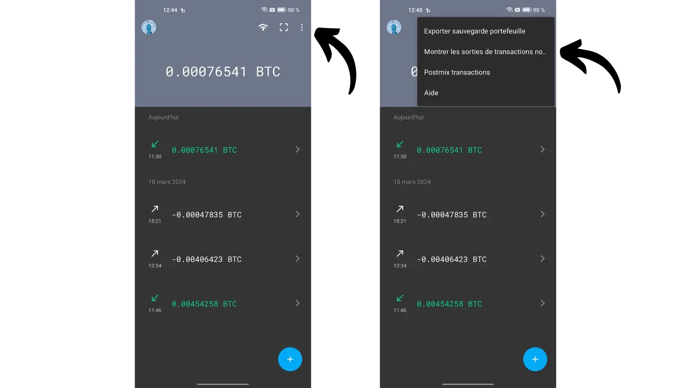
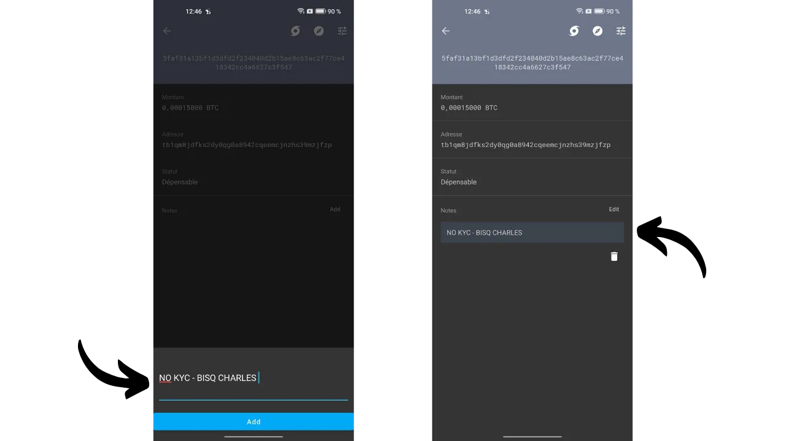

Trong hướng dẫn này, bạn sẽ khám phá mọi thứ bạn cần biết về việc gắn nhãn UTXOs trong ví Bitcoin của mình và về kiểm soát tiền xu. Chúng tôi bắt đầu với một phần lý thuyết để hiểu đầy đủ các khái niệm này, trước khi chuyển sang phần thực hành, nơi chúng tôi khám phá cách sử dụng nhãn một cách cụ thể trong phần mềm ví Bitcoin chính.

## Gắn nhãn UTXO là gì?
"Gắn nhãn" là một kỹ thuật bao gồm việc liên kết một chú thích hoặc nhãn với một UTXO cụ thể trong ví Bitcoin. Những chú thích này được lưu trữ cục bộ bởi phần mềm ví và không bao giờ được truyền qua mạng Bitcoin. Vì vậy, gắn nhãn là một công cụ cho quản lý cá nhân.

Ví dụ, nếu tôi nhận được một UTXO từ một giao dịch P2P qua Bisq với Charles, tôi có thể gán cho nó nhãn `Bisq P2P Purchase Charles`.

Gắn nhãn cho phép người dùng nhớ nguồn gốc hoặc đích đến dự định của UTXO, giúp đơn giản hóa quản lý quỹ và tối ưu hóa quyền riêng tư của người dùng. Gắn nhãn trở nên càng quan trọng hơn khi kết hợp với chức năng "kiểm soát tiền xu". Kiểm soát tiền xu là một tùy chọn có sẵn trong các ví Bitcoin tốt, cho phép người dùng có khả năng chọn thủ công các UTXOs cụ thể sẽ được sử dụng làm đầu vào khi tạo một giao dịch.

Sử dụng ví với kiểm soát tiền xu, kết hợp với gắn nhãn UTXO, cho phép người dùng phân biệt và chọn lựa UTXOs một cách chính xác cho giao dịch của họ, do đó tránh việc kết hợp UTXOs từ các nguồn khác nhau. Thực hành này giảm thiểu rủi ro liên quan đến Heuristic Sở Hữu Đầu Vào Chung (CIOH), gợi ý về sở hữu chung của các đầu vào của một giao dịch, có thể làm lộ quyền riêng tư của người dùng.

Hãy quay lại ví dụ về UTXO không-KYC của tôi từ Bisq; tôi muốn tránh kết hợp nó với một UTXO đến, ví dụ, từ một nền tảng trao đổi được quản lý biết danh tính của tôi. Bằng cách đặt một nhãn riêng biệt trên UTXO không-KYC của tôi và trên UTXO KYC của tôi, tôi sẽ có thể dễ dàng xác định UTXO nào để tiêu dùng làm đầu vào để thỏa mãn một khoản chi tiêu, sử dụng chức năng kiểm soát tiền xu.

## Làm thế nào để gắn nhãn UTXO một cách chính xác?
Không có phương pháp gắn nhãn UTXOs phổ quát nào phù hợp với tất cả mọi người. Việc định nghĩa một hệ thống gắn nhãn sao cho bạn có thể dễ dàng tìm đường trong ví của mình là do bạn.
Một tiêu chí quan trọng trong việc gắn nhãn là nguồn gốc của UTXO. Bạn chỉ cần chỉ ra làm thế nào đồng tiền này đến ví của bạn. Nó có từ một nền tảng trao đổi không? Một việc thanh toán hóa đơn bởi một khách hàng? Một giao dịch ngang hàng? Hay nó đại diện cho tiền thối từ một việc mua hàng? Do đó, bạn có thể chỉ định:
- `Rút tiền Exchange.com`;
- `Thanh toán Khách hàng David`;
- `Mua hàng P2P Charles`;
- `Tiền thối từ mua sofa`.

Để tinh chỉnh quản lý UTXO của bạn và tuân theo các chiến lược phân chia quỹ trong ví của bạn, bạn có thể làm giàu nhãn của mình với một chỉ số bổ sung phản ánh những phân chia này. Nếu ví của bạn chứa hai loại UTXOs mà bạn không muốn trộn lẫn, bạn có thể tích hợp một dấu hiệu trong nhãn của mình để phân biệt rõ ràng những nhóm này.

Những dấu hiệu phân chia này sẽ phụ thuộc vào tiêu chí của riêng bạn, như sự phân biệt giữa UTXO KYC (biết danh tính của bạn) và không-KYC (ẩn danh), hoặc giữa quỹ chuyên nghiệp và cá nhân. Lấy ví dụ về nhãn đã đề cập trước đó, điều này có thể được dịch như:
- `KYC - Rút tiền Exchange.com`;
- `KYC - Thanh toán Khách hàng David`;
- `KHÔNG KYC - Mua hàng P2P Charles`;
- `KHÔNG KYC - Tiền thối từ mua sofa`.
Dù trong trường hợp nào, hãy nhớ rằng việc gắn nhãn tốt là khi bạn có thể hiểu được nhãn đó khi bạn cần đến nó. Nếu ví Bitcoin của bạn chủ yếu dùng để tiết kiệm, có thể bạn chỉ thấy nhãn hữu ích sau vài thập kỷ. Do đó, hãy đảm bảo rằng chúng rõ ràng, chính xác và đầy đủ.

Cũng nên duy trì việc gắn nhãn cho một đồng tiền xuyên suốt các giao dịch. Ví dụ, trong quá trình tổng hợp UTXO không KYC, hãy chắc chắn đánh dấu UTXO kết quả không chỉ là `tổng hợp`, mà cụ thể là `tổng hợp không KYC` để duy trì một dấu vết rõ ràng về nguồn gốc của đồng tiền.

Cuối cùng, không bắt buộc phải đặt ngày trên một nhãn. Hầu hết phần mềm ví đã hiển thị ngày giao dịch, và luôn có thể truy xuất thông tin này trên một trình khám phá khối bằng cách sử dụng TXID của nó.

## Hướng dẫn: Gắn nhãn trên Specter Desktop

Kết nối và mở ví của bạn trên Specter Desktop, sau đó chọn tab `Addresses`.

Tại đây, bạn sẽ thấy danh sách tất cả các địa chỉ của mình, cũng như bất kỳ bitcoin nào đang bị khóa trên chúng. Theo mặc định, các địa chỉ được xác định bởi chỉ số của chúng dưới cột `Label`. Để thay đổi một nhãn, chỉ cần nhấp vào nó, nhập nhãn mong muốn, sau đó xác nhận bằng cách nhấp vào biểu tượng màu xanh.

Nhãn của bạn sau đó sẽ xuất hiện trong danh sách các địa chỉ của bạn.

Bạn cũng có thể gán một nhãn trước, khi bạn chia sẻ địa chỉ nhận của mình với người gửi. Để làm điều này, bằng cách truy cập vào tab `Receive`, ghi nhãn của bạn vào trường dành riêng.

## Hướng dẫn: Gắn nhãn trên Electrum

Trên Electrum Wallet, sau khi đăng nhập vào ví của bạn, nhấp vào giao dịch mà bạn muốn gán nhãn từ tab `History`.

Một cửa sổ mới mở ra. Nhấp vào ô `Description` và nhập nhãn của bạn.

Sau khi nhãn được nhập, bạn có thể đóng cửa sổ này.

Nhãn của bạn đã được lưu thành công. Bạn có thể tìm thấy nó dưới tab `Description`.

Trong tab `Coins`, từ đó bạn có thể thực hiện kiểm soát đồng tiền, nhãn của bạn được tìm thấy trong cột `Label`.

## Hướng dẫn: Gắn nhãn trên Green Wallet

Trong ứng dụng Green Wallet, truy cập vào ví của bạn và chọn giao dịch bạn muốn gắn nhãn. Sau đó, nhấp vào biểu tượng bút nhỏ để ghi nhãn của bạn.

Nhập nhãn của bạn, sau đó nhấp vào nút `Save` màu xanh.

Bạn sẽ có thể tìm thấy nhãn của mình cả trong chi tiết giao dịch của bạn và trên bảng điều khiển của ví bạn.

## Hướng dẫn: Gắn nhãn trên Samourai Wallet

Trong Samourai Wallet, có các phương pháp khác nhau cho phép bạn gán nhãn cho một giao dịch. Đối với phương pháp đầu tiên, bắt đầu bằng cách mở ví của bạn và chọn giao dịch mà bạn muốn thêm nhãn. Sau đó nhấn nút `Add`, nằm cạnh ô `Notes`.

Nhập nhãn của bạn và xác nhận bằng cách nhấp vào nút màu xanh `Thêm`.

Bạn sẽ tìm thấy nhãn của mình trong chi tiết giao dịch của bạn, nhưng cũng trên bảng điều khiển của ví của bạn.

Đối với phương pháp thứ hai, nhấp vào ba chấm nhỏ ở góc trên bên phải của màn hình, sau đó chọn menu `Hiển thị Đầu Ra Giao Dịch Chưa Chi Tiêu`.

Tại đây, bạn sẽ tìm thấy danh sách đầy đủ tất cả các UTXO có trong ví của bạn. Danh sách hiển thị liên quan đến tài khoản gửi tiền của tôi, tuy nhiên, thao tác này có thể được sao chép cho các tài khoản Whirlpool bằng cách điều hướng từ menu chuyên dụng.

Sau đó nhấp vào UTXO mà bạn muốn gắn nhãn, tiếp theo là nút `Thêm`.

Nhập nhãn của bạn và xác nhận bằng cách nhấp vào nút màu xanh `Thêm`. Sau đó, bạn sẽ tìm thấy nhãn của mình cả trong chi tiết giao dịch và trên bảng điều khiển ví của bạn.

## Hướng dẫn: Gắn nhãn trên Sparrow Wallet

Với phần mềm Sparrow Wallet, có thể gán nhãn theo nhiều cách. Phương pháp đơn giản nhất là thêm nhãn ngay từ đầu, khi thông báo địa chỉ nhận cho người gửi. Để làm điều này, trong menu `Nhận`, nhấp vào trường `Nhãn` và nhập nhãn bạn chọn. Nhãn này sẽ được bảo toàn và có thể truy cập trong suốt phần mềm ngay khi bitcoin được nhận trên địa chỉ.

Nếu bạn quên gắn nhãn cho địa chỉ của mình khi nhận, vẫn có thể thêm một nhãn sau này qua menu `Giao Dịch`. Chỉ cần nhấp vào giao dịch của bạn trong cột `Nhãn`, sau đó nhập nhãn mong muốn.

Bạn cũng có tùy chọn thêm hoặc sửa đổi nhãn của mình từ menu `Địa Chỉ`.

Cuối cùng, bạn có thể xem nhãn của mình trong menu `UTXO`. Sparrow Wallet tự động thêm vào sau nhãn của bạn bằng cách đặt trong ngoặc đơn bản chất của đầu ra, giúp phân biệt UTXO kết quả từ việc thay đổi so với những cái được nhận trực tiếp.

