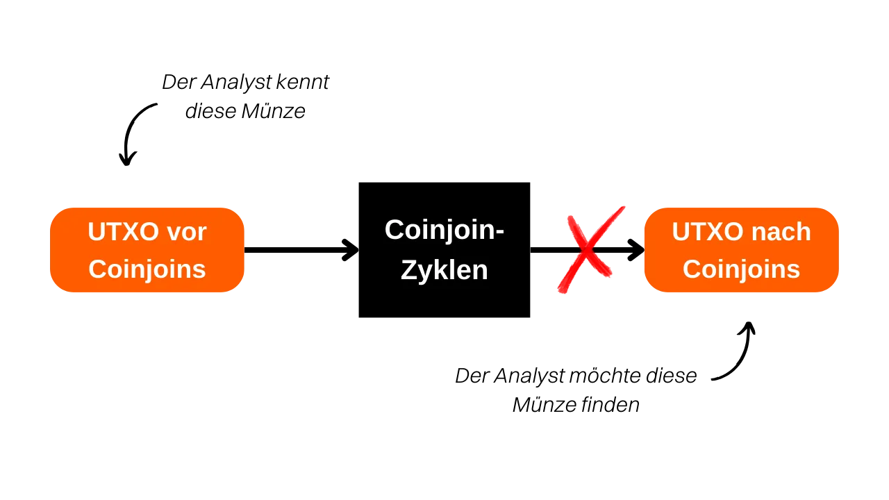
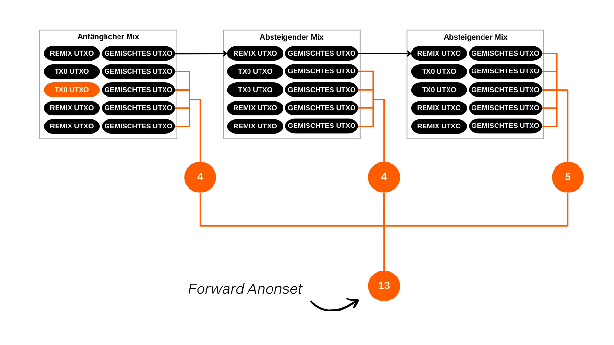
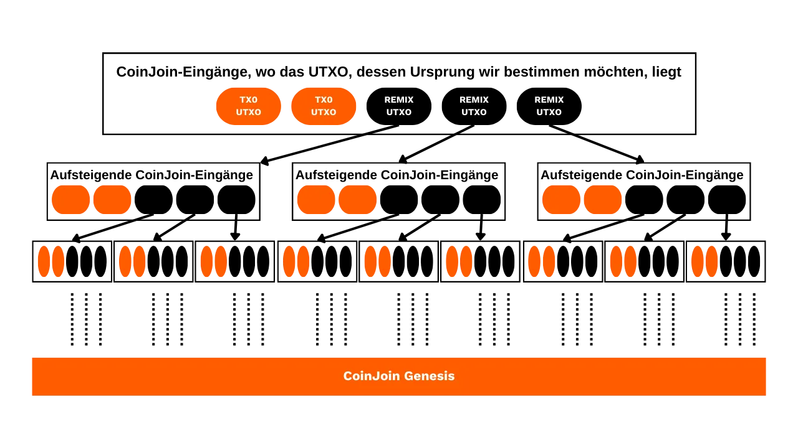

***ACHTUNG:** Nach der Verhaftung der Gründer von Samourai Wallet und der Beschlagnahme ihrer Server am 24. April ist das Whirlpool Stats Tool nicht mehr zum Download verfügbar, da es auf dem Gitlab von Samourai gehostet wurde. Auch wenn Sie dieses Tool zuvor lokal auf Ihrem Computer heruntergeladen hatten oder es auf Ihrem RoninDojo-Knoten installiert war, wird WST derzeit nicht funktionieren. Es war abhängig von den Daten, die von OXT.me bereitgestellt wurden, und diese Website ist nicht mehr zugänglich. Derzeit ist WST nicht besonders nützlich, da das Whirlpool-Protokoll inaktiv ist. Es bleibt jedoch möglich, dass diese Software in den kommenden Wochen wieder in Betrieb genommen wird. Darüber hinaus bleibt der theoretische Teil dieses Artikels relevant, um die Prinzipien und Ziele von Coinjoins im Allgemeinen (nicht nur Whirlpool) zu verstehen sowie die Effektivität des Whirlpool-Modells zu verstehen. Sie können auch lernen, wie die durch Coinjoin-Zyklen bereitgestellte Anonymität quantifiziert wird.*

_Wir verfolgen die Entwicklungen in diesem Fall sowie die Entwicklungen bezüglich der zugehörigen Tools genau. Seien Sie versichert, dass wir dieses Tutorial aktualisieren werden, sobald neue Informationen verfügbar sind._

_Dieses Tutorial wird nur zu Bildungs- und Informationszwecken bereitgestellt. Wir befürworten oder ermutigen die Verwendung dieser Tools zu kriminellen Zwecken nicht. Es liegt in der Verantwortung jedes Benutzers, die Gesetze in seiner Gerichtsbarkeit zu beachten._

---

*"Unterbrechen Sie die Spur, die Ihre Münzen hinterlassen"*

In diesem Tutorial werden wir das Konzept von Anonsets studieren, Indikatoren, die es uns ermöglichen, die Qualität eines Coinjoin-Prozesses auf Whirlpool zu schätzen. Wir werden die Berechnungs- und Interpretationsmethode dieser Indikatoren behandeln. Nach dem theoretischen Teil werden wir zur Praxis übergehen, indem wir lernen, die Anonsets einer spezifischen Transaktion mit dem Python-Tool *Whirlpool Stats Tools* (WST) zu berechnen.

## Was ist ein Coinjoin auf Bitcoin?
**Coinjoin ist eine Technik, die die Nachverfolgbarkeit von Bitcoins in der Blockchain bricht**. Sie basiert auf einer kollaborativen Transaktion mit einer spezifischen Struktur gleichen Namens: der Coinjoin-Transaktion.

Coinjoin-Transaktionen erhöhen die Privatsphäre der Bitcoin-Nutzer, indem sie die Kettenanalyse für externe Beobachter erschweren. Ihre Struktur ermöglicht es, mehrere Münzen von verschiedenen Benutzern in einer einzigen Transaktion zu verschmelzen, wodurch die Spuren verwischt und es schwierig gemacht wird, die Verbindungen zwischen Eingabe- und Ausgabeadressen zu bestimmen.

Das Prinzip von Coinjoin basiert auf einem kollaborativen Ansatz: Mehrere Benutzer, die ihre Bitcoins mischen möchten, hinterlegen identische Beträge als Eingaben derselben Transaktion. Diese Beträge werden dann in Ausgaben äquivalenten Werts umverteilt. Am Ende der Transaktion wird es unmöglich, eine spezifische Ausgabe einem bestimmten Benutzer zuzuordnen. Es besteht keine direkte Verbindung zwischen den Eingaben und Ausgaben, wodurch die Zuordnung zwischen den Benutzern und ihren UTXO sowie die Geschichte jeder Münze unterbrochen wird.


Beispiel für eine Coinjoin-Transaktion:
[323df21f0b0756f98336437aa3d2fb87e02b59f1946b714a7b09df04d429dec2](https://mempool.space/tx/323df21f0b0756f98336437aa3d2fb87e02b59f1946b714a7b09df04d429dec2)

Um einen Coinjoin durchzuführen, während sichergestellt wird, dass jeder Benutzer jederzeit die Kontrolle über seine Mittel behält, beginnt der Prozess mit der Konstruktion der Transaktion durch einen Koordinator, der sie dann an jeden Teilnehmer übermittelt. Jeder Benutzer unterschreibt die Transaktion, nachdem er überprüft hat, dass sie ihm zusagt. Alle gesammelten Unterschriften werden schließlich in die Transaktion integriert. Wenn ein Versuch zur Umleitung von Mitteln durch einen Benutzer oder den Koordinator gemacht wird, indem die Ausgaben der Coinjoin-Transaktion geändert werden, werden die Unterschriften ungültig, was zur Ablehnung der Transaktion durch die Knoten führt.

Es gibt mehrere Implementierungen von Coinjoin, wie Whirlpool, JoinMarket oder Wabisabi, die jeweils darauf abzielen, die Koordination zwischen den Teilnehmern zu verwalten und die Effizienz von Coinjoin-Transaktionen zu erhöhen.
In diesem Tutorial werden wir uns auf meine Lieblingsimplementierung konzentrieren: Whirlpool, das auf Samourai Wallet und Sparrow Wallet verfügbar ist. Meiner Meinung nach ist es die effizienteste Implementierung für Coinjoins auf Bitcoin.
## Was ist der Nutzen von Coinjoin auf Bitcoin?
Der Nutzen von Coinjoin liegt in seiner Fähigkeit, plausible Abstreitbarkeit zu erzeugen, indem Ihre Münze innerhalb einer Gruppe von ununterscheidbaren Münzen ertränkt wird. Das Ziel dieser Aktion ist es, die Nachverfolgbarkeitslinks sowohl von der Vergangenheit in die Gegenwart als auch von der Gegenwart in die Vergangenheit zu brechen.

Mit anderen Worten, ein Analyst, der Ihre anfängliche Transaktion am Eingang der Coinjoin-Zyklen kennt, sollte nicht in der Lage sein, mit Sicherheit Ihr UTXO am Ausgang der Remix-Zyklen zu identifizieren (Analyse vom Zykluseingang bis zum Zyklusausgang).



Umgekehrt sollte ein Analyst, der Ihre UTXO am Ausgang der Coinjoin-Zyklen kennt, nicht in der Lage sein, die ursprüngliche Transaktion am Eingang der Zyklen zu bestimmen (Analyse vom Zyklusausgang zum Zykluiseingang). 


Um die Schwierigkeit für einen Analysten zu bewerten, die Vergangenheit mit der Gegenwart und umgekehrt zu verknüpfen, ist es notwendig, die Größe der Gruppen zu quantifizieren, innerhalb derer Ihre Münze verborgen ist. Dieses Maß teilt uns die Anzahl der Analysen mit, die eine identische Wahrscheinlichkeit haben. Wenn also die korrekte Analyse unter 3 anderen Analysen gleicher Wahrscheinlichkeit untergeht, ist Ihr Verschleierungsgrad sehr niedrig. Andererseits, wenn die korrekte Analyse innerhalb einer Gruppe von 20.000 Analysen, alle gleich wahrscheinlich, ist, ist Ihre Münze sehr gut versteckt.

Und genau, die Größe dieser Gruppen repräsentiert Indikatoren, die als "Anonsets" bezeichnet werden.

## Verständnis von Anonsets
Anonsets dienen als Indikatoren zur Bewertung des Datenschutzgrades eines bestimmten UTXO. Genauer gesagt, messen sie die Anzahl der ununterscheidbaren UTXOs innerhalb des Sets, das die untersuchte Münze einschließt. Die Anforderung eines homogenen UTXO-Sets bedeutet, dass Anonsets üblicherweise über Coinjoin-Zyklen berechnet werden. Die Verwendung dieser Indikatoren ist besonders relevant für Whirlpool-Coinjoins aufgrund ihrer Einheitlichkeit.

Anonsets ermöglichen es, gegebenenfalls die Qualität der Coinjoins zu beurteilen. Eine große Anonset-Größe bedeutet ein erhöhtes Anonymitätsniveau, da es schwierig wird, ein spezifisches UTXO innerhalb des Sets zu unterscheiden.

Es gibt zwei Arten von Anonsets:
- **Das prospektive Anonymitätsset;**
- **Das retrospektive Anonymitätsset.**
Der erste Indikator zeigt die Größe der Gruppe, unter der das untersuchte UTXO am Ende des Zyklus verborgen ist, unter Kenntnis des UTXO am Eingang, das heißt, die Anzahl der ununterscheidbaren Münzen innerhalb dieser Gruppe. Dieser Indikator ermöglicht es, den Widerstand der Vertraulichkeit der Münze gegen eine Analyse von der Vergangenheit zur Gegenwart (Eingang zu Ausgang) zu messen. Auf Englisch wird dieser Indikator als "*forward anonset*" oder "*forward-looking metrics*" bezeichnet.


Diese Metrik schätzt das Ausmaß, in dem Ihr UTXO gegen Versuche geschützt ist, seine Geschichte vom Eintrittspunkt bis zum Austrittspunkt im Coinjoin-Prozess zu rekonstruieren.

Beispielsweise, wenn Ihre Transaktion an ihrem ersten Coinjoin-Zyklus teilgenommen hat und zwei weitere Nachfolgezyklen abgeschlossen wurden, wäre das prospektive Anonset Ihrer Münze `13`:



Der zweite Indikator zeigt die Anzahl der möglichen Quellen für eine gegebene Münze, unter Kenntnis des UTXO am Ende des Zyklus. Dieser Indikator misst den Widerstand der Vertraulichkeit der Münze gegen eine Analyse von der Gegenwart zur Vergangenheit (Ausgang zu Eingang), das heißt, wie schwierig es für einen Analysten ist, zur Herkunft Ihrer Münze zurückzuverfolgen, bevor die Coinjoin-Zyklen begannen. Auf Englisch wird dieser Indikator als "*backward anonset*" oder "*backward-looking metrics*" bezeichnet.


Wenn Sie Ihr UTXO am Ausgang der Zyklen kennen, bestimmt das retrospektive Anonset die Anzahl der potenziellen Tx0-Transaktionen, die Ihren Einstieg in die Coinjoin-Zyklen hätten darstellen können. Im Diagramm unten entspricht dies der Summe aller orangefarbenen Blasen.



## Berechnung von Anonsets mit Whirlpool Stats Tools (WST)
Um diese Indikatoren für Ihre eigenen Münzen, die durch Coinjoin-Zyklen gegangen sind, selbst zu berechnen, können Sie ein speziell von Samourai Wallet entwickeltes Tool verwenden: *Whirlpool Stats Tools*.
Wenn Sie ein RoninDojo besitzen, ist WST bereits auf Ihrem Knoten vorinstalliert. Sie können daher die Installationsschritte überspringen und direkt mit den Nutzungsschritten fortfahren. Für diejenigen, die keinen RoninDojo-Knoten haben, sehen wir uns an, wie man mit der Installation dieses Tools auf einem Computer vorgeht.
Sie benötigen: Tor Browser (oder Tor), Python 3.4.4 oder höher, git und pip. Öffnen Sie ein Terminal. Um die Anwesenheit und Version dieser Software auf Ihrem System zu überprüfen, geben Sie die folgenden Befehle ein:
```plaintext
python --version
git --version
pip --version
```

Falls nötig, können Sie sie von ihren jeweiligen Websites herunterladen:
- https://www.python.org/downloads/ (pip kommt direkt mit Python seit Version 3.4);
- https://www.torproject.org/download/;
- https://git-scm.com/downloads.
Sobald all diese Software installiert ist, klonen Sie das WST-Repository von einem Terminal aus:
```plaintext
git clone https://code.samourai.io/whirlpool/whirlpool_stats.git
```


Navigieren Sie zum WST-Verzeichnis:
```plaintext
cd whirlpool_stats
```

Installieren Sie die Abhängigkeiten:
```plaintext
pip3 install -r ./requirements.txt
```


Sie können sie auch manuell installieren (optional):
```plaintext
pip install PySocks
pip install requests[socks]
pip install plotly
pip install datasketch
pip install numpy
pip install python-bitcoinrpc
```

Navigieren Sie zum Unterordner `/whirlpool_stats`:
```plaintext
cd whirlpool_stats
```

Starten Sie WST:
```plaintext
python3 wst.py
```


Starten Sie Tor oder den Tor Browser im Hintergrund.

**-> Für RoninDojo-Benutzer können Sie das Tutorial direkt hier fortsetzen.**

Stellen Sie den Proxy auf Tor (RoninDojo) ein,
```plaintext
socks5 127.0.0.1:9050
```

oder auf den Tor Browser, je nachdem, was Sie verwenden:
```plaintext
socks5 127.0.0.1:9150
```

Diese Manipulation ermöglicht es Ihnen, Daten über OXT via Tor herunterzuladen, um keine Informationen über Ihre Transaktionen preiszugeben. Wenn Sie ein Anfänger sind und dieser Schritt komplex erscheint, wissen Sie, dass es einfach darum geht, Ihren Internetverkehr durch Tor zu leiten. Die einfachste Methode besteht darin, den Tor Browser im Hintergrund auf Ihrem Computer zu starten und dann nur den zweiten Befehl auszuführen, um sich über diesen Browser zu verbinden (`socks5 127.0.0.1:9150`).


Navigieren Sie anschließend zum Arbeitsverzeichnis, von dem aus Sie die WST-Daten herunterladen möchten, indem Sie den Befehl `workdir` verwenden. Dieser Ordner dient dazu, die Transaktionsdaten zu speichern, die Sie von OXT in Form von `.csv`-Dateien abrufen werden. Diese Informationen sind wesentlich für die Berechnung der Indikatoren, die Sie erhalten möchten. Sie können den Standort dieses Verzeichnisses frei wählen. Es könnte klug sein, einen Ordner speziell für WST-Daten zu erstellen. Als Beispiel wählen wir den Downloads-Ordner. Wenn Sie RoninDojo verwenden, ist dieser Schritt nicht notwendig:
```plaintext
workdir path/to/your/directory
```

Das Befehlsfenster sollte sich dann geändert haben, um Ihr Arbeitsverzeichnis anzuzeigen.


Laden Sie dann die Daten aus dem Pool herunter, der Ihre Transaktion enthält. Zum Beispiel, wenn ich im `100,000 sats` Pool bin, lautet der Befehl:
```plaintext
download 0001
```


Die Stückelungscodes auf WST sind wie folgt:
- Pool 0,5 Bitcoins: `05`
- Pool 0,05 Bitcoins: `005`
- Pool 0,01 Bitcoins: `001`
- Pool 0,001 Bitcoins: `0001`
Sobald die Daten heruntergeladen sind, laden Sie diese. Zum Beispiel, wenn ich im Pool von `100.000 Sats` bin, lautet der Befehl:
```plaintext
load 0001
```

Dieser Schritt dauert je nach Computer einige Minuten. Jetzt ist ein guter Zeitpunkt, um sich einen Kaffee zu machen! :)


Nachdem die Daten geladen wurden, geben Sie den Befehl `score` gefolgt von Ihrem TXID (Transaktionsidentifikator) ein, um dessen Anonsets zu erhalten:
```plaintext
score TXID
```

**Achtung**, die Wahl des TXID hängt davon ab, welches Anonset Sie berechnen möchten. Um das voraussichtliche Anonset einer Münze zu bewerten, ist es notwendig, über den Befehl `score` den TXID einzugeben, der seinem ersten Coinjoin entspricht, welcher der anfängliche Mix mit diesem UTXO ist. Andererseits, um das retrospektive Anonset zu bestimmen, müssen Sie den TXID des letzten durchgeführten Coinjoins eingeben. Zusammengefasst wird das voraussichtliche Anonset aus dem TXID des ersten Mixes berechnet, während das retrospektive Anonset aus dem TXID des letzten Mixes berechnet wird.

WST zeigt dann den retrospektiven Score (*Rückblickende Metriken*) und den voraussichtlichen Score (*Vorausschauende Metriken*) an. Zum Beispiel habe ich den TXID einer zufälligen Münze auf Whirlpool genommen, die nicht mir gehört.


Die betreffende Transaktion: [7fe6081fa4f4382be629fb2ef59029d058a22b6fd59cb31d1511fe9e0e7f32be](https://mempool.space/tx/7fe6081fa4f4382be629fb2ef59029d058a22b6fd59cb31d1511fe9e0e7f32be)

Wenn wir diese Transaktion als den ersten Coinjoin für die betreffende Münze betrachten, dann profitiert sie von einem voraussichtlichen Anonset von `86.871`. Das bedeutet, sie ist unter `86.871` nicht unterscheidbaren Münzen versteckt. Für einen externen Beobachter, der diese Münze zu Beginn der Coinjoin-Zyklen kennt und versucht, ihren Ausgang zu verfolgen, wird er mit `86.871` möglichen UTXOs konfrontiert, die jeweils eine identische Wahrscheinlichkeit haben, die gesuchte Münze zu sein.

Wenn wir diese Transaktion als den letzten Coinjoin der Münze betrachten, dann hat sie ein retrospektives Anonset von `42.185`. Das bedeutet, es gibt `42.185` potenzielle Quellen für dieses UTXO. Wenn ein externer Beobachter diese Münze am Ende der Zyklen identifiziert und versucht, ihren Ursprung zu verfolgen, wird er mit `42.185` möglichen Quellen konfrontiert, alle mit einer gleichen Wahrscheinlichkeit, der gesuchte Ursprung zu sein.
Neben den Anonset-Werten bietet WST Ihnen auch die Diffusionsrate Ihrer Ausgabe innerhalb des Pools basierend auf dem Anonset. Dieser weitere Indikator ermöglicht es Ihnen, das Verbesserungspotenzial Ihres Stücks zu bewerten. Diese Rate ist besonders nützlich für den zukünftigen Anonset. Tatsächlich bedeutet eine Diffusionsrate von 15% bei Ihrem Stück, dass es mit 15% der Stücke im Pool verwechselt werden kann. Das ist gut, aber Sie haben immer noch einen sehr großen Spielraum zur Verbesserung, indem Sie weiterhin remixen. Andererseits, wenn Ihr Stück eine Diffusionsrate von 95% hat, nähern Sie sich den Grenzen des Pools. Sie können weiterhin remixen, aber Ihr Anonset wird nicht viel zunehmen.

Es ist wichtig zu beachten, dass die von WST berechneten Anonsets nicht perfekt genau sind. Angesichts des riesigen Datenvolumens, das verarbeitet werden muss, verwendet WST den *HyperLogLogPlusPlus*-Algorithmus, um die mit der lokalen Datenverarbeitung und dem erforderlichen Speicher verbundene Belastung erheblich zu reduzieren. Dies ist ein Algorithmus, der es ermöglicht, die Anzahl der unterschiedlichen Werte in sehr großen Datensätzen zu schätzen, während eine hohe Genauigkeit im Ergebnis beibehalten wird. Daher sind die bereitgestellten Werte gut genug, um in Ihren Analysen verwendet zu werden, da sie sehr nahe Schätzungen an der Realität sind, aber sie sollten nicht als exakte Werte bis zur Einheit interpretiert werden.

Zusammenfassend ist zu beachten, dass es nicht zwingend erforderlich ist, die Anonsets für jedes Ihrer Stücke in Coinjoins systematisch zu berechnen. Das sehr Design von Whirlpool bietet bereits Garantien. Tatsächlich ist der retrospektive Anonset selten ein Anliegen. Von Ihrem anfänglichen Mix erhalten Sie dank des Erbes vorheriger Mixe seit dem Genesis-Coinjoin einen besonders hohen retrospektiven Score. Was den zukünftigen Anonset betrifft, reicht es aus, Ihr Stück für einen ausreichend langen Zeitraum auf dem Post-Mix-Konto zu halten.

Aus diesem Grund halte ich die Nutzung von Whirlpool als besonders relevant in einer *Hodl -> Mix -> Spend -> Replace*-Strategie. Meiner Meinung nach ist der logischste Ansatz, den Großteil der Bitcoin-Ersparnisse in einem Cold Wallet zu halten, während kontinuierlich eine bestimmte Anzahl von Stücken in Coinjoins auf Samourai gehalten wird, um tägliche Ausgaben zu decken. Sobald die Bitcoins aus den Coinjoins ausgegeben sind, werden sie durch neue ersetzt, um zur definierten Schwelle gemischter Stücke zurückzukehren. Diese Methode ermöglicht es, sich von der Sorge um unsere UTXO-Anonsets zu befreien, während die für die Wirksamkeit von Coinjoins erforderliche Zeit viel weniger einschränkend wird.

**Externe Ressourcen:**

- [Podcast auf Französisch über Kettenanalyse](https://fountain.fm/episode/6nNoQEUHBCQR8hAXAkEx)
- [Wikipedia-Artikel über HyperLogLog](https://en.wikipedia.org/wiki/HyperLogLog)
- Samourais Repository für Whirlpool-Statistiken
- Whirlpool-Website von Samourai
- [Medium-Artikel auf Englisch über Privatsphäre und Bitcoin von Samourai](https://medium.com/oxt-research/understanding-bitcoin-privacy-with-oxt-part-1-4-8177a40a5923)
- [Medium-Artikel auf Englisch über das Konzept des Anonymitätssets von Samourai](https://medium.com/samourai-wallet/diving-head-first-into-whirlpool-anonymity-sets-4156a54b0bc7)