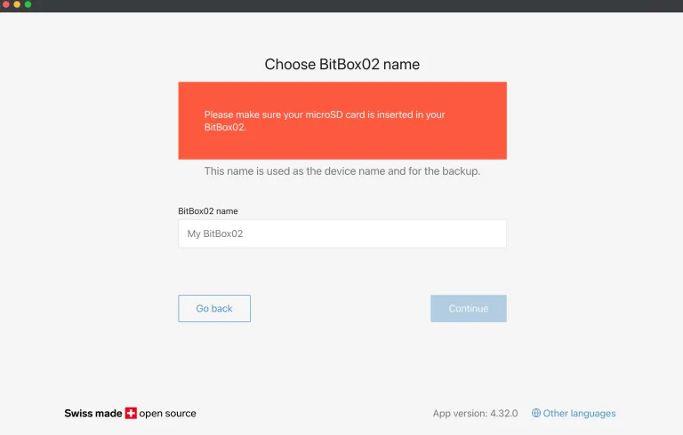
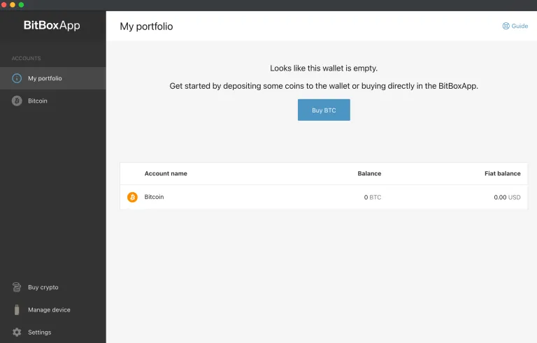
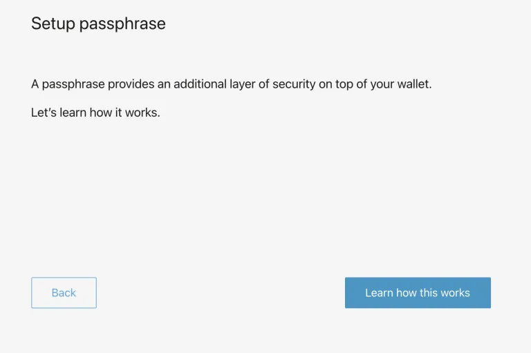

BitBox02 (https://bitbox.swiss/) là một ví cứng được sản xuất tại Thụy Sĩ, thiết kế đặc biệt để bảo mật Bitcoin của bạn. Một số tính năng chính bao gồm việc sao lưu và phục hồi dễ dàng sử dụng thẻ microSD, thiết kế tối giản và kín đáo, cùng sự hỗ trợ toàn diện cho Bitcoin.

Ví này cung cấp một mức độ bảo mật tiên tiến, được thiết kế bởi các chuyên gia, với thiết kế chip kép bao gồm một chip an toàn. Mã nguồn của nó đã được kiểm định hoàn toàn bởi các nhà nghiên cứu bảo mật và hoàn toàn mã nguồn mở. BitBox02 đi kèm với ứng dụng BitBoxApp đơn giản nhưng mạnh mẽ, giúp quản lý Bitcoin của bạn một cách an toàn. Nó hỗ trợ nút đầy đủ cho Bitcoin và đảm bảo giao tiếp mã hóa từ đầu đến cuối giữa ứng dụng và thiết bị. Được sản xuất tại Thụy Sĩ, BitBox02 đã nhận được đánh giá tích cực từ người dùng.

> Thông số kỹ thuật
>
> - Kết nối: USB-C
> - Tương thích: Windows 7 trở lên, macOS 10.13 trở lên, Linux, Android
> - Đầu vào: Cảm biến chạm điện dung
> - Vi điều khiển: ATSAMD51J20A; 120 Mhz 32-bit Cortex-M4F; Bộ sinh số ngẫu nhiên thực sự
> - Chip an toàn: ATECC608B; Bộ sinh số ngẫu nhiên thực sự (NIST SP 800-90A/B/C)
> - Màn hình: OLED trắng 128 x 64 px
> - Chất liệu: Polycarbonate
> - Kích thước: 54.5 x 25.4 x 9.6 mm bao gồm cổng USB-C
> - Trọng lượng: Thiết bị 12g; với bao bì và phụ kiện 160g

Tải xuống bảng dữ liệu trên trang web của họ https://bitbox.swiss/bitbox02/

## Cách sử dụng Ví Cứng BitBox02

### Thiết lập BitBox02

BitBox02 có một kết nối USB-C gắn liền với vỏ. Nếu máy tính của bạn sử dụng cổng USB thông thường, bạn sẽ phải sử dụng bộ chuyển đổi đi kèm với thiết bị.

Kết nối nó với máy tính và thiết bị sẽ được bật (chưa làm ngay bây giờ).

Nó có cảm biến ở trên và dưới, và nó sẽ yêu cầu bạn chạm vào phía trên hoặc dưới để định hướng màn hình theo cách bạn muốn.

### Tải xuống Ứng dụng BitBox02

Truy cập https://shiftcrypto.ch/ và nhấp vào liên kết “App” ở trên cùng để đến trang tải xuống:

Nhấp vào nút tải xuống màu xanh:

Để xác minh việc tải xuống (nó thêm phức tạp, nhưng được khuyến nghị, đặc biệt nếu bạn lưu trữ nhiều bitcoin), xem Phụ lục A.

Sau khi tải xuống, bạn có thể giải nén tệp. Trên mac, chỉ cần nhấp đúp vào tệp đã tải xuống, và biểu tượng Ứng dụng BitBox sẽ xuất hiện trong thư mục tải xuống của bạn. Bạn có thể kéo nó ra màn hình desktop (hoặc bất cứ đâu) để truy cập dễ dàng.

Nhấp đúp vào Ứng dụng để chạy nó (nó không được “cài đặt”).

Trên Mac, máy tính của bạn sẽ cảnh báo. Chỉ cần bỏ qua nó và nhấp vào “mở”:

Sau đó, bạn sẽ thấy điều này:

Tiếp tục kết nối thiết bị với máy tính.

Nó sẽ hiển thị một mã ghép nối. Kiểm tra xem chúng có khớp không, sau đó chạm vào cảm biến để chọn dấu kiểm. Sau đó quay lại màn hình, nút tiếp tục sẽ trở nên khả dụng cho bạn.

Sau đó, bạn sẽ có tùy chọn tạo một hạt giống mới hoặc khôi phục hạt giống. Tôi sẽ hướng dẫn cách tạo một hạt giống mới (Cũng quan trọng là phải khôi phục hạt giống bạn đã tạo để kiểm tra chất lượng bản sao lưu của mình, trước khi bạn nạp bitcoin vào ví).

Thiết bị đi kèm với một thẻ microSD. Hãy tiến hành lắp nó vào nếu bạn chưa làm.

Đặt tên cho thiết bị của bạn và nhấn tiếp tục, sau đó xác nhận trên thiết bị.

Sau đó, bạn sẽ được yêu cầu đặt mật khẩu cho thiết bị. Đây không phải là một phần của hạt giống của bạn. Nó cũng không phải là một cụm từ bí mật (đó là một phần của hạt giống của bạn). Đơn giản, đây chỉ là một mật khẩu để khóa thiết bị. Khi bạn khởi động thiết bị, bạn sẽ được yêu cầu nhập mật khẩu này mỗi lần. Bạn có 10 lần thất bại liên tiếp được phép trước khi thiết bị tự xóa sạch tất cả bộ nhớ, vì vậy hãy cẩn thận. Hoạt ảnh trên màn hình sẽ hướng dẫn bạn cách sử dụng các điều khiển của thiết bị để đặt mật khẩu.

Đọc màn hình tiếp theo, và đánh dấu vào từng ô, sau đó tiếp tục.

Và đây là cách ví trông như thế nào khi nó sẵn sàng để sử dụng.

### CHƯA XONG!!

Thật lạ, nhưng BitBox02 thông báo rằng chúng ta đã sẵn sàng sử dụng thiết bị, nhưng nó chưa yêu cầu chúng ta ghi lại các từ hạt giống! BẢN SAO LƯU DUY NHẤT mà chúng ta có là tệp được lưu trên thẻ microSD. Điều này không đủ. Những thiết bị lưu trữ này không tồn tại mãi mãi (do "hư hỏng bit"). Chúng ta cần một bản sao lưu giấy, và các bản sao lưu, được giữ trong két sắt (như đã giải thích trong hướng dẫn sử dụng ví cứng chung)

Để lấy cụm từ hạt giống và ghi chúng lại, hãy vào tab "quản lý thiết bị" ở bên trái, sau đó nhấn "hiển thị các từ khôi phục"

Sau đó, bạn có thể tiến hành xác nhận, và thiết bị sẽ hiển thị các từ cho bạn. Hãy ghi chúng lại một cách cẩn thận, và đừng bao giờ để ai nhìn thấy các từ này.

Sau đó, bạn có thể nhấn vào tab Bitcoin ở bên trái để lấy địa chỉ nhận của mình.

Nó chỉ hiển thị một lần một địa chỉ, nhưng ít nhất nó cho phép bạn chọn địa chỉ nào để sử dụng từ 20 địa chỉ đầu tiên:

Nhấn vào nút màu xanh sẽ hiển thị địa chỉ đầy đủ, và bạn sẽ được yêu cầu kiểm tra xem địa chỉ có trùng khớp với hiển thị trên màn hình không. Đây là một thực hành tốt để xác nhận không có malware nào trên máy tính của bạn đang lừa bạn gửi bitcoin đến địa chỉ của kẻ tấn công.

Để gửi bitcoin vào ví này, bạn có thể sao chép địa chỉ và dán nó vào trang rút tiền của sàn giao dịch nơi bạn có tiền. Tôi khuyên bạn nên gửi một lượng nhỏ thử nghiệm trước, sau đó thực hành chi tiêu nó trở lại sàn giao dịch hoặc đến địa chỉ thứ hai trong ví của bạn.

Đối với số lượng lớn hơn, tôi đề xuất bạn tạo một cụm từ bí mật (xem bên dưới). Ví gốc (không có cụm từ bí mật) có thể được sử dụng như ví dụ nhỡ của bạn (nó sẽ cần phải có một lượng hợp lý bên trong để trở nên đáng tin cậy).

### Kết nối với một nút

BitBox02 sẽ tự động kết nối với một nút. Hãy xem nó đang kết nối đến đâu. Nhấn vào tab cài đặt ở bên trái, sau đó "kết nối với nút đầy đủ của riêng bạn".

Và ở đây, chúng ta có thể thấy nó đang kết nối với node của shiftcrypto. Không tốt lắm. Chúng ta đã tiết lộ tất cả địa chỉ bitcoin của mình cho họ, và địa chỉ IP của mình (tất nhiên không phải seed; họ có thể thấy địa chỉ/số dư của chúng ta, nhưng không thể chi tiêu chúng). Chúng ta có thể nhập chi tiết node của mình vào trang này (nằm ngoài phạm vi của hướng dẫn cụ thể này), hoặc chúng ta có thể sử dụng phần mềm tốt hơn như Sparrow Bitcoin Wallet, Electrum Desktop Wallet, hoặc Specter Desktop. Tôi sẽ trình bày về Sparrow Bitcoin Wallet sau trong hướng dẫn.

Thêm một cụm mật khẩu

Bây giờ, sau khi chúng ta đã thiết lập thiết bị với Ứng dụng BitBox02 (và tiết lộ địa chỉ của mình, điều không thể tránh khỏi với ví cứng cụ thể này), chúng ta có thể thêm một cụm mật khẩu vào cụm từ seed của mình. Điều này sẽ cho phép chúng ta tạo một ví mới sử dụng cùng một seed, và ShiftCrypto sẽ không bao giờ thấy địa chỉ mới của chúng ta. Chúng ta sẽ kết nối ví này với phần mềm của riêng mình mà thôi.

### Kích Hoạt Cụm Mật Khẩu

Hãy tiến hành ngay bây giờ và “kích hoạt” tính năng cụm mật khẩu (nhưng chúng ta chưa thiết lập cụm mật khẩu). Đi đến tab “quản lý thiết bị”, và nhấp vào “kích hoạt cụm mật khẩu” (vòng tròn đỏ bên dưới).

Đọc qua các bước…

Bây giờ ngắt kết nối thiết bị, và tắt Ứng dụng BitBox02

KẾT THÚC phần về bitbox02 của Parman.

Thiết bị của bạn giờ đây đã hoàn toàn sẵn sàng để sử dụng trên bất kỳ giải pháp máy tính nào như specter, sparrow và sử dụng giao diện bitbox.