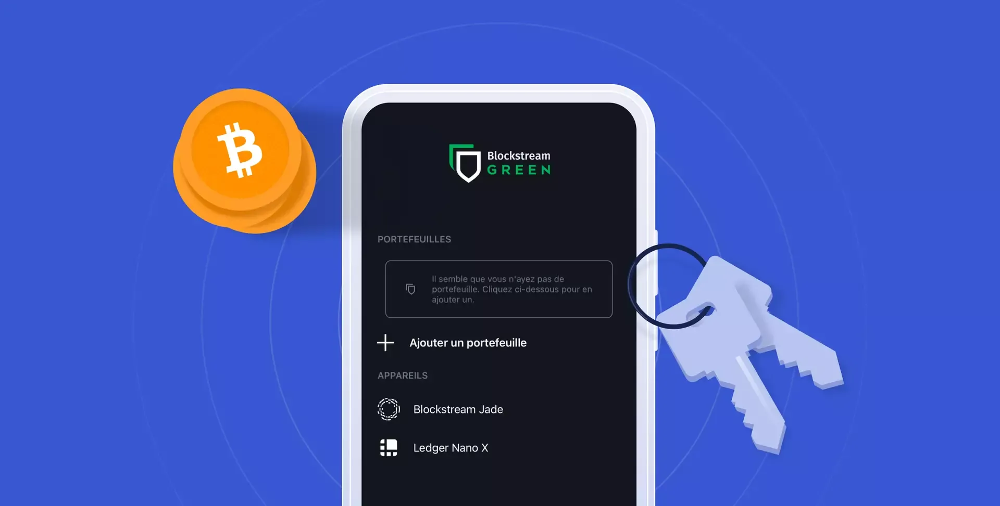
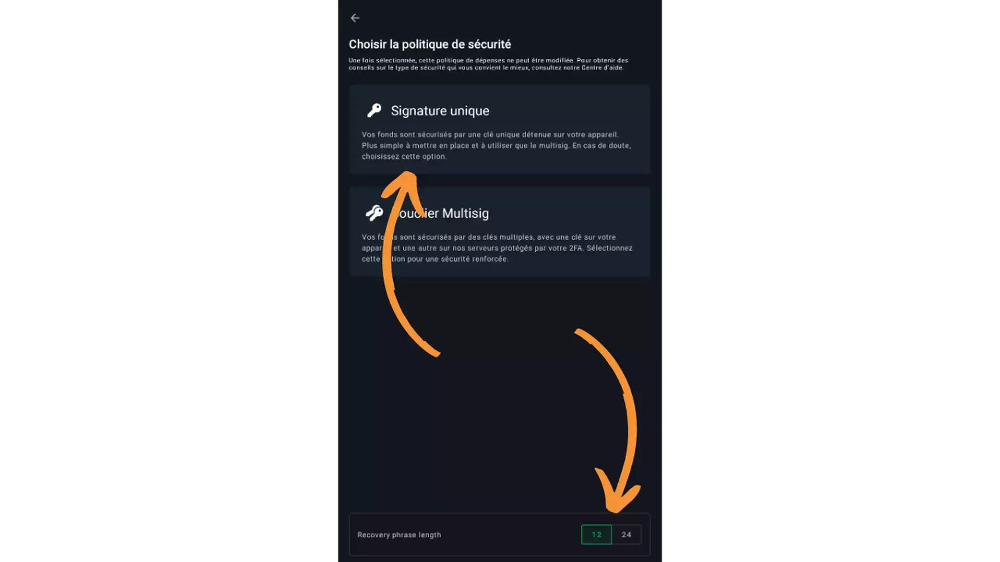
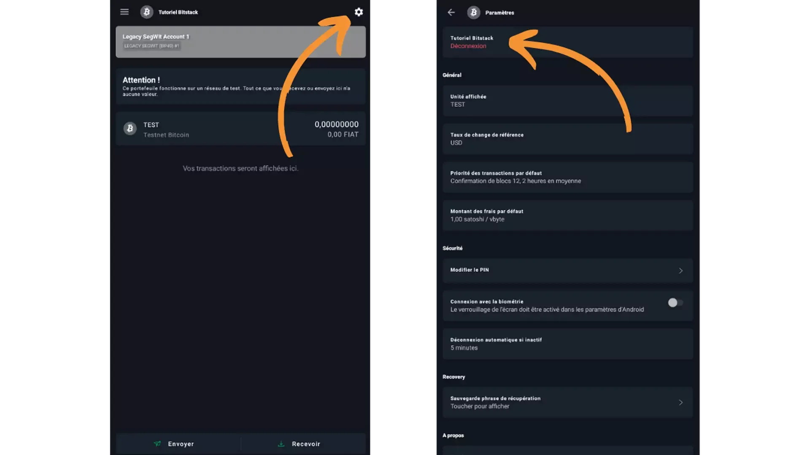
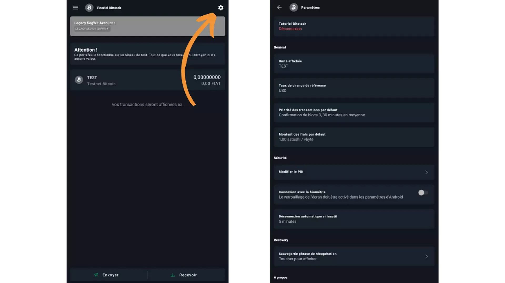

Hot Mobile Wallet - Beginner - Free - To secure from 0 to 1,000 €

To secure amounts below 1,000€, a free hot wallet (connected to the internet) is perfect for beginners. Its setup is easy and its interface is designed for beginners.

If you want to visit their website, click here (https://blockstream.com/green/)!

## Video Tutorial

## Written Tutorial

> This guide was produced and belongs to Bitstack. Bitstack is a bitcoin neo bank based in Paris that allows DCA on bitcoin. Guide written by Loic Morel on 15/02/2023. This belongs to them. https://www.bitstack-app.com/blog/installer-portefeuille-bitcoin-green-wallet

How to Install Your First Bitcoin Wallet? Green Wallet Tutorial

If you want to benefit from the many advantages of the Bitcoin system, including the uncensorability and unseizability of your funds, you must personally keep your keys that give access to your bitcoins.

In this tutorial, I will explain how to set up your first wallet with Green Wallet. This software is particularly suitable for beginner users. It is very easy to use, even if you do not have advanced knowledge of Bitcoin.

Green Wallet is available on all types of devices. In this tutorial, we will see how to use it on mobile, but you can also download it on a computer.

The first step is obviously to download the Green Wallet software or application. If you are on mobile, you can simply download it from your store. Make sure you are on the official application download page. Here are the pages depending on your system:

> - Google Play Store
>
> - Apple App Store

If you are downloading the software on a computer, I strongly advise you to verify the authenticity and integrity of the binary before installing it on your machine. I will explain how to perform this operation in a future tutorial.

## Choosing Application Settings

When launching the application, you will arrive at the home screen. At the moment, you do not have any wallets. Later on, if you have created multiple wallets, you can find them here.

The first action to take before creating your wallet is to open the application settings to choose the ones that suit you best.

- "Enhanced Privacy" allows you to disable the ability to take screenshots on the application. This option will also hide previews and automatically secure the application when you lock your phone. It is only available on Android;
- You can then choose to route your traffic through Tor so that all your connections are encrypted. This slightly slows down the operation of your application, but I recommend activating it to preserve your privacy;

- The "Testnet" option allows you to create wallets on the Testnet. This is a network that acts exactly like the Bitcoin system, except that the bitcoins exchanged on it have absolutely no value. This separate Testnet network is favored by users or developers who want to test applications without taking any financial risk. If you want to use Green Wallet on the real Bitcoin system, you can leave this option unchecked;

- The "Help Green" option allows you to transmit confidential information to Blockstream so that they can improve their application;

- The "Personal Electrum Server" option allows you to connect your own remote Bitcoin node to have access to network information and broadcast your transactions;

- The "SPV verification" option allows you to download and verify certain information from the Blockchain yourself. This reduces the need to trust the Blockstream node. Please note that this option does not provide all the guarantees of a real Bitcoin node, but if you don't have one, it can be a good option to activate.

Once you have chosen your settings, you can click on the "Save" button and then restart your application.

## Creating a Bitcoin Wallet

The next step is to create your Bitcoin wallet. To do this, click on:

> - Add a wallet;
> - New wallet;
> - Bitcoin.

The "Restore a wallet" option allows you to regain access to an existing wallet using its mnemonic phrase. The "Watch-Only Wallet" option allows you to import an extended public key (xpub) to view the movements of a wallet without being able to spend its funds.

> "The Watch-Only wallet is particularly useful if you have a hardware wallet. You can import the xpub to your phone to create receiving addresses and track the balance of the wallet hosted on the hardware wallet."
> The network options allow you to connect your wallet to different systems. The "Liquid" network is a Bitcoin sidechain. The "Testnet" network is a copy of the Bitcoin network, but with bitcoins that have no value. Finally, the "Testnet Liquid" network is the equivalent of Testnet for the Liquid sidechain. In this tutorial, we simply want to create a Bitcoin wallet, so we select the "Bitcoin" network.

Next, you are asked what type of wallet you want to create. The simplest option is to create a "Single Sig" wallet. In this case, each UTXO (piece of bitcoin) that belongs to us will only be locked by a single key pair.

Select "Single Signature".

You can then choose to have a 12-word or 24-word mnemonic phrase. This phrase will allow you to recover access to your wallet from any compatible software in case of loss, theft, or damage to your phone.

A 24-word phrase is more secure than a 12-word phrase against brute force attacks. However, currently, a 12-word phrase is still sufficiently secure. In practical terms, if you choose a 12-word phrase, you will be just above the minimum recommended limit by NIST. This means that your phrase is secure today, but it may not be in the future due to advancements in computing (unless you also use a BIP39 passphrase). By default, I recommend choosing a 24-word phrase, but it's up to you to make your own choice.

The software will then provide you with your recovery phrase. You must save it properly by writing it down on a suitable physical medium. It is strongly advised not to keep this phrase on any digital medium, even if encrypted. It should be written on paper or metal depending on the stored value.

This phrase is of utmost importance as it allows access to the keys of your wallet without any restrictions. If you lose it, you will no longer be able to access your bitcoins if your phone stops working. If this mnemonic phrase is stolen, an attacker can irreversibly steal all your funds.

The words in this phrase must be written together. Do not split your phrase! Additionally, it is also essential to write down each word in the defined order, along with its number. A disordered phrase is useless.

To learn more about securing the recovery phrase, I strongly recommend reading my dedicated article on this topic.

Green Wallet then asks you to confirm certain words from your phrase to ensure that you have written them down correctly.

You can then choose a name for your wallet to differentiate it from others if you create multiple wallets later on. At this stage, the name is not important since we will delete this wallet to verify the validity of the mnemonic phrase in the next step.

You are also asked to set up a PIN. It is used to lock access to your wallet. It is advisable to set up a complex and random password, especially to protect your wallet in case your phone is stolen.

This PIN has nothing to do with the Bitcoin wallet itself. In fact, only with the recovery phrase, you will be able to regain access to all your bitcoins. The PIN only blocks access to your wallet on your phone. Therefore, backing up the phrase is much more important than backing up this PIN.

You can later add a biometric lock option to avoid entering the PIN every time you use it. In general, biometrics are much less secure than the PIN itself. Thus, by default, I advise against implementing this unlocking option.

You must enter the chosen PIN a second time on the Green application to confirm it.

Congratulations! You have completed the creation of your Bitcoin wallet.

If you want to add a BIP39 passphrase to this Bitcoin wallet, you must click on the three dots at the top right of the screen when entering your PIN to unlock the wallet. Be careful, I strongly advise against using a passphrase if you do not understand the derivation mechanisms at play. You could lose access to your bitcoins.

## Simulation of recovering your Bitcoin wallet

Before sending bitcoins to your new wallet, it is essential to perform a recovery test to ensure that your backup of the mnemonic phrase is functional. In practice, we will delete the wallet while it is still empty and try to recover it only using the recovery phrase, as if we had lost access to our phone.

In addition to verifying the validity of the phrase, this practice also allows you to practice recovering a Bitcoin wallet. So, if you ever find yourself in an emergency situation, you will know exactly what steps to take to regain access to your funds.

To do this, before deleting your wallet, you must retrieve a reference information that will allow you to recognize it later. Therefore, you will copy the last 8 characters of the first address that is proposed to you.
To access this information, click on the "Receive" button. The wallet will display an address. Write down the last 8 characters of the address on a separate piece of paper. This corresponds to the address checksum.

For example, on my wallet, the 8 characters to note would be: JTbP4482.

Once you have noted this information, you can delete your wallet. From the wallet's home screen, click on the settings icon, then click on "Disconnect".

> "I want to emphasize once again that this operation must be done with an empty wallet, before sending any bitcoins to it. Otherwise, you risk losing them."

You will then be taken to the wallet unlock screen. Click on the three dots in the top right corner of the screen, then click on "Delete Wallet", and confirm.

You are now on the home screen of the Green Wallet application, and there are no wallets available. You are currently in the same situation as if you had lost or broken your phone and were trying to recover your wallet from the mnemonic phrase only.

Now click on "Add Wallet", then "Restore Wallet", and finally "Bitcoin".

The software then asks us if we want to recover from a QR code or from a mnemonic phrase. In our case, it is a phrase.

Next, we are asked to enter the recovery phrase. This is the phrase we wrote down when creating the wallet. If you are using a 24-word phrase, remember to click on the small "24" box.

Once all the words are entered, if the software tells you there is an error, it means that the checksum of your phrase is incorrect. In this case, it means that the paper backup of your mnemonic phrase is invalid. You must start this tutorial again from the beginning and make sure to write down the phrase correctly when it is given to you.

Otherwise, you can click on "Continue".

The software will indicate "Wallet not found". This is completely normal since, for the moment, we have not yet sent any bitcoins to it. Therefore, it cannot detect any transactions on the blockchain associated with this wallet.

Click on "Manual Restore" at the bottom of the screen, then click on "Single Signature".

Finally, you will be asked to name this wallet and assign it a PIN. You can give it the same name and PIN as the initial wallet.
For reminder, this PIN only serves to unlock the wallet on this application and on this specific phone. Unlike the recovery phrase, it does not allow you to regenerate your wallet on another software or hardware.

Once the PIN is validated, you will be taken back to the home page of your wallet. It is time to check if your recovery phrase is functional by observing the first derived address. To do this, once again, click on "Receive" to access the first address.

If the last 8 characters are exactly the same as the ones you noted as witnesses on your paper before deleting the wallet, then your phrase is valid. In my case, we can see that the checksum of my first address is indeed equal to the previously noted value: JTbP4482.

I know that this verification practice is tedious, but it is absolutely essential to ensure the proper security of your Bitcoin wallet. I strongly advise you to develop this habit when creating a wallet, whether it is on software or hardware.

With Green Wallet, I used the first address to perform this process. However, you can also take an extended public key (xpub/zpub) or the master fingerprint of the private key as witness information.

## Using the Green Wallet Bitcoin Wallet

Once your wallet is set up and verified, you can start using it.

To get started, I recommend customizing the settings of your wallet. To do this, click on the settings icon in the top right corner of the screen.

- The "Displayed Unit" option allows you to customize the unit used in your wallet. If you have a small amount of funds, it may be relevant to display your wallet in sats rather than bitcoins. The satoshi (sat) corresponds to one hundred millionth of a bitcoin: 1 BTC = 100,000,000 sats.

- The "Default Fee Amount" option allows you to customize the fees allocated to your transactions by default. The higher the fees per vbyte (virtual byte), the faster your transactions will be confirmed. You can later modify this fee rate for each transaction issued based on the congestion of the Bitcoin network.

- The "Biometric Connection" option allows you to unlock your wallet with your fingerprint instead of the PIN. Generally, I advise against activating this option. Biometrics are much less secure than the PIN code.

By default, Green Wallet assigns you a BIP49 "Nested SegWit" account with P2SH (Pay to Script Hash) addresses. A few years ago, using this type of account was relevant because not everyone supported native SegWit addresses yet. Today, the vast majority of Bitcoin-related services support SegWit, so there is no longer any reason to use a "Nested SegWit" account.

We will now create a new BIP84 "Native SegWit" account to take advantage of all its benefits, and also to have P2WPKH (Pay to Witness Public Key Hash) addresses. To do this, click on your "Legacy SegWit Account" and then on "Add a new account", and finally on "SegWit Account". You can then give a name to this account if you wish.

In the future, if you need to create new accounts on this wallet, I recommend choosing SegWit V0 BIP84 accounts by default, or SegWit V1 BIP86 (when available).

On the home page of your wallet, you can see your different accounts, including your new SegWit account.

Next, the operation of the Green Wallet application is very simple. To receive bitcoins in your wallet, click on the "Receive" button. The wallet displays a receiving address. An address allows you to receive bitcoins in your wallet. You can either copy it in text format to send it to your payer, or scan the QR code with another Bitcoin wallet to pay the address.

This type of address does not indicate to the payer the amount they should send you. You can also create an address that will automatically request a chosen amount from the payer. To do this, click on "More options" and enter the desired amount.

Since you are using a SegWit V0 BIP84 account, your address should start with the prefix "bc1q". In my example, I am using a Testnet wallet, so the prefix is slightly different from yours.

A receiving address should not be used multiple times. This is a bad practice that poses risks to your privacy. By default, the Green wallet will generate a new address for you when you click on "Receive" and the previous one has already been used. You can also click on the rotating arrow icon to request a new blank address linked to your wallet.

> "Tip: When copying and pasting a receiving address, you don't need to verify that each character of the address is correct. In fact, addresses include a checksum to detect a small typing error. It is only necessary to check the first and last characters of the address to ensure its validity."
> On the screenshots below, you can see that I sent 0.02 btc to my address. The transaction appears on Green, initially as "unconfirmed" while waiting to be included in the blockchain by a miner. Once the transaction has received multiple confirmations, you have successfully received your bitcoins in your own wallet.

If you want to send bitcoins, you need to retrieve the receiving address to which you want to send the funds and click on the "Send" button. On the next page, you need to enter the destination address. You can either enter it manually or scan a QR code by clicking on the corresponding icon. Then choose the transaction amount. You can either enter an amount in bitcoins or an amount in US dollars by clicking on the white double arrow.

In the center of the screen, you can choose the fee rate allocated to this transaction. You can either follow the application's recommendations or customize your fees. The higher the fees you set compared to other transactions waiting for confirmation, the faster your transaction will be included, and vice versa.

Click on "Next". You will then arrive on a screen giving you the details of your transaction. You can verify that the entered address is correct, that the amount corresponds to what you want to send, and that the fees are correct.

To sign the transaction and broadcast it to the Bitcoin network, slide the green button at the bottom of the screen to the right.

Your transaction now appears on the dashboard of your Bitcoin wallet.

## Conclusion

Congratulations! You now have your own self-custody Bitcoin wallet. Your bitcoins truly belong to you.

This Green Wallet from Blockstream is an excellent solution for beginners with a small amount of bitcoins. As you have seen, it is very easy to use. However, it is still a hot wallet. If you have significant amounts of bitcoins, I recommend using a hardware wallet.

Once you have learned to master Green Wallet and understand the mechanisms at play, you can explore more comprehensive solutions like Samourai Wallet or Sparrow Wallet.
To conclude, I remind you once again that you must absolutely take care of the backup of your recovery phrase. It provides direct and unrestricted access to your bitcoins. If you lose it, you will no longer be able to recover your bitcoins if your phone is lost, broken, or stolen. Anyone with access to this phrase can steal your bitcoins and there will be no way to recover them.

> This guide was produced and belongs to Bitstack. Bitstack is a bitcoin neo bank based in Paris that allows for DCA on bitcoin. Guide written by Loic Morel on 15/02/2023. This belongs to them. [Link to the original article](https://www.bitstack-app.com/blog/installer-portefeuille-bitcoin-green-wallet)
