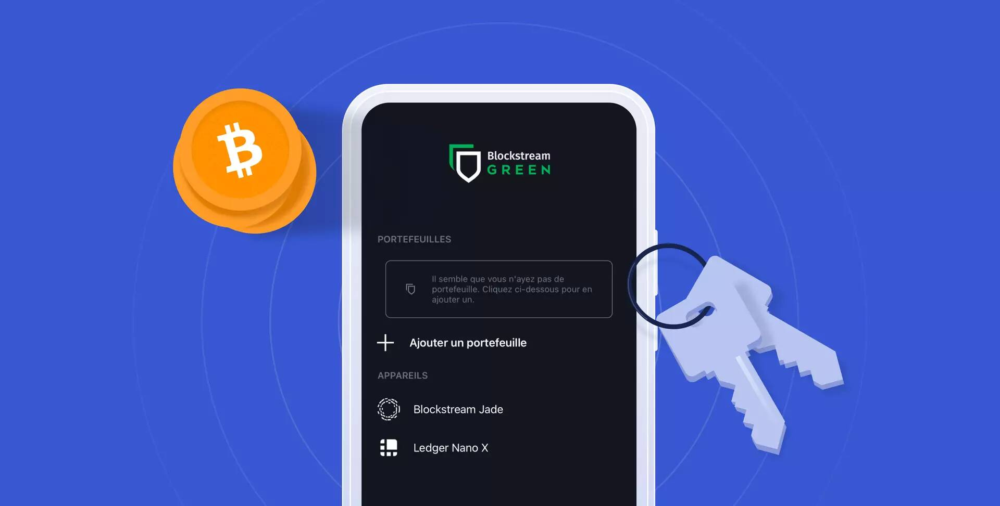
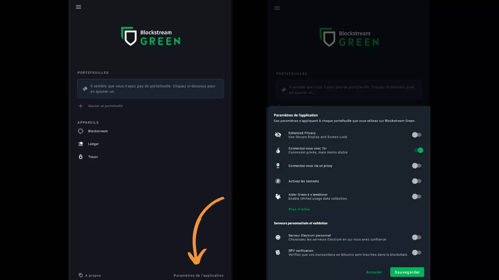
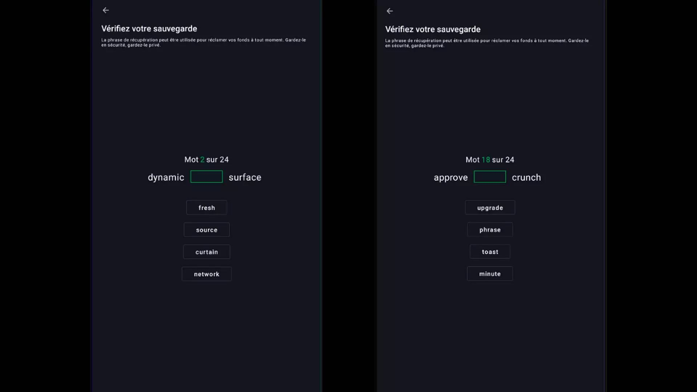
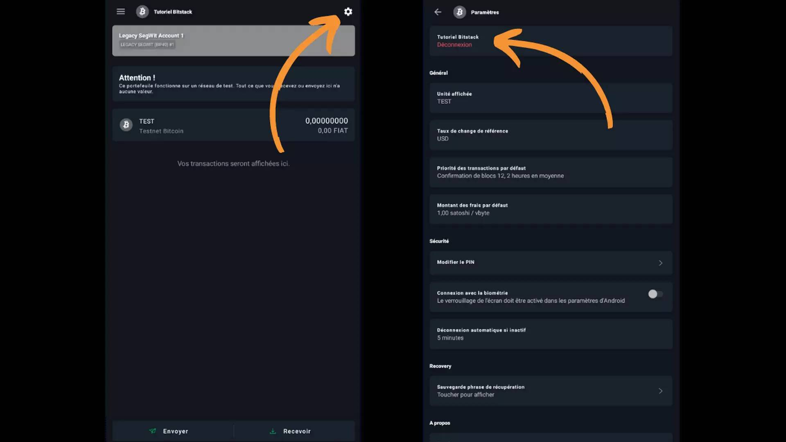
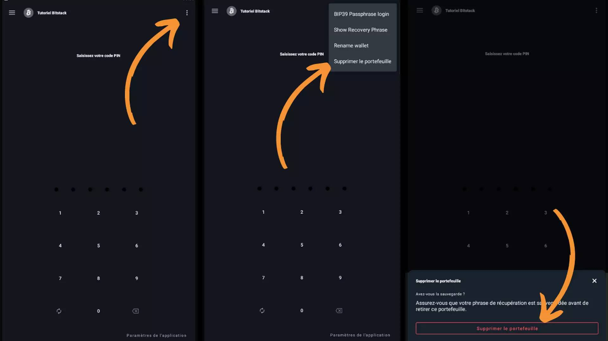
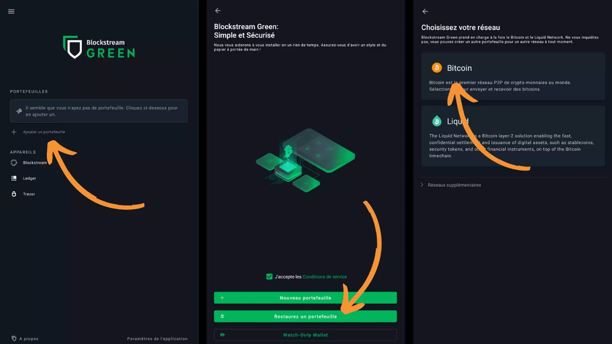
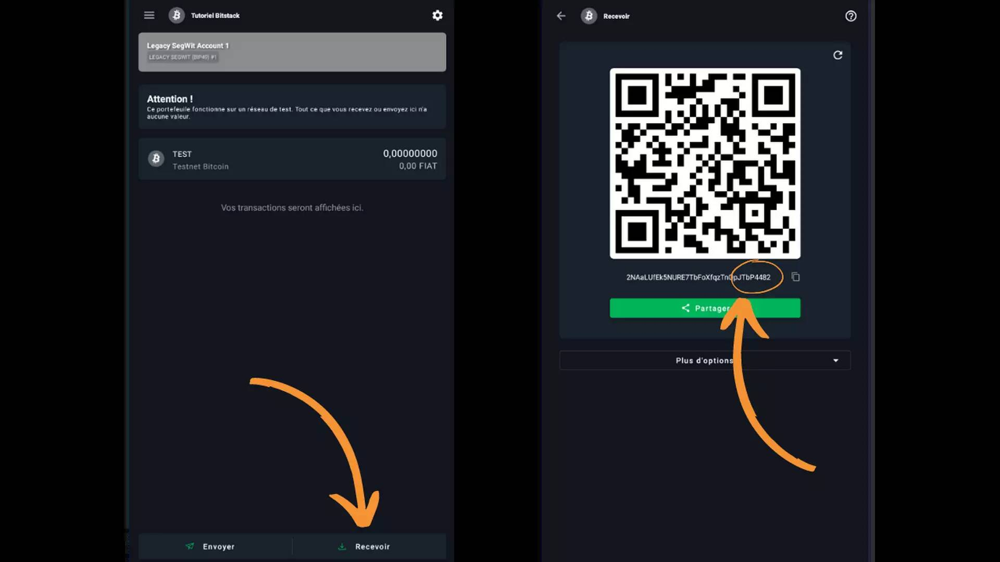
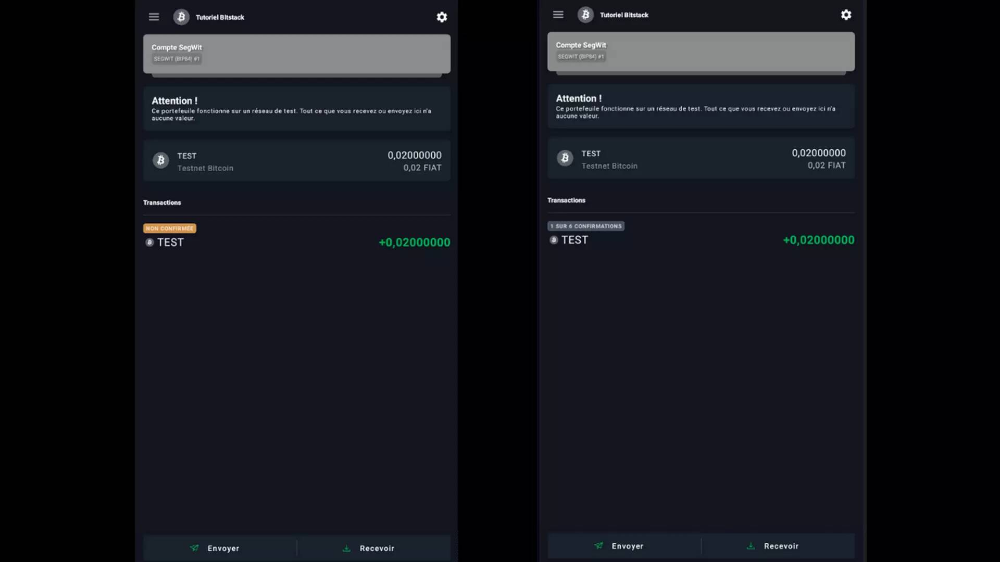
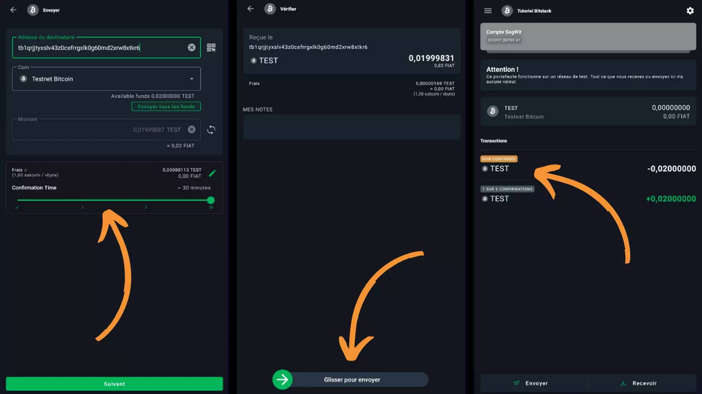

Carteira móvel quente - Iniciante - Gratuito - Para proteger de 0 a 1.000 €

Para proteger quantias abaixo de 1.000€, uma carteira quente (conectada à internet) gratuita é perfeita para começar.
Sua configuração é fácil e sua interface é projetada para iniciantes.

Se você quiser dar uma olhada em seu site, é só clicar aqui (https://blockstream.com/green/)!

## Tutorial em vídeo

## Tutorial escrito

> Este guia foi produzido e pertence à Bitstack. Bitstack é um banco de bitcoin neo baseado em Paris que permite DCA em bitcoin. Guia escrito por Loic Morel em 15/02/2023. Isso pertence a eles. https://www.bitstack-app.com/blog/installer-portefeuille-bitcoin-green-wallet

Como instalar sua primeira carteira Bitcoin? Tutorial Green Wallet

Se você deseja aproveitar as muitas vantagens do sistema Bitcoin, incluindo a imutabilidade e a inacessibilidade de seus fundos, você deve manter suas próprias chaves que dão acesso aos seus bitcoins.

Neste tutorial, vou explicar como configurar sua primeira carteira com o Green Wallet. Este software é especialmente adequado para usuários iniciantes. É muito fácil de usar, mesmo se você não tiver conhecimentos avançados sobre Bitcoin.

O Green Wallet está disponível em todos os tipos de dispositivos. Neste tutorial, veremos como usá-lo em dispositivos móveis, mas você também pode baixá-lo em um computador.

O primeiro passo é, obviamente, baixar o software ou o aplicativo Green Wallet. Se você estiver em um dispositivo móvel, pode simplesmente baixá-lo da sua loja. Verifique se você está na página de download do aplicativo oficial. Aqui estão as páginas de acordo com o seu sistema:

> - Google Play Store
>
> - Apple App Store

Se você estiver baixando o software em um computador, eu recomendo fortemente que você verifique a autenticidade e a integridade do binário antes de instalá-lo em sua máquina. Explicarei como realizar essa operação em um próximo tutorial.

## Escolha das configurações do aplicativo

Ao iniciar o aplicativo, você chegará à tela inicial. No momento, você não tem nenhuma carteira. Mais tarde, se você criar várias carteiras, poderá encontrá-las aqui.

A primeira ação a ser realizada, antes de criar sua carteira, é abrir as configurações do aplicativo para escolher aquelas que melhor atendem às suas necessidades.

- « Enhanced Privacy » permite desativar a capacidade de fazer capturas de tela no aplicativo. Essa opção também oculta visualizações e automaticamente protege o aplicativo quando você bloqueia seu telefone. Está disponível apenas no Android;
- Em seguida, você pode optar por rotear seu tráfego através do Tor para que todas as suas conexões sejam criptografadas. Isso diminui ligeiramente o desempenho do seu aplicativo, mas recomendo ativá-lo para preservar sua privacidade;

- A opção "Testnet" permite criar carteiras na Testnet. É uma rede que funciona exatamente como o sistema Bitcoin, exceto que os bitcoins negociados lá não têm valor algum. Essa Testnet separada é usada por usuários ou desenvolvedores que desejam testar aplicativos sem correr riscos financeiros. Se você deseja usar o Green Wallet no sistema Bitcoin real, pode deixar essa opção desmarcada;

- A opção "Ajudar o Green" permite enviar informações confidenciais para a Blockstream para que eles melhorem seu aplicativo;

- A opção "Servidor Electrum pessoal" permite conectar seu próprio nó Bitcoin remotamente para obter informações da rede e transmitir suas transações;

- A opção "Verificação SPV" permite baixar e verificar algumas informações do Blockchain por conta própria. Isso reduz a necessidade de confiar no nó da Blockstream. Atenção, essa opção não oferece todas as garantias de um verdadeiro nó Bitcoin, mas, na falta de um, pode ser uma boa opção para ativar.

Depois de escolher suas configurações, você pode clicar no botão "Salvar" e reiniciar seu aplicativo.

## Criação de uma carteira Bitcoin

O próximo passo é criar sua carteira Bitcoin. Para fazer isso, clique em:

> - Adicionar uma carteira;
> - Nova carteira;
> - Bitcoin.

A opção "Restaurar uma carteira" permite recuperar o acesso a uma carteira existente usando sua frase mnemônica. A opção "Carteira Somente Observação" permite importar uma chave pública estendida (xpub) para visualizar os movimentos de uma carteira, sem poder gastar seus fundos.

> "A carteira Somente Observação é especialmente útil se você tiver uma carteira de hardware. Você pode importar o xpub para o seu telefone para criar endereços de recebimento e acompanhar o saldo da carteira hospedada na carteira de hardware."
> As opções de rede permitem que você conecte sua carteira a diferentes sistemas. A rede "Liquid" é uma sidechain do Bitcoin. A rede "Testnet" é uma cópia da rede Bitcoin, mas com bitcoins que não têm valor. Por fim, a rede "Testnet Liquid" é equivalente ao Testnet para a sidechain Liquid. Neste tutorial, queremos apenas criar uma carteira Bitcoin, então selecionamos a rede "Bitcoin".

Em seguida, você será solicitado a escolher o tipo de carteira que deseja criar. A opção mais simples é criar uma carteira "Single Sig". Nesse caso, cada UTXO (peça de bitcoin) que possuímos será bloqueado apenas por um par de chaves.

Selecione "Assinatura única".

Você pode então escolher ter uma frase mnemônica de 12 ou 24 palavras. Essa frase permitirá que você recupere o acesso à sua carteira a partir de qualquer software compatível, em caso de perda, roubo ou quebra do seu telefone.

Uma frase de 24 palavras é mais segura do que uma frase de 12 palavras contra ataques de força bruta. No entanto, até o momento, uma frase de 12 palavras ainda é suficientemente segura. Concretamente, se você escolher uma frase de 12 palavras, estará apenas acima do limite mínimo recomendado pelo NIST. Isso significa que sua frase está segura hoje, mas pode não estar no futuro devido à evolução da computação (a menos que você também use uma frase secreta BIP39). Por padrão, eu recomendo que você escolha uma frase de 24 palavras, mas a escolha é sua.

O software então fornecerá sua frase de recuperação. Você deve salvá-la adequadamente, anotando-a em um suporte físico adequado. É altamente recomendado que você não guarde essa frase em nenhum suporte digital, mesmo criptografado. Ela deve ser anotada em papel ou metal, dependendo do valor armazenado.

Essa frase é de extrema importância, pois permite o acesso às chaves da sua carteira sem restrições. Em caso de perda, você não poderá mais acessar seus bitcoins se o seu telefone não estiver funcionando. Em caso de roubo dessa frase mnemônica, um invasor poderá roubar irreversivelmente todos os seus fundos.

As palavras dessa frase devem ser anotadas juntas. Não divida sua frase! Além disso, também é essencial anotar cada palavra na ordem definida, com seu número. Uma frase fora de ordem é inútil.

Para saber mais sobre os métodos de segurança da frase de recuperação, recomendo que você leia meu artigo dedicado a esse assunto.

O Green Wallet então solicita que você confirme algumas palavras da sua frase para garantir que você as tenha anotado corretamente.
'

Você pode então escolher um nome para sua carteira para diferenciá-la das outras se você criar várias posteriormente. Nesta etapa, o nome não importa muito, pois vamos excluir esta carteira para verificar a validade da frase mnemônica na próxima etapa.

Também é solicitado que você defina um PIN. Ele serve para bloquear o acesso à sua carteira. É recomendável definir uma senha complexa e aleatória, especialmente para proteger sua carteira em caso de roubo do seu telefone.

Este PIN não tem nada a ver com a carteira Bitcoin em si. Na verdade, apenas com a frase de recuperação, você poderá recuperar o acesso a todos os seus bitcoins. O PIN serve apenas para bloquear o acesso à sua carteira no seu telefone. Portanto, fazer backup da frase é muito mais importante do que fazer backup deste PIN.

Você pode posteriormente adicionar uma opção de bloqueio biométrico para evitar inserir o PIN a cada uso. Em geral, a biometria é muito menos segura do que o próprio PIN. Portanto, por padrão, eu não recomendo que você ative essa opção de desbloqueio.

Você deve inserir o PIN escolhido novamente no aplicativo Green para confirmá-lo.

Parabéns! Você concluiu a criação da sua carteira Bitcoin.

Se você deseja adicionar uma frase secreta BIP39 a esta carteira Bitcoin, você deve clicar nos três pontos no canto superior direito da tela quando inserir seu PIN para desbloquear a carteira. Cuidado, eu desaconselho fortemente o uso de uma frase secreta se você não entender os mecanismos de derivação envolvidos. Você pode perder o acesso aos seus bitcoins.

## Simulação da recuperação da sua carteira Bitcoin

Antes de enviar bitcoins para sua nova carteira, é essencial realizar um teste de recuperação para garantir que o backup da frase mnemônica esteja funcionando corretamente. Concretamente, vamos excluir a carteira enquanto ela ainda está vazia e tentar recuperá-la apenas com a frase de recuperação, como se tivéssemos perdido o acesso ao nosso telefone.

Além de verificar a validade da frase, essa prática também permite que você pratique a recuperação de uma carteira Bitcoin. Assim, se um dia você se encontrar em uma situação de emergência, você saberá exatamente quais etapas seguir para recuperar o acesso aos seus fundos.

Para fazer isso, antes de excluir sua carteira, você deve obter uma informação de referência que permita reconhecê-la posteriormente. Portanto, você vai copiar os últimos 8 caracteres do primeiro endereço que lhe é oferecido.'
Para acessar essa informação, clique no botão "Receber". A carteira exibirá um endereço. Anote em outro pedaço de papel os últimos 8 caracteres. Isso corresponde ao checksum do endereço.
Por exemplo, na minha carteira, os 8 caracteres a serem anotados seriam: JTbP4482.

Depois de anotar essa informação, você pode excluir sua carteira. Na tela inicial da carteira, clique no ícone de configurações e depois em "Desconectar".

> "Eu enfatizo mais uma vez que essa operação deve ser feita com uma carteira vazia, antes de enviar bitcoins para ela. Caso contrário, você corre o risco de perdê-los."

Você será redirecionado para a tela de desbloqueio da sua carteira. Clique nos três pontos no canto superior direito da tela e depois em "Excluir carteira", e confirme.

Agora você está na tela inicial do aplicativo Green Wallet e não há mais nenhuma carteira disponível. Portanto, você está na mesma situação como se tivesse perdido ou quebrado seu telefone e estivesse tentando recuperar sua carteira apenas com a frase mnemônica.

Agora clique em "Adicionar carteira", depois em "Restaurar carteira" e, por fim, em "Bitcoin".

O software então nos pergunta se queremos recuperar a partir de um código QR ou de uma frase mnemônica. No nosso caso, é uma frase.

Em seguida, somos solicitados a fornecer a frase de recuperação. É aquela que anotamos ao criar a carteira. Se você estiver usando uma frase de 24 palavras, lembre-se de marcar a caixa "24".

Depois de inserir todas as palavras, se o software indicar que há um erro, significa que o checksum da sua frase não está correto. Nesse caso, significa que o backup em papel da sua frase mnemônica é inválido. Portanto, você deve reiniciar este tutorial desde o início e ter cuidado ao escrever a frase quando ela for fornecida.

Caso contrário, você pode clicar em "Continuar".

O software informará "Carteira não encontrada". Isso é absolutamente normal, pois ainda não enviamos nenhum bitcoin para ela. Portanto, ele não pode detectar nenhuma transação na blockchain relacionada a essa carteira.

Clique na parte inferior da tela em "Restauração manual" e depois em "Assinatura única".

Por fim, você será solicitado a nomear essa carteira e atribuir um PIN a ela. Você pode dar o mesmo nome e o mesmo PIN da carteira inicial.
Para lembrar, este PIN tem apenas a funcionalidade de desbloquear a carteira neste aplicativo e neste telefone especificamente. Ao contrário da frase de recuperação, ele não permite regenerar sua carteira em outro software ou hardware.

Depois de validar o PIN, você será redirecionado para a página inicial da sua carteira. É hora de verificar se sua frase de recuperação está funcionando corretamente, observando o primeiro endereço derivado. Para fazer isso, mais uma vez, clique em "Receber" para acessar o primeiro endereço.

Se os últimos 8 caracteres forem exatamente os mesmos que você anotou como referência em seu papel antes de excluir a carteira, então sua frase está válida. No meu caso, podemos ver que o checksum do meu primeiro endereço é igual ao valor anotado anteriormente: JTbP4482.

Eu sei que essa prática de verificação é tediosa, mas é absolutamente essencial para garantir a segurança adequada da sua carteira Bitcoin. Eu recomendo fortemente que você adote esse hábito ao criar uma carteira, seja em software ou hardware.

Com a Green Wallet, usei o primeiro endereço para realizar esse processo. No entanto, você também pode usar uma chave pública estendida (xpub/zpub) ou a impressão digital da chave privada mestra (master fingerprint) como referência.

## Uso da carteira Bitcoin Green Wallet

Depois de configurar e verificar sua carteira, você poderá começar a usá-la.

Para começar bem, recomendo que você personalize as configurações da sua carteira. Para fazer isso, clique no ícone de configurações no canto superior direito da tela.

- A opção "Unidade exibida" permite que você personalize a unidade usada em sua carteira. Se você tiver poucos fundos, pode ser relevante exibir sua carteira em sats em vez de bitcoins. O satoshi (sat) corresponde a um centésimo de milionésimo de um bitcoin: 1 BTC = 100.000.000 sats.

- A opção "Taxa padrão" permite que você personalize as taxas alocadas para suas transações por padrão. Quanto mais altas forem as taxas por vbyte (byte virtual), mais rapidamente suas transações serão confirmadas. Você poderá modificar essa taxa de taxa para cada transação emitida, dependendo da congestão da rede Bitcoin.

- A opção "Conexão biométrica" permite que você desbloqueie sua carteira com sua impressão digital em vez do PIN. Geralmente, desaconselho ativar essa opção. A biometria é muito menos segura do que o código PIN.

Por padrão, a Green Wallet atribui a você uma conta BIP49 "Nested SegWit" com endereços P2SH (Pay to Script Hash). Alguns anos atrás, o uso desse tipo de conta era relevante, pois nem todo mundo ainda suportava endereços nativos SegWit. Hoje, a grande maioria dos serviços relacionados ao Bitcoin suporta SegWit, portanto não há mais motivo para usar uma conta "Nested SegWit".

Vamos então criar uma nova conta BIP84 "Native SegWit" para aproveitar todas as suas vantagens e também ter endereços P2WPKH (Pay to Witness Public Key Hash). Para fazer isso, clique em sua conta "Legacy SegWit Account", depois em "Adicionar nova conta" e, por fim, em "Conta SegWit". Você pode então dar um nome a essa conta, se desejar.

Posteriormente, se você precisar criar novas contas nesta carteira, recomendo que escolha por padrão contas SegWit V0 BIP84 ou SegWit V1 BIP86 (quando estiverem disponíveis).

Na página inicial da sua carteira, você pode ver suas diferentes contas, incluindo sua nova conta SegWit.

Em seguida, o funcionamento do aplicativo Green Wallet é muito simples. Para receber bitcoins em sua carteira, clique no botão "Receber". A carteira exibirá um endereço de recebimento. Um endereço permite receber bitcoins em sua carteira. Você pode copiá-lo em formato de texto para enviá-lo ao pagador ou escanear o código QR com outra carteira Bitcoin para pagar o endereço.

Esse tipo de endereço não indica ao pagador a quantia que ele deve enviar a você. Você também pode criar um endereço que solicitará automaticamente uma quantia escolhida ao pagador. Para fazer isso, clique em "Mais opções" e insira a quantia desejada.

Como você está usando uma conta SegWit V0 BIP84, seu endereço deve começar com o prefixo "bc1q". No meu exemplo, estou usando uma carteira Testnet, portanto o prefixo é ligeiramente diferente do seu.

Um endereço de recebimento não deve ser usado várias vezes. Isso é uma má prática que traz riscos à sua privacidade. Por padrão, a carteira Green gerará um novo endereço quando você clicar em "Receber" e o endereço anterior já tiver sido usado. Você também pode clicar no ícone da seta giratória para solicitar um novo endereço em branco vinculado à sua carteira.

> "Dica: Ao copiar e colar um endereço de recebimento, você não precisa verificar se cada caractere do endereço está correto. Na verdade, os endereços incluem um checksum que permite detectar pequenos erros de digitação. É necessário apenas verificar os primeiros e os últimos caracteres do endereço para garantir sua validade."

Nas capturas de tela abaixo, você pode ver que enviei 0,02 btc para o meu endereço. A transação aparece no Green, primeiro como "não confirmada" aguardando ser incluída no blockchain por um minerador. Depois que a transação recebe várias confirmações, você recebe seus bitcoins em sua própria carteira.

Se você deseja enviar bitcoins, precisa obter o endereço de recebimento para onde deseja enviar os fundos e clicar no botão "Enviar". Na próxima página, você deve inserir o endereço de destino. Você pode digitá-lo manualmente ou escanear um código QR clicando no ícone correspondente. Em seguida, escolha o valor da transação. Você pode inserir um valor em bitcoins ou um valor em dólares americanos clicando na seta dupla branca.

No centro da tela, você pode escolher a taxa de transação alocada para esta transação. É possível seguir as recomendações do aplicativo ou personalizar suas taxas. Quanto mais altas forem suas taxas em comparação com outras transações aguardando confirmação, mais rapidamente sua transação será incluída e vice-versa.

Clique em "Próximo". Você será direcionado para uma tela que mostra os detalhes da sua transação. Você pode verificar se o endereço inserido está correto, se o valor corresponde ao que você deseja enviar e se as taxas estão corretas.

Para assinar a transação e transmiti-la para a rede Bitcoin, deslize o botão verde na parte inferior da tela para a direita.

Sua transação agora aparece no painel de controle da sua carteira Bitcoin.

## Conclusão

Parabéns! Agora você tem sua própria carteira Bitcoin em custódia própria. Os bitcoins realmente pertencem a você.

Esta carteira Green Wallet da Blockstream é uma excelente solução para iniciantes com poucos bitcoins. Como você pôde ver, é muito fácil de usar. No entanto, ainda é uma carteira quente. Se você tiver uma quantidade significativa de bitcoins, recomendo que procure uma carteira de hardware.

Depois de aprender a dominar bem a Green Wallet e entender os mecanismos envolvidos, você pode buscar soluções mais completas, como a Samourai Wallet ou a Sparrow Wallet.

Pour concluir, lembro mais uma vez que você deve cuidar muito bem do backup da sua frase de recuperação. Ela dá acesso direto e irrestrito aos seus bitcoins. Se você a perder, não será mais capaz de recuperar seus bitcoins se o seu telefone for perdido, quebrado ou roubado. Qualquer pessoa que tenha acesso a essa frase poderá roubar seus bitcoins e não haverá maneira de recuperá-los.

> Este guia foi produzido e pertence à Bitstack. A Bitstack é um banco de bitcoins neo baseado em Paris que permite o DCA no bitcoin. Guia escrito por Loic Morel em 15/02/2023. Isso pertence a eles. [Link](https://www.bitstack-app.com/blog/installer-portefeuille-bitcoin-green-wallet)
