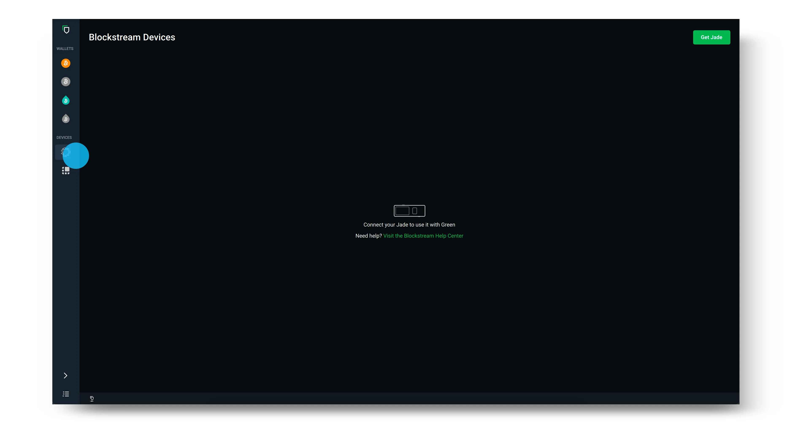
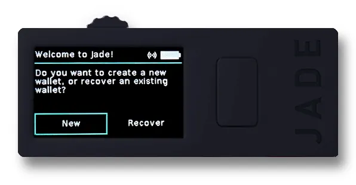

## Tutoriální video


Blockstream Jade - Mobilní Bitcoin Hardware Peněženka KOMPLETNÍ TUTORIÁL od BTCsession

## Kompletní písemný průvodce


### Předpoklady

1. Stáhněte si nejnovější verzi Blockstream Green.

2. Nainstalujte tento ovladač, aby bylo zajištěno, že vaše zařízení Jade bude počítačem rozpoznáno.

### Nastavení na desktopu


Otevřete Blockstream Green, poté klikněte na logo Blockstream pod položkou Zařízení.



Připojte Jade k vašemu desktopu pomocí dodaného USB kabelu.

> Poznámka: Pokud vaše zařízení Jade není počítačem rozpoznáno, ujistěte se, že jste stáhli ovladač uvedený v průvodci zde.

Jakmile se vaše zařízení Jade objeví v aplikaci Green, aktualizujte Jade kliknutím na Kontrola aktualizací a vyberte nejnovější verzi firmware. Použijte kolečko nebo přepínač na zařízení Jade k potvrzení a pokračujte s aktualizací. Ujistěte se, že vaše zařízení Jade stále zobrazuje tlačítko "Inicializovat", jinak budete muset počkat s aktualizací až po nastavení zařízení. Použijte tlačítko zpět pro návrat na tuto obrazovku, pokud je to nutné.


Po aktualizaci firmware zařízení Jade vyberte Nastavit Jade na síti a bezpečnostní politice, kterou chcete použít.

> Tip: Bezpečnostní politika je uvedena pod položkou Typ na přihlašovací obrazovce níže. Pokud si nejste jisti, zda vybrat Singlesig nebo Multisig Shield, prosím, přečtěte si náš průvodce zde. (https://help.blockstream.com/hc/en-us/articles/4403642609433)


Dále vyberte možnost vytvořit Novou peněženku a vyberte 12 slov pro generování vaší obnovovací fráze. Kliknutím na Pokročilé získáte možnost výběru 12 a 24 slovní obnovovací fráze.



Zaznamenejte obnovovací frázi offline na papír (nebo pomocí speciálního zařízení pro zálohování obnovovací fráze pro extra bezpečnost). Poté použijte kolečko nebo přepínač na vrchu vašeho zařízení Jade k ověření vaší obnovovací fráze. Tento krok zajišťuje, že jste ji správně zapsali.


Nastavte a potvrďte svůj šestimístný PIN. Tento se používá k odemčení Blockstream Jade pokaždé, když se přihlašujete do vaší peněženky.


Nyní jednoduše vyberte Přejít na Peněženku v desktopové aplikaci Green a uvidíte vaši peněženku otevřenou v Blockstream Green. Blockstream Jade také ukáže, že je Připraven! Nyní můžete používat vaše zařízení Jade k odesílání a přijímání Bitcoinových transakcí.


Po dokončení používání vaší peněženky odpojte vaše zařízení Blockstream Jade od vašeho zařízení. Příště, když budete chtít používat peněženku na zařízení Jade, jednoduše znovu připojte vaše zařízení a postupujte podle pokynů.

zdroj: https://help.blockstream.com/hc/en-us/articles/17478506300825

### Příloha A - Ověření souboru ke stažení Green Wallet

Ověření stažení znamená zkontrolovat, že soubor, který jste stáhli, nebyl od vydání vývojářem upraven.

Děláme to tak, že zkontrolujeme, že podpis (vytvořený soukromým klíčem vývojáře) společně se staženým souborem a veřejným klíčem vývojáře vrátí výsledek TRUE při použití funkce gpg –verify. Ukážu vám, jak to udělat dále. Pokud se chcete dozvědět pozadí tohoto postupu, mám k tomu tento průvodce a tento.
Pro Linux otevřete terminál a spusťte tento příkaz (měli byste text pouze zkopírovat a vložit, včetně uvozovek):
```bash
gpg --keyserver keyserver.ubuntu.com --recv-keys "04BE BF2E 35A2 AF2F FDF1 FA5D E7F0 54AA 2E76 E792"
```

Pro Mac uděláte totéž, ale nejprve musíte stáhnout a nainstalovat GPG Suite.

Pro Windows uděláte totéž, ale nejprve musíte stáhnout a nainstalovat GPG4Win.

Dostanete výstup, který říká, že veřejný klíč byl importován.


Tento obrázek má prázdný alt atribut; jeho název souboru je image-3-1024x162.webp

Dále potřebujeme získat soubor obsahující hash softwaru. Je uložen na GitHub stránce Blockstream. Nejprve přejděte na jejich informační stránku zde a klikněte na odkaz pro "desktop". Dostanete se na stránku s nejnovější verzí na GitHubu a tam uvidíte odkaz na soubor SHA256SUMS.asc, což je textový dokument obsahující zveřejněný hash programu, který jsme stáhli.


GitHub:


Není to nutné, ale po uložení na disk jsem přejmenoval "SHA256SUMS.asc" na "SHA256.txt", abych soubor mohl snáze otevřít na Macu pomocí textového editoru. Tohle byl obsah souboru:


Text, který hledáme, je nahoře. V závislosti na tom, který soubor jsme stáhli, existuje odpovídající hash výstup, který budeme později porovnávat.

Spodní část dokumentu obsahuje podpis provedený na výše uvedené zprávě – je to soubor dva v jednom.

Pořadí nezáleží, ale před kontrolou hashe se chystáme ověřit, že zpráva o hashi je pravá (tj. nebyla s ní manipulováno).

Otevřete terminál. Musíte být ve správném adresáři, kam byl soubor SHA256SUMS.asc stažen. Předpokládáme, že jste ho stáhli do adresáře "Downloads", pro Linux a Mac změňte adresář takto (s velkými a malými písmeny):

```bash
cd Downloads
```

Samozřejmě musíte po těchto příkazech stisknout <enter>. Pro Windows otevřete CMD (příkazový řádek) a napište totéž (i když to není citlivé na velká a malá písmena).

Pro Windows a Mac jste již měli stáhnout GPG4Win a GPG Suite, jak bylo dříve instruováno. Pro Linux je gpg součástí operačního systému. Z terminálu (nebo CMD pro Windows) napište tento příkaz:

```bash
gpg --verify SHA256SUMS.asc
```

Přesné znění názvu souboru (červeně) se může v den, kdy si soubor stahujete, lišit, takže se ujistěte, že příkaz odpovídá názvu staženého souboru. Měli byste dostat tento výstup a varování o důvěryhodném podpisu můžete ignorovat – to znamená, že jste počítači ručně neoznámili, že důvěřujete veřejnému klíči, který jsme dříve importovali.


Tento obrázek má prázdný alt atribut; jeho název souboru je image-4-1024x165.webp

Tento výstup potvrzuje, že podpis je dobrý, a můžeme být přesvědčeni, že soukromý klíč "info@greenaddress.it" podepsal data (zprávu o hashi).
Nyní bychom měli zahashovat náš stažený zip soubor a porovnat výstup s publikovaným. Všimněte si, že v souboru SHA256SUMS.asc je kousek textu, který říká "Hash: SHA512", což mě mate, protože soubor jasně obsahuje výstupy SHA256, takže to budu ignorovat.
Pro Mac a Linux otevřete terminál, navigujte do místa, kde byl zip soubor stažen (pravděpodobně budete muset znovu zadat "cd Downloads", pokud jste terminál od té doby nezavřeli). Mimochodem, vždy můžete zkontrolovat, ve kterém adresáři se nacházíte, zadáním PWD ("print working directory"), a pokud je to pro vás novinka, je užitečné se podívat na rychlé YouTube video vyhledáním "jak navigovat souborovým systémem Linux/Mac/Windows".

Pro hashování souboru zadejte toto:

```bash
shasum -a 256 BlockstreamGreen_MacOS_x86_64.zip
```

Měli byste zkontrolovat, jak přesně se váš soubor jmenuje, a případně upravit modře zvýrazněný text výše.

Dostanete výstup jako tento (váš se bude lišit, pokud je soubor jiný než můj):


Dále vizuálně porovnejte hash výstup s tím, co je v souboru SHA256SUMS.asc. Pokud se shodují, pak --> ÚSPĚCH! Gratulujeme.

zdroj: https://armantheparman.com/jade/

### Použití na Sparrow

Pokud už víte, jak používat Sparrow, pak je to jako vždy:

> Poznámka: je to stejný proces jako například se Specter

Stáhněte si Sparrow pomocí odkazu zde.


Klikněte na Další, abyste postupovali podle průvodce nastavením a dozvěděli se o různých možnostech připojení.


Vyberte požadovaný server a poté vyberte Vytvořit novou peněženku.


Zadejte název pro vaši peněženku a klikněte na Vytvořit peněženku.


Vyberte požadovanou politiku a typy skriptů a poté vyberte Připojená hardwarová peněženka.

> Poznámka: Pokud jste již používali Blockstream Jade jako Singlesig peněženku s Blockstream Green a chtěli byste vidět vaše transakce na Sparrow, ujistěte se, že typ skriptu odpovídá typu účtu, který obsahuje vaše prostředky v Green. Také budete potřebovat, aby cesta derivace odpovídala.


Připojte váš Blockstream Jade a klikněte na Skenovat. Poté budete vyzváni k zadání vašeho PINu na Jade.

> Tip: Před připojením vašeho Jade se ujistěte, že aplikace Blockstream Green není otevřená. Pokud je Green otevřený, může to způsobit problémy s detekcí vašeho Jade v Sparrow.


Vyberte Importovat úložiště klíčů pro import veřejného klíče výchozího účtu, nebo vyberte šipku pro ruční výběr cesty derivace, kterou chcete použít.


Po importu požadovaného klíče klikněte na Použít.


Nyní jste úspěšně nastavili svou peněženku a můžete začít přijímat, ukládat a utrácet vaše bitcoiny pomocí Sparrow a Blockstream Jade.

> Poznámka: Pokud jste dříve používali Jade s Blockstream Green jako Multisig Shield peněženku, neměli byste očekávat, že váš nový Sparrow peněženka ukáže stejný zůstatek - jsou to různé peněženky. Pro opětovný přístup k vaší Multisig Shield peněžence jednoduše znovu připojte svůj Jade k Blockstream Green.


zdroj: https://help.blockstream.com/hc/en-us/articles/7559912660761-How-do-I-use-Blockstream-Jade-with-Sparrow-

### green app
Pokud dáváte přednost mobilnímu průvodci, můžete jej použít s Blockstream Green
- Jak nastavit Blockstream Jade s Green | Blockstream Jade - https://youtu.be/7aacxnc6DHg

- Jak přijímat bitcoiny do peněženky Jade | Blockstream Jade - https://youtu.be/CVtcDdiPqLA