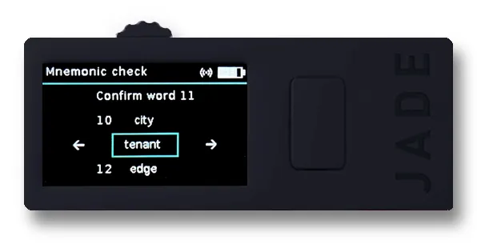
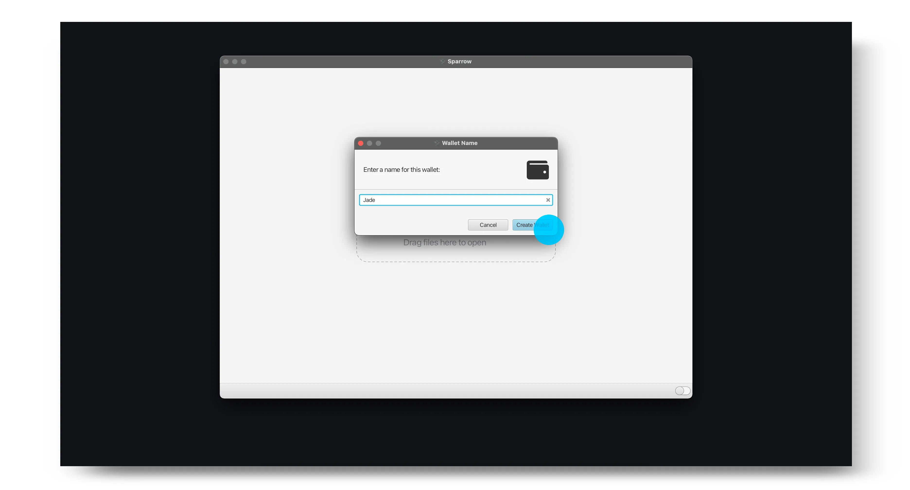

## Video hướng dẫn


Blockstream Jade - Ví cứng Bitcoin di động HƯỚNG DẪN ĐẦY ĐỦ bởi BTCsession

## Hướng dẫn viết đầy đủ


### Điều kiện tiên quyết

1. Tải xuống phiên bản mới nhất của Blockstream Green.

2. Cài đặt trình điều khiển này để đảm bảo Jade được máy tính của bạn nhận diện.

### Thiết lập trên máy tính


Mở Blockstream Green, sau đó nhấp vào logo Blockstream dưới mục Thiết bị.


Kết nối Jade với máy tính của bạn bằng cáp USB đi kèm.

> Lưu ý: Nếu Jade không được máy tính của bạn nhận diện, hãy chắc chắn tải trình điều khiển được tìm thấy trong hướng dẫn ở đây.

Khi Jade xuất hiện trong Green, cập nhật Jade bằng cách nhấp vào Kiểm tra cập nhật và chọn phiên bản firmware mới nhất. Sử dụng bánh xe cuộn hoặc chuyển đổi trên Jade để xác nhận và tiếp tục với việc cập nhật. Đảm bảo Jade của bạn vẫn hiển thị nút "Khởi tạo", nếu không bạn sẽ phải chờ sau khi thiết lập Jade để nâng cấp. Sử dụng nút quay lại để trở lại màn hình này nếu cần.


Sau khi bạn đã cập nhật firmware của Jade, chọn Thiết lập Jade trên mạng và chính sách bảo mật bạn muốn sử dụng.

> Mẹo: Chính sách bảo mật được liệt kê dưới mục Loại trên màn hình đăng nhập dưới đây. Nếu bạn không chắc chọn Singlesig hay Multisig Shield, vui lòng xem hướng dẫn của chúng tôi ở đây. (https://help.blockstream.com/hc/en-us/articles/4403642609433)


Tiếp theo, chọn tạo Ví mới và chọn 12 từ để tạo cụm từ khôi phục của bạn. Nhấp vào Nâng cao sẽ cung cấp cho bạn tùy chọn của cụm từ khôi phục 12 và 24 từ.


Ghi lại cụm từ khôi phục ngoại tuyến trên giấy (hoặc sử dụng thiết bị sao lưu cụm từ khôi phục chuyên dụng để tăng cường bảo mật). Sau đó, sử dụng bánh xe hoặc chuyển đổi ở đầu Jade của bạn để xác minh cụm từ khôi phục của bạn. Bước này đảm bảo bạn đã ghi chúng một cách chính xác.



Thiết lập và xác nhận mã PIN sáu chữ số của bạn. Điều này được sử dụng để mở khóa Blockstream Jade mỗi khi bạn đăng nhập vào ví của mình.


Bây giờ, chỉ cần chọn Đi tới Ví trên ứng dụng Green trên máy tính và bạn sẽ thấy ví của mình mở trên Blockstream Green. Blockstream Jade cũng sẽ hiển thị rằng nó đã Sẵn sàng! Bạn có thể bắt đầu sử dụng Jade của mình để gửi và nhận giao dịch Bitcoin.


Sau khi bạn đã sử dụng ví xong, ngắt kết nối Blockstream Jade khỏi thiết bị của bạn. Lần sau bạn muốn sử dụng ví trên Blockstream Jade, chỉ cần kết nối lại thiết bị của bạn và làm theo các hướng dẫn.

nguồn: https://help.blockstream.com/hc/en-us/articles/17478506300825

### Phụ lục A - Xác minh tệp tải xuống Ví Green

Xác minh tải xuống có nghĩa là kiểm tra xem tệp bạn đã tải xuống có bị chỉnh sửa kể từ khi được nhà phát triển phát hành hay không.

Chúng ta làm điều này bằng cách kiểm tra rằng chữ ký (được tạo ra bởi khóa riêng của nhà phát triển) cùng với tệp đã tải xuống và khóa công khai của nhà phát triển trả về kết quả ĐÚNG khi qua hàm gpg –verify. Tôi sẽ hướng dẫn bạn cách làm tiếp theo. Nếu bạn muốn tìm hiểu lý do đằng sau điều này, tôi có hướng dẫn này và hướng dẫn khác.

Đầu tiên, chúng ta lấy khóa ký:
Dành cho Linux, mở terminal và chạy lệnh này (bạn chỉ cần sao chép và dán văn bản, bao gồm cả dấu ngoặc kép):
```bash
gpg --keyserver keyserver.ubuntu.com --recv-keys "04BE BF2E 35A2 AF2F FDF1 FA5D E7F0 54AA 2E76 E792"
```

Dành cho Mac, bạn làm tương tự, ngoại trừ việc bạn cần tải và cài đặt GPG Suite trước.

Dành cho Windows, bạn cũng làm tương tự, ngoại trừ việc bạn cần tải và cài đặt GPG4Win trước.

Bạn sẽ nhận được một thông báo cho biết khóa công khai đã được nhập.


Hình ảnh này có thuộc tính alt trống; tên file của nó là image-3-1024x162.webp

Tiếp theo, chúng ta cần lấy file chứa hash của phần mềm. Nó được lưu trữ trên trang GitHub của Blockstream. Đầu tiên, hãy truy cập vào trang thông tin của họ tại đây, và nhấp vào liên kết cho "desktop". Bạn sẽ được chuyển đến trang phát hành mới nhất trên GitHub và tại đó bạn sẽ thấy một liên kết đến file SHA256SUMS.asc, đây là một tài liệu văn bản chứa hash được Blockstream công bố của chương trình mà chúng ta đã tải về.


GitHub:


Không cần thiết, nhưng sau khi lưu vào đĩa, tôi đã đổi tên "SHA256SUMS.asc" thành "SHA256.txt" để dễ dàng mở file trên Mac bằng trình soạn thảo văn bản. Đây là nội dung của file:


Văn bản mà chúng ta đang tìm kiếm nằm ở phía trên. Tùy thuộc vào file nào chúng ta đã tải về, có một đầu ra hash tương ứng mà sau này chúng ta sẽ so sánh.

Phần dưới của tài liệu chứa chữ ký được tạo trên thông điệp phía trên - đó là một file hai trong một.

Thứ tự không quan trọng, nhưng trước khi kiểm tra hash, chúng ta sẽ kiểm tra xem thông điệp hash có thật sự chính xác (tức là không bị can thiệp).

Mở terminal. Bạn cần phải ở trong thư mục chính xác nơi file SHA256SUMS.asc đã được tải về. Giả sử bạn đã tải nó vào thư mục "Downloads", đối với Linux và Mac, thay đổi thư mục như sau (phân biệt chữ hoa chữ thường):

```bash
cd Downloads
```

Tất nhiên, bạn phải nhấn <enter> sau những lệnh này. Đối với Windows, mở CMD (command prompt), và gõ cùng một thứ (mặc dù nó không phân biệt chữ hoa chữ thường).

Đối với Windows và Mac, bạn cần phải đã tải và cài đặt GPG4Win và GPG Suite, tương ứng, như đã được hướng dẫn trước đó. Đối với Linux, gpg đi kèm với Hệ điều hành. Từ Terminal (hoặc CMD cho Windows), gõ lệnh này:

```bash
gpg --verify SHA256SUMS.asc
```

Cách viết chính xác của tên file (màu đỏ) có thể khác nhau vào ngày bạn tải file, vì vậy hãy đảm bảo lệnh phù hợp với tên file như đã tải về. Bạn sẽ nhận được đầu ra này, và bỏ qua cảnh báo về chữ ký đáng tin cậy - điều đó chỉ có nghĩa là bạn chưa thủ công thông báo cho máy tính rằng bạn tin tưởng khóa công khai mà chúng ta đã nhập trước đó.


Hình ảnh này có thuộc tính alt trống; tên file của nó là image-4-1024x165.webp

Đầu ra này xác nhận chữ ký là tốt, và chúng ta có thể tin tưởng rằng khóa riêng của "info@greenaddress.it" đã ký dữ liệu (báo cáo hash).
Bây giờ chúng ta nên băm (hash) tệp zip đã tải xuống và so sánh kết quả với thông tin được công bố. Lưu ý rằng trong tệp SHA256SUMS.asc, có một đoạn văn bản nói “Hash: SHA512” khiến tôi bối rối, vì tệp rõ ràng chứa các đầu ra SHA256, vì vậy tôi sẽ bỏ qua điều đó.

Đối với Mac và Linux, mở terminal, điều hướng đến nơi tệp zip được tải xuống (có lẽ bạn cần gõ “cd Downloads” một lần nữa, trừ khi bạn chưa đóng terminal kể từ đó). Nhân tiện, bạn luôn có thể kiểm tra thư mục bạn đang ở bằng cách gõ PWD (“print working directory), và nếu tất cả những điều này là mới mẻ, thì việc xem một video ngắn trên YouTube bằng cách tìm kiếm “cách điều hướng hệ thống tệp Linux/Mac/Windows” sẽ hữu ích.

Để băm tệp, gõ lệnh này:

```bash
shasum -a 256 BlockstreamGreen_MacOS_x86_64.zip
```

Bạn nên kiểm tra xem tệp của mình được gọi chính xác là gì và chỉnh sửa văn bản màu xanh ở trên nếu cần.

Bạn sẽ nhận được một đầu ra như thế này (của bạn sẽ khác nếu tệp khác với tôi):


Tiếp theo, so sánh trực quan đầu ra băm với những gì có trong tệp SHA256SUMS.asc. Nếu chúng khớp, thì –> THÀNH CÔNG! Xin chúc mừng.

nguồn: https://armantheparman.com/jade/

### Sử dụng trên Sparrow

Nếu bạn đã biết cách sử dụng Sparrow thì quy trình như mọi khi:

> Lưu ý: quy trình tương tự như với Specter chẳng hạn

Tải xuống Sparrow bằng cách sử dụng liên kết được cung cấp ở đây.


Nhấp vào Next để theo dõi hướng dẫn thiết lập và tìm hiểu về các tùy chọn kết nối khác nhau.


Chọn máy chủ mong muốn sau đó chọn Tạo Ví Mới.


Nhập tên cho ví của bạn và nhấp vào Tạo Ví.



Chọn chính sách và loại kịch bản mong muốn sau đó chọn Kết Nối Ví Phần Cứng.

> Lưu ý: Nếu bạn đã từng sử dụng Blockstream Jade như một ví Singlesig với Blockstream Green và muốn xem các giao dịch của mình trong Sparrow, hãy đảm bảo loại kịch bản phù hợp với loại tài khoản chứa tiền của bạn trong Green. Bạn cũng cần đường dẫn phái sinh phù hợp.


Cắm Blockstream Jade của bạn và nhấp vào Scan. Sau đó, bạn sẽ được yêu cầu nhập PIN trên Jade.

> Mẹo: Trước khi kết nối Jade của bạn, hãy đảm bảo ứng dụng Blockstream Green không được mở. Nếu Green đang mở, điều này có thể gây ra vấn đề với việc Jade được phát hiện trong Sparrow.


Chọn Import Keystore để nhập khóa công khai của tài khoản mặc định, hoặc chọn mũi tên để chọn thủ công đường dẫn phái sinh bạn muốn sử dụng.


Sau khi khóa mong muốn của bạn đã được nhập, nhấp vào Apply.


Bây giờ bạn đã thiết lập ví thành công và bạn có thể bắt đầu nhận, lưu trữ và chi tiêu bitcoin của mình sử dụng Sparrow và Blockstream Jade.

> Lưu ý: Nếu bạn trước đây đã sử dụng Jade với Blockstream Green như một ví Multisig Shield, bạn không nên mong đợi ví Sparrow mới của mình hiển thị cùng một số dư - đây là các ví khác nhau. Để truy cập lại ví Multisig Shield của bạn, chỉ cần kết nối lại Jade của bạn với Blockstream Green.


nguồn: https://help.blockstream.com/hc/en-us/articles/7559912660761-How-do-I-use-Blockstream-Jade-with-Sparrow-

### ứng dụng green
nếu bạn thích sử dụng trên di động, bạn có thể sử dụng nó với blockstream green
- Cách thiết lập Blockstream Jade với Green | Blockstream Jade - https://youtu.be/7aacxnc6DHg

- Cách nhận bitcoin vào ví Jade | Blockstream Jade - https://youtu.be/CVtcDdiPqLA