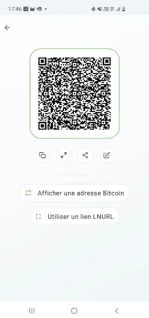
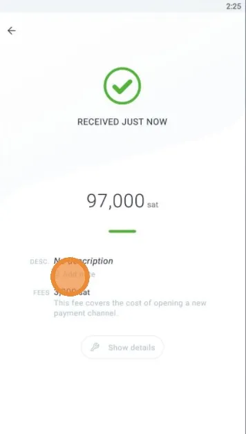
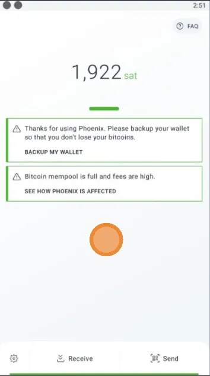

## Introduction

Phoenix is a non-custodial lightning wallet created by Acinq, the team behind the Lightning Eclair implementation.

Keep in mind that Phoenix is a mobile app focused on Lightning payments, but still supporting on-chain payments, through integrated swaps. This means that any on-chain deposit into Phoenix, will be swaped instantly into a Lightning channel. 

Also if you want to send to an on-chain address, Phoenix will the swap do internally from your LN channel to the on-chain destination. Be aware, all these swaps have a cost, because involve an on-chain fee.

Bellow in the "Getting started guide" section we will walk through the setup process and also explain more about how to manage the lightning liquidity with Phoenix.

## Important resources
- Phoenix Official webpage - [https://phoenix.acinq.co](https://phoenix.acinq.co)
- Documentation / FAQ page - [https://phoenix.acinq.co/faq](https://phoenix.acinq.co/faq)
- [Github Page](https://github.com/ACINQ/phoenix/) | [Github Releases page](https://github.com/ACINQ/phoenix/releases) (download directly the apk)
- [Support and discussions](https://github.com/ACINQ/phoenix/discussions)
- [Acinq Blog](https://acinq.co/blog) - announcements

## Video Tutorial

## Getting Started Guide

Here is a step-by-step guide how to start with Phoenix, setup, make / receive payments, manage the liquidity, backup / restore process.

### Download & Set Up
You can download and install Phoenix from: [App Store](https://apps.apple.com/us/app/phoenix-wallet/id1544097028) | [Google Play Store](https://play.google.com/store/apps/details?id=fr.acinq.phoenix.mainnet) | [Direct download apk](https://github.com/ACINQ/phoenix/releases)

Follow the instructions starting with the Welcome screen, step by step.

You will be informed about automatic lightning channels creation.
Starting with v2.0 is a major upgrade that brings "splicing" to Phoenix:
- single dynamic channel,
- no more 1% fee on inbound liquidity
- better predictability and control
- trustless swaps

Check [Phoenix blog post](https://acinq.co/blog/phoenix-splicing-update) for more details, especially the new fee model.

### Liquidity quick guide

So once you receive / deposit sats into this wallet, automatically it will open channels with ACINQ node. Usually the size of the channels will be slightly bigger than the amount you deposited. So you will always have a new channel for each deposit, except that when you have not totally drained channel and you receive a smaller payment, it will be refilled.

For Phoenix Lightning liquidity we would suggest the following scenario:

With the new version v0.2.0 the new LN feature splicing. That means from now on you will not have to deal anymore with lots of new small channels for each payment received.

If there’s not enough inbound liquidity, Phoenix will increase the size of your initial channel, but that will still imply an onchain fee. You can setup that fee anyways in Phoenix settings, payment options and fees.

So we suggest to start using Phoenix with a big channel, like 1-3-5M sats. Your commit fees will be insignificant comparing with the size of the channel and will not affect you too much. Also instead of paying 4-5 times (or whatever how many times you deposit small amounts) a min 3000 sats fee for each deposit, you will pay only once the opening channel fee.

If you start spending from that channel, do not spend it all, because Phoenix will close it. 

If you leave some sats in the channel and make another refill from another LN wallet / deposit source, we have two situations to consider:
- with a new deposit amount bigger than you channel capacity, Phoenix will resize the channel and you will pay an extra fee.
- with a new deposit amount lower than your channel capacity, will be no fees involved.

So try to size your initial channel capacity to your personal needs for spending. Spend and replace in the limits of the channel will not occur anymore fees and the experience using this wallet app will be smooth.

### Back-up
In the following screen you will be informed that Phoenix app will generate a seed phrase as backup for your wallet. Later these seed words MUST be saved in a safe place!

The following screen indicate if you want to create a new wallet or restore a previously wallet, from seed phrase.

Once the new wallet is created, you are alerted that you should do the backup of the seed phrase. Click on "Backup wallet" button.

You will be alerted that these words from the seed are very important and sensitive and you should keep them private.

These seed words you MUST save them into a safe place, like a password manager ([KeePass](https://keepass.info/) or [Bitwarden](https://bitwarden.com/)), keeping the database of this password manager into an offline USB encrypted stick for total safety.

### Receive payments

Before you start receiving please read the above chapter "Liquidity Quick Guide".

So now, you are ready to receive sats into your Phoenix wallet!

To receive a payment, in Phoenix you have the following options:
- by using the displayed QR code, representing an "empty" Lightning invoice
- by editing the Lightning invoice (see the edit button bellow the QR code), where you can add an amount of sats, add a comment displayed to the payer
- by using / scanning a LNURL-withdraw QR code
- by generating an on-chain Bitcoin address from your Phoenix wallet. Remember that this payment will be "converted" into a new Lightning channel (if you do not open one yet) or resizing an existing Lightning channel.

Screen displayed to edit a new Lightning invoice and generate a new QR code for it:

This is the screen where you can generate an on-chain BTC address and informed that the payment to this address will be "converted" into lightning liquidity and involve some fees.

Once the payment was done, will be displayed a confirmation screen, all done!

Optional you could add a personal note to each received payment. These notes are not saved anywhere else, are kept only in your device. If you restore your Phoenix wallet, these notes will not be restored. This is a useful feature to keep track of your sent and received payments.

### Send payments

To send payments is quite simple process, just click on the mainb screen button "Send"

You will be prompted to allow Phoenix app to access the device camera, to be able to scan QR codes.

In the payment screen you have 3 options:
- scan a QR code from a receiver Lightning invoice / LNURL
- manually input (paste it), Lightning Address input or LNURL-pay code
- load a QR image from local disk

As you can see in this screen, the payment request was scanned and the details are already filled in. You just have to press "Pay" button.

Once the payment is sent and confirmed, will be displayed a confirmation screen with short details of the payment, including the fee pais. If you want to see more payment details, click on "Details" button.

In the details screen, you can see the technical details of the payment, including: payment hash and request, preimage, destination node and duration. Sometimes these details are useful to track payments, debug or identify with the receiver a specific payment.

### Settings

In the Settings menu, is not too much to do, Phoenix goes for simplicity. But one important aspect here is the menu for managing the payments channels and fees, where you can set your desired levels of fees. Keep in mind that in a mempool high fees enviornment you should not use very low fees, otherwise your payments and opening channels will be disrupted and/or fail.

Other options in the Settings menu:
- Display - to switch to different color themes
- Electrum server - to check the status of Electrum server to which you are connected or specify one
- Tor - if you want to use Phoenix behind Tor network
- App access settings - set permissions for Phoenix to specific device services
- Recovery phrase - if you want to check the seed words and/or make a new backup
- Channels list - display the status of your Lightning channels and liquidity (in/out) available
- Logs - display debugging logs
- Close all channels - Dangerous option that should be used ONLY in case you want to shut down indefinitelly your Phoenix node and recover the funds into your onchain address. That address later can be retrived using Electrum wallet, using your Phoenix seed phrase.

### Reset

If you are in a situation that your Phoneix app is having troubles (not making payments, not connecting to Electrum servers, cannot receive payments) or you simply want to move it to another device, you MUST be sure of two aspects:
- have a backup of your seed phrase
- stop the app in your device - go to app details and force stop the service
- uninstall it from the old device if you want to move it to a new one
- DO NOT run the same Phoenix wallet on multiple devices!

Once you re-install it or install it on the new devices, click on the "Restore" button and follow the instructions

You cannot use other type of seed, generated from other wallet apps. [See more details here](https://walletsrecovery.org/) about other wallet types and their type of seed and derivation path. Not all are compatible!

You must introduce the seed words previosuly saved, one by one, in the specific order. Once you finish to introduce the 12 words, click the "Import" button and done.

In few moments you will see your previous balance displayed. Also you will have the alert to make the backup of your seed. You can just go to the menu and select "I saved the backup" if you already did it.

Done! Happy Lightning!
