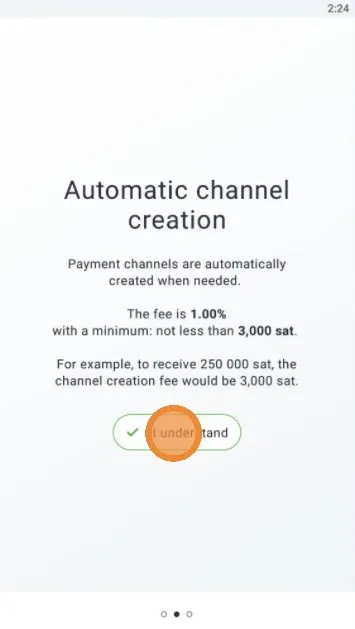
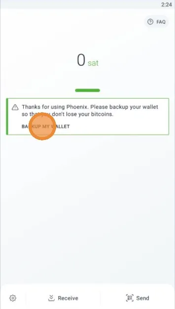
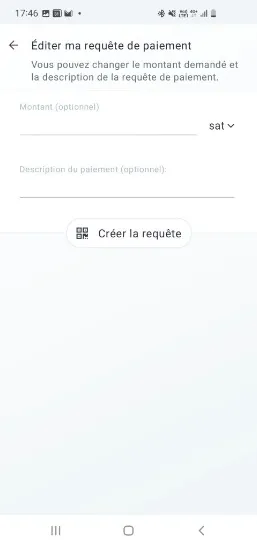
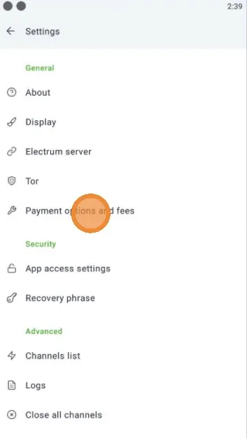

## Giới thiệu

Phoenix là một ví lightning không giữ tiền (non-custodial) được tạo bởi Acinq, đội ngũ đứng sau việc triển khai Lightning Eclair.

Hãy nhớ rằng Phoenix là một ứng dụng di động tập trung vào thanh toán Lightning, nhưng vẫn hỗ trợ thanh toán trên chuỗi, thông qua việc chuyển đổi tích hợp. Điều này có nghĩa là bất kỳ khoản gửi tiền trên chuỗi nào vào Phoenix, sẽ được chuyển đổi ngay lập tức thành một kênh Lightning.

Nếu bạn muốn gửi đến một địa chỉ trên chuỗi, Phoenix sẽ thực hiện việc chuyển đổi nội bộ từ kênh LN của bạn sang đích trên chuỗi. Lưu ý, tất cả các lần chuyển đổi này đều có chi phí, vì chúng liên quan đến phí trên chuỗi.

Dưới đây, trong phần "Hướng dẫn bắt đầu" chúng tôi sẽ hướng dẫn quá trình thiết lập và giải thích thêm về cách quản lý tính thanh khoản của lightning với Phoenix.

## Tài nguyên quan trọng
- Trang web chính thức của Phoenix - [https://phoenix.acinq.co](https://phoenix.acinq.co)
- Trang tài liệu / Câu hỏi thường gặp - [https://phoenix.acinq.co/faq](https://phoenix.acinq.co/faq)
- [Trang Github](https://github.com/ACINQ/phoenix/) | [Trang phát hành Github](https://github.com/ACINQ/phoenix/releases) (tải trực tiếp apk)
- [Hỗ trợ và thảo luận](https://github.com/ACINQ/phoenix/discussions)
- [Blog Acinq](https://acinq.co/blog) - thông báo

## Hướng dẫn Video

## Hướng dẫn Bắt Đầu

Dưới đây là hướng dẫn từng bước cách bắt đầu với Phoenix, thiết lập, thực hiện / nhận thanh toán, quản lý tính thanh khoản, quá trình sao lưu / khôi phục.

### Tải về & Thiết lập
Bạn có thể tải và cài đặt Phoenix từ: [App Store](https://apps.apple.com/us/app/phoenix-wallet/id1544097028) | [Google Play Store](https://play.google.com/store/apps/details?id=fr.acinq.phoenix.mainnet) | [Tải trực tiếp apk](https://github.com/ACINQ/phoenix/releases)

Theo dõi các hướng dẫn bắt đầu từ màn hình Chào mừng, từng bước một.

Bạn sẽ được thông báo về việc tạo kênh lightning tự động.
Bắt đầu với phiên bản 2.0 là một nâng cấp lớn mang lại "splicing" cho Phoenix:
- một kênh động duy nhất,
- không còn phí 1% cho tính thanh khoản đầu vào
- khả năng dự đoán và kiểm soát tốt hơn
- chuyển đổi không cần tin cậy

Kiểm tra [bài đăng trên blog Phoenix](https://acinq.co/blog/phoenix-splicing-update) để biết thêm chi tiết, đặc biệt là mô hình phí mới.

### Hướng dẫn nhanh về Tính thanh khoản

Vì vậy, một khi bạn nhận / gửi sats vào ví này, tự động nó sẽ mở kênh với nút ACINQ. Thông thường, kích thước của các kênh sẽ lớn hơn một chút so với số tiền bạn đã gửi. Vì vậy, bạn sẽ luôn có một kênh mới cho mỗi khoản gửi, trừ khi khi bạn chưa hoàn toàn dùng hết kênh và bạn nhận được một khoản thanh toán nhỏ hơn, nó sẽ được nạp lại.

Đối với tính thanh khoản Lightning của Phoenix, chúng tôi sẽ đề xuất kịch bản sau:

Với phiên bản mới v0.2.0 có tính năng LN mới là splicing. Điều này có nghĩa là từ bây giờ bạn sẽ không phải đối mặt với việc có nhiều kênh nhỏ mới cho mỗi khoản thanh toán nhận được nữa.

Nếu không đủ tính thanh khoản đầu vào, Phoenix sẽ tăng kích thước của kênh ban đầu của bạn, nhưng điều đó vẫn đòi hỏi một phí trên chuỗi. Bạn có thể thiết lập phí đó trong cài đặt Phoenix, tùy chọn thanh toán và phí.
Vì vậy, chúng tôi đề xuất bạn bắt đầu sử dụng Phoenix với một kênh lớn, như 1-3-5M sats. Phí cam kết của bạn sẽ không đáng kể so với kích thước của kênh và sẽ không ảnh hưởng quá nhiều đến bạn. Thay vì phải trả 4-5 lần (hoặc bất kỳ bao nhiêu lần bạn nạp số lượng nhỏ) một phí tối thiểu 3000 sats cho mỗi lần nạp, bạn chỉ cần trả một lần phí mở kênh.

Nếu bạn bắt đầu chi tiêu từ kênh đó, đừng tiêu hết, vì Phoenix sẽ đóng nó.

Nếu bạn để lại một số sats trong kênh và thực hiện một lần nạp tiền khác từ một ví LN khác / nguồn nạp tiền khác, chúng ta có hai tình huống cần xem xét:
- với một số tiền nạp mới lớn hơn sức chứa kênh của bạn, Phoenix sẽ điều chỉnh kích thước kênh và bạn sẽ phải trả một khoản phí bổ sung.
- với một số tiền nạp mới nhỏ hơn sức chứa kênh của bạn, sẽ không có phí nào được tính.

Vì vậy, hãy cố gắng điều chỉnh sức chứa kênh ban đầu theo nhu cầu chi tiêu cá nhân của bạn. Chi tiêu và thay thế trong giới hạn của kênh sẽ không phát sinh thêm phí và trải nghiệm sử dụng ứng dụng ví này sẽ trở nên mượt mà.

### Sao lưu
Trong màn hình tiếp theo, bạn sẽ được thông báo rằng ứng dụng Phoenix sẽ tạo một cụm từ hạt giống làm sao lưu cho ví của bạn. Sau này, những từ hạt giống này PHẢI được lưu trữ ở một nơi an toàn!

Màn hình tiếp theo chỉ ra nếu bạn muốn tạo một ví mới hoặc khôi phục một ví trước đó, từ cụm từ hạt giống.

Một khi ví mới được tạo, bạn sẽ được cảnh báo rằng bạn nên sao lưu cụm từ hạt giống. Nhấp vào nút "Sao lưu ví".

Bạn sẽ được cảnh báo rằng những từ từ cụm từ hạt giống này rất quan trọng và nhạy cảm và bạn nên giữ chúng ở chế độ riêng tư.

Những từ hạt giống này bạn PHẢI lưu chúng vào một nơi an toàn, như một trình quản lý mật khẩu ([KeePass](https://keepass.info/) hoặc [Bitwarden](https://bitwarden.com/)), giữ cơ sở dữ liệu của trình quản lý mật khẩu này trên một ổ USB mã hóa ngoại tuyến để đảm bảo an toàn tuyệt đối.

### Nhận thanh toán

Trước khi bạn bắt đầu nhận, vui lòng đọc phần "Hướng dẫn Nhanh về Tính thanh khoản" ở trên.

Vậy giờ đây, bạn đã sẵn sàng nhận sats vào ví Phoenix của mình!

Để nhận một khoản thanh toán, trong Phoenix bạn có các lựa chọn sau:
- bằng cách sử dụng mã QR được hiển thị, đại diện cho một hóa đơn Lightning "trống"
- bằng cách chỉnh sửa hóa đơn Lightning (xem nút chỉnh sửa dưới mã QR), nơi bạn có thể thêm một số lượng sats, thêm một bình luận hiển thị cho người thanh toán
- bằng cách sử dụng / quét mã QR LNURL-withdraw
- bằng cách tạo một địa chỉ Bitcoin trên chuỗi từ ví Phoenix của bạn. Hãy nhớ rằng khoản thanh toán này sẽ được "chuyển đổi" thành một kênh Lightning mới (nếu bạn chưa mở một kênh) hoặc điều chỉnh kích thước một kênh Lightning hiện có.

Màn hình hiển thị để chỉnh sửa một hóa đơn Lightning mới và tạo mã QR mới cho nó:

Đây là màn hình nơi bạn có thể tạo một địa chỉ BTC trên chuỗi và được thông báo rằng khoản thanh toán đến địa chỉ này sẽ được "chuyển đổi" thành tính thanh khoản lightning và liên quan đến một số phí.

Một khi khoản thanh toán được thực hiện, một màn hình xác nhận sẽ được hiển thị, tất cả đã xong!

Bạn có thể thêm một ghi chú cá nhân cho mỗi khoản thanh toán nhận được. Những ghi chú này không được lưu trữ ở bất cứ đâu khác, chỉ được giữ trên thiết bị của bạn. Nếu bạn khôi phục ví Phoenix của mình, những ghi chú này sẽ không được khôi phục. Đây là một tính năng hữu ích để theo dõi các khoản thanh toán đã gửi và nhận.

### Gửi thanh toán

Quá trình gửi thanh toán khá đơn giản, chỉ cần nhấp vào nút "Send" trên màn hình chính

Bạn sẽ được yêu cầu cho phép ứng dụng Phoenix truy cập camera của thiết bị, để có thể quét mã QR.

Trong màn hình thanh toán, bạn có 3 lựa chọn:
- quét mã QR từ hóa đơn Lightning của người nhận / LNURL
- nhập thủ công (dán), nhập địa chỉ Lightning hoặc mã LNURL-pay
- tải một hình ảnh QR từ đĩa cục bộ

Như bạn có thể thấy trên màn hình này, yêu cầu thanh toán đã được quét và các chi tiết đã được điền vào. Bạn chỉ cần nhấn nút "Pay".

Một khi thanh toán được gửi và xác nhận, một màn hình xác nhận với các chi tiết ngắn gọn của khoản thanh toán, bao gồm cả phí đã trả. Nếu bạn muốn xem thêm chi tiết về thanh toán, nhấp vào nút "Details".

Trong màn hình chi tiết, bạn có thể thấy các chi tiết kỹ thuật của khoản thanh toán, bao gồm: hash thanh toán và yêu cầu, preimage, nút đích và thời gian. Đôi khi những chi tiết này hữu ích để theo dõi thanh toán, gỡ lỗi hoặc xác định với người nhận một khoản thanh toán cụ thể.

### Cài đặt

Trong menu Cài đặt, không có quá nhiều việc phải làm, Phoenix hướng tới sự đơn giản. Nhưng một khía cạnh quan trọng ở đây là menu quản lý các kênh thanh toán và phí, nơi bạn có thể thiết lập các mức phí mong muốn của mình. Hãy nhớ rằng trong một môi trường mempool với phí cao, bạn không nên sử dụng phí quá thấp, nếu không các khoản thanh toán và việc mở kênh của bạn sẽ bị gián đoạn và/hoặc thất bại.

Các tùy chọn khác trong menu Cài đặt:
- Hiển thị - để chuyển đổi giữa các chủ đề màu sắc khác nhau
- Máy chủ Electrum - để kiểm tra trạng thái của máy chủ Electrum mà bạn đang kết nối hoặc chỉ định một máy chủ
- Tor - nếu bạn muốn sử dụng Phoenix qua mạng Tor
- Cài đặt truy cập ứng dụng - thiết lập quyền cho Phoenix đối với các dịch vụ thiết bị cụ thể
- Cụm từ khôi phục - nếu bạn muốn kiểm tra các từ khóa hạt giống và/hoặc tạo một bản sao lưu mới
- Danh sách kênh - hiển thị trạng thái của các kênh Lightning của bạn và tính thanh khoản (vào/ra) có sẵn
- Nhật ký - hiển thị nhật ký gỡ lỗi
- Đóng tất cả các kênh - Tùy chọn nguy hiểm chỉ nên sử dụng TRONG TRƯỜNG HỢP bạn muốn tắt vĩnh viễn nút Phoenix của mình và khôi phục các quỹ vào địa chỉ onchain của bạn. Địa chỉ đó sau đó có thể được truy xuất sử dụng ví Electrum, bằng cách sử dụng cụm từ hạt giống Phoenix của bạn.

### Đặt lại

Nếu bạn đang trong tình huống mà ứng dụng Phoneix của bạn gặp rắc rối (không thực hiện được thanh toán, không kết nối được với máy chủ Electrum, không nhận được thanh toán) hoặc bạn đơn giản muốn chuyển nó sang một thiết bị khác, bạn PHẢI chắc chắn về hai khía cạnh:
- có bản sao lưu của cụm từ hạt giống của bạn
- dừng ứng dụng trên thiết bị của bạn - đi đến chi tiết ứng dụng và buộc dừng dịch vụ
- gỡ cài đặt nó khỏi thiết bị cũ nếu bạn muốn chuyển nó sang một thiết bị mới
- KHÔNG chạy cùng một ví Phoenix trên nhiều thiết bị!

Một khi bạn cài đặt lại hoặc cài đặt nó trên các thiết bị mới, nhấp vào nút "Restore" và làm theo hướng dẫn

Bạn không thể sử dụng loại hạt giống khác, được tạo từ các ứng dụng ví khác. [Xem thêm chi tiết tại đây](https://walletsrecovery.org/) về các loại ví khác và loại hạt giống cũng như đường dẫn phái sinh của chúng. Không phải tất cả đều tương thích!

Bạn phải nhập các từ hạt giống đã lưu trước đó, từng từ một, theo đúng thứ tự. Sau khi bạn nhập xong 12 từ, nhấn vào nút "Nhập khẩu" và xong.

Trong vài phút, bạn sẽ thấy số dư trước đó của mình được hiển thị. Bạn cũng sẽ nhận được cảnh báo để sao lưu hạt giống của mình. Bạn chỉ cần vào menu và chọn "Tôi đã lưu sao lưu" nếu bạn đã làm điều đó.

Xong! Chúc mừng! Hãy thưởng thức Lightning!