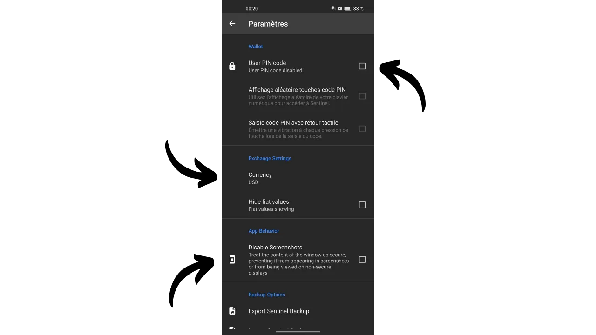
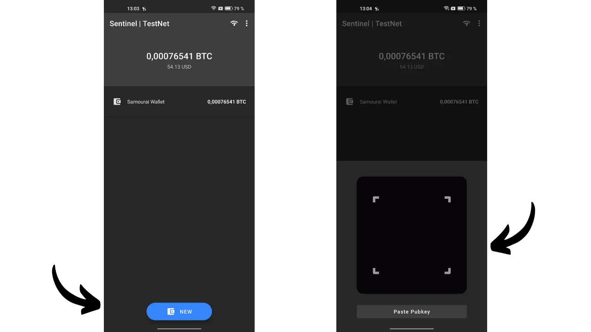
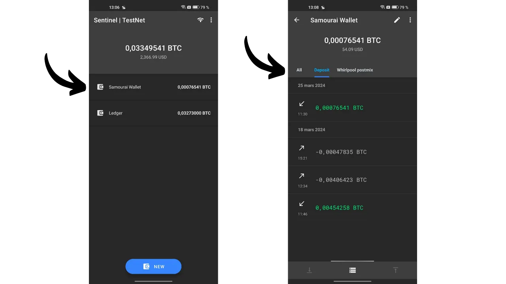
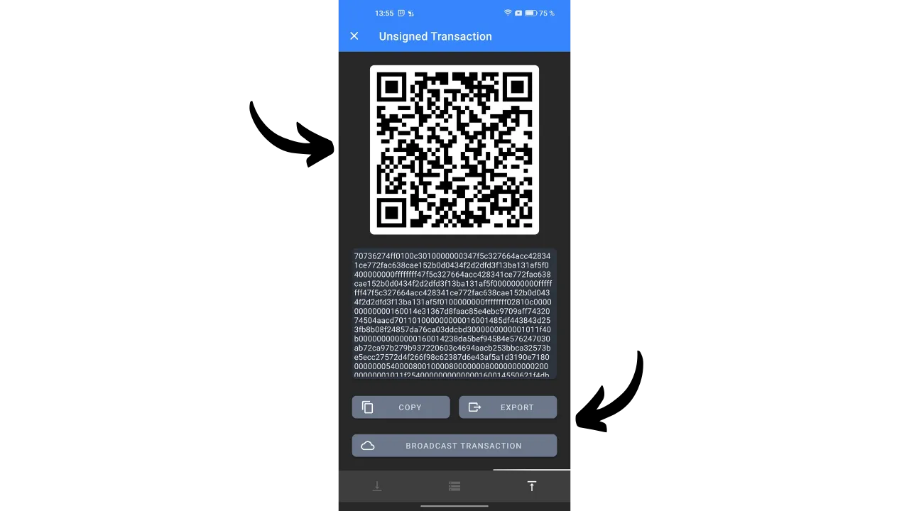
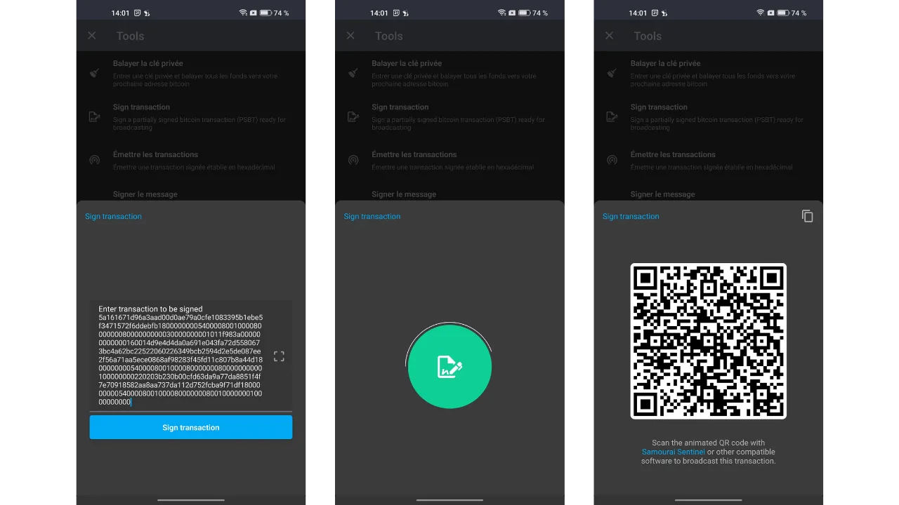
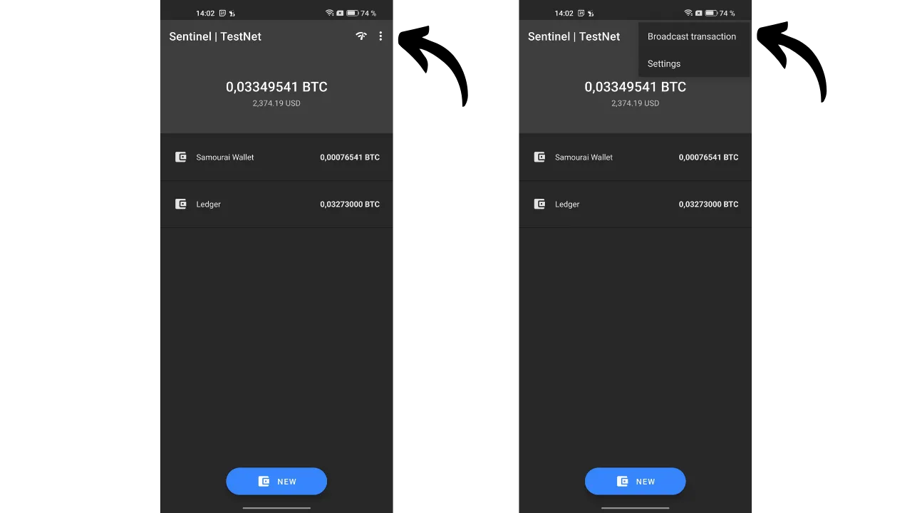

---

***ATTENTION :** Suite à l'arrestation des fondateurs de Samourai Wallet et à la saisie de leurs serveurs le 24 avril dernier, l'application Sentinel fonctionne toujours, mais **il faut obligatoirement utiliser son propre Dojo** pour pouvoir avoir les informations de la blockchain et diffuser des transactions.*

_Nous suivons de près l'évolution de cette affaire ainsi que les développements concernant les outils associés. Soyez assuré que nous mettrons ce tutoriel à jour au fur et à mesure que de nouvelles informations seront disponibles._

_Ce tutoriel est fourni à des fins éducatives et informatives uniquement. Nous ne cautionnons ni n'encourageons l'utilisation de ces outils à des fins criminelles. Il est de la responsabilité de chaque utilisateur de respecter les lois en vigueur dans sa juridiction._

---

*"Keep your private keys, private."*

Dans cet article, nous explorons tout ce qu'il faut savoir sur les portefeuilles watch-only. Nous abordons leur fonctionnement et étudions les différentes applications disponibles sur le marché. Enfin, nous vous proposons un tutoriel détaillé sur l'une des applications de portefeuille watch-only les plus populaires : Sentinel.

## C'est quoi un Watch-Only Wallet ?
Un portefeuille en lecture seule, ou watch-only wallet, est un type de logiciel conçu pour permettre à l'utilisateur d'observer les transactions associées à une ou plusieurs clés publiques Bitcoin spécifiques, sans pour autant avoir accès aux clés privées correspondantes.

Ce type d'application conserve uniquement les données nécessaires à la surveillance d'un portefeuille Bitcoin, notamment pour voir son solde et son historique des transactions, mais elle n'a pas accès aux clés privées. Ainsi, il est impossible de dépenser les bitcoins détenus par le portefeuille sur l'application watch-only.

On utilise généralement le watch-only en conjonction avec un portefeuille matériel (hardware wallet). Celui-ci va permettre de stocker les clés privées du portefeuille « à froid », sur un matériel non connecté à internet, qui dispose d'une infime surface d'attaque, ce qui isole les clés privées des environnements potentiellement vulnérables. L'application watch-only, elle, stocke exclusivement la clé publique étendue (`xpub`, `zpub`, etc.) du portefeuille Bitcoin. Cette clé parente ne permet pas de trouver les clés privées associées et, par conséquent, ne permet pas de dépenser les bitcoins. Toutefois, elle permet la dérivation des clés publiques enfants et des adresses de réception. Grâce à la connaissance des adresses du portefeuille sécurisé par le hardware wallet, l'application watch-only peut suivre ces transactions sur le réseau Bitcoin, ce qui offre à l'utilisateur la possibilité de surveiller son solde et de générer de nouvelles adresses de réception, sans avoir à connecter à chaque fois son hardware wallet.

## Quel Watch-Only Wallet utiliser ?
À l'heure actuelle, l'application de watch-only la plus complète est [Sentinel](https://sentinel.watch/), développée par les équipes de Samourai Wallet. Elle regroupe l'ensemble des fonctionnalités essentielles pour un bon portefeuille watch-only :
- Support des clés étendues, des clés publiques et des adresses ;
- Possibilité de classer plusieurs comptes ou portefeuilles dans des collections ;
- Génération d'adresse pour recevoir des bitcoins sur son hardware wallet sans nécessiter son emploi direct ;
- Possibilité de construire et de diffuser des transactions hors-ligne ;
- Option de connexion à son propre nœud Bitcoin ;
- Intégration de Tor pour une confidentialité accrue.

Les uniques inconvénients de Sentinel résident dans le fait que l'application est exclusivement disponible pour Android et qu'elle ne supporte pas les portefeuilles multisignatures. Par conséquent, si vous possédez un appareil Android et que votre portefeuille est un single sig classique, je vous recommande Sentinel.

Pour ceux qui désirent tracer un portefeuille multisignatures, Blue Wallet est la seule application que je connaisse offrant un mode watch-only pour ces types de portefeuilles, et elle est accessible tant sur Android qu'iOS.

Pour les utilisateurs d'iOS à la recherche d'une alternative à Sentinel, [Green Wallet](https://blockstream.com/green/) ou [Blue Wallet](https://bluewallet.io/watch-only/) peuvent être des options, bien que leur fonctionnalité de watch-only ne soit pas aussi complète que celle de Sentinel.

## Comment utiliser le Watch-Only Wallet Sentinel ?
### Installation et paramétrage
Commencez par installer l'application Sentinel. Vous pouvez le faire soit depuis le Google Play Store, soit à l'aide de l'[APK disponible au téléchargement sur le site web officiel](https://sentinel.watch/download/).

Lors de la première ouverture de l'application, on vous propose de choisir entre :
- `Connect to Dojo` ;
- `Connect to Samourai's server`.

Dojo, développé par les équipes de Samourai, est une version de nœud complet Bitcoin qui peut être installée de manière autonome ou ajoutée en un clic sur des solutions node-in-box telles que [Umbrel](https://umbrel.com/) et [RoninDojo](https://ronindojo.io/).

[**-> Découvrir comment installer RoninDojo v2 sur un Raspberry Pi.**](https://planb.network/fr/tutorials/node/ronin-dojo-v2)

Si vous disposez de votre propre Dojo, vous pouvez le connecter à cette étape. De cette manière, vous bénéficierez du plus haut niveau de confidentialité lors de la consultation des informations de vos transactions sur le réseau Bitcoin.

Dans le cas contraire, il est possible d'opter pour le serveur par défaut de Samourai. Vous pouvez également choisir de vous connecter via Tor ou non.

Vous arriverez ensuite sur la page principale de Sentinel.

Pour commencer, vous pouvez paramétrer l'application. Cliquez sur les trois petits points en haut à droite, puis sur `Settings`.

En sélectionnant `User PIN code`, vous avez la possibilité d'établir un mot de passe afin de sécuriser l'accès à votre portefeuille watch-only. Il vous est également possible de modifier la devise de référence pour la conversion de vos soldes en monnaie fiduciaire, ou encore de masquer les valeurs en fiat en activant l'option `Hide fiat values`. Pour une sécurité accrue, vous pouvez activer `Disable Screenshots`, ce qui empêche toute capture d'écran de votre application Sentinel et évite ainsi toute divulgation d'informations sur un écran externe.

Dans ce menu de paramètres, vous avez également la possibilité de faire une sauvegarde de votre Sentinel.

### Utilisation du wallet Watch-Only
Depuis la page d'accueil, appuyez sur le bouton bleu `NEW` afin d'ajouter une nouvelle clé publique étendue à tracer. Vous avez ensuite la possibilité de scanner le QR code de votre clé, ou de coller directement la clé (`xpub`, `zpub`...) en sélectionnant `Paste Pubkey`.

En règle générale, la `xpub` de votre portefeuille est accessible directement via le logiciel de gestion de portefeuille que vous utilisez. Par exemple, dans le cas où vous gérez votre hardware wallet avec Sparrow, cette information se trouve dans l'onglet `Settings`, sous la rubrique `Keystore`.

Après avoir saisi la clé publique étendue dans Sentinel, l'application vous propose de créer une nouvelle collection. Une collection représente un ensemble de clés publiques étendues organisées ensemble. Cette option vous offre la possibilité de ne pas simplement lister toutes vos `xpub`, mais de les classer de manière ordonnée. Par exemple, si vous possédez un Samourai Wallet avec plusieurs comptes (dépôt, premix, postmix...), vous pouvez rassembler tous ces comptes sous la collection `Samourai`. Pour des portefeuilles gérés pour votre famille, vous pourriez créer une collection nommée `Famille`.

Sélectionnez `Create new collection`. Saisissez ensuite un nom pour la clé étendue que vous venez d'intégrer. Par exemple, si je scanne le compte de dépôt de mon portefeuille Samourai, je nommerai cette clé `Deposit`. Cliquez sur `SAVE` pour finaliser.

Ensuite, attribuez un nom à cette collection et appuyez sur l'icône de validation située en haut à droite de l'écran pour sauvegarder la collection. Votre collection est désormais visible sur l'écran d'accueil de Sentinel.

Si vous souhaitez ajouter une autre clé publique étendue, cliquez de nouveau sur `NEW` puis entrez votre clé. 

On vous proposera ensuite de choisir la collection dans laquelle vous désirez intégrer cette clé, ou d'en créer une nouvelle. Par exemple, dans mon cas, j'ai constitué une collection spécifiquement pour mon portefeuille Ledger.

Pour voir en détail les clés étendues d'une collection, il suffit de cliquer dessus. Vous pourrez ensuite naviguer dans les différents onglets pour voir l'historique des transactions.

Depuis une collection, en tapant sur les trois petits points en haut à droite, puis sur `View Unspent Outputs`, vous pouvez accéder à une liste des UTXO détenus par le portefeuille tracé.

### Envoi et réception de bitcoins depuis Sentinel
Comme tout bon portefeuille watch-only, Sentinel vous permet de générer des adresses de réception pour recevoir des bitcoins sur le portefeuille tracé. Mais Sentinel offre également une autre fonctionnalité avancée : la création et la diffusion d'une transaction Bitcoin partiellement signée (PSBT). Ainsi, le portefeuille détenteur des clés privées peut signer cette transaction, laquelle, une fois signée, peut être diffusée sur le réseau Bitcoin par Sentinel. Voyons ensemble comment faire tout cela.

**Attention, il est déconseillé de recevoir des bitcoins sur une adresse de réception non vérifiée par le portefeuille lui-même.** Si le portefeuille détenteur des clés privées, tel qu'un hardware wallet, ne vous a pas explicitement confirmé qu'une certaine adresse lui est affiliée, l'envoi de bitcoins vers cette adresse est une pratique risquée. En effet, sans cette confirmation, rien ne garantit que l'adresse appartient véritablement à votre portefeuille. Il faut donc utiliser avec prudence la fonctionnalité de réception d'un portefeuille watch-only et garder à l'esprit que les fonds envoyés peuvent potentiellement être perdus.

Pour recevoir des bitcoins via Sentinel, sélectionnez la collection qui vous intéresse, puis cliquez sur l'onglet correspondant à la clé publique étendue vers laquelle vous souhaitez transférer des fonds.

Enfin, cliquez sur l'icône de la flèche en bas à gauche de l'écran. Sentinel vous génère ensuite une adresse de réception vierge. Vous pouvez la copier, ou bien la scanner à l'aide du code QR.

Pour générer une PSBT à partir de Sentinel, et donc lancer une transaction de dépense, rendez-vous sur la clé étendue du portefeuille à partir duquel vous désirez effectuer le paiement. Prenons par exemple mon compte de dépôt sur mon portefeuille Samourai. Cliquez ensuite sur l'icône représentant une flèche située en bas à droite de l'écran.

Saisissez l'ensemble des paramètres relatifs à votre transaction :
- Indiquez l'adresse du destinataire (en cliquant sur l'icône du QR code, vous avez la possibilité de scanner cette adresse) ;
- Précisez le montant à envoyer à cette adresse ;
- Déterminez les frais de transaction.

Lorsque vous avez complété tous les champs nécessaires pour votre transaction, appuyez sur le bouton `COMPOSE UNSIGNED TRANSACTION`.

Vous accéderez alors au PSBT, qui représente une transaction Bitcoin construite, mais non signée, étant donné que Sentinel n'a pas accès à vos clés privées. Il vous est possible de copier cette transaction, de l'exporter sous forme de fichier `.psbt`, ou encore de la scanner via le code QR animé.

Rendez-vous ensuite sur votre portefeuille qui dispose des clés privées pour signer la transaction (Samourai, hardware wallet...).

Une fois la transaction signée, vous pouvez revenir sur Sentinel pour la diffuser. Pour ce faire, depuis le menu d'accueil, cliquez sur les trois petits points en haut à droite, puis sur `Broadcast transaction`.

Vous avez la possibilité de saisir votre PSBT signée de trois manières différentes :
- En la collant directement depuis votre presse-papiers ;
- En l'important à partir d'un fichier `.psbt` ;
- En la scannant via un code QR.

Une fois la transaction signée renseignée dans le cadre gris, vous pouvez cliquer sur le bouton vert `BROADCAST TRANSACTION` pour la diffuser sur le réseau Bitcoin. Sentinel vous donnera son TXID.

