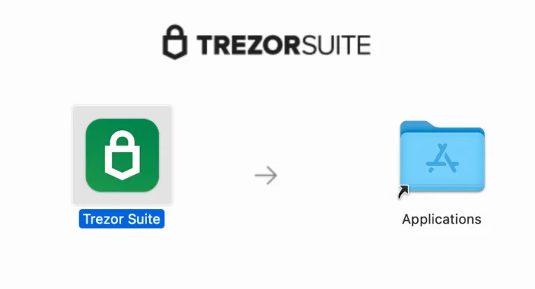
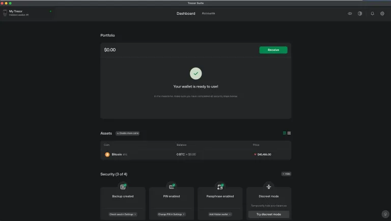

Studená hardwarová peněženka – 60€ – Začátečník – Bezpečná pro částky mezi 2 000€ a 50 000€.

Jako studená fyzická peněženka je Trezor ideální pro začátek s Bitcoinem. Je snadno použitelný, není příliš drahý a je funkční.

Už jsme vytvořili tutoriály, jak jej používat:

1. Jeho nastavení
2. Obnova bitcoinů
3. Používání, odesílání a přijímání bitcoinů

Chtěli byste mít také svůj vlastní Trezor?
Můžete přispět k projektu kliknutím níže!

nastavení -https://www.youtube.com/watch?v=q-BlT6R4_bE

obnova: https://www.youtube.com/watch?v=3n4d4egjiFM

použití : https://www.youtube.com/watch?v=syouZjLC1zY

## průvodce psaním

průvodce navržený https://armantheparman.com/trezor/

## Nastavení Trezoru

Trezor je dodáván s vlastním mikro USB kabelem. Ujistěte se, že používáte tento a ne jen nějaký starý kabel, co máte po ruce. Některé USB kabely slouží pouze k napájení. Tento přenáší data I napájení. Pokud použijete zařízení s USB kabelem pro nabíjení telefonu, zařízení se nemusí spojit.

Připojte jej k počítači a zařízení se zapne. Objeví se zpráva, která říká „Přejděte na Trezor.io/start“. Udělejte to a stáhněte si Trezor Suite do svého počítače.


Klikněte na tlačítko ke stažení („Get Desktop App“)


Všimněte si odkazů na Podpis a Klíč pro podepisování. Pro ověření stažení (zkontrolujte, že vaše stažení nebylo manipulováno), existují další kroky, které jsou volitelné, pokud začínáte, ale POVINNÉ, pokud máte významné bohatství k zabezpečení. Instrukce k tomu jsou v Příloze A (konec průvodce)

Připojte Trezor k počítači pomocí mikro USB kabelu a nainstalujte a spusťte program. Takto to vypadá na Macu:



Po spuštění programu dostanete hloupé varování, prostě pokračujte:


Klikněte na Nastavit Trezor


Pokud je firmware zastaralý, dovolte Trezoru aktualizovat firmware.

Dále můžete vytvořit nové seed nebo obnovit peněženku z jiného zařízení se seedem, který již máte. Projdu si vytvoření nového seedu.


Klikněte na „Vytvořit novou peněženku“ – a potvrďte, že to chcete udělat na samotném zařízení kliknutím na tlačítko potvrzení.

Poté klikněte na jedinou možnost „Standardní záloha seedu“


Poté klikněte na „vytvořit zálohu“


Klikněte na tři zaškrtávací políčka, aby se zbarvila zeleně (samozřejmě si přečtěte každou zprávu), a poté klikněte na „začít zálohu“.


Dále uvidíte toto:


Na zařízení si poznamenejte slova, která se vám jedno po druhém zobrazují, PEČLIVĚ a VE SPRÁVNÉM POŘADÍ.


Nastavte PIN pro uzamčení zařízení (to není součást vašeho seedu, je to jen pro uzamčení zařízení, aby do něj nikdo nemohl získat přístup k seedu uvnitř).


Máte možnost přidat do své peněženky shitcoiny – naléhavě vás žádám, abyste to nedělali, a šetřili pouze v Bitcoinu, jak vysvětluji zde (proč bitcoin) a zde (proč pouze bitcoin).


Pojmenujte svou peněženku a klikněte na „Přístup k Suite“:


Nejjednodušší je vytvořit peněženku bez heslové fráze, ale nejlepší je vytvořit jednu s heslovou frází (vaše skutečná peněženka) A jednu bez heslové fráze (vaše návnadová peněženka). Při každém přístupu k zařízení prostřednictvím Trezor Suite budete dotázáni, zda chcete heslovou frázi „použít“ nebo ne.


Vybral jsem „Skrytou peněženku“ a zadal heslovou frázi, kterou jsem si vymyslel „craigwrightisaliarandafraud“


Líbí se mi, že se tomu říká „skrytá“ peněženka, protože to částečně vysvětluje, jak heslové fráze fungují.

Potvrďte heslovou frázi na zařízení.

Protože tato peněženka je prázdná, byl jsem požádán, abych potvrdil, že heslová fráze je správná:


Poté vás budou dotazovat, zda si přejete povolit označování. Něco, co jsem neprozkoumal, ale zní to jako způsob, jak můžete označovat své transakce a ukládat data do svého počítače nebo cloudu.


Nakonec bude vaše peněženka dostupná:



To, co máte na svém počítači, se nazývá „sledovací peněženka“, protože obsahuje vaše veřejné klíče (a adresy), ale ne vaše soukromé klíče. K utrácení (podepisováním transakcí soukromými klíči) potřebujete soukromé klíče. Způsob, jak to udělat, je připojením hardwarové peněženky. Smyslem hardwarové peněženky je, že transakce mohou být předávány tam a zpět mezi počítačem a Trezorem, podpis může být aplikován uvnitř Trezoru a soukromý klíč vždy zůstává uvnitř zařízení (pro ochranu proti počítačovým malware).

Trezor Suite je pro různé důvody špatná sledovací peněženka. Pro základní potřeby to stačí, ale pokud chcete pokročit, čtěte dál a naučte se, jak zařízení připojit k Sparrow Bitcoin Wallet.

## Sledovací peněženka

V předchozích článcích jsem vysvětlil, jak stáhnout a ověřit Sparrow Bitcoin Wallet a jak jej připojit k vlastnímu uzlu nebo veřejnému uzlu. Můžete postupovat podle těchto návodů:

- Nainstalujte Bitcoin Core
- Nainstalujte Sparrow Bitcoin Wallet
- Připojte Sparrow Bitcoin Wallet k Bitcoin Core

Alternativou k použití Sparrow Bitcoin Wallet je Electrum Desktop Wallet, ale budu pokračovat ve vysvětlování Sparrow Bitcoin Wallet, protože ho považuji za nejlepší pro většinu lidí. Pokročilí uživatelé mohou jako alternativu použít Electrum (viz můj návod).

Nyní Sparrow načteme a připojíme Trezor (s výchozí frází, ale nyní s heslovou frází). Tato peněženka nikdy nebyla vystavena Trezor Suite, protože bude vytvořena PO připojení zařízení k Trezor Suite. Ujistěte se, že ji k Trezor Suite nikdy znovu nepřipojíte, abyste nevystavili svou novou peněženku. (Můžete ji připojit bez heslové fráze, protože to může být vaše návnadová peněženka).

Vytvořte novou peněženku:


Pojmenujte ji nějak pěkně


Klikněte na „Připojená hardwarová peněženka“.


Klikněte na „Scan“ a poté na další obrazovce na „set passphrase“, abyste vytvořili zcela novou peněženku (použijte zcela novou heslovou frázi, například starou heslovou frázi s číslem na konci by to mělo fungovat). Poté „send passphrase“, poté to potvrďte na zařízení.


Poté klikněte na „import keystore“.

Na další obrazovce není co upravovat, Trezor to za vás vyplnil. Klikněte na „Apply“


Další obrazovka vám umožní přidat heslo. Nepřekládejte to s „passphrase“; mnoho lidí to udělá. Název je bohužel nešťastný. Heslo vám umožní zamknout tuto peněženku na vašem počítači. Je specifické pro tento software na tomto počítači. Není součástí vašeho soukromého klíče Bitcoinu.

Klikněte na „Apply“


Po pauze, kdy počítač přemýšlí, uvidíte, že tlačítka vlevo změní barvu z šedé na modrou. Gratulujeme, vaše peněženka je nyní připravena k použití. Provádějte a odesílejte transakce, jak jen chcete.


Přijímání

Chcete-li přijmout nějaké bitcoiny, přejděte na kartu Adresy vlevo a vyberte jednu z adres pro přijetí. Stačí kliknout pravým tlačítkem na adresu, kterou chcete, a vybrat „copy address“. Poté přejděte na burzu, odkud se peníze posílají, a vložte ji tam. Nebo můžete adresu poskytnout zákazníkovi, který ji může použít k zaplacení.

Při prvním použití peněženky byste měli přijmout velmi malou částku, zkuste ji utratit na jinou adresu, buď v rámci peněženky nebo zpět na burzu, abyste ověřili, že peněženka funguje podle očekávání.

Jakmile to uděláte, musíte zálohovat slova, která jste si zapsali. Jedna kopie nestačí. Mějte alespoň dvě papírové kopie (kov je lepší) a uchovávejte je na dvou různých, dobře zabezpečených místech. To snižuje riziko, že přírodní katastrofa zničí vaše HWW a papírovou zálohu v jednom incidentu. Viz „Používání hardwarových peněženek Bitcoin“ pro úplnou diskusi na toto téma.

## Odesílání


Při provádění platby musíte do pole „Pay to“ vložit adresu, na kterou platíte. Ve skutečnosti nemůžete pole Label nechat prázdné, je to jen pro záznamy vaší vlastní peněženky, ale Sparrow to nedovolí – stačí zadat cokoli (uvidí to jen vy). Zadejte částku a můžete také ručně upravit poplatek, který chcete.

Peněženka nemůže transakci podepsat, pokud není HWW připojeno. To je úkol HWW – přijmout transakci, podepsat ji a vrátit ji podepsanou. Ujistěte se, že když podepisujete na zařízení, vizuálně kontrolujete, že adresa, na kterou platíte, je stejná na zařízení a na obrazovce počítače, a fakturu, kterou obdržíte (např. jste mohli obdržet e-mail s platbou na určitou adresu).

Také si dejte pozor, pokud se rozhodnete použít minci, která je větší než částka platby, pak zbytek bude odeslán zpět na jednu z vašich adres pro změnu peněženky. Někteří lidé to nevěděli a vyhledali svou transakci na veřejném blockchainu a mysleli si, že nějaké bitcoiny byly odeslány na adresu útočníka, ale ve skutečnosti to byla jejich vlastní adresa pro změnu.
Firmware

Pro aktualizaci firmware potřebujete připojit k Trezor Suite. Pokud to chcete udělat, ujistěte se, že máte k dispozici záložní slova a heslovou frázi pro obnovení zařízení, pro případ, že by se zařízení resetovalo.
Závěr
Tento článek vám ukázal, jak používat Trezor HWW bezpečněji a soukroměji, než je inzerováno – ale tento článek sám o sobě není dostatečný. Jak jsem řekl na začátku, měli byste jej kombinovat s informacemi poskytnutými v "Používání Bitcoin Hardware Peněženek".

## Příloha A - Ověření stažení softwaru


Stáhněte si Podpis (textový soubor) a Klíč pro podepisování (textový soubor) a zaznamenejte si názvy souborů a místo, kam jste soubor stáhli.

Dále pro Mac budete potřebovat stáhnout GPG Suite (viz instrukce zde).

Pro Windows budete potřebovat GPG4win (viz instrukce zde).

Pro Linux je GPG již součástí každého balíčku. Pokud jej nemáte, získejte jej příkazem: sudo apt-get install gpg

Dále pro Mac/Windows nebo Linux otevřete terminál a zadejte příkaz:

```bash
gpg –import XXXXXXXXXX
```

kde XXXXXXXXXX je úplná cesta k souboru s klíčem pro podepisování (úplná cesta znamená adresář a název souboru, kde se soubor nachází). Měli byste vidět potvrzení o úspěšném importu klíče.

Poté

```bash
gpg –verify ZZZZZZZZZZ WWWWWWWWWW
```

kde ZZZZZZZZZZ je úplná cesta k souboru s podpisem a WWWWWWWWWW je úplná cesta k programu Trezor Suite, který jste stáhli.

Měli byste vidět zprávu „Good signature from SatoshiLabs“ někde ve výstupu. Na konci je varování, které je bezpečné ignorovat.