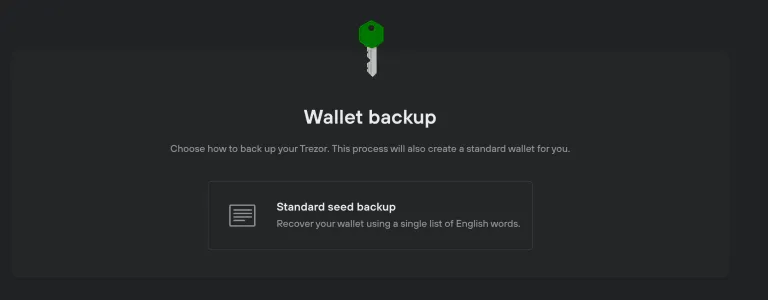
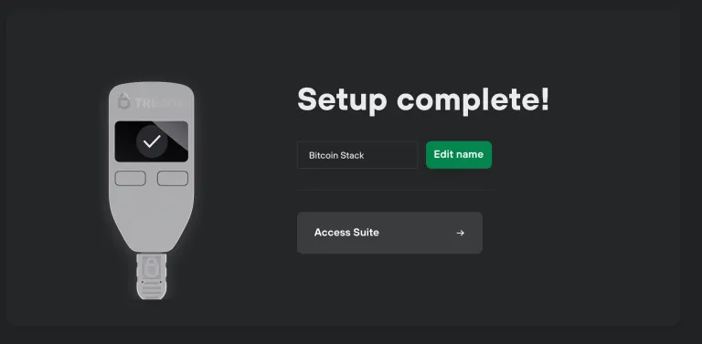

Kaltlager-Hardware-Portfolio – 60€ – Anfänger – Sicher zwischen 2 000€ und 50 000€.

Als kalte physische Brieftasche ist der Trezor ideal für den Einstieg in Bitcoin. Er ist einfach zu bedienen, nicht zu teuer und funktional.

Wir haben bereits Anleitungen zur Verwendung erstellt:

1. Einrichtung
2. Wiederherstellung von Bitcoins
3. Verwendung, Senden und Empfangen von Bitcoins

Möchten Sie auch Ihren eigenen Trezor haben?
Sie können zum Projekt beitragen, indem Sie unten auf den Link klicken!

Einrichtung - https://www.youtube.com/watch?v=q-BlT6R4_bE

Wiederherstellung: https://www.youtube.com/watch?v=3n4d4egjiFM

Verwendung: https://www.youtube.com/watch?v=syouZjLC1zY

## Schreibanleitung

Anleitung vorgeschlagen von https://armantheparman.com/trezor/

## Einrichtung des Trezor

Der Trezor wird mit seinem eigenen Micro-USB-Kabel geliefert. Stellen Sie sicher, dass Sie dieses verwenden und nicht einfach ein beliebiges herumliegendes Kabel. Einige USB-Kabel übertragen nur Strom. Dieses überträgt Daten UND Strom. Wenn Sie das Gerät mit einem USB-Kabel zum Aufladen von Telefonen verwenden, kann das Gerät möglicherweise keine Verbindung herstellen.

Schließen Sie es an Ihren Computer an und das Gerät wird eingeschaltet. Sie erhalten eine Nachricht, die besagt "Gehen Sie zu Trezor.io/start". Tun Sie dies und laden Sie Trezor Suite auf Ihren Computer herunter.


Klicken Sie auf die Schaltfläche "Herunterladen" ("Desktop-App erhalten")


Beachten Sie die Links für die Signatur und den Signierschlüssel. Um den Download zu überprüfen (um sicherzustellen, dass Ihr Download nicht manipuliert wurde), gibt es zusätzliche Schritte, die optional sind, wenn Sie gerade erst anfangen, aber OBLIGATORISCH, wenn Sie erheblichen Reichtum sichern möchten. Anweisungen dazu finden Sie im Anhang A (Ende der Anleitung).

Schließen Sie den Trezor mit dem Micro-USB-Kabel an den Computer an und installieren und starten Sie das Programm. So sieht es auf einem Mac aus:


Nach dem Ausführen des Programms erhalten Sie eine alberne Warnung, setzen Sie einfach fort:


Klicken Sie auf "Trezor einrichten"


Wenn die Firmware veraltet ist, erlauben Sie Trezor, die Firmware zu aktualisieren.

Als nächstes können Sie einen neuen Seed erstellen oder eine Brieftasche von einem anderen Gerät mit einem bereits vorhandenen Seed wiederherstellen. Ich werde die Erstellung eines neuen Seeds durchgehen.


Klicken Sie auf "Neue Brieftasche erstellen" - und bestätigen Sie, dass Sie dies auf dem Gerät selbst tun möchten, indem Sie auf die Bestätigungsschaltfläche klicken.

Klicken Sie dann auf die einzige Option "Standard-Saatgut-Backup"



Klicken Sie dann auf "Backup erstellen"


Klicken Sie auf die drei Häkchen, um sie grün zu machen (lesen Sie natürlich jede Nachricht) und klicken Sie dann auf "Backup beginnen".


Als nächstes sehen Sie dies:


Auf dem Gerät sehen Sie die Ihnen nacheinander präsentierten Wörter und schreiben sie ORDENTLICH und IN DER REIHENFOLGE auf.


Legen Sie eine PIN fest, um das Gerät zu sperren (dies ist kein Teil Ihres Seeds, sondern dient nur dazu, das Gerät zu sperren, damit niemand auf den darin enthaltenen Seed zugreifen kann).


Du hast die Möglichkeit, Shitcoins zu deiner Wallet hinzuzufügen - ich rate dir jedoch davon ab und empfehle, nur in Bitcoin zu sparen, wie ich hier (warum Bitcoin) und hier (warum nur Bitcoin) erkläre.


Gib deiner Wallet einen Namen und klicke auf "Access Suite":



Am einfachsten ist es, eine Wallet ohne Passphrase zu erstellen, aber es ist am besten, eine mit Passphrase (deine echte Wallet) und eine ohne Passphrase (deine Tarn-Wallet) zu erstellen. Jedes Mal, wenn du über Trezor Suite auf das Gerät zugreifst, wirst du gefragt, ob du die Passphrase "anwenden" möchtest oder nicht.


Ich habe "Hidden Wallet" ausgewählt und eine Passphrase eingegeben, die ich mir ausgedacht habe: "craigwrightisaliarandafraud"


Mir gefällt, wie es "hidden" Wallet genannt wird, da es teilweise erklärt, wie Passphrasen funktionieren.

Bestätige die Passphrase auf dem Gerät.

Da diese Wallet leer ist, wurde ich gebeten, zu bestätigen, dass die Passphrase korrekt ist:


Du wirst dann gefragt, ob du die Beschriftung aktivieren möchtest. Etwas, das ich nicht erkundet habe, aber es klingt wie eine Möglichkeit, deine Transaktionen zu beschriften und die Daten auf deinem Computer oder in der Cloud zu speichern.


Schließlich wird deine Wallet verfügbar sein:


Was du auf deinem Computer hast, wird als "watching wallet" bezeichnet, weil es deine öffentlichen Schlüssel (und Adressen), aber nicht deine privaten Schlüssel enthält. Du benötigst die privaten Schlüssel, um Ausgaben zu tätigen (indem du Transaktionen mit den privaten Schlüsseln signierst). Der Weg, dies zu tun, besteht darin, die Hardware-Wallet anzuschließen. Der Zweck der Hardware-Wallet besteht darin, dass Transaktionen zwischen dem Computer und dem Trezor hin und her übertragen werden können, eine Signatur im Trezor angewendet werden kann und der private Schlüssel immer im Gerät enthalten bleibt (zum Schutz vor Computer-Malware).

Die Trezor Suite ist aus verschiedenen Gründen eine schlechte "watching wallet". Es ist in Ordnung für das absolute Minimum, aber wenn du weiterkommen möchtest, lies weiter und erfahre, wie du das Gerät mit der Sparrow Bitcoin Wallet verbinden kannst.

## Watching Wallet

In früheren Artikeln habe ich erklärt, wie du die Sparrow Bitcoin Wallet herunterladen und überprüfen und sie mit deinem eigenen Knoten oder einem öffentlichen Knoten verbinden kannst. Du kannst diesen Anleitungen folgen:

- Bitcoin Core installieren
- Sparrow Bitcoin Wallet installieren
- Sparrow Bitcoin Wallet mit Bitcoin Core verbinden

Eine Alternative zur Verwendung der Sparrow Bitcoin Wallet ist die Electrum Desktop Wallet, aber ich werde fortfahren, die Sparrow Bitcoin Wallet zu erklären, da ich sie für die meisten Menschen als die beste einschätze. Fortgeschrittene Benutzer können Electrum als Alternative verwenden (siehe meine Anleitung).

Jetzt werden wir Sparrow starten und den Trezor (mit der Seed-Phrase, aber jetzt mit einer Passphrase) verbinden. Diese Wallet wurde noch nie mit der Trezor Suite verwendet, da sie NACHDEM wir das Gerät mit der Trezor Suite verbunden haben, erstellt wird. Stelle sicher, dass du sie niemals wieder mit der Trezor Suite verbindest, um deine neue Wallet nicht zu gefährden. (Du kannst sie ohne Passphrase verbinden, da dies deine Tarn-Wallet sein kann).

Erstelle eine neue Wallet:


Gib ihr einen hübschen Namen.


Klicke auf "Connected Hardware Wallet".


Klicke auf "Scan" und dann auf "set passphrase" auf dem nächsten Bildschirm, um eine brandneue Wallet zu erstellen (verwende eine brandneue Passphrase, z.B. die alte Passphrase mit einer Nummer dahinter würde funktionieren). Dann "send passphrase" und bestätige sie auf dem Gerät.

'

Dann klicken Sie auf "Keystore importieren".

Auf dem nächsten Bildschirm gibt es nichts zu bearbeiten, das Trezor hat es für Sie ausgefüllt. Klicken Sie auf "Anwenden".


Auf dem nächsten Bildschirm können Sie ein Passwort hinzufügen. Verwechseln Sie dies nicht mit "Passphrase"; das ist für viele Menschen verwirrend. Die Benennung ist unglücklich. Das Passwort ermöglicht es Ihnen, diese Brieftasche auf Ihrem Computer zu sperren. Es ist spezifisch für diese Software auf diesem Computer. Es ist kein Teil Ihres Bitcoin-Privatschlüssels.

Klicken Sie auf "Anwenden".


Nach einer Pause, während der Computer nachdenkt, werden die Schaltflächen auf der linken Seite von grau auf blau wechseln. Herzlichen Glückwunsch, Ihre Brieftasche ist jetzt einsatzbereit. Erstellen und senden Sie Transaktionen nach Belieben.


Empfangen

Um Bitcoin zu empfangen, gehen Sie zum Register "Adressen" auf der linken Seite und wählen Sie eine der Adressen zum Empfangen aus. Klicken Sie mit der rechten Maustaste auf die gewünschte Adresse und wählen Sie "Adresse kopieren". Gehen Sie dann zu Ihrer Börse, von der das Geld gesendet wird, und fügen Sie es dort ein. Oder Sie können die Adresse einem Kunden geben, der sie verwenden kann, um Sie zu bezahlen.

Wenn Sie die Brieftasche zum ersten Mal verwenden, sollten Sie einen sehr kleinen Betrag erhalten und ihn an eine andere Adresse ausgeben, entweder innerhalb der Brieftasche oder zurück zur Börse, um zu beweisen, dass die Brieftasche wie erwartet funktioniert.

Sobald Sie das getan haben, müssen Sie die aufgeschriebenen Wörter sichern. Eine einzige Kopie reicht nicht aus. Haben Sie mindestens zwei Papierkopien (Metall ist besser) und bewahren Sie sie an zwei verschiedenen, gut gesicherten Orten auf. Dadurch wird das Risiko verringert, dass eine Naturkatastrophe Ihre HWW und Ihre Papier-Backups in einem Vorfall zerstört. Lesen Sie "Verwendung von Bitcoin-Hardware-Brieftaschen" für eine ausführliche Diskussion dazu.

## Senden


Wenn Sie eine Zahlung vornehmen möchten, müssen Sie die Adresse, an die Sie zahlen möchten, im Feld "An" einfügen. Sie können das Label tatsächlich nicht leer lassen, es dient nur zur Aufzeichnung Ihrer eigenen Brieftasche, aber Sparrow erlaubt es nicht - geben Sie einfach etwas ein (nur Sie werden es sehen). Geben Sie den Betrag ein und Sie können auch die Gebühr manuell anpassen, die Sie möchten.

Die Brieftasche kann die Transaktion nicht signieren, es sei denn, die HWW ist verbunden. Das ist die Aufgabe der HWW - die Transaktion empfangen, sie signieren und signiert zurückgeben. Stellen Sie sicher, dass Sie beim Signieren auf dem Gerät visuell überprüfen, ob die Adresse, an die Sie zahlen, auf dem Gerät und auf dem Bildschirm des Computers identisch ist, sowie die Rechnung, die Sie erhalten (z. B. Sie haben möglicherweise eine E-Mail erhalten, um an eine bestimmte Adresse zu zahlen).

Beachten Sie auch, dass, wenn Sie eine Münze wählen, die größer ist als der Zahlungsbetrag, der Restbetrag an eine der Änderungsadressen Ihrer Brieftasche gesendet wird. Einige Leute wussten das nicht und haben ihre Transaktion in einer öffentlichen Blockchain nachgeschlagen und gedacht, dass einige Bitcoin an die Adresse eines Angreifers gesendet wurden, aber in Wirklichkeit handelte es sich um ihre eigene Änderungsadresse.
Firmware

Um die Firmware zu aktualisieren, müssen Sie sich mit Trezor Suite verbinden. Wenn Sie dies tun möchten, stellen Sie sicher, dass Sie Ihre Backup-Wörter und Passphrase zur Wiederherstellung des Geräts zur Verfügung haben, falls das Gerät zurückgesetzt wird.
Fazit

Dieser Artikel hat Ihnen gezeigt, wie Sie eine Trezor HWW auf sicherere und privaterer Weise verwenden können als beworben - aber dieser Artikel allein reicht nicht aus. Wie ich am Anfang sagte, sollten Sie ihn mit den Informationen aus "Verwendung von Bitcoin-Hardware-Brieftaschen" kombinieren.
Anhang A - Überprüfen des Software-Downloads

## Anhang A - Überprüfen des Software-Downloads


Laden Sie die Signatur (eine Textdatei) und den Signaturschlüssel (eine Textdatei) herunter und notieren Sie sich die Dateinamen und den Speicherort des Downloads.

Als Nächstes müssen Sie für Mac GPG Suite herunterladen (siehe Anweisungen hier).

Für Windows benötigen Sie GPG4win (siehe Anweisungen hier).

Für Linux ist GPG bereits in jedem Paket enthalten. Falls Sie es nicht haben, erhalten Sie es mit dem Befehl: sudo apt-get install gpg

Als Nächstes öffnen Sie das Terminal für Mac/Windows oder Linux und geben Sie den Befehl ein:

```bash
gpg –import XXXXXXXXXX
```

wobei XXXXXXXXXX der vollständige Pfad zur Signaturschlüsseldatei ist (vollständiger Pfad bedeutet das Verzeichnis und der Dateiname, wo sich die Datei befindet). Sie sollten eine Bestätigung über den erfolgreichen Import des Schlüssels sehen.

Dann

```bash
gpg –verify ZZZZZZZZZZ WWWWWWWWWW
```

wobei ZZZZZZZZZZ der vollständige Pfad zur Signaturdatei ist und WWWWWWWWWW der vollständige Pfad zum heruntergeladenen Trezor Suite-Programm ist.

Sie sollten irgendwo in der Ausgabe die Nachricht "Gültige Signatur von SatoshiLabs" sehen. Es gibt unten eine Warnung, die ignoriert werden kann.
